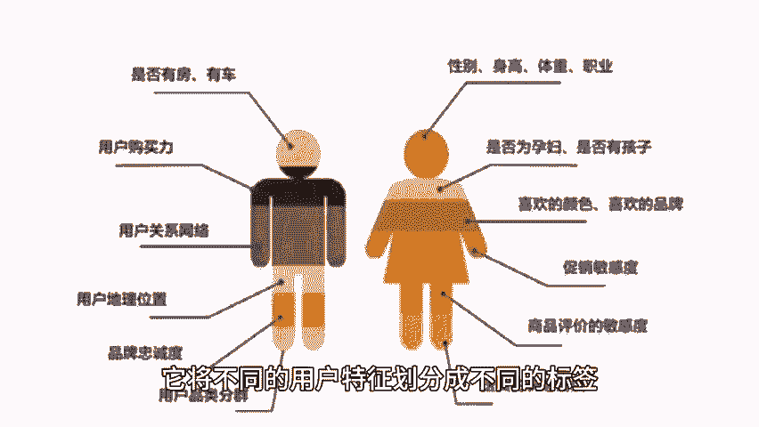
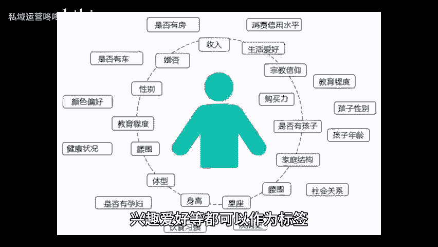
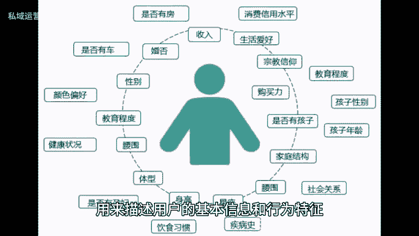

# 直接码住！运营用户画像的三个步骤 - P1 - 私域运营咚咚 - BV1vS421R7cW

🎼众所周知，构建用户画像是一个重要的工作，它可以帮助你更准确的把握用户需求，制定精准的营销策略。接下来就和大家聊聊构建用户画像的三个关键步骤。首先，数据收集与处理，可以通过多种渠道收集用户数据。

包括用户注册信息，购买行为用户反馈社交媒体数据等，收集到的数据需要进行清洗和整理，去除无用和重复信息确保数据的准确性和完整性。其次，标签体系构建标签体系是用户画像的核心组成部分。

它将不同的用户特征划分成不同的标签，形成一个完整的用户特征空间，例如年龄性别、低域职业、兴趣爱好等都可以作为标签，用来描述用户的基本信息和行为特征，同时还可以通过对用户购买行为。

浏览记录社交网络等进行深入分析，提取更加精细化的特征标签，最后，绘制用户画像，通过用户画像，我们可以深入了解用户的需求，购买决策过程和使用场景。😊。

🎼为后续的营销活动和产品设计提供有力支持，但关键要把握住用户的核心特征和关键需求，将用户画像形象化生动化，让整个团队都能够深入理解和共享。总的来说，通过用户画像可以更好的掌握用户需求。

实现精细化运营和个性化推荐。今天的内容到这里就结束了，咱们下期再见。😊。

