# 直播带货 巨量干川三步快速起号判断是否适合付费起号 巨量干川起号投放策略 起号中关注的重点数据 - P1 - 厚昌竞价讲师郝明亮 - BV1hJ4m1p77V

三连关注点赞也行。

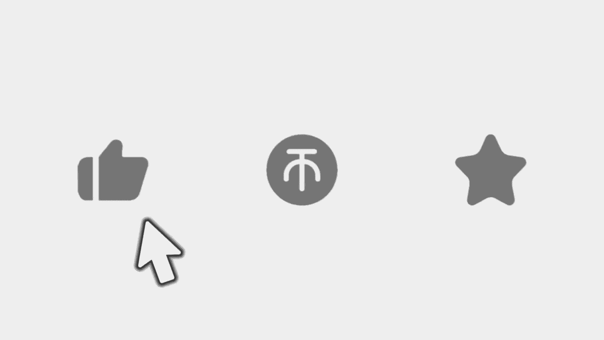

而今天呢是我们巨量千川手次的公开课啊，我们叫他分享课也好，公开课也好，因为之前的巨量全程，我从来没有说对外免费分享过内容，除了去官方去讲课，那么今天呢也是啊，在休克的期间。

给大家去分享一些关于巨量千川起号的内容啊，这节课程，这节课程千川操作上各位应该都知道啊，如果说你是老手的话，应该都知道，千川操作上的东西是非常非常简单的，很智能化的，那么今天要告诉大家三步快速起号。

更多的其实为什么说我讲起号啊，公开去讲这个旗号的东西，其实就是让大家少亏些钱，因为我刚才看到直播间评论区有很多同学啊，我想去做哪个旗号，我想去做这个旗号，但是呢很多同学连颈椎调研都没去做啊。

连续看当前市场上有哪些人，哪些品，哪些客单价在跑在直播，人家的直播形式，人家直播的人数，这些都没有调研过，你就去去投放，因为现在大家都知道啊，直播带货是一个风口，我要去做，我要去做。

但是呢你做了可能亏了很多，有没有亏的同学，有没有在直播电商直播带货这一块，抖音这一块快手也好，你亏了上百万的，我相信直播间绝对有，而今天讲的旗号其实就是给一些啊，我有一些我之前做信息流，我有一些技术。

我我要去诶投入一些，我要去做这部带货，我要去做创业的，我给大家刹刹车，往回拉一拉对吧。

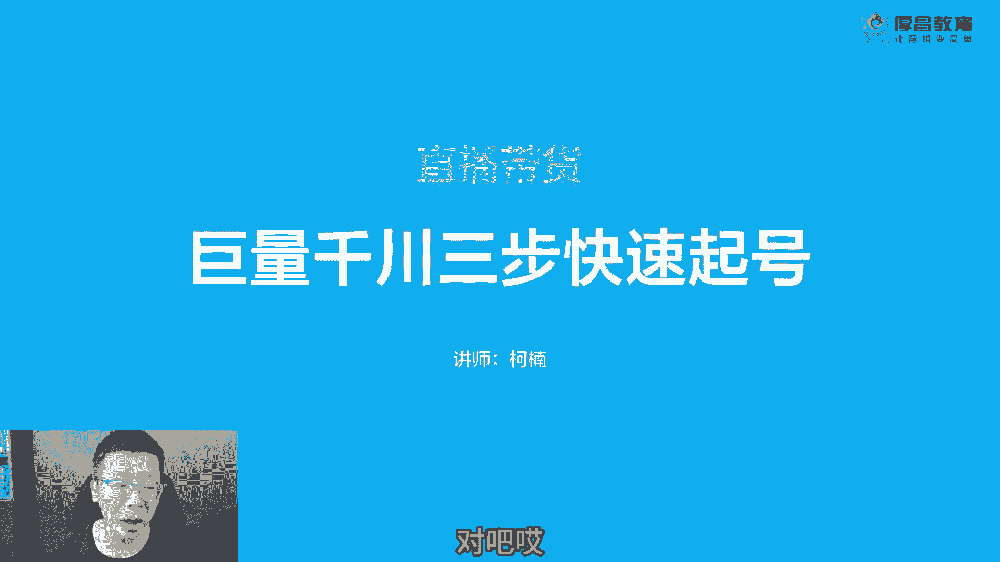

唉看哪些坑你是不能踩的对吧，来首先来看一个概念，什么是起号，各位什么是起号，一个新的抖音号，一个新的直播间，为什么说要有起号这个过程，那么起号与不起号有什么区别。

为什么说别人的号A在线好几百人甚至上千人，而我刚开始直播，我直播间连人都没有，连人都没有，为什么，因为这就需要个旗号，就比如说一个你是一个新人，别人是已经在抖音上混了好几年的人了。

人家的资源和你的资源是不平等，记住我这句话，让系统知道哪些人喜欢你的直播间，你的直播间能够创造多少的价值，对不对，第一句话，哪些人喜欢你的直播间，哪些人能在你直播间停留。

为什么今天有了大家来听我柯南对吧，去分享千川，因为可能大部分人都会对我有印象，是比较喜欢我的，喜欢在这停留，喜欢听我去讲课，然后再者第二句话，你的直播间能创造多少价值，简单点来说你能够让抖音赚多少钱。

那么就说这两个第一哪些人，第二价值，那么哪些人对应的什么，我们直播间的动作，哪些人对应的访客点击进入你的直播间，诶，一看见你的画面，我比较喜欢，我点进去了，你的短视频，我比较喜欢在你的直播间停留。

互动加粉丝团，我们经常说的这些东西对吧，而这个价值得到什么价值，其实就是最简单的掏钱嘛，掏钱为什么说有送礼，有pk的直播间，他的人也不少，为什么为什么有pk的直播间对吧。

pk的他的直播间一整就好几10万人，对不对，小杨哥对吧，他虽然有带货，但是他不带货的时候人也不少，为什么他那么多，因为有人送礼物，嘉年华对吧，一直走，再者就是购买等付费行为，那么我们要做的旗号是什么。

就是让更多的人在我的直播间去进入，去停留，去互动，去加粉丝团，喜欢我，这代表了诶你能够留住人，再者在你直播间去付费就掏钱，这是几号，有人说，那我起号和完毕和和起号完之后有什么区别。

各位你们有没有这样的问题，什么时候算我的账号标签成熟了，什么时候算我起号成功了，有没有人知道什么时候算，就是你直播间能够稳定的，有一批在线的人，你这一批在线的人可能是30多个，20多个，50多个。

也可能是100多个，甚至是上千个，能够稳定的，有一批在线的人在你直播间，而像有些同学，我可能一直只不过就没人，就没人，对不对啊，这就是你的标签成熟了，不管说你是通过付费也好，通过短视频也好。

通过自然流量的也好对吧，唉你通过付费能够带来一批人，他能够稳定的投出去，稳定的在线对吧，稳定的付费，那也算就像一些在线啊，纯付费的，比如说一些啊高客单价的，像大家电啊，一些品牌的直播间，他在线人数不多。

可能也就是二三十人，但是呢他的GMV也不少也不少，它的产出也不少，对不对啊，就是几号稳定，那么起号的方法有哪些，各位把你们所知道的一些起号的方法，打在公屏上，因为市面上其实我相信啊。

市面上讲啊讲这种直播间起号的一些内容啊，免费的课程啊，非常非常的多，你听我算算算听过最经典的七天螺旋起号，听过没有听过的，打6667天螺旋起号，对吧啊，什么清仓号对吧，什么鱼塘起号。

这是当前市面上最最经典的，就怎么说啊，流传范围最广的，对不对，都对都对对吧啊，不管说各位有没有知道应该做直播的，应该都知道清清那个什么叫青瓷，做陶瓷的，最近非常火的，是是叫青衣吗。

还是叫叫叫叫什么来着啊，难以青瓷啊，难以青瓷，突然之间忘了那个名，难以青瓷，他起号起的快不快，各位各位应该都是眼看着他起号的，对不对啊，当初他刚开始做的时候，刚开始去做那个rap的时候。

其实在我们运营圈里面就唰一下就特别火啊，眼看着他从几万的粉刷刷涨到几10万的粉，大家觉得男一青瓷他是把哪个流量做到位了，付费流量，免费流量，粉丝流量函数，哪些流量，这样的对吧，那么看我下面这句话。

咱们再说难以青瓷起号的方法，不管说哪种方法，本质是通过哪种方式获取访客，并让其留下来，甚至付费对吧，要不留下来，要不付费，来看一下这个图，我们老运营应该都知道，老头说老运营应该都非常清楚了。

我们直播间的流量来源，付费流量，自然流量，粉丝关注流量，短视频流量，搜索流量二维码，其他流量，对不对，那么我把付费做到极致，我把付费做到极致，那这就是付费起号对吧，我把自然流量起号，那是自然流量起号啊。

我关注粉丝流量，我的粉丝比较多的，比如说我是影视剪辑的对吧，我去卖我的剪辑课程，我通过这个去起号卖货，起号对吧，哎有人用短视频起号，专门做短视频起号，这个短视频几啊，短视频矩阵，对不对。

唉这四种旗号其实归根到底，你把任意一个做到极致，你把自然流量对吧，你把你的运营技巧，你把你的主播话术，你把你的场景，你把你的厂，你像那个难以青瓷，它就是自然流量，它是把整个的停留互动做到了极致，对不对。

他把直播间一进去，全是运营，对吧对吧，全是运营，把停留互动做到极致，这样我们就说大家都知道这几种方式，那么今天咱们重点去讲的付费型号好吧，既然留几号。

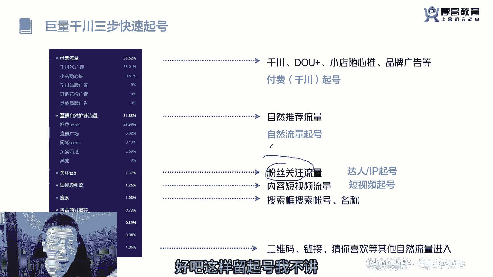

我不讲，因为我不擅长，我就擅长付费起号来，今天讲的是千川三步快速起号，三步哪三步来，第一步先判断你的品类，你的类目是否适合付费起号，对吧，是否适合付费起号，你如果说这个品类不适合付费型号，要不你起不来。

要不你起不来，要不你起来了，赔的不行，你不赚钱来吧，第二步，起号策略诶，我如果说我适合付费起号了，那么我要制定我的策略啊，通过哪种策略，哪种投放方式，哪种投放方法去跑，然后再者优化，我投放出去要看数据。

我分析数据来优化，我下一步我看我投投的对不对，我应该去优化哪里，记住这三步，先判断是否适合，然后再去做策略，再去分析数据，这是这三步，通过这三步去起号好吧，来看一下我们从这两个方向去看。

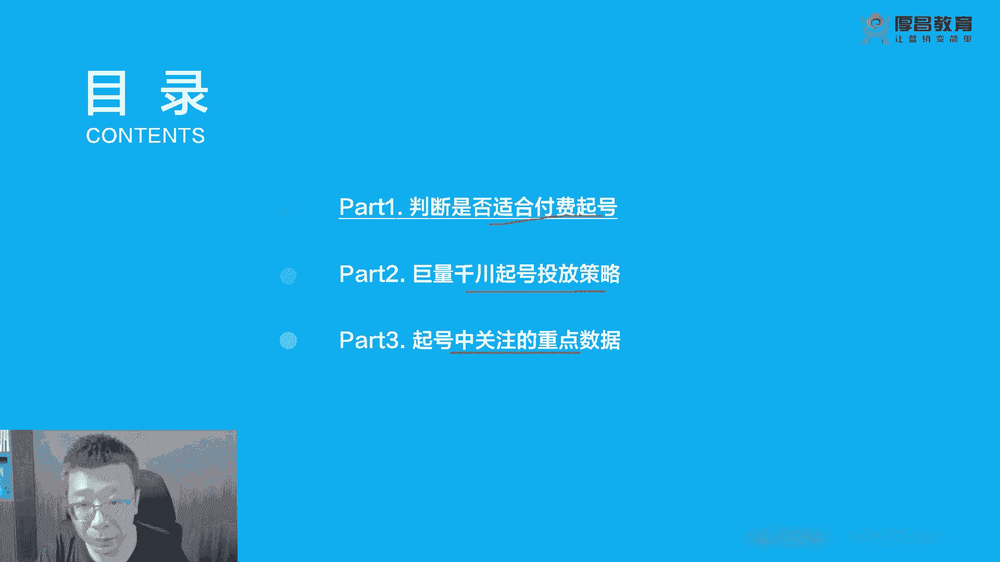

我们哪些是否适合付费，起号第一直播方式，直播方式当前比较流行的三种货款型，货款型，什么是货款型，最简单的我直播间赢有引流品，有正价款对吧，有福利品对吧，你有有这种做做引流的，做停留的，送福利的。

也有这种啊，获取利润的这种大家应该清楚叫过款型对吧，还有一种平波型，我往这一坐，巴拉巴拉说的，还有日不落型，日不落今天不说啊，日不落今天不说好吧，因为我们这儿也不做日不落，日不落其实就是平波。

类似于平波中的一种，只不过时间比较长，再者的话赛道选择啊，你是哪一个赛道的哪一个类目的，今天举三呃四呃，这是五个类目啊，五个类目咱一一看哪些类目类目里面也有区分，类目里面也不一样，好吧。

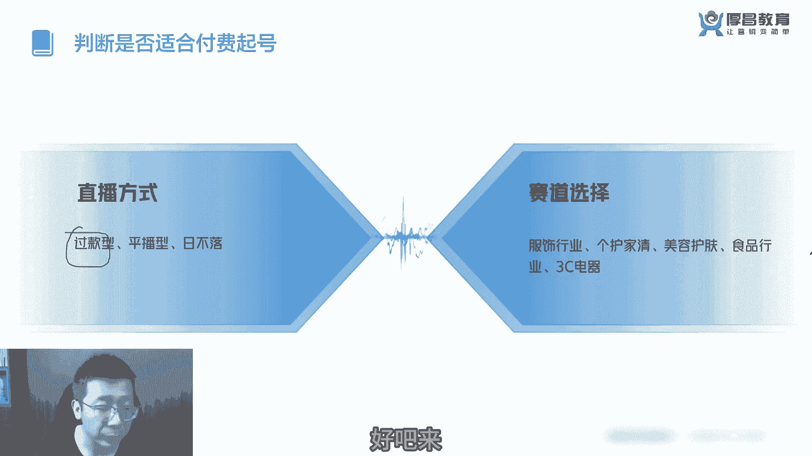

来首先看这种，来先看这个视频啊，先看这个视频，没想到没有了，没想到没有了，链接删掉了，你们买的普通杯是单边的，为什么做立体，第一浪费面料，第二它是所谓，第三它是那种太空飞机上的，太空超市的保暖黑科技。

并且这里面都是95的，大多我做的浓度很大，我怎么检测很大，看是普通收看，我刚才圈的地方，各位看我刚才圈的地方，我圈的都是哪里，有没有人看到，没想到没有了，没想到没有了，我全家都是哪里，我缺的都是哪里。

第一看评论区，第一看评论区对吧，评论区好多没抢到没抢到，这是在干嘛，这是在干嘛，没抢到对吧，说明他的一个购物车里面会有一些秒杀，以及一些别库存的，少库存的对吧，第二他往这儿塞了一个纸巾，有什么用。

有什么用，把头像挡住了，是吧好吧。

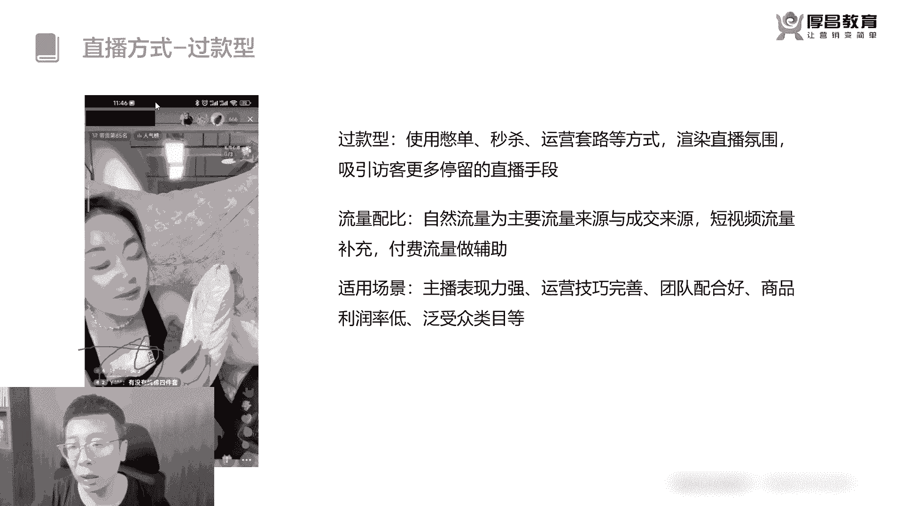

我的错，我的错。

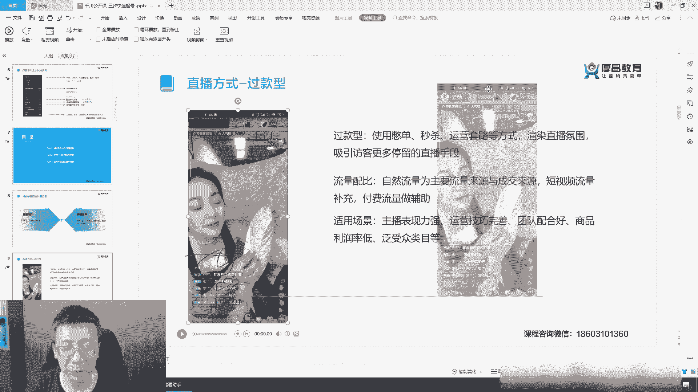

来往这边点来看，下面没想到第一个啊，咱说两个啊，咱说两个，第一个没抢到，说明他是在商品的库存上去搞了动作了，对不对，像一些福利款，他的直播间，你看他的直播间，这很大，我我怎么对吧，有600多1200啊。

家纺家纺用品这个客单价值真的高1200，像第一个第一个我记得是个1万多，周五的大多我做的工作很大对吧，第一个是2万3500，对不对，抢到了我没抢到我们福利品，没想到他是做秒杀，现在不能改价。

现在不能改价，做秒杀对不对，然后这是第一个啊，在秒杀上去做动作啊，库存和秒杀去做动作。

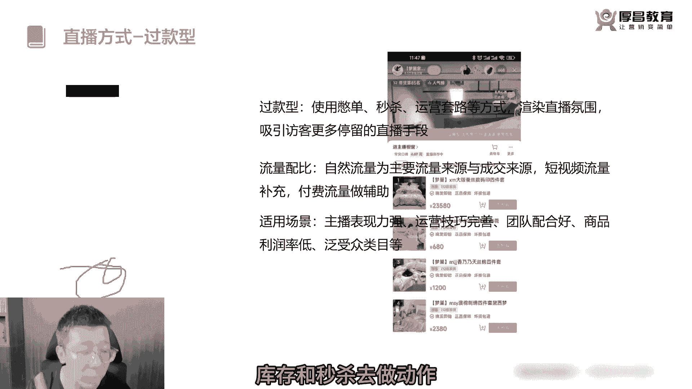

再者刚才我所说的在胸口上去塞纸巾，一方面的话是啊，有人说啊是防防被封对吧，防被封也好啊，然后也可以可不可以增加停留，可不可以增加话题，对不对，一些老色批他们会不会停留去增加互动，对不对，这都是一个方法。

这就是在通过什么啊，憋单秒杀和一些运营的套路，包括主播的身上一些我们经常有没有，各位你们有没有在直播间发现很多有做过的，做过，他们在桌子上是放什么呀，放个什么，这个是什么东西，看我头像招财猫。

看到没有很多的一个直播间。

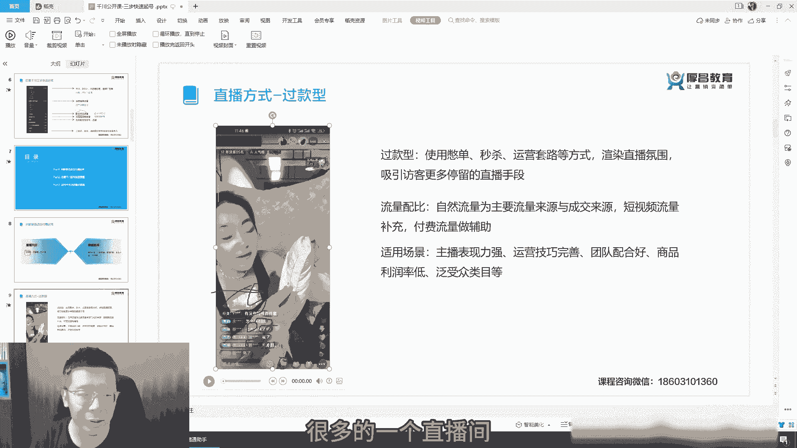

他的桌子上都会有一个小物件，都会有一个小物件，然后进去之后，这些东西也是会增加停留的，所以说像这种过款型的，他们是通过一些运营套路渲染直播间的氛围，吸引访客更多停留的手段。

所以说它更多的重视的是在停留互动这一环节，还有加粉丝团来加粉丝团，加粉丝团，今天加了粉丝，各位备注的啊，已经拍了的，一定要回来去打个拍了好吧，拍了，然后加入我的粉丝团，今天呢给大家送一个4号链接。

对不对啊，送水杯等等对吧，送水杯今天只只分享给我的粉丝团对啊，但是有些话术一定要多注意啊，这里话术的违规我就不讲了好吧，话术这些违禁的啊，以前的内容我就不讲了，讲这些东西大家知道一些过款型的。

他是为了去做做更多的停留，流量配比，第二个我们看流量配比，自然流量主要流量来源，自然流量是主要流量来源和成交的来源，短视频流量做补充，付费流量做辅助啊，像一些爆品，比如说啊家啊，家纺这块，我有一些爆品。

卖的最好的那个品，我去拍一些短视频，甚至说我一些直播间的切片去发出去做短视频，去做补充流量对吧，而付费的话去做补充去做辅助，适用场景，适用场景这块主播表现能力强，运营技巧完善，团队配合好。

商品利润率低低，贩售中等，这个不是说全部满足啊，如果说你满足其中两三个，那么你适合这种主播表现能力非常强的啊，运营技巧很很很牛逼对吧，团队配合起来也很完善，商品利润率比较低对吧，不愿意去。

或者说不适合去做大付费的泛受众品类的，都是比较适合自然流量啊。

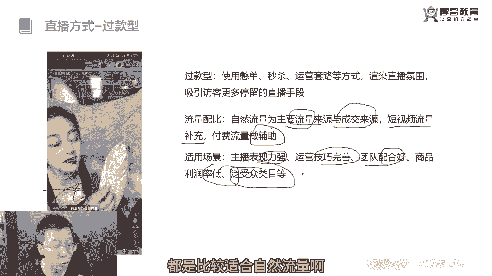

过缓型的过去做的，我看一个数据，这是一个视频类目的，这是一个视频类目的数据，看他的直播间推荐占到了96%对吧，基本上没有啊，没有这个付费就可根本没有付费，你看他的流量曲线就一波。

有没有这个直播间的流量是这样的，大部分免费流量就自然流量的，直播间很多都是一波流一波流一波上去了，你看啊，从从03：30到五点就一个半小时，直接到没人，自然流量就是这种不稳定性啊。

比如说一些大主播当前开播了，你直播间就差点没自然流量了，大主播一开播，你这就没自然流量，很常见，这种问题很常见这种问题啊，这是这样的一个情况啊，这是这样的情况，你看他这个千次观看成交金额特别低。

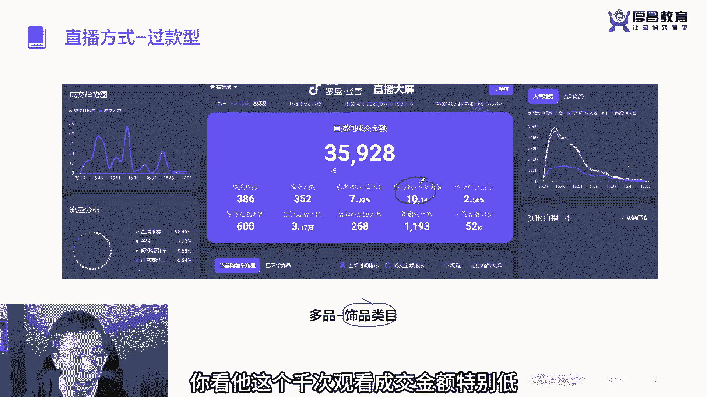

特别特别低对吧，卡航线，这也是当前江湖上流传比较广啊，然后我们再看平平波形，我们看这个18小时内发货，只会早不会晚拍了，打了已拍下几，我给你备注一下，优先发货啊，今天拍下的宝宝尽量今天给大家发出。

我就不给大家拖到明天早拍早付早发货，早早收啊，宝子们，妞妞啊，宝宝如果你只需要水乳的话，你就拍6号链接，如果你不，如果你只需要像这个艾尔博士，可能有些女生会知道，可能有些女生会知道啊，她是做什么美妆的。

美妆的对吧，你看如果说你是男生女，刷到这个直播间，你会停留吗，你会停留吗，各位男生不会吧，为什么不会，一这个女的长得一般，二什么东西啊，我不知道没卸了去，第三这个主播说的没啥意思，我连个开头都没有。

对不对，所以说这就是平坡型平波形，频波形大部分都是绿幕直播绿幕波啊，这后面搞个绿幕，然后呢通过一些图片搞上去对吧啊，直播间氛围一般啊，客单价比较平均，像刚才我们看的，他大概低的是80多90多高的啊。

一百一百九十八，298对吧，然后他重点是循环话术，反复陈述，像这种这种直播间，第一就那几套话术，留人话术，刚开始留人逼单话术有人拍了，再者就是回复评论区，比如说评论区有人说哎四二链接怎么用啊。

哎这个这个怎么用啊，这个怎么使用啊，它更多的是跟我一样答疑明白吗，如果说没人问，OK循环话术来回播啊，今天怎么样，是什么什么专场，今天啊来我给大家讲一下一号链接对吧，今天我们的主销品它是什么。

什么东西就开始亮了，学画画数，来来回回就那几套东西啊，其实这种直播间是最简单的，最最最最简单的投入成本是最低的，你只要搬运一套话术，然后来个主播，找个绿幕播就行了啊，然后去那么像这种直播间，大家都知道。

我不会听说，不会吸引我的兴趣，那么付费流量，就是它的主要流量来源和成交来源，兼顾短视频流量和推荐费的流量，这个时候像这种直播间，像美妆的，各位有没有跑过的美妆，它的付费流量可能占到70%。

高的能占到80%，就是这么高，就是这么基本上如果说不跑付费，你看他在线40多人，这还是跑了付费的，不跑付费就是个位数，连个人都没有对吧，单品售卖，单品售卖不是说只卖一个品，不是说只卖一个品。

它会有不同的型号，你看刚才刚才咱们看到了，但是都是化妆品啊，都是护肤品对吧，或者说都是一些功效的，都是去皱的呀，都是做啊高量的精华呀等等，对不对，都是单一类的品类，然后再者利润率高，像这种美妆。

像白酒美妆的利润率啊，大家都懂的，对不对，然后垂直品类就是做单一品类的，那么看这是屏幕。

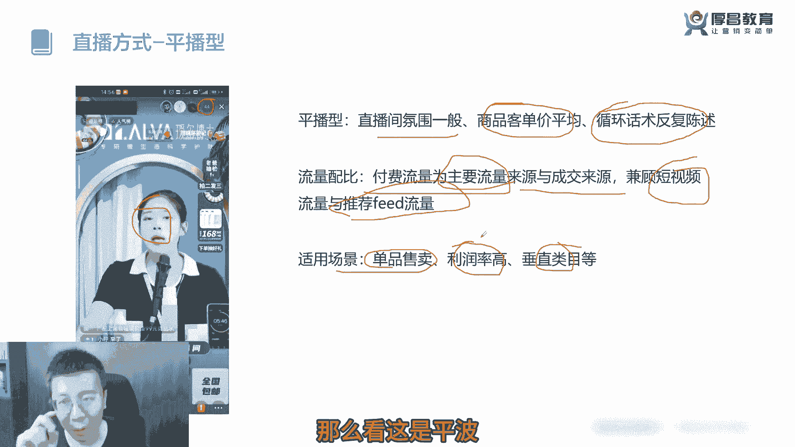

你看这个这就是一个嘉庆类的啊，没找美妆的，找了一个嘉兴的，嘉兴这块还不太过分，他的付费占比大概占到了55%啊，自然流量占到了31%，关注7%对吧，它的广告RI2点多，整体RI3点多。

这种的话像平波的RY基本上都不高，都不高对吧啊，加氢类目这个数据啊。

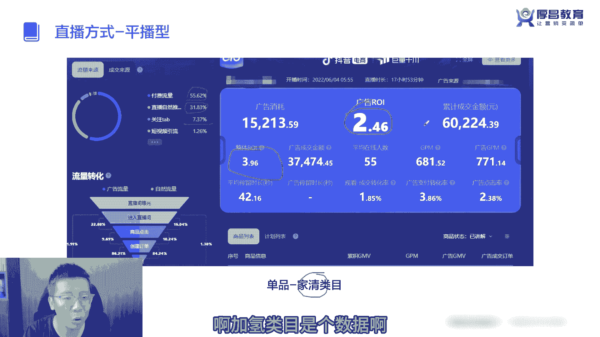

然后这是直播方式，直播方式日不落我就不说了啊，日不落都是短视频，配合那个付费的，今天就不说了好吧，今天我们就讲两款过款型和平波型，那么各位你们觉得这两种哪个更适合去付费，几号，或者说哪个必须要付费启航。

拼搏对吧啊，有人说过款过款的出去啊，过款的出去，停播必须或者说尽量是肯定要用付费起号的，而过款型它不是说必须用付费几号，你可以通过自然流量起号，你可以通过唉付费去协助付费。

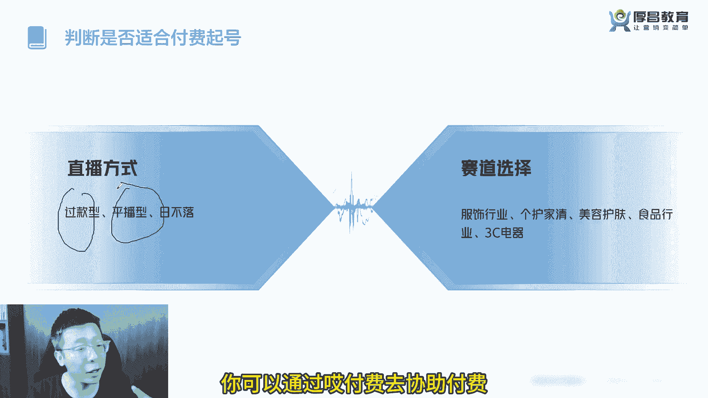

不是必须的，平波付费这块咱们刚才讲过了，付费是主要的流量来源，你不付费型号怎么播呀，苹果刚才我说过了，像这种评估你又不感兴趣对吧，长得也不好看，那你留不住人呀对吧，货款不是说全是付费流量，免费流量啊。

不是说免费流量是在起号的时候，你的重要程度对吧，你说我付款能不能用啊，能不能用付费起号，或者我起号的时候能不能介入付费可以，但是呢不能够太过于依赖付费，就说我人货场，我过款的技巧不要不要了对吧。

我全额付费，那么内容不行对吧，然后我们再看赛道，赛道这块很重要啊，来赛道先看这个，来看这个那一条这种高端线裙子，而且明显设计的所有姐妹服饰行业啊，也是当前最卷的一个行业的安排下啊，服饰行业。

服饰鞋帽对商品要求高，成本透明，为什么，其实现在做服饰就是在找爆品啊，利润成本已经非常非常透明了，供应链已经非常非常成熟了，找到一个好款式，一个好的品类对你的旗号至关重要，对很多现在你做作品呢。

做做服饰的啊，大家都懂，退货率又高，对不对，又没有多少的赚头对吧，利润率也很低，但是为什么还有那么多做供应链成熟啊，打爆品比较快，对不对，然后季节波动性大，一季一套，一季一套，每个直播间里面的一个产品。

如果说你是垂直类的，过完这一季就要换东西了，赛道成熟有大量的成功案例参考，如果说你要做行不行，比如说我有服饰的，你能做，但是你不要依靠依赖付费了啊，退货成本高，需要提前考虑，你如果说接受不住退货率的话。

就像我之前有一个同学，他是他家是做，他说之前他是做淘宝的，之前做淘宝做服饰的，然后现在家里仓库里啊，留的衣服够他们穿两倍的，就这样，你该懂的啊，就是之前做陶器做服饰的。

现在仓库里留的衣服够他做够他穿两倍的啊，这种做服饰退货率，他这个库存也很高的，投放目的像这种的，我们刚才说了对吧，唉赛道成熟，而且的话对商品体验高，利润也很透明，成本也很透明的。

建议大家就是自然流量取号啊，付费的投放目的是协调，自然流量就不要占比太高了，你说我纯粹的使用千川去大大额币的，大额度的去提这种服饰类的，是不太好做的，不能说不太好做，非常好做。

但是呢你后端不盈利不赚钱呀，啊你不赚钱，最后可能说你的运营赚钱啊，你的主播赚钱了，但是老板不赚钱对吧，然后呢用金钱换时间，付费是快速的帮助你起号，而不能够占比太高，一定要了解啊。

我这里会更多的会去说到啊，后面也会强调什么叫做协调自然流量，协调自然流量就是我们所说的撬动也好，我更愿意现在叫它协调自然流量，我不叫它撬动，撬动的话，可能会有些同学会误解说我付费去投放了。

我的自然流量就多了，没不能说没有这回事儿啊，但是说不是关键性的因素，不是关键性的因素，这里主要是通过付费流量的介入，帮助我们快速的进入到下一个流量池啊，也有更多的流量进来啊，是这个目的。

然后我们再看客户加清啊，我这里举的例子是一个做拖把拖把的对吧，这种分为了两种，向客户家金行业低利润品啊，低利润品和高利润品是不一样的啊，刚才我记得有同学问啊，多少的一个毛利率可以去做付费比较合适。

这里建议大家啊，如果说你要去做直播的话，建议你的毛利率在50%以上，算是高利润品了啊，你的毛利率在50%以上，甚至高的能到70%，像美妆的能到90%对吧，这属于高利润品，50%以上就属于高利润品了。

那么这个时候你就可以付费为主对吧，你至少说付费，比如说100块钱，100块钱一个品，你的毛利率是50，那么你可以借助投入的一个费用，最多可能就赚50块钱对吧，100的客单价50块钱的一个成本对吧。

五块钱一个成本，那你的利那你的RY是在二，你的二是保本的啊，不排除那些场地啊什么的，那些费用咱先不算啊，那那样算就太复杂了，二你的RY是二啊，那么的话你的广告RI能够达到二，不算不算自然流量。

那你就是盈利的对吧，那就是已经很不错了，已经很不错了，而如果说你是低利润，低利润品，像这种啊，各户家亲各户像一些护肤品的啊，每天抹脸的这种的，日常的化妆品的，像这种的也是他需要去做短视频。

做短视频或者说付费去介入啊，美妆各户啊，美妆各户啊，日常日常的客户类用品，还有加氢的，像厨房用品啊，清洁用品啊，啊对吧，这些的像扫地机器人对吧，他就是高利问题，他就是付费为主，单品直播在线人数少啊。

在线他基本上是100多，已经是非常非常不错的情况了，更多的其实就是带几十人，行业内卷严重，价格战激烈激烈，利润空间比较少，更多的是日不落直播间啊，像这种的话，像这种家纺和这种家轻好多日不落。

好多做日不落的，再者低利润品，短视频流量为主，配合少量付费加速拓量，记住啊，低利润品的少量付费做短视频去啊，高利润品的啊，付费流量为主，优化投放设置，配合直播间循环法术，高利润品循环滑鼠做做啊。

做平波做平波对吧，是这样的，客户家庭是这样的，你看他就是站着，只不过是平锅，只不过站着去做，站着去做，他这里也有重分，来我们再看美容护肤，美容护肤和一个人一年的用量，这是什么，这是属于货款还是苹果。

各位OK，接下来和姐姐们没点关注的美妆又是美妆，美妆的基本上全都是拼搏对吧，像这种美妆的用户需求量巨大，且需求持续年就高，做美妆，各位女同学哎，各位女同学，你们在直播间买过化妆品的，打打个打个777吧。

女同学在直播间买过护肤品，化妆品的美妆用品的，在直播间打个777，有多少女同学买过的，而且的话你还会不止一次的去买，看到了就想买，看到了就想买，对吧啊，经常会啊，这个这个效果这么好。

我今天确实我今天满面油光，我要去做一做，搞一搞对吧，而且的话粘性大，他们会不断的卖，真的是女人这个购买力啊，是真的吗，真的牛啊，为什么说女人的钱是最好赚的，不管说做什么产品啊，各位不管说你是卖什么产品。

宝妈这个群体，宝妈的群体绝对是付费能力最厉害的一个群体，对吧，然后品牌和白牌两极分化，品牌和白牌两极分化，品牌和白牌是不一样的，白牌的话它可能会有一些啊动作呀，它在价格上会有更多的一个啊弹性。

但是品牌这块它价格是定死的，因为它会有很多的线下的一个门店啊，价格上直播间不能跟线下差太多，所以说品牌反而是有时候不如白牌的摆盘的，白牌他可能会做一些秒杀，做一些福利，但是品牌这块基本上不让做对吧。

投放依赖视频素材，但视频内容把控审核很严，很难过审，各位有没有做美妆的啊，我最近是在做美妆，是真的难，这个视频啊，全部都是审核建议，而且只要有一条视频，两条视频过审了，没有审核建议。

叉叉叉跑得是非常非常好的啊，达人种草类的素材效果更好，如果说你能够授权一些达人，你的品牌可以去授权一些达人，去拍一些视频的话，效果很不错啊，不投放没流量，不投放真的没流量，美妆直播付费流量是主力。

付费效果看素材，这是两个啊，付费是主力，基本上占到了七八十%，如果说是做美妆的同学，美妆各户都算啊。

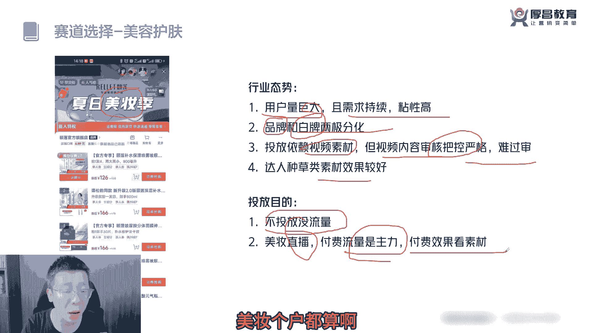

付费效果看素材啊，然后我们再看啊视频啊，这个食品行业啊，打错字了啊，食品行业我们看这个再点上关注，点赞，两块好不好，贵九毛钱一整张的唉，我们来判断一下第一个，第一个各位觉得你它是靠付费还是免费。

看它的客单价九块九，九块九，六块九几毛钱，他是靠付费还是免费，第一个来我们看第二个，让客服一对一的给你服务，给你换啊，没有别的了，因为这个播播我们过几天就不会再送了，2993985982贴了一点。

这就是不同食品行业，不同食品的类目，不同的客单价，它的投放方法也是不同的，投票方法也是不同的，高客单，像他这个299299这么多牛排，这么多牛排，123434十二十二份牛排299，它是通过组合啊。

通过组合高SKU导致的歌碳包客单价，你要单个卖，单个卖，你算起来挺便宜，但是组合到一块儿，它的客单价就高了，对吧啊，突出产品价值，保健也好，营养也好，你像他卖牛排，各位牛排这个当前卖的非常非常火啊。

他们打的都是进口的，澳大利亚进口新西兰进口啊，巴西新西兰进口等等各种进口的牛排对吧，从国外印出来，纯进口的都是打着这种健康营养对吧，高价值都是打的这种套路，高客单价过高，导致自然流量难有起色。

然后低客单价临时，那就是以自然流量为主了对吧，难以支撑过多的广告成本，付费流量主要有协同对吧啊，像一些做清仓号的临时清仓的啊，这种号都是自然流量啊，今天报福利了啊，我们有个同学他做零食非常牛逼。

他起了好几个号啊，都是自然流量信号号对吧，高客单价啊，付费作为主力流量，低客单价协同自然流量。

OK最后咱们再看一个第五个，第五个咱快点过啊，半个小时讲完这个3C电器啊，刚才我听见有人想3C电器型号，3C电器的评估评估美女，这还是一个品牌的品牌的对吧啊，旗舰店其实它也是分为两种，它也是分为两种。

高客单价对付费依赖大，品牌认知感强，价格优势不明显，因为像这种3C用品的高客单价的，基本上全部都是品牌品牌货对吧，多组合SKU，比如说有赠品，一下子卖两个，对不对啊，你看咱们两个有多个刀头。

他把客单价提高多赠品，而如果说像一些低客单价的低客单价，其实就是一些黑科技啊，更多的像什么，像我们做鲁班之前很多做那种黑科技产品，小太阳有没有做的，有没有之前做小太阳的冷风机，夏天是冷风机。

冬天是小太阳，还有最近比较火的那个脖子上，脖子上挂的那个风扇，对不对啊，这种黑科技的产品啊，功能性他们打的就是功能性卖点，这种的话需要去视频流量去种草，然后直播去收割，而这种就是混剪视频，通过混剪视频。

你哪怕是通过一些呃扒来的视频，扒来的视频，然后混剪，然后去投放引流到直播间也是停播，引流直播间就整就就行，这就是为什么说我建议大家啊，我建议大家，如果说你是个人创业去选品去做直播。

我其实建议大家去选那些鲁班之前咱们跑的评，明白吗，如果说各位，你问我哪些类目是比较适合去做个人创业，做人个人直播，你跑图文也好，你跑直播间也好，我建议大家跑之前鲁班，你就看看之前鲁班有哪些爆品。

我一直说的像什么多功能手电筒对吧，渔具啊，户外用品对吧，什么超洗眼镜盒，就是这种黑科技类的产品，它相对来说成本很低，成本真的很低，不值钱那玩意儿，但是它的售价功能性卖点，而且它对视频的展示是非常可以的。

而且之前做鲁班的同学，你们都应该会有非常强的这种混剪能力，非常强的混剪能力对吧，做视频是一把好手，那么的话我们可以通过视频引流到直播间，你的直播间再懒就是一个绿幕绿幕，然后后面贴上产品的标签。

就跟这个一样，把它的卖点做起来对吧，卖就行了，所以说两个高客单价，主力流量，低客单价协同，自然流量与视频流量就是这种，那么我们来总结一下第一个干货来，今天第一个问题喜好方法的四象限，通过这四象限。

各位你们之后再去拿到一个品类的时候，再去看我的这个品，或者说我的直播间的形式，我们通过这几个啊，一直播间的形式，二我们品的一个利润毛利率大概多少对吧，你是停播的，你是平波的，还是说你是过款型的。

我相信如果说个人创业大部分都是平播的，大部分都是平均的，哎你是利润高的还是利润低的，对吧啊，你去选什么是高利润，刚才我说过了，你的毛利率能达到50%以上，就算不错了，就算高利润了。

你就可以按照这个算对吧，平波型高利润A在这个象限，像一些高价美妆大家电，甚至像一些黑科技的产品，它也属于高频的高利润对吧，你像一些啊汽车的雨刮器，汽车的空滤啊，他其实成本很低。

但是大部分市面上都是卖六十九九十九，它的成本可能是在二三十块钱，二三十块钱，这种做直播也是平波高利润，那么这种就是付费为主，或者说纯付费，纯付费，通过付费起号做主力流量，你的主力流量可能占到你的。

你直播间整体流量的50%以上，达到50%以上啊，再者我们看如果说你是高利润过款型，我说过款，我主播唉，有能力，我话术可以啊，我可以通过一些技巧一些编单啊，我的福袋等等，不要停等等这些东西对吧。

唉像一些高端女装珠宝翡翠对吧，它是属于过款型，利润也很高，那么这就是自然流量为主，配合付费做辅助去协调自然流量，加速起号的一个过程，去突破流量池等等啊，然后呢如果说我是低利润想加清对吧。

一个一个拖地机能有多少钱啊，能有多少钱哎，比如说图书对吧，它的利润非常好的，甚至是赔本的对吧，自然流量，短视频流量，付费流量，多频共振，像这种的话，我就建议大家短视频自然付费都做，那么你的流量可能是。

自然流量占到四五十%，短视频流量占到10%到20%，付费流量占到20%到30%，是这样的，四十二十二这块30啊，70，其他流量十对吧，那有人说户外露营用品，咱们往里套啊。

户外露营用品你要以什么形式直播对吧，先看看你当前的直播间，你能够承受，或者说你的一个条件适合哪种户外用品，能不能去做货款，可以对吧，我可以做一些福利，比如说唉一些我给大家准备一些户外，一些简单的护具啊。

作为福利去放福利，放十单对了，你的一个福利品，这些都可以去放，只不过去选选哪些品去做福利的问题对吧，然后再者我是高利润还是低利润，那么你就要看你的产品成本和你的定价，和市面上别人卖多少钱。

你的成本能达到多少，这个不是我决定的，我不清楚这个东西对不对，那么你去套，然后看看你适合哪个啊，像我如果说你是做评播，比如说像这种户外用品的，我建议是在户外直播，如果说没有条件，你做绿幕行不行啊。

绿幕往上贴，然后去展示行不行，比如说我是做帐篷，我是卖帐篷对吧，或者说我是卖这种啊，就卖帐篷吧，卖帐篷我在直播间去卖帐篷对吧，后面后面我全是帐篷啊，我做单品，我做评估，那么首先我是评估，然后我是低利润。

如果说我是低利润的话，利润不足百分之，毛利率不足50%，那我就是自然我做短视频，我都付费，自然流量一起去洗，一起去洗对吧，如果说我这自然流量我没有那么太高的技巧，我评估了一个话术也不行。

那你就在重点短视频上，你去多去混剪视频，多去拍视频，多去拍一些户外家庭户外的视频对吧啊，然后呢，如果说你是过款型，但是低利润，像这种普通女装和临时的，那你就是以自然流量为主对吧，像这种能过款的。

你有能力去过款的，而且利润比较低的，那你就去做自然的啊，然后有人说艾草产品，艾草产品，艾草产品属于什么海草产品的话，基本上不会去过款，不取款也是拼搏，大部分其实大家都是做拼搏对吧，做评估啊，利润有多少。

艾草其实利润很高的，利润很高的，那你就可以做纯付费，那你就可以做纯付费，你的付费流量可以占到你流量的70%，到80%，像艾草的话，我们之前做过图文的，像做过图文的一些品，其实做纯付费。

做直播间的纯付费几号绝对没问题的，此处可以有线化，所以说大家把这个四象限截图出来，截图出来，明白吗，那么你就对比一下，我当前直播间能做的是过款型，还是说平波型，苹果型，我的直播间状态。

我的直播主播的形式能不能支撑我去多拨款，再者诶我的利润是高还是低，往里一套对吧，我一对比跟他们像不像，对不对，然后我就知道我接下来是做哪种流量。

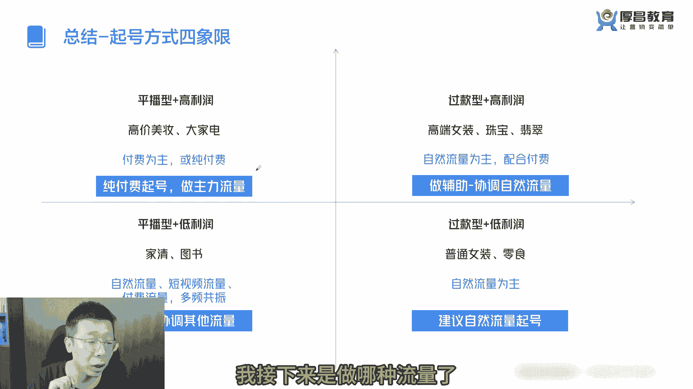

是做哪种流量对吧，所以说总结一下。

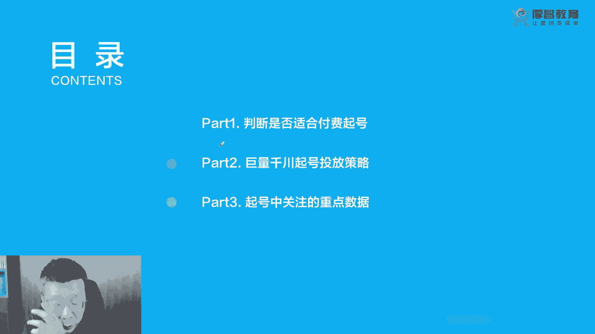

总结一下当前我们说的两种纯付费起号，做主力流量和做辅助流量，协调自然流量就这两种，就这两种啊，那么我们就按照这两种形式去讲它的策略。

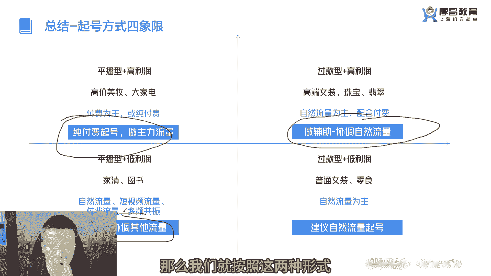

讲他的策略好吧，啥时候拨款，如果说刚才讲过的，刚才没来的同学回去听录播好吧，我不再回去再去讲什么时候过坎了，上上上面，我刚刚开始刚讲了，就是既有福利品，又有利润品，对啊，有福利品，有引流品。

有福利品这种对吧，过缓性啊，然后评估的就是单一的品啊，第二个千穿旗号的投放策略。

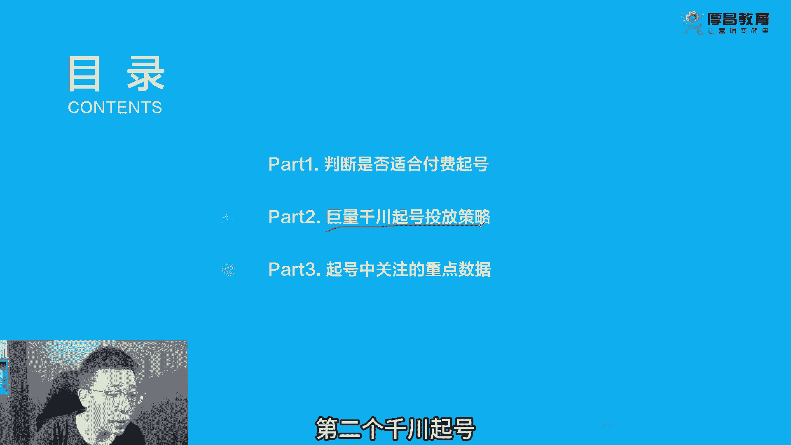

那么我们刚才讲过了，我们千川付费在直播间的纯付费，主力流量做辅助协调，自然流量就这两个作用，首先我们看纯付费这个图，大家可以截下来，什么是策略，就是从这几个方面去做。

如果说你确定了你的直播间是平波加高利，高利润的产品，OK你就是纯付费，纯付费分为这三步走，第一精准流量打标签，打标签大家都听得听得耳朵都磨茧子了，那么我们需要重点关注什么，在打标签的时候。

重点关注直播间停留互动数据，能够保持稳定的在线人数，明白吗，你不需要说什么，你不需要太高，有人说我是纯付费的，各位我不需要我的直播间啊，几千人在线上万人在线，各位我不知道，我不需要，我不需要上半身。

再叫我就能够有稳定的二三十人，三四十人多的100人，这就够了，精准的流量付费，你要做纯付费，不要要不要追求高在线，明白吗，不要追求高在线，高在线反而是最大反啊，然后小店随机队伍的投放方式。

投放方式记住了啊，小店随心推达人定向，你选择你的对标达人，或者是说基础天下只限定年龄性别，地区年龄性别基本上比如说对吧，哎我是做纯付费，我是做纯付费做什么呢，比如说刚才我做帐篷多多纯付费。

我找几个户外的达人，我去给他投放对吧，有人说我是投放他的所有粉丝，还是投放他的一个那个呃直播间的互动人群，购买人群啊，全选不用只投放粉丝，或者说只投放下单这些人去全选上，不用刻意去做啊。

然后呢基础定向基础定向啊，只限定一些年龄性别体，做户外的人可能会主要是男性居多，我先投男性，然后呢大概是在24到啊，或者说十八十八到30岁这部分年轻人，我先投这部分人对吧。

或者是说极速推广达人定向基础定向，这极速跟小店随心推一样啊，只不过他这里最少300块钱预算，小店随心推是100，所以说建议大家是小店随心推去投100，100去投啊，专业推广徕卡定向啊，如果说有人说啊。

我刚开始没有口碑分，我没有30单啊，我想打标签啊，我小单推行推推不了，我推极速和我推专业徕卡行不行，行没问题，这里注意啊，起号期间你跑莱卡定向不要加太多次，甚至说你可以只选电商互动行为啊。

我这里有做过千川的，应该都知道行为词那块有电商互动行为，资讯互动行为，app推广互动行为，只选择电商互动行为勾选上，然后呢词不用加太多，就选择核心词，比如说jump对吧，帐篷有几个。

我看十几个词跟户外有关的，我几个产品对吧，我选上十几个够了啊，不用说加我加50个，100个，我加精准的哎，兴趣这一块就加一个产品词，就加一个账号，或者说你有其他的可以加上产品词就行了，就行了啊。

然后呢优先控成本投放，跑量困难，可以尝试放量的投放，比如说我客单价是啊99，我出价到100啊，出价到150了，还是没有消费，还是量少，OK跑放量去，300块钱预算跑放量去啊，然后呢。

外层创意根据类目属性和资源情况，选择投放方式，一般七三开对吧，哎你看你是短视频引流直播间，还是说你是什么呢，你是直通直播间啊，我说我短视频多，我多投点短视频行不行，可以诶，我知道没有短视频对吧。

然后这里注意啊，唉刚才有人问了，那会不会跑不出去啊，你成交肯定跑不出去对吧，你肯定跑不出去成交，我这样跟你说，你起号成交肯定跑不出去，像刚才我所说的，纯付费一半成交优化目标，一半浅层优化目标。

根据流量逐步放开，有人说啊，看到老师，我成交肯定跑不起来，我跑起来了对吧，你总有跑起来的呀，啊总有跑起来的啊，那你说我肯定卖不出去，99。99%行不行，还有0。1%，咱不说绝对的啊。

然后呢一半检测目标我成交跑不动，大概率跑的99%的都跑不动啊，然后呢你可以放开哎，先跑跑下单下单，看看能不能跑，但是下单是真差，现在哪怕他跑动了，但是呢就是不付款，建议不要跑，对啊，小郭说的对。

下单能不能跑，你可以试，有人不死心的，可以去试，但是呢你可能跑起来了，有下单，但是就不付款，你还不如去投放商品按钮，点击或者说进入直播间啊，就说为什么说刚才我要大家限制那么精准，限制那么精准的定向。

徕卡定向对吧，达人定向，你也可以选择那个刚才我所说的宽泛点，然后投放量播放量，然后这里要干嘛，这里要干嘛，投进入和商品按钮点击是要去重点关注，去做互动，去做停留对吧，直播间啊，如果你是纯复位啊。

纯复位咱们平播没有什么东西，主要干嘛去做一些五维四率上的优化，五维四率上的优化啊，甚至是六维四率啊，如果说还有人不知道五维四率是什么的啊，去剧场创一定看看，或者找我们助理给你发那个链接，好吧啊，微思虑。

如果说是是什么呢，是我们注呃，是我们投手和运营非常重要的一个工具，非常重要的工具，因为这个的话，这个由数据可以给你表示，你当前直播间它的一个曝光进入率啊，进入商品曝光率啊，然后呢曝光点击率，点击下单率。

下单成交率啊，这五个率这五个绿植它哪一个出现问题，那么当你把你的数据填写到那个表里之后啊，看看哪个数据哪个绿值是低于大盘的，那么就去优化这个数据，它给你提示的内容就行了，是你的场景，是你的话术。

是你的B单，还是你的商品的牌品，还是你的曝光商品曝光不够对吧，有问题去解决问题好吧，然后这是第一步，先打标签，先用浅层去打标签，做停留，找直播间的问题优化好了，慢慢的我们的成交计划就出去了，各位注意啊。

成交计划是要开的明白吗，成交有人说我成交计划跑不出去，也要开什么开着啊，每每一场直播都开几条，不管说你是用小调性推达人电响还是用极速啊，达人定向啊，尽量是先用控成本跑的，如果说你着急着急放量。

你可以少放点放量，但是不要太多太多的话，容易导致你直播间付费流量特别大特别大啊，然后第二步第二步诶，我直播间当前成交计划能跑出去了，各位到这一步了，我直播间能够有二三十人稳定在线，我成交我每场直播对吧。

都能够有稳定的一些在线，能够有稳定的一些消费了，我成交计划跑出去了，能有十几单了对吧，那我十几单了，OK测试维度找标签，测试维度找标杆，重点关注成交和RI数据，找出最优的投放组合。

这时候就重点去测试你的一个成交转化目标了，浅层就不用太多了啊，甚至说就不投了，要选择你直播间，当前是急速跑得好，极速控成本跑得好，急速放量跑得好，专业控成本好的好，专业放量跑得好，哪种跑得好。

要去测就跑，成交就去测啊，这个没有肯定的，就像有同学说对吧啊，我说我放量跑的话，我就有人说我都是空成本，大部分都是空车，现在我给大家说啊，当前整体上啊成交RI啊，成交转化目标和RY转换目标跑的比较好啊。

啊急速成本满投，有没有这个跑的好的，作为你账户主力的打个一极速成本本投，不管说你是成交转化目标还是按Y转化目标，这个占到你账户主力的计划的，主力的投放方式大一，再者的话就是啊急速急速急速掏啊，急速推啊。

就是控成本，极速控成本啊，不是成本本，投了极速成本稳啊，极速控成本投放是这个占计划主要投放的答案，再有一个就是专业RY，专业RI有没有这样的计划的，同学在评论区打三，基本上当前啊已经测试出来啊。

我这块大部分账户都是这这三种方式，占了大部分，你说有没有放量投放，跑得好呢，有有，但是呢我这不多，所以说大家在跑的时候找你的标杆计划，标杆计划重点往这儿去找，重点往这儿去找好吧。

根据跑量和RY最优的方式去投放哪个，它的跑量效果最好，而且消费能出去就去跑，这个根据跑量RY方式选一个，也是短视频跑的好，还是值得跑的好，99%的预算，给到成交和RY优化目标啊，这里注意啊。

肯定有拉垮的，不能一直跑的好，这里注意啊，在我们在投放的时候啊，嗯特别是当我们已经到了一个比较稳定的阶段，不要全部都跑通透，各位啊，有没有现在账户里全部是跑通投的，来打个666，我就拉满通透跑得好啊。

就拉满通透跑得好，我就只跑拉满通透，有这样的吧啊，这样的话会使你的直播间啊进入到一个限制，或者是说你可能会压制你的你所说的自然流量，压制自然流量，因为通透通透本质上其实是啊推广账户。

按照直播间自然流量的模型，账户的模型去投放的，这个时候我建议大家啊，你去投放一些，你去投放一些徕卡镜像，或者说相似达人定向，偶尔去投一些，有人说我跑不起来，跑不起来，一跑放量去一定要跑一些啊。

这是干嘛呀，这是给你的一个账户，给你的直播间去破枪去带来一些新鲜血液，而不是说只是啊只一直是顺着自然流量跑，我通透，我是省劲儿投手，我是省劲儿了，我只见通透复制计划就行了。

但是可能会导致你的直播间的流量越来越窄啊，有人说啊对来看ROY不就是RY不好，就是RY不好，因为你什么，因为你是带来的新鲜血液，带来一部分其他流量，比如说我是做美妆的啊，我刚开始全是秃头。

我跑着跑着可能会去做一些什么呢，我去投一份啊，拉一部分什么的，拉一份高端女装的词，我去拉一波女装的词，然后呢我拉一部分去皱的词，我拉一部分去痘的词啊，我会去拉一部分，偶尔去投一投。

不用多三百五百的放量放量投放，因为你我相信大部分，你们跑控成本肯定跑不出去对吧，你是用极速极速放量成交啊，都是成交就行啊，成交就行，用成交去放量，还是说用什么ORY也很难看，没事偶尔跑一跑，跑出去一些。

带来一些让直播间去带来一些新鲜血液，让他去跑一跑啊，让他去跑一跑，这样的话可能会拉低你的广告RI，但是就要拉低，会拉低你的广告的JPM，就要拉低他，不要让它使跟你的一个自然流量的一个GPM，差别太大。

听过正式课程的，听过正式课程的，应该知道为什么会压制自然流量，就是他们两个差别太大了，你付费转化太好，付费转化太好了，对不对，那你转化太好，系统给你分配更多，但是你自然流量就转化不好了。

直播间全是付费流量，全是付费流量的问题，那么你剩下那些自然流量的用户，对不对，问到的问题，那么你可能就解答不了，那么相应的他们就留不住，就成交不了，这就是付费压制免费，有没有同学已经悟了，打个六零。

对吧，你占比低就不用考虑这个了啊，你全是付费，你也不用考虑压制，免费了，你就没有免费，你就没有免免，没有没有免费的对吧，你全是付费就不用考虑了，全是付费，你怎么投的好，怎么投得好就行，但是全是付费的话。

也会触到瓶颈，什么评级，当你要放量的时候，就是老板要我要更多的量，我要更多的量，也建议大家一定要在适当的时候，当你到瓶颈的时候，或者说当前你发现啊，你的付费流量占比越来越高的时候。

去刻意的去拉低LY并不是说我带来垃圾流量，而是针对性的带来一些其他的标签流量，其他的标签里的其他的用户，我再去带来一些新一些，这就是为什么说一些新的直播间，各位你们刚开始起号的时候会有极速流量。

会有泛流量对吧，会有泛流量，会有这个R型的极速流量对吧，然后呢当你的直播间稳定以后，你的付费流量占比越来越大之后，你的急速流量会越来越少了，你的直播，你的直播间刚开始可能会有一小波啊，一些自然流量。

但是后面没有那么高峰了啊，很稳的就下来了，是不是都是这样的，为什么没有在没有泛流量了，没有泛流量，我们就要自己去带来泛流量，要么通过你的付费的啊，要么通过你的付费去圈选一些其他的人群，或者说通过免费。

比如说啊我再去啊，比如说我经常会去说的，你直播间来送，我就简简单说，比如说通过一些高反，通过一些免单对吧，我去编一波，我去编一波泛流量对吧，然后再去洗一下，再去洗一下，抖音都在通过我们的直播间去洗流量。

为什么我们自己不洗流量，必须是不断的洗，不断的扩，然后再洗就行了好吧，自然流量哪里来，自然流量哪里来，自然流量通过你的运营手段，通过你的主播去，通过你的互动，通过你的停留来呀对吧，然后裂变组合去拓展。

根据测试出来的最优维度裂变投放啊，降低测试成本，提高准确度，就是刚才我所说的裂变，你去测啊，比如说我这儿我现在通透极速矿成本，跑得好对吧，我试一下极速达人对吧，我试一下哎，专业控成本系统推荐我试一下。

极速成本满投我都要试一下，对不对，我去那便去，你像我专业专业推广，如果说我跑的好的话，专业RY跑的好，我可能都去换标签，我经常会去变换标签，所有的标签我都会换一遍啊，经常会去这样去裂变，去去跑啊。

来这个时候这个时候直播间动作，像这种纯付费的直播间，纯付费的直播间基本上就是循环话术，5分钟循环话术对吧，唉留人刚开始刚开始有一段大概是呃一分钟，一分钟，留人的话说哎刚才到高峰了，我留着哎。

刚来直播间的宝宝们，今天呢是什么专长，今天主要给大家讲一二产品，一二产品是今天开场的一个巨大的福利啊，怎么怎么样对吧，再者B端话术，哎PABBA已经给大家发321上单了，PABBA一定要去做。

然后回家之后怎么怎么用怎么怎么用，然后用完之后的话，一定一定注意这几个事项啊，否则的话反而会起到反效果对吧，就这种啊留人话术，然后呢哎讲解话术，逼单话术，图单话术，来回去做，来回去做对吧啊。

直播间中间去建几条计划，也是追计划玩嘛，这个看你直播间的情况啊，呃如果说你的直播间是啊，如果说你的账户是以ii出价为主的，可能你是要去多建计划，多建计划，如果说你的直播间是以成交为主的。

你可能会有爆款计划，爆款计划可能两三个计划它的量就够了啊，但是每场直播我们都要建计划，每场直播基本上都会更新，80%到90%的计划啊，留下上场直播他的RY比较好的计划，留下继续开，然后再建一大批计划。

再建一大批计划啊，比如学画画术，直播间动作，你看啊，我们看下例啊，看下例，这是一个纯付费的白牌女装的起号过程，来看这个数据啊，这是从2月1号，今年2月1号到今年7月份啊，就是前几天还在投放的啊。

618618达到一个顶峰消耗啊，618618日消耗36万，618日消耗36万，你看刚开始啊，从2月1号到4月份，中间有过投放，有过3000块钱的投放，有过一周的头发，但是效果不好。

然后4月份重新开始之后就起来了，我们看这个是怎么调号的啊，这个就是纯付费，在2月份的时候，2月10号，2月11号这几天投放了大概有五天的时间，效果很差，你看这块它的消耗了一共是8000块钱。

但是它的支付ii只有0。32，非常非常的差啊，就算美妆啊，美妆白牌的啊，甲方给到的目标是一一的RY1。2A，但是当前投到了0。32的2A，特别特别差对吧，花了8000块钱，将近只有产出了。

产出了2500，谈不谈对吧。

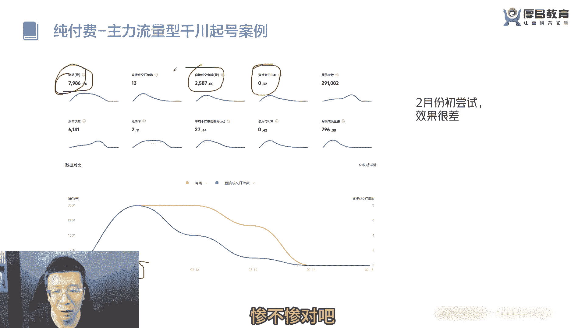

就是为什么这是这个数据，这是个数据，大家可以明显的看到啊，付费流量占到了65%啊，自然推荐流量20%，关注4%，所以说这个号基本上没什么推荐啊，都是付费占到了5%啊，65。

而且的话你看整体的JPM2000，广告的JPM1500啊，广告还要更差一些对吧。

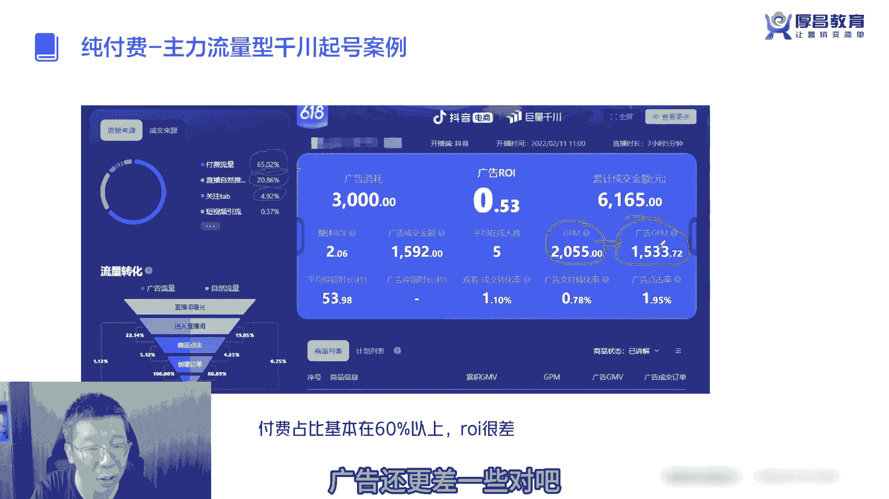

JPM更差一些啊，我们看数据啊，这是这是到2月份，2月份2月份我们投放的情况啊，这里投放的情况都是下单啊，成交下单商品按钮点击点击，就说刚开始投不出去，刚开始投不出去，刚开始我们投不出去。

只有下单的能投出去，但是下单的他的RY很差，只有0。540。54，然后下面一直投不出去啊，点击的啊商品研究点击全部都是矩阵号，粉丝全是用的达人相似粉丝，因为做达人这种的，他的一个啊做做美妆的。

做美妆的一些达人是非常非常多的，所以说刚开始全部是用的达人啊，有视频有直头对吧，矩阵达人粉丝去打标签，去起号，然后深度转化目标量少，配合一些浅层的转化目标，你看这成交这三个成交的啊。

三个成交消费300多500多啊，也是没有转化很差，所以说开始用下单下单啊，除了这个计划消费比较多之外，还是不行，我就换成了点击对吧啊，出价六块多，点击出价六块多对吧，然后我们看4月份到4月份。

4月份我们换了主播和直播间脚本，换了循环话术，换了主播之后达到了1。2啊，目标我们的目标啊，美妆白牌美妆目标是一的，RY已经非常非常合适了啊，你看一共是4月，从4月7号，4月8号开始去做。

这几天时间就把号起来了，你看消费消费日消费6万，日消费6万啊，到最高的时候，基本上是通过1234566天的时间，六天的时间达到了日消费600，有人说你这么低的RI白牌美妆，就是这么低的RI啊。

就是这么低大RI啊，然后呢我们看这是消费者一共17万，成交订单金额913对吧，RI是1。19，已经很满意了，总的支付RI能达到1。4万，这已经赚钱了，这已经赚钱了啊，1。2就赚钱了。

然后呢我们看一下它的一个过程啊，啊出支付RI优化目标，4月份当初出了支付RI，然后呢而且搞到了爆款视频，就专门去找素人，也是找素人，没找达人去拍了几套视频，配合一些对标答案定向直接就起来了，视频报了。

这个要注意啊，视频在这里非常非常重要，特别是对美妆来说，如果说刚开始你你的直投RY一直很差，各位如果说刚开始你的直头的RI，直头直播间的RI很差，建议多去去测一些视频，哪怕这些视频是翻拍搬运的啊。

翻拍搬运的，如果说你没有能力去拍搬运的也行，一定要去测视频，特别是当你直投的RI比较差的时候，你的直播间能力比较差的时候，指视频绝对是一个插入点，而做视频的时候，这里注意，当你有一个视频，你看这里啊。

为了美啊，视频合集为了美，这个为了美，为了美，这就是一个视频的一个代称，视频的代称，发朋友圈发朋友圈懂什么，不要这都是视频的，全部都是视频，全部都是视频啊，而且全是支付RY，看到没有。

全是支付RY这里会有一个极速稳投，极速成本稳投对吧，这个支付RI这个当前是真的不错，真的不错，然后他就都能达到1。2度的RI，而且是直接支付RI对啊，然后是这样的，所以说这块如果说你是纯付费流量。

各位纯付费流量，刚开始的话，你用对标达人也好，徕卡也好去投放，后期的话是以成交为主，如果说你的直投的一个效果非常差的话，或者说RI不好的话，一定要去打包视频，打包视频的时候一定要做评论的维护。

好评的维护，好评去置顶等等啊。

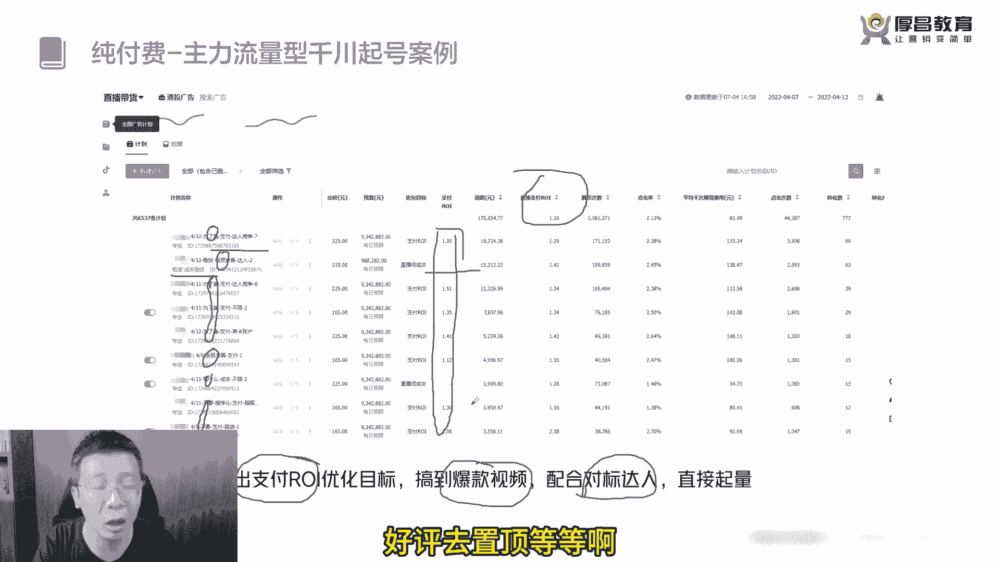

这些东西配合答案对标，直接起到了付费流量占到了69%，这是基本上是一个纯付费了，自然推荐流量12%对吧，关注4%，短视频引流7%也会发视频，也会发视频，视频流量来点就是免费的。

就是免费的视频流量只要有每天都会发视频啊，广告消耗11000RY1。68啊，累计成交6万多，这是多个账户投放，多个账户投放，你看有人说啊，那个你这广告I只成交了六啊，2万多。

但是流量占比占到了70%将近，这是多账户投放，多个账户投放单账户的ROY能达到1。68啊，如果说你要是做纯付费，一定要多账户投啊，多账户去测，因为每个账户它是不一样的，对每个账户他的一个投放效果。

投放的量级是不一样的，注意啊，有的账户他就这个视频能过审，另一个账号视频就不过审，有的账户他就能起来了，另一个账号怎么优化，就是RY很差，特别是纯付费的，一定要考虑多账户去的啊。

然后找到爆款视频，带动签证账户起量，你看这里爆款视频，爆款视频啊，消费消费2万1万4对吧，都是视频的消费啊，各位各位知道，如果说你们会看创意报告的话，会看创意报告，创意报告后台如果说是直投的话。

直投的话，这里就会有画面，就会有画面，而不是这种视频，好吧，这是纯付费。

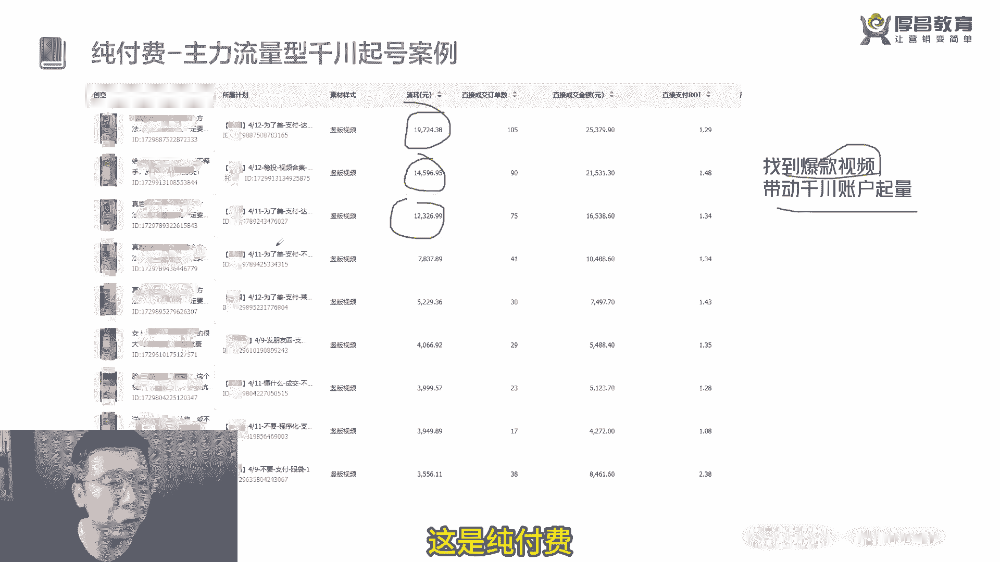

上面这是纯付费，总结一下啊，纯付费起号。

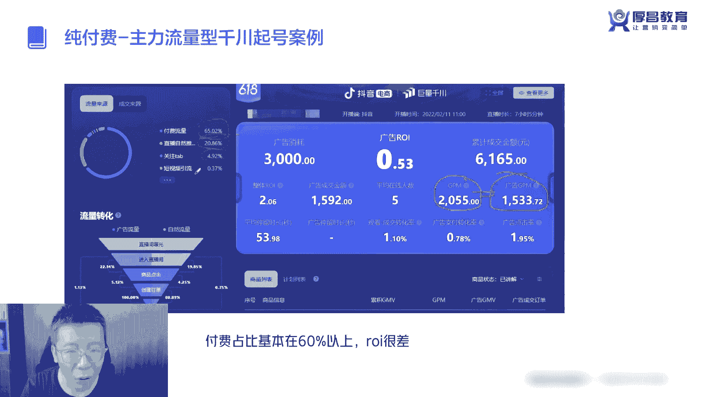

纯付费几号，刚开始去打标枪，刚开始如果说有达人的，像美妆有很多这种达人的，用达人去对标，你用小刀自行推也好，用极速版也好啊，或者说用专业徕卡也好去打标签啊，如果说你没有一些对标单人去打标，就先投这个。

然后后面的话主要是转成成交和RY的出价，去测对吧，哪种投放方式你是最好能够优化出优，优化出来你的比较好的RI了，然后再者如果说指头不好，一定要去重点去做视频，特别是像我们这种平波。

平波加我们的一个利润又高，对吧啊，你的评波主播状态不好的话，一定要打视频啊，来看往后做辅助又不一样了，各位，又一张图该截图的截下来，该截图的截下来了，好吧，又是一张图做辅助的头发和刚才你要去做付费。

像刚才那个第一种付费做主力流量，你的付费占比都占到了60%，70%了，我们就不考虑什么付费压制免费了，直播间就没有免费流量，就没有自然推荐流量，或者说很少，那个就不占我们重要作用了。

而像如果说我直播间还需要免费流量，怎么投头发是不一样的，来截图啊，首先轻量投放不流量啊，你就不能够像刚才那样，你直接介入，说直接大额度的去投了，以直播间自然流量为主付费，在开播极速流量过后去补流。

帮助场关进入第二第三个高峰，这里建议大家就是小调随性，对我不建议大家直接用PC端了啊，直接用小张进行推，不建议用PC端用放量投放，直接用放量啊，别用这种控成本直投直播间，直接投放。

直播间浅层转化目标为主，中场补量，这个就是哎刚开始一波流量，你直播间一波流量来了，下去了，又没流量了，OK补100块钱进入直播间啊，然后用达人定向也好，用年龄性别定向也好，都可以啊。

只限定年龄性别也可以，100块钱，你最少得300块钱对吧，你先少了300块钱，建议大家是100块钱一个小时，100块钱1。5个小时，100块钱两个小时，这样阶梯投放一共300块钱，这样会更好。

别一比一下子300块钱更好一些，配合少量的成交目标对吧，你可以说我可不可以投几个成交啊，我300块钱预算投小张去应对成交行不行，可以对吧，但是你时段拉长，拉长到你的直播时间两个小时啊，这样去投。

然后呢又有两个，也有两个，刚开始起号完毕之后，起号全是通过自然流量运营的流量去起号，当你的直播间能够稳定，像这种直播间，你的直播间的流量基本上在线能够达到100多，200多，高的能达到五六百。

这种高在线高在线，大部分八九十%都是自然流量，那么你投付费只有这两个，为什么说我这里有两个二，不是写错了啊，这两个二不是写错了，这是不同的目的，这是当你的账号起号成功之后，你再介入付费，再投放付费。

你的目的深浅结合破层级，深层转化目标和浅层转化目标一起去投，去破流量层级，什么意思呢，就是当前你直播间啊到了1万的厂关，一直上不去了啊，怎么优化直播间怎么去做，我这优化我这上不去了。

流量流量涨不上去了对吧，那你这个时候需需要去介入，增加付费的额度来去破圈，来去破破层级，当自然流量的厂关再现GMV遇到瓶颈，通过付费流量提高场关和GPM，突破到更高的层级，这个时候推广方式。

你看这三种系统推荐，就是系统推荐，各位不要用什么来卡，不要用什么达人，就是免费流量，让你的免费流量带着付费流量去等啊，就用智能定向成本稳投不限定向，你最多限定上一个年龄性别啊，最多限定上一个年龄性别啊。

其他系统推荐就可以了啊，优先控成本少预算投放量啊，你说我控成本量太少，补点放量行不行行啊，主要还是控成本，空成本能跑下来的，跑空成本，根据跑量和RI的最优方式，选择短视频还是直投啊。

90%深层转换目标成交，或者说RI10%浅层优化目标，做人气和中场补丁，还是这个浅层目标，我建议大家全都是用小刀随行推去补就行啊，有人说小刀就用的大，麻烦，我用PC端行不行，行行，没没啥问题。

你这样流量好啊，你用的都行，但是假的要随行推，它对我们自然流量影响会更小一些，所以说能用小调随行推，用小调随行推，我说我用不了啊，我用极速达人行不行，我用极速放量行不行啊，我用专业放量行不行，可以啊。

可以，但是定向这一块的话，别限制的太多，别限制太多，让自然流量带着付费流量走，然后呢成交计划提销量啊，上面这个是破层级，那么你需要去投浅层对吧，去增加增加你的付费的预算。

而提高销量这块儿付费作为销量的补充啊，深度转化目标的投放啊，深度转化目标投放，控制流量占比在20%以下，就是说如果说你的直播间要去做自然流量，推荐流量不影响到你的付费流量，不影响到你的自然流量。

尽量保持在20%以下，一定不要超过30%，否则的话，再高就可能会使你的自然流量减少了啊，保持这个度，保持这个度，在这个度的前提去前提下去增加你的量啊，占比一定啊，一定重视自来，就像我刚才所说的付费。

为什么会压制免费，这其实是假的，就是因为你付费直播间的付费的流量，付费的访客太多了，他问的因为付费来的都是精准的用户，他就是来成交的，问的问题都是啊，我这个该怎么去用，我买了之后有什么什么福利。

而不像一些呃泛流量，泛流量来之后，他会问啊，这是什么呀啊直播间是做什么的呀，啊我这个呃怎么去看呀，那可能你就很很少的话术去再去讲这部分了，那你就留不住这部分人对吧，中间也是一样，还是用系统推荐。

像自然流量为主的直播间，建议大家用用用系统推荐，然后你想要去破圈，你就像我刚才所说的，你想要去破圈的破层级的，那你再去加上徕卡去破圈，去破圈，好吧啊，不要全是大部分，如果说你想要去增加流量。

或者说想要去维持的，用系统推荐RY是最好的，但是你想要去破层级的，再加上徕卡，再加上达人对吧，再去跑一步，它的优化目标，深度转化目标为主，两个表，两个表，记住啊，截图下来后面是不分享PPT的，只有录播。

所以说刚才那两个表，一个纯付费为主的，纯付费的和一个做辅助的，带自然流量的，它的玩法是不一样的，此处可以有限化，这是为什么说我们在投放的时候，是将要讲究策略的，你不同的一个投放目的。

你不同的一个最终的直播间的目的，它的投放方法是不一样的，如果说你投放错了，反而会是你的直播间变差，流量变少，对吧，来直播间的动作很重要啊，刚才我们说了我们投放的策略，再者看我们直播间的动作。

开播的时候低价引流品诶，因为我们是货款型的，我们是过款型的对吧，做协助的哎，引流品A提高人气啊，精准定向浅层目标带来大量的精准曝光，有极速流量的可以不同，如果说我直播间有急速一波流的。

我可以不投浅层目标，先转化我的自然流量，如果说没有的，刚开始诶，先来一波，先来一波啊，先来一波精准流量哎，进入直播间，100块钱小摊水平推，或者说啊300块钱啊，上面研究点击都行啊。

直播过程中高价利润款B啊，这个时候就要做成交了，深度转化目标宽泛，定向自然流量带动付费流量去成交，低价引流款A哎，这个时候又有了直播过程中，他俩来回做提高人气达人和自定义年龄性别，浅层目标放量投放。

快速补人去，就是说当我们直播间啊刚开始没了之后对吧，这波我要上我的一个利润款并利润款B，然后再者下面到这个时候，我要再次去上我的引流款A，再次上我的引流款诶，然后同时我直播间也要多做啊。

我不管说用极速也好啊，我用再去小张自行退也好对吧，再去补一波量，做好ab不同款的切换，获取更多自然流量，付费流量注意啊，付费流量的目的也是加快精准人群的进入量。

帮助提高直播间整体的GPM冲击更高的流量池，流量下滑时，通过付费流量去快速补量，避免这个注意啊，这句话一定要注意注意，注意避免人数下滑导致的掉流量层级，理解一下下面这句话，我觉得。

什么叫做流量人数下滑导致的流量场景，各位你们有没有碰到过，我本来上场直播很少很好的，但是这场直播由于我没接触开播的流量，一直人数上不去了，上场直播我能够最高达到百分之呃，呃能够达到100%人的在线。

而现在这场直播刚开始，一波一波自然流量没接住对吧，一波来个正常的，后面成交密度没做好，然后后面一直是个位数在线，六七个人，七八个人，这个时候大家做的策略是干嘛，是关播，等一会重新开，关播重新开。

就是为什么刚开始我们一定要及时的去补量，及时的去补量，当出现人数下滑的时候，一定要去通过进入直播间去补100块钱的小招，随行推对吧，或者说你当前迁出账户，迁出账户去投个300块钱的进入直播间。

哪怕中间就停了，到100块钱，我去停了，先去补人，先去补人好吧，或者说你去提价，有人说我提价行不行，行，没问题对吧，你只要能够补上这波流量。

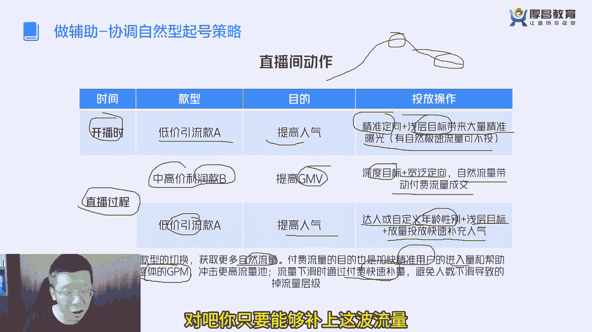

不要你整体直播间的流量下降，掉流量池就可以了，来看这个数据，这是一个单品厨房用品的单品啊，这个也是一个苹果的苹果的，来看这个付费流量，他刚开始这是第一前几天啊，这是第一天，第二天啊，起号的过程。

第一天他就能达到2000的场馆，已经很不错了，很不错了，看他这个就是一波流，很多自然流量起号都是一波流，看下来这个这个还好一些，起来了对吧，付费流量占到了12%，下面的话占到了47%。

自然流量起号配合小店随心推去投放的啊，配合小店随心推，为什么说它这里少了呀，其实我们投放的投放的小票进行推，金额是没变的，只不过我们整体的场关增加了啊，导致这个占比减少了，自然流量是增加了。

自然流量是增加的啊。

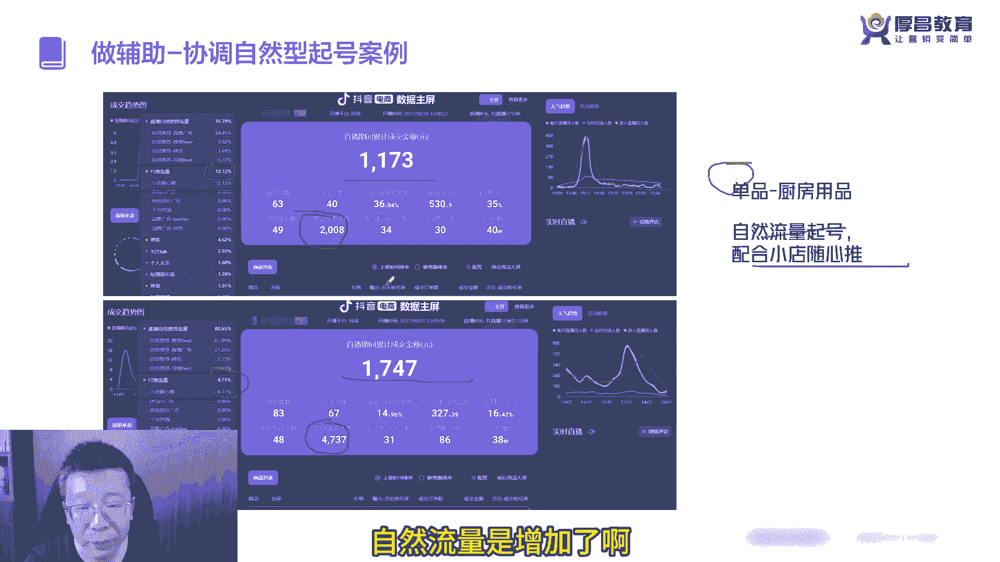

然后小店随心推效果不错啊，付费流量占比不高，付费流量占到了5%对吧，可以直接进入前端等方啊，这就是为什么说哎，如果说你刚开始付费流量占比太大的话，那你要先去调整直播间，先去调整直播间。

把自然流量去转化转化，然后再考虑去介入宣传PC端，如果说你直接去介入千川PC端，可能导致你的付费流量占比更大更大对吧，你看这个啊5000多啊，广告1。78，1。48的RI，但是整体的话是7。

16的RI啊。

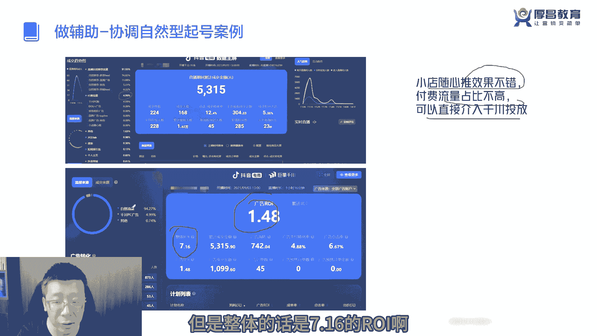

自然流量占比很大对吧，这流量占比很大，这个就是从9月1号啊。

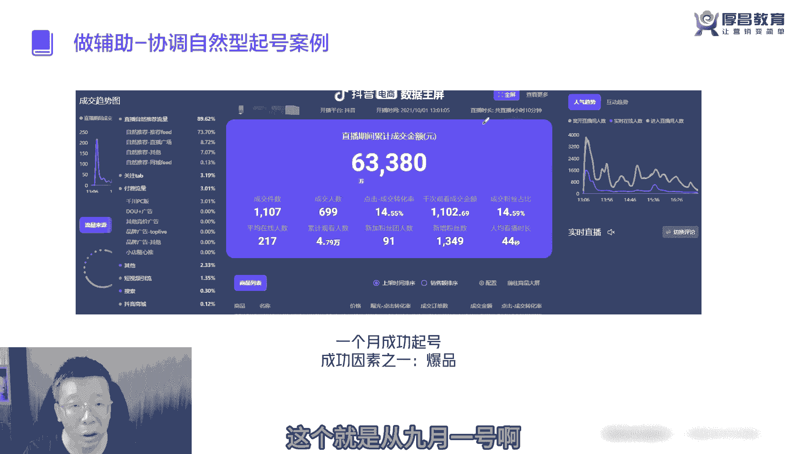

看看这个这个是从8月30号。

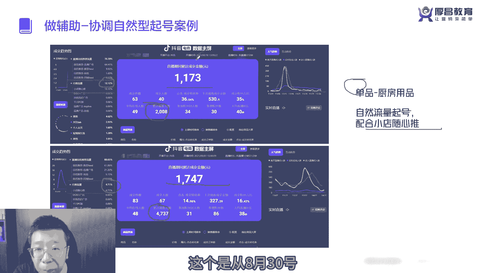

9月1号到10月到10月1号。

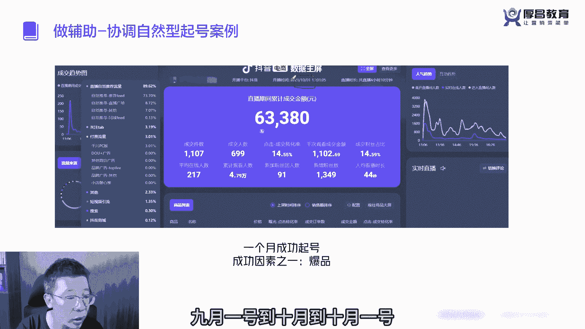

整个的一个起号的一个数据，你看刚开始的话。

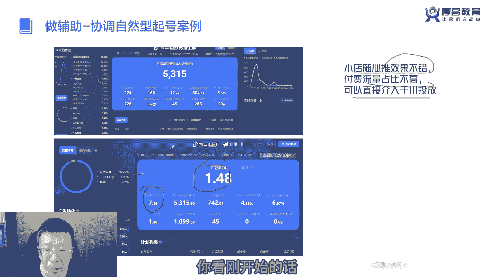

刚开始自然流量为主，这是一个自然流量为主的付费流量去撬动。

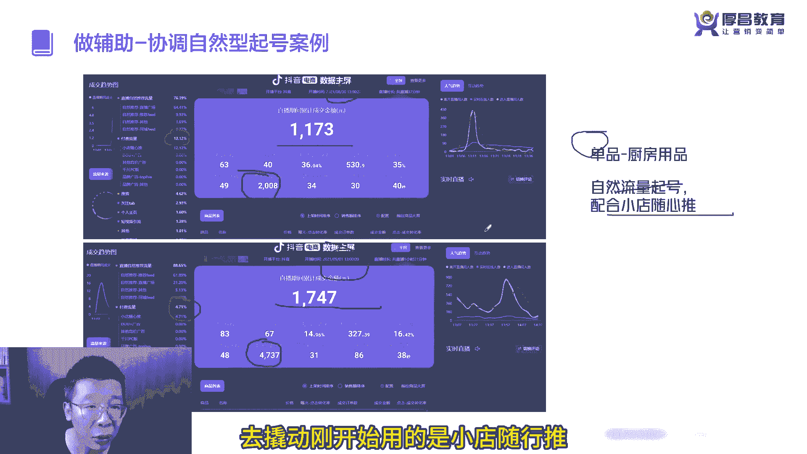

刚开始用的是小调，随行推，小调随行推，慢慢的去介入前川，但是它也是一波流。

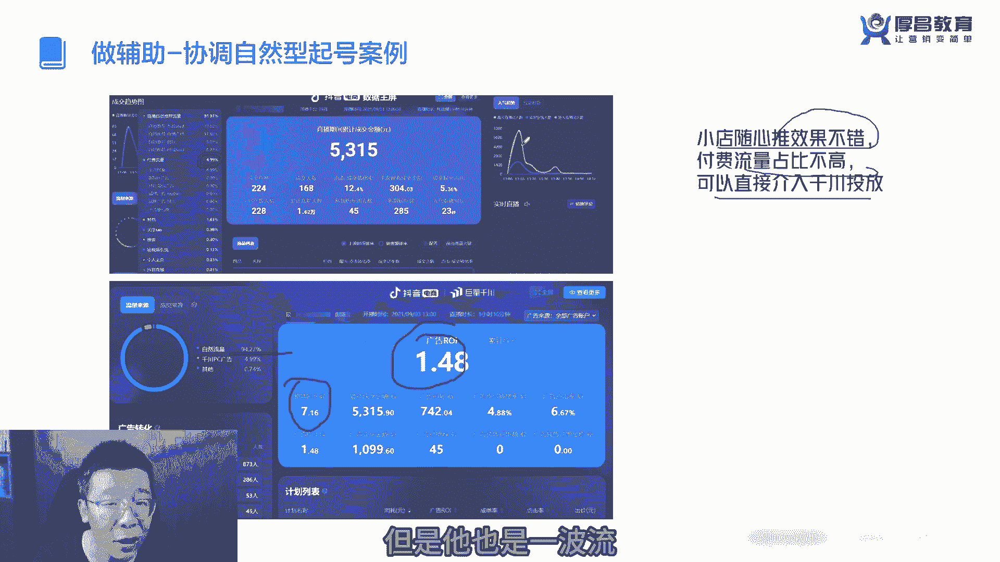

自然流量就是这样，一直是一波流，一直是一波流，然后到这里他还是你看基本上一个月之后，他就能有第二个波峰，下来之后再通过付费起来。

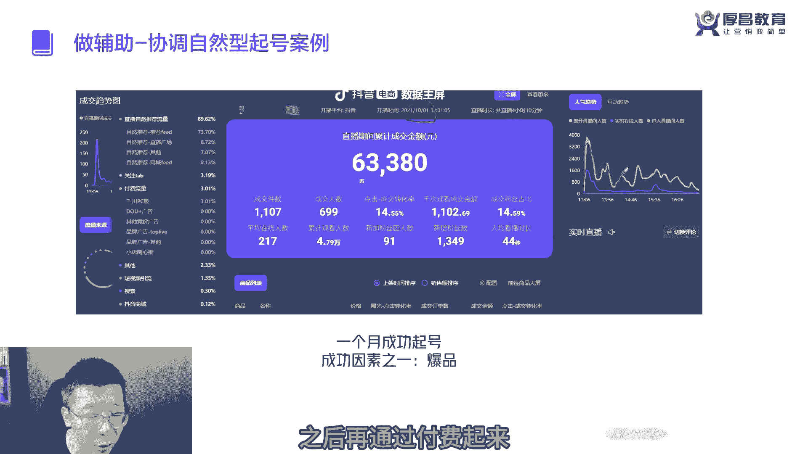

看到没有，你像不像刚才了，之前的话都是一波流。

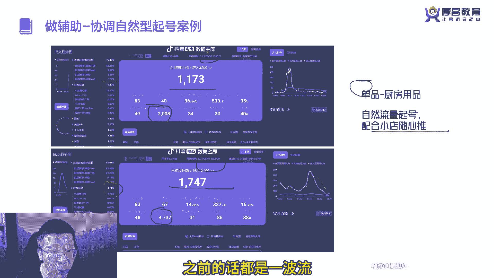

一波后面就没有了，一波后面就没有了对吧，这个也是一波。

后面就没有了，有个小高峰，但是起不来，你看后面一个月之后，通过付费去贷付费这块的话占比3%，但是他的场关已经很大了对吧，免费占到了89%啊，然后呢他慢慢能够通过付费不断的去撬动，不断的去撬动更多的流量。

一个月成功起号成功要素之一，爆品啊，这个品其实就是找了个爆品啊，一个爆品爆了他的视频啊，视频很少，但是呢通过付费啊，他们的自然流量就就带起来了啊，所以说像你想要去通过自然流量啊。

然后呢付费去协助自然流量起号的，那么一般是什么，一般是你的直播间人很牛逼，人很牛逼，就像那个男一对吧，主播很有特色，而且他这个运营手段话术很牛逼，场场景很很好看，就比如说我们那个呃好看的场景。

像之前比较多的美少女美少女嗨购，他也算是一个场景，或者说像有一个魔术师之前我们说的，有一个魔术师的直播间，他的停留就特别高对吧，货你的货有爆品。

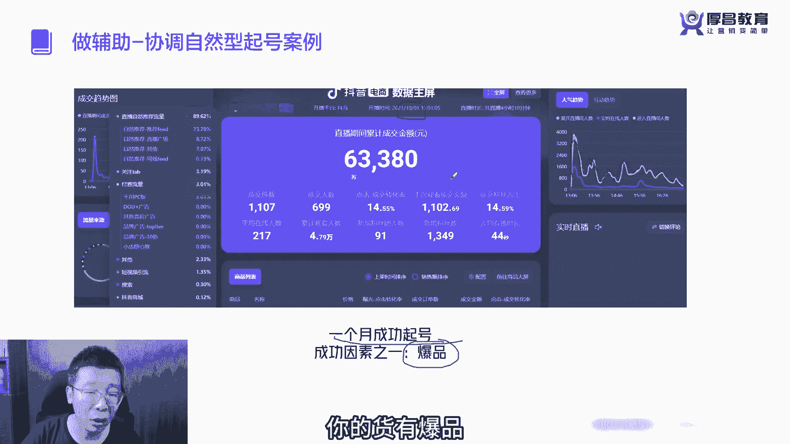

那么都是可以带动自然流量的，都是带动自然流量的对吧，来刚开，刚才咱们说了两个，一个纯付费和一个撬动自然流量，作为辅助的两种策略啊，这基本上就是我们大部分做千川是要做的。

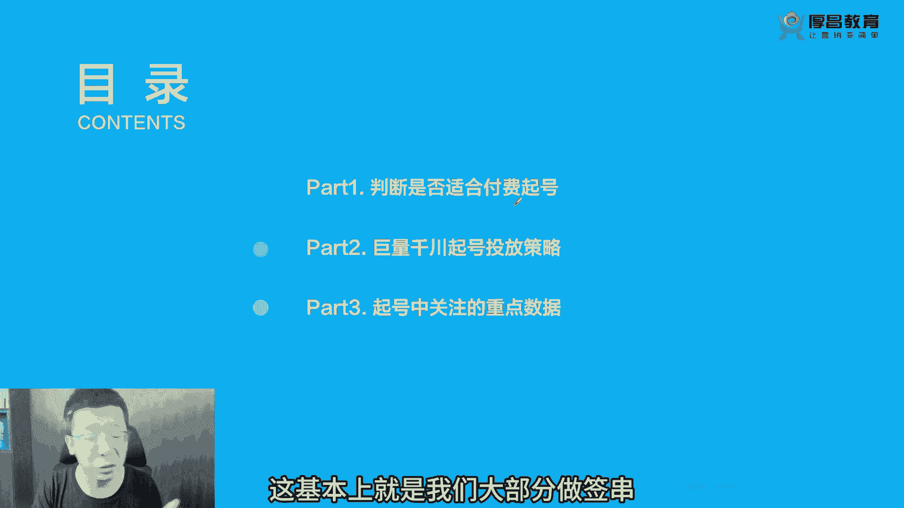

两种策略，然后我们看重点关注的数据，我们直播间要重点关注哪些数据，新版大屏大家都熟悉吧，新版大屏更新了之后，把千次观看成交金额放到了最前面，对吧啊，实时在线人数曝光，公害之前是曝曝光公害率啊。

现在的话是千次观看成交金额，不管说哪个在前面吧，咱们说咱们做付费的时候，重点要看的东西，第1000次观看成交金额JPM，观看人数，场关我们要看场关长官啊，那没有啊，人均观看时长，人均观看时长对吧。

观看互动率这个数据，对啊，那么的话其实还要关注这个数据啊，我就先要关注这个数据，成交密度与成交高度啊，经常其实这个是直播带货运营方面的内容啊，就说为什么说你看这是进入人数，为什么他进入比较多啊。

开播开播有一波流，大家都知道开播会有一波一波急速流量，一波急啊，一波自然流量对吧，它会比较多，你看这块慢慢才有成交，这是成交金额，有一个密度，每一个高峰，每一个这个成交的高峰。

后面基本上都会有一个进入的高峰，都会有一个进入高峰，或者说你可以看你的停留时长，停留时长越越高，那么相应的他的一个也也都会，就是说每一个因素，其实都会影响这个进入这个黄线，进入这个黄线。

不管说我们你看这个我这成交了一个，它会有一个高峰，我这成交一个他会有一个高峰，对啊，一定要注意这个，当我们一直连续没有成交的时候，就要哎要不上爆品，要不重新换一下品，要不提示一下主播来状态。

往回找一找啊对吧，观看往回找一找你的状态，往回找一找，或者说找一点，找一点那个低客单价的品引流品去上一上，对吧啊，是这样的去做对吧。

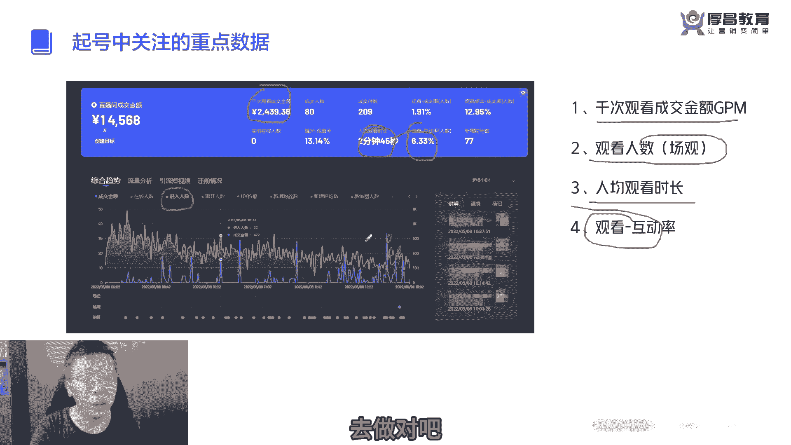

那么怎么看怎么看，来给大家一个表，给大家一个表，经常有人问，就说我在起号的时候，我应该重点关注哪些数据，我要看停留有没有一个指标啊，我看我的互动有没有一个指标，看哪一个比较合适，看哪一个比较合适。

来看这个起号的数据啊，就是刚才那个8月31号到10月1号，它整体的起号数据，成交金额，成交金额一千一一千七五千五，56万，1万56万，直播时间半小时，一小时，一小时，16分钟，三小时四小时，有人说呃。

我起号要不要拉时长，各位你们觉得起号要不要拉时长，对不要不要千万不要拉伸长流量，走了，该下的下，不要说死磕啊，我当年数据不行，我要走，你越播越没人，越播越没人，因为我们还要做到什么。

刚才咱们说的七天螺旋起号有没有道理，有道理有道理，七天螺旋起号，不管说他七天螺旋不螺旋不起来，起不来对吧，但至少说咱们每一天要比上一场要好，对吧，哎每一场每一就这一场要比上一场好有进步。

那么什么叫做进步，场外增加了停留，增加了销售额，增加了，对吧，其实重要的我们看再往后看啊，我们看哪个重要，第一我们看往从后往前看啊，这个比较深，先看这加团人数，我们看这是营销额啊对吧。

他的营业额在增加的，GMV在增加的，加团三十四三十一四十五哎，这降了还这降了35，91不成正比吧，而不是说我的加团人数做的越好，我的一个gm也越高啊，不一定对吧，加团率这个数据也不一定。

人均观看时长四十二十八，二十三二十六，反而是下降的这块有点下降对吧，曝光量越大，特别是自然流量，自然流量为主的直播间，你的观看时长并不长，观看时长并不长，而付费，如果说你付费为主的占到六七十%的。

那基本上至少是一分钟甚至是2分钟，而自然流量的自然流量为主的直播间，基本上都是在一分钟左右甚至以下，一分钟以下对吧，然后再看JPM，有人说JPM重要不重要，就是刚才咱们所说的千次千次观看价值对吧。

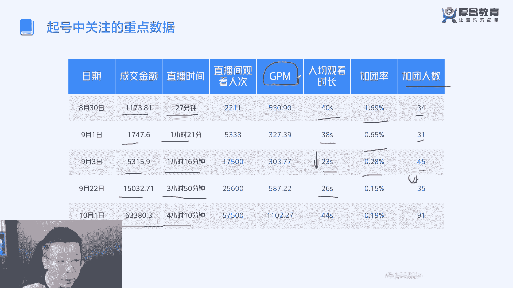

千次观看价值千次，这个浏览价值对吧，这个叫什么千次观看成交金额。

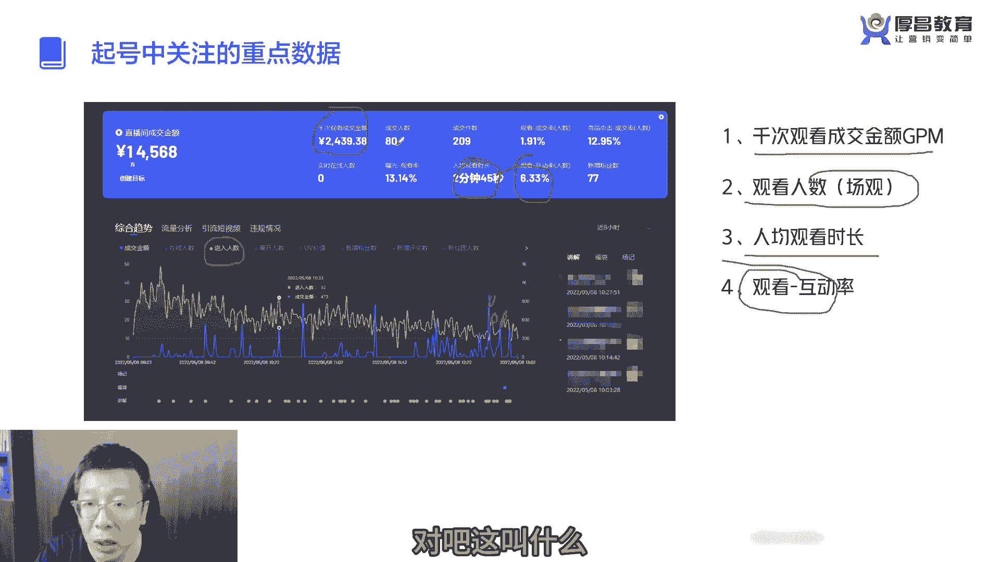

注意啊，来GPM500多，300多300多，哎，这个其实也是有点下降，然后到这里才是上升的上升的诶，这里观看人次场关，我们所说的场关它是在不断增加的，它是在不断增加的，这里告诉大家是一个什么道理呢。

就是我们每一场每一场做的比上一场要更好，怎么叫做更好，我觉得啊我觉得大家把这两个数据抓好就行了，一成交金额，成交金额比较多，对比上一场多，场关要比上一场多对吧，你其他的像一些停留呀啊加团呀，互动啊。

你做到尽力就行，做到净利就行，有人说，那我长宽要不要去做到某一个数值啊，不用做到，比如我我那个啊停留啊，互动啊，要不要做到哪某个数值啊，不一定，因为随着你的曝光，你的场关，如果说爆爆发式的增长。

你的停留和你的互动可能是减少，可能是减少的对吧，所以说各位注意啊，重点关注起号的时候，各位重点关注就关注你的成交金额和人次，观看人次，要不我的观看人数要比上一场好不够不不够，投对吧。

金额成交金额也一定要去往上走，如果说我成交金额，我感觉这场已经废了对吧，半个小时重开重开重新跑啊，这两个数据一定要重点去关注，然后看这个螺旋递增，销量和GPM逐渐递增是整体数据增长的前提，我们看啊。

刚才我们说销量GMVJPM，还有我们所说的厂关场关逐渐递增，是整体数据增长的前提，必须是这几个数据整体往上走，这是螺旋递增，每一场比一场好，然后再者开源节流，先开源再节流，各位有没有大搜的。

有没有从竞价做过来的，有没有从信息流做过来的，所有投放，所有的付费推广都要讲究一个开源，先开源再节流，是不是很熟悉，是不是很熟悉，你先有流量进来，有人说我成交投不出去，我成交投不出去，没成交，先跑再说。

成交投不出去，投下单，下单投不出去，投商品按钮点击，不行的话，投唱啊，偷观看投进入对吧，哎肌肉，你说那那我肌肉跑的太散，定向呀，定向不会吗对吧，定向你说我不精准不精准，怎么办，不精准报课。

哈哈哈哈哈啊对吧，学习啊，gm增长缓慢时，需要先优化互动和停留数据，获取更多的关，才能获取更多销量，总结一下今天一个半小时课程的内容，巨量千川三步快速起号，哪三步哪三步，第一先根据你的赛道，你的泪目。

你的直播的形式是直播，是停播还是过款对吧，是哪种类目，是高利润品还是低利润品，确定千川的介入方式，介入方式，根据投放目的把控巨量千川的投放策略，达到最好的效果对吧，你是要我确定了我的利润够我全付费去做。

我付费达到五六十六七十%，我能够盈利，OK不用考虑什么自然流量了，投胎对吧，如果说我在流量还要要我利润比较低，OK那你自然流量，短视频流量，付费流量都要去做，但是这个时候付费流量的投放。

就不能够那么夸张了，你要先优化好你的人货场，以主播的话术，你的场景，你的摆件诶对吧，你的过款，把你的商品的排序优化好，这些之后有自然流量，或者说要不你去拍短视频，要不的话你赔本不赚钱呀，那咱投个啥呀。

对不对，然后再去投放，去定策略，最后螺旋递增，开源节流，根据监控啊，然后监控起号的效果，先螺旋递增，然后再去节流，开源螺旋梯通，每场比张好，先开源，先来流，先来流量，再去优化，看数据，然后再截流。

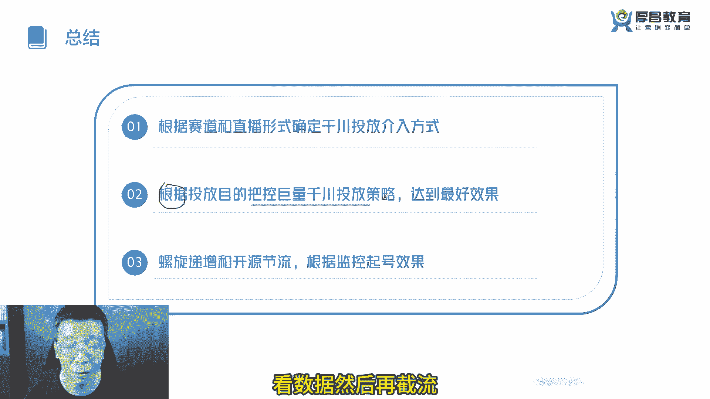

再去优化好吧。