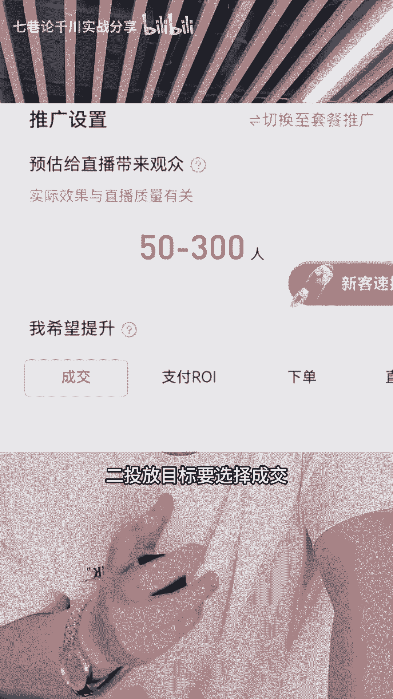
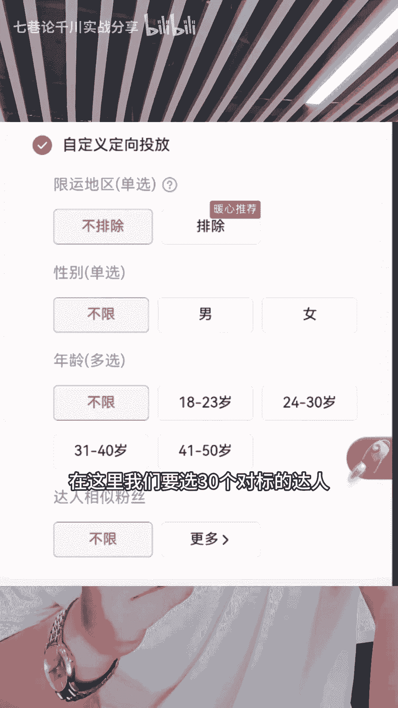
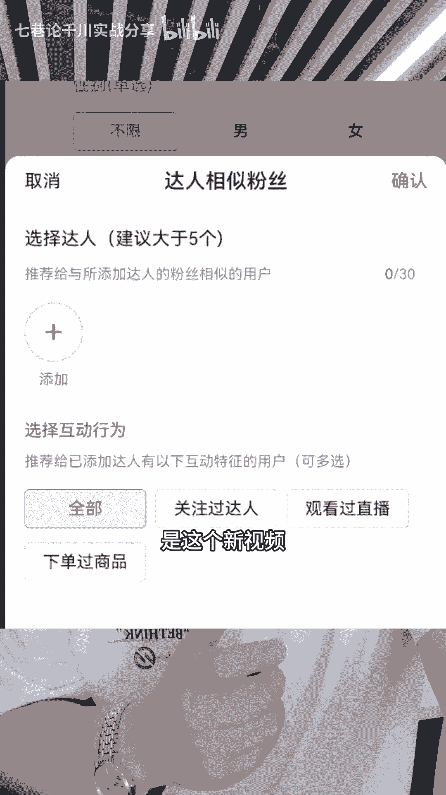

# 直播带货小店随心推3天起号实操方法 - P1 - 七巷论千川实战分享 - BV1H1421t7E9

随心推怎么快速起号，用我下面分享的旗号三个操作步骤来起号成功，简简单单按照我的操作步骤来啊，表哥们都能学得会，第一个步骤呢，前期随心推起号怎么投一加热方式呢，要选择短视频加入直播间。

因为短视频能够筛选流量，能够让你直播间更容易转化，特别是起号阶段，二来投放目标要选择成交。

前期咱们要给视频建立精准的模型，投放计划来前期不选系统推荐，要选自定义，在这里选达人相似粉丝，在这里我们要选30个对标的达人去选满。

来我们说一下原因啊，因为如果你是新视频的话，视频它没有一个历史单数的积累，如果你一来就跑系统，推荐它，系统呢就很容易把流量跑泛，因为你没有成交单数的标签，所以你RY基本上是提升不上去的。

在这里我们投达人相似的目的来是这个新视频。

我们可以投同行相对比较精准的一个流量范围，给这个视频去喂一些标签，大概为30单到50单，那么你的流量就精准了，这是第一个步骤，那么第二个步骤呢，一个计划一个视频，因为一个新视频啊，按照第一个步骤。

你投达人相似，你一百一百的去做一个叠投对吧，视频他只要足够去累积大概3~50单，那么基本上你这个视频的标签就建立好了，然后你就操作第三步，这个视频累计模型成功了之后，视频呢你就投系统推荐。

前期投成交一百一百的小额跌投，如果你投了很久，你发现RY在开始下滑的时候，就证明这个视频可能后面就开始流量跑发了，这个时候你就把成交改为支付RY去，稳定它的投产，这就是一个起号的阶段，表哥们听懂了吧。

再给兄弟们总结一下，如果是起号图随应推呢，新视频按照这个步骤就行了，第一步，投达人相似选择对标，给这个视频建立30单到50单的成交标签，第二步嘞有成交标签了之后，投系统推荐投成交去提升我们的RY。

第三步，系统推荐投成交，跑久了之后，他的流量会变慢，那这个时候来就投资-2Y去稳定你的投产。