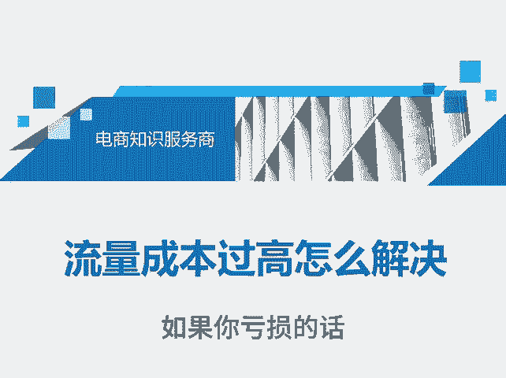
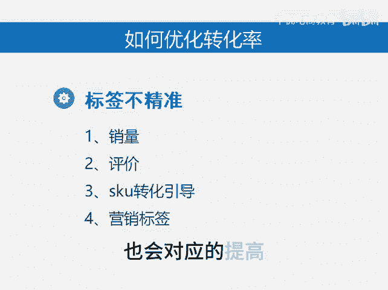

# 直通车亏损该优化什么数据 - P1 - 千优电商教育 - BV1kBsheyEJZ

很多朋友是持续开车，持续亏，但是呢也不知道怎么优化。其实直通车如果你亏损的话，优化哪个方向呢？在这里和大家探讨一下。我们看销售额等于什么等于转化率乘以订单量乘以客单价销售额除以花费等于投产比。

所以说你整个运营的过程中想办法要提高销售额，而销售额里面最重要的就转化率。假如说你每天消耗100块，你的转化率是1%，那么你一天可能出一单可能出两单。如果你把转化率优化到2%，那么你的单量翻倍。

所以在整个直通车亏损的情况下，你优先考虑转化率的问题，转化率是可以直接解决你店铺的销售额和订单量。那如何优化转化率。

大家都知道一部分什么就是自我销量出评价除这一套之后不知道了其实下一步你更应该优化的是SK转化的引导，其实SK它非常重要吗？就是你如何设置一些合理的SK引导用户下单，或者说你都是低客单。

那么你能不能添加几个高客单，然。😊。

也引导用户，这样呢也提高了你的客单价。那你的投身比也会对应的提高，转化率不仅仅是销量和评价。我是讲师大牙，欢迎大家扫码添加我的微信，不方便扫码的朋友可以添加我的微信号，80221430。

在这里给大家准备到了一套新手运营入门的大礼包，希望能够帮助大家。😊。

