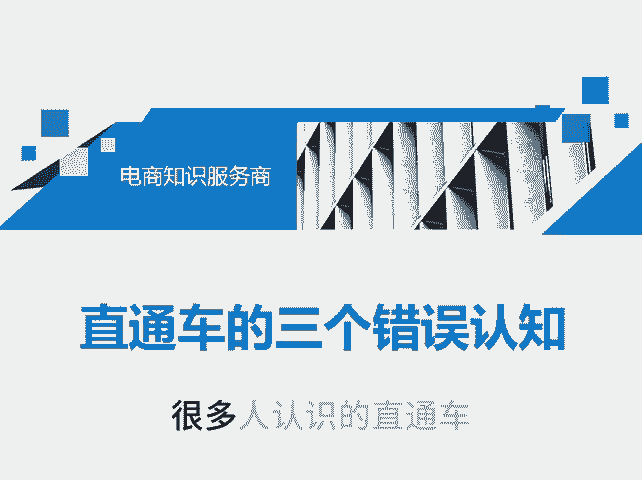
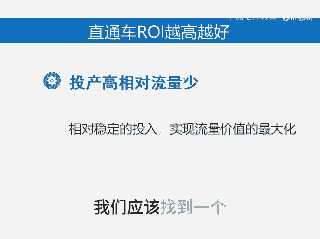
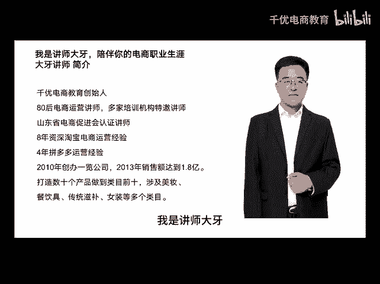

# 直通车的三个错误认知 - P1 - 千优电商教育 - BV1dysSepEUz

很多人认识的直通车其实是错误的。第一个就是很多人以为直通车它有很高的技术含量。其实你必须知道直通车它仅仅是一个引流工具。那什么是引流工具呢？就相当于你到外面去发传单，相当于你到火车站去拉客。

那请问发传单和拉客有很高的技术含量吗？应该是没有。再一个，很多人以为直通车的运营是一个店铺运营的关键，那么请问发传单那就能把你的店铺做下来吗？其实不一定吧，一个店的成功最终是产品和用户体验。

其实可以负责任的告诉你，下一步的运营一定是产品运营，你需要做的是做好你的产品，并且做好你的店铺营销，仅仅靠开车，如果你的品有问题，谁也救不了你。第三个就是很多人以为直通车的投产比越高越好。

其实我们知道呢，你像投产比出价。如果你的投产比设置的很高，那么你的流量就会变少。投产比出价高，相当于实际上你出价低吗？那么你的流量。😡。

找即使你的投产比高，你也不能够实现流量价值的最大化。我们应该找到一个合适的投产比啊，让我们流量最大，而且利润稳定。我是讲师大牙，欢迎大家扫码添加我的微信，不方便扫码的朋友可以添加我的微信号。

80221430。在这里给大家准备到了一套新手运营入门的大礼包，希望能够帮助大家。😡。

