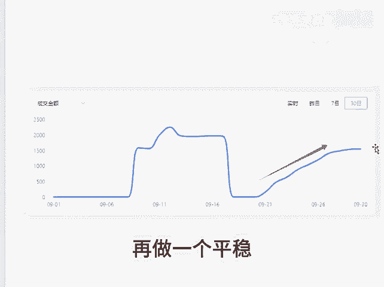

# 直通车的优化原则 - P1 - 千优电商教育 - BV1WE1XY6ExG

现在的直通车整体优化非常简单，但是我看到呢还有些博主做了一个什么调车口诀，属于明显把简单的问题复杂化。现在的直通车优化的地方只有两个，一个是出价，一个是日线额，那出价该怎么优化呢？

其实一句话就是前期逐渐提高，后期逐渐降低，什么意思呢？一个新品，你开车建议大家先低出价，如果是投产比呢，你先高出，如果烧不动，你再调整，一次优化5%到10%，直到能够烧动为止。如果你上来就出高价。

那么后来呢托价比较难，难以实现盈利。其实前期就是低出到后期等到你的曝光越来越多，花费越来越快，实际跑出来的投产比接近于你设计的投产比，这时候你在托价。所谓托价就是慢慢的降低出价。其实这就是出价的设置。

几乎没有任何技术含量。再就是像日限额，日限额这个地方呢，它是只能提高，不能降低。😡，因为我们知道，如果你想获得持续不断的流量，就要持续不断的给拼多多充值。所以说日线额你前期可100，后来200。

再后来300，但是涨上去之后尽量的不要往下降。因为降低日线额，那么你整体购买到的流量就会少，你的订单就会少，订单少，你的坑产少，那么你的权重就会降低。所以在整个直通车操作的过程呢，应该是这样一个曲线。

这群大家可以看到，前面这一块不说大家也知道是什么原因。到后面呢你整体做一个拉升，再做一个平稳。这是整体成交金额的表现，我是讲师大牙，欢迎大家扫码添加我的微信，不方便扫码的朋友可以添加我的微信号。

80221430。在这里给大家准备到了一套新手运营入门的大礼包，希望能够帮助大家。😊。

