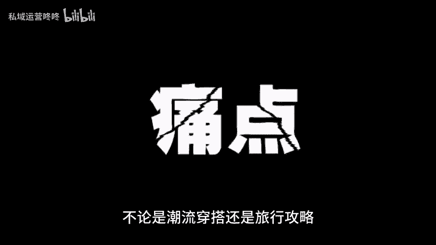
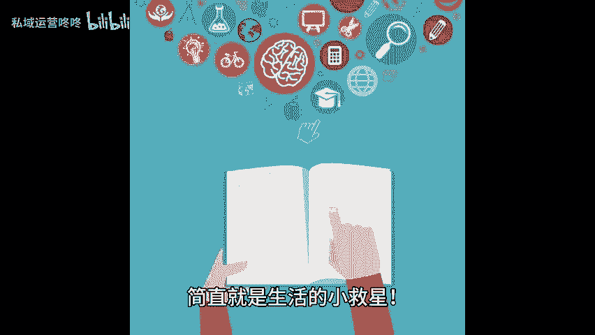
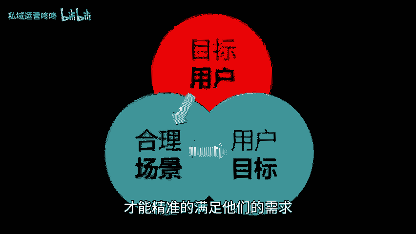

# 看了很多爆款内容，发现它们都有这三个核心要素 - P1 - 私域运营咚咚 - BV1RnsxeQECx

🎼相信很多人都有过这样的疑问，为什么别人的内容能成为爆款而自己的却不能带着这样的疑问，我看了很多爆款内容，发现这些内容都有一个共性，那就是具备三个核心要素，一、与用户需求有所交集。

成功的内容一定要和用户的需求产生共鸣。比如说有人想要护肤密籍。有的人在找美食推荐优秀的博主总能找到这些痛点，打动用户的心。无论是潮流穿搭还是旅行攻略，只要贴近大家的生活，就能获得更多用户的关注。

2、满足了用户的需求，在爆款内容中满足用户的需求，可是必不可少的。不仅仅是提供信息，更是给出了解决方案。比如教你如何快速收拾家里的杂物，或者分享高性价比的护肤品，简直就是生活的小救星。

所以要了解你的目标用户在寻找什么，才能精准的满足他们的需求。3、让用户感受到价值。无论是使用干货优惠信息，还是简单的情感共鸣。这些都是用户愿意点赞分享和收藏的理由。如果能够。😊。

🎼让用户觉得哇，这真的太有用了，那你就成功了。所以宝子们想要打造爆款内容，就从这三个方面入手吧。😊。