# 知识类账号如何起号？培训机构割你大几千的课程，我这里免费分享！纯干货，跟我一步一步实操吧！ - P1 - 卡拉米soho - BV1qw4m1v7mf

好大家好啊，今天呢我们给大家来讲一下，关于知识类的这种视频，怎么去起号，所有的知识类的视频，不管是说哲学思想，健康饮食还是其他的生活方式等等，这些知识类的，总的来说无非就是四个部分。

第一呢找到你对标的这个视频，第二个呢通过AI的形式啊去仿作他的这文案，第三个呢，就是把这个文案转化成老外的这种语音，第四个呢就是提取一些免费素材啊，使用一些免费的插件和软件，或者是网站来剪辑整个视频。

那么接下来呢我们就一一实操，首先呢点开TIKTOK。

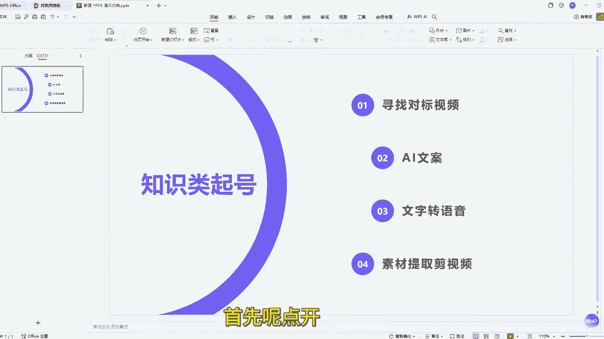

我们找到一个啊关于知识类的这种博主，我们点开一个视频。

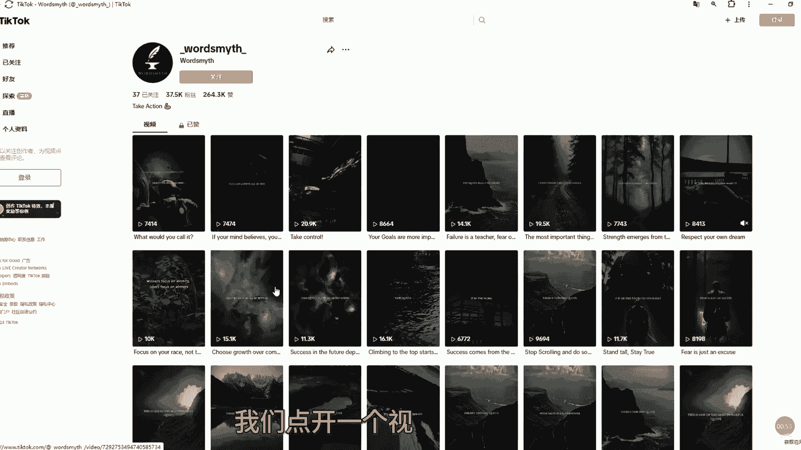

打开看一下，Did you know you possess a real superpower，but just行，我们打开这个视频呢，我们先把这个链接给它复制下来。

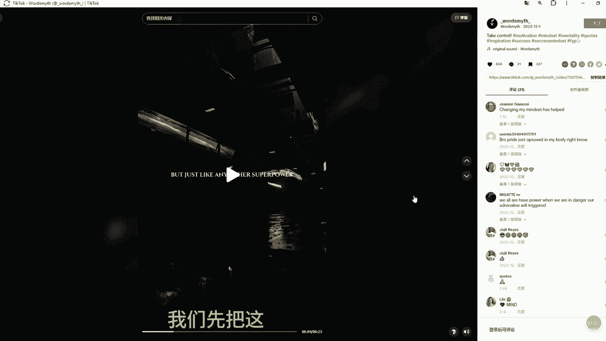

我们用到今天第一个工具啊，就是免费把这个TIKTOK视频下载下来的啊，把这个链接一粘贴，直接下载啊。

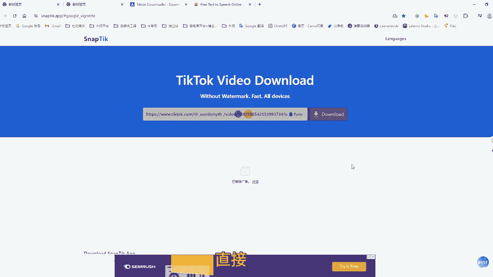

这里直接点下载。

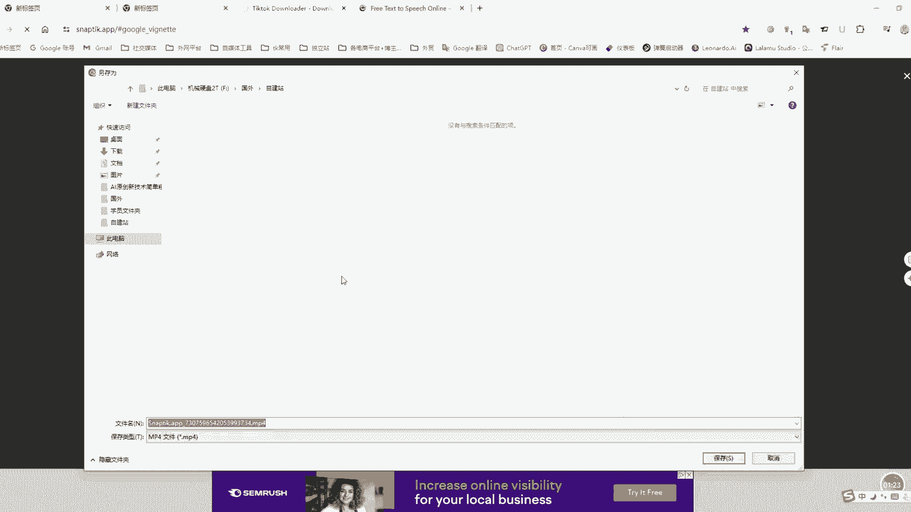

把它放到这儿好好，很快我们这个视频就已经放好了啊。

我们打开，Did you know you possess。

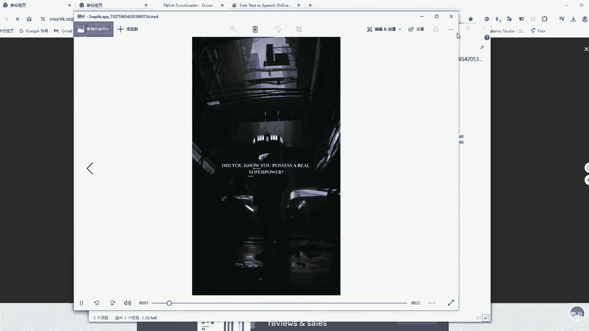

第二步打开剪映，把这个视频拖进去。

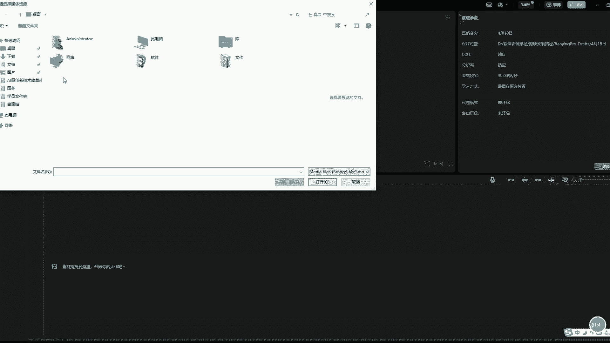

稍微播放一下，我们在这里，识别文字，好的，此时我们打开看一下这个字幕，哎这个字幕就已经非常清晰的选择出来了。

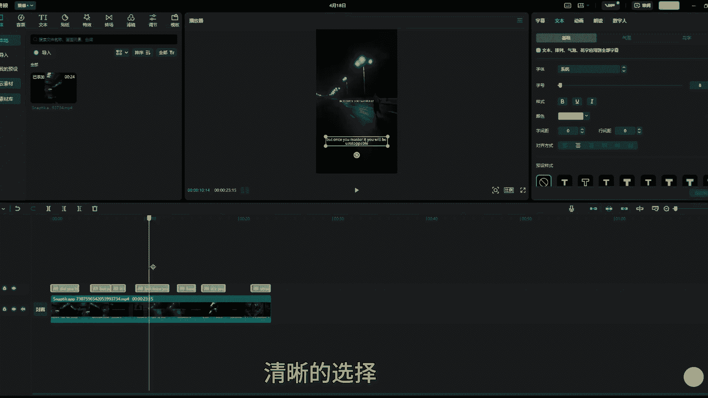

然后我们选择导出，导出的时候，把音频和视频给它关了啊。

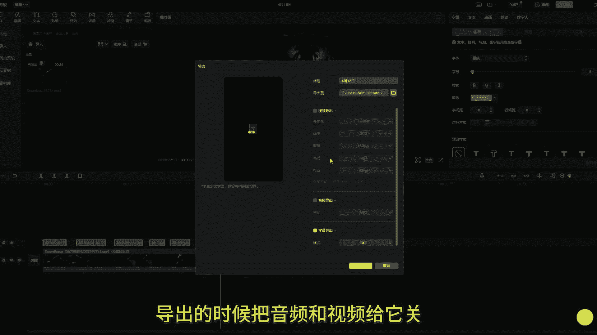

我们直接选择一个文件夹，直接给它导出。

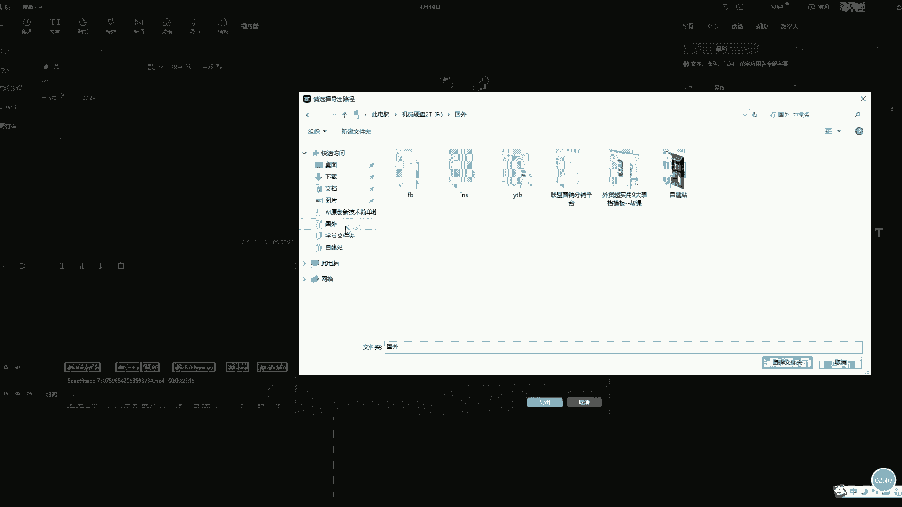

抖出字幕就行了，好抖出好。

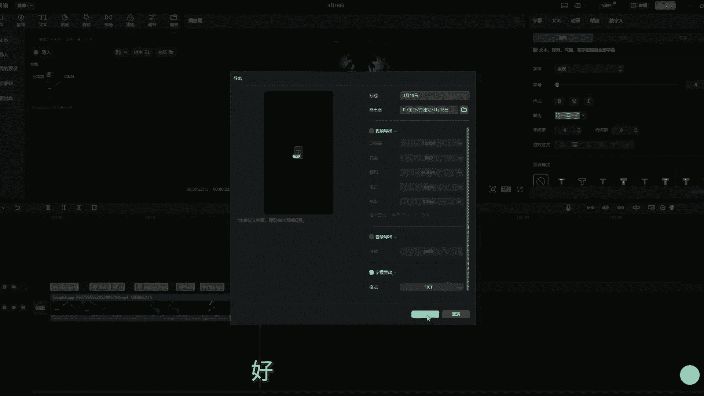

打开文件夹，大家看这个时候我们的字幕是不是已经出来了，已经出来之后啊，我们可以用翻译软件，或者说chat GB t来看一下这个字幕，它是什么意思，以便于我们更好的理解。

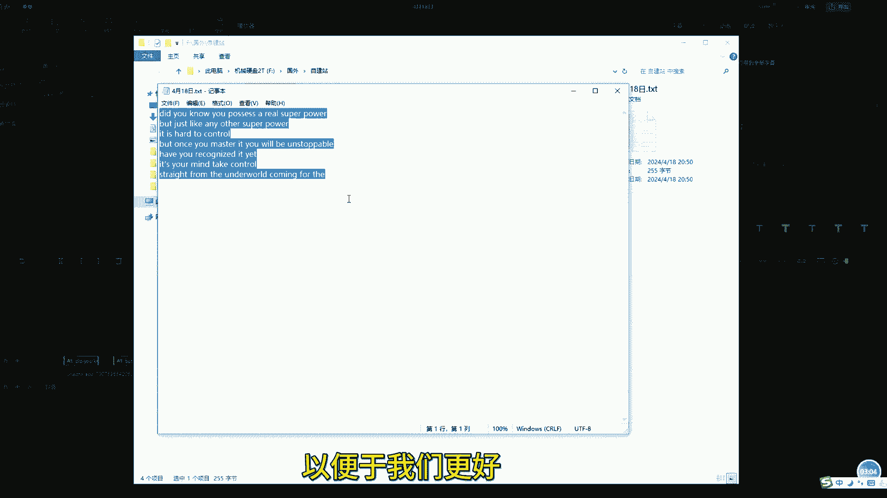

好的，我们复制这个字幕来到chat gbt这个页面。

给他输入指令，输入指令，请你帮我翻译一下，看看ChatGPT好，ChatGPT把它翻译出来了，你拥有一种真正的超能力，就像其他超能力一样，但很难控制，一旦你掌握了它，你将无法阻止，你意识到了吗。

我们接下来给chat gt输入指令，让chat gbt按照上面的文章帮我们仿写出来，好的现在GBT已经帮我们写出来了，我们就以第五个为例好，这个时候我们把第五个给他复制一下。

复制一下之后打开另外一个软件，我们将文案粘贴到这里，然后在这边选择一个老外的声音，可以试听一下，Tts maker is a free tt。

Tts maker is a free text to speech tool that provides speech。

Tts s maker is a free text to speech tool that，Provides speech，Synthesis services，好我们现在就用他的这个视频输入验证码。

立即转化视频，Did you know that you possess a real superpower，好的，现在他已经把我们这个文字转成了语音，我们点击下载这个文件。

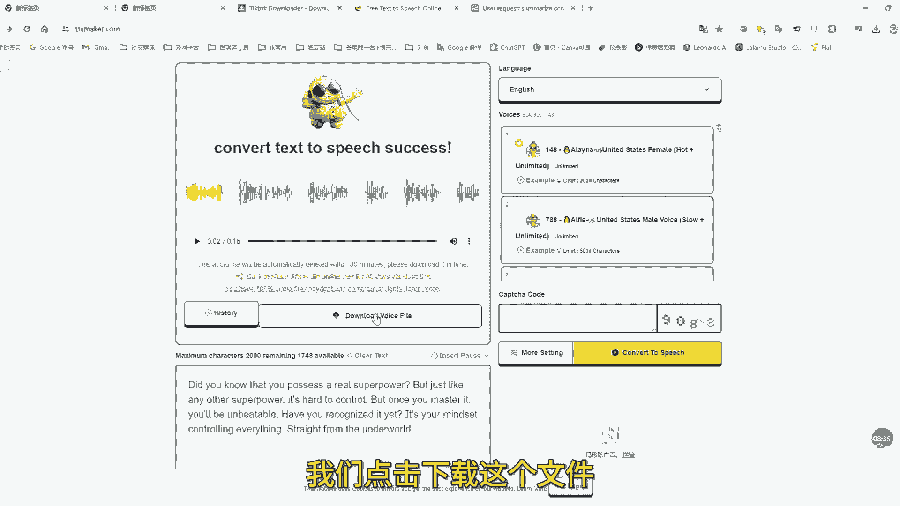

现在我们再次打开剪映。

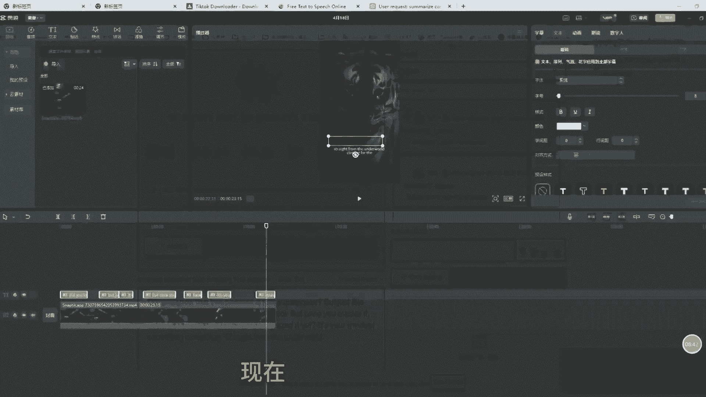

把这个文件拖到剪映里面试听一下，Did you know that you possess a real superpower，But just like any other。

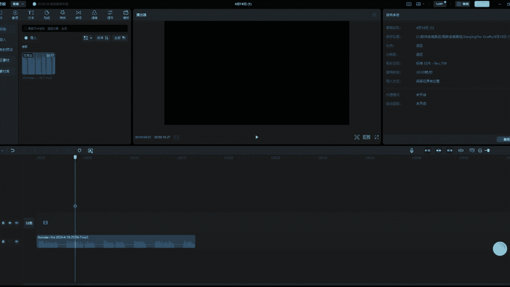

好的，我们现在回到JT来仔细分析一下，这个文案属于什么类型，你是否知道你将拥有一种超能力，就像任何超能力一样，他这个其实是有一点像这种哲学，意识形态这一块的正能量的这种视频，所以呢这个主题是正能量。

我们就去找一些正能量的素材来匹配它，那么我们打开这个软件，是免费的一个素材网，我们完全可以搜索一些正能量的，比如说我们在这里输入跑步，选择视频，点击搜索，好的已经有非常多的这个视频可以挨个儿挑选。

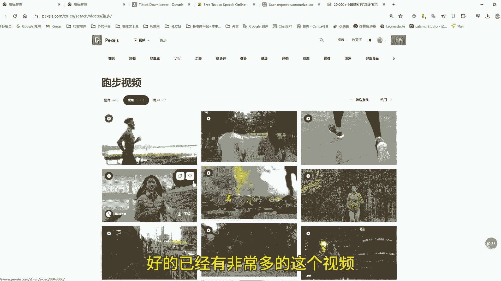

直接点击下载就可以。

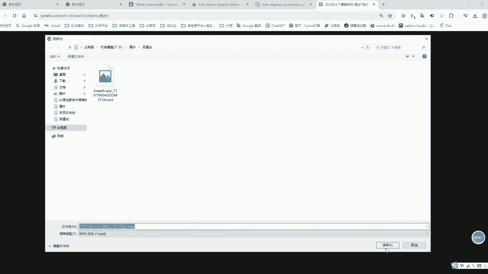

不需要登录注册，很方便，然后我们把这些视频全部拖到简易里面，接下来就是在剪映里面对它进行编辑，首先我们要确定一下比例，因为我们做的是竖屏16比九，然后对于每一个视频来说啊，都要给他调整一下比例。

因为我们这些视频都是红屏的，我们直接可以把它拉成竖屏，然后需要把每个视频拉齐拉齐之后，针对每一个视频要进行一系列的操作，我们首先选中四个视频，首先在设置这里面我们要进行一些调节，打开这个HSL。

把里面所有的一些参数进行修整，之后我们要关闭这一个轨道，它的这个原有音频，然后我们再添加滤镜，随便添多找几个滤镜，Did you know that you，添加滤镜的时候呢，把这个滤镜拉齐啊。

这个地方从这儿开始都可以，选中这两个滤镜，把强度值可以稍微调整一下，接下来呢需要转场，在这里我们比如说以这个黑白为例，闪黑直接放在这儿拖进来就可以。

Did you know that you possess a，然后我们需要把这个文字识别出来，选择一个相对好看的方式，稍微拉大一点，如果它长了，完全可以把它分成两段。

同样的我们还可以对文字进行一些动画，这个根据自己的喜好随便设置，It's your my，Did you know that you possess a real superpower。

But just like any other superpower，It's hard to control，But once you master it，You'll be unbeatable。

Have you recognized it，Yet，It's your mindset controlling，Everything straight from。

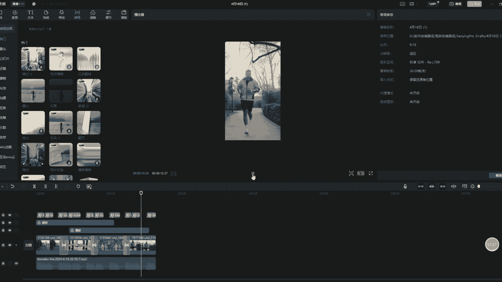

然后我们把这个视频导出，这样一个起号的视频就已经完成了。

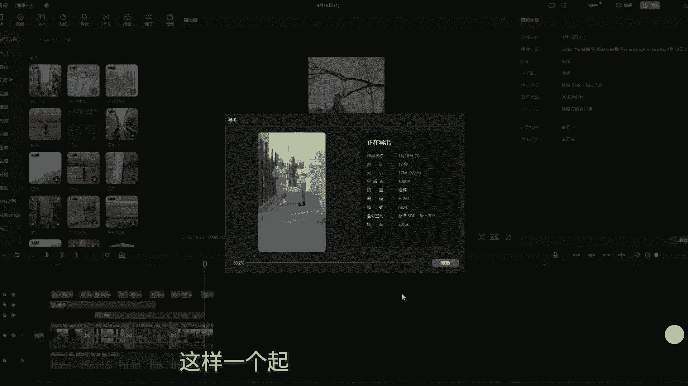

我想通过这个起号视频给大家说一什么呢，就是你在选择这个素材的时候，一定要是免费的，没有版权的，其次呢，因为我这里是视频给大家去演示，我没有花足够的这个精力去挑选和筛选，什么样的视频合适。

所以说大家要花一点心思，你挑选的这个视频，一定要和你的文章的主文案的主题相契合，比如说他这个文案就比较偏正能量，你就不能用那种暗灰系的，你得需要一些正能量的，比如说跑步健身啊。

或者是美食等等一些跟他有相关的啊，就是寓意相关的这一层面，然后呢对每一个视频呢进行稍微的一些剪辑，包括滤镜，文字的添加调节啊，包括画中画等等这样的一个形式让大家去做，整个过程呢就是这样。

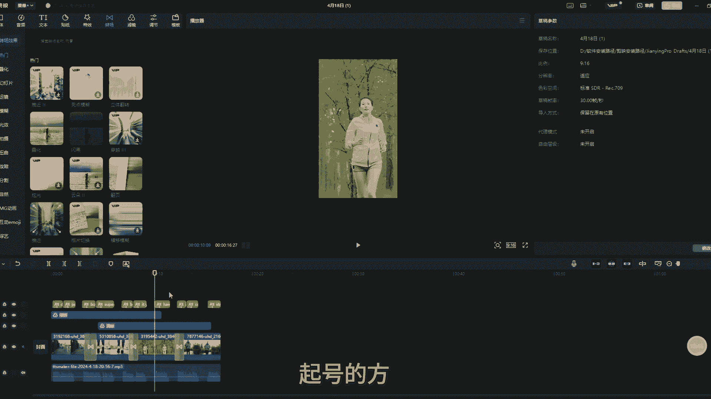