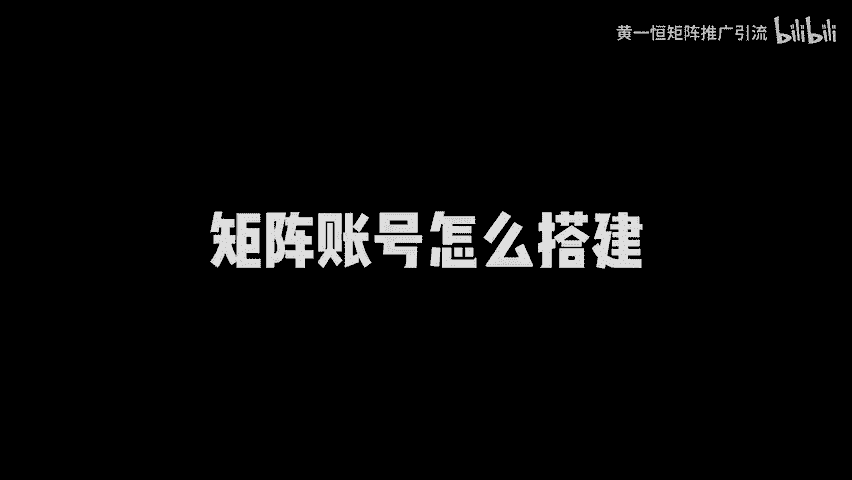

# 矩阵账号怎么搭建，4种矩阵搭建方案详解！矩阵账号是如何搭建运营的，矩阵号怎么搭建，矩阵玩法是什么意思，矩阵营销教学，矩阵营销搭建，矩阵账号搭建，矩阵账号模式，矩 - P1 - 黄一恒矩阵推广引流 - BV1Z5p1e6EMS

最流氓的引流方式就是复制挤阵，单个账号引流模式跑通，复制出10个、20个、50个几账号。复制挤阵简直就是线上流量的超级放大器。

ice我们新建一个老板，靠这套几针打法支撑起来，30个的C团队。聊下来之后呢，我发现所有的核心发动机就在这套矩针打法的流程上面非常的标准化。我来分享给你季节废话。

一个视频给你分享几帧账号怎么搭建几阵营销获客，视频有点长，记得先收藏，一起来看，我给你分享，目前帧号的现状是什么？几针到底还能不能做。当下能玩的4种几针玩法又是什么？现在看目前几帧号的现状。

很多伙伴前几年搞了几帧，因为做的比较早，平台对几阵管理的相对来说比较宽松，通的视频我们只要简单修改一下，就可以发布在3到5个账号上面，每个账号呢都可以获得比较不错流量，拍多伙伴比较厉害。

搞了个几帧软件通过软件批量混剪，做了几十个账号。每个账号呢都做的比较不错，但现在平台做了几针新规。

同样的视频必须要有超过50%以上的画面不一样，才不会判定单印和查重。否则呀你就成为了平台重点打击的低质量同质化的内容。因为平台转向了存量市场，希望留住用户，所以呢就希望大家能够创作一些高质量的内容。

来为用户创造更多的市场。所以目前几证的难度啊可以说是增加了很多。因为平台对重复流的限制也比较严格，轻则限流，重者违规，甚至直接给你放号。所以咱们在做几证就需要花更多的时间和精力来创作高质量不同的作品。

这也是为什么你会发现，目前平台几张号减少了很多。原来做的比较好的博主。现在更新频率也减少了，或者有的几账号，现在直接不更新了。为什么不更新，一发布就违规，一发布就违规，又做不出这么多内容怎么办？

只能重点做几个账号了，所以到底几帧还能不能做呢？咱们来看一下几帧的可行性。几帧呢依然可以做，只不过难度增加，我们需要花更多的时间来制作不一样画面的内容，所以难度的增加原因。

主要就是平台不再需要重复的内容。所以几帧的核心呢又是通过霸占资源的方式来获得流量。所以咱们霸占资源的方式也变换了，不能通过原来简单的修改。通过软件混检就去发布现在的几针策略要怎么玩？记住。

严禁禁止使用重复的素材或者剪辑。我们需要不同的高质量的作品。什么叫高质量作品？记住，产出原创的优质内容，不必担心说账号出现违规。而且还能够获得更多的流量。那么同一个内容和选题怎么办，我们可以重新拍摄。

我们花双倍的时间就可以了。比如现在我做了一个选题，我可以在这个房间里面拍摄，我可以再换一个背景到外面不断的反复拍。我把一个选题拿过来，拍十遍发布到10个账号里面，而且咱们拍一遍比较慢。当你拍第五遍。

第十遍的时候，你对这个内容已经非常熟练，做起来的效益也能够得到提高。只有这样做出来内容才是新的视频，才能够获得平台的认可，才不会备叛单一才不会被违规。那具体我们该如何去做举证。

这里面给大家分享4种当下主流的矩证玩法。第一个叫做。多账号独立几证，每个账号的作品必须要做到完全独立，不能直接把一个账号拿过来，简单修改一下，就发布到另外一个账号。这种方式已经不行了。

我们在操作的时候是要先做第一个账号测试出MVP把我们账号的流程跑通。比如说做什么选题，人带流量。做什么开场能够进到流量池，用什么方式来呈现，用户不要认可，这些我们都需要进行测试。测试完之后。

我们再把同样的模式拷贝到第二个账号里面，这里面一个必要条件，就是我们要有强大的输入能力。我们得花大量时间来学习来累积自己的业务，就比如说我每天在拍视频，这些视频啊都是要花大量时间去学习的。

不像原来我们拍一遍之后，简单修改一下就可以发布。现在呢已经不行了，必须要做到每个账号的作品是完全独立的。第二个个人IP的复制体的。这种就比较适合有团队人来玩。比如说一个IP老师拍摄原创的视频。

然后呢要架设多个机位来进行拍摄。什么意思？比如说这里咱们加一个机位。这里咱们加一个机位，旁边再架一个机位搞3到5个机位，这样的话可以获取到3到5份不同素材，每天一条一周7条，一个月至少是30条。

接下来我们就可以通过剪辑来复制我们的分身。这里比如说我们配10个剪辑师，这10个剪辑师要剪辑出不同的50条内容出来。这里面我们就可以用到切片剪辑，先用到两个库，哪两个库呢？第一个IP录制的视频库。

比如说我们在拍摄的时候，我们把这个库给它做出来。另外一个呢是单独用来做原创的切片库，也就是说我们一个视频有50%的内容输入的切片库，切片库里面的素材，我们每个。只用一遍，并且要做到混剪穿插。

这样的话就可以让系统识别为原创。接下来我们给它分发到50个账号里面。那一条视频如果一万播放，50个视频，每天也能够带来50万播放。50万播放量呢已经是什么？非常不错，非常可观的了。

那这里面的核心逻辑就在于什么？我们不拼大号也不上热门，重点在于堆挤阵，让我们的流量生生不息，通过多账号通过数量通过每个作品独立来实现流量，重点在于啊我们需要激励剪辑人员，需要设定一个激励机制。

比如说收入跟流量变现相关，激励咱们如果去做的时候，账号的变现业绩就直接跟我们的这个什么激励的比例会受到影响。比如说咱们账号如果产生100万业绩，剪辑人员直接拿2万。那这样的话，在剪辑的时候呢。

才会有动力。接来看一下第三个叫做消费者裂变挤阵。那消费者参与进来发作品。但是啊对伙伴发现让消费者来发作品会有很大的障碍。什么账号呢？比如说发视频太繁琐了，因为得拍素材得搞字幕，还得写文案。

或者说是缺乏动力和好处，消费者根本不愿意来做，那怎么办？我们可以去激励消费者来发视频。首先我们需要策划活动，提供打卡奖励，并且这个打卡奖励，它是要有卖点的。比如说一个爆款的饮品或者爆款的甜品。

甚至单独的一个品就是拿出来就那遍。然后呢要提供这个技术支持，什么叫自助支持。比如说扫码自动能够生成视频，只要在里面套几个素材，文案映色话题意设，团购地址映设，用户呢只需要按照这个流程走一遍就完事了。

目的就是为了提高发布的便携性。但是这个技术支持，一定要你先测试测试完之后能跑出订单出来就可以玩。如果随便乱发发上去啊，也是没什么作用的。好，第四个叫做员工放大几阵，让每一个员工发布不同的视频。

那这里面有个非常的核心点，就是我们前期呀一定要跑一个MVP账号出来。这个MVP呢？非常关键。也是我们前面讲的，用什么选题，用什么开场，用什么话术，包括用什么方式来拍，能获得流量。

让每个员工拷贝这套模板独立运营的账号，获得自运营得什么流量红利，用每个账号都是独立的，而且是原创的。并且员工账号呢，我们如果有栏V号在蓝V号后台就可以直接用员工信息。

创建一个不再用他眼内的使名或者手机号，这就是自运营的流量红利。普通视频也能够获得大量的资询。好给位同学，我是黄一涵，只做落地推广方法。刚才给大家分享的4动集成打法，那如果我们想去落地该如何操作呢？

这里面我给大家准备的18个平台的详细打法，教大家如何做几阵多流量管道，这些呢都是我原创的，可以通过主页来连取进学习。如果觉得今天这个视频比较不错的。请大家一键三连，感谢大家支持。咱们下个视频呢再会。

