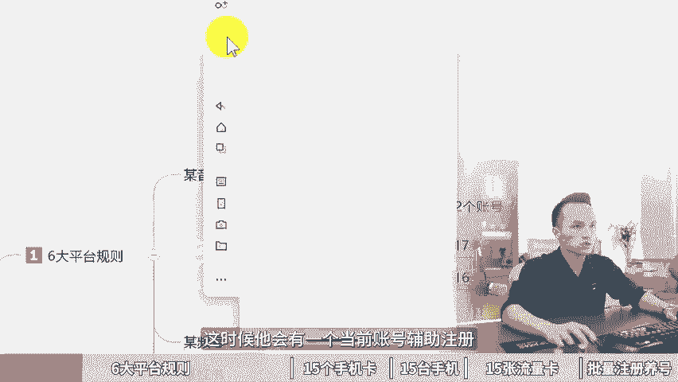

# 矩阵账号注册方法，一个人如何注册90个矩阵号！矩阵账号是如何搭建运营的，矩阵账号管理工具，短视频矩阵账号运营，矩阵账号怎么实名，矩阵号运营全攻略，矩阵号怎么搭建 - P1 - 黄一恒矩阵推广引流 - BV1BweFe3Ekn

🎼3天时间如何注册90个几登账号，而且不需要营业执照也不需要难为。很多小伙伴觉得不可思议，你是怎么做到的？你是怎么做到的呢？你哪里搞这么多实名认证，哪里有这么多手机号码，今天就为大家掰开如税的讲清楚。

我是如何搞定90个几阵账号的，季节废话，一个视频给你分享几阵账号注册方法，一个人如何注册90个几证号，视频有点长，记得先收藏，一起来看我给你分享六大平台注册规则，怎样准备15个手机卡，15台手机。

15张流量卡进行批量注册养号，现来看六大头部平台注册规则。这里我们在做几阵的时候，主要是操作六大头部平台。咱们在注册的时候呢，需要熟悉一下规则，否则你都不知道到底该如何确定注册，更别说要搞几阵账号了。

现在看某音，如果我们想操作多个某婴账号。这里我们必须要使用这个。

实卡注册，什么是时卡？也就是我们的手机号必须要是13151819开头的号段。如果我们通过这种虚拟号，比如说17以及16这种营业注注册卡去注册，它是会强制跳实名，而实名的话，一个人只能一个账号。

至时你要做几证，根本就没办法进行操作。另外如果你的账号是已经实名过的。那么一个手机号来，恭喜你，目前最新版的某音，它是可以直接注册两个账号，这得我来给大家演示示范一下。比如说我们打开这个投屏手机。

登录这一账号，在资料页，我们点击这个小三角，在小三角里面，我们选择添加或注册新账号。然后在这里面我们点击创建新账号，这时候它会有一个当前账号辅助注册。我们点击下方的这个辅助注册。

就可以通过当前的手机发送验证码进行。

辅助，但是呢必须要是死卡，心里号的话，他有可能会辅助不成功。这个点的话我们是需要注意一下的。好，现在他就提示我们创建资料。另外我们也可以通过蓝微号。如果你有企业蓝微号。

我们在蓝微号的管理后台是有一个挤证营销，创建几证账号。每个企业员工账号都是可以创建一个新的账号。那么前提是我们必须要有很多的员工，因为当你创建完员工账号之后，员工在登录的时候，他也是需要进行人脸识别。

所以如果你有100个员工就能够创建出100个员工账号。并且这个员工的使名。他跟我们个人的账号呢是不冲突的。员工离职之后，还可以继承给其他的员工直接转移里面的数据，包括这些粉丝都是可以的。

那如果我们想做某平号的挤证，这时候怎么办呢？他是一赖于某聘，需要进行强制使名，一个人的话，只能够做两个账号。原来最早的话是一个人可以做5个账号，但现在出了最新的规则，一个人只能搞两个。

如果你要搞多个账号的话，这时候呢一般我们都会通过家人和朋友进行一个实名，或者用他们的一个某屏号，然后把自己设置为什么管理员设置为管理员之后，当我们在登录切换的时候，就可以选择相应的账号来进行操作了。

那如果是某红书，我们需要搞很多个账号，这里呢它是不需要实名的。我对手机号也没有什么要求。但是呢它是会方设备，尽量不要去使用什么多开，用多开来注册很容易导致什么方设备，你的账号全部都会关联对方。

那如果要注册某站的话，他也是不用实名，对手机号呢也没有要求。那某瓜视频。也是不用使名，对手机号没有要求，某手也是一样不用使名。对手机号没有要求。所以这六大头部平台里面，其实最严格的就是某音以及某频号。

你知道属于这两个点，那后面我们搞账号的时候就简单多了。其实我们在操作的时候有一个注意事项。就是我们尽量不要把鸡蛋放在一个篮子里面，否则呢会出现很严重的问题。比如说我们一个设备。

一个网络最多对应1到3个账号，因为你的伙伴要会去使用系统自带的多开啊，或者连接wifi，这种会出现设备关联，你关联之后，特别是你的账号出现违规一些高风控期间就会出现关联，大批量的什么出现风控。

或者说是你在一个wifi下面搞太多账号也会出现限流或者违规这个点呢需要注意，那如果我们想去搞90个几层账号，这个到底能不能实现，有的伙伴会觉得在吹牛，来给大家看一下，咱们一个手机呢做6个头部平台。

每个平台我们搞一个。账号当我们拥有15台手机，那么加6个平台，我们合计在一起就可以做90个账号。所以咱们90个账号呀并不是单个平台，单个平台搞90个账号确实难度比较大。但是我们做一下。

横向启证做分发引流，我们做多个平台难度降低，而且流量呢还不会有什么太大的变化。好，接下来看一下第二个章节，15个手机卡。既然我们在注册的时候，像某音他是必须要通过实卡。

也就是我们平常讲到一个听卡来进注册。它的号段是18151319号段注册的。这种号段你去注册才不会跳死名。如果咱们直接拿这种信息卡。比如的伙伴通过营业主注册卡去注册，它是会强制跳使名。那么强制跳使名的话。

就没办法去搞多张号了。所以咱们在做手机卡的时候呢，必须要是这个号段，我们可以通过三大运营商，联通电信移动，每个运营商可以实名5张卡，每30天呢可以实名一张卡。如果你用主卡关联副卡也是可以的。

你也可以在网上办理，也可以到营业厅办理，可以搜索一个关键词叫做儿童鼠标卡，有的业主啊着实便宜，一个月呢只需要3块钱或者5块钱就可以买到一个比较。好的后端就可以拿过来注册。账号。另外对于其他平台。

比如说我们讲的除了某音之外，其他的平台全部都可以用虚拟号来注册。那虚拟号的成本就会比较低，而且有很多的一些小的运商，每个营商可以实名2到5张卡，一个人呢基本上可以实名20到50张卡。

你要做手机卡呢就比较容易，而且这种卡价格也比较便宜，一年的话，仅仅只需要那么10块钱。如果你买的多，10张手机卡，一年只需要30块钱。这里大家可以去搜索这个关键词就可以找到。但是这个营业租租的卡。

它是只能够收发1065的短信，是不能够打电话上网的。这个点呢很多伙伴很容易搞混淆，下来咱来看一下手机，为什么我们要一个手机只登一个平台的账号，不是说啊一个平台带很多个，为了防止关联。

那手机这一块像我们前面那我们的手机到底用的是什么型号。这里面我们用的比较多的两个型号。一个是红米六的话或者pro，另外一个呢是红米六的9或者pro。价格的话在300到350之间。

大家可以直接去进行啊购买就可以了。手机在买的时候啊，配置最低要买这个6加64G配置。其实大家如果去买，我更推荐这个下面这一个。因为这一个呢它的配置稍微啊要新一点，操作起来不容易卡顿。

另外配置只能高于这个太老的型号，像我们原来买的，拿过来做就会发现有点卡顿。特别用久了之后呢，操作起来确实不是很给力，购买的起道，大家如果有经验，可以通过海鲜市场，某一上面去购买。

价格甚至比我标的这个还便宜。因我标的这个的话，是我买的那种九成新的。如果是城市差一点的会比这个更便宜。你也可以到这个某东某宝上面直接找专业的卖家购买，一台的要贵个三五十。

但是他们会有一些啊售后服务有问题，比如说一年保修。那当我们有了手机之后，还需要配合上流量卡。那流量卡的话，在前面，如果我们办的实卡是停卡停卡，比如说每个月它自带流量。

原套餐里面自带了每个月20G40G流量。这时候我们就不需要单独的去买这个流量卡了。那有多伙伴可能用的是这个，比如说营业出出的卡或者是儿童手表卡，每个月只有100兆流量，300兆流量，根本不能够正常使用。

那怎么办？这时候我们就需要配合上这个物联网卡。物联网卡它只能上网，不能打电话，也不能收发短信，仅仅只是用来什么？那么上网。那么这种卡呢，我们放在手机里面哎，就可以获得流量。然后这种卡的话。

我近期买了一些套餐是这个69块钱，24个月，每个月40G的流量，价格呢比普通的这个手机卡要便宜很多。所以买这种卡的好处就是可以帮助你省钱。大家如果想找这种流量卡的，也可以到平台上面搜索一下。

实在找不到的呢，也可以来找我，我把我的渠道分享给你，帮助你节省点时间。那么当我们有了物联网卡，接下来我们来做一下成本的核算。其实我们如果做90个账号需要配合15台手机。那么15台手机。

我们需要花6000块钱，手机卡的话，假设我们首充50块钱，需要花750块钱。15张流量卡，一张69也得花1000多。那么每个账号硬件成本的话，差不多在100块钱。相当于总共需要花7000多。

平均印6个账号，硬件成本就是500。19那么一个手机呢，我们搞6个平台，每个平台一个账号换送下来900块钱。大家可以计算一下，划不划算，划算就可以搞不划算呢，那你可以少做几个等做起来来客户了。

我们再把赚的钱投进去之后。增加更多流量。那么当我们有了这些设备之后，接下来我们需要去批量注册养号。首先咱们需要去下载APP1个手机的话是可以直接下载6个APP这6个APP呢，因为它都是不同的平台。

我们的视频是可以直接分发到6大平台获取6份流量，而且它是不会提示搬运的。那么。6个平台，15台手机合计加在一起，我们就获得了什么90个账号。那接下来第二步，当我们注册完账号之后，我们消去完善下资料。

把资料闲想卡里面的信息，挨个都给他填写一下，更像是一个真实的账号，而不是说什么都不填。另外一个伙伴想着新号能不能留广告，千万不要知道。如果你新号直接留广告，就会导致你资料重置，甚至严重者直接违规。

直接就封掉了，这个点需要注意，而且账号注册完之后呢，一定要正常的活跃一下账号。比如说每天浏览30分钟，点赞收藏20个作品，评论不到1条，或者看看直播，关注一些博主就可以了。

让我们的账号更像是一个真实的用户，而不要把它做成一些什么水晶号，它会严重的影响你的流量。好给同学，我是黄一涵，只做落地推广方法。当我们拥有了90个集阵账号，接下来我们就可以去打造多流量管道。

在多平台上面进行分发引流。该如何做呢？这里面我给大家准备了18个平台的集阵分发引流方法，教大家如何做多流量管道，这些呢都是我原创的，可以通过主页林姐进行学习。如果觉得今天这个视频不错的，请大家一键三连。

感谢大家支持。咱们下个视频呢再会。