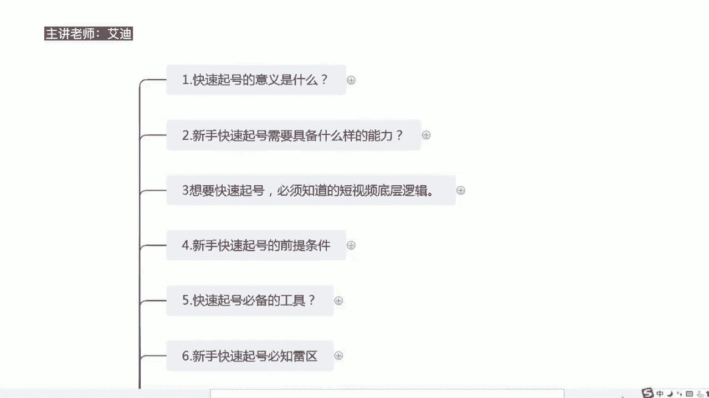
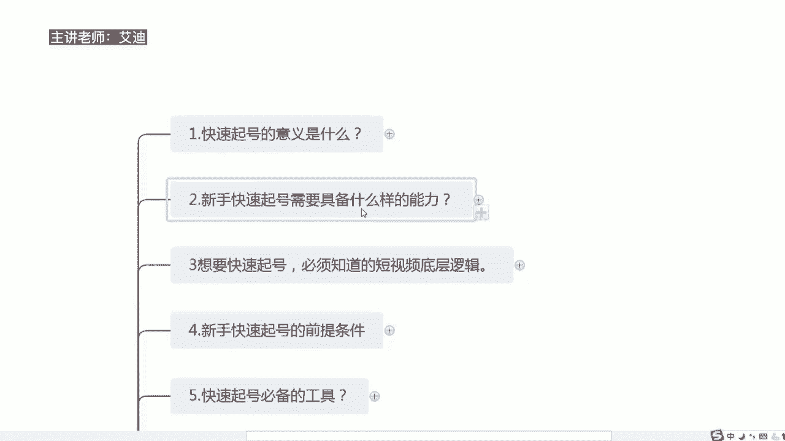
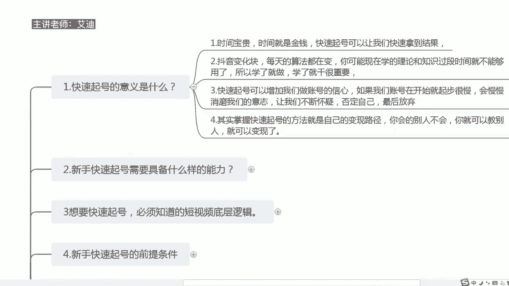
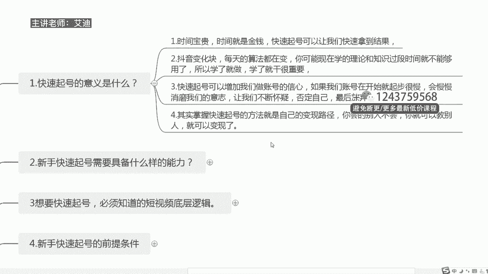

# 短视频IP快速起号实操课程教程，抖音短视频课程教程 - P1：01.【短视频IP快速起号课】快速起号的意义是什么 - 买不起的貂 - BV1DWtJeKEX2

尊敬的各位迪迦商学院的同学们，大家好，本次课程呢给大家分享的是，我们短视频快速起号实操课里面的系列课，那么我们整个短视频快速起号实操课的话，总共是包含了有24节课程，那么本次课程给大家分享的是。

我们短视频快速起号实操课里面的第一节课，快速起号的意义是什么，我呢是本次课程的授课老师。

我是艾迪嗯，希望本次课程的话可以帮助到大家，让大家快速的知道，我们到底为什么要去做一个快速起号，它的包含的意义到底是什么。

那么给大家归纳了四个点哈，第一个点就是什么呢。

为什么要去做快速起号，就首先第一个点就是我们的时间是很宝贵的，特别是在互联网上面的时间，互联网上面的时间，也许一个月或者一个星期，里面的算法跟机制都是千差万别的，所以我们的时间非常宝贵。

时间就是金钱快速起号，可以让我们快速的去拿到结果，这是我们的第一点，那么第二个是什么呢，抖音的变化非常的快，而且它的算法每天都在变，现在去年年初的时候，就是2020年的时候，刚开始大家不了解抖音。

不知道抖音怎么玩的时候，大家每天都在什么呢，分享怎么样去养号，那个时候你分享养号都会有很多人给你送礼物，送音浪，是不是送几10万的音浪都都是什么呢，都是很常见的这个事情，然后到去年78月份的时候。

大家都在开开始分享怎么样去做模式，带货直播带货，知道吗，然后在今年上半年的时候，那么大家就会出现了很多什么呢，抖店的运营，您呢以及什么同城探店号啊等等，这些账号，到今年下半年的时候。

基本上这个平台的所有的想要干起来的用户，都已经形成了一个付费的这么一个思维，所以说如果现在为止呃，如果现在你学会了，你不去干，那么你学的理论和知识，可能过段时间就会怎么样，就会不够用呢。

因为所有的知识跟理论都是在迭代的，抖音的后台，抖音的这些工作人员，他会根据这个平台不断的变化，而去产生一个变化，让他不断的去更新，让这个平台学习的人，每天都有去学习的这样几个动力和资本，知道吗。

那么如果说他一成不变的，那么每个人都知道他是怎么玩的呢，那这个抖音平台就没有办法再玩了，所以说它的迭代更新是必然的，所以我们每个人在抖音上面，每天都在不断的去学习，包括我到现在为止。

我也每天都不断的去学习，但是这里面有一个点就是什么呢，每一个人一定要学了就要去做，而且学了就要去干，这个是非常重要的，如果你学了不去做，你学了不去干的话，有可能后面的话你就什么都没有学会。

就好像你学了很多，好像什么都不会一样，知道吗，这是第二点哈，那么第三点是什么呢，如果我们学会了快速起号，我们懂得了如何去快速起号，那么可以增加我们做账号的，这么一个信心和信念，你想一下，如果你来到抖音。

你知道抖音可以赚钱，但是你做这个账号一个月不火，两个月不火，甚至你的作品都没有破过播放，没有上过1万的播放，更不要提什么几10万的播放，上百万的播放，你的粉丝一直停留在几百，几千或是上千，你什么呢。

你甚至上千的粉丝，你都需要去靠互粉互爆来涨到1000的粉丝，去开通橱窗，那么这个时候一定会磨什么呢，消磨你的这么一个意志，知道吗，你会在不断的做账号的过程当中，因为你来做抖音。

大部分人如果想在这个平台上去有所结果的，一定是死磕这个平台，可能大部分人都是什么呢，把自己的主业工作放下来去研究抖音的，真的哈，我没有骗大家，但是在这个时候，如果你把自己的主业工作停下来。

专门去研究抖音，那么你是没有收入的，大部分人可能都没有收入，或者或者是你的收入会减少的，那么这个时候你就会不断的去怀疑自己，去否定自己，那么你一个月两个月，三个月都没有做起来。

这个时候你可能最终就会选择一条放弃，为什么呢，你会给自己不断的找理由，你说有可能是什么呢，我不适合去做，第二个是什么呢，你觉得我经历过了，我学习过了，我就够了，那我就放弃吧，我不适合，第三个是什么呢。

你觉得抖音只有专业的团队，专业的人才可以去做抖音，还有一个是什么呢，你觉得做自媒体，做新媒体不是一般人可以去做的，一定是有团队去打造起来的，而且要花很多钱的，所以这最终的最后的结果就是什么。

你没有快速睡养，你都放弃了，而且给自己找了很多很多的理由，知道吗，那第四一个，如果你快速起号了过后，你可以掌握快速起号的方法，其实我们快速起号的方法，就是我们自己的一个变现路径，什么是变现路径。

我们很多人都会说，做短视频跟做直播间，一定要先想好你的变现的路径，抖音只是一个你获取流量的这么一个通道，仅此而已，那么是什么意思呢，就是如果说此时此刻你跟我一样，你是一个没有背景，没有颜值，没有团队。

没有米，没有货品，没有厂家的，没有团队的这么一个人，那么我们自己掌握的知识，就是我们变现的一个途径，知道吗，就是说你会的，别人不会，你就可以教别人，比如说此时此刻你们啊就是在听我的课。

你们购买了我的课程，是不是就是我会怎么快速起号，但是你不会，那么你去学，你就要向我付费，是不是这样子的，所以说这个就是我的一个变现途径，那么同样的你们学会了过后，你们可以把它用在你们自己的产品。

自己的公司上，你们也可以什么呢，做成自己的一个变现的一个路径，跟我一样售卖自己的知识就可以了，所以这个就是我们快速起号的意义是什么，让我们快速的拿到结果，我们时间就是我们的金钱。

让我们增加我们的一个自信，让我们有一个什么呢，变现的一个途径，让我们有什么呢，售卖自己知识的这么一个能力，知道吗，以上的话就是我们本节课为什么要去做，快速起号的一个真正的意义是什么，其实说其他都是白费。

这个才是我们为什么要去做旗号的，一个核心的一个意义，那么以上的话就是本节课的一个啊内容，希望大家的话能够喜欢。

