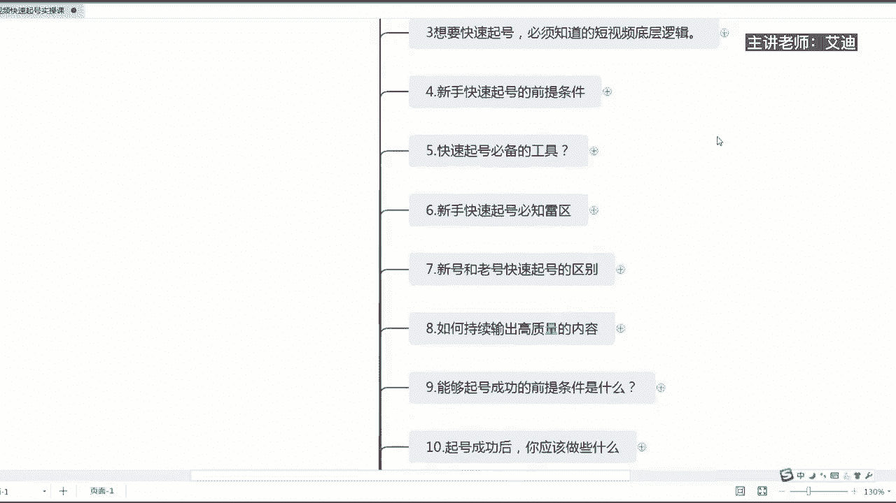
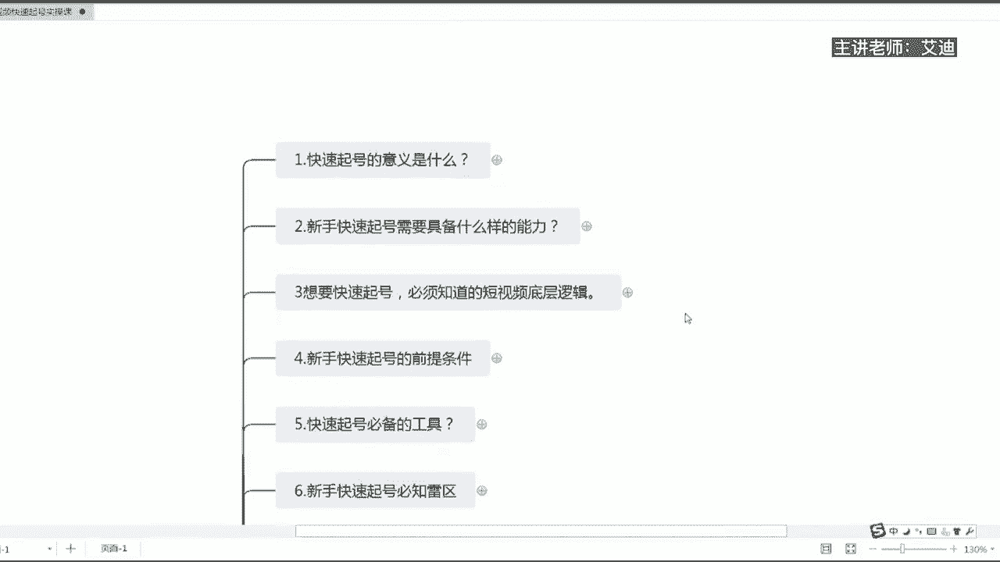
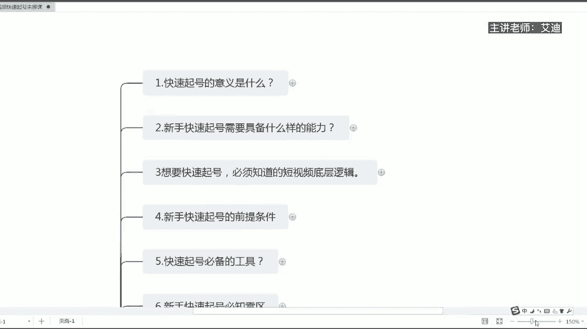
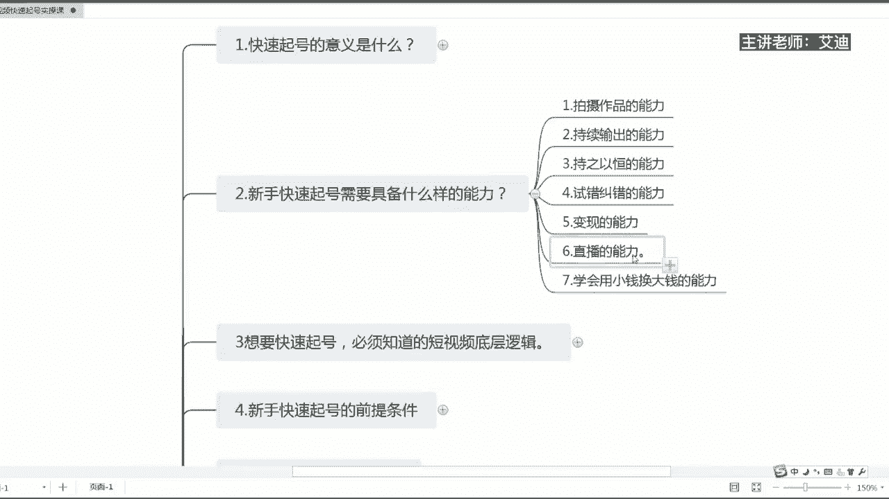
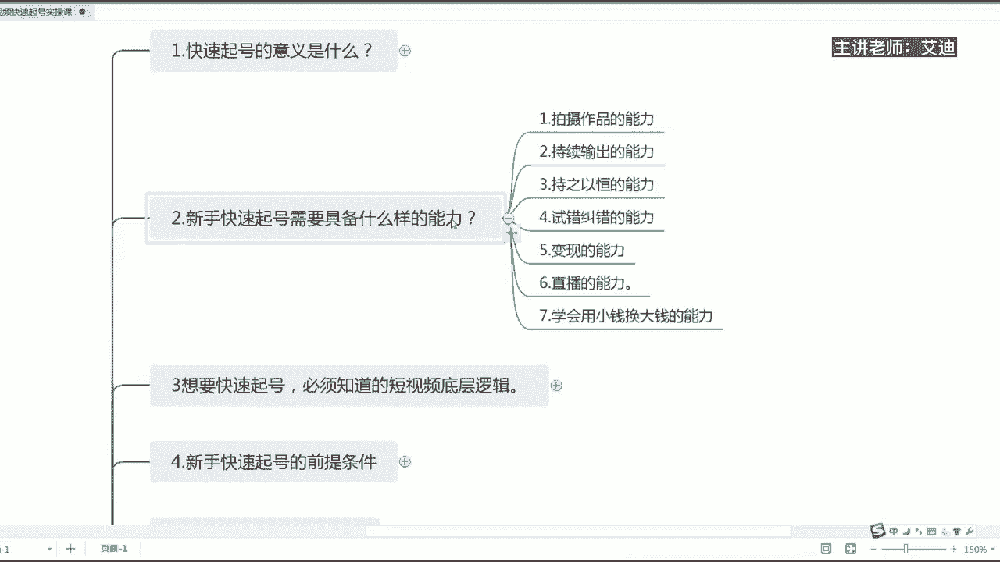

# 短视频IP快速起号实操课程教程，抖音短视频课程教程 - P2：02.【短视频IP快速起号课】新手快速起号需要具备什么样的能力 - 买不起的貂 - BV1DWtJeKEX2

尊敬的迪迦商学院的同学们，大家好，本次课程给大家分享的内容，是我们短视频快速启航，实操课系列课程里面的第二节课，第二节课的内容是我们新手快速起号。

到底需要具备什么样的能力，我呢是本次课的授课老师艾迪。

那么我们新人到底在做啊，账号起号的时候需要具备什么样的能力呢。

总共的话给大家归纳了七个点啊，七个点里面的话你们可以去自查自纠一下，看看到底啊自己具备了什么样的能力，自己还缺乏什么样的能力，然后呢再去做一个查漏补缺啊，首先第一个是拍摄作品的一个能力哈。

第二个是持续输出的能力，第三个持之以恒的能力，第四一个是试错纠错能力，第五个是变现的能力，第六是直播的能力，第七是学会用小钱换大钱的一个这个能力。

那么第一点拍摄作品的能力是什么意思呢，就是你一定得会拍作品，你得会拍，你得会挑镜头，你得会给镜头说话，那么你拍摄出来的你的表情一定要是自然的，就好像在跟你的朋友，在跟你身边的人去什么呢去聊天一样。

你们有没有发现在这个平台上，越是自然表现能力越是自然的人，然后呢越是放松的人，他的播放量会更高，是不是因为抖音是一个什么娱乐性的平台，当然也是一个放松的一个平台，如果说你在这个技能面前表现的过于什么呢。

规矩正规，反而没有太多人去看，知道吗，自然所以自然自然还是自然，这个评论自然是核心，在自然当中去输出自己的这个作品啊，输出自己的这个作品，所以就需要你不断的去练习自己的一个，镜头感啊，镜头感。

不管你是做口播还是说你是拍好物分享是吧，口播的话，你的核心的话就是你的镜头表现的要自然一点，然后呢啊就是你的场景要特别一点，然后呢啊你的动作的时是不是动作，手势等等也是要自然一点。

如果你做好物分享等等这些账号，那肯定是你的美食要配拍的什么呢，嗯就是诱人一点，让别人就是什么看了就想吃的这种感觉，所以说你必须要有拍摄的这么一个能力，那么拍摄如果说你不会的这种话，要怎么样去拍哈。

要怎么样去拍，多去借鉴同行的人，就是你同类型的人，看他们是怎么样去拍的，然后呢你再通过后期的一个调色剪辑哈，剪辑成自己属于自己风格的这么一个作品，属于自己风格的，这是我们的一个拍摄作品的能力。

那么我想给你们提一点的是，在这个平台上，如果说您是做口播的，跟我一样哈，这个平台上大家一定要记得，如果你们到现在为止，你们是做口播的，然后呢你们拍了额，那么十个20个或者几十个作品都没有什么呢。

更大的一个突破哈，就是作品播放量也好，就是啊粉丝量也好，没有一个大的突破的时候，我我想嗯告诉大家，你们不要去什么呢，气馁和放弃，因为在这个平台上很多的大主播不是很多，是百分之百的一个大主播。

他们做起来不管是有钱的还是没有钱的，有背景的还是没有背景的，有团队的还是没有团队的，你请记住一句话，自己的作品都是经过一遍又一遍的打磨，才能够呈现出你现在看到的这么一个结果。

那么今天如果说我们把抖音做成一个事业来做，请不断的去提升你自己的，一个表现力和拍摄能力，这个是一个重点，因为我们想要快速起好的核心就是作品，知道吗，就是作品，你的作品的表现形式和展现力至关重要。

这是第一点，第二个持续输出的能力，那么我们有了作品拍摄的能力过后，是不是就够了，并不是哈，我们更重要的是一个什么呢，持续的一个输出，抖音的话，它是一个赛马机制，就是从最低级别。

比如说你一天或者一周发个两三个作品好，或者一周发一个作品，或者是一周不发作品，这些的话都是在最低级别的，那么你持续输出作品的能力是什么呢，不管你是一天发一个作品，还是两天发一个作品，那么一定要坚持去发。

你不能说三天打鱼两天晒网的，这个是不行的，而且如果说嗯就是我真诚的告诉大家，如果说你们是想快速的出圈的话，一定你的作品的拍摄能力不是最主要的，不是最主要的，不是最主要的，你的持续的输出能力才是最主要的。

如果说你是新人的时候，我们每个人都是新人，是不是刚开始拍作品的话也就一般，那么我们如果说是性的时候，我们勤能补拙，请大家记住这句话哈，就是说你的作品可以拍得不够好，但是你一定要努力的多去拍。

一定要让平台看到诶，你是一个勤奋的人，是一个努力的人，你持续的在输出作品，那么他就会给你更多的这么一个机会，而且你在不断的拍摄作品的过程当中，你更能够去总结你自己的一个经验，如果说你一天只拍摄一条。

只发送一条，我个人感觉，其实你是没有那么多的那么强度的一个什么呢，经验给你去总结，给你去判断的，知道吗，你只有在不断的输出，每天比如说别人拍一个发一个，那我们是不是可以试着拍两个发两个，拍三个发三个。

是不是这样子的，然后你必须得有持续输出这个能力，不要说天天三天打鱼，两天晒网，你今天发两个，你明天就要发两个，后天就要发两个，可持续的这么去输出，所以你必须具备这样子一个能力，这是第二个。

第三个是持之以恒的能力，很多人就说我发了两个，然后呢我不想发了，没有作品，没有流量，没有播放量，然后我就不想干了是吧，就不想干了，我不适合做呀是吧，我我去学习一下，我还要去学习。

我可能什么账号没有活跃好，是不是我没有去叫老铁，别人没有给我点赞，是不是，其实这些都不是重点，这些重点所有的重点是你要兼持，知道吗，要坚持我们所有的成功，不管是各个行业，就是简单的事情重复去做。

所以你必须具有持之以恒的这个能力，第四一个试错纠错的能力，那么什么是试错和纠错能力，就有可能你拍一个作品啊，拍出去了过后没有取得一个好的结果，然后嗯就是什么呢，点赞评论转发个个都不高。

你要记得就是我们每个人在做信号的过程当中，都是不断的去寻找你的一个表达方式，比如说有人是坐着拍，有人站着拍，有人躺着拍，是不是有人边走路边拍，有人在河边拍，有人在沙发上坐着拍，有人在吃东西的时候拍。

有人喝水的时候拍，是不是那么有人在打游戏的时候拍，所以你要不断的去尝试你的这个场景，你不断的去拍摄的这个过程当中，唉你看一下哪一种展现形式是别人喜欢的，是这个平台喜欢的，然后呢。

你再从这样的形式当中去选取，最好的这么一个饼表达形式，你不要说我坐着拍，我没有流量，那么我就不拍了，知道吗，就害怕了，不要这样子，然后你可以站着拍，你可以走着拍，你甚至可以跳舞，拍化妆拍，吃饭拍。

喝水排炒菜派，做饭排宅菜派都是可以的，知道吗，朋友们哈，这是我们第四个试错纠错的能力，第五一个是变现的能力，额变现能力是什么意思呢，我们不管是做短视频还是做直播哈，朋友们，大家一定要记得。

一定要先想好你的变现，然后再去做短视频，不管是短视频还是做直播，只是我们承接流量的这么一个方式哈，不能你就如果说你没有变现的一个模式，如果说你的短视频哪怕上了热门，那么也是等于上了个什么，上了一个冷门。

知道吗，为什么你热门上了几百万银行，上了几千万银行，你没有把它变现成钱，你知道吗，因为我们在这个平台上，我们不是来免费的做一个什么呢，做一个什么呢，就是创作者的，我们是在这个平台上来变钱的。

所以说你一定在做账号之前，你就得想好我靠什么赚钱，我用什么样的赚钱，然后再去想我用什么样的输出，什么样的内容，能够把这些人给他吸引过来，给他聚过来，知道吗，我赚的是什么钱，赚的是什么人的钱。

然后再带着这样子，一个思路去做你的短视频就OK了，当你的作品起来了过后，你按照这个思路去开直播也好，去变现也好，你就什么呢就能够去什么呢，有收益知道吗，这是我们的第五一点，那么第六一个是直播的能力。

直播的能力结合我们变现的能力，就是说如果说我们短视频哈，短视频是一个什么呢，是我们一家店面的一个招牌，那么我们直播间就是我们营业的一个地方，知道吗，就是比如说一个餐馆短视频就是一个招牌。

吸引别人进到我们的什么呢店里面来，但是我们直播就是我们的店，那么我们店里面什么呢，所有的收钱，付钱转账等等都是在我们直播间去完成的，对不对，所以你必须要有直播的能力，因为你的短视频起来过。

你要靠直播去产生一个更大的一个变现，你知道吗，更大的一个变现，所有的这些东西都是在直播间去完成的，所以你必须具备直播的这么一个能力哈，那很多人说艾迪呀，我没有直播的能力，我不会播怎么办，你告我告诉你。

你只要想好了你自己的一个变现能力，你做好了那个短视频有流量进来，你就按照自己的变现思路，就是说我怎么样去赚钱，我教你创业，我是教你化妆，我是教你买东西，我是教你卖东西，我是教你学穿搭。

我是教你去健身等等，你就知道你会怎么样去变现，怎么样去直播了，知道吗，没有人天生会直播你的直播，所有东西都是依据你的变现思路，以及你的作品来产生一个变现的，懂吗，朋友们好，这是第六点，第七个点。

学会用小钱换大钱的这么一个能力，这是什么意思，我们做抖音哈，朋友们一定不要什么呢，老老老实实的去做，为什么这么说，如果你老老实实做，你就会做很久，你都做不起来，如果你老老实实做。

仅限于我们去年2020年的时候，34月份的时候，这种状态你是可以老老实实的去做的，为什么，因为那个时候大家都不懂，这个平台需要我们这些人去做抖音，来给他换取流量，知道吗，他那个时候需要的是流量。

但是抖音现在需要的是什么，随着就是一年多的一个迭代和发展，抖音现在需要的是什么呢，需要是变现，需要的是商业的一个变现，因为抖音是一个商业化的一个平台，所以此时此刻，如果说你还是用以前的那种思维去做抖音。

是做不起来的，那么我们一定要学会用小钱换大钱，什么意思，我们一定要学会发作品的时候适当的去投抖家，我们一定要学会在直播间的时候，适当的去投抖家，发红包，发福袋，这个就是用小钱换大钱的一个思维。

如果说你用抖家去撬门，抖音的这么一个流量，你是不是你的作品还OK，那么你是不是可以赚到更多的钱，如果你在直播间发了红包，发了福袋，投了抖加，贴上一个精准的标签，进来的时候，精准的人。

你是不是就是把他直播广场流量给他撬动了，你是不是可以用这部分小的钱去撬动，更大的一个流量，更大的一个钱，知道吗，所以这个就是用小钱换大钱的一个能力啊，以上的话就是我们什么呢。

新手快速起号需要具备什么样的能力，以上总共的话就是七点，希望可以帮助到大家，大家也可以就是什么呢，对标一下自己，看自己什么呢，哪些条件是满足的，哪些条件是不满足的，大家可以查漏补缺。

希望大家能够喜欢本次的课程。