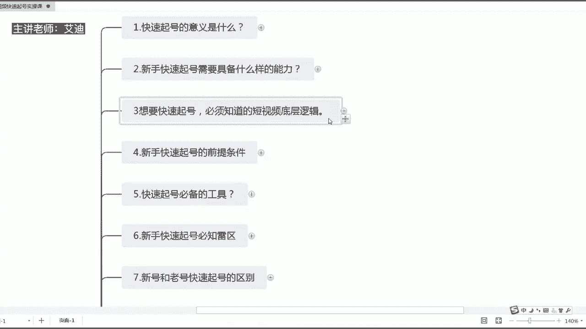
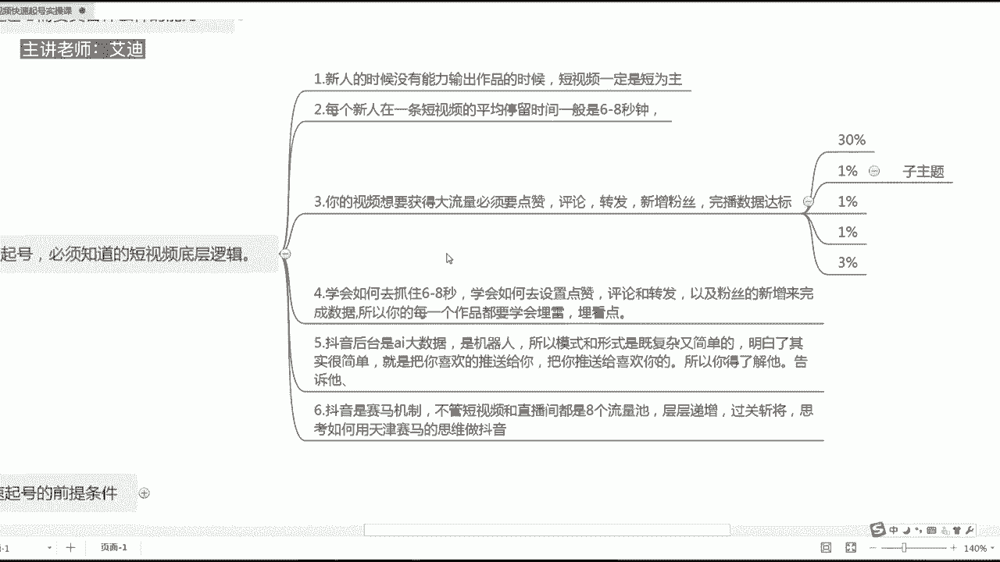
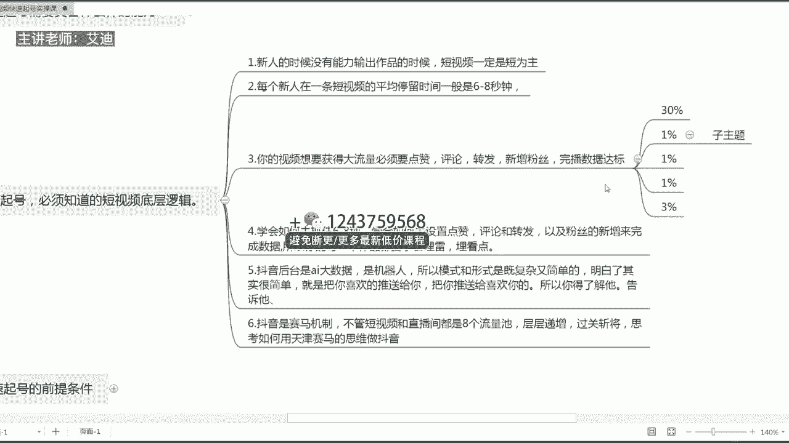
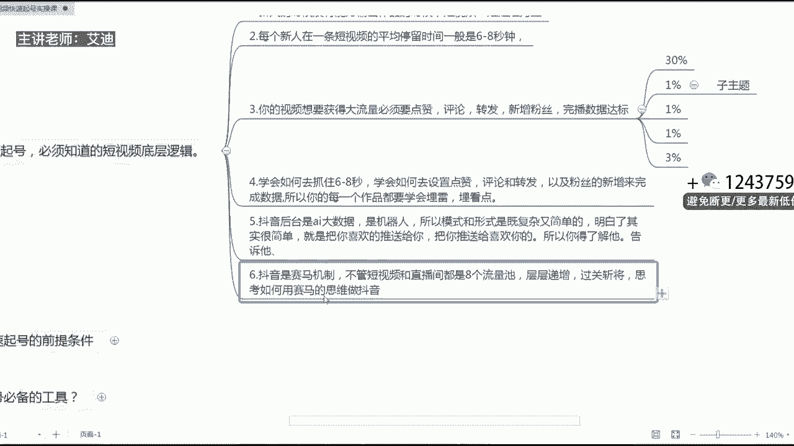
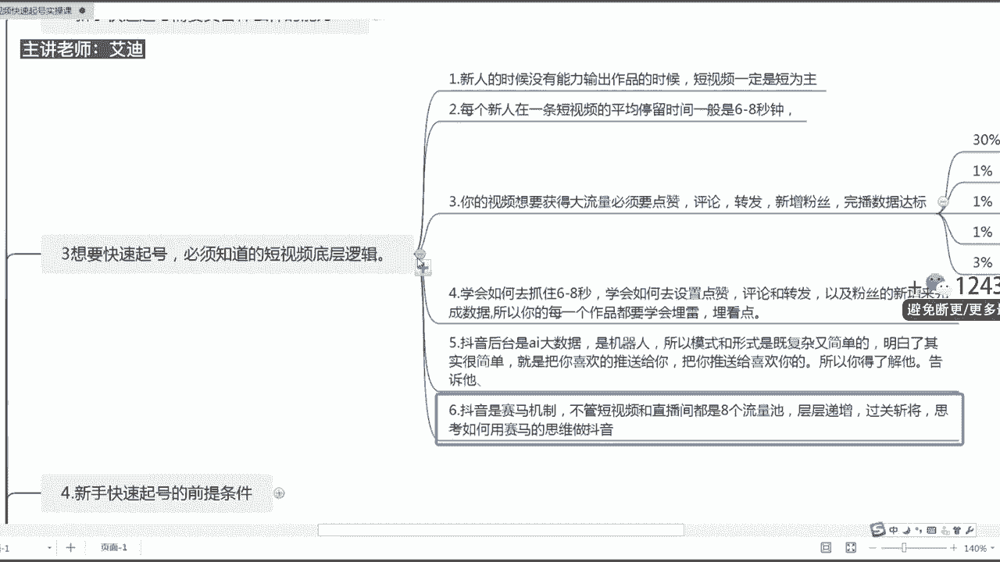

# 短视频IP快速起号实操课程教程，抖音短视频课程教程 - P3：03.【短视频IP快速起号课】快速起号，短视频的底层逻辑是什么 - 买不起的貂 - BV1DWtJeKEX2

尊敬的迪迦商学院的同学们，大家好，本次课程给大家分享的内容，是我们短视频快速起号实操课，系列课程里面的第三堂课，第三节课的内容是我们想要快速起号，必须知道的，抖音的底层逻辑到底是什么。

那么我是本次课的授课老师，我是艾迪，那么想要快速起号必须知道的，短视频的底层逻辑到底是什么呢，哎到底玩短视频玩的是个什么呢，是不是，这是我们不管是做任何一个行业，都必须要去了解的。

就是它的一个核心是什么，对吧，我们只要围绕着这个核心去做就可以了。

那其实呢给大家去归纳了，总共的话是有六个点哈，总共的话是有六个点，其实说说统称一点的话，其实就只有什么呢，五个重要的一个因素，一个是完播，第二个是点赞，第三个是评论，第四个是转发，第五个是新增粉丝。

做短视频都是围绕着这几个数据来的，那么围绕着这几个数据，如果说第一个我们是新人的时候，如果我们没有能力输出作品，那么请大家一定要记住我们的短视频，没有能力去输出作品的时候，一定是以短为主。

不要去追求长时间的作品哈，长视频，哪怕这个平台很多人跟你说，现在抖音的什么呢啊风口都在长视频上，我们拍一分钟以上的视频就可以啊，就可以什么呢，获得中视频的这么一个流量，可以获得奖奖金和奖励。

但是我们是一个新人，我们不具备这个能力的时候，请大家一定要记住，一定是短为主，短意味着什么，短意味着完播，意味着别人能够看完你这个短视频的，这样的一个什么呢，一个完播率知道吗，宝宝们。

如果说别人能够看你这个视频，看完完播率越高的视频，你的这个作品的话，他是会获得更高的一个流量的，更高的流量，因为第二点的时候我们可以看到哈，在第二点，每个新人在一条短视频的平均停留时间。

一般是6~8秒钟啊，你们现在是一个新人，现在是新的状态时候，可能你们不太能够理解这句话，但是如果说您是在这个平台上，就是做了比较久的这部分，就是嗯就是什么呢，我们的啊同行哈，同行，然后都会知道。

我们后台的话是有一个数据分析的，那么数据分析里面，不管你是上热门火爆的作品还是不爆的作品，你要记住哈，一个人在你的一条短视频道，平均停留时长只有6~8秒钟的时间，如果说你是一个长视频。

那么你要学会在这6~8秒钟的时间，去抓住核心，引导别人看完你的后面的啊，30秒也好，一分钟也好，知道吗，那么如果说我们是一个新人的情况下，我们就要什么呢，就要抓住这六到标八秒钟的时间。

在这八秒钟或是十秒钟的时间，把我们整个过程叙述完，然后呢我们就可以获得一个好的完播，好的一个点赞，好的一个评论，那么如果你的视频想要获得大的流量。

我们必须要具备什么呢，点赞评论转发新增粉丝和完播数据要去达标。

那么这些数据到底要达到什么样的一个数值，才算是一个合格的一个短视频，才更容易获得大流量，更容易去上热门呢，首先第一个完播率哈一定要达到30%，就证明30%的人，三成的人看完你这个视频都喜欢哈。

比如说你的播放量，你后台能够看得见，是不是1000的一个播放量对吧，那么又30%，就300个人能够看完你这条视频，看完你的这个视频的数值，达到30%以上啊，这个30%不是说完全一秒不剩的。

把你的视频看完哈，就说八秒钟什么呢，六秒钟观看，然后你这个视频能够看完的人，有30%左右，这个数据就算达标，所以为什么说我们新人哈做短视频，一定要在6~8秒左右，就是这么一个核心哈，就这么一个核心。

第二个你的评论哈要达到1%，转发要达到1%，你的点赞率也要达到1%，你的新增粉丝达到3%的一个转化的时候，请相信我，你这条作品是非常容易去上热门的，知道吗。

非常容易去上热门的哈，然后还有一个是什么呢，第四一个我们要学会如何去抓住6~8秒钟，那么你说爱你啊，就是你说是呃，就是我们做短视频核心的话，就前面的6~8秒钟，是不是。

那么到底我们要如何去抓住这6~8秒钟呢，请大家记住，我们一定要学会去设置什么点赞，评论，转发以及粉丝的薪资来完成数据，我们每一条能够上热门的短视频，大家请记住，除非你这条视频本身内容很优质哈。

就是那种泛娱乐的这种内容本身很幼稚，别人有兴趣去看下去，那么如果说我们是做垂直类型的，这种账号的时候，大部分的情况下我们需要我们的设置，然后就是设计，然后呢才能够去什么呢，提升点赞。

评论和网吧以及转播转发，还有粉丝的一个新增，知道吗，所以我们每一个作品的话，我们要学会去埋雷哈，埋雷点埋看点哈，埋雷点埋看点，买转粉点，然后买我们的什么呢，评论点知道吗，给大家去举个例子哈。

比如说86年的我今年48岁，无房无车，到底我应该何去何从，那么这里面就设置了一个买点，对不对啊，买点第一个买点是什么呢，就是86年48岁，86年明明到现在21年是吧，就只有三十七八岁。

那么你说你自己48岁，那么你的评论区就引发了什么呢，引发了评论，很多人就会说86年48岁，你的数学是体育老师教的吧，你会不会算数啊，你傻了吧，对不对，这些不管别人评论什么，然后呢都引发了一个评论力。

只要有热度就会上热门，知道吗，朋友们，然后呢，48岁无房无车，我到底应该何去何从，这是第二个买点，知道吗，48岁了，你无房无车很多，就是那种什么呢那种就是愤青哈，就是说你48岁了，你房子都没有。

你车子都没有，对不对，你还玩个什么玩，你还逛逛个什么逛，你还混个什么混，是不是，这是你发的第二个评论，是不是，还有一个比如说你要让别人给你点赞，是不是你说来比如说给大家说说，给大家分享一个什么呢。

99%的人都不知道的，就是什么呢，快速赚到月收入达到1万的这个方法，本条视频有点长，请大家先点赞再观看，是不是，然后呢啊我给大家去慢慢去讲一下，这个时候是不是你就会去点赞，因为你引导他了去做一个点赞。

知道吗，好然后呢比如说我们如何去转发呢，是不是把这条视频分享给你身边，就是什么呢，身边你的好闺蜜，好伙伴们啊，好伙伴们，然后呢让他们注意什么呢，不要再犯类似类似的这样几个什么呢，类似的这么一个错误。

你是不是就有一个转发了，然后呢，怎么样去增加那个提升，你的一个新增一个粉丝呢，来你可以这样说，来大家给我点个关注哈，下条视频给大家去分享更多精彩的内容，大家给我点个关注。

下导视频给大家分享什么什么什么什么内容，是不是是不是这样子，你就可以去引发你的点赞评论转发，以新增粉丝，是不是这样子的，还有一个是什么呢，大家一定要记住哈，抖音的话，后台是AI大数据，他是一个机器人。

所以你的模式和形式是既复杂又简单的，知道吗，它整个的一个算法模式都是既复杂又简单的，其实你明白了就是很简单，就是把你喜欢的推送给你，把喜欢你的人推送给你，所以你得了解他，你要告诉他。

如果说你作为一个什么呢，你想去贴标签的时候，你想告诉抖音，你需要什么样的流量的时候，你又去给同类型的作品，同行业的点赞评论转发，所以你就告诉他诶，他来到就他就会推同类型的作品给你，推同类型的人给你。

知道吗，那么同样如果说那别人你想让什么呢，把你推送给别人也是一样的，知道吗，那你就什么呢，你就告诉他你喜欢什么样的粉丝就可以了，知道吗，你需要长什么样的粉丝就可以了，所以都是一个双向互推的这个功能。

就是把你喜欢的推送给你，把喜欢你的人推送给你，就这么一个简单的一个道理，知道吗，还有一个点是什么呢，抖音是赛马机制，不管是视频和直播间，都有八个流量池，它是层层递进的哈，所以都是过关斩将的啊。

我们一定要去思考什么呢，如何用什么呢，如何用什么，田忌赛马哈，不是天津赛马哈，田忌赛马来田忌赛马嗯，哎那个G是怎么填进赛嘛啊就是田忌赛嘛，这样的思维去做抖音哈，去做抖音来，为什么这么去说哈啊。

我们都知道田径赛马就是把自己的呃，一等马去对别人的三等马是吧，把自己的二等马啊，把一的码去对二等码，二的码去对三的码，一的码再去对别人的三的码，是不是这样子的，所以我们做抖音也是一样的。

当大家在刚开始大家都不怎么发作品，新人只发一个作品的时候，那你请记住，你就去多发个几个作品，发两个发三个，对不对，那么你就快速的就去出圈儿，然后脱了圈过后，等你涨了一定的粉丝跟流量了过后。

你再慢慢的把自己什么呢，慢慢的降，降低自己更新作品的速度，然后这个时候你要去产生，你要去变现，你知道吗，然后呢通过你的什么呢，不断的去发作品，去怎么样去突围，然后呢突围过后你再慢慢的去发作品。

然后去怎么样去变现就可以了。

知道吗，这个就是抖音的一个底层逻辑，抖音短视频的一个底层逻辑就是点赞，评论转发和新增，所以你要思考的核心是你如何提升点赞，如何提升评论，如何提升转发，如何提升新增，如何达到，完播给大家去总结一下哈。

完播新人时间短，新增粉丝评论转发点赞，如果说你是做垂类型的账号的，一定要自己去设计哈，自己去设计，多去看同行业的视频，他们是如何去引导点赞的，如何去引导评论的，如何去引导转发的，然后把它自己做成什么呢。

点赞评论转发新增粉丝的这样几个素材表哈，素材知道吗，素材然后在你自己做短视频的时候，把这些素材灵活地运用在自己的短视频当中，用久了过后，你自然就会知道如何提升点赞，评论和转发，如何去形成粉丝。

如何达到完播了，这个就是我们抖音短视频的一个底层逻辑，以上的话就是我们快速起号必须知道的，短视频的底层逻辑，希望今天分享的内容能够帮助到大家。

