# 短视频IP快速起号实操课程教程，抖音短视频课程教程 - P4：04.【短视频IP快速起号课】新手快速起号的前提条件是什么 - 买不起的貂 - BV1DWtJeKEX2

尊敬的迪迦商学院的同学们，大家好，本次呢给大家分享的内容，是我们短视频快速起号实操课程，系列课程里面的第四堂课，第四堂课的内容是，我们新手快速桥的一个前提条件是什么呢，我是本次课的授课老师，我是艾迪哈。

那么到底我们新人快速起号。

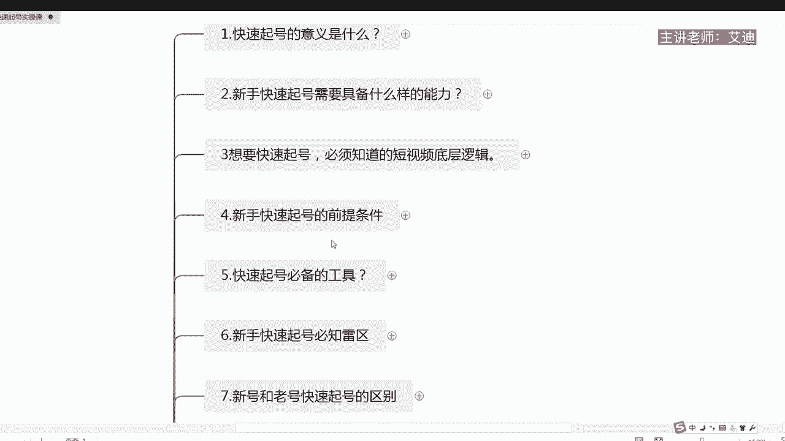

需要具备什么样的条件呢，来给大家去看一下，首先第一个我们想要快速起号。

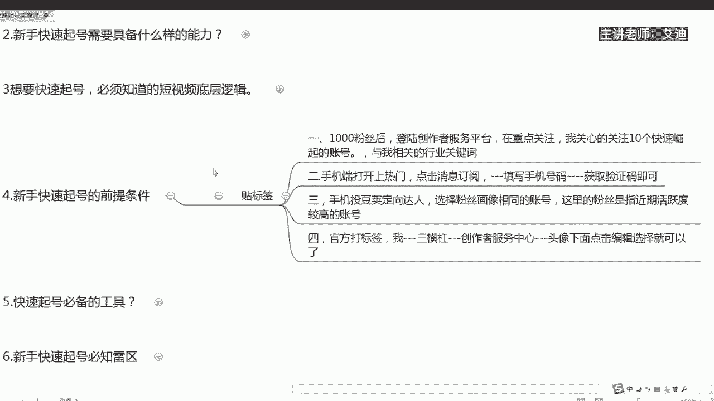

我们必须要去贴标签哈，朋友们必须要去贴标签哈，这是我们的一个核心，那么我们如何去贴标签呢，给大家总结了四个点哈，四个点，基本上这四个点的话，就是我们整个就是做一个新的账号。

需要去贴标签的这样子一些所有的一个操作了，首先第一个1000个粉丝以后，登录我们的创作者服务平台，在重点关注哈，在我们电脑端哈，电脑端的这个是电脑端，电脑端啊，电脑端登录抖音。

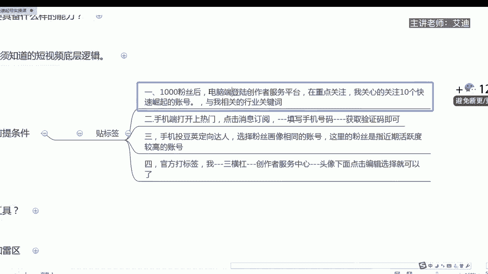

登录创作者服务平台，在我们左边的下拉栏有一个重点关注，然后呢点我关心的关注十个，我们刚开始最新起来的快速崛起的十个账号，然后你再点击与我相关的，点击选择三个行业关键词。

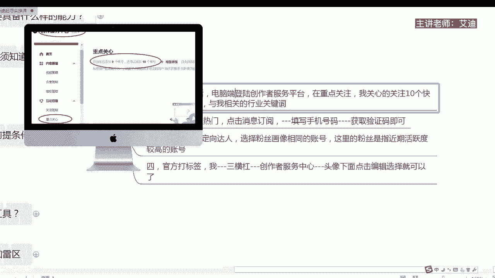

比如说短视频，比如说抖音，比如说上热玩等等就可以了。

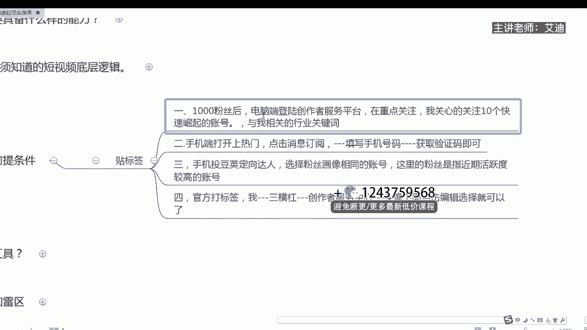

知道吗，这是第一种贴标签的一个方法，第二个，那么在我们手机端打开什么呢，打开上热门，然后点击消息订阅。

然后呢我们在这个位置填写手机号码，然后呢获取我们的验证码。

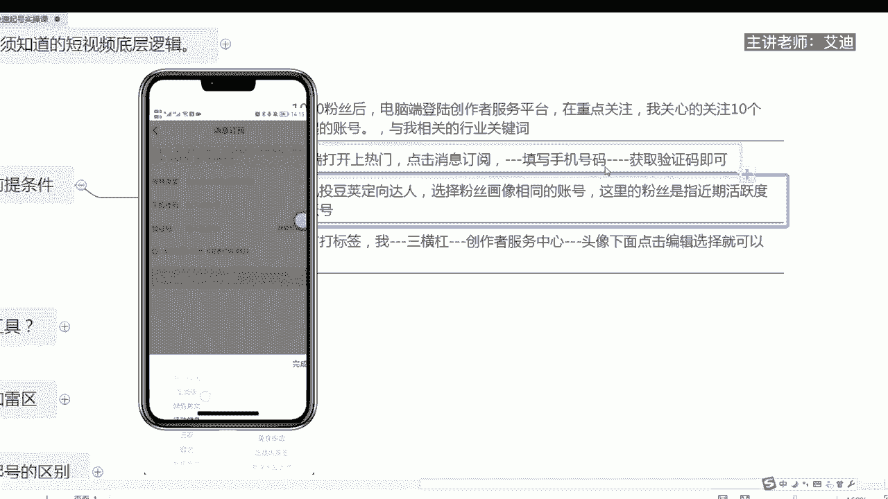

这样子就可以了，获取验证码就可以了，然后呢我们再选择我们自己的行业，自己给自己手动贴上标签，这是第二种方法，第三个方法运用斗架的方法去贴标签，就你刚刚开始是一个新号的时候哈，我们手机投抖加啊。

那个短视频投抖加哈，短视频投抖加，短视频投抖加短视频投抖加投定向达人，就是跟你粉丝画像相同的账号，然后呢这里的就是这个粉丝的话，这个账号的话，他的粉丝是近期活跃别度比较高的这种账号。

用付费的方式去什么呢，去给自己去打上标签。

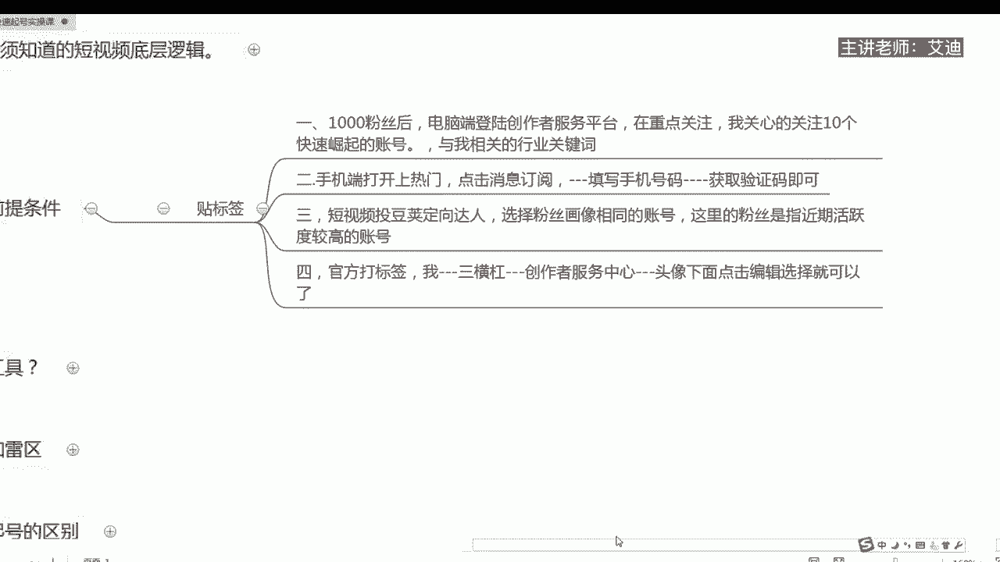

这个的话也是相对来说比较快的这个方式，因为这两种方式的话都需要什么呢，包括最后面一种哈，都需要啊，就是你的账号有一个识别的一个过程，这个是最直接的哈，第三种，那么第四个就是官方打标签。

我们有听说就是嗯之前教你这里贴那里贴，这里打那里打，是不是，所以官方最后他出了一个打标签的一个方法嗯，就是你自己在嗯账号就是实名认证了过后。

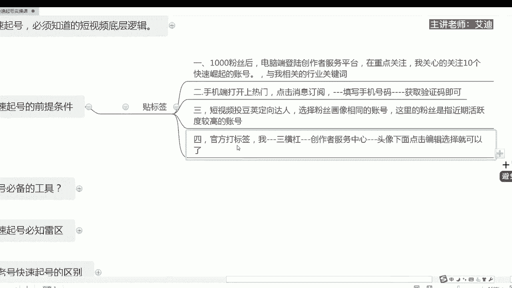

在我张横杠创作者服务中心，在你的头像下面有一个编辑编辑贴标签。

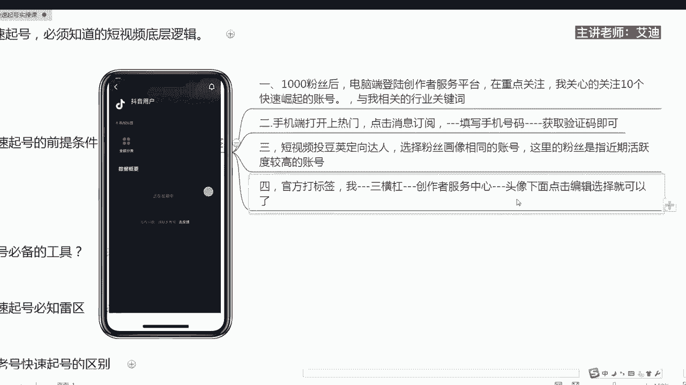

你在里面去选择你自己的行业标签，选择就可以了，知道吗，根据要求去选择就可以了，以上的话就是我们什么呢。

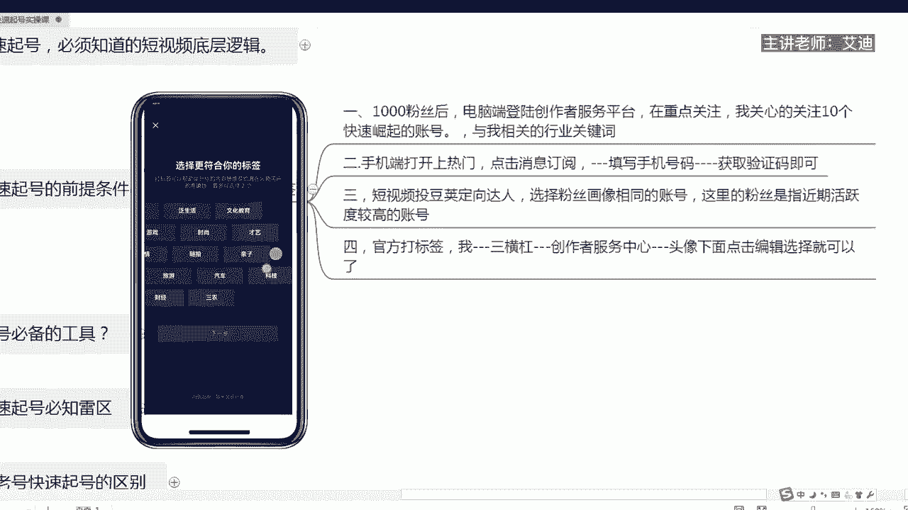

新人快速起号的前提条件，贴标签，为什么呢，你没有贴好标签，就没有精准的流量系统，不知道你来干嘛，平台不知道给你推荐什么样的人给你，知道吗，所以我们第一步是要贴标签哈，朋友们，以上就是本节课的内容。

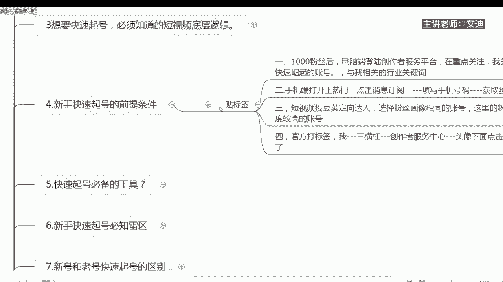

希望大家能够喜欢，能够帮助大家。