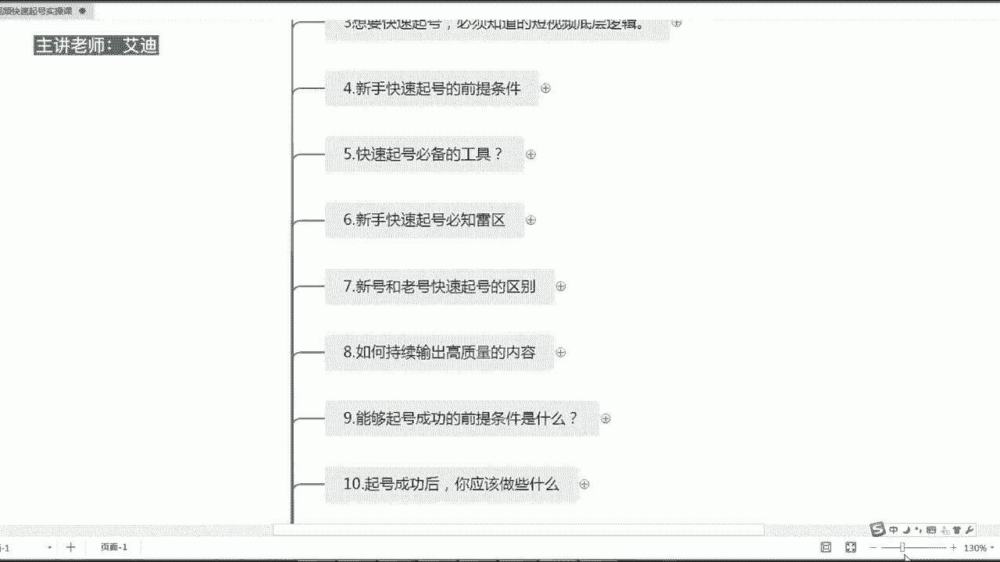
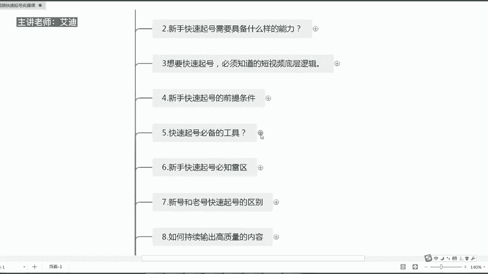
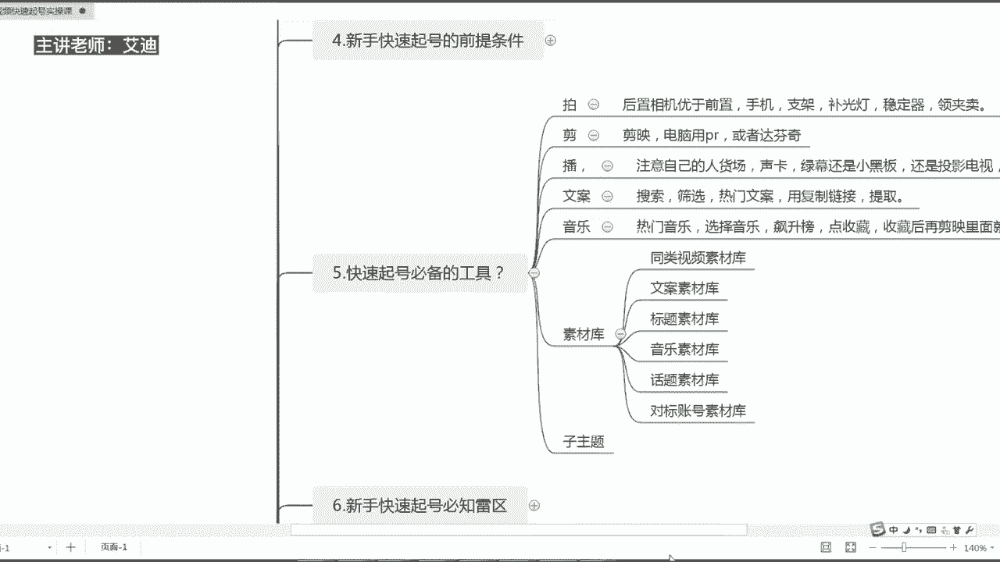
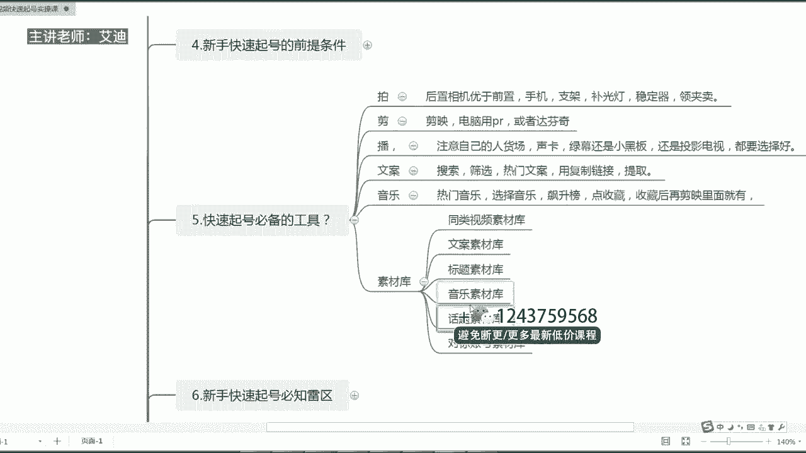
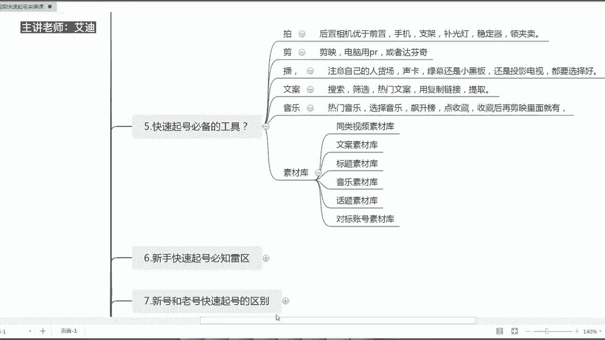

# 短视频IP快速起号实操课程教程，抖音短视频课程教程 - P5：05.【短视频IP快速起号课】快速起号的必备工具是什么 - 买不起的貂 - BV1DWtJeKEX2

尊敬的各位即将商学院的同学们，大家好，本次课程给大家分享的内容是，我们短视频快速起号实操课系列课程，里面的第啊第五节课哈，第五节课，快速起号所需要的必备的工具是什么哈。

工具是什么，我呢是本节课的授课老师，我是艾迪嗯，我们到底快速起号，我们的账号需要具备什么样的工具呢，来给大家去总结总结了一下啊。

总结了一下，我们需要12345677个类型的这样子。

一个工具哈，七个类型的这个工具，第一个是我们拍摄的工具哈，拍摄的工具呢我们要后置相机优于前置相机哈，前置相机呃，如果说我们是女生，就特别注意自己颜值的这种哈，我们可以用美颜相机。

轻颜相机以及无他相机都是可以的哈，都是可以的，就是就是手机里面的无他相机，那么如果说你是什么呢，你是一个专业做什么呢，就男生就是觉得还就是呃没有太大关系，你想以清晰度为标准的话，你就用什么呢。

嗯就用那个手机的这个后置相机哈，后置相机就自带的这个摄像头就可以了，然后除此以外的话就是支架哈，支架选择一个自拍杆吧，自拍杆比较合适，然后还有一个补光灯，不用买太大的哈。

就是买那种就是随便就是便携式的那种，就是你随时随地你可以把它加在哪里，然后都可以怎么样都可以拍的，这种补光灯我觉得是比较好的，不要那种很大的圈圈，我觉得没有什么太大的用，我都没有买。

然后还有一个稳定器哈，嗯稳定器，如果说你是做户外，然后走着拍的时候，你需要稳定器，那么如果说你是在固定一个机位去拍呢，你不需要稳定器哈，毕竟我们做抖音嘛，就是轻资产投业，刚开始的话就是投入资金越少越好。

那么你要是走着拍，你就需要一个稳定器，要不然的话你的视频会抖动，因为抖音视频推送的一个前提，就是画面清晰稳定，不抖动哈，所以你的视频是抖动的话，也不会被推荐，所以你上不了热门，然后还有一个领夹麦。

这个是必备的哈，必备的这个是领夹麦呃，我在就是刚开始直播，就是在去年34月434月份开始拍作品，直播的时候，我都是用的领夹麦，都没有买声卡，所以领夹麦几十块钱是大家必备的，这么一个什么呢。

拍摄的一个工具哈，因为它可以收音哈，可以收音嗯，可以让你的声音听起来更加的清晰，然后呢屏蔽到旁边的一些杂音等等等等，这些第一第一个是拍摄，第二个是剪辑，剪辑的话我们用剪映电脑的话。

用pr或者达芬奇都可以哈，嗯但是其实你的现在抖音的话，就是简易这个东西，简易这个工具哈已经就是发展的比较好了，你的电脑端也可以用剪映，就我个人来讲，我没有用过pr，也没有用过达芬奇。

所以说一般的话就剪映就足够了，因为我们就是只是做呃，做口播还是做其他，但是你要调色的话，你可能就要用到一些更专业的软件，比如说达芬奇A1什么的哈，A1这种软件什么的，所以说我们如果说只是做简单的。

就是拍摄口播这种类型的话，就直接用剪映就可以了，而且基础的图片剪映都是可以处理的，然后第三个的话就是播哈，你直播如果你要直播的话，嗯你直播的话，你要自己注意自己的人货场哈，声卡我个人觉得还是有必要。

为什么呢，它可以保护我们自己的嗓子，就好像我当初啊在去年6月份直播的时候，因为6月份之前我一直用的是这个收领夹麦嘛，但是嗓子很快就受不了了，真的受不了，因为你一天你一场直播要直播三四个小时，知道吗。

声音是很干的，所以用声卡的话可以嗯可以保护好我们的嗓子，让我们的声音的话更好的去什么呢，去收录出来啊，所以你需要有声卡，那么如果说你是做带货的，你可能还需要一个绿幕，绿幕的话，你可以啊。

就是在就是去买就是绿幕的这种软件，当然你也可以用抖音电脑上的一个抖音小助手，直接后面买块绿色的布就可以了，就用绿幕去直播，绿幕直播的好处就是可以转换不同的场景，就用电脑转化，你不需要啊。

布置自己的直播间嗯，布置自己的就是啊现实生活场景，你就直接用一张布就可以了，知道吗啊具体的话这个怎么做的话，后面你们可以问我哈，绿幕就是用电脑端小助手哈，怎么样去用绿幕直播，你们可以问我。

然后这里的话就不给大家细说哈，还有就是你可以准备一个小小黑板啊，如果说你是做就是做导师讲课类型的，你可以准备一个小黑板，小白板哈都是可以的，因为这样子会让你自己的什么呢，人设更加的鲜明哈。

就是你是一个老师的这个形象，然后呢你还可以啊，用投影的电视啊，看起来更专业都可以哈，就说你可以就是直播间的搭建，就是人货场的搭建，你是一个什么样的人，你要卖什么样的东西，你的场面是怎么样的。

就是你要让别人清晰明了的知道知道吗，然后第四个是我们的文案哈，文案旗号你要去准备文案，我们可以通过搜索啊搜索，然后去筛选我们的热门文案，就是在我们的搜索放大镜，放大镜那个位置去搜索。

就是我们同行业的热门的文案是吧，然后我们有一个筛选的这个按钮点进去，然后呢可以选择一些热门的文案，然后呢热门的文案里面的话，然后我们点击就是一条视频的右下角，分享这个位置，把链接复制下来。

在我们的那个青斗上面哈，青楼上面是可以直接去提取啊，复制下来过后文案的话是可以啊，嗯直接从在我的备忘录里面就可以粘贴了哈，如果你要提取那个视频的文案的话，需要用青岛复制下来过后。

直接在青楼里面去粘贴提取就可以，就是出现整个视频的内容的哈，整个视频的内容啊，待会我给大家去录个视频，然后大家就明白了哈，就明白了，然后还有一个是我们的音乐哈，音乐就是旗号。

你必须要呃准备你的一个音乐的一个素材库，热门的音乐你要选在我们的主页里面，选择音乐有一个飙升榜，然后点收藏，收藏过后啊，然后你在啊剪映里面剪辑影视频的时候，就会有这个音乐了，知道吗。

然后还有一个就是我们的素材库要去准备嗯，第一个是我们同类视频的素材库，就是同行业的别人优秀的视频，你必须就是去建立一个同行业，优的视频的素材库嗯，去用作你自己的一个短视频的一个参考，知道吗。

用作自己短视频的一个参考，这个很重要哈，因为什么呢，同行就是我们最好的老师，站在巨人的肩膀上，我们可以走很多的捷径哈，第二个就是文案的素材，第三个是标题的素材，第四个是音乐的素材，第五是话题的素材。

第六是对标账号的素材啊，这些的话就是文案什么内容，你要去准备标题，什么样的标题是热门的标题音乐，什么是热门的音乐啊，什么样的话题是最近大家感兴趣的是吧。

比如说最近的话大家都比较呃喜欢听什么，谁谁谁就一个账号多少粉丝赚了多少钱对吧，谁谁账号就一个月粉丝涨了700万。

800万，200万，300万，对不对，都喜欢听这种内容，然后呢，你要去寻找和你的对标账号的这个素材库哈，这是我们旗号啊，快速起号的一个必备的一个工具哈，总共的话分为六个点哈，拍剪播文案音乐，还有素材库。

然后呢这些的话都是大家去准备的，做一个账号看似简单，但是它是繁琐的，所以这些东西大家都是必备的，大家可以去自查一下，看自己到底是哪些东西，准备了哪些东西还没有准备准备了的，然后就继续就是就就去干。

没有准备好的就再去补充哈，你们这些素材库的话，可以编什么，边做账号的边准备，不需要说你全部准备好了，准备很多，100条，200条，没有一个概，没有一个具体的数值，就你一定要有哈。

这些内容一定是在不断的拍摄作品的过程当中，不断的去准备这些内容了，知道吗，以上的话就是本节课的内容，我们快速起号必备的一些工具哈，希望可以帮助到大家，我是艾迪。

