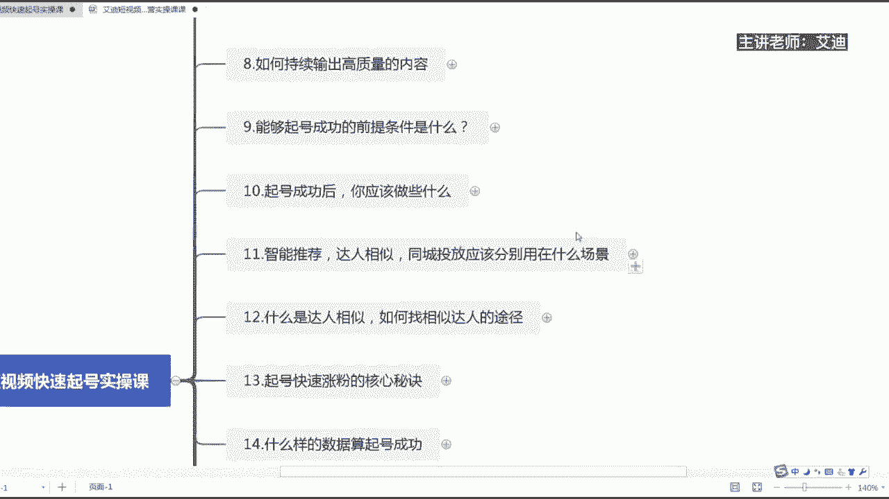
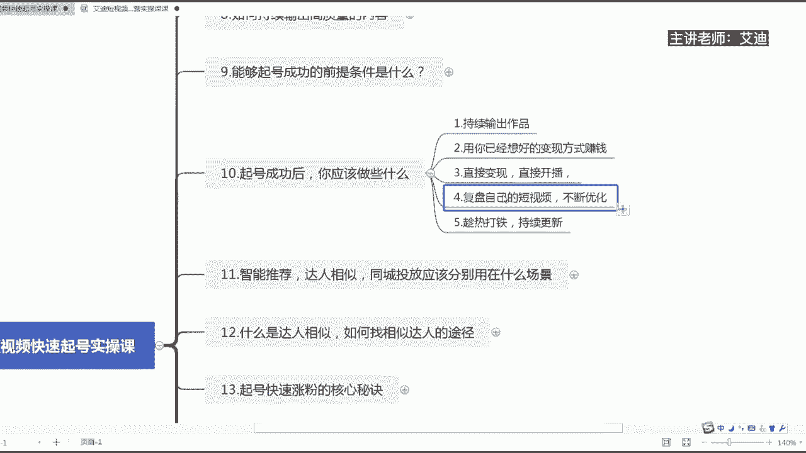

# 短视频IP快速起号实操课程教程，抖音短视频课程教程 - P6：10.【短视频IP快速起号课】起号成功后，你应该做写什么 - 买不起的貂 - BV1DWtJeKEX2

尊敬的各位迪迦商学院的同学们，大家好，本节课给大家分享的内容，是我们短视频快速起号实操课里面的第十节课，旗号成功过后，你到底应该做些什么哈，应该怎么样去做，来嗯，我是本节课的授课老师，我是艾迪哈。

那么我们起号成功过后，我们到底应该做些什么呢，对吧，怎么样去做呢。

来首先第一个如果说我们的账号起号成功了，那么第一个应该持续的去输出作品，要持续的去输出作品，如果你的账号起号成功了，破播放了，然后呢你没有持续的去输出作品，相当于这个账号的话。

其实他的热度会慢慢的下降的，所以刚之前的课程有给大家去讲，我们一定要不断的去持续的输出作品，不要去断，更不要去提根，而且每天的话尽量是定时定量去发这第一个，第二个用你已经想好的变现方式去赚钱。

成功起号的核心是什么呢，就是你的作品播放量发出过，能够轻松的到达个三五千，或者是轻松的去破播放，然后呢或者轻松的去上热门，这个就是成功的一个启航，知道吗，那么用你已经想好的变现方式去赚钱。

之前给大家去讲了，就是我们在做账号之前一定要想好，我们自己的一个什么呢，变现的一个路径，我们的内容是围绕着我们的变现的一个路径，然后去创造的这么一个内容，所以你的账号一旦有热度过后。

你就想想你的变现方式直接去什么呢，来直接开播，直接去赚钱就可以了，知道吗，好做好以上三点过后，我们还要不断的去做什么，我们不能在原地踏步啊，朋友们，我们还要不断的来第四点复盘自己的短视频，不断的去优化。

我们每天一定要就是抽出半个小时啊，左右的时间去刷我们的推荐页，推荐页能够推荐给你的都是你的同行里面，相对优秀的这么一些作品哈，他们都是热度上的，所以说你一定要在推荐页，每天至少去刷半个小时。

看看最近发生了什么样的事情，看看大家都在发什么类型的视频，然后呢通过别人的视频，然后再复盘自己的一个短视频，不断的去优化迭代和更新，知道吗，这个很重要哈，那么第五一个是什么呢，趁热打铁持续更新哈。

那么如果你的作品就是账号已经起号成功过后，然后呢有作品发出去了，过后有了一定的热度，整个的账号的权重都有所提升了，那么在这个时候哈，这个时候我们就要不断的去更新我们的作品，如果说你发现了你的哪一个作品。

或者说突然爆了，报了个十来万几万的这么一个播放，那么大家都很喜欢点赞，评论各方面都比较高对吧，那么在这种情况下，持续的去啊发出同类型的作品，就是这条视频什么这种形式可能大家都喜欢，那么你就延续这个内容。

然后再去拍同类型的作品，多拍几条，然后再发就可以了，知道吗，根据这样子的操作哈，然后呢基本上你的这个账号的话就可以稳定呢，你到现在为止听到我们的第十节课，你是不是想到底我们怎么样才能够去起号呢。

是不是不用着急哈，我们马上的话呃，内容的话就就在后面会给大家去做一个分享，因为如果说你们单纯只是去听起号，这么一节课的这么内容哈，如果说你们不了解前面的这些内容，我觉得嗯可能你再怎么起号。

我觉得嗯都可能会什么呢，会徒劳而功，知道吗，因为所有的东西都是从一开始起来的，从0~1这么一个过程哈，所以说我把真正起到的方法，放在我们后面的课程就是这个原因哈，那么以上的话就是我们本节课内容起过。

起号成功后，到底我们应该去做些什么，我是艾迪。