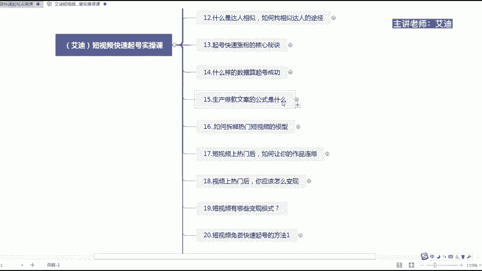
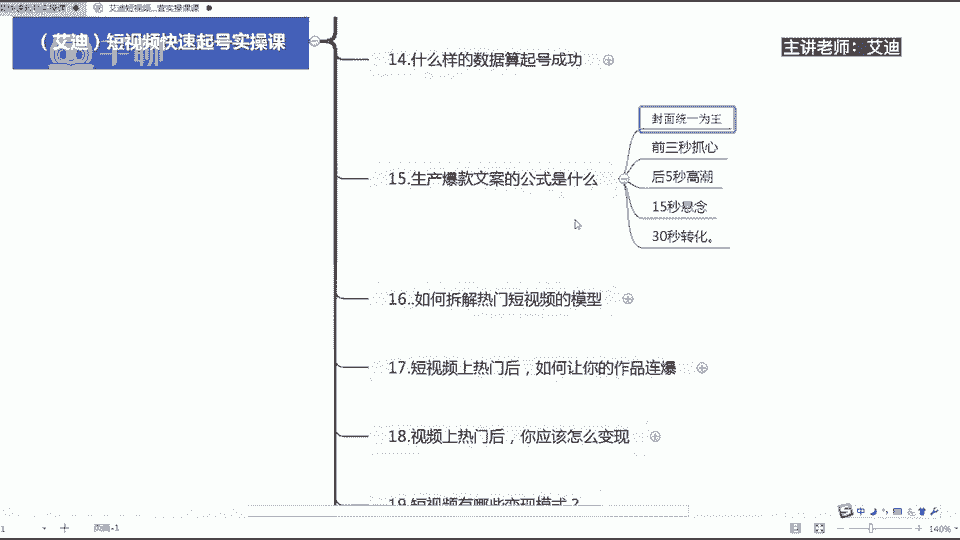

# 短视频IP快速起号实操课程教程，抖音短视频课程教程 - P7：15.【短视频IP起号课】生产爆款文案的公式是什么 - 买不起的貂 - BV1DWtJeKEX2

尊敬的迪迦商学院的同学们，大家好，本节课给大家分享内容，是我们短视频快速起号，实操课里面的第15节课，生产爆款文案的公式是什么哈，我是本节课的授课老师，我是艾迪，我们很多做短视频的。

我们都不知道如何去生产，就是爆款的短视频，到底应该具备什么样的这样几个内容，或者是模式呢，对吧是模块，对不对，才能够生产爆款内容哈，那么我们到底生产爆款文案内容。

的一个公式是什么呢，来给大家去看一下啊，生产爆款内容的公式是什么，首先第一个封面为王哈，是核心哈，封面大家理，我已经在我这个课程当中反复的给大家去讲了，大家一定要去注意封面哈，封面统一。

首先能够让系统识别到，我们这个账号是一个干净整洁的，这么画面可以获得基础的一个流量更多，知道吗，第二个可以增加你粉丝的一个什么呢，转粉率哈，转粉率哈，封面统一为王，这是第一个，第二个是前三秒抓核心嗯。

我之前的话给大家去讲过，就是什么呢，经过我们做了很多账号的一个数据的统计，因为我在啊今年3月份之前，我都是自己做直播的，然后我在3月份过后，然后我就去就是啊自媒体公司去做运营了，知道吗。

那么我们经过做几百个账号的这么一个统计下，来了过后，然后给大家去啊做了一个数据分析，然后是什么呢，嗯就是我们所有的账号啊，来所有的账号，从朋友们就是每一个人在一个短视频。

不管你是上热门还是不上热门的短视频，那么它在一个短视频停留的时长，最多就是6~8秒的时间，那么如果说你是长视频的话，你这6~8秒的时间或是6~8秒的时间，你就一定要怎么样去抓住它。

让它继续看下去的这个这个心，知道吗，一继续看下去的这么一个好奇心必须要去抓住，所以就要求我们前三秒要去抓心啊，前三秒都去抓清，比如说很多人的态度说，99%的人都不知道，是不是什么什么什么月入过万。

对不对，那还有一些是怎么样去说的呢，前我不告诉你一定不知道对吧，这个就是好奇心，是不是前三秒抓新，后五秒一定要去高潮，知道吗，这个就是前面八秒就过去了，是不是就高潮，高潮过后15秒过后留悬念。

30秒过后去做转化，知道吗，前三秒就是你一定要把你最重要，能够吸引人的话，放在前面的三秒钟，然后后面五秒钟，然后告诉别人啊，就是我是经过什么什么样，就是一定要提升这个悬念，提升这个高潮。

然后第15秒钟转化悬念哈，你想不想知道，对不对，30秒过后去做一个转化，去做一个转换，就是说如果说你想知道的，给我点赞，评论和转发，给我点个关注，下个视频再跟你分享是吧，来下个视频给你分享，是不是。

所以生产爆款文案的一个公式是什么呢，就是封面前面三秒抓新，后面五秒一定要去高潮，15秒过后留悬念，30秒过后去转化悬念是什么啊，悬念就是你想不想知道，想知道点个赞，我马上给你去做一个分享。

来高潮是什么呢，竟然还有99%的人不知道怎，通过这三个方法，你就可以掌握月入过万的核心的一个秘密，来，是不是五秒高高潮了，然后呢如果你想知道具体的内容是什么，给我点个赞啊，点个赞收藏下来慢慢观看对吧。

然后呢最后面说点个关注，下个视频继续跟你分享，是不是转换，就是就是这个样子的哈，所以所有的东西都是有模式和公式的，我们做直播，直播间有什么呢，那有直播的流程，我们做短视频，短视频有短视频的流程。

你知道吗，所以你想清楚了，其实就很简单，直接去套用就可以了，知道吗，朋友们好，这个就是我们生产爆款文案的公式哈，那么以上就是本节课的一个内容，我是二迪。

感谢大家的聆听哈。