# 短视频IP快速起号实操课程教程，抖音短视频课程教程 - P8：20.【短视频IP起号课】短视频付费快速起号的方法合集 - 买不起的貂 - BV1DWtJeKEX2

尊敬的迪迦商学的同学们，大家好，本节课给大家分享的内容，是我们短视频快速起号实操课，系列课程里面的第20节课，那么我们20节课的主要内容是。

我们短视频如何通过付费快速起号的一个方法。

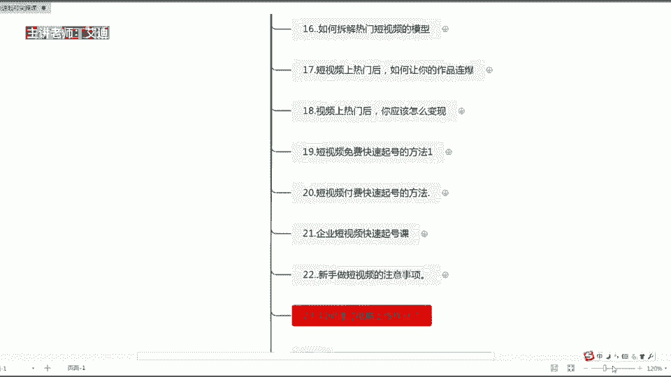

我是本节课的授课老师，我是艾迪，那么上一节课给大家去分享了，我们短视频如何免费的快速起效的方法，这节课给大家去分享短视频如何通过付费，快速起效的方法，那么这个时候很多人就会问我有免费的方法，不用。

我为什么想用快速的方法呢，那免费的方法有没有效有效，但是它需要一个时间，需要一个过程，那么如果说我们想要就是抓紧时间，快速的去突圈儿，我们最好的方法。

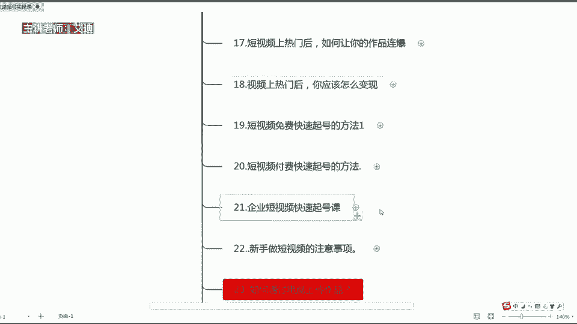

肯定还是用付费的这么一个方法，为什么，因为抖音是一个商业性的一个平台。

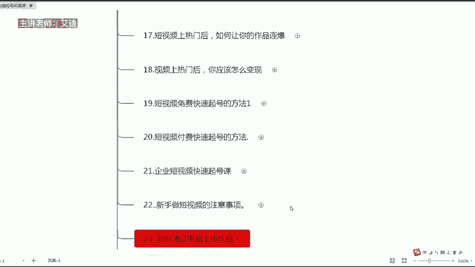

你给他付费了，你就相当于什么呢，坐了电梯，你就可以快速的去想要得到你想要的粉丝，拿到你自己想要的这么一个结果，那么我们快速起号的方法，我们有几种方法呢，来朋友们，你们可以看一下，给大家去总结了三种方法。

所以说我的课程里面不会说，只给大家教一种方法，我希望可以通过我自己对账号的一个什么呢啊。

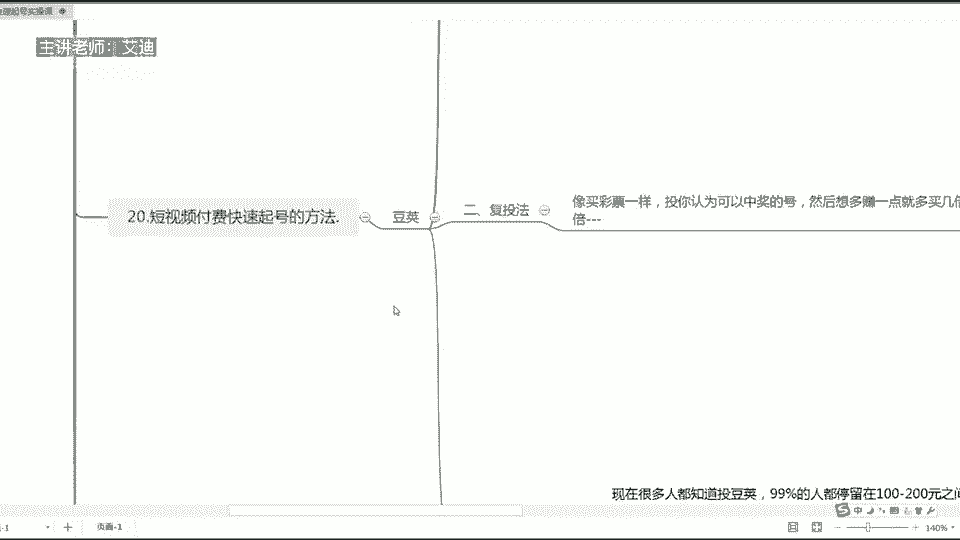

对账号的一个累积，以及做了这么多账号的一个累积，以及给别人运营账号的这么一个经验的累积，去给大家总结出这些方法，因为每一个人用一种方法可能不可能成功，但是你可以试用多种方法去尝试一下。

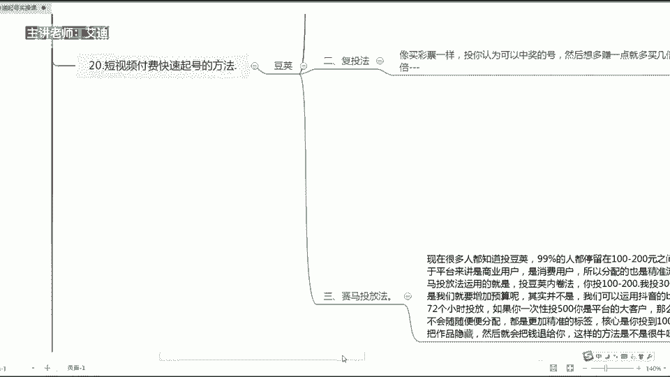

对不对，也许你成功的几率就会更大一点，我也希望你们所付出的每一分钱。

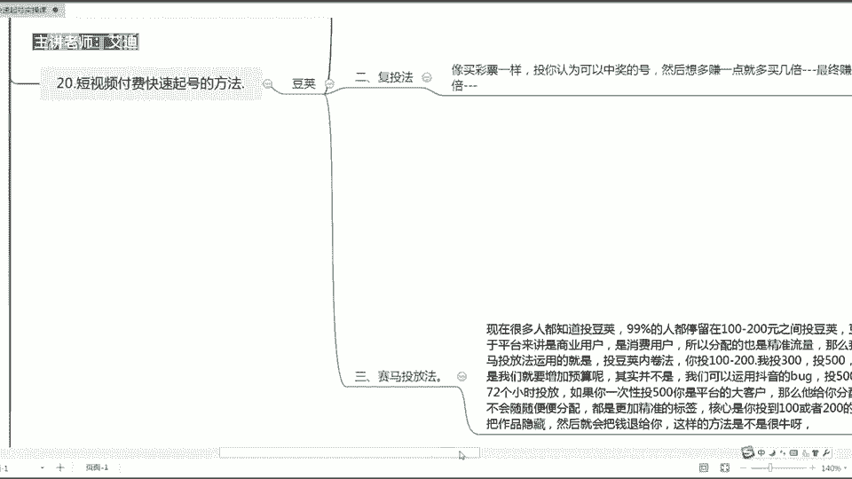

都能有价值的一个回报，那么我们短视频快速起号的方法。

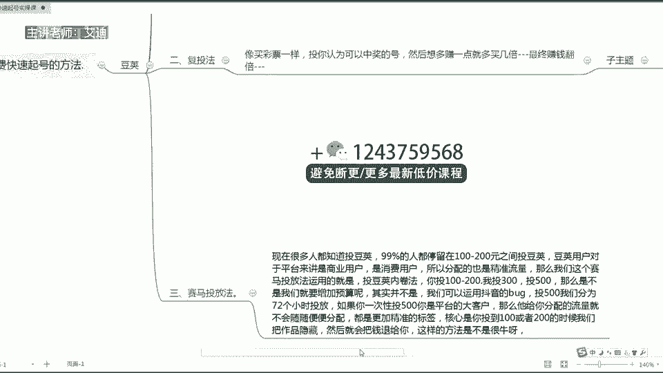

的一个核心是什么呢，付费几号的方法的核心是斗加。

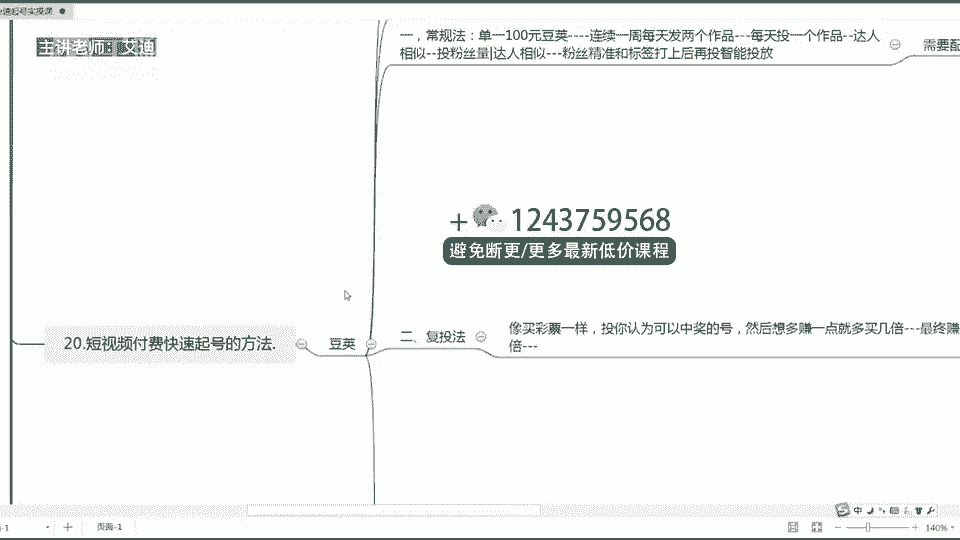

对斗家就是我们的一个付费流量，那么斗加它的适用对象适用于什么呢，啊朋友们，如果说你的你的所需要的粉丝是泛流量的，你你基本上就什么呢啊不不怎么需要，就是用到抖加多去累作品就可以了。

但是如果说你是做垂直类型的账号的话，我建议刚开始做账号的时候，一定要投抖加，为什么呢，因为你必须让平台快速的去了解到，你是做什么样的行业的，快速的知道你喜欢什么样的粉丝，什么样的粉丝喜欢你。

然后呢快速的把你需要的粉丝和流量推送给你，以及把你推送给喜欢你的这样子的粉丝，所以说我们付费桥的适用对象，适用于一开始就想做垂直类目的这种账号，那什么叫垂直类目，比如说你是做健身的，你是做美容的是吧。

你是做美食的或者某一类美食的，你是做就是调味品的调料的，那你是就是卖什么呢，卖发夹的，需要女性用户的等等，这些都是垂直类型的账号，那么我们付费旗号的一个注意事项有哪些呢，首先很重要的一点啊。

就是你一定要对你的内容有所规划，不是说你今天想着拍一条，明天想着拍一条，我就投一条，抖加啊，你的作品内容一定要高，一定要高的程度，是不是说你要拍到多高，至少说你在你在拍作品的时候。

一定觉得自己都还觉得还不错哈，然后呢你要这样子去拍，然后呢要不然的话，因为你的这个钱啊花出去的话就会什么打水漂，就没有起到多大的一个效果，另外从你一个内容的规划，我们在上次的课程就是本系列的课程里面。

上面有课程给大家去讲到，我们内容如何才能够持续不断的，源源不断的去输出，大家也可以回去看一下哈，然后这里的话就不给大家去多做多讲，就说你的内容一定要持续不断的输出，对内容有所规划，然后作品质量相对要高。

要不然钱就一定会打水漂，那么我们付费快速起号的三种方法里面。

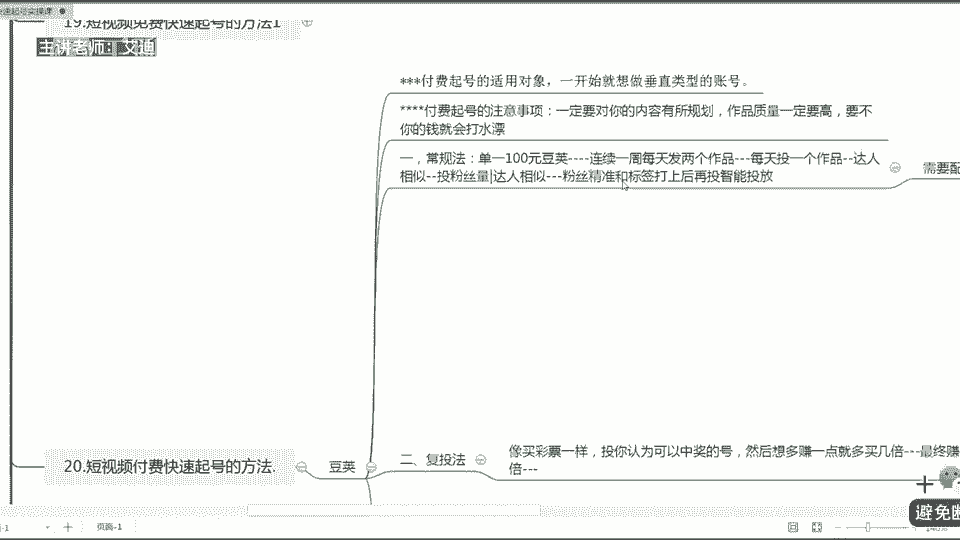

第一种方法是我们的常规法哈，来我们所有的朋友们是不是都都知道，我们斗家是可以投100块钱的斗家的，对不对，我们很多人投抖家，也是投100块钱的斗家去试一下，但是很多人没有方法。

就导致自己的100块钱抖家可能最终也什么呢，也是什么呢，不了了之，好像也没有激起一个什么浪花，所以你在后面的话就不敢去尝试头豆浆，为什么你头抖酱每次还是要花100块钱，是不是这个样子的，那么常规的投法。

是不是说我们投了100块钱豆浆，然后呢就结束了，然后就看一下就行了，其实并不是我们常规的头发也并不常规，那具体要怎么做呢，首先我们如果用单一的100块钱的斗价去投，大家请记住哈，连续一周。

这个是一周循环法哈，连续一周每一天你要发两个作品，每一天发两个作品，每一天，然后呢要去用100块钱的投家去投一个作品哈，朋友们100块钱的投家去投作品，那么你投抖教的一个目的是什么。

是让平台知道你有付费的习惯啊，你需要就是你是一个什么呢，相说白了这个平台的用户很多，那么这个平台一一分钱都不花的，就是拍作品，他拍着就拍了，就拍了，他不花钱的，那他显然就是普通用户，对不对。

那如果说你拍作品，你花钱了，那对于后台来讲，它能够识别到你有付费的这个行为，那么肯定他就会把你列为另外一批用户，知道吗，所以说在这个时候他就会知道你是一个创作者，然后他就会推送不一样的流量给你。

那么我们每天哈去投一个作品，大家一定要记住哈，投作品里面这个一定要注意一下，定时定点，去投哈，定时定点的去投啊，就是你如果说你今天是早上八点钟投的抖家，那么你明天也八点钟去投。

你一定要把你认为最好的这一天两个作品里面，就是质量最好的作品就放在这个时间，然后去投，投100块钱，刚开始我们投什么，我们是一个新号的时候，我们投达人相似哈，投达人相似，我们投达人相似的目的是什么呢。

投粉丝量和什么呢，投粉丝量和点赞评论哈，朋友们投点赞评论哈，投粉丝量和点赞评论，为什么，因为如果说我们去投答案相似，就是我们同行业的，那么投来的这些人给我们点赞评论了，就相当于有就是同类型画像的粉丝。

他喜欢我们的作品，那么投粉丝这样他给我们点关注了，也是说明就是同类型粉丝画像的粉丝，他喜欢我们诶，你就通过你付费的模式告诉了平台，什么样的粉丝喜欢你的作品，什么样的粉丝喜欢你。

所以说他后面才会把你的作品推送给这部分人，大家可以理解吗，那么为什么说每天我们定时定点的去投放呢，就是因为你每天定时定点的去投放的时候，你可以测算出你每天投了一个抖价过后。

你第二天的流量的增量是什么样的一个情况，而且你可以让系统很能够识别到什么呢，你是一个付费的这么一个用户，而且你每天也要去做这样子的行为，所以说你是一个创作者，然后他会给你推荐更多的流量。

更精准的流量给你，我希望这一点大家可以明白哈，那么我们在投了粉丝量，点赞评论量过后，然后这个时候我们大概投个三天左右，就会打上一个精准的标签，那么精准的标签打上了过后，我们后面再投四天。

然后我们去哪加我们的一个粉丝，然后这个时候我们在后面四天过后，你就可以去投什么呢，来可以可以去投什么呢，来继续去投一下什么呢，点赞评论和粉丝量就七天了过后，然后你可以去投智能投放，大家明白吗。

就是一定要前面在七天打上标签，打上标签了过后再去投智能投放，智能投放并不是说大家不会用的情况下，它就是泛流量智能投放，如果说你会用它就是什么呢，免费撬动平台流量的这么一个流量，为什么。

因为抖音是一个非常强大的AI系统，如果你用你前面七天的行为告诉他，什么样的粉丝喜欢你，你喜欢什么样的粉丝，什么样的粉丝喜欢你的作品，那么在这个时候，他的AI之龙投放就会启动，知道吗。

它就会自动识别到什么样的粉丝喜欢你，什么样的粉丝喜欢你的作品，所以他就会智能的把这些什么呢，把把这个什么呢，你投的斗家推送给这么一些人，因为大家都知道我们100块钱投放答案相似，是只有2500个播放量。

但是我们100块钱投送我们的智能投放，我们会有5000的一个播放量，所以在这种情况下，你就可以什么呀，用花少的钱，然后拿什么呢，博取更大流量，但前提是你得给自己前面打上一个标签，知道吗。

那么用我自己的一个案例来说啊，我给大家讲一下，就是我在去年做账号的时候嗯。

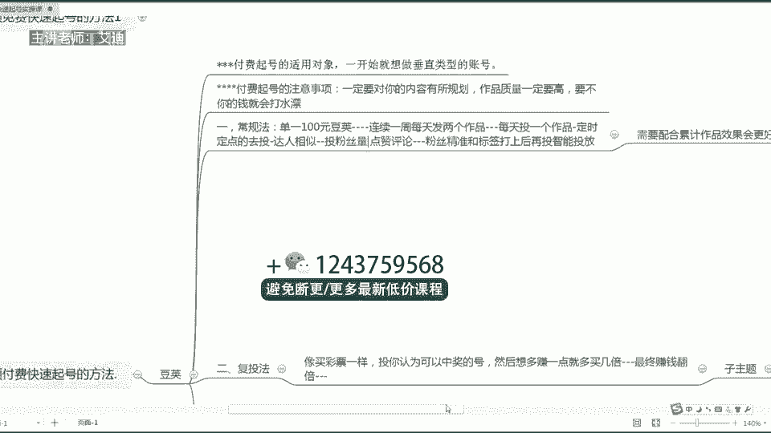

我是嗯在去年大概是6月份的时候，然后呢我一直在做直播到啊，今年的2月份我都在做直播哈，都在做直播嗯，然后呢后面我2月份过后，然后呢就是我们成都本地的一个公司的话，就请我去做代运营区了，知道吗。

就是啊相当于给他们去做运运营去了，那么我也想去啊挑战一下自己，就是自己的这方面的一个什么呢，呃能力，然后呢也是想去学习更多东西，所以说我就去了，后面我就没有直播了，那么后来的话。

然后我自己的一个账号在啊，中间的话有两三个月没有更新作品，然后呢后来我再放作品的时候，我的播放量全部都是零，知道吗，全部都是零，那么我就是按照这样子常规的方法，就是单一投抖加100块钱的这么一个方法。

测试我自己的一个账号，测试我自己的一个账号，很快的就是第一天投放100块钱的等价，我是每天发放两个作品，然后每天的第一个作品啊，早上八点钟的时候发，然后都会投100块钱抖加啊。

最好的作品放在那个时候去发，然后投100块钱抖价，我会连续去投粉丝量跟点赞和评论量交换，交替着去投啊，交替的是巨头，我在投第一天的时候，就我之前的播放量是零哈，然后呢我在投第一天的时候。

我的作品播放量到达了200多，第二天的时候，作品播放量达到了500多就正常了，然后第三天的时候播放量直接上了1000，第四天的时候就是已经是两三两三千的，第五天的时候就正常的。

就是以前已经是几千的播放量，在我投第7000的时候，我就正常破了一个2。2万的播放，然后破2。2万的播放，然后呢我再去开直播的时候，我直播间直接500多个人直接进来，而且全部是免费的流量。

所以说这个都是我自己，经过我自己的一个账号去实操和实操过的，并不是说给大家去单纯去讲了一个理论，或者编来给大家去讲的哈，所以你们如果说什么呢，你们是一个刚刚起号的，或者你的流量不太高的。

你们可以试试这种方法，这种方法的话相当于说你要什么要节约一点，是投抖胶里面最节约的一种方法哈，但是别人有我跟你说，你说阿姨，你说的就100块钱，抖价还是太贵哈，你看有些说投20块钱斗家也是可以的。

对不对，那么20块钱抖价不是不行，但是并不能够让你的作品有一个什么，非常大的一个结果，因为咱们来到这个平台做账号是想什么，想有结果的，20块钱投抖加，就说你投了这个作品过后，你看他作品播放量不好。

效果不好，然后你去隐藏，他会把剩下的80块钱退还给你，但是你想一下，我们的最终目的是想要那剩余的80块钱吗，并不是对不对，那么我们最终的目的是想让这个作品爆，但是我们很多作品的时候。

就是他在投达人相册的时候，你在前面跑20块钱的时候，其实他并不能说啊，这投20块钱的话，可能给你的播放量也就是多少，500~1000个，对不对，但是在500~1000个播放量。

并不能说你的这个作品到底是好还是不好，到底就是呃前面报还是后面报，因为有些作品刚开始他可能没有什么反应，因为你投的人不一样，前面来看的人不一样，但是可能慢慢慢慢跑到后面的时候，他的数据会更好一点。

知道吗，所以这个就是说什么呢，你们可以是十块钱，20块钱甚至五块钱都可以投抖价，就说你们看你们这个有没有必要知道吗，那么我们想做账号肯定是想把它做起来，对不对，所以我们不是以退还或是以十块钱。

20块钱去的斗家，这个为最主要的一个目的，我们最终的目的是想把自己的账号做起来，这个是才我们最终的一个本根本是不是，所以说在这种情况下来，在这种情况下，然后呢嗯我就是自己实操了这么一套打法。

你们也可以自己去尝试一下，这是第一种哈常规法，而且是最节约的一种，那为什么说它是最节约的，最节约的一种，因为他是在有效果的账号里面，最节约的一种方法哈，朋友们最节约的方法。

那么如果说你想让你的效果翻倍的话，你们可以在两个作品的基础上，多去增加一到两个作品，就每天发个三四个作品，然后这么去做哈也是可以的，这是我们的第一种方法啊。

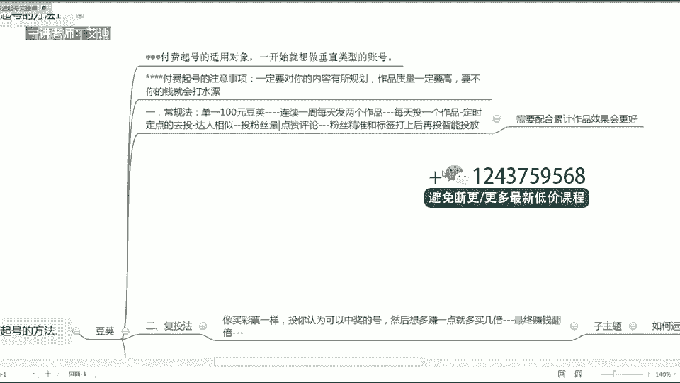

第一种方法，第二种方法就是复投法哈，来什么叫做复投法，就是反复的去投哈，反复的去投来，就像买彩票一样投，你认为可以中奖的这种号码是不是，那么我们买一注彩票，是不是我们想多赚一点，是不是我们可以什么呢。

买多少倍，两倍或者三倍或者五倍，这样子去投，对不对，那么最终的话你如果说一旦中奖，你是不是赚钱就会翻倍，那么运用同样的这个彩票逻辑哈。

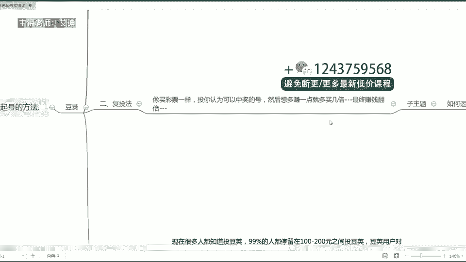

同样的彩票逻辑，我们如何运用户投的方法。

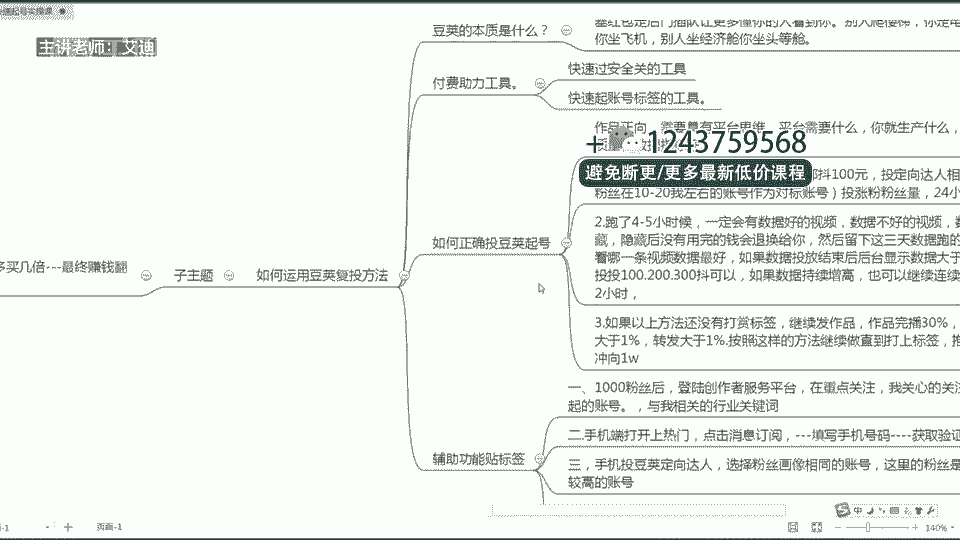

然后去起我们自己的一个账号呢，我们首先给大家去讲一下，我们抖家的本质是什么，我们到底要不要去投抖家，其实斗教的本质更向于什么呢，我们在现实生活中，我们需要去办某件事情，很难办的时候，那我们需要什么呀。

我们可能需要去塞个红包，是不是走走后门，是不是插插队，是不是，然后呢嗯让什么呢，叉叉对过后让你快速的去达到你的目的，是不是，那也有可能说你下面的这些人哈，就是刚开始我们不投指甲的时候。

那么系统给我们推荐的人都是什么呢，对抖家，对抖音本来就不太懂的人，所以说他不懂你，他就不会喜欢你的作品，那么如果说我们塞了红包，投了抖交过后，有可能他就会什么呢，让更多就是懂抖音的人。

然后来看到你的作品，所以说让更多懂抖音的人，懂你的作品的人，看到你的作品，他懂他自然会什么给你的作品去有一个反馈，知道吗，也可以相当于什么呢，就是我们在评那个什么呢，在一个电梯房里面。

那有些人的话就是什么呢，爬楼梯是吧，爬楼梯，有些人坐电梯，那我们住电梯房自然同样是五楼，当然是坐电梯两秒钟就到了，但你爬楼梯可能需要10分钟才能够到达五楼，是不是这样子的。

也相当于别人到我们到一个某某个目的地，去谈一个事情对吧，别人坐火车，我们坐飞机，飞机一两个小时，到了火车可能要跑24个小时，就是这么一个简单的一个道理。

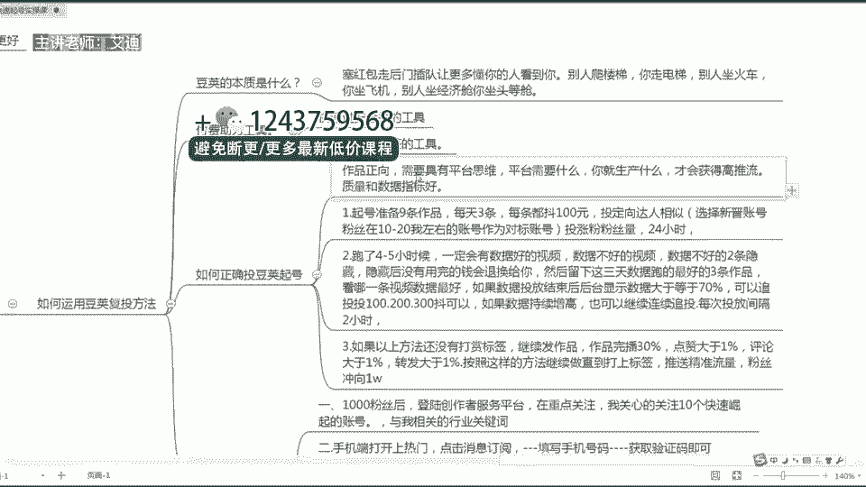

所以说大家今天的话一定要带着什么呢，带着客观的这种什么呢，客观的这种什么呢眼光哈去看斗家哈，不是说付费啊，我你说就是我我有我有一身傲骨，我觉得我自己可以，然后我不需要付费流量哈。

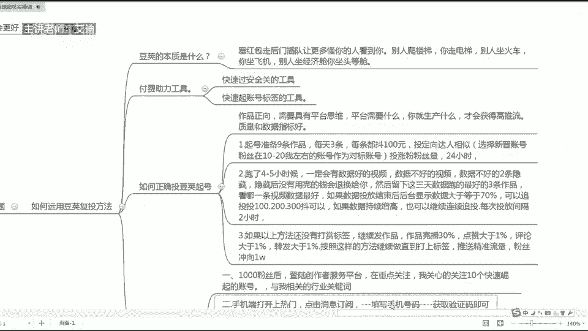

啊如果说你想就是快速的去涂圈的话，一定要投抖加哈，一定要投抖加，这第一个，第二个斗架，其实的话就是一种助力的一个工具哈，它可以让我们在新账号的时候，快速的去度过我们的一个安全关哈。

安全观的按什么是安全观哈，因为这个平台是一个新账号的时候啊，在这个平台的话，我们的粉丝的账号就是抖音的账号，这种账号的类别很多，有机器粉，有视频粉，有什么呢，有创业粉是吧，有创意粉又有僵尸粉。

是不是这样子的，那么经常看视频，什么都不做的，就是我们常规的一些粉，就叫做视频粉，那么机器粉的话很多是嗯，那些机构就是养的一些号，然后养好了给我拿去卖的，那么怎么样让平台知道我们是一个创业粉。

来这个平台创业的，那么需要通过安全关，很简单，就是付费，因为什么呢，机器粉视频粉他不会给这个平台付费，只有真正想在这个平台上去创业的，他才会到这个平台来付费，所以说我们通过抖家可以快速去度过安全关。

这第一个第二个呢，它是我们快速起起账号的一个标签，的一个工具哈，因为在这个平台做账号，做短视频，首先第一个你得打上标签，打上标签，什么叫标签，很多人都在说标签标签，什么叫标签，其实标签就是。

怎么样让平台能够快速的去识别到你喜欢什么，什么样的账号能够喜欢你，这个就是快速打标签的一个方法，知道吗，这个就是标签，就是你的喜好啊，你得让平台知道知道吗，平台啊就什么样的人喜欢你。

你喜欢什么样的什么样的人，就得让平台知道，就这么简单的一个过程，那么我们如何正确的去投抖价，怎么样去起号呢，首先你一定要明白我们在这个平台，我们是用的是谁的平台，我们是用的抖音的平台。

所以在我们抖音的这个平台上，大家一定要清楚，在抖音的这个平台上，不管是在我们线下还是在我们的线上，都是一样的哈，一定是什么呢，作品一定要是正向的哈，朋友们，作品一定要是正向的啊，需要具有平台的思维。

平台需要什么，你就生产什么，才会获得高推流，很多时候我们如果说我们的账号，它不是一个正向的一个行为的时候，你会发现诶，你的这个作品可能就是会引起很多人的点赞哈，评论哈转发。

但是你可能播放量到10万20万，然后系统就自动给你隐藏了，平台就自自动给你什么呢，说该作品不适合继续推荐的，是不是有没有这种情况，你们可能会做后面的账号的时候，会遇到这种情况，那么这种情况就是什么呢。

你的作品不适合在这个平台上去展现，或者你的这个作品的内容不适合去展现，所以说我们在这个平台，我们一定要有平台的思维哈，平台需要什么，我们去生产什么，大家在发作品的时候一定要注意。

你看你的这个作品是否是正正向的哈，我们一定要站在就是呃，就是各个角度去思考你的这个作品哈，好那么这点大家明白了过后。

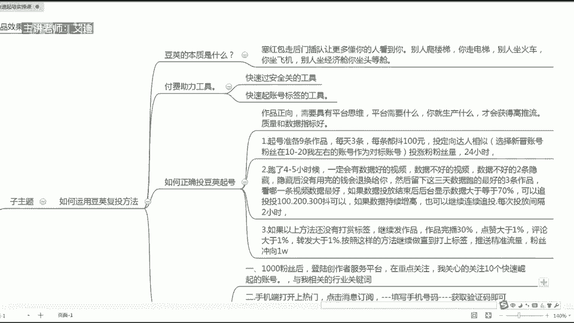

那么我们起号如何具体去实操复投的方法呢，首先第一个旗号大家一定要准备九条作品哈。

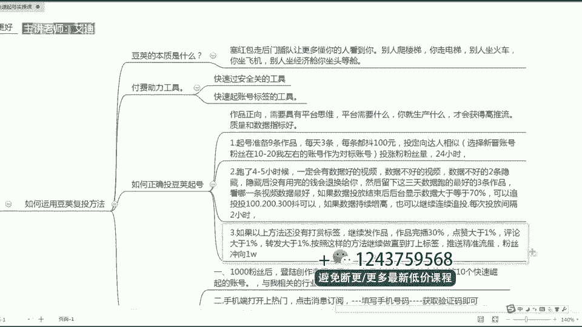

九条作品嗯，每天准备三条哈，每天准备三条，那么这个抖加跟我们刚刚那个什么呢，常规法就不一样，那么你这个三条作品，每一条你都要去投100块钱的豆浆，大家记住了吗，每一条都去投100块钱的抖，加我们投什么。

投达人哈，定向粉丝哈，定向粉丝达人相似啊，然后呢我们选择什么呢，这个粉达人相似，选择什么样的账号，选择新进账号，粉丝就是刚刚起来的，粉丝在十到20万左右的账号啊，20万左右粉丝的这么一个账号。

十到20万左右粉丝的账号作为一个对标账号，因为这些账号的粉丝是最新的，活跃度是最强的，所以要你们投他的一个投什么呢，投涨粉粉丝量，投他的一个粉丝量，知道吗，投24个小时啊。

24个小时为什么要选择24个小时，因为平台现在流量很紧缺，如果你只投六个小时，只投12个小时，有可能他还没有给你匹配到，更加精准的这个人的时候，然后呢什么呀，时间就过了，所以很多人在投抖加投六个小时。

投12个小时的，会发现，有可能你前面就是过了一个，一两个小时都没有投出去，对不对，但是后面的话最后一个小时，比如说你是投呃，定向2500的播放量，前面走了500是吧，就走一一个小时。

两个小时就只跑了500的一个播放，但是后面你会发现，最后一个小时一下给你跑了2000，对不对，这就是平台不什么呢，你平台没有给你筛选好你自己的粉丝，在后面的时候，他不知道要给你推荐什么样的粉丝。

所以说他流量不够用的情况下，他就批量的给你一部分的这种泛粉，所以在这种情况下，你就不会取到一个好的结果，所以说我们正常情况投24个小时啊，100块钱投24个小时哈，然后呢第二点是我们这九条作品是吧。

我们这九条作品他是每天发三条对吧，然后呢每天投100块钱，我们这些作品跑了4~5个小时够，比如说我今天我发的这三条作品哈，然后跑了四条54~5，每一条作品观察跑了4~5个小时过后。

那么是不是会有数据比较好的视频呢，也有数据不好的视频，是不是，那么我们就把当天数据不好的，就是每一天当天不好的视频啊，就跑了四五个小时过后，五六个小时过后，视频数据不好的，我们给它去隐藏，知道吗。

给他去隐藏，那如果说你发作品发出去，然后半天都没有一个点赞，也没有评论，说明你这个作品数据实在是太不好了，那你就给他隐藏，隐藏了过后，然后呢这个钱会退给你了，所以你不会有什么损失，知道吗。

这只是用这种逻辑去撬动抖音的一个流量，然后隐藏过后，然后呢没有的钱他会退给你们，然后呢留下我们这三天，以此类推，用这样的方法，把每一天作品不好的数据的两条隐藏掉，把作品最好数据的那条给他留下。

然后留下的这是三天，是不是就有三三个作品了对吧，三条作品呢数据跑得最好的作品里面，然后我们在三条当中看，哪一条视频的数据是最好的，如果数据投放结束过后哈，来这三条作品数据就是投放结束过后。

显示该条作品大于哈70%，的这么一个什么呢，来创作者的时候，那么这个时候我们可以去追投哈，可以去追投，投多少，投100，投200，投300都可以哈，都可以，那么如果说你投了100或者两百三百。

去追投了过后，那么这个数据还是不断的，在持续的去增高的情况下，那么在这个时候你还可以去再投100，投200，投300锥头，但是每次追投的实验要间隔两个小时，那么这里为什么要这么去做，我给大家去说一下哈。

我们所有人的账号的涨粉量并不是以数量去多，而这样子粉丝一个一个一个去累积起来的，我们通常涨粉是因为一个作品爆了过后哈，单个作品爆了过后有可能上到几10万上百万，1万2万的额，100万，200万。

上千万的播放瞬间给我们涨了那么大，几10万的一个粉丝，或者是小几万的这么一个粉丝，知道吗，所以我们投抖家的一个核心是什么，打造爆品哈，打造爆款的这么一个作品，包括我们做什么呢，啊做带货也是一样的。

一定是用爆品去什么呢，带动我们其他的什么呢，其他的一个平价品也是我们做作品是一样，一定是用爆品爆爆的这个作品哈，去带动我们其他普通的作品的这么一个流量，知道吗，所以这点大家一定要悟透啊，一定要悟透。

大家多听几遍哈，多听几遍哈，然后呢嗯第三个点是，如果如果说你用这上面的方法诶，你都没有打上标签，是不是没有打上标签啊，你的粉丝量也增长的不高，你的数据也增长的不好，然后呢你的作品作品。

然后这个时候呢点赞评论量不高，那么这个时候你要去回过头来，看一下自己的作品哈，有没有问题，用这个方法再给大家说一下，是完全没有问题的，是我自己经过我自己的尝试去测试出来的，但是前提是你们的作品要优哈。

作品要优，你不是说你花钱他就一定会给你流量，花钱的目的是引来流量，引来流量的目的是得到数据反馈，得到数据反馈的目的是刺激抖音的后台，大家可以明白吗，所以如果说你用以上方法都没有达到标签。

那么这个时候你要回头来看一下自己的作品哈，自己的作品是不是需要整改，那么如果说你的作品整改了过后，然后呢觉得有需要整理的地方，那么你就继续按照上面第二种方法，这个这个方法第二点，然后去做哈，继续去做。

然后呢你在发作品的时候，如果说你看你作品完播率大于30%呃，单条作品的作品完播率大约四三十%，就说你没有，就整个数据大概70%的情况下，你的单个作品完播率大于30%，点赞量大于1%。

评论量大于1%的情况下，转发率大于1%的情况下，我们可以什么呢，按照这个方法啊，就上面的这个方法继续去打上标签，知道吗，继续去投哈，投100，然后看数据，然后呢，追投这样的数据去打造我们这么一个什么呢。

爆品的这么一个作品哈。

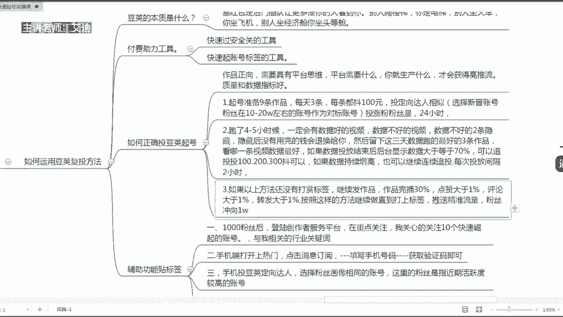

希望大家这点可以明白，一定要反复看啊，反复看有什么不清楚的，然后呢随时可以问我哈，随时可以问我，然后呢啊这个就是我们付费投抖加，就是付投斗教的一个方法，那么复投斗加之前哈，大家一定要去啊。

辅助的去把自己的标签给他去贴上哈，因为富特斗加七斗加我们旗号的话，就是自己给自己贴标签嘛，这是首先第一步对吧，然后涨粉丝，那么为了就是让我们快速贴上标签，你们还可以怎么样哈。

第一个在1000个粉丝过后哈，你有了1000粉丝登录电脑端的，来登录电脑端啊，电脑端的创作者服务平台，在左边的话有一个重点关注，点击我关心的十个快速崛起的账号，然后再点个相关的行业关键词哈。

选择三个相关的行业关键词，比如说我是做短视频的，我就选短视频啊，上热门啊是吧，然后自媒体等等这些都是可以的，然后第二个是什么呢，在我们的手机端打开上热门，点击消息订阅哈，手机端有上热门。

找到我们的上热门创作者服务中心里面，然后点击消息订阅，填进我们的手机号，获取验证码，然后去什么呢。

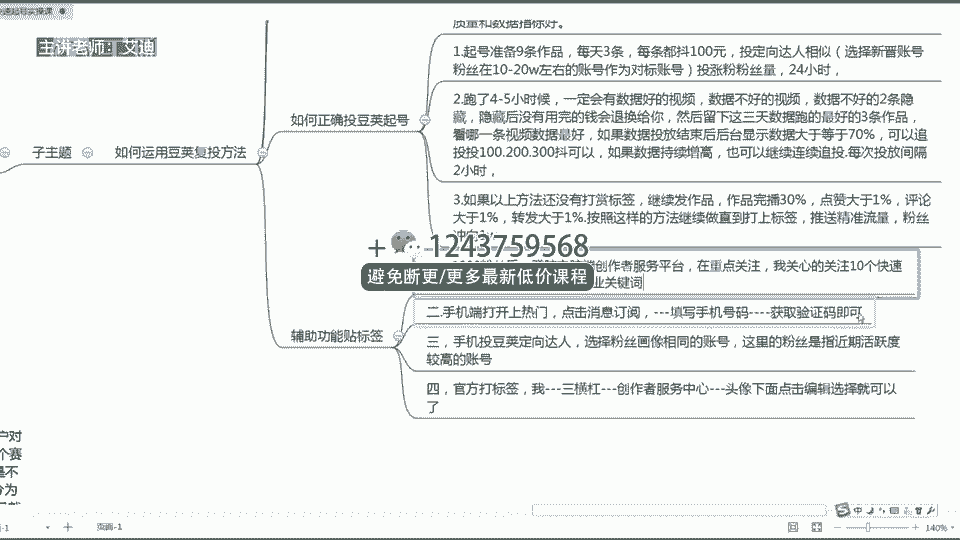

手动的哈，去添加我们的标签，手动啊，添加标签哈。

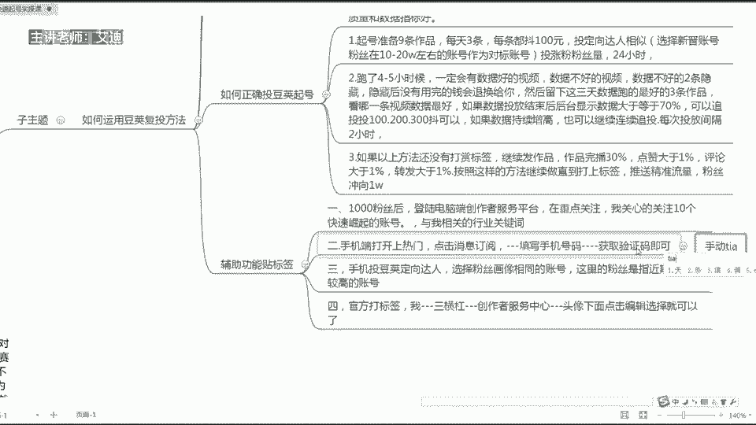

添加标签这些把这些工作做到位哈，添加标签，因为一切存在即时合理，他既然给你设置了这么一些按钮哈。

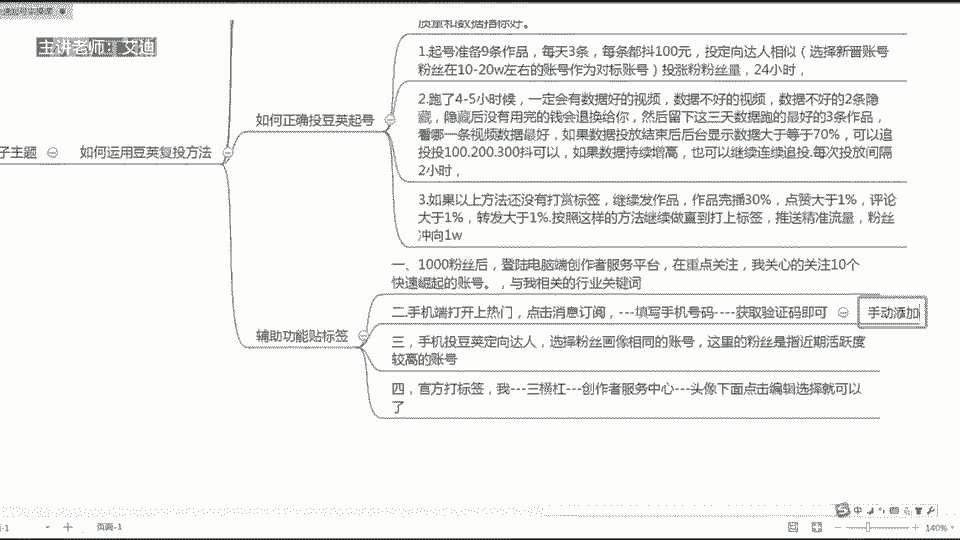

那么你就全部去给他什么呢，完善了，知道吗，让你快速的打上标签，第三个就是投那个什么呢。

嗯投那个定向达人是吧，就是我们投投抖加是吧，投抖加的这个方法是可以的，知道吗，然后第四个就是官方打标签。

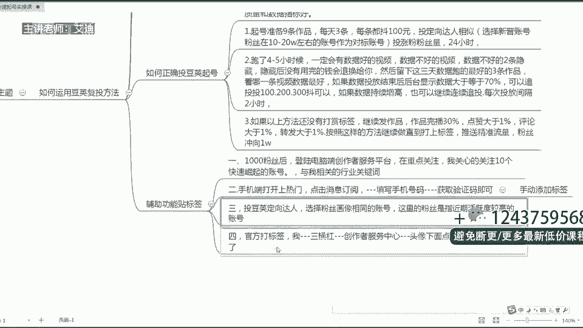

官方打标签就不，之前很多人给大家误导了一些什么呢，就是错误的一些打标签的方法，所以官方出台了他们自己打标签的一个方法，就是在我三横杠有一个创作者服务中心，然后创作者服务器中心进去的话。

你的头像下面就有一个编辑，你点编辑里面就可以选择你自己的一个标签了，知道吗。

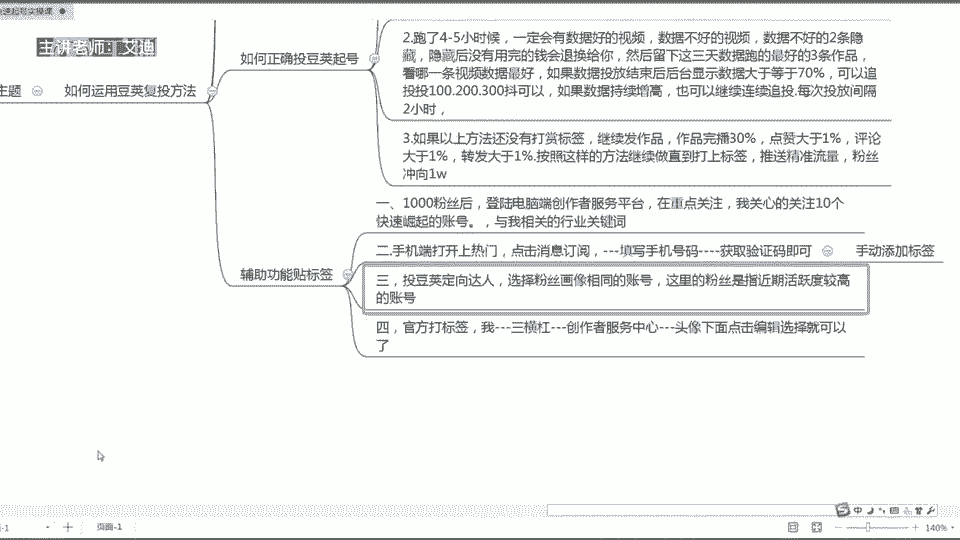

然后这个的话就是我们本节课的一个内容，我们这个内容的话。

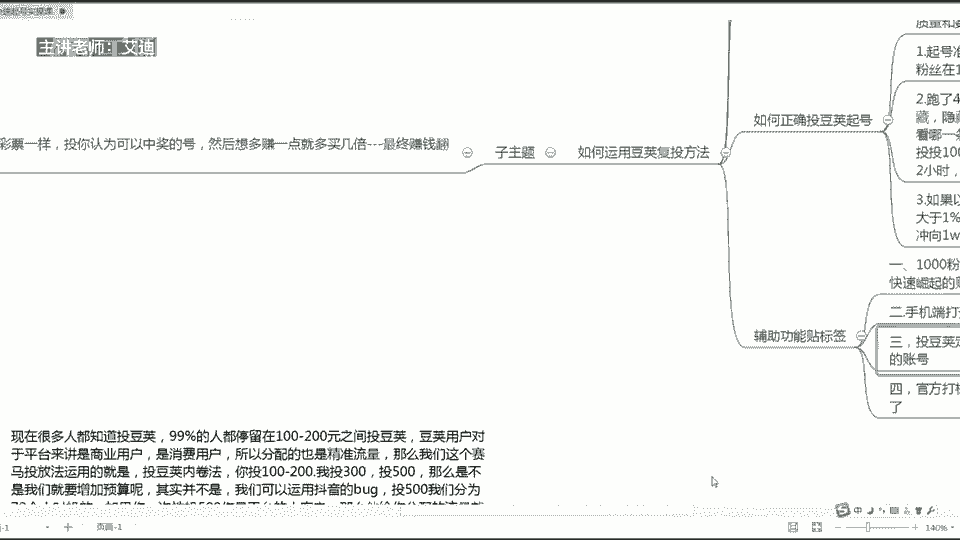

就是我们如何运用付费的方法去快速起号的，这个方法，总共的话给大家去总结了三点。

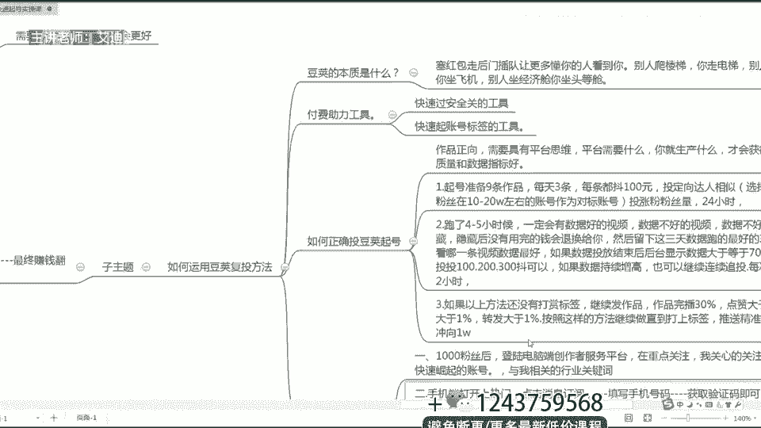

第一个是我们什么呢，哎第一点是我们的呃常规法啊。

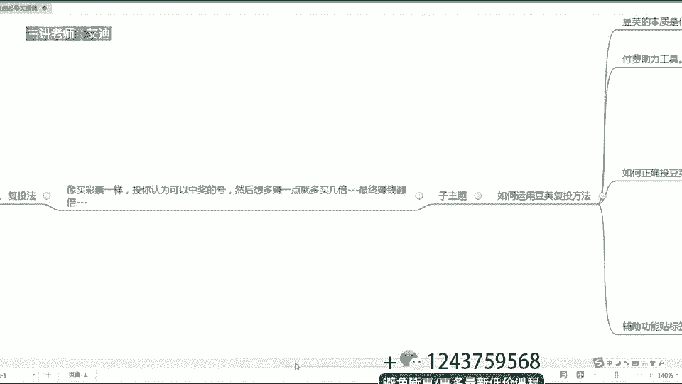

第二个是我们的复头法哦，第三个还没给大家去讲哈，不好意思啊，第三个还没给大家去讲，那第三个的话，就是我们赛马投放的这么一个方法。

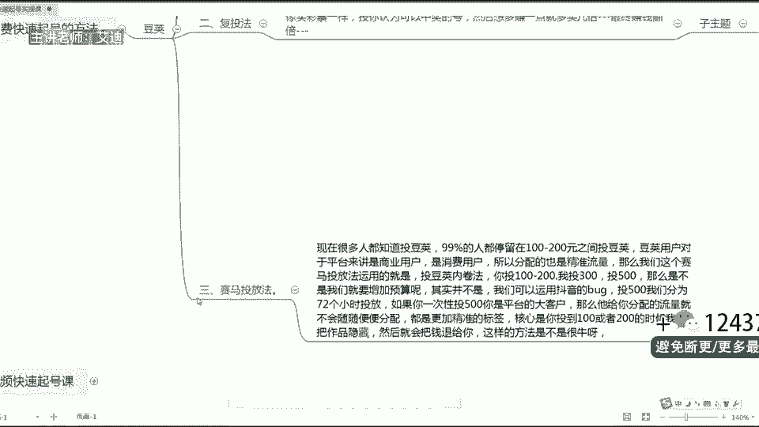

赛马投放哈，大家一定要注意一下什么叫赛马投放来。

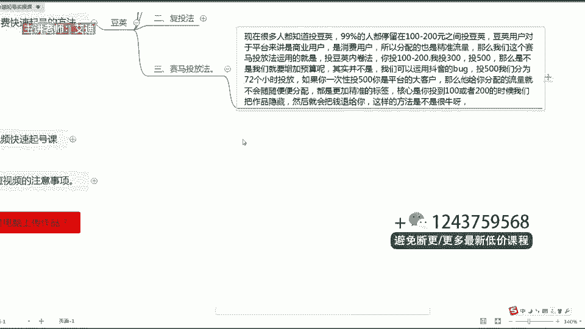

我所有的这些投放方法，都是通过自己的账号以及跟别人投放的账号，然后呢啊总结出来的这么一个经验哈，我希望可以帮助到你们嗯，赛马投放是什么意思呢，那大家都知道抖音是赛马机制，是不是。

那么现在很多人都知道头斗家，但是99%的人，投抖价都是停留在100块钱到200块钱之间，投抖价，你们告诉我对还是不对，是不是这个样子的，你们自己回想一下，因为为什么呢，啊为什么他们都停留在100块钱。

200块钱去投抖肩呢，因为很多人他是自己在做抖音，100块钱，200块钱，头一次抖家，其实说实话对于普通人来讲，这个费用就已经比较高了，对不对，如果在他作品不是很优质，不会拍作品的情况下。

那么他投这个钱基本上就是浪费了，知道吗，所以很多人不敢去投啊，不敢系统，所以大部分的人停留在，100块钱到200块钱之间，他们的这个斗价的一个预算的一个金额，那么斗家用户对于平台来讲，它是一个商业用户。

它是消费用户啊，所以相当于也就是VIP，知道吗，所以你投了抖交过后，他为什么给你可以快速的给你贴上标签，就是因为他给你分配的是精准的一个流量，那么我们这个赛码投放是用了什么呢，就是用斗家的内卷的方法哈。

说到内卷，这个这段时间是不是大家都很流行，说内卷是不是这个方法利源是什么意思，就是同行的竞争嘛，那当你知道这个平台，99%的人都停留在100到200块钱投，抖掉的时候，来，你想一下你是不是可以投300。

你是不是可以投500，甚至投1000，是不是，那么是不是你说哎你要我没有这么多的钱呐，投100投200，我都觉得什么呢，我都觉得心疼。

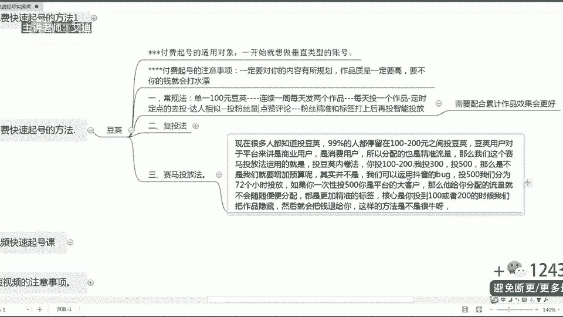

我还投300，投500，是不是，你这这是不是就是啊就忽悠我们呢对吧，我哪有那么多钱去投那么多。

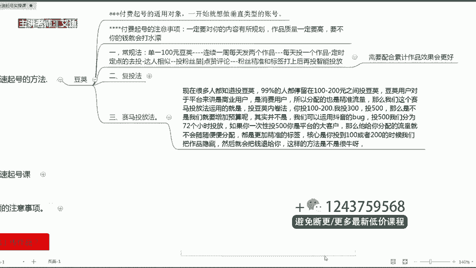

而且我投进去了过后还不知道怎么样，你就能够保证我一直什么一直都能够涨粉丝吗，是不是能不能够把自己的账号做起来，谁能够保证都不能够保证，但是我要告诉你们的是什么呢，这里面有技巧，就是别人投100。

你投200，别人投200，你投300，别人投300，你投500，那么是不是，这个时候我们的成本预算就要增加呢，其实并不是啊，来这个时候我们就可以运用20块钱，偷独家的逻辑了，知道吗，朋友们。

所以我们抖音做抖音，一定要带着思维和思路去做哈，这个时候我们就应该运用20块钱都抖掉逻辑，不是说我们投20块钱来，比如说我们投500块钱，是不是投500块钱，是不是你投抖家的时候。

下面有给你选择一个投放的时长，那么这个时候我们投100块钱，我们可以选择24小时，是不是啊，24小时投放，我们投500块钱，我们可不可以选择36个小时，48个小时，可不可以选择72个小时去投放。

你们告诉我啊，去告诉我是不是这样子的，那么如果说你一次性投500，你就是大客户，你要知道哦，你就是大客户，那么在这个时候他给你分配的流量，就不会随便的去给你分配什么，阿猫阿狗都来看你的作品。

他给你分配的流量一定是在精精准的流量当中，更加精准的这么一个流量，你们可以理解吗，所以在这个情况下，来这个这个情况下，然后呢我们投500个抖加或者投1000的抖浆，我们选择48或者72个小时是吧。

这个时长，那么我们在投放出去了过后，平台就会马上的识别到，我们这个账号是一个什么呢，大客户知道吗，舍得花钱的账号，那么很快的，这个流量就会集中到我们的这个账号里面来，那么在这个时候朋友们技巧来了哈。

来技巧来了，在这个时候我们投放出去啊，十个小时或是20个小时过后啊，24个小时过后，我们是不是可以把我们这个作品隐藏呢，啊隐藏了购物再公开，是不是它是不是我们大概你算吧。

就是500块钱分期12个小时投放，也就是什么呢啊，四天是吧，四天二，一天24个小时，48，两天48啊，48，然后三天就三天的时间对吧，然后呢我们投了一天，是不是也就跑了100多块钱。

或者100块钱把它隐藏，然后呢系统会把我们剩余的钱退给我们，但是在这个时候你会发现一个很神奇的事情，就是说你刚因为你投了500块钱的这个动作，有可能这一天24个小时平台啊。

你正常情况下你投100块钱给你多少啊，给你的是2500的流量，是不是有可能这一天你就拥有几万的一个播放，几万的一个流量啊。

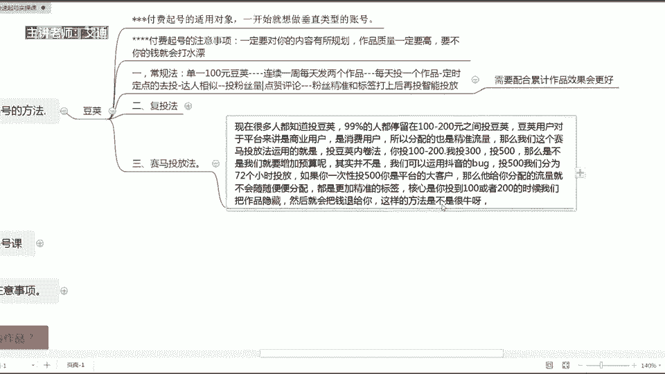

知不知道这个是我们自己经过账号实操，然后得来的哈。

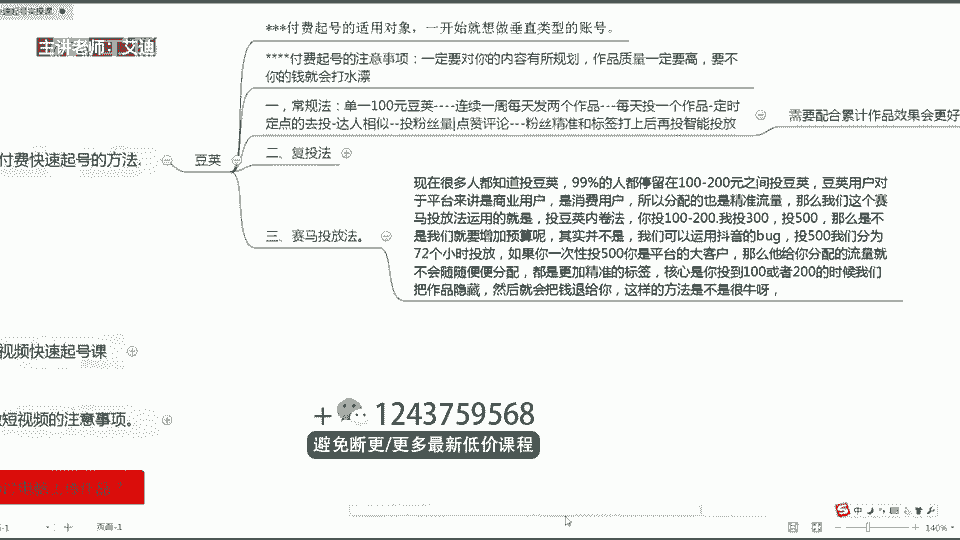

然后也是通过给别人的去投放，然后总结出来的，都是我们去拿自己的真金白银去砸出来的，朋友们，这些都是经验哈，希望可以帮助到你们。

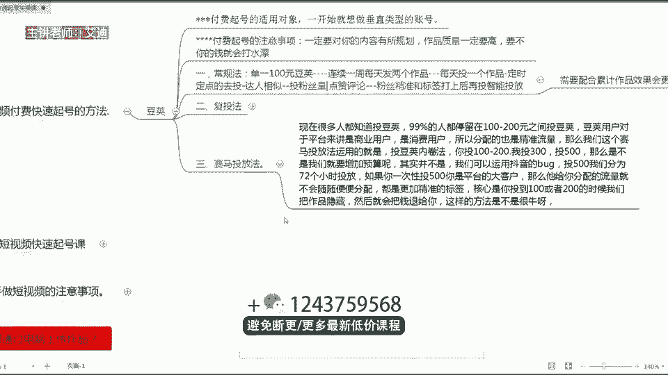

我希望每一个买我课程的朋友们，你们的每一分钱都不会去什么的浪费，我希望可以有各种方法去应对，就是什么呢，各就是你们的各种场景，比如说这种赛马头发敷头发确实可以适合，就是做什么呢。

就是你们自己本身有一定资金资金的哈，然后呢也是比如说你们有企业的是吧。

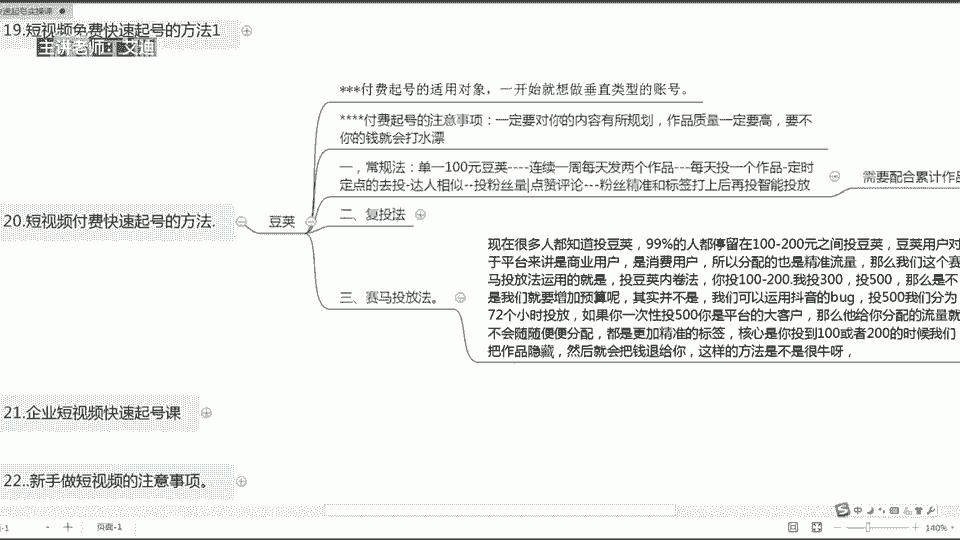

有企业的做自己的企业账号的，是不是公司账号的，确实可以用这种方法快速的起来，如果我们普通人也可以用什么呢，100块钱的常规的投法，但是呢如果说你也想快速起来，你你你觉得你愿意用这种就是投钱的这种杠杆。

去杠杆你自己的流量时，你也可以用敷头法，你也可以用赛马投法，所以总有一种方法是适合你的啊，适合你的，我希望可以帮助到你们哈，感谢大家，以上的话就是我们短视频付费，快速起效的方法哈。

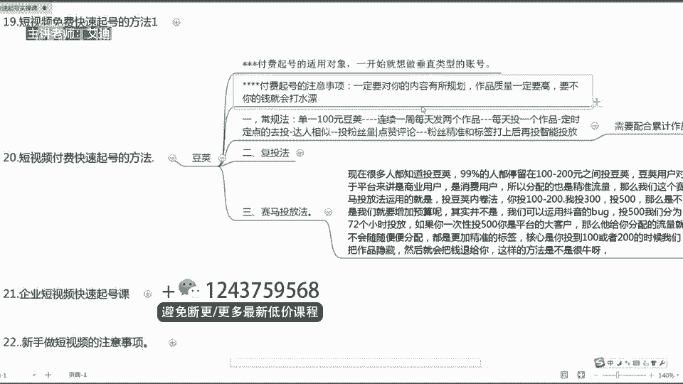

常规法浮头法，三码头方法，我呢是本节课的授课老师。

我是艾迪，谢谢大家的聆听。