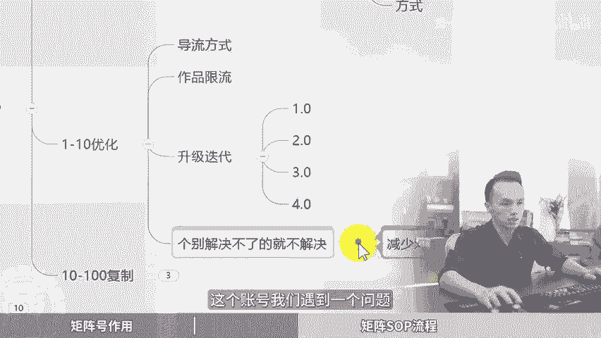

# 短视频矩阵推广引流，矩阵玩法如何运营？短视频矩阵系统，短视频矩阵运营，短视频矩阵是什么，短视频矩阵软件，矩阵玩法是什么意思，矩阵运营工具，矩阵运营怎么样？ - P1 - 黄一恒矩阵推广引流 - BV1dnpoeKE9P

下一个方口不是直播，而是几阵，几阵一定是线上流量的超级放大器。很多老板觉得做几证就是多做几个账号，这其实是小白的几阵。集证的本质目的是通过数量来对抗算法的不确定性，去获得稳定高效和变现的流量。

像这个账号，包括我的商业IP几阵，平均每天能稳定获克200家。🎼这就是几证的命令。其实几阵这件事并没有你想象那么复杂。核心技巧。第六个，今天我给大家掰开揉睡的讲清楚，季节废话。

一个视频给你分享短视频几阵推广，几阵玩法如何运营。视频有点长，记得先收藏，一起来看，我给你分享几账号的作用有哪些，做几证的SOP流程又是什么？下来看几账号的作用。第一个。

它能够帮助我们提升账号的抗关键能力，60%做视频的人都会面临限流或者方号的问题。当我们拍摄到一些敏感的题材关键词或者画面就会导致我们账号出现违规。比如说限制请教发言，禁止发布作品，新发作品，减少推荐。

限制用户搜索，这些呢都是比较轻的，严重的直接放进30天，方进一年，甚至有的出现永久放进。所以当我们搞了几阵，建立多个账号，一旦某个账号出现。

限流或者封禁，其他账号还可以继续引流或者吸粉，从而减轻我们的影响，分散风险。比如现在我们做了5个账号，一个账号出现违规了。我们另外4个账号还可以正常引流。对我们来说，只减少了20%流量。

我们只要加一个账号进来，运行一段时间就可以恢复。包括大家肯定刷到一些头部的账号有几百万粉丝，1000万粉丝真的是缩疯直接就给封掉了。第二个放大宣传效果。咱们多个账号分发。

能够让企业及产品持续的获得更大的流量。如果我们做播款的能力不是很强，那我们可以勤快一点用数量来补这个曝光量。比如简例，咱们发布完视频之后，假设平均每条视频能够带来一万的播放量。

这时候我们如果搞10个账号。我们的播放量就能够提高10倍，也就是10万的播放量，那10万的播放量已经可以顶得上一个小热门的作品了。第三个风格多元化。当我们在打造IP集阵的时候，不同的账号。

我们可以做不同的风格。比如说第一个账号我们可以做专业型的输出专业知识。第二个呢，我们可以做生活化的分享一些口播内容。第三个可以做采访型的或者AB对话式的都可以的。

通过不同的风格去吸引不同的目标人群覆盖更多的客户。第四个账号的赛码机制，每个账号的基础前度是不一样的。你发布完之后，你会发现流量也不一样，涨粉的情况也不一样。所以咱们获得到推荐流量也不相同。

打标签的周期和时间也是不一样的。所以咱们在做的时候，如果你前期跑两个三个账号。我们测试并沉淀出更优的账号重点运营，还可以开直播，这样的话更加容易做起来，很多伙伴有的时候做不起来，并不是因为你其他不对。

有可能是因为你的这个账号本身的权重就不够高。第五个大力出奇迹，做流量的密诀就在于什么？发的越多，出奇迹的概率就越多，你可以刷到平台很多昙花一现的账号，这个账号你打开一看，都是有几百个作品。

就是因为它非常勤快，不断的发布作品。某一个作品一旦报了就可以涨几万粉丝。所以咱们在做的时候，虽然我们可能。对这些不像专业的公司和团队，视频制作的质量特别高，专业团队策划，而我们自己策划。

那我们就可以多发一些。比如说你发20个、30个，只要有一个爆了，就能够带来不错的流量，你再发也是可以持续的获得不错的流量。接下来我们看一下，到底我们该如何去做几站，他的SV流程又是什么？

首先来看一下之间的误器。很多伙伴做几站认为视频的数量越多越好，想一天或者花非常长的时间就能够搞几十上百个视频。但是我要告诉大家，做几站重点在以视频的有效性，你搞一些视频出来吸引不到有效客户有什么作用呢？

记住，咱们做视频，这个视频的定位一定要是被精准用户刷到，被有需求的用户看到。被这些用户到店咨询或者购买的意见，如果脱移的这个点，你做再多视频，我告诉大家想再多粉，最后呢你都会为变。见和感到头大。

第二个测试几张的脾胃这一步呀非常重要。这就是我们做集针的一个落地流程。首先第一步我们要学会0到1跑通，这个什么意思？相当于前期啊我们只做一个账号，两个账号，我们把这个账号拿过来测试，稳定的能够产生盈利。

搞到客户。这时候呢我们再把这个账号进行1到4的优化，这是什么意思？相当于前期我们做的时候需要测试出什么样的选级能带流量，什么样的开场能够进流量池，什么样的方式，用户更加喜欢推荐也比较不错。好了。

0到1跑通之后，接下来我们1到1优化一下。我们接下来开始研究一下什么样的导流方式更安全，作品限流怎么办？怎么样升级迭代，刚开始1。0慢慢做到2。02。0的流量更大，3。0呢，用户更喜欢4。

0呢完全能够抓准用户的需求痛点，这些都要不断升级。对于个别问题，如果实在解决不了，那咱们就不用去解决。如果你能够保持这样做，也可以获得。一个不错流量这样做的目的就是为了减少对单个账号的依赖。

而不是因为说这个账号我们遇到1问题解决不了了，我们就没办法往下做了。它对我们来说只是10分之1，只是5分之1。接下来我们就开开始10到100的复制。什么意思？记住做几阵的核心，就在于复制。

当我们0到1跑通1到10优化之后，接下来我们可以复制10个，甚至有的有团队的有公式的，可以直接复制100个稳定你的账号，避免我们的大号或者个别账号被封限流，对我们产生影响。你账号只要够多。

一个账号出现问题，对你来说只是个毛毛易，完全不产生影响。好，来看第三个做惩罚几阵。

咱们如果想把流量加大，首先我们学会多平台提升，什么意思？当你已经花了时间。做了一个视频，这个视频我们可以同步发送到多个平台。比如说抖音、视频号、快手、小红书、西瓜、B站，我们就能够获得6份流量。

同时打造6个流量管道。这个平台流量不报另外一个平台报。而且你发现不同的平台，它的用户喜好不一样。有的特定内容在特定的平台里面，它是会得到这个加持的。比如说你做的是如果是中长视频。

发布到西瓜B站里面横拼视平台，它就能够获得比较不错的流量。其实我们还可以做多账号几针，也就是单个平台操作多个账号，这样的话就可以直接把我们的限流量乘以两倍、3倍5倍，甚至有团队的可以乘以10倍。好。

第四个自印几成策略，这是什么意思？如果有门店的有公司有团队的，可以让每个员工印营一个独立账号，每个账号发布的视频都是不一样的，都是属于员工自己去拍摄的。而且这个员工拍的视频不是乱拍。

他是用我们的MPV来拍的。因为你已经测试出我们的这个选题开展的方式，只是让他把这套模式去进行复制，复制完之后呢，我们就可以获得每个人自印的账号，流量红利。这个流量红利啊整体还是非常不错的。

而且目前整个平台自运营的红利期啊，目前是非常可观的。普通视频呢也能够带来大量的自形。那么做自营几阵的时候啊，所以中。点就在于一定要记意我们前面讲的MP模板。来进行操作。

那么还有一个比较厉害的叫消费者挤赞。什么叫消费者挤赞。当我们做出了1个MPV模板？我们可以让消费者参与到这个视频制助里面来。但这个视频啊，很多人在做的时候都会遇到一个障碍。什么障碍呢？

比如说这个视频发布太繁琐了，客户啊根本不愿意操作，或者缺乏动力和炒好处，没人愿意发，那怎么办？我们就需要去解决这个问题，激励消费者来发视频，比如说策划活动，提供打卡奖励。比如说赠送饮品，赠送甜品。

甚至赠送一些高价值的单品。这个单品用户买要花50块1表块，直接参与活动就能够拿得到。而且我们还要提供自助支持。如果你用用户去发，他基本上很难，他发出来作品来没什么流量。比如说你提供。扫码自动生成框架。

在这个框架模板里面，比如说啊把模板套一下话题套一下，团购地址套一下。好，这时候呢就能够提高发布的便捷性。对用户来说，奖励非常大，操作起来非常便捷，非常简单，大家都愿意去参与。

毕竟发个作品能够省几10块钱，谁不愿意操作来。那么还有一个玩法叫做原创授权举证，这个方法呢非常厉害，就是同一个视频发10个账号都不会背判翻译。这个方法它其实是平台自带的功能。入口呢很隐藏。

大家呢都不知道。但是啊我们的主账号一定要符合平台的原创作者标准才可以参与。我们就可以授权多个账号发视频，没有版权问题也不会涉及到原创的过低，更不会出现什么翻译问题。但是呢一定要我们的主账号达到1万粉丝。

一万粉丝啊是一性指标。为了方便给大家演示，我来示范一下，咱们点击右上角的三条杠，点击创作的中心。这里我是准备了一个呃没有做过延充授权账号，给大家演示一下。好，打开之后，我们稍微等它加这一会。

然后我们点击下方的前部，在前部里面有一个。账号也安全，我们找到原创保护，点击一下点击完成之后，在这里面我们点击这个冒用治理。然后呢，当我们粉丝达到1万，并且满足这几个指标，我们勾选。

然后点击下一步就可以去开通，就可以添加你的子账号给子账号进行授权，就不会出现什么搬应的问题了。大家可以去对照操作一下。好给同学，我是黄一涵只做落地推广方法。刚才给大家分享的六大几成技巧。

那如果我们想去落地，建立选题库来做内容，做爆款，包括去优化咱们的作品。这里面我给大家准备了18个平台的详细打法，教大家如何打造多流量管道。这些呢都是原创的，可以通过主页来连接进行学习。

如果觉得今天视频比较不错的，帮大家避坑的，请大家一键三连，感谢大家支持。咱们下个视频来再会。