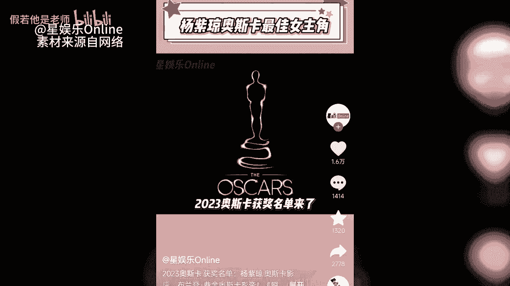
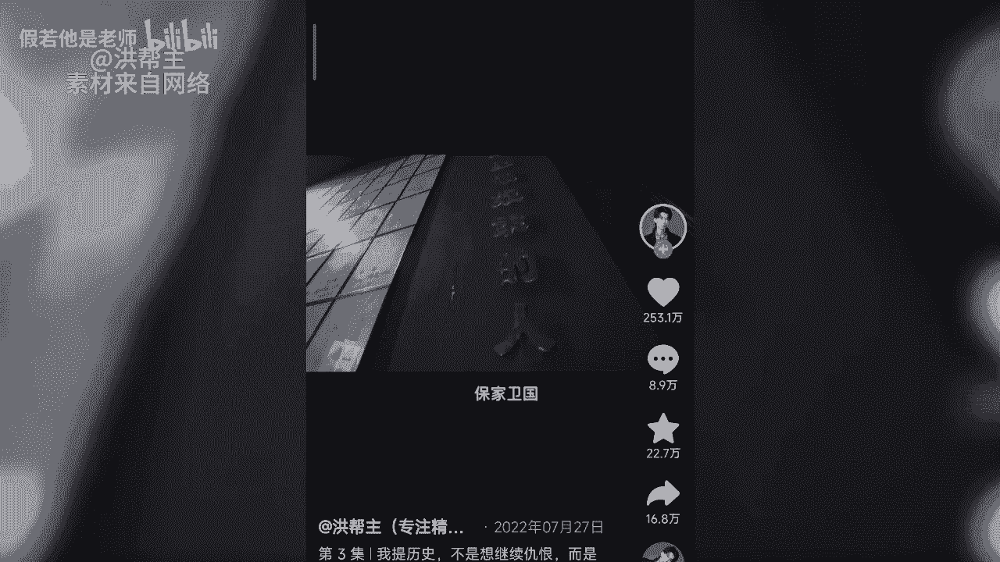

# 短视频起号大法（下） - P1：短视频起号大法（中） - 假若他是老师 - BV1Dw4m1a75j

我们再来看第六式探店式啊，第一招消费餐点，这个不多解释了，很容易理解，以消费者身份进行体验，为网友啊提供有效的信息，毕竟网友最喜欢的其实也就是吃喝玩乐嘛是吧，去各类有特点的饭店，商店，旅店等等进行探查。

既能探秘，又能给网友带来经验，帮助大家进行性价比测试，兼具娱乐性和实用价值，谁能不喜欢呢对吧，精彩的表达和探点的方式，是这个方式核心成功的元素，来看下面的案例，西藏的烤全羊吃到爽是什么体验。

感谢马总招待，咱去随机城市，花100块钱吃随机数量的当地特色美食，咱们今天去的是成熟条馄饨，您好，老板还有馄饨吗，啊你给我来个小碗的这个锅炉饼要甜，再来一甜甜的，不是这六块钱这么多，第二招。

非消费餐店啊，那区别于消费三点啊，这个类型主要针对产品和服务进行点评，不进行这个性价比的鉴别啊，主打推荐也非常具有实用价值，非常被大众所喜爱，来看案例啊，小胖胖还有鱿鱼吗，有要几个诶，就是十五一串。

那我要一串吧，很好吃啊，口感很Q，他撒了这么多料也不会咸，就刚刚好，哈喽我们再看第七式啊，夸张式，那这种旗号方式啊，主打一个夸张，表演性要很强，娱乐性很强，大众我认可度较高。

但是对创作者呀有艺术表演基础的要求啊，第一招道具夸张法啊，这个也顾名思义了啊，主打道具的意想不到极其夸张，以此来吸引眼球，妈妈你睡觉了吗，妈妈我睡不着，妈妈你干啥呀，你妈大半夜不睡觉。

整个电影机你喊啥呀，哈哈哈死了，你在这整点COE，你进去吧，你妈在家喊我一句，你就废了，你等着改呗，哈哈你这个人怎么这样子能起来，我们指点宵夜，Zz，哇哈哈哈哈哈，那第二招呢表演式夸张啊。

看案例大家就一目了然了，如果你有这样的天赋啊，那一定建议你去尝试一下，会非常容易火嗯，闺蜜在某种程度上来说，好嘞，是贵咪不好嘞，是迪米，贵密和低迷就一个字，好嘞，是贵咪不好嘞，是低迷。

什么低迷就是敌人的秘密，就叫低迷，第八式啊，立人设事啊，就是以独有的人物性格设质啊来吸引大家，生活中啊总会碰到一些有趣的人啊，而你恰巧是这类人，那就别错过这种起号大法啊，第一招，普适型人设。

宝妈啊是最常见的人群啊，但是这个宝妈把自己每天看似枯燥的生活，过得趣味十足，这就让网友羡慕了啊，羡慕之余也是非常向往，所以啊非常带流量，让普通的人呢在合理的情况下变得有趣，是这里起号房的重点哈。

五点钟这种天气的觉实在太好睡了，被窝里面好暖和呀，要是没办法要起来给孩子们做早餐吃，这个是小南瓜，给孩子们做那个蛋奶烤南瓜，还泡了一点米，昨天晚上提前泡下去的，用它来做那个牛奶米糕吃。

先把老孙要喝的汤煲下去，这个是乌鸡，给他煲乌鸡汤，第二招奇特性人设，如果你的个性啊与众不同，又不是那么让人厌烦，那就可以把自己独有的生活啊，以及感受分享出来，会有很多共同感受的人来你的账号。

寻找归属感的，也会有好奇的人来看热闹，奇特性人设可遇不可求，这个东西啊得用老大劲儿才能压出来了啊，看大爷这个三头肌啊，干净卫生啊，兄弟们，我们再来看第九式啊，奇观式这类旗号法呀。

普世绝大多数人啊利用不常见的奇观吸引人，需要大脑洞，当然也需要运气了哈，第一招视听奇观法啊，就是使用各种手段来进行奇观效果的呈现，你能脑洞开多大，这有多少流量来收获啊，来看具体案例，dodo也不开。

第二招啊，模仿器官法，说白了其实也是一种模仿秀啊，也就是要靠天赋来打造的类型，来看这个案例，早上好，美丽的嗯，美丽的清晨，把美好的心情送给我们身边每位新老朋友，让我们每一个人能够带着健康快乐。

积极愉悦的生活去投入到每天的工作，第三招观点器官法这类起号法啊比较难适合呀，思路清晰而又博览群书的这种底蕴的人，观点求犯法啊，不是乱说胡说，是要建立在合理基础上的另类思考，能够带给人启发。

易公子就是做最好的案例，我们来看啊，我最近很喜欢一句话叫生于情而不困于情，我觉得这是非常难得的高级境界，就如果能活出那种状态的话，那这个人的生命肯定是很丰盛的，但是好难，因为这句话包含着两个因素。

一个是要敢付出深情，自己敢给，另外一个呢又可以不被情所困，就这两个状态要合二为一太难了，第十是热点，是热点，那是永远的神啊，能蹭热点是最好的发家方法，很多大号啊最开始都是要靠这个方式起家的啊。

这个方式最大的技术点在于，把热点关联到自己的账号领域内，不能单纯的搬运或者断章取义，那都是无效的方法，甚至会引发这个适得其反的恶果哈，被人那个大家反倒是不关注了啊，我们来看啊，第一招直击热点法。

这个最好理解了哈，找到当下最火热的时间或者是话题啊，这针对热点进行描述，评价分析或者解读都可以蹭的好一点的，甚至都能超过原有的热点啊，这种案例也是有的，那第二招间接热点法，这个啊需要一定的功力了哈。

得多动脑筋，这种方法啊，往往需要以热点为背景进行深度分析啊，或者独有观点的发布，用的好的都是高手，流量也是自然是蹭蹭来啊，2023奥斯卡获奖名单来了，关继威凭借瞬息全宇宙获最佳男配角。

杰米李柯蒂斯凭借瞬息全宇宙获最佳女配角，西线无战事获奥斯卡最佳国际影片，最佳导演，关家永，丹尼尔施纳特布兰登费舍凭借鲸获最佳男主角，杨紫琼凭借瞬息全宇宙获得最佳女主角，成为首位奥斯卡亚洲级影后。

2023年至今评分最高的欧美新剧排名前十，严谨点啊，不包括续集，第十名，幸运汉克评分8。0，由风骚律师的男主鲍勃和谋杀的女主，敏锐搭档，出演三流大学的一位愤世嫉俗的系主任，面对各种职场困境和中年危机。

虽然走的是喜剧的风格，但是这玩意儿不能细品细品，我这种大叔就容易代入第11式啊，颜值是现在啊，我们处在一个比以往任何时候都更看脸的时代，是吧，那在短视频领域啊，颜值真的就是法宝，特别抗打啊。

或多或少总能给你带来关注，以貌制胜可以有，但是呢颜值啊并不只是漂亮好看啊，丑也有市场，大众脸，网红脸其实啊都不是真正的颜值是精髓，最重要的这个颜值啊要是要什么呢，要有特点啊。

这就需要啊你精心设计和打造了，我们先来看第一招啊，正向研制法，那主打就是美，让人能够一眼记住啊，瞬间可以征服屏幕，那就OK了啊，毕竟网络呀传闻不假，你这么漂亮，说什么都对，是不是啊，我来看案例啊。

这一刻也终于勇敢说爱你，一开始我只顾着看你，装作不经意，心却飘过去，还窃行，第二招啊，是纯欲风法，这类方法靠的是营造气质，做不到看脸惊为天人，那就可以用颜值搭配气质来让大家喜欢啊，重点是一定是不要违和。

另外啊要做搭配合理啊，咱们来看案例，Come with me，Take your love to your see，第三招啊，反向颜值法，也有很多人呐以丑来树立自己人设的，主打的就是有特点，让人记得住。

来看案例，Don't sleep，第12式啊，过程记录是在短视频平台啊，人们很喜欢看真实有趣的东西，尤其是一些过程精彩的视频，所以美食和手工制作类的，非常充分的利用这点来博取大众的喜欢啊。

当然啦还有很多其他领域的内容，只要符合过程精彩，给人期待，都可以用这个方式，第一招加速过程法，让漫长的过程啊变短，随之啊会产生很多经验的变化，很容易吸引大众啊，来看看例，谁懂啊，包了5000只虾。

就为了做一碗六虾面，耗时12小时，终于吃上啦，太好吃了，第二招啊，间断记录法，有一些过程记录呢并不需要完整，只是间断性的记录也是可以的，这类视频呢大多是前后的变化较大。

巨大的反差呢让人们看到了很喜欢中间过程啊，其实往往是可以省略的，好看案例，If you want my love，You。

Gotta do what it does if you want these sweet like sugar，Guchi lives，You gotta give it up。

I know you think i'm cool，But i am one of the boys，第13式啊，解决痛点是，如果你的短视频呐能够帮助别人解决问题，那怎么能不火呢，解决痛点法。

就是利用了人们啊，对于棘手问题需要解决的心理啊，你的问题我帮你解决，自然就会受大家关注，来看案例啊，披下来显脸大，扎上去呢又显老，像咱们这种圆脸女生和扎什么发型都能胖十斤，今天教你一招圆脸快速变鹅蛋。

首先如何分辨自己是不是圆脸呢，咱们拿出一把尺子，来测量一下脸部的长度和宽度，如果接近一比一，欢迎姐妹加入我们的脸包头圆脸大军，那其实成本最低，能去修饰圆脸的方法，那就是搞发型，像我是圆了20多年。

尝试了各种风格，真正自然不踩雷的还得是高颅顶，柔顺有层次的黑长直，第14式，情感是能让大家产生共鸣，共情共爱的任何作品啊，都是受人关注的情感式啊，就是能够通过事件或者观点，来引发大家的情感参与。

进而产生感慨，畅想回忆等等这些情绪的方式啊，实话说啊，这样的方式看着容易，其实啊并不好做，透过生活中的点滴凝萃出动人的情感，需要一定的天赋和阅历，情感式啊一般是分为两招的啊，人物情感法和事件情感法。

我们看第一招啊，人物情感法，利用这人物的个人经历或者感悟来吸引人群啊，进而产生互动，带来流量，这里面啊包含着人和人的情感，以及人和动物的情感，来看案例，后来遇见他陪我春秋冬夏愈合，我的伤疤打开。

我会一直幸福吧，你身边的她，自从阿八认为自己是孩子的爸爸后，他就天天跑来看小奶猫，爸爸马上来救你啊，好像也没啥事啊，你进去吧，第二招啊，事件情感法啊，通过一些具体的事件啊，来让人们产生共鸣，共情。

看具体案例过的地方，熟悉曾经的模样，我以为，老大娘的小日本，感受你侧脸恋爱，享受几天安静的看的夜保家卫国。

第15式参与式，这种方式的旗号特点呢，就是能让观众啊具有强烈的参与感，也就是虽然只是看，但是却仿佛就在现场参与，具有很强的娱乐性和参与感，先来看第一招，游戏参与性啊，来看具体案例啊啊happy to。

Dance it is true，Oh no，Oh no，第二招是故事参与性，通过剧本啊和拍摄的手法设计啊，让观众具有身临其境之感，来看案例，20号至22号又将有冷空气影响到锅，诶老公咱俩吃火锅去吧。

这会正堵着呢，去哪吃啊，这家这家据说特别好吃，你看40多公里就为了吃顿火锅啊，正堵着呢，当你遇到一个扫兴的另一半会是什么样的感受，还有第三招就是动作参与型，那健身操，体育锻炼等等啊。

这一类都是非常受大家欢迎的类型，如果你有类似的技能，你可以考虑这个方法啊，火遍全网的刘畊宏啊，就是这里起号方法最典型的代表，go节奏哦耶先找回一种以前舞蹈的感觉，节奏感觉一下，跟着我们一起来。

刚进来的是关注，在看的，帮我们按赞一起动起来，再一次脚再踩一遍，对那我们再来看第16式剪辑式，这类方式啊以剪辑为主导，通过呀对视频的混剪，二次剪辑，片段剪辑，特效处理等等方法进行艺术加工。

能够啊产生夺人眼球的效应，也非常吸引人哈，而且制作成本不高，单人就可以完成，来看具体案例，我更想指挥更具战斗力的格局，我不想再让我们的爹呀娘了，孩子们哭，鲁迅艺术学院，是的嘞。

我们想聘请您给我们当音乐系的教授，也许一咻咻也咻一咻，Sing a song，开心开始sh上上最后一式啊，就是第17式，电商式，顾名思义了哈，这个就是电商带货最直接的模式了，主打一个简单直接越快。

让人上头越好哈，我们来看具体的类型啊，第一招求助型，利用了人们的恻隐之心来谋求流量和销量，看案例，因为这个菜卖卖不出去，然后大面积种植，没有客商来收，所以说我们采收了没有办法的办法，直接把他给毁掉了。

第二招产地型，利用自己的货源，产地的优势进行宣传，主打正宗和价格优势，好看案例，不要问我这个是什么水果，告诉你们啊，你们也没吃过每一个呀，果肉都是金黄金黄的汁水啊，特别的多，关键咱们卖的也便宜。

20几块，我就给你发一箱，第三招呢是同情型，这种类型啊一般都是残障人士啊，和一些特别的人啊，常用的方法啊，主要是利用人们的同情心，第四招啊，对比性，货比三家，有了比较就有了优势。

主打自己产品的特点和强项啊，我来看案例，非常恶心的一件事儿，接近5万的姐妹，反映在各大上百万人的直播间里，买到了疑似假牛排，今天我把名气大，销量高，评分还贼高的四款牛排拿了过来，咱们一起戒指真假。

顺便教你们牛排应该怎么选，第五招揭秘型，那这个方式啊既有悬疑感，又能让大众产生了解产品的生产过程，以便呢表现自己的产品力啊，是一种很不错的方式，看案例，奇葩水果系列回归啦，第一个试一下黄金果耶。

改这种名字，黄金果吃了黄金万两，对不对，切开它的肉好像果冻哦，有点半透明的，怎么样，哇香哦，真的好香哦，它有股花香，而且吃起来真的有点那个冰糖燕窝的味道诶，而且它不会太齁甜，它就是有点甜丝丝的那个味道。

果糖来的，你吃一口，它前调是花香，中调是冰糖燕窝，它的后调是冬瓜糖，第六招劝告行，这个啊利用人们的反向心理，你越说不好，我越想看看到底哪儿不好，往往啊都是想看热闹的，吃瓜群众反而都被套路了。

好看案例不要买不要买不要买，谁敢买胃就做好图形哈，第一就是这个妆效能力好，控油能力强的KO粉饼，这种口碑好都在夸的东西，更别买了，古人云，谦虚使人进步，骄傲使人落后，一直沉浸在赞美声中。

根本不利于一个品牌的发展，嗯立马隐形毛孔不说还能定妆，很长一段时间人家童装我不脱妆，我就会暗自窃喜，偷偷相望，骄傲神落后，第七招福利型，这个类型其实是最好用的，主打就是价格便宜，给你好处。

很多带货的大博主其实都是这个套路啊，只要便宜就总会有人感兴趣，其实啊起号的方法呀肯定不止这17式啊，随着时代的发展，总会不断涌现出新的方式和思路，方法好学用好难，所以啊。

大家一定要根据自己的自身特点来进行，旗号的方案设计，切记啊生搬硬套啊，不要多种方法的这种堆砌啊，那是没有价值的啊，而且和他互相有冲突啊，新手啊最好一样一样的去学习并尝试，未来呢想有更大的发展。

那记住了啊，一定要靠自己不断的创新与实践，好到这里啊，课程就结束了，祝大家呀都能尽情发挥自己的才华。