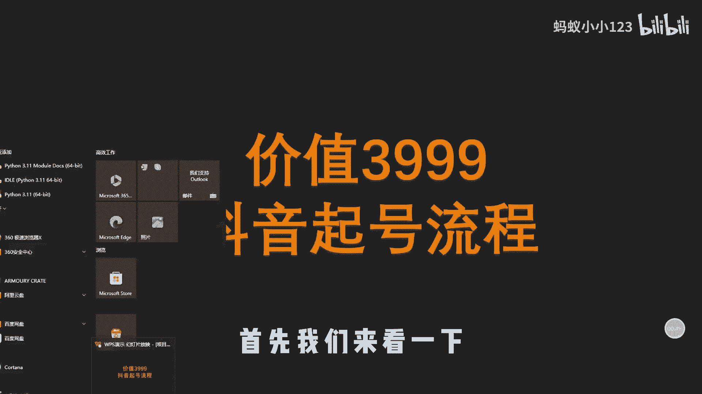
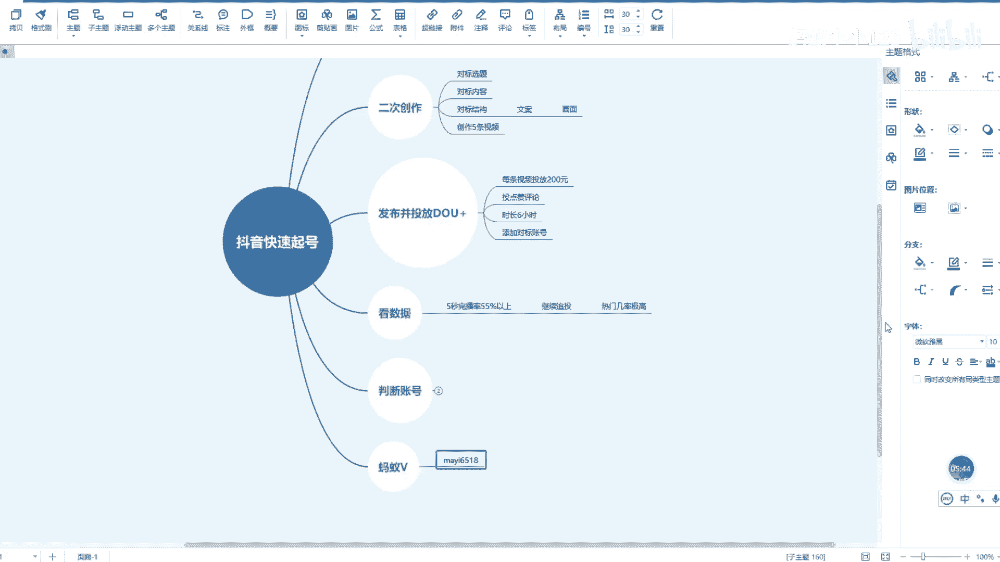

# 短视频运营：现在做抖音晚了吗？新的靠谱抖音起号流程！ - P1 - 蚂蚁小小123 - BV1bn4y197Qj

大家好，我是蚂蚁，现在做抖音还有机会吗，很多朋友问这个问题啊，其实我是把抖音当做一个获客工具来看待的，你任何时候做都不晚，但是如果说你像之前那样爆发式的增长，爆发式的获客，爆发式的带货。

那么那种机会已经没有了，但现在上车呢依然是不晚的，今天在这里呢，给大家分享一个十分厉害的起号方法，这个方法呢是我花3999获得的抖音，一个最新的旗号流程，任何人呢你根据这个流程进行起号。

那么你出爆款的几率是非常高的，这个流程呢特别的重要，大家呢一定要学会，在这里呢给大家做一个简单的讲解，首先我们来看一下做抖音起号的时候呢。

我们第一步要做的是什么呢，最重要的就是要判断你的账号，看看你的账号啊是不是一个正常的账号，怎么判断呢，两点第一打开安全中心检测，看看有没有违规，有没有限制，没有限制的话，就看一下我们作品的播放量。

大家选择进五条作品的播放量就可以了，把近五条作品的播放量加起来，如果它的播放量是小于1000的，那么我建议大家这个时候直接换号就可以了，直接换号就可以了，检测我们的账号没有问题，之后呢。

我们就要走第一步，就是寻找对标，不管你是做什么样的内容，什么样的方向，必须寻找对标账号，怎么寻找呢，寻找哪些账号作为我们的对标呢，我们来看一下，我们一定要寻找涨粉快的，然后粉丝量不是特别高的一个原则啊。

就是低粉爆款，这样的账号呢我们模仿他成功率会更高，如果说你模仿百万大V的话，那么他有基础的粉丝，而且基础粉丝量很高，他的数据呢不一定啊，能够反馈你作品的数据对吧，所以说呢我们就要找这个低粉爆款的建议。

找粉丝量在一到5万之间的，然后呢他近期涨粉非常快的账号，我们总结为低粉爆款，建议寻找5~10个对标，5~10个对标账号，找到我们的对标账号之后呢，我们就要对他们的内容进行二次创作，看看他们的爆款作品。

我们是不是能够模仿对吧，首先对标他们的选题，看看他们的低粉爆款是哪个选题火了，我们对标一下他的选题，它的内容啊，我们也对标一下，对他们的内容呢加入自己的观点，进行二次的创作，然后对标结构。

这个是非常重要的，你如果说只仅仅对标它的选题的话，那么你根据他的选题再创作一条新的视频，你的视频不一定能火，牛逼的对标人物呢都是对标它的画面，然后画面对应的文案也对标，基本上做到一比一的对标。

这样我们的成功率是非常高的，建议呢从这三个方向呢进行对标对标，这三个方向呢创造出五条作品，创造出属于我们的五条原创作品，创作好作品之后就要发布并投放抖加了，一定要舍得投放抖加，现在这个时代。

如果说你不舍得投放抖加，你不想花钱去起号，那么可以说是失败率是99%的，你只有1%的成功率很低的，现在可以理解成为啊必须花钱，因为平台不缺内容了，一定要花钱，起号斗家到底怎么投呢，看一下啊。

首先我们创作的五条作品，每条视频投放200元，不管他是什么情况，先投放200元，投放200元之后呢，这200元怎么投放啊，投放点赞，然后评论，然后时长的选择六个小时，最后重要的一点呢就是添加对标账号。

把我们五个对标账号，十个对标账号添加进去啊，添加我们的对标账号，也就是说啊，能够让系统呢更好的识别我们内容的潜在用户，最后一步发布完了，斗家也投放完了，我们就要看数据了，如果说我们的作品五秒完。

播率在55%以上的，这200元消耗完了，那么继续追投，这个时候呢你上几10万甚至几百万，热门的几率是非常高的，那么以上呢就是整个的抖音快速起号的流程，其实也非常简单了，我认为更多的精力呢。

大家一定要花在寻找对标账号上，再一个呢就是说作品的创作也是非常重要的，你对标呢一定要一比一的去对标，它的画面对应什么样的文案，咱的画面就对应什么样的文案，那么这样对标呢我们的爆款几率是非常高的。

整个流程呢非常的简单，但是做起来呢依然需要大家认真的去做，你做起来的过程中呢，也可能会遇见很多问题，如果说有问题的话，欢迎我们交流学习啊，那么我是蚂蚁啊，如果说你想要啊一套完整的旗号流程。

以及在这里面有不明白的点，可以找我领一份关于抖音运营的资料啊，这是我的微信啊，蚂蚁6518。

