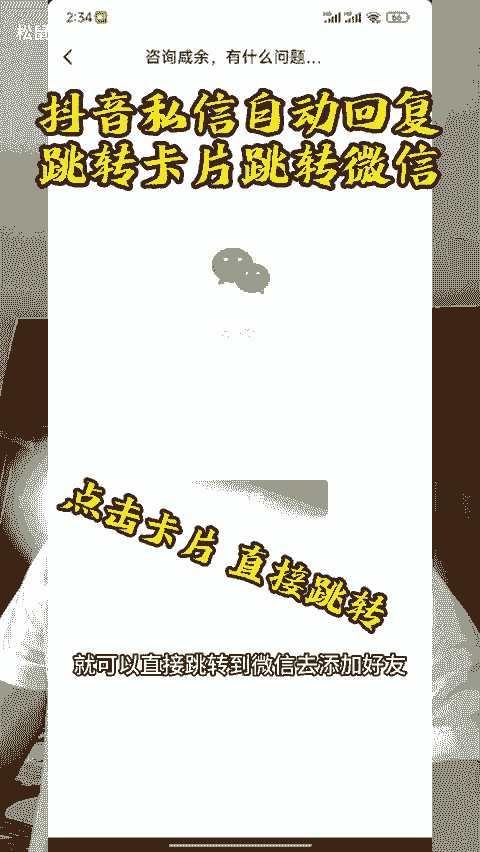
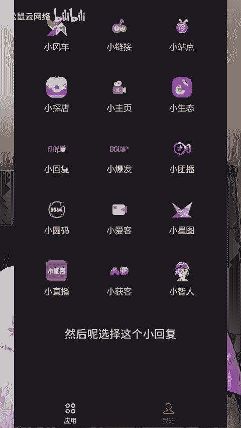
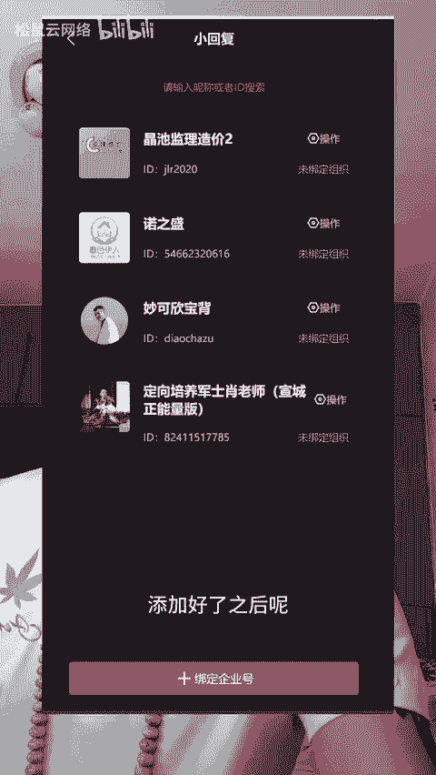
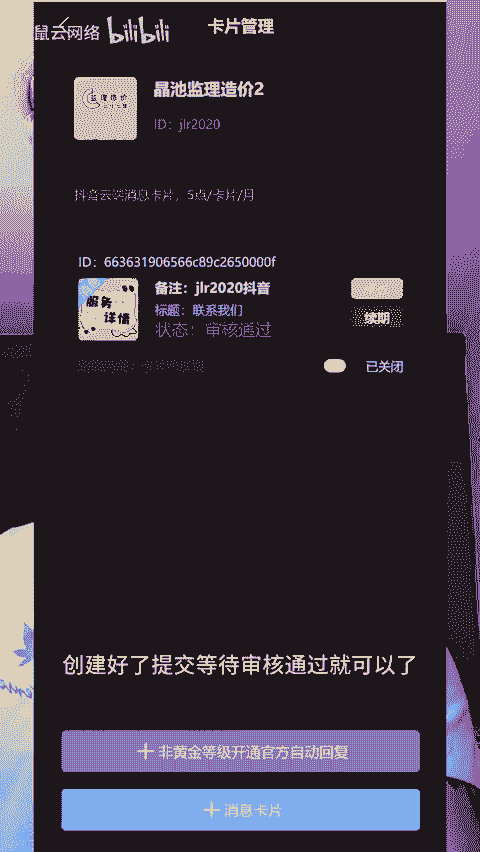

# 私信卡片最新技术可以实现跳转微信详细教程分享 - P1 - 松鼠云网络 - BV1VqYQeLEoX

大家有没有见过这种功能，进入私信系统就会自动的发送一个引导欢迎语和一个消息卡片，点击小卡片就可以直接跳转到微信去添加好友，这样的功能具体是怎么操作的呢？这期视频啊就给大家来详细的讲解一下。

具体怎么配置这样的私信自动回复卡片，以及配置这样的卡片需要什么样的资质。

首先呢需要咱们的抖音号是抖音的企业栏V号，或者说是抖音的普通企业号都可以。个人号的话呢也是可以搭建的，但是啊不是很建议，因为个人号搭建好，用起来呢没有企业号搭建的更好用。

第二步就是需要用到咱们的获客平台。咱们的获客平台的话呢对接的就是抖音企业号的私信自动回复的一个功能。首先呢这个功能是官方的，所以说大家用这个功能的话呀，是非常的安全的。

接下来我教大家怎么来配置咱们的这个私信自动回复的卡片。首先呢进入到咱们的后台。然后呢选择这个小回复，然后点击最下面的绑定企业号，咱们来添加要搭建自动回复卡片的这个抖音号，添加好了之后呢。

咱们点击账号后面有一个操作，点进来咱们呢创建这个跳转卡片，创建好了提交等待审核通过就可以了。

如果说你也想实现这种自动回复引流的效果呢，我们是可以分分钟帮你搞定的。