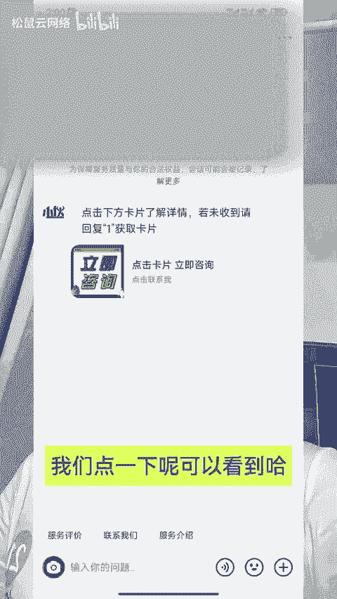
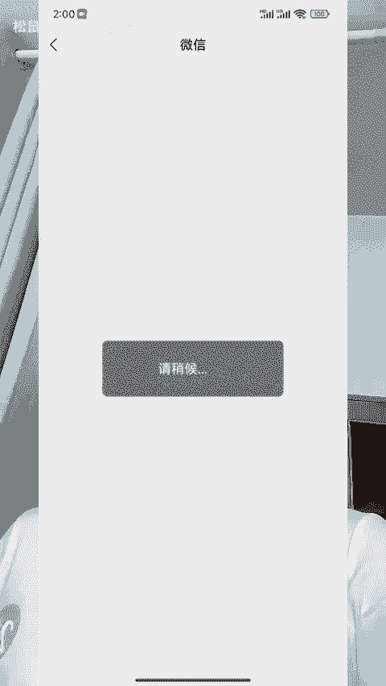
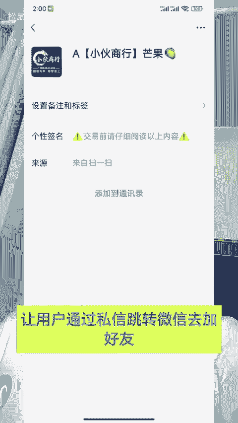

# 私信自动回复卡片如何实现跳转第三方 - P1 - 松鼠云网络 - BV1UJ4m1T7Bo

抖音私信小卡片跳转微信是怎么做出来的？今天呢手把手啊跟大家出一个教学，你也可以做一个你的跳转卡片。就像这种哈，我们点击这个私信进来呢，会自动出来一个引导的文案跟一个小卡片。

那么像这种带有文字带有头像的呢，它叫做消息卡片，我们点一下呢可以看到哈直接快速跳转到微信去添加好友。那么说白了哈我们就是通过这个卡片呢，让用户通过私信跳转微信去加好友引流私域用的。

那么今天呢我就手把手呢跟大家出一个教学。你怕记不住的呢，先保存起来，回头啊多看几遍。首先的话呢，通过抖音呢去登录这个企业服务中心。你的这个抖音呢需要是一个蓝微或者是一个半蓝微才能够搭建。然后呢。

咱们在企业服务中心呢往下滑，找到这个自动化设置。这个里面呢有一个自动回复。然后呢把自动回复的这个开。

关呢咱们呢给它打开。那么下方呢这里啊有一个欢迎语，根据咱们自己的行业呢，我们去设置一个引导的欢迎语。然后附加内容这里呢咱们选择消息卡片，把咱们跳入微信小程序的这个外链呢，咱们给它植入进去。

然后呢再通过这个聚量引擎，还有这个橙子建站呢，咱们去创建一个跳转的落地页，给它放到这个卡片里面。然后下方点击保存就行了。这样呢，当用户进到咱们的这个私信之后呢，就会自动的发送一个引导的文案。

以及一个消息卡片了。那么用户点击这个卡片呢，就可以直接跳转到微信了。像我们的话呢已经帮助很多的人呢配置好了这个自动回复卡片功能了。那么还有不懂的呢，分分钟可以帮你搞定哈。

