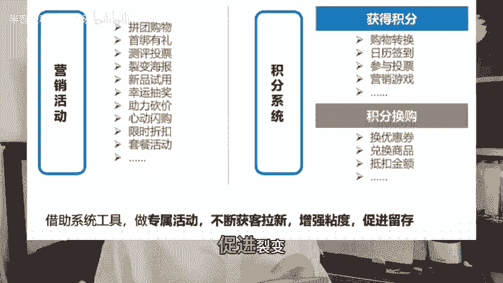

# 私域代运营公司报价50万+私域年度落地方案都这么写！ - P1 - 半窗是私域运营呀 - BV18js7epERu

大家好，我是玉班冲，一个从业7年的互联网私域运营。今天跟大家分享一下一个私域负责人入职一家新公司，如何从0到1去帮这家企业搭建私域落地的年度方案。因为我们自己是开私域营销公司的。很多时候很多的品牌方。

他们会找我们来搭建这种私域的年度落地方案。但是有的企业会直接招私域操盘手进他们的企业从0到1去帮他们搭建这些私域落地的年度方案。其实整个的流程和步骤是一样的。正常来说，我们私域落地的年度方案是分6股。

第一部分是私域目标。这块，我们一般会跟品牌方的老板直接去沟通，他们当年私域这块大概要完成多少的一个GMV。第二部分就是目标的拆解。拿一个案例来讲，因为我们自己是开乙方公司的。

没有办法拿我们的甲方案例来讲，但是我这边有一个知识星球，现在有1400多个人。有很多的运营同行在这边贡献的私域落地的方案。所以我拿一个同行贡献的案例来做讲解。这是一个保健品私域方案的。

案例这份报告我看了一下，还是比较完整的。所以我们直接拿其中的私域目标拆解这块来看。比如说他们当年定的年度私域这块的销售额是700万。复购率是20%，客单价是206%，属于一个中客单价的一个保健品。

就像这个方案来说，1月份到4月份其实属于一个从公寓引流到私域的一个步骤，所以是没有定任何的一个销售指标的。从第5个月开始才会计划产生私域这块的一个营业额。私域这边的目标的转化是逐渐递增的。

比如说第五个月转化率，我们计划做到1%。第六个月做到1。7%。第7个月做到1。5%，第八个月做到1。5%。第九个月做到。

2。4，第10个月做到1。5，第11个月做到3。4，第12个月做到2。9。其实看到这个转化率，大家仔细看的话，会发现有高有低高的其实是6月份、9月份、11月、12月。

为什么这几个月的数据会高于平时的数据呢？6月份有6189月份有大促，双十一双十2这几个。电商大节一般数据会优于普通的月份。所以我们在写私域方案的时候，这几个月我们定的指标也会高于其他几个月。

同时我们也会考虑到就是私域这块用户增长了以后会有一些复购。这个复购率，我们会根据行业内的数据来进行内推。一般如果比较好的情况下，复购率可以做到10%到30%左右。但是也有一些品的话呢。

它的复购率能做到50%以上。这个是根据品牌方它的产品属性以及它的用户画像来决定的。所以每家的情况不一样，它的这块的转化率也是不太一样的。第一步跟品牌方的老板确定完思域这边的目标以后。

第二部分就是刚刚进行目标的拆解。在确定前两步以后，第三部分就是策略方案的一些手段，比如说从天猫京东抖音快手小红书这些平台导流到企业微信引导首次成交。所以第一部分我们可能会考虑怎么导流。

一般引流的方法有很。多比如说。电话号码直接导入。第二个是。跟其他的做联合营销，还有做一些裂变活动，朋友圈推广，包括就是开一些广电通，还有官方的一些新媒体账号导流到私域。

因为现在各平台对于数据资产的把控还是比较严的。在导流这块有诸多的一些限制。所以一般我们在这一块做的时候，会借助一些sars工具和SMM工具，会同步各平台的一些订单和账号，那我自己也创业三年多了。

起初是因为我们建了运营行业的交流群，现在有4000多个运营同行，在我的付费社群里面。基于我们很多品牌方的私域运营，在群里面他们需要采购一些私域S3M工具和ss工具。

所以我们跟国内的20多家私域的sars公司和S3M公司达成了战略合作和渠道代理的一些协议。然后我们的很多的运营同行，他们在采购S3工具的时候，也会找到我们去做定向化的一些推荐。

我们现在合作的这20多家S3M公司。我们发现其实每家它事业有装攻。它产品的侧重点。不太一样的。比如说有的家他需要的是侧重会员体系这一块，有的可能会更侧重裂变这一块，有的可能更侧重于渠道红马这一块。

所以我们现在很多社群的小伙伴，他们找我们来采购一些S3M工具的时候，他们更看重这个S3M工具符不符合他们品牌方的一些需求。在运营的工作中，其实不能说哪家最好只能说这个工具适不适合自己企业的一些需求。

比如说通过各个平台导流到企微社群再到小程序市频号，在进行会员的一些管理，他的CE的用户规模，只要上万人呢，一般是需要借助S3M工具进行会员管理的。这个其实在我们C运营的管理中是非常常见的。

我们会把大客户筛选出来。举个例子，就比如说常规的宝格丽迪奥这些答谢晚宴，他去的一些客户都是他的大客户。这些大客户怎么筛选出来，就是通过整个的会。的后台能筛选出他的大客。

就是消费金额很高的用户进行定向化的管理。比如说配备专属的客户经理进行回复信息。品牌方有一些大德周年庆呀，还有一些答谢宴，都会邀请这些大客去线下去参加这种活动。一个呢是跟自己的大客建立用户联系。

还有给用户拍很多美美的照片，让用户可以发朋友圈。这种活动其实是为了让用户心甘情愿的去做分享。那我们在做这一块的会员运营的时候，我们作为一个运营负责人，我们要做到的是充分的去满足用户的虚用心。

让他感觉到参加这个活动非常有逼格。还有一些专属的仪式感。所以在确定私域目标进行目标拆解，有各种私域的营销策略以后，第四部分就是流程和架构。流程架构这一块一般是阶段性的。

比如说分前端获客中间管理和后端运营，前端货客就是怎么把用户弄到私域这块来中间管理这块，我们一般会借助各种S项工具和s工具来进行管理。比如说用户的信息自动采集自动打标签，分析用户的订单。

商品的推荐和用户联系。还有一些自动化的流程管理。那后端的运营的话，主要是授群的管理。常用的话术，还有一些SOP素材的收集和发布，这是整个的流程框架。第五部分我们就是分阶段走。我们以这个案例来说。

它第一部分是建立完善健全的用户体制。第二部分呢是渠道获客和拉群邀请。第三部分是关怀和建立信任进行场景化的运营筛选达人促进裂变。这个完成以后，我们就到了第六步，建立整个私域的SOP的一个流程和方案。

我们做的各种活动，其实是为了测试一套属于这个企业的标准化的流程，俗称SOP目前我们在出一个私域的营销方案，报价不会低于50万。一般的项目周期，我们会制定在6个月到一年。今天主要是跟大家分享。

我们作为一个第三方的私域营销公司，或者是一个品牌方的私域负责人，进这家企业以后，怎么0到一的去搭建这家企业的私域0到一的年度落地方案。今天分享的这个方案，也不是我们自己家的案例。

因为我们做了一个资识薪酬，把行业。

里面比较优质的落地方案，全部汇集到我们的知识星球了。今天的这个方案是我在运营f知识星球里面找的一个我觉得还不错的保健品的适应落地方案作为分享案例的。

目前我们运营f的知识星球收集了上千份的私域营销落地的一些方案。后续我也会持续的更新一些我们觉得比较优质的私域落地的方案。行吧，今天的分享呢就到这里了。如果你觉得我分享，对你有帮助的话。

欢迎点赞、收藏加关注，明天见哦。