# 私域引流打法与套路 - P1 - 私域高小飘ufan68 - BV1Db421n72d

🎼朋友圈天天发广告，天天私聊群发消息，这个是1。0的私域玩法。在2020年之前，这样的玩法其实还比较有效。因为那个时候客户的私域里面并没有加多少的商家，他会好奇他会点开去看你发的什么东西。

但是啊你现在这么搞，客户第二天就可能把你删掉。私域的本质是关系的建立。什么最容易建立关系啊，先在私域中打造出你的IP人设，去输出你的观点，输出你有温度的生活。这个时候你的内容才会有别人愿意去看。

才会有曝光，而有了曝光才会有互动，才能够去建立信任。朋友圈里面最高级的玩法是卖三观，卖你的人生观、价值观和世界观。那些会用朋友圈卖货的人啊，一半内容卖货，一半内容在卖自己的三观。

其实最厉害的朋友圈是看不到卖货的痕迹的，不断的输出自己对各个事物的认知看法和观点，说出你对这个世界的观点。因为你天天卖东西，别人可能会讨厌你。但是你输出观。

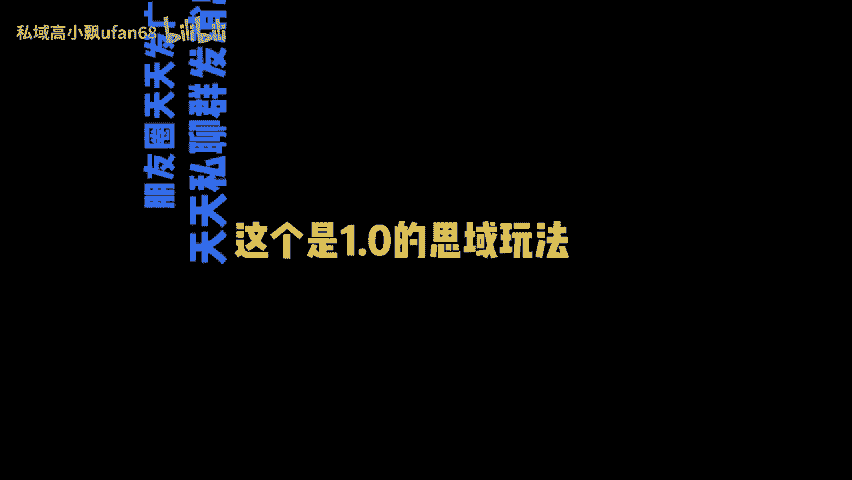

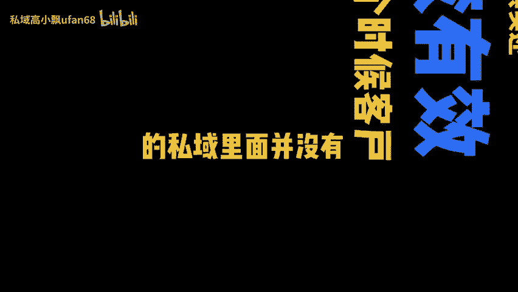

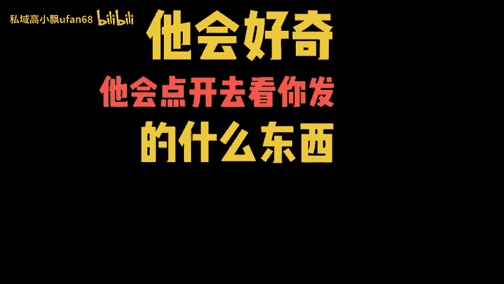

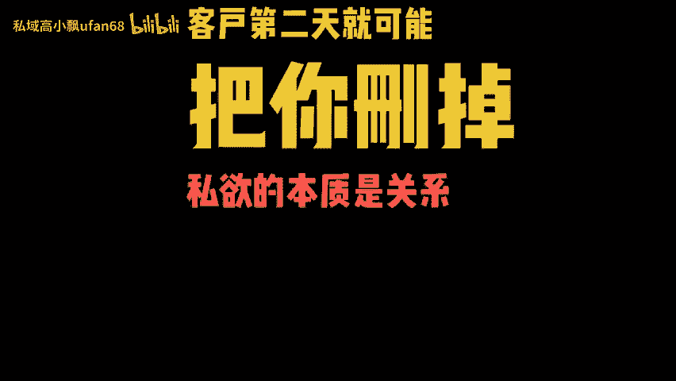

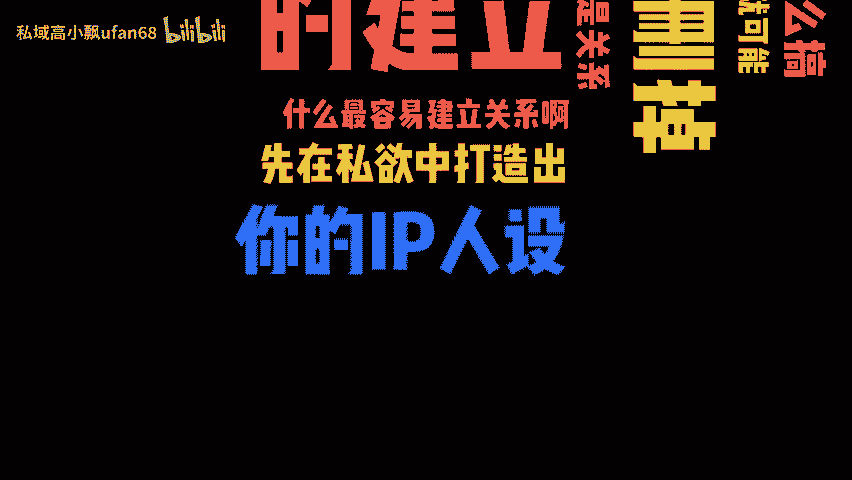

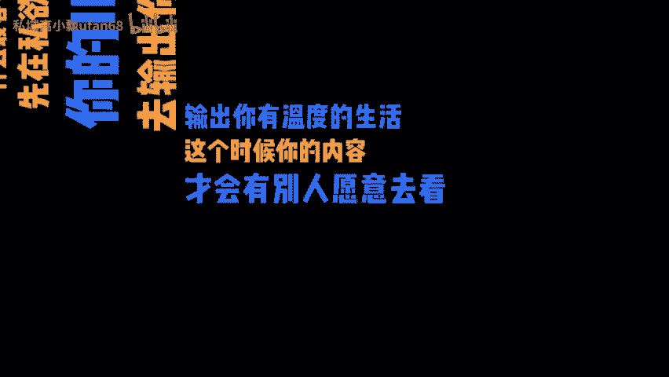

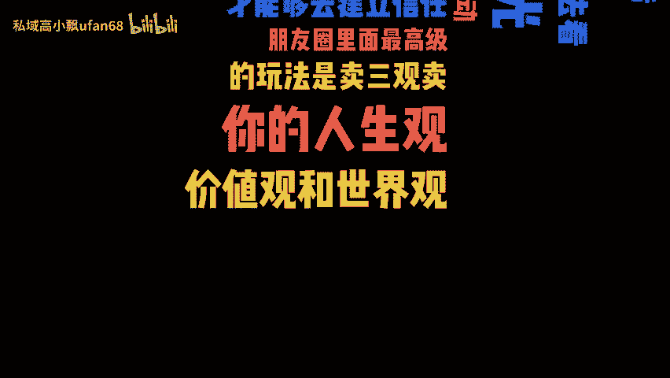

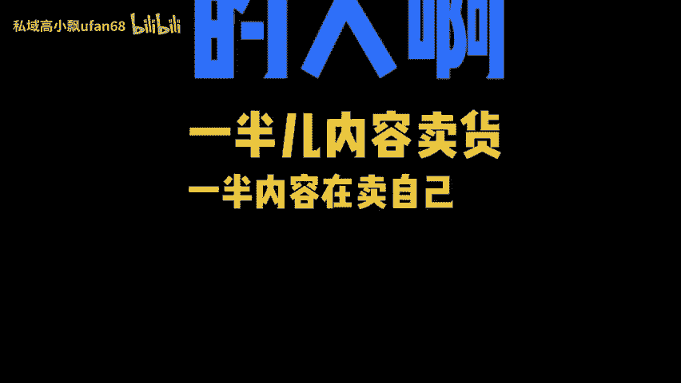

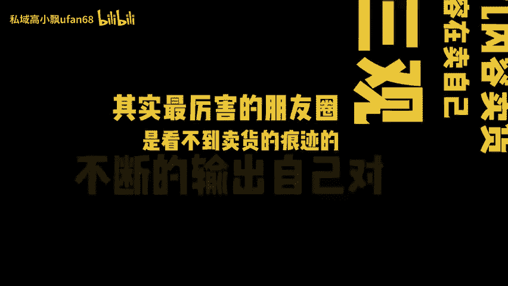

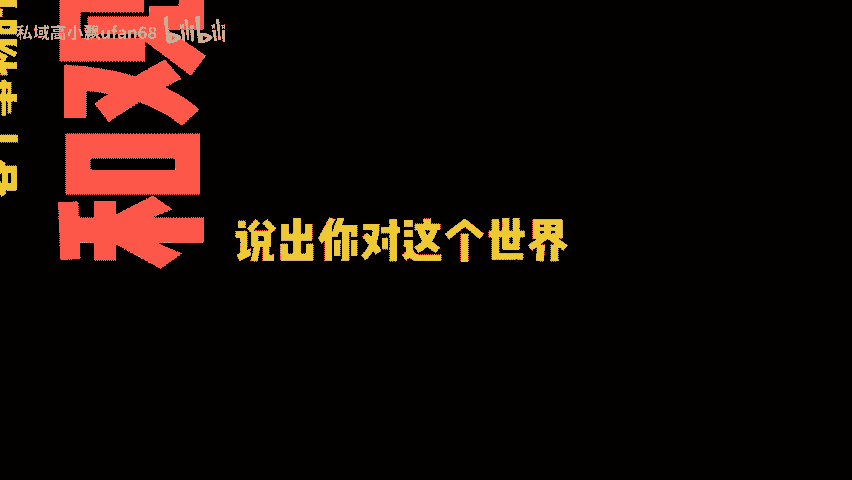

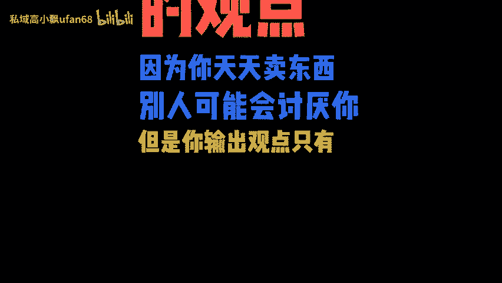

🎼只有两个结果，他要么认可你，要么不认可你，对不对？而认可你观点的人，他被你成交其实只是时间的问题。成交的前提是相信，而相信的前提是认可。所以思域的2。0啊是通过树立人设和客户去建立关系。

让他认可你的观点和你产生互动。这时候你发的消息，你发的内容，他就会去看他也会去给你回复。这一整套的打法啊，本质是在建立起一套自己的私域内容体系。而这个体系是完全可以去学习和模仿来建立的。

你们一定要关注我啊，我会分享更多的公寓搞流量。私域卖高价的各种干货技巧，帮你少走很多弯路，少吃。😡。

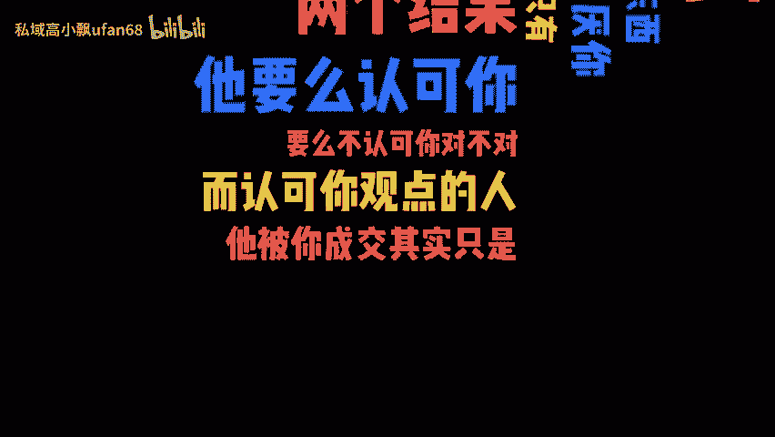

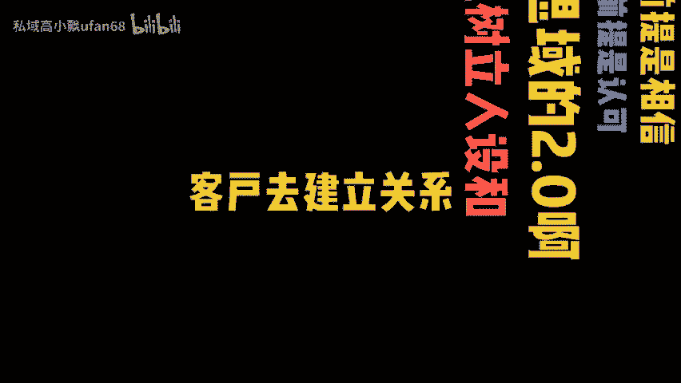

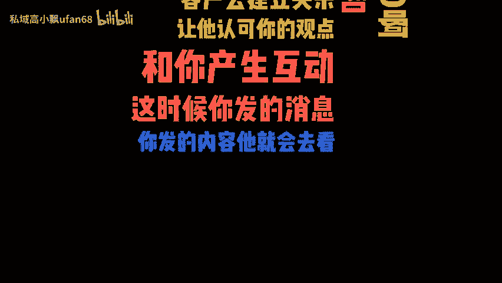

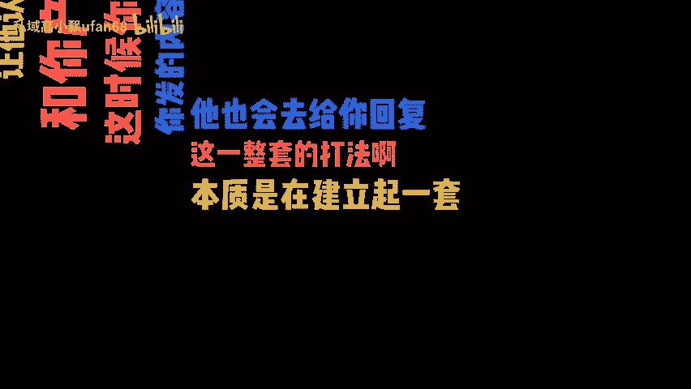

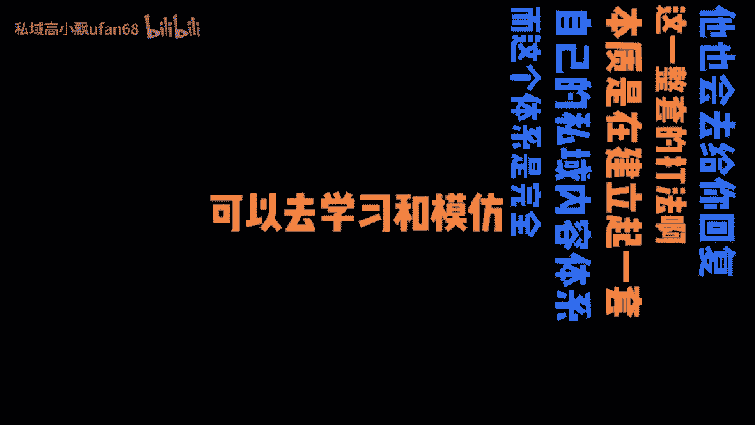

