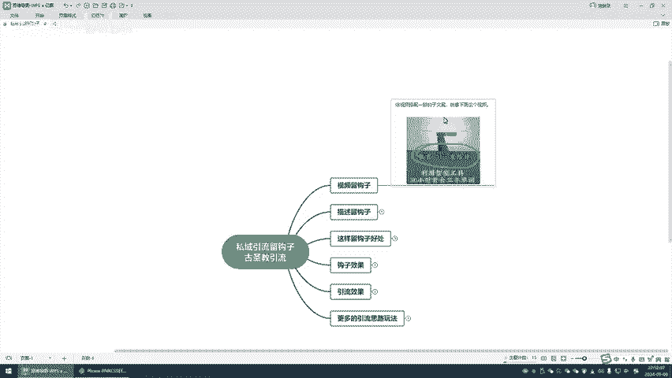
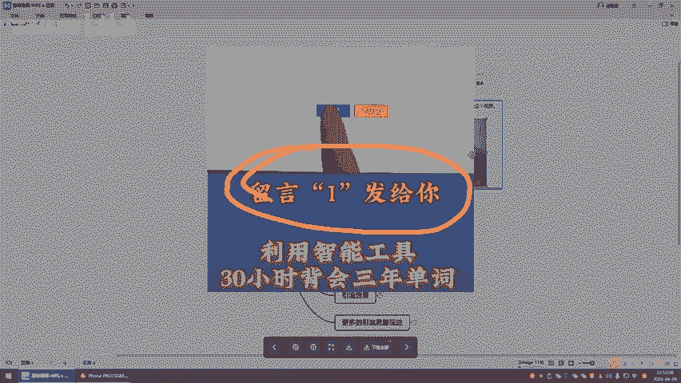
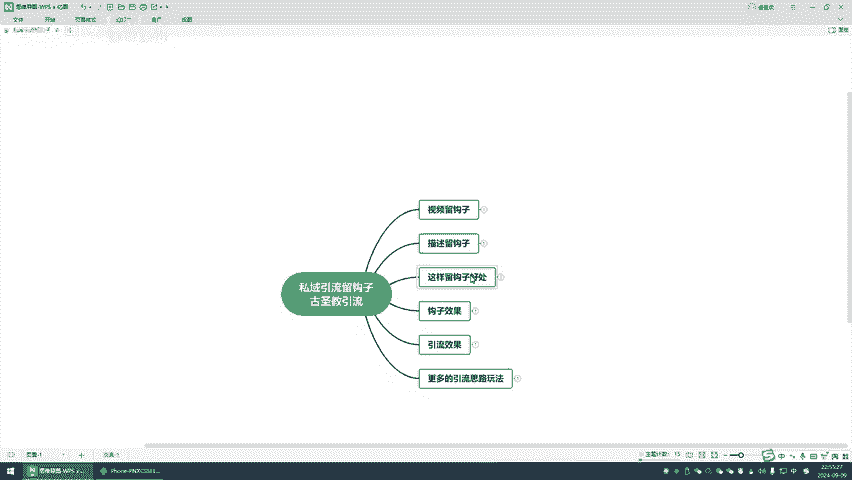
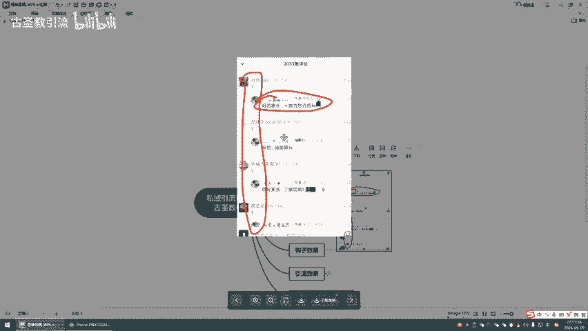
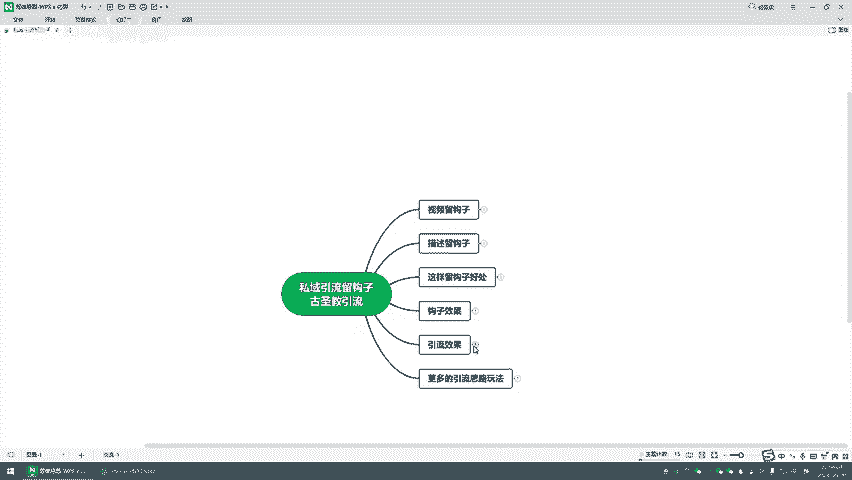
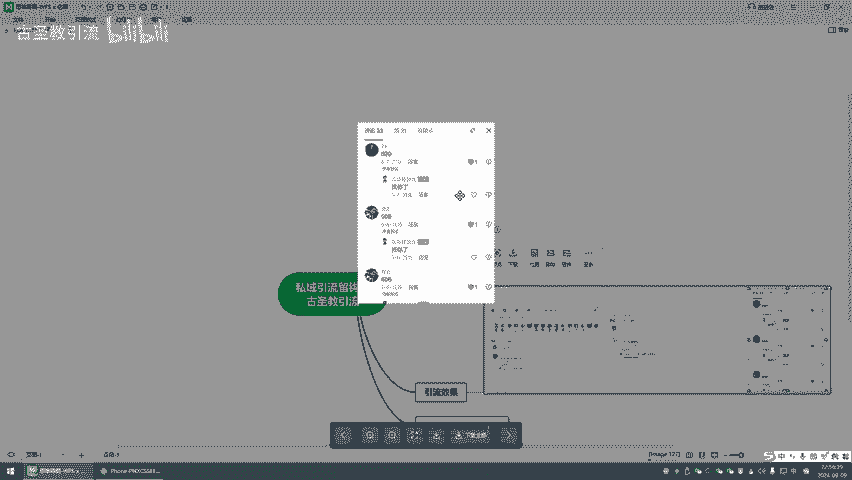
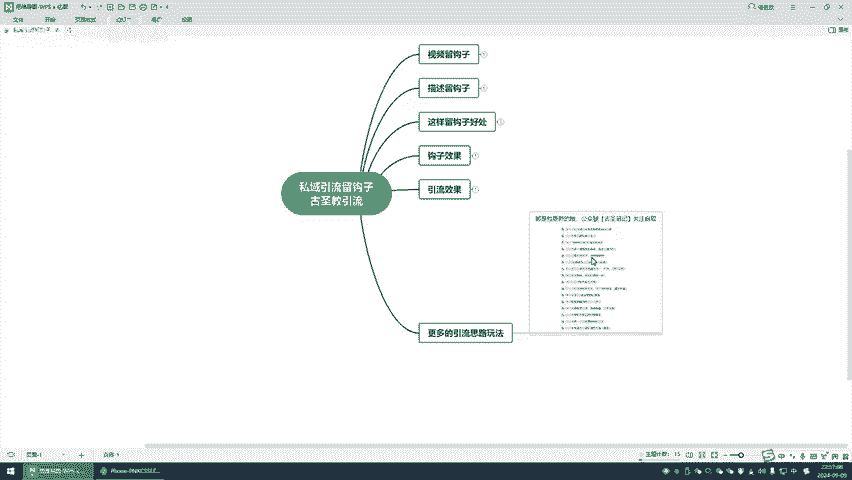
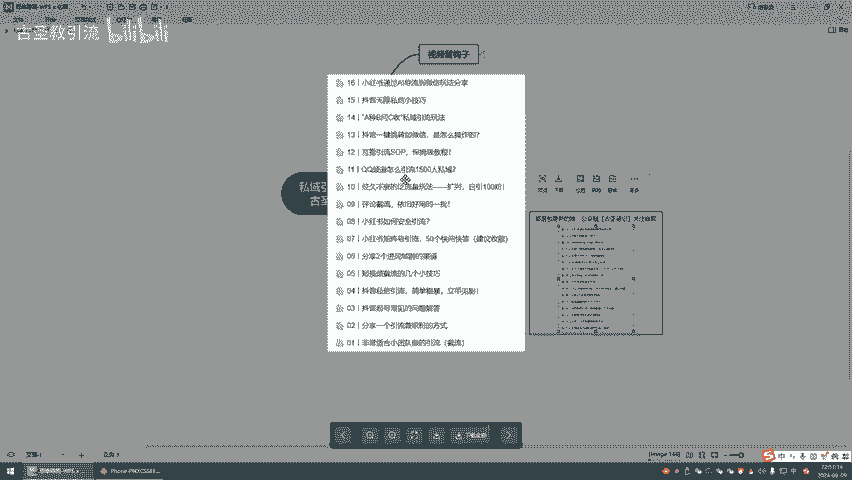

# 私域怎么留钩子引流，最新技术教学分享给大家，教大家私域怎么做好引流。 - P1 - 古圣教引流 - BV1iRpneKEKY

大家好，我是古胜啊，今天我给大家分享一个私域引流流钩子的一个方法啊。嗯，这个视频呢几分钟大家一定要认真的听完啊，都是干货啊。虽然这咱做的一些东西啊，你一定要认真听完，都是干货。

最后呢还给大家啊留下一些呃小彩蛋啊。然后呢，我们先给大家看一下啊，这是我投屏的啊，手机投屏的。我最近的啊，今天就目前啊嗯9月9日啊，晚上这加好友的，还有一些没有同意的，因为投屏啊只能投一个。

咱给大家先看一下啊，这是我目前基本上我们做的是抖音啊，还有某手的啊，还有B站的这种平台的啊引流的啊，陆陆续续过来的一些用户啊，可以看给大家看一下啊，呃都是过来去学的啊。

这是一直到这里都是这是还没有同意的，基本上每天引个啊几十个流量啊，这种就是这几个平台啊，然后我们呃非常稳的这个啊主要就是做流量这一块的。然后所以说我们研究了很多啊。

各个平台怎么去引流的留钩子了这些玩法啊啊，然后我先给大家来说一下啊，我们两个呃这个整个视频的我们的一个流程思路啊，嗯会给大家讲两个留钩子的方法，一个是通过视频啊，一个通过描述。当然留钩子去引流的话呢啊。

我们是适合呃多个平台的啊都是可以的。包括我们为什么要通过流钩子去导流啊，它的一个好处啊，然后包括我们留钩子的一个效果的一个展示，包括自己引流的一个效果展示啊，最后呢给大家啊，带上一个彩蛋啊。

留我们自己的这些啊整理出来的一些SOP的一个玩法啊，都会分享给大家啊，首先呢我们来先说一下啊，视频留钩子啊，视频留钩子。第一个啊，这个就是说啊你在发视频，无论哪个平台都是一样的啊。

可以给视频搭上一个文案啊，我们这个文案呢不是说标题啊，它是视频里面的文案啊，比如说留一发给你啊，或者当然这个东西一定要灵活的运运用啊，不能说每次都是留言一对吧？啊，留下啊，或者说评论区留下，对吧？

或者说打出啊，都可以啊，这个方法你一定得灵活啊，这是这是方法一定要学会举一反三啊。

我们通过视频啊留个污字啊，视频里面啊去留下。第二个的话就是描述我们发的这个内容啊，描述，也就是你可以理解为标题啊。然后比如说评论回复三，对不对啊，然后其实跟刚才说的是一样的啊，只不过位置是不同的啊。

当然呢我这里说了视频描述，对不对？我们比如说我们在某红书发这个笔记的时候，对不对？笔记里面的文案啊都是可以去留的，这叫钩子对不对？当然钩子一个是让用户去留什么东西，回复什么东西啊，第二个的话。

你呃你要有一个内容呢，你要有一个赠品啊，啊，作为钩子，你就送给他啊，送给这个用户啊，留言一发给你对吧？你肯定要送给用户啊，一个东西你不不可能说你啊留言什么东西啊，你让我加你我加你，我得有一个好处才行。

对不对啊？你要准备一个足够吸引人的一个赠品。然后我们为什么要去通过这样的方式留钩子呢啊？这里我总结了三点。第一啊拉长用户在作品中的一个停留时间啊，我们凡是稍微接触过一些短视频运营的，都知道啊。

我们要讲究的是一个完播率停留的对吧？啊，无论是嗯比如说某音乐某首啊还是哪些啊蝴蝶号啊等等的，对不对啊，我们要讲究一个啊跳出率完播率。所以说你想想啊你发的视频对不对？你让用户点赞也好，收藏也好。

点关注也好，那就是。不到一秒钟的时间，但是我们让用户去评论，他得打字啊，他不是说想一下，那这个内容就上去了，对不对？他打的呢，你想想你哪怕打个666的，对不对啊？你往上这666，你不得按杀一下嘛？

赞点发送，它不得有个时间嘛？你得打开评论区，对不对？跟点收藏点关注，它整个的最起码能拉长你几秒钟的停留时间啊。所以说这是第一个。第二，它可以带动更多的人去评论，对不对？你。

这就是一个这个啊对这就是一个从众的一个心理。当别人看到有人评论了，然后你再回复他啊，然后就会有更多的人去评论。还有第三个其实很重要的啊，就是说你用户评论了，因为我们留钩子肯定要去导流啊，对不对啊。

你直接。用户给你点个赞，对不对？他啊你也他也没有留下任何的内容，对不对？点个赞了，点个。但是他如果给你留下评论，而且啊留下评论之后，他很多人还会顺带的去给你点个赞，点个收藏啊，点个喜欢点个关注啊。

他会顺带的去给你点的啊，所以说我们形成一个互动。然后这个时候呢，无论是他在后台找你还是你去主动找他啊，对吧？你形成了一个互动，你就不是硬生生的去发广告，那平台就没有那么严格了啊，这种不叫对吧？

不叫骚扰用户，不叫啊，这就不不不不存在这种违规的了啊，这是我们留钩子的一个好处啊，然后我们这个钩子的一个效果，给大家来看一下啊，就是当我们比如说我们发一发一发一，对不对啊，然后你就直接对不对？

你留下内容，这是评论区留的啊，这个是蝴蝶号，蝴蝶号的话，我们因为本身就是自家平台这样留但是如果是别的平台，你肯定不。

能直直接这这么留联系方式了，对不对？你最好的方式还是让用户去私信你啊。你你比如说留一对吧？我找你了，你看一下消息或者等等的，或者你后台踢我一下啊，这种委婉的一呃一看就懂的啊，这是我们一个效果啊。

包括给大家来看一下我引流的各个平台的。因为刚才看B站的这是我拿出来几个作品来给大家看一下，对吧？以三连啊分享啊啊，然后光这一个作品点赞的啊，300多啊，这是这是都是几万的一个浏览的作品。

收藏的分享的投币的啊，还有评论的看到这个效果是非常棒的啊，然后这是我另一个评论300多的啊，这是另一个对吧？你这样的话，你很安全的了，很安全的。

然后第三个，你看这是某音的啊呃评论666了999了，对吧？你哎你然后你再回答回他对不对？这样的话啊，这是我们一个效果，这这样的话非常安全啊啊，这个就是我们留钩子引流的一个玩法，哪个平台都是适用的对不对？

有的时候你的内容可能不是说特别火。但是你通过啊留钩子的方法，让用户能把你这个作品给带火啊，这就是我们引流的一个这说白了就是打自热的一个玩法啊，最后呢给大家整理了很多的我们这种啊引流思路的玩法啊。

啊各各种各样的，而且这些都是更新的，非常详细的SOP啊，然后都是包更新的啊，你自己去领取就行，自己去领啊。

啊，然后这个视频呢啊我就录到这里，有很多的思路，有很多的玩法，而且有很多的科技工具啊，咱们主要就是做这个的，对不对？我这边呢都能提供给到大家啊呃然后。想啊对引流啊这一块有啥问题的。

不明白的或者感兴趣的啊，一定要。这也是一个钩子，这就是我自己留的钩子啊，懂的都懂，不懂的你也就别学了啊，然后我们这视频就到这里啊，大家再见。

