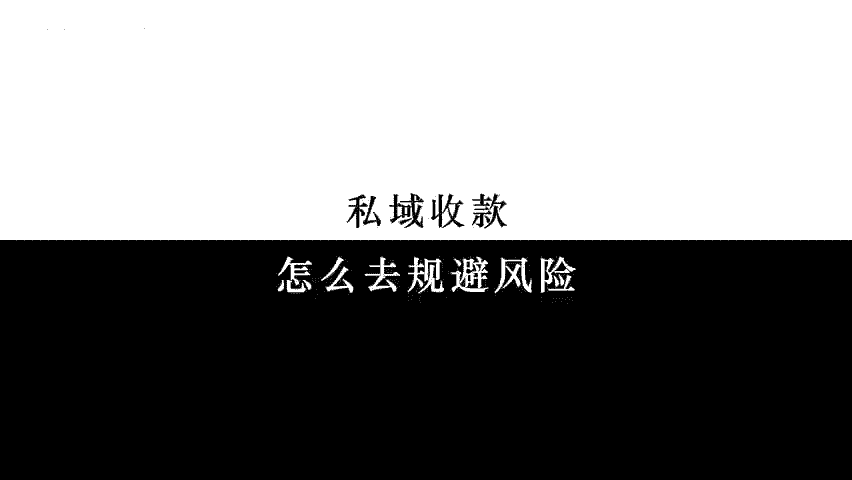

# 私域收款怎么去规避风险 - P1 - 赵啦啦讲私域流量 - BV1KKgDeMEnM

🎼思域怎么做到？每天大量收款，单是被封。今天就跟大家分享我们是如何在私域安全收款内出现任何问题的。这个方法呢我们用了很多年了，至今没有出现过风控的问题。接下来呢我就跟大家说一下到底是如何做的。

第一个新的用户进来，用户不良敏感性的话题，不说一些敏感擦边的商业用词和产品功能用词。第二呢，所有的转账用户一定要有超过10条的对话内容，或者说已经聊天超过一天了。第三。

对于一些朋友想进来咨询的设置一条朋友圈的指顶，让他一目了然的知道。第四，态度一般，没有强烈意愿的客户，千万不要去截成交去对单。第五呢，能用第三方收款，咱就用第三方的空中账户，千万不要直接到自己的账户。

我整理了一份思域的安全收款的操作指南，不需要的朋友，你可以直接找我要。

