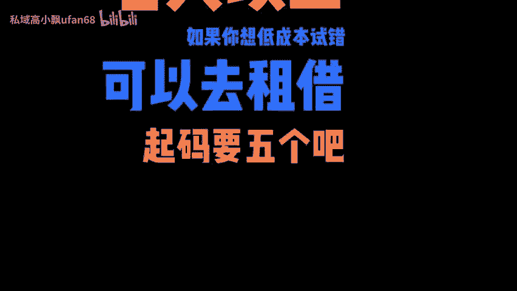
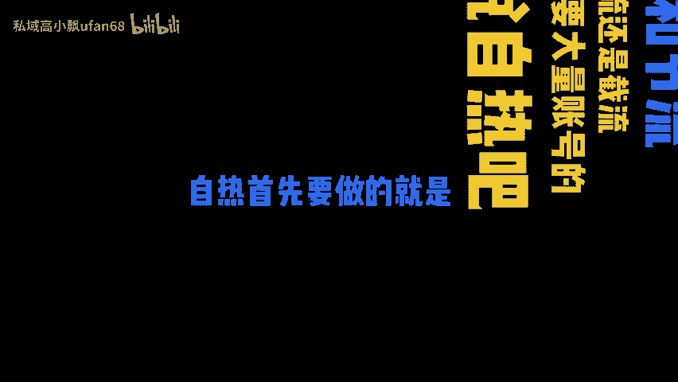
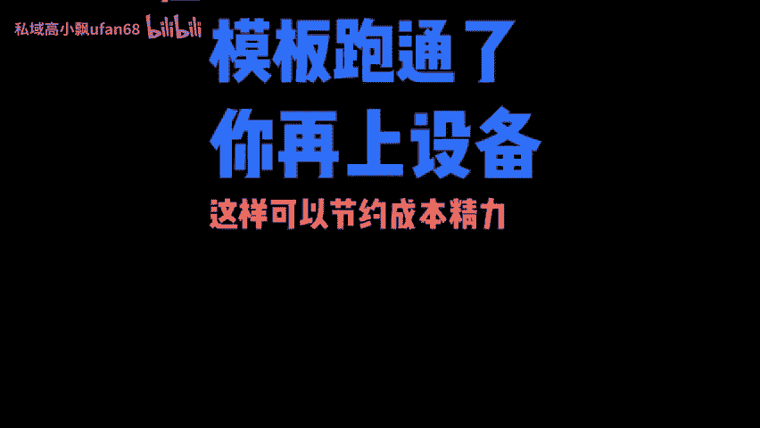
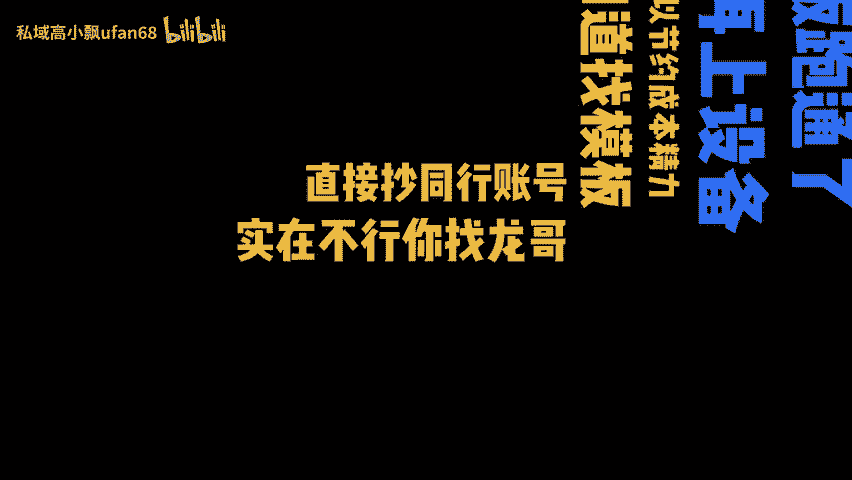
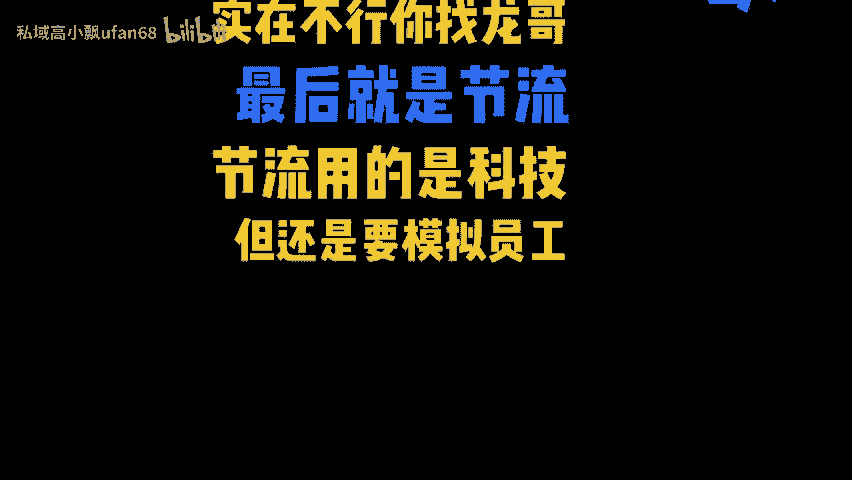
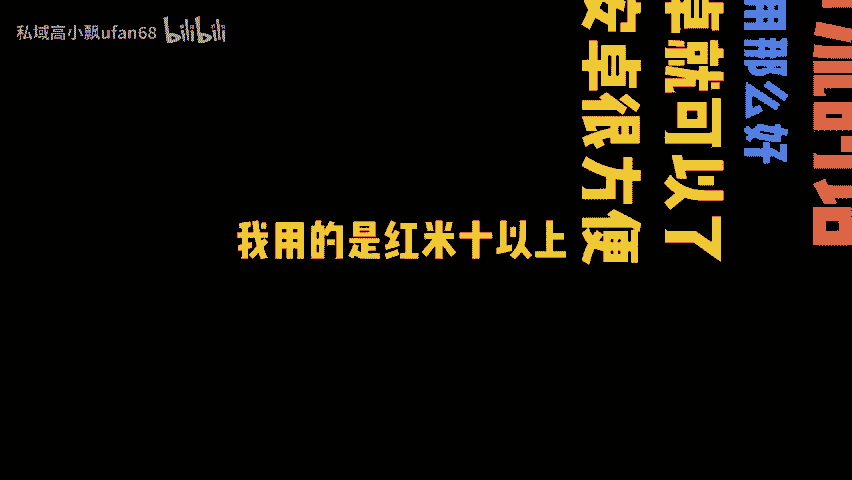
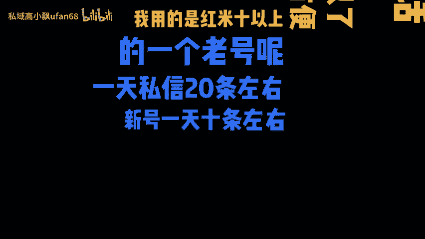

# 私域有哪些引流方式？ - P1 - 私域高小飘ufan68 - BV1w1sZeRE5J

🎼小白想做好私域。🎼哪些东西一定要有的？🎼当然是设备加账号了。

🎼账号准备3到5个要养好的，就算是老号也要过了信任设备这一关，一般建议换设备后养7天以上。如果你想低成本试错，可以去租借，起码要5个吧。

🎼最热门的引流方式，自热和节流，自热引流还是节流，都是需要大量账号的。先说自热吧。

🎼自热首先要做的就是测模板。

🎼不要同时所有的账号一起上，前期哪两个账号发作品了，模板跑通了，你再上设备，这样可以节约成本精力。

🎼不知道找模板，直接抄同行账号。🎼实在不行，你找龙哥，最后就是截流。

🎼节流用的是科技。🎼但还是要模拟人工私信的。

🎼做节流的话，设备不用那么好，用安卓就可以了。

🎼而且安卓很方便。🎼我用的是红米十以上的。

🎼一个老号呢。🎼一天私信20条左右，新号一天10条左右。

🎼转化率嘛10%算比较好的啦。🎼你算算你那一些号一天能进几个人。

🎼如果你连产值都不能算出来。

🎼你就不能找一个思。