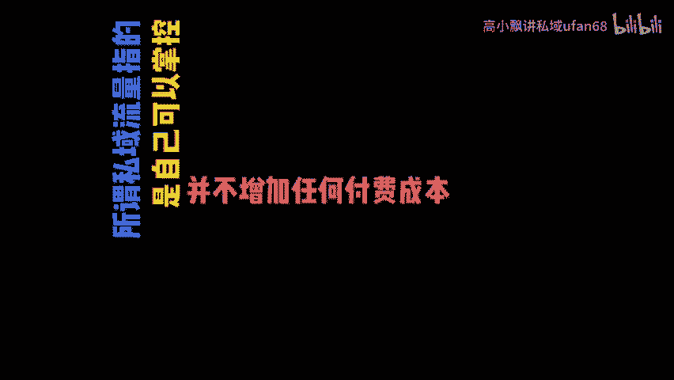
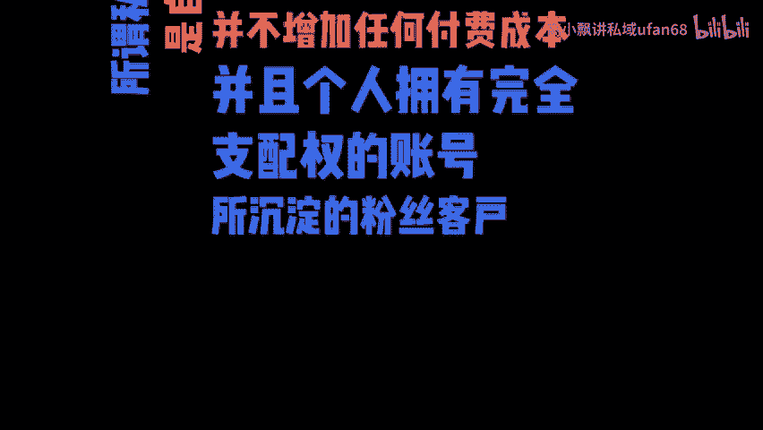
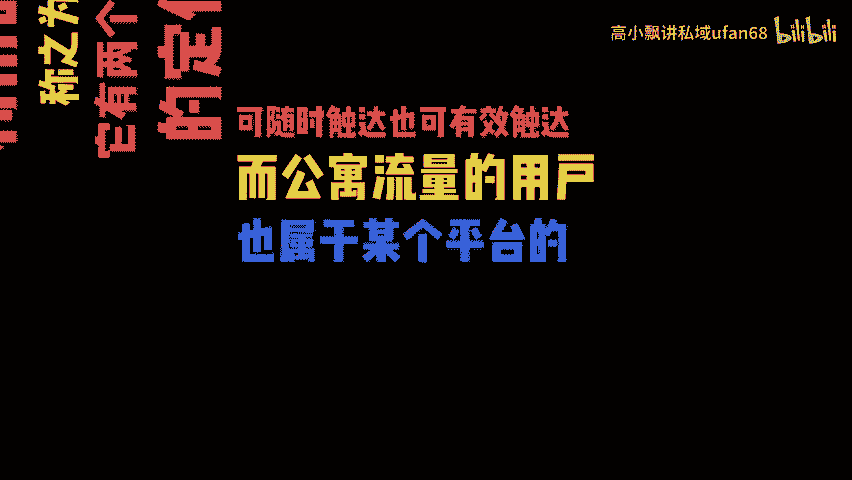
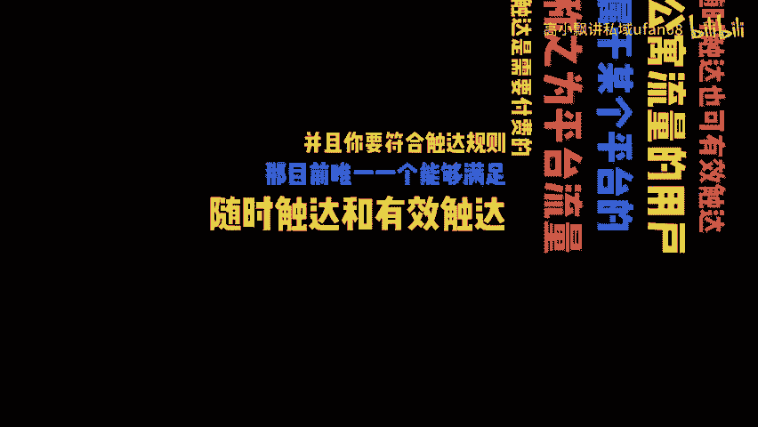
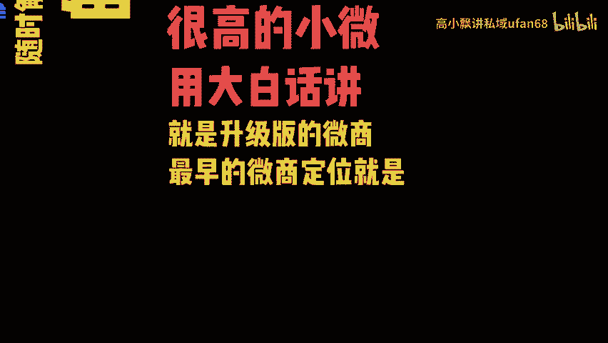
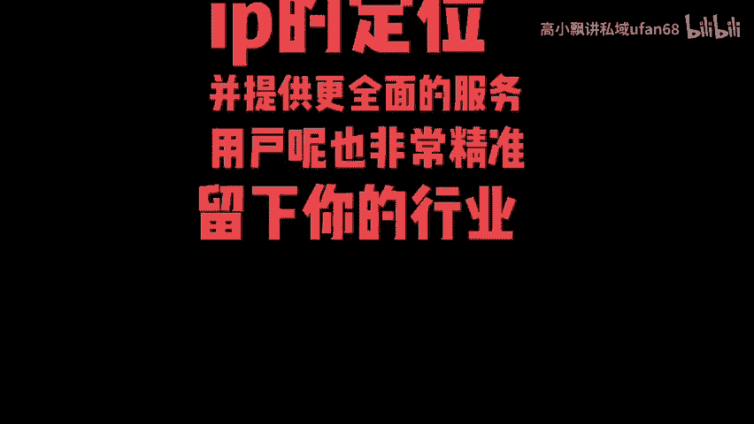

# 私域流量是什么？ - P1 - 高小飘讲私域ufan68 - BV1sbCUY8Ea9

所谓私域流量指的是自己可以掌控，并不增加任何付费成本，并且个人拥有完全支配权的账号所沉淀的粉丝客户，我们可以直接触达并多次利用的流量，称之为私域流量。它有两个非常关键的定位，就是可随时触达也可有效触达。

而公寓流量的用户，也属于某个平台的，也称之为平台流量。你的触达是需要付费的。并且你要符合触达规则。那目前唯一一个能够满足随时触达和有效触达的平台，也是私域运营的正题之一。

就是我们使用频率很高的小微用大白话讲，就是升级版的微商。最早的微商定位就是通过朋友圈去单一的卖货，而且用户非常的不精准，不聚焦。而升级版的私域更多的是品牌和个人IP的定位，并提供更全面的服务。

用户呢也非常精准。

随下你的行业明哥为你推。