# 私域流量的关键是引流裂变 - P1 - 私域高小飘ufan68 - BV1xynZeDEe6

做私域的核心到底是什么？别以为私域营销就是每天发朋友圈那么简单。其实它的核心是裂变，而且这件事情是在公寓没有办法做到的。想让你的客户越来越多，一定不要划走。今天咱们就聊一聊私域营销的整个过程。

无非就是引流培养关系，成交交付这四个步骤，很多人都觉得交付完了就完事了，但是你别忘了追销这个关键的环节，它可是裂变的一个小秘诀追销听起来是不是有点新鲜。举个例子啊，如果说你的产品价钱是挺高的。

顾客可能会犹豫。但是如果说你的价钱亲民几百块钱几10块钱甚至十几块钱，这样的小东西总能让人心动吧，关键不在于价钱的高低，而是要培养顾客在你这里消费的习惯，让顾客第一次在你这里消费，哪怕只是一个小单。

那么也可能去打开你们之间心费的第一步。如果说你的产品种类不多，周边产品也能用起来。一旦客户迈出了第一步完成首单。后面。

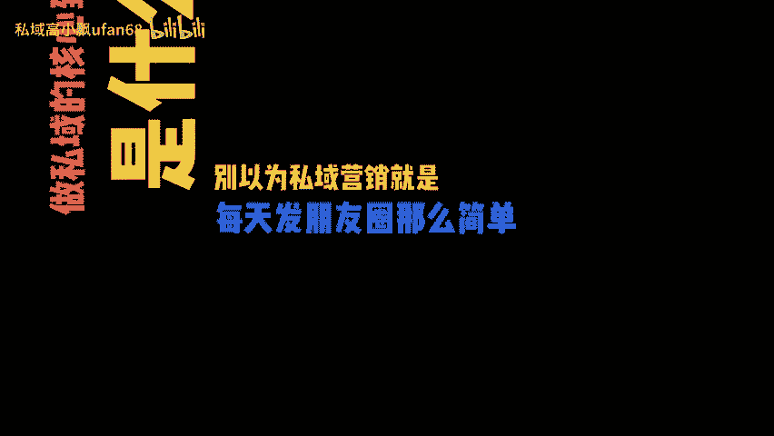

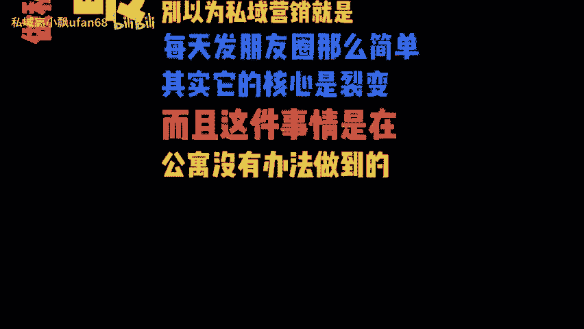

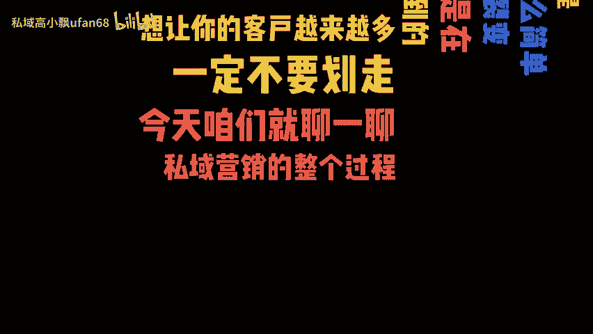

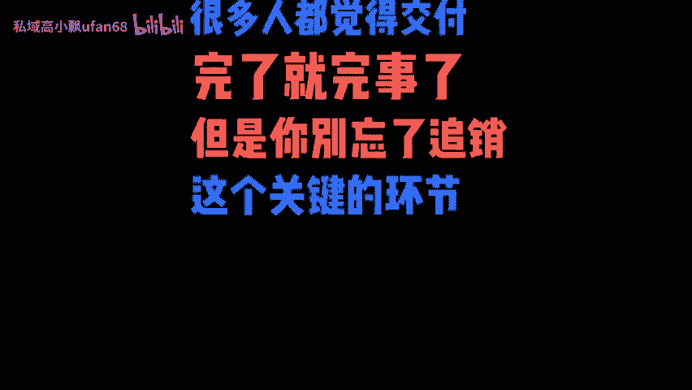

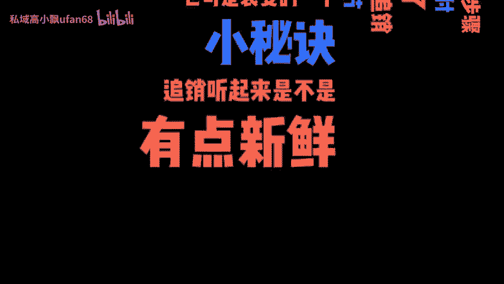

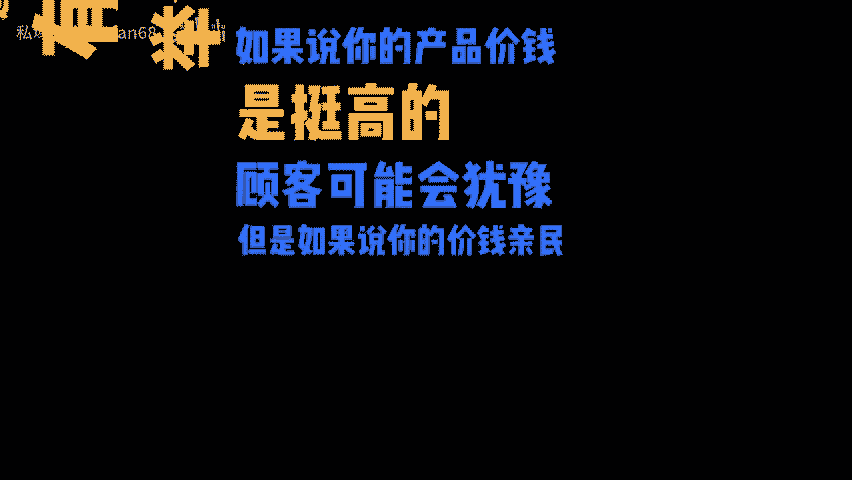

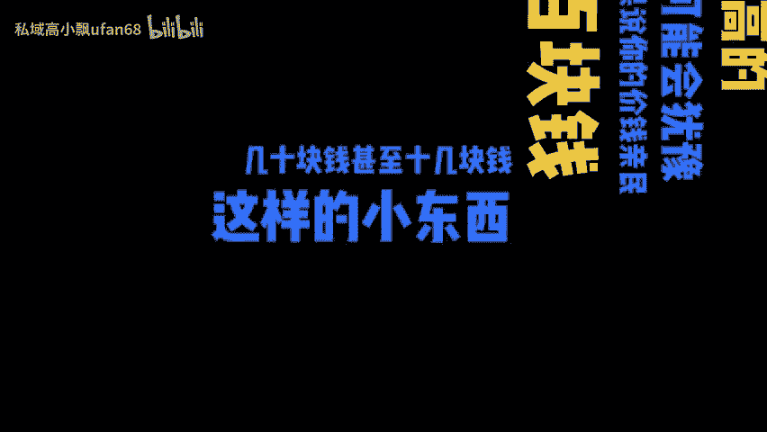

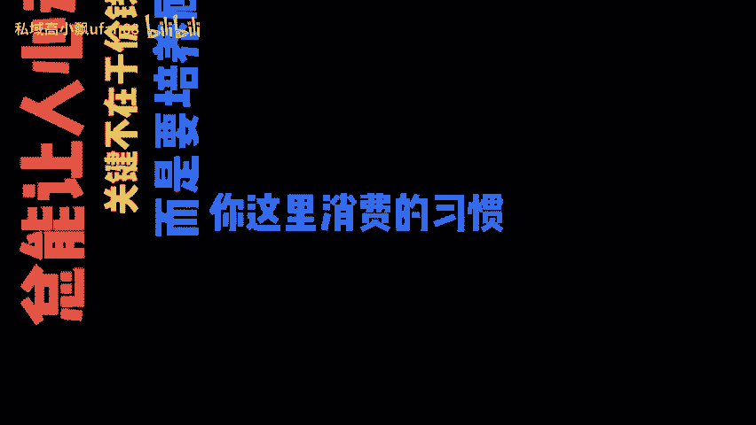

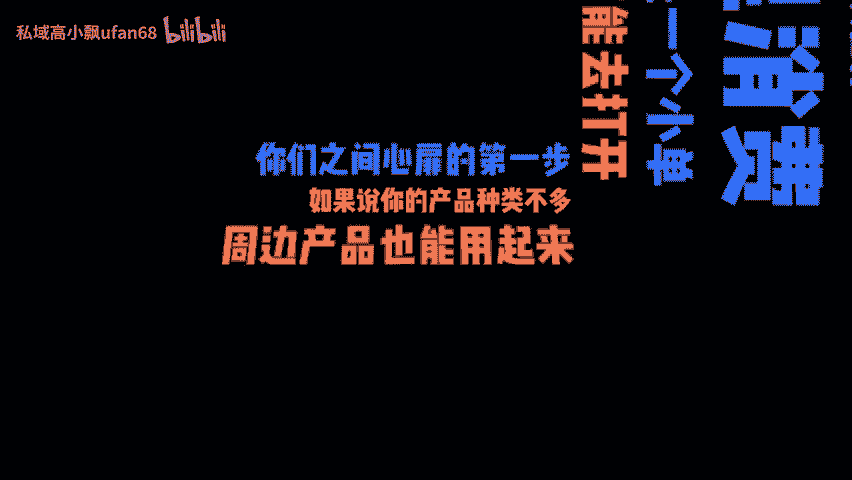

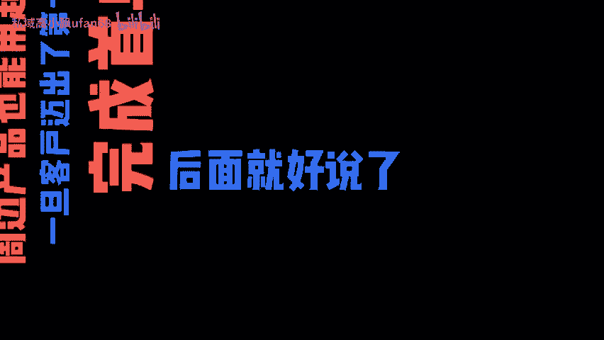

好说了，他们也更乐意去帮你去宣传了。别忘了定期搞一点分享活动。用户把你的海报分享到社群或者朋友圈，就能拿到奖品或者优惠券，这不就是裂变了吗？记住，私域营销用户是根本运营是方法。

对于参与裂变活动的用户要及时互动，给他们个性化的服务和优惠，这样才能把他们紧紧的给他抓住了，想要获取更多私域营销的秘籍，我们评论处可以打。

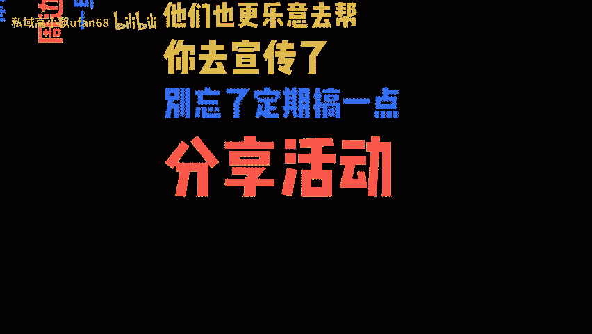

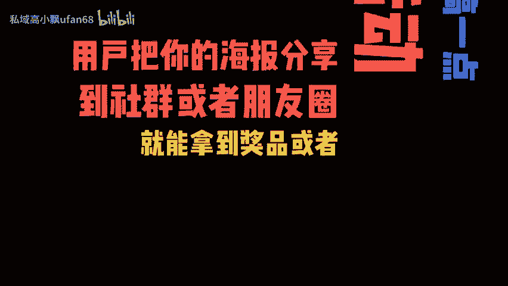

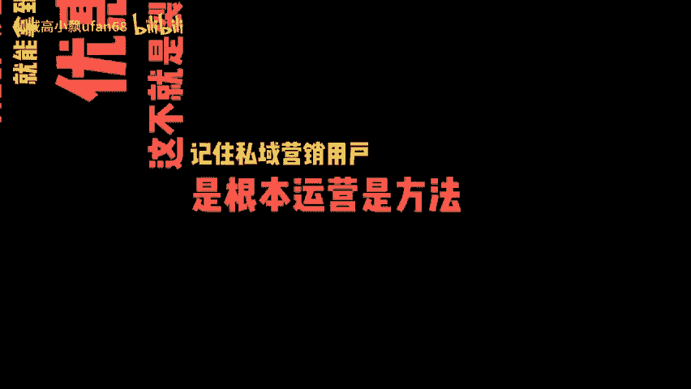

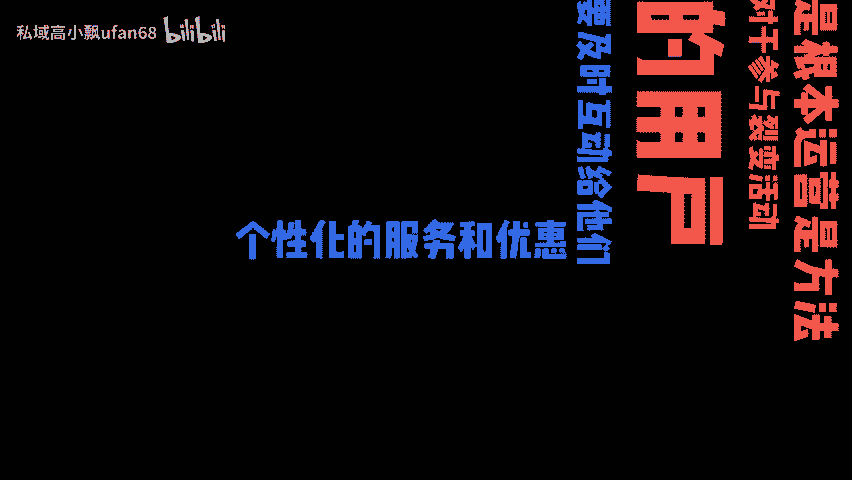

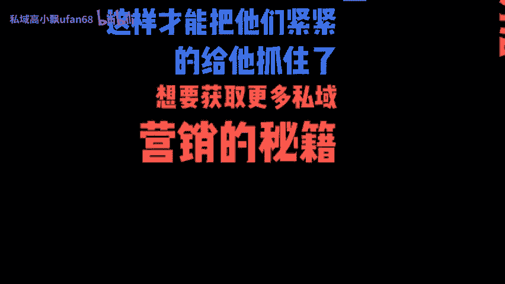