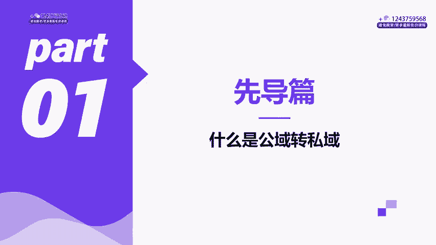
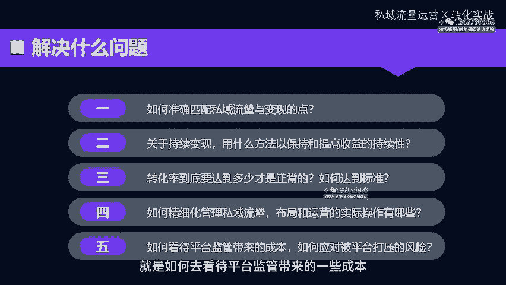
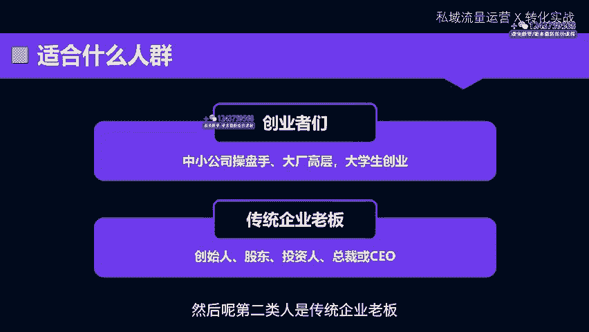
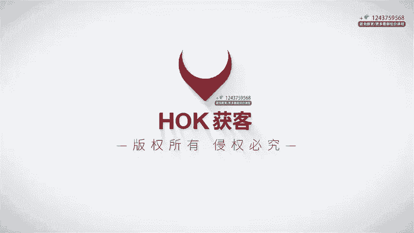

# 私域流量运营与转化实战，私域课程教程 - P1：01章节-先导篇-什么是公转私？_ev - 买不起的貂 - BV1p1421r7uB

う。

大家好，我是博商霍客思域的负责人大田老师。从2019年博商入局短视频开始。那作为核心操盘所的成员，那我们从创建第一个抖音号到打出一条知识付费商业类目的赛道。到现在成为了一个行业的领跑者。期间。

我主要是负责做电商和思域转化板块，从0到1的路，它没有那么光鲜亮丽，更多的是靠默爬滚打和一路踩坑扫雷，换来了现在的一些小小的成就。那给大家分享的呢，也只有我在一线去实战的一些经验和方法。

能够将这四年的经验总结成这几个小时的方法论，那也能够希望呢通过这些课程，能够帮助大家在获客引流，到流量转化上面去提升自己的效率，少走弯路。这节先导课呢，无论你有没有购买。

都是可以听的那我主要是给大家去讲一下这门课程的价值、定义，以及这门课程会讲什么。前面的系列课程大家可能已经知道了，在各公应平台如何通过优质的内容去获取流量，并且实现第一层的变现转化。

那这套课程主要讲的是私域流量运营与转化的实战。那什么叫做公转私呢？总结来说，它就是一个流程。用内容在公益平台，比如像抖音、视频号、快手、小红书等这种公益平台去获取播放量和粉丝。

那通过做一些动作让流量进入到咱们的私域。然后在私域里面通过朋友圈通过社群，包括私域的直播去完成第二步的变现。那用什么样的内容作为钩子，把这些公益平台给你的播放量，或者是粉丝转化成咱们的私域流量呢？

那以博商为例。那我们通过在抖音视频号这些平台去打矩阵，通过内容吸引粉丝获得关注，一旦出现连续了爆款，并迅速涨粉，算是就完成了获客的第一步。然后在短视频平台去搭建自己的导粉的路径。那通过各种方式将用户从。

公寓导入到私域池里面，在这个场域里面，通过一系列对用户产生价值的活动和内容，让用户对我们的品牌更放心，对产品更感兴趣。那接着转化到我们的线下课程。那么导粉路径该要怎么去设计呢？

那通过哪些方式将公寓客户引导到咱们的私域池里面呢？那用户好不容易来到你的私域，你要用什么样的方法留住他呢？怎么让他信任你，然后发生复购的转化，用哪些工具能够提高你的效率？

这些呢都会在课程里面给大家去做一个详细的分享。第二点呢就是课程的主要的结构。那首先课程结构的第一部分呢是综述，也就是公转丝的路径。我们刚刚已经说了，我们需要去理解它的重要性。

我们还要再过一下一些经典的案例，那第二部分呢就是讲粉丝的一些留存。那第三部分呢讲的是微信矩阵的布局。那我们会把整个细节全部过完。然后整个SOP的流程讲完。那再会讲到私域运营的技巧。

包括朋友圈、社群、私聊等做到精细化。当然还会讲到老板比较感兴趣的团队的管理。那如何让整个思域体系运作起来更高效呢？这就是我们的课程的结构。那课程开始前呢，大家要记住这几个关键词。首先。

获取流量的渠道是公寓。那公寓的核心是什么？是内容。第一个关键词就是内容。没有内容的持续就没有一切。因为所有的公司的业务都是在做持续性的建设，才能够有持续性的销售结果，才能够有持续性的业务发展。

持续它比规模比精准都更重要。那第二个呢就是精准，第三个是价值。第4个，它才是规模。那这堂课程能够解决什么问题呢？那期待能用这门课程能够帮助各位同学们去挖掘潜在的一些增值资产。那帮助同学们能够去抓取流量。

那思域为什么如此重要？无论是老板是操盘手还是企业高管，或者是想要学运营的人，这都是一个必学的技能。在思域的运营上面，我们还能够做些什么？那有几点可以分享给大家。

第一个呢是如何准确的去匹配私域流量与变现的点。第二呢是持续变现，用什么方法以保持和提高收益的持续性？第三，我们的转化率到底达到多少才是正常的。那要实现什么样一个标准？第四。

那如何在思域的内部去做精细化的管理，去把流量池去管好。那包括布局的策划和每一天的这种运营的实际操作。第五个就是如何去看待平台监管带来的一些成本，也就是封号。那如何应对被平台打压的这种风险。

东方臻选的事情发酵已经提醒了我们，不要去过多的去解读品牌跟公益平台之间的合作关系。双方其实是互利共赢的。公寓平台方面的规则也很简单。如果你通过引流所创造的销量没有补偿到流失的部分。

平台将不得不跟你终止合作，采取限制流量的措施。说白了，平台这个做法其实就是一个商业上的立场，非常的清晰明了。面对这种截取流量的行为，它确实使平台的用户价值受损。不过，平台仍然给予了一定的容忍度。

那这是为什么呢？因为那些流量截取者，他也能够为平台去提供内容和广告支出。所以这种情况实际上是一个策略上的博弈的过程。所以说怎么样去赢得这场博弈，可以学习我们这场课程。那它适合什么样的人群？

我觉得第一类就是创业者们想要去积累第一桶金，核心就是要解决流量的获取和留存问题。中小公司、操盘手、大厂的高层或者是大学生创业的人都需要整个私有运营的SOP把这一套SOP给到你的同事，给到你的老板。

你自己可以去涨工资。你有了自己的作品，这是我觉得给你一个非常强烈的购买的理由。然后呢，第二类人是传统企业老板。我觉得第二类人更需要你直接批量团购，让他们直接去学，因为运营流量是公司的关键技能。

他能够为你公司去增长收益。所以说都能够在这门课程里面去学到。我们用几个小时的时间，简明扼要的，并且清晰的把这种技术性的运营动作跟你说透。

像这样的课程，把整个流程交给创业者朋友们，交给操盘手，交给各位同学，这是我们这门课程的核心的卖点。因为运营好流量是一个公司较为值钱的板块，就是能够把握住变性的资产。私域，它也是企业流量运营的核心能力。

你学这门课程的目的就是直接用我们的私运营的技能，借鉴这套方法论，让传统企业转型，让运营者涨工资，或者是自己创业赚钱。好，这个就是我们的先导课。那主要是呢把我们整个课程的目的以及背景去讲透。

我们下节课呢就会在具体去展开公域转私域的重要性和具体的玩法。那我们下节课见。

