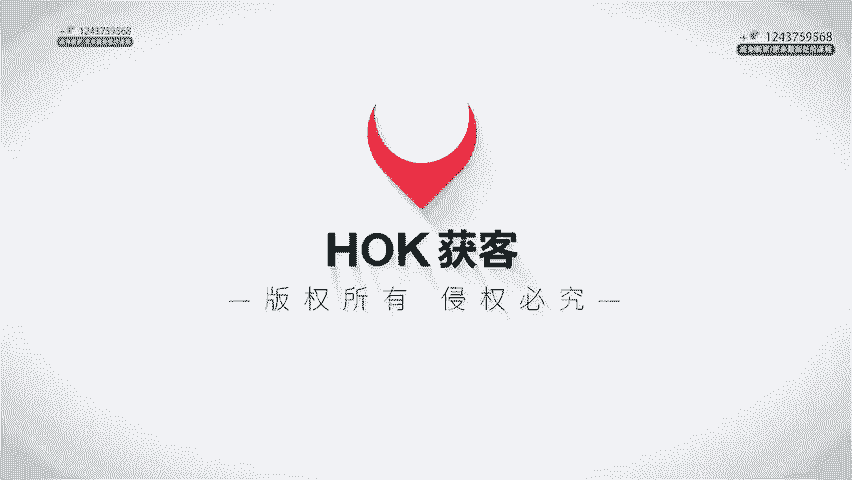
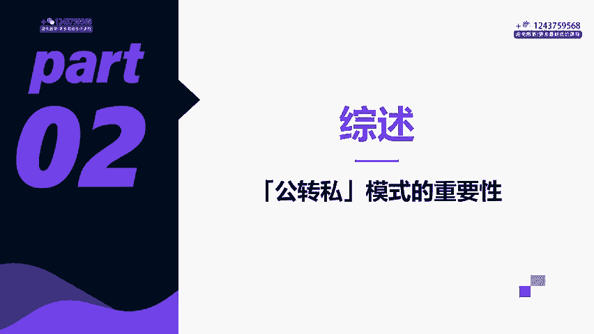
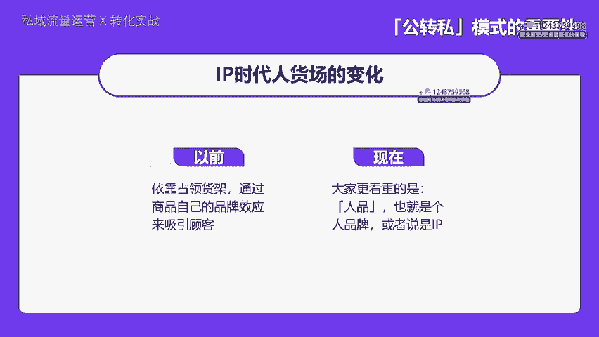
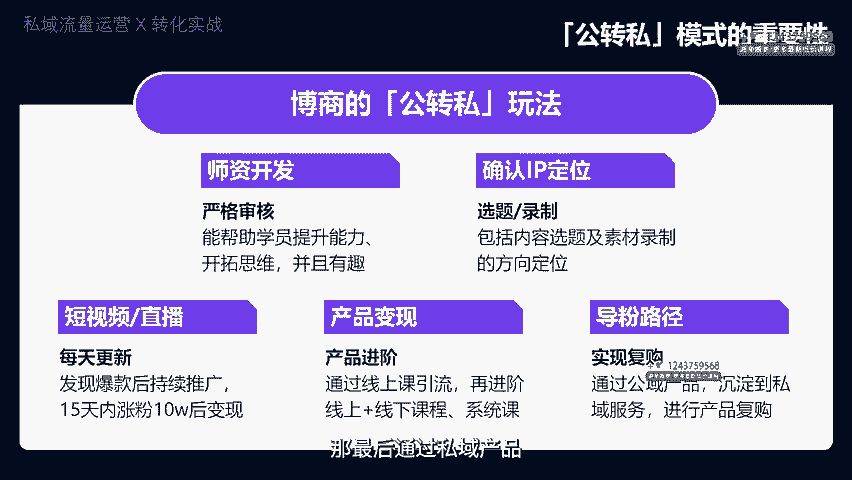

# 私域流量运营与转化实战，私域课程教程 - P2：02章节-公转私模式的重要性_ev - 买不起的貂 - BV1p1421r7uB

う。

大家好，我是博商霍客的思域负责人大田老师，这是我们思域流量运营与转化实战的第二课。这一堂课程的学习目的呢就是教会大家如何通过公域获取流量到私域。在讲具体的操作流程之前呢。

我们要先来了解一下为什么它很重要。IP时代人货场的变化又有哪些？我们自己博商的整个公域转私域的玩法是什么？那什么样的公司，什么样的行业和产品适合来做公转私这套流程呢？

所以说我们仍然要用到咱们本身的案例来说明一下，我们自己是如何去理解公转司这条业务链路的，以及我们是怎么去贯彻落实的。那第一个呢就是IP时代人货场的变化。你看啊以前的商业模式呢，主要是依靠占领货架。

通过商品自己的品牌效应来去吸引顾客，然后实现销售规模的扩大。无论是在淘宝、京东还是天猫，还是说在实体店的门口，市场的档口，关键都是要让商品铺满每一个角落，让人们能够买到货。但是现在事情发生了转变。

大家更看重的是人品，什么是人品，也就是个人的品牌，或者就是咱们说的IP。那现在人们不仅仅在意你卖的是什么，还要在意是谁在卖。那这就成了一个新的游戏，我们不仅要在货架上铺开，还要在内容平台上去开疆扩土。

无论是抖音快手视频号还是微信公众号，先靠个人魅力去吸引人，然后再去推销产品，而且现在每个人都可以成为一个IP连创始人都出来做IP了，这成为了一个非常流行的趋势，但是这个事情不要急，他急不来。

因为不是所有的公司都适合这套玩法。你要问一下自己，你做IP真的有必要吗？那在什么情况下更划算呢？比如说你有没有想过，为什么实体店能卖货。

人们去店里买东西，可能是因为商场本身就是一个自然能够吸引流量的地方。那同理电商能卖货，那他是因为有这么一些大的平台，像淘宝、天猫，他们就像一个巨大的集市，它自然流量就很多。那微商之所以能挣钱。

关键是在于那些社交内容场，他们能够在用户信任它的基础上面，把每一个社交圈都变成货架。短视频和直播为什么那么火？因为他们提供了一个新型的内容平台，他把货架建在那里，自然就有能够吸引流量。

那IP电商也是这样子的，在公域场和私域场同时去发力，结合内容和社交的流量，让粉丝来买账。那可以看到，无论是什么场景。你想要去达成交易，你都离不开公域和私域的结合。那我们自己操盘的项目也是这样的。

我们博商获客本身就是一个生产内容的公司。博商做公益流量最具挑战的无非就是打造爆款IP如果一年里面能够有两个爆款IP，那一个线的导流团队基本上就不用愁了。所以我们会把大量的工作放在师资挖掘上面。

一旦发现一名潜力股的IP团队都是集中去打爆的那怎么做的呢？那你首先得开发师资吧，那这一块的审核是非常严格的。这个老师他得靠谱。你的课程内容它不仅要去吸引到人，还要能够持续的不断的去创新。

还要有持续输出内容的能力。那同时内容能够去戳中人的痛点，能够引发用户的共鸣。并且你的观点是很独特的，你的表达要能够清晰易懂，并且你的内容要能够真正的帮助学员去提升自己的能力。然后就是确定IP的定位。

这包括了内容选题到素材的录制。那接着短视频和直播，我们要坚持每天去更新内容。如果发现了潜在的爆款，我们就做持续的推广。那争取在15天内的粉丝达到10万，这样的话就证明它可以变现了。那关于产品的变现。

我们一开始都会通过一个引流品，比如说像365的线上课程去博得用户的关注，给他真正的价值，让他学得有用。那接着就会提供3980的线上进阶课，或者是2980的线下课程来现场跟老师见面，来学习系统的方法。

还会有一些系统的课程体系。那我们的导粉路径是很清晰的先是通过公益的产品。然后沉淀到思域里面去做服务。那最后通过私域产品再进行二次的转化。简单来说呢，我们是通过短视频和直播宣传365的产品。

这样的话我们就可以获得首批精准的流量。

当顾客下单之后，除了可以自学视频课程外，我们还提供一对一的售后服务。售后服务的开启，标志着客户正式进入到我们的这个思域。我们会把他们留在我们自己的小程序APP企业微信或者微信里面去成交其他高客单的产品。

在整个服务的过程中，通过持续的活动和运营，我们会在不同的场景为用户去提供相应的价值。去促进复购，从而去实现利润。那服务的身份呢是什么？我们是老师的助理，而转化的场景就包含了一些私房的课程啊。

包括一些公开课。那我们利用学习资料或者是一些免费的课程的观看。那作为钩子，让同学去添加微信，再通过提供免费的那种直播课去创造用户的价值，相应的话，能够满足他们基本的需求。并且如果他觉得这个产品适合他。

他就会产生购买和复购，对吧？那为什么我们这种业务要走从公域到私域的路线呢？这是因为咱们卖的产品是非标品。那你可能就问了什么是非标品。其实这意味着我们的产品不是那么好。

一下子就能够在直播和短视频里面解释清楚的。你要想在一个短视频和直播间里面，你要讲明白为什么这个东西值钱。为什么这个东西价格不菲。以及买家为什么非他不可，这个事情非常的难。但是对于非标品来说。

转化顾客的过程首先是要去建立信任。那接着就是多次去介绍产品的内容，用不同的方式去满足用户的各种的需求。因此呢非标品它得在一个比较从容的环境下去进行沟通。这样的环境呢要对时间和空间的要求。

它就没有那么苛刻。那显然直播间他就做不到这一点呀。再说了，我们的产品的单价高，这就意味着在直播或者是一次性推广中，很难让用户立刻做出购买的决策。高客单价是多少呢？可能你会说1000块钱起。

但是在我们认为在那些信息消费特别快的场合，可能百元以上的销售也算是高客单价了。当然了啊，如果说只有几百块，这还真的不太能够支撑起我们私域营的成本。还有更重要的就是我们有高复购率的产品的体系。

就有第一层产品，有第二层产品，有第三层产品，有不断更新的课程以及线下课程的活动，这就是一个持续的一个过程。所以需要跟用户建立起长期的信任。你要持续的去卖好产品，输出持续有价值的内容。

所以说我们自己这个体系在私域中成交是很顺的。那么这套方法是不是可以在任何场景下都能够直接用呢？接下来我们要看一下到底什么样的公司，什么样的行业，什么样的产品它适合从公寓转到私域里面来。

我们从这四个维度来分。分析一下。咱们先聊聊高客单的这个概念。要再像抖音和视频号这样的公益平台去完成高客单价的交易是相当困难的。关键是要明白这背后的原因。其实很简单，用户它通常是相当急躁的。

你要想在这些平台上，用户一直在不停的刷来刷去。他当下是处于一种几乎是下意识的一种急躁的状态的。他一直在追求多巴胺的快感。所以说啊在这样的环境下，也很难立即做出购买的决定。

所以说我们在考虑高客单商品的时候，那我们就不能够依赖这种快速的信息流平台。你知道我们现在生活在一个信息流不断轰炸的时代。我们似乎对刷推荐的内容欲罢不能。咱们自己还挺享受这种刷帖的感觉。

但你每一次的点赞和多看几秒，我们都在无意中去喂饱了这种系统的算法，让他们更懂得怎么给我们推送我们感兴趣的东西，那这些内容就像是不停的在制造工厂的产品，不断的被推到我们的面前。

我们的大脑就在这种刺激下释放多巴胺，让我们进入到一种无止境的循环。那结果就是我们的神经变得对这种刺激麻木了，那反而就更焦躁了。总想找下一个更刺激的东西，那这种刺激比看电视强上很多倍。

导致我们变得焦躁不安，甚至怀疑一切。这就是为什么当我们在刷信息流的时候，它好像就是停不下来，因为我们大脑里的多巴胺极度的刺激。然后我们就像在追求多巴胺这种小零食一样变得依赖它，确实有点可怕。

这种现象很普遍。我们成立于信息流。而我。的观众也是在这样的环境中看我们的直播。视频号可能还要稍微好一点，因为它设计的更像是抽屉式的。可以有所克制。但我们还是认为啊。

通过这些平台快速完成高客单的这种交易是非常困难的。高客单价的产品通常需要在私域环境中来完成交易，这种快速的流量的模式，很难去实现高销售额，这就像逆天行事一样。

知识付费行业呢只有一个老师阶段性的实现了这一点。那这个老师呢就是透透糖。啊，他自己的直播间呢可以卖3000多啊，4000多啊，包括5000多的产品。那还有像大蓝这样的例子。

但它的成功的关键是因为它本身就有很大的关注度和粉丝量。然而，像流量没有那么大的公司，要实现这种高额交易就更难了。这是很明显的道理。很多人想去找捷径。希望能够一下子就成交很多。但是事实证明。

这通常是不可行的。我们认为如果你的客单价超过了100元，实际上我们并不建议大家把主要的精力放在私域上面。除非你有很高的复购率，如果高客单价在1000元以上，那你基本上是必须得转向私域经营的。

接下来我们聊聊第二个高复购率这个问题。高复购率很关键。我说的是，当你的产品或者是服务能够吸引顾客不断回头购买，这才是真正的能够带来稳定增长的节目V。那这种复购不是我们认为顾客应该会来买，他们就会来买的。

复购你得有理由得有那种客观的情形，促使他们需要一次又一次的购买。拿我们这个知识付费行业来说，复购可能并没有那么直接。我们可能会觉得知识付费的复购是在不断的建立起信任基础之后，顾客愿意继续付费的结果。

但其实这种复购更像是我们创造出来的需求。就像我们通过吸引顾客和构建IP内容来积累新人货币一样，我们必须用不同的产品去消费这个信任，否则客户就会流到别人的手中。

那确实有些复购反映了顾客主观上的一些购买行为，但也有很多复购是由客观需求去驱动的。比如说房子和车子，它就不是那种会频繁复购的东西，对吧？但是实物、衣服、珠宝这种，他们就是天生的高复购品类。

因为他们跟我们的日常的消费，精神的消费或者是一些基本的生活需求有关系。那我们还要考虑到用户在线下的行为是怎么映射到线上的呢？如果一个人在现实生活中频繁的购买食品和衣物，经常去逛街。

那为什么他在网上就不会这么做呢？服务行业同样遵循这个逻辑啊，比如像K12教育市场，它之所以能够成为一个黄金的赛道，是因为它本质上就具备了一个非常自然的高速的复购的特性。接下来我们聊聊第三点。高利润率。

那这个很多时候也会被忽视。因为要管理好一个私域流量，涉及到运营细节是相当繁琐的。很多人找到博商问我们说如何去搞定私域流量，有的老板可能就根本就不适合做私域，就没有必要去投身其中。有这几类的老板。

我们可以提醒一下啊，你们需要仔细的考虑私域流量对你们的公司是否是真的划算的。以及你们到底有没有决心去做。首先是网红老板。那他们通过快手、抖音这样的平台赚到了钱，靠的是自己制造内容去吸引流量。

然后在直播间持续做直播，他们性格比较急躁，因为非得不停的直播，你去持续的去赚钱，而感到非常的疲惫。他们想要把自己的粉丝私域化，想通过委派一个私域负责人来盘活这里的资源。

那期望私域销售能够给他们除了直播以外的新的增量。那甚至有些呢他想要去依靠私域去彻底的取代直播赚钱的想法。但是问题就在于，用户在直播间已经被你洗过一遍了。如果你的私域中要做重复的事情。

尤其是当你的产品缺乏差异化的时候，你们有一个很好的产品体系和路径的引导，用户会感到很困惑，为什么我还要再次被你洗呢，网红在抖音上越火，他们的团队技能就越单一。他的耐心也越低，对于思域复杂的运营细节。

很多是难以承受的。但是如果你的产品利润率高，虽然复购率可能不高，你却愿意花时间去囤积私域流量，为的是一年能卖一次。那么耐心可能就会有长期积累信任，而每年只转化一次，那对于有些网红来说是可以接受的。

那举个例子，如果你卖的是标准化的产品，像刘媛媛和猪呱呱这样的美妆博主，他可能会做的还不错。因为细分市场的美妆产品，它可以支撑起相对复杂的这样的一个运营的细节。并且利润率高。

那对于像大狼狗小杨哥这类的网红，他们就没有能力去也没有耐心去处理私域流量那么复杂的一些运营细节。那另外一个点呢，就是做快消品私域流量，实际上并不容易。除了完美日记这样的案例，真的没有多少成功的例子了。

完美日记之所以能够做得好，是因为它拥有巨大的流量规模。并且他把私域运营像公寓一样，他使用数据驱动，用企业微信发券和精细化的运营策略。这对大多数快消品品牌来说是难以复制的。他们的订单量没有那么大。

而且现在的流量级别也没有达到完美日记那样的水平。因此，如果你想做私域真的需要非常强的决心来支撑起这个复杂的运营。然后就是成本的问题。如果你选择个人微信或者是企业微信，它都会产生成本。在接入流量之后。

你需要不断的去发朋友圈，去推销产品，去搞活动，去打促销。而要不断的完成订单的交付，整个过程还是相对比较复杂的。只有在利润颇丰的情况下，公司可能才有能力去承受这样的经营的成本。

所以说对于想要经营私域流量的公司来说，首先得确保满足这三个条件，才能够看大任。最后一个是讲非标服务，这个问题还挺有意思的。飞标服务呢顾名思义指的是那些不好直接定义或者是标准化的服务。要宣传这种服务。

你得用朋友圈不断的去接触到客户，也就是说得多方位多角度的去打动他们。你知道用户可能对你的服务的一个方面不感兴趣。但是他对另外一个方面可能就会觉得很有吸引力啊。所以你需要不停的去尝试，找到用户的需求点啊。

你才能够找到让用户转化的点。

在私域里面你可以这么做，因为你有朋友圈有各种各样的触点，你可以更灵活的操作。但是在公寓就不一样，那你需要去迅速命中目标，去立即成交。因为公寓的用户很容易烦躁不安，没有那个耐心。

那接下来说说哪些业务适合从公寓转到私域和女性相关的很多领域。比如说情感、私密、医疗、养生、亲子。做健康，还有减肥的。然后还有像珠宝呀、奢侈品这一些。那对于男性来说，像这种兴趣的，像做创业，也是做健康。

还有脱发，还有这种餐饮啊、酒类啊、茶叶啊等等。那无论是男性还是女性都有着想要自己追求的，想要去提升的东西，也有跟财富心理或者是教育相关的需求。那现在就说一下私域生态中的视频号。

那今年视频号的使用呢突飞猛进，让所有的行业都看到了新的机会。标准化的产品有机会在视频号里面再造一个小的抖音。而非标精细行业也找到了新的阵地。我们不再需要像在抖音那样去适应3到5秒这样的一个快速剪辑。

那我们可以去慢慢的去讲述自己的故事。像现在这个时代，IP的建设，就是老板的直接的工程。这个时代尤其重要，你不去做，别人肯定会去做短视频是接近用户最好的工具。现在视频号和抖音这两个平台共存不必的市场。

你也不应该去错过这个机会，因为它可以帮助你去获取自己的流量。在有了私域之后，你的短视频媒介至少有一定的基础播放量。这样的话你的流量才有可能转化成实际的成交。所以你没有理由不开拓私域流量。

做好公转丝是十分关键的。微信的B to C业务非常重视用户和品牌之间的直接交流。所以它可以为用户提供一些安全感。那同时呢也能够成为企业盈利的核心。因此，将公域流量转移到私域，就显得非常的重要。

说到双向的循环，其实意思很简单。就是说你在公寓，比如说在抖音、视频号、小红书、公众号等去获得流量，然后拥有了一些基础的播放量。那有时候呢还可以去实现及时的成交。然后在私域你又有了一圈的朋友。

有视频号直播这样的渠道，可以实现持续的成交。这样一来，公寓不断播放，带来一些新的客户，资域不断去成交，维系老的客户，两者形成正向反馈，然后叠加在一起，就像一个双重的保险效果还是很明显的。

那所以呢在视频号和抖音并行的场景下呢，对于那些高客单价、高复购率、高净利润或者是非标准产品的企业来说，真的应该好好关注公转私的策略。下一次课程呢。

我们会通过具体的案例向大家展示公转私是怎么帮助同学们怎么帮助企业家老板去实现盈利的那我们下次课再见。

