# 私域流量运营与转化实战，私域课程教程 - P3：03章节-从8个案例洞悉公转私逻辑的关键_ev - 买不起的貂 - BV1p1421r7uB

う。

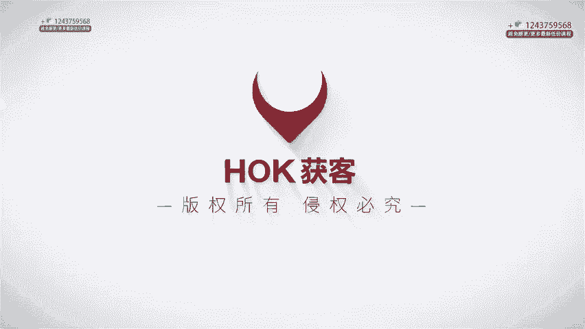

大家好，我是博商获客的C域负责人大田老师。接下来这节课我们来看一些实际的案例，我会挑选8个公转式的成功的IP经典的项目。那逐一去给大家去介绍。😊，每个案例呢我大概会用到2到3分钟的时间去讲解。

这样呢能够去帮助大家更清晰的去了解公转私是怎样的真实的情景下去发挥作用的。那希望通过这些案例分析，你能够得到一些灵感或者是策略上的启示，从而应用到自己的业务中去。好，那咱们开始吧。我们聊聊樊登读书。

它是如何实现零成本打造私域，并且赚到千万营收的樊登最开始呢它只有单一的IP和品牌。但是自2018年以来，在APP里面呢陆续增加了一些新的IP包括一些课程呢，或者是一些训练营的这些内容。

经营了近5000万的注册用户量，也诞生了不少新的业务。他们的代理商模式很独特，线下合作中心就好比樊登的扩音器，那近些年随着新媒体和新的分销推广体系的发展呢。因为产品成本比较低。啊。

交付迅速就能够提供高达50%左右的佣金。那这对分销员是非常有吸引力的就开始去结合用户的成长和用户分销。通过在C端社群去培养超级用户，用超级用户再服务C端的模式，打造出了千万营收的社群产品。

那樊登是怎么发展起这个分销体系的呢？其实很简单啊，就是先找到一个优质的产品，保证性价比，然后稳定，而且持续的去支付佣金给分销员。那如果这个体系原先它就是一。那招募和复制更多的分校员的成本，它就是0。啊。

后面还能够源源不断的去产生效益。首先他们的运作方式是自下而上的啊，先将用户塑造成有影响力的IP再让他们去帮助传播这种方式不依赖于樊老师本人，而是基于内容版权进行二次开发，并配备了运营服务。在这种模式下。

他们即便没有任何投放成本的情况下，每个月服务也超过了1万多的人。那这个数字还在增长。啊，接着樊登还摸出了一种书友服务书友的这样一个模式。那通过这种方式，用户不仅能够消费内容，他还能够成为内容服务者。

乃至生产者。那在资源有限的情况下，在这种创新的做法，那实际上是为了去充分的利用现有的人力和资源。促成用户的自我成长和分享。那樊登还组建了线上运营团队，通过灵活调整招募策略，打造出更好的服务体验。

资域营销的核心其实就是建立人和人之间的关系。分销体系它并非是刻意规划出来的，而是随着产品和服务的质量自然形成的。这个整个的过程的关键点就是扎实的把产品和服务放在第一位，让用户充分的信任品牌。

而且基于对产品认可的基础上面去获得实际的好处。用户自己会成为品牌的伙伴和盟友，是因为他确实从中受益啊，他就会有动力去分享和推荐。所以，把用户视为平台最宝贵的资产，帮助他们在平台内去成长。这样做。

他不仅能够培养超级用户，也就建立了一个强有力的分销系统。凡正的案例告诉我们，当我们拥有越来越多的超级用户的时候，就不会缺流量。张琪老师在互联网的影响力的塑造，他火遍了整个网络。

那之前其实他也拍了几年的短视频，但是没怎么红。自从我们开始合作了之后呢，张琪老师就成为了一个现象级的IP。那按理说抖音任何一个网红都不会说超过一年，最多半年，但是张琪老师已经快两年多了。

他为什么还那么火？

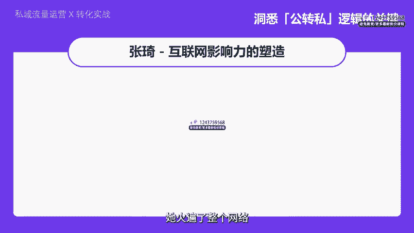

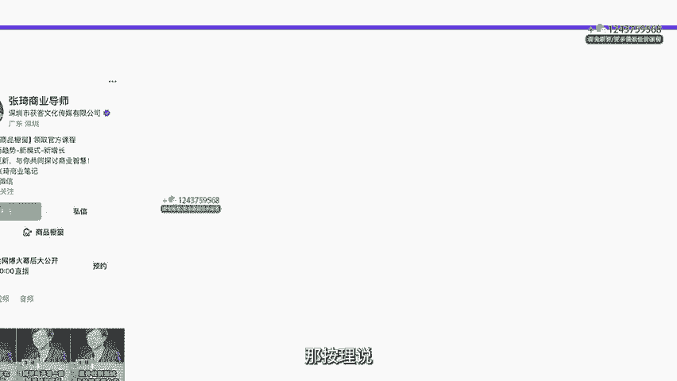

首先得归功于他的人设和风格，特别有个性，男生女生都喜欢他，那很容易去吸引观众的眼眼球。张琪老师，他火起来是因为他有一条短视频，他说，北上广深行，北京是笛子，深圳是青春的儿子，东北是长子。

那个视频差不多有百万赞几千万的播放量。在那个话题之下，他就出圈了。我们选择用短视频切片来打公益矩阵。因为当他在课堂上讲的很忘情的时候，他能够凸显出自己的状态来。于是把他精彩的上课的素材再发布出去。

这是第一阶段，就是用课堂上大众化的段子，完成了第一波的能启动啊，期间就把这些流量转化成了第一层的变现产品。365的课程。那当总粉丝量在两个月的时间内能够达到300万的时候，张琪老师就进入了第二阶段。

他开启了直播。张琪老师的直播是一个结合型的模式。那一方面呢是每周一次的直播。那另外一方面是配小助手同频直播。而直播间主打的产品不仅有365，还会有1980的线下课，2980的线下课。那紧接着呢。

张琪老师开了将近100场的线下课，那这些流量也就顺利的沉淀到了思域中去做后续的服务转化。那个时候张琪老师就非常的辛苦。他整个半年一天都没有休息过。

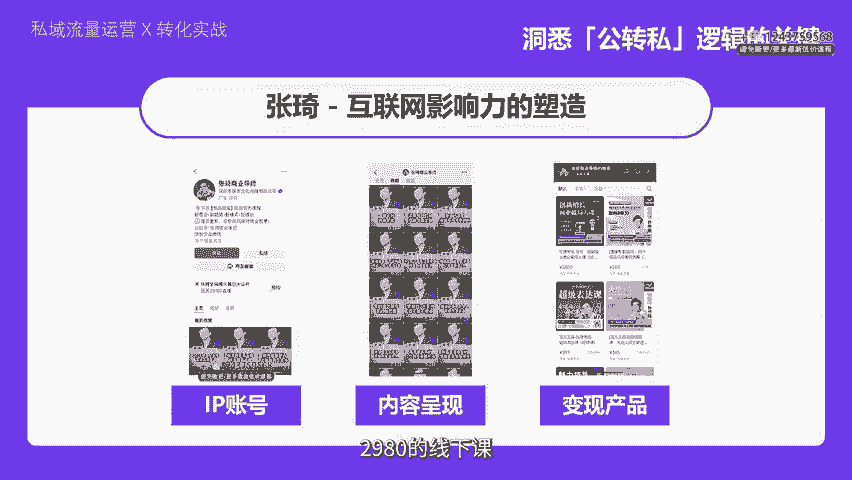

啊，第三阶段，张琪老师就是不断的和IP同框，一个董明珠，一个是江南春江总。让张琪的流量又爆炸了，这是一个共赢的逻辑。董明珠董总的流量认可度非常大。当天，张琪和董明珠同框的直播间在线就有百万的成交。

而且还不算私域的尽量。那总结一下，为什么张琪到现在还没有过期。那有以下几个原因？第一点，张琪本身作为1个IP，他的学习能力非常的强，他可以把当天的各种热点事件输出成自己的观点，用自己的语言表述出来。

并且幽默风趣，还很有个人的特色。第二点，我们博商团队从一开始在做孵化它的时候，就已经决定边孵化边迅速变现，不断的推，不断的去运营，是一个非常正向的循环的过程。这一点非常重要啊。第三点。

因为张琪老师不断的有势能的加持。他和我们有更多博商的致命的IP都同框。而且它的变现效率很高，能够把很多流量都盘活。那有了这么多流量之后，自然就引来了想要学习它去怎么积累流量的用户。

那这促成了线上跟线下两种的课程模式，先在公益平台把第一批交易给拿下。然后我们利用自己的学习平台，把用户带进私域，提供更深层次的服务。在社群里面去做一些活动预告，去实现二次的转化。

那同时呢它线下授课的场景也能够再次成为公寓里面的内容生产池。视频发布出去之后，点赞和观看量都会很高。那公寓提供燃料，给私域思域在灌溉内容给公寓。这样的话就形成一个非常好的闭环。

李阳疯狂英语个人品牌的坚韧复苏，他是如何做到信任再见的呢？大家应该挺熟悉的啊。李阳他可以算得上是个老牌的IP了。最近他在视频号上一些成绩特别的夸张。抖音上也是活的一塌糊涂，这完全说明了IP的魔力。

他的例子给了我很大的启示。只要你以前在观众心里印象深刻，即使过了很长的时间，只要你用得体的操作策略，在视频号和抖音上重新激活那份记忆，加上通过平台的规则去建立了信任之后，就能够形成一个正向的循环。

他自己不也出了很多差值吗？那个家暴的事情，但是重点是他自己承认自己错了。认识到打女人是不对的那这之后呢，他在视频号上就拿着这个标牌说，我是李阳免费教每个中国人英语老态龙钟的站在那里。

你瞅瞅点开他的教学视频，就发现他还是那个老李阳，他没有变啊，我们或许有各种看法，但他还是有铁杆粉丝能够愿意花钱买他的课程去信任他啊，说到信任听说他现在的月销售额已经发了好几番啊，数字非常惊人。

这就是他那一套操作逻辑的一些力量比较经典，那总结起来算是一个比较精彩的案例。接下来要讲的这位电商博主呢，是蒋辉，从卖家到导师的进阶，他是如何运营好私域流量的。蒋辉算是那种老派的电商人物。

起初是教人们怎么在电商平台赚钱的。但是现在。

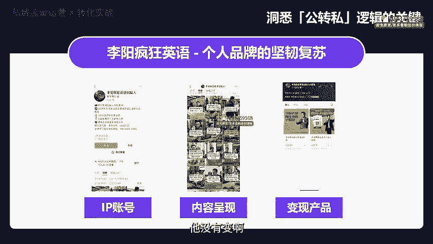

他现在主打的内容变了，转向教电商老板如何进行管理。电商管理这一块的用户分两批人，一批是传统电商老板。比如说像天猫淘宝的一些老板，他们的店铺不再像以前那样去做增长了，也需要管理上去做一些调整，对吧？

等他把这波人培训完，下一个可能就是抖音电商的老板们，那他们终究也会遇到同样的瓶颈。然后说到讲辉的策略，真可以说是教科书式的标准操作。首先是他用信息流的方式去引进私域，这就像养鱼一样，得有鱼塘才行。

然后他通过小红书视频号，抖音这三个平台同步开直播，拉动流量继续养鱼，第三步，他用视频号进行直播，积累了好几千个私域的观众，然后通过这些观众实现转化，或者说从公众平台转向私域操作。

蒋辉老师的产品线和内容量非常的庞大，加上他广告的投放策略和他在行业中的长时间沉淀，储备了百万级的关键资源。

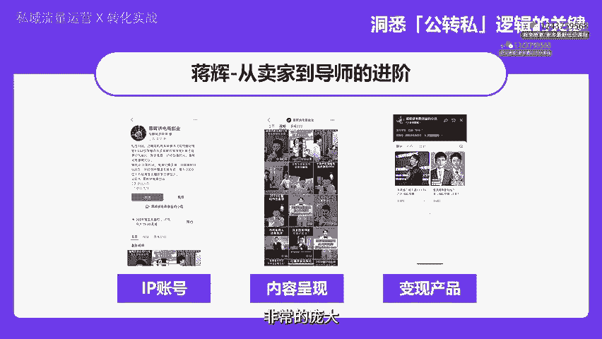

我们为啥在信息流中常常能够看到蒋辉呢？因为人家懂投资呀？至于直播，他其实主要是为了去拉流量，而不是亲自上阵去做直播。所以简单来说，蒋辉这位老师，他是把各种手段和资源运用的非常到位的一位老师。

在电商领域打造了一套高效的运营模式是非常值得咱们学习的。接下来咱们来谈谈这位豪车独老记，他是个大神来的啊，私域营销的剧本大师，有哪些转化策略呢？他呀他是一个私域营销高手，尤其擅长把服务做到极致。

你说厉不厉害啊，连那些传统行业的老板都亲自请他去公司做培训，这得是多认可他的水平。

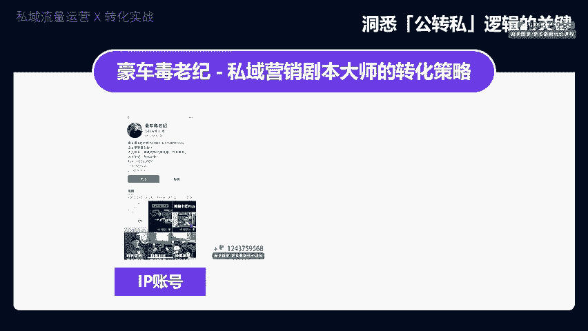

啊，接着呢说到抖音上的营销，他是一个剧本写作天才，他写的一个叫十年体的剧本，阅读量非常的高。那还带来一些不少的私域粉丝，他能够把自己写活，还能够把家人都带活了。那这种剧本营销能够带来暴击的效果。

一发文章就能够拉来一大波，从公众到私域来的流量，持续的输出很重要。但如果你能够在持续的过程中不断的爆发，那业绩就能够成倍的增长。流量就是业绩的心跳，剧本营销做好了，效果绝对牛。当然。

他不仅在抖音直播和内容的创作上每天出新招，他还有私域的服务做后盾，加上对本身IP的塑造，发布个人行程，告诉大家自己比较忙碌，还有一些人生的感悟，而不是一味的去发广告，以及和各位大佬的商业背书。

他吸引了很多高质量的私域客户，这些人都是想在抖音或者是私域上去取得成就的，愿意买他的私董会的服务，愿意和他见面去聊天，甚至能够成为他内容的一些灵感的来源。这个就形成一个循环。他的剧本营销能力很强。

每个月一个营销剧本，在私域上面还能够不断去沉淀高端的用户，流量就像开了挂一样，所以说豪车独老记在私域营销上面，他是真的能打啊，他既会操作又懂得如何利用流量高手级的表现。那我们来看一看商业小纸条。

他有什么精妙的。

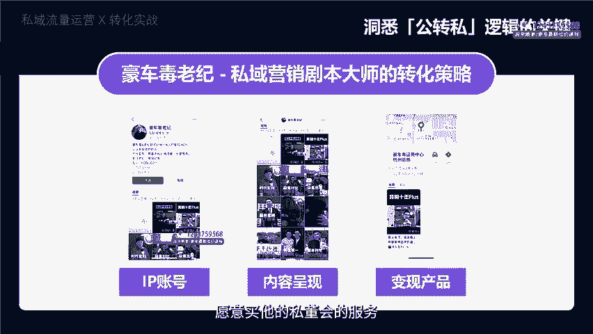

一些公转丝的变现之道呢，他们主要的玩法就是先出手一套好的内容去吸引大量的播放量。那有了这高的播放量之后呢，账号他自然就积累了一群粉丝和相应的权重。那么下一步是什么？他们就开始做直播。

但直播它只是其中一个手段，真正的目的是通过那个小风车，也就是从公众直播引流到私域。那里他可以更加大胆的去进行转化。这些都是他们自己搭建的直播间里面去完成的。简单来说呢。

商业小纸条这一招就是先在公众平台上攒够流量，再利用抖音直播来搞一个从公转丝的转变。转完了吗？没接下来的操作是把人群导入到他们的公众号，然后再引导进私域直播间。在思域直播间里面。

他们就能够通过销售高客单价的产品来实现利润的最大化。所以这套路说白了就是公转私再转私，玩的就是层层递进。那最近他们还有一个新的动作，搞了一个商业的访谈。也就是利用同样的模式来进行流量和变现的双重跳转。

概括起来，就是利用高质量的内容去吸引观众，然后通过一系列的策略，不断深化用户的参与度与购买意愿，最终达到商业上的成功。下一个案例，波波来了，他们主要是探索高价值私域转化。

可以算得上是把公域转私域这个游戏，玩的非常明白的一个先行者。

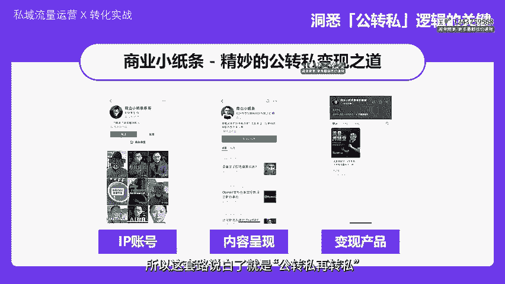

我感觉他是开创了一个新的模式。不过每个人跟着他学的时候呢，都会有一些自己的变化，多少会有一些不一样。讲到波波来了，他一开始是在推1个498的课程，但是这个他没怎么红，为什么呢？因为价格太低了。

价格那么低，要大规模的流量来支撑才行。但是那样的流量不是那么容易得到的。后来他自己改变的策略，做了一个高端的私董会，称之为山顶会，一个座位要价好几万，现在听说山顶会的会员数量已经达到了1500个左右。

这个成绩怎么来的呢？它源自于他那100个销售都是靠着他在抖音上抓来的一些流量进行转化和服务的。而且门票价格也升级了。原先5980的课程，现在涨到了9980。每个销售都会负责一组学员，他们不仅要去做服务。

还要去跟进订单，确保这些人从公寓跳到私域，然后成交。每一个销售负责的桌子上面都会有已经是山顶会的老会员，以及那些还没有转化的新人。这么一来，波波来了，这个公转丝的操作可以是相当深入。

要维持100个销售的话，你必须要有足够强大的需量基础。而且这样的公转丝，需要不断的通过内容创作和广告投放来摸索和适应。可以说是相当激进的一个策略啊。简单来说。

波布来的这个案例呢向我们展示了如何通过不断尝试和优化公域内容，去强化私域运营，最后实现高效转化和盈利的可能。接下来说说我们自己的案例。那接下来讲的是周文强，他是怎么从一个普通销售人员变成企业导师的。

起初当周文强还在做销售的时候，他就结识了很多创业者和企业家。因为他懂得一些财商知识，能说会道的。所以圈了不少的粉丝和会员。到了2016年，他开始进军短视频这一块，特别是在抖音上去创建了不少的账号。

自己直接当起了品牌的代言人。他在这些视频里面去分享各种财经、创业经验等知识，谈吐也风趣幽默。并且还很接地气，还是挺受大家欢迎的。那做视频呢他有自己的方法，一是内容比较正经。他不发一些低俗无聊的内容。

第二个呢就是多样的创新，你不能一成不变。三是跟观众互动。这个他不只是单方面的灌输。当他的粉丝已经超过了一个亿的时候，播放量也超过了千亿，还经常去上热搜。他不光在公益平台活跃。

也在思域做了一系列的内容承接。在公众号小程序上去提供各种的课程服务。比如说是财商的教育，创业培训之类，还直接用微信群，还有一些直播的功能去跟粉丝去实时的互动。不过他真正的厉害之处呢。

我觉得是在于流量的转化上面，将流量变成自己的财富的资产啊，一个是靠他广告去赚钱。二个是去开展电商，然后售卖的书籍，然后包括了一些周边的产品等等。第三是知识付费。

靠自己在短视频和文章里面打造的企业培训导师来吸金，把自己的课程和服务推销给想要提升自己财商和创业技能的人，他还会去打造自己的高客单价课程，那线下培训一起去售卖。那不得不说，周边强在个人品牌打造上。

真的是下了一番功夫的。他有自己独特的风格，每个人他都是不一样的。你要想去学他的成功，还是得找适合自己。

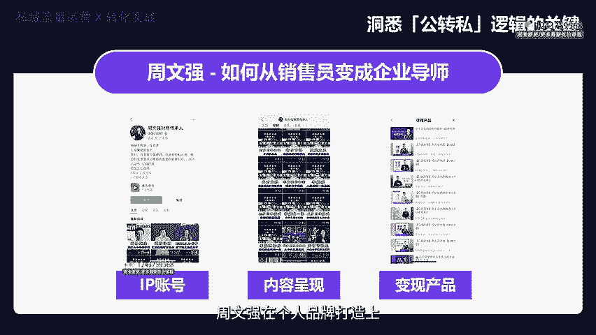

的路好了，我们今天的课程就到这里。那咱们用一个超级快的节奏清晰明了的去讲解了8个案例，帮助大家去理解在公转丝这条线路上面一些基本的业务逻辑。

那我相信现在大家应该对整个公转丝的必要性、重要性和基本的操作流程有一个大概的了解。那我们的第一部分内容就讲完了。那下次课呢咱们会进行第二部分是我们课程的重头戏。

那我们会用一个整洁直接的方式来讲解公域转私域的具体的操作路径，给大家呈现出来，一定要做重点的记录。好的，那咱们下堂课再见。

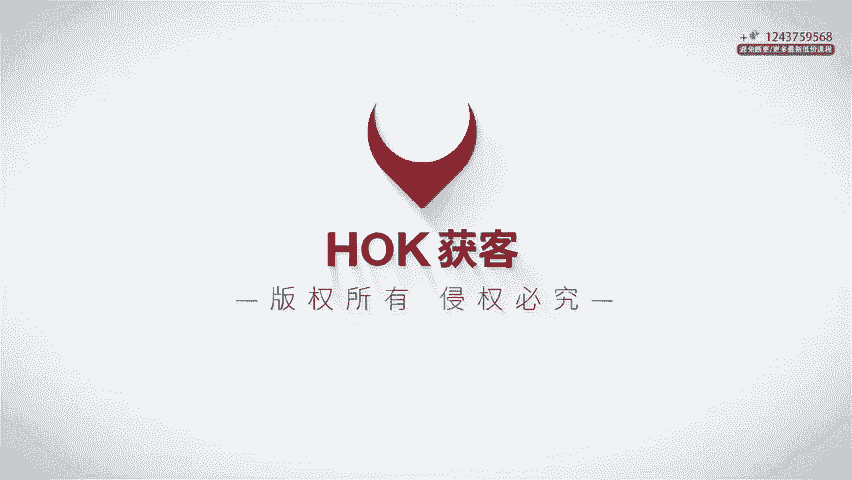