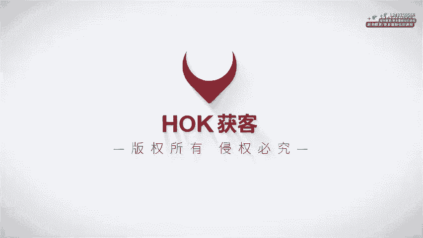
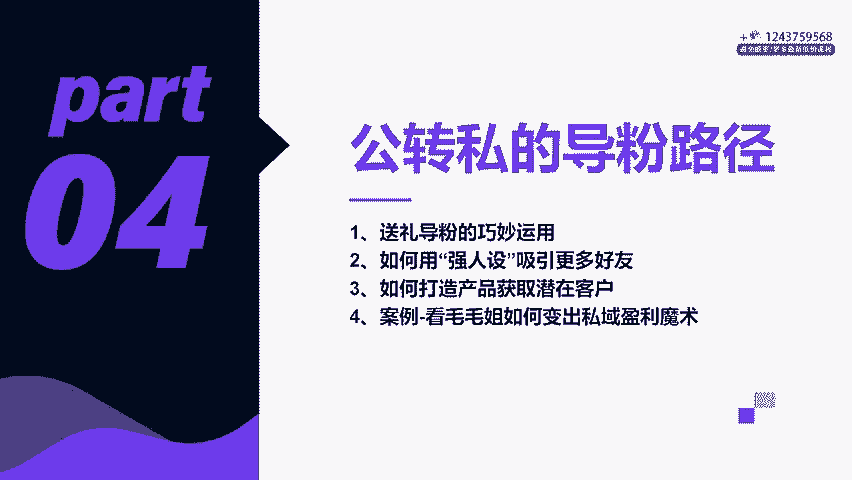
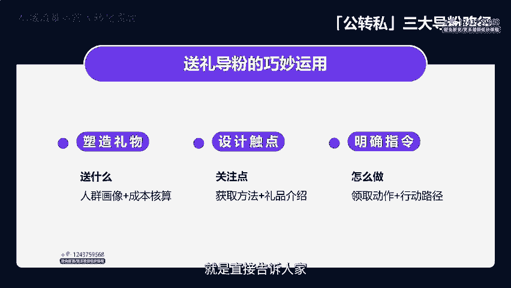
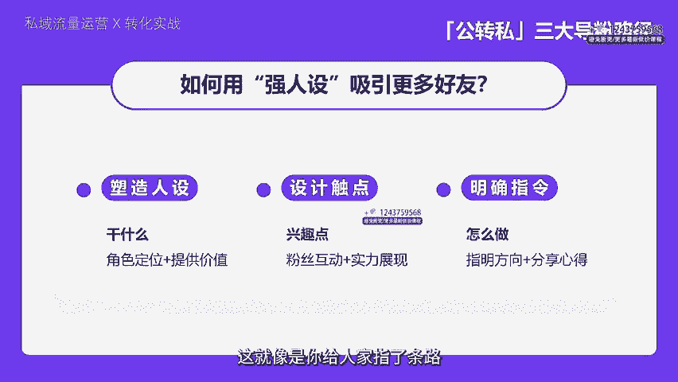
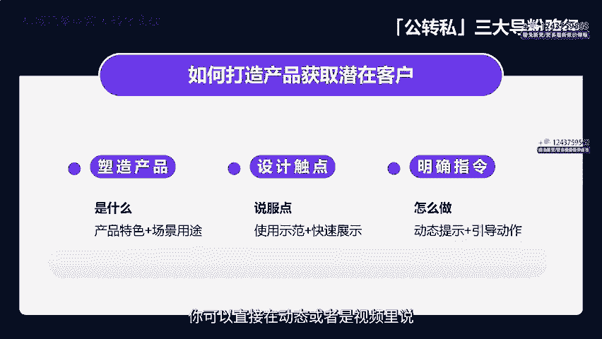
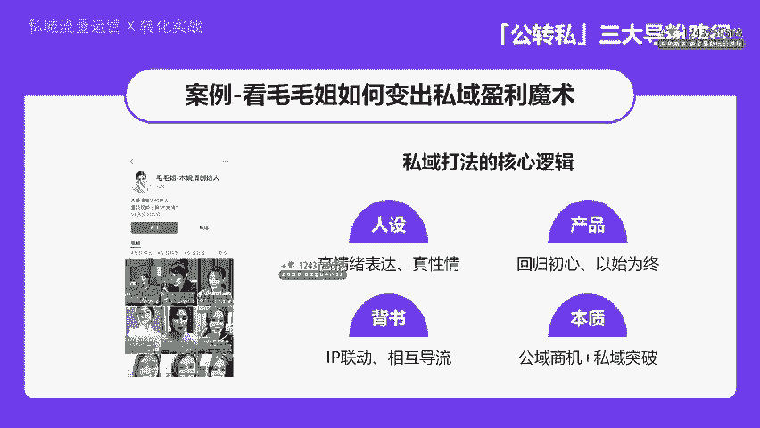
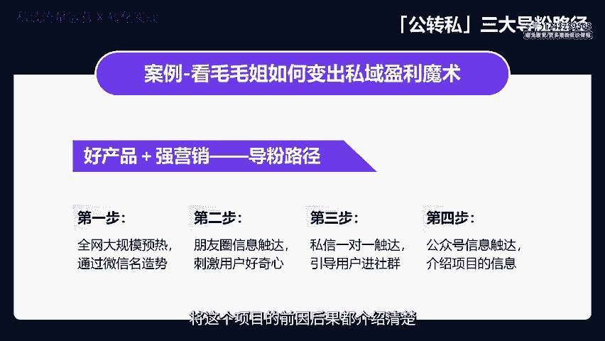
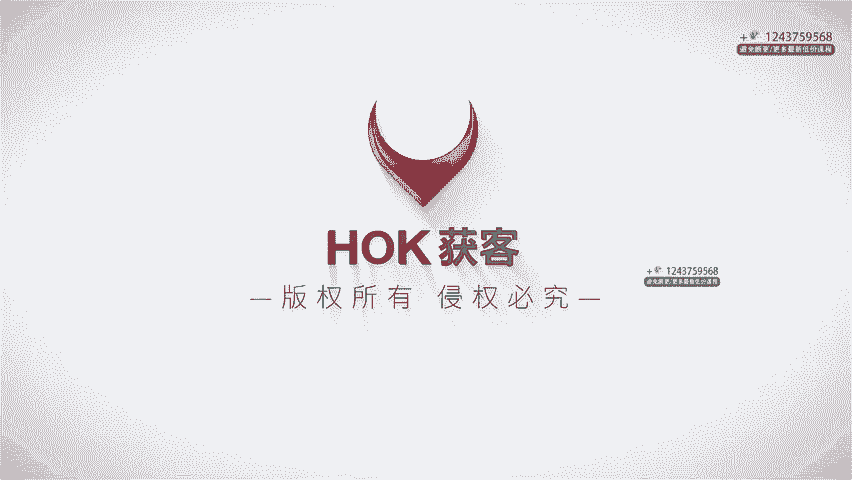

# 私域流量运营与转化实战，私域课程教程 - P4：04章节-公转私的三大导粉路径_ev - 买不起的貂 - BV1p1421r7uB

う。

大家好，我是博商霍客的思域负责人大田老师。我们现在来继续深入的学习。接下来呢我们要关注的是公转私的三大导粉路径。简单来说，这就是我们如何把公共领域的潜在客户有效转化为思域的忠实粉丝的具体的方法。

这三条路径非常的关键，他们直接关系到我们将流量变现的效率。那么让我们一步一步来看看是怎么操作的，确保大家都能够跟上来，搞懂每一个细节。那咱们这就开始吧。关于公转思，先弄明白我们要解决什么问题。第一点。

理解为什么粉丝愿意去加你，咱得给他们一个选择的理由，一种诱因，让他们产生兴趣。他们加你是因为喜欢你还是崇拜你？那又或者是为了捡个便宜，或者干脆就是买东西呢。举个例子，那比如说他们是想参与某个活动。

或者是看上了你的新关注就送礼物。那这些都是我们用来吸引粉丝的物料或者是策略。咱们要搞清楚这个问题。第二点就是粉丝加你的那条路是最直接最简单的那他们是通过首页找到你的。

还是通过私信评论区或者来自于某一个社群呢？那对于那些不活跃在各大型媒体平台的人，那咱们就得找到合适的这样的一个社群，然后在那儿就用咱们的诱饵去拉人。第三点呢就是你是否能够去主动的出击去加粉丝呢？

那比如说你能不能直接去私信他们，或者在群里就直接加他们做好友呢？

打招呼的话方式也是因人而异的。总之，理解清楚了这些问题，咱们就更有目的，更高效的去拉粉丝了。关键是要行动起来。咱们现在来具体分析一下，怎么做，才能够把这些问题的解决方法落到实处。

那首先是怎么用送礼物的方式来吸引更多的人来加你这个过程就有它的技巧。那咱们要好好琢磨一下，怎么送才能够让人够喜欢。那送梨捣粉对不对？那说白了就是通过送东西来吸引更多的人来关注你，加你的好友。

这里面的门道还蛮多的。那咱们要先去塑造一个好的这样的一个礼物，买什么，那送什么这个得好好琢磨一下，不能够随便来。你得先去了解你的目标人群是什么样的一个人群画像。那根据他们的喜好来挑选礼物。

比如说你要去吸引的是一群喜欢美妆的小姑娘，那你去送一点热门的口红或者是面膜这一类的应该是没错的那当然啊还得考虑一下成本的预算，别送了太贵重了，要不然你负担不起，对吧？再来呢就是去设计触点，那触点是啥呢？

就是能够让别人注意到你的地方。比如说你可以在配文里面提一提点赞加关注，你就有机会获得精美的礼品哦。那或者在评论区回复，感谢关注礼品等你来了。置顶视频也是一个好的地方，可以专门的去做个介绍。

去介绍这个礼品的一个视频，让大家一目了然。主页签名也可以把它利用起来，写上关注有好礼，别错过之类的。还有就是一个是弹窗的视频，一打开就能够看到那种也是个不错的触点。最后呢就是明确指令这一步很简单。

就是直接告诉人家该怎么做，才能够拿到礼品。

比如说私信我领取礼品或者是按置顶的视频的要求去操作，即可获得礼品。这样的话大家就很清楚了，也更容易行动起来。那比如说假设你是一个卖护肤品的微商，想通过送礼导粉来吸引更多的人来加你的微信。

是不是就可以去挑一些比较受欢迎的护肤品小样作为礼物呢？然后再去朋友圈发一条动态，免费送，只需关注我并转发这条动态去你的朋友圈，就可以私信我领取价值多少钱的护肤品的小样一份数量是有限的，那需要先到先得。

这样一来，关注你的人多了，转发的人也会变多，你的曝光率自然就会上去。而且因为送的是护肤品的小样，它的成本它不会很高。所以对你来说是一个非常划算的一个买卖。再比如说假设你是个抖音达人。

想通过送礼导粉来吸引更多的人关注你的账号，那你可以挑选一些比较有趣的小玩意儿作为一个礼物。比如说像这种解压球啊，或者是一些迷你的风扇，对吧？大家可能都有这种小的需求，然后再去抖音上发布个小视频。

宠粉福利，关注我并点赞此视频，即可在评论区留言，去领取这个神秘的小礼品一份，所以大家快来参与吧。那视频里面可以去展示一下礼品的样子和使用方法，让大家更感兴趣，这样一来，关注你的人多了。

视频的点赞和评论也会变得更多。那你的账号就会更爆，对吧？好的，那接下来咱们要讲的呢就是怎么用强人设这招来去吸引更多的人加你的好友。首先你得好好的去打造一下自己的人设，也就是你要让大家知道你是干什么的。

你能够给大家带来什么好处。比如说假设你是个时尚达人，那你的人设就可以是时尚潮流引引领者。😡，帮你去穿出自己喜欢的风格。然后啊关键来了，你得设计一些触点，让大家更容易去注意到你对你去产生兴趣。

这些触点就像是你在网上留下的脚印，得让人家顺着脚印找过来，比如你的配文触点，可以发一些时尚搭配的一些照片，配上这样穿，你也可以很时尚这种类型的文字，评论的触点呢是什么？就是得多跟粉丝去互动。

回答他们的问题，给他们去点赞，让他们感受到你的热情和专业置顶视频的触点是什么呢？就是可以放一个你讲解这个时尚趋势或者是搭配技巧的这样的一个视频，让大家能够看到你的实力，关注主页签名的一些触点。

那可以写上时尚不分年龄，每个人都能够找到自己的风格，这样的励志的语言，弹方的这个视频的触点是什么呢？就是那些你打开就能够吸引人的一些短视频，比如就快速换装。秀之类的。

这样就很快它就会有一个呈现对比的效果啊。那最后呢别忘了给出明确的指令，这就像是你给人家指了条路，还得告诉他们怎么走。

你可以直接在动态或者视频里说，喜欢我的搭配就私信我吧，一起探讨更多的时尚的心得。这样粉丝就知道下一步他该怎么做了。总的来说呢，用强人设去吸引粉丝这件事情的关键是你得让大家知道你是谁。

你能给大家带来什么好处，并且留下一些易于发现的触点，让大家找到你。假设你是个擅长做美食的博主。你的人设可以是美食制作达人，教你做出餐厅级别的这种美食。

然后你可以在社交媒体上去发布一些制作美食的照片和视频，配上详细的制作步骤和技巧讲解，在评论区里面去多跟粉丝互动，回答他们的问题，并且给出你的建议。那你还可以再置顶一个你制作某种特色菜的视频教程。

或者是设置一个专门的美食制作栏目，在主页签名里面进行引导。这样一来二去的大家对你的印象就深刻了，也更容易对你产生兴趣，并且加你为好友。那最后我们来看一个比较实用的方法。那通过展示你的产品的特色。

吸引更多的人主动来加你这个方法的关键有三步。那首先呢你得把产品的独特性给塑造出来。也就是说你得让大家知道你的产品跟别人不一样在哪里。它到底能够解决什么问题？比如说假设你卖的是一款智能手环。

那它的独特性可能就是能够实时的去监测健康情况，还能够提醒你该运动了，或者是该休息了。这样一来大家就知道，哎呦这个手环不错呀，能够更好的去帮我管理健康。然后呢，跟之前说的一样，你得设计一些触点。

这些触点就是让大家能够更容易的去注意到你的产品，对你产生兴趣的东西。比如说配文触点，你可以发一些关于手环如何改变生活的小故事。那评论触点是什么？你就是多跟大家去互动。那回答他关于手环的一些问题。

那怎么去设置视频的触点呢？置顶视频的触点，那可以放一个你亲自示范，如何去使用手环的一个视频。那主页签名的触点，那可以去写上健康生活，从智能手环开始，类似于这样的宣传语。那弹出来的视频呢，那的触点是什么？

那就是用简短有力能够快速展示手环功能的这样的短视频。那最后一步就是给出明确的指令，你可以直接在动态或者是视频里说，喜欢这款智能手环的朋友快来私信我吧，或者是可以联系我。那了解更多优惠信息。

这样粉丝就可以知道下一步该怎么做了。

再比如说假如你是一个卖环保水杯的商家，你可以通过社交媒体去发布一些关于环保水杯如何减少塑料污染。环境保护的这种内容。那配上一些精美的图片和视频。在评论区里面，你可以积极的回答粉丝的一些问题。

比如说材质啊、容量啊、价格啊等等。那你还可以置顶一些展示水杯多功能或者是环保材质的一些视频教程。在主页签名里面也可以写上为地球贡献一份力量。从使用环保水杯开始的一些宣传语。这样一来。

大家对你的环保水杯具有了更深刻的印象，也更容易产生购买欲望，并且主动加你为好友。那刚才呢我们学习了三种很实用的倒粉的方法，送礼导粉、人设倒粉和产品导粉。

那这三个方法其实在我们的各个行业里面都能够运用得到。那能够帮助我们更好的去吸引和留住客户。这些都是细节，但都蛮重要的啊。那接着我们来看一看在抖音上比较火的毛毛姐，它单平台粉丝量600多万。

一年变现几个小太阳。女性成长创业相关的内容经常出现爆款视频。这种账号从招商到私域的打法，核心逻辑是什么？在公转丝的路径上，又是如何巧妙设计的呢？首先是人设的树立，你看他的视频啊。

就能够给我们最直观的感受是什么呀？是情绪对吧？并且是高情绪的表达。我们看过很多类似的博主，这种内容特点都是带着故事出场的。比如为什么不愿意帮穷亲戚脸面重要吗？

等这种爆款视频这种内容就能够激发起观众的好奇和共鸣，给大家去塑造一种真性情的人设，接着就是产品的打造。回归到粗心上面，我们做IP是为了什么变现，对吗？他变现的是穆皖清的产品，通过流量到私域招商。

链接B端和C端的用户。每天从抖音获客上千个客户，所以去年他们能够做到单月营业额5000万以上，让粉丝根据公益平台的内容去了解IP的自身，了解产品和项目。毛毛杰不止一次在直播里说明他做了IP有了流量以后。

代理商和直营客户都被放大了很多倍。这就是以始为终，想好用什么产品变现，再开始你的IP之旅，还有就是个人的背书，他在抖音上的人设是一个女企业家，生哥和老季在毛毛姐的起号阶段都在帮他出境做联动。

这也是很多博主惯用的手法，账号之间相互导流，还能够在短时间内把人设去立住。毛毛姐是我认为在大健康赛道非常成功的女IP从木晚清到减脂教练，再到报抱日记，繁星计划，明德商学产品加矩阵的模式都做出了结果。

最后一点也是最重要的。本质上，毛毛姐是看到了公寓平台的巨大潜力和商机。通过减纸教练这个私域项目的成功操盘，完成了思域转化的巨大突破。

他带着团队做减纸教练项目的发售，10分钟，业绩就已经3000多万。那48小时之内回款破4000万，成功创造了一次全网营销的标志性的事件。这是基于一个好产品加强营销之下取得的成就。

那么具体的倒粉路径是怎样的呢？首先，推出这个项目之前，毛毛姐思玉团队就将剪纸教练这个项目做了全网大规模的预热。接着用微信名去造势，所有私域项目负责人的微信名都改成了剪纸教练项目。16日招募开启。

通过微信名信息的传递，让所有的用户注意到这次的大事件。下一步就是朋友圈的信息触达。私域负责人每天在朋友圈发出公告。核心内容为毛毛姐推出互联网营销，减纸教练项目，想了解进群，但是全程不说项目内容是什么。

只透露搞大事，或者是要有一些大福利等等这些信息。去刺激用户的好奇心，强烈的想要入群围观。然后开始进行私信的一对一的触达，对过往已购莫万清或者是了解莫万清的用户，发起一对一的私聊。

告知用户接下来会有怎样的项目敬请入群关注。那第四步呢就是公众号信息的触达。通过公众号内容将这个项目的前因后果都介绍清楚，让用户全面的去获取有效的信息，去促使客户去做决策。那通过以上四步呢。

我们就完成了流量端口的信息触达。3天的时间，拉起了32个500人的大群，相当于拥有了1个1。6万人的精准流量池。

那用户聚拢起来以后呢，毛毛杰就开始用直播去促成交，这相当于一场万人的会销。社群成为了一个会场，直播间是个舞台，毛毛杰在台上演说，减纸教练项目的用户将收到怎么样的权益。

同时呢所有的思域负责人一对一去跟进客户，了解用户的需求，解决用户的卡点进行促单。一场直播有1。4万多人观看，平均观看时长近一个小时，直播3小时结束，他收到了3000多万的回款。那直播结束后立马复盘。

每一位思域负责人提交自己的成交数据。比如说多少人报名了，成交了多少，过程中遇到了什么问题，总结不成交的原因。那第二天，毛萌姐在加播一场，专门针对这些不成交的卡点去逐一突破。48小时又做到了回款破千万。

那招募到3000多名减纸教练之后，又做到了回款超过了一个亿。那至此，这一次的思域操盘圆满结束。很多人想问毛毛姐的营销密码是什么？整个私域闭环是怎么设计的？😡，很显然，它就是将通过个人的IP的打造。

创造了属于自己的世界。未来将会是一个超级个体的时代。也随着女性力量的崛起，越来越多的女性开始进军商业世界，不仅是为了积累财富，实现经济自由，更多的是为了实现自己的人生价值。当然啊，不管是谁。

他操盘哪个项目，只要我们能在公转私的路径设计上面，通过精心打造爆款的内容，去吸引潜在的用户，去借助IP专业的人设塑造去建立起信任，再利用独特的产品优势去吸引客户主动去加入，用这一系列的策略的运用。

让我们与用户之间建立起稳固的关系。用好这种综合性的路径设计思路，相信我们就能够取得收获。也希望呢能够通过学习我们的思域的知识，也能够给大家去提供一个值得借鉴的灵感。那当我们掌握了导粉路侵的设计之后。

下一步就是如何去做好粉丝的留存了，我们下堂课见。🎼。

