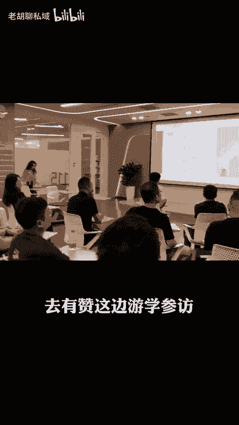
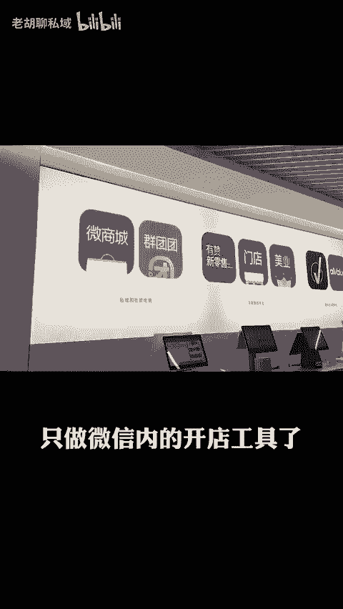

# 私域直播，两年内绝对大爆发 - P1 - 老胡聊私域 - BV1ysb9e4EZE

私域直播啊，我个人感觉啊这两年有很大的概率会起来。保守点说，这个概率啊估计会超过80%。想起直播啊，大家都可能比较熟悉。毕竟从2016年淘宝首创购物直播到今天也都有8年的时间了。尤其是2020年以后啊。

抖音直播，快手直播，包括视频号的直播啊都在飞速发展，现在就连小红书和B站都开始把重心往直播带货上转移了。不过啊我上面讲的那些直播呢都属于公益流量的直播。也就是说你的直播必须在这些公寓平台内进行。

你直播间流量的多少，不是你说了算啊，而是抖音、快手、淘宝这些大平台说了算，同时啊还需要接受这些平台的监督和管理，但凡有一点违规，不者说你说的违禁词，你的直播间不仅没有流量，还很大程度上会被关屏。

可以说绝大多数做公寓的直播的。对于这些直播平台啊是既爱又恨爱的是，他们可以给你带来巨大的平台流量。同而让你有机会。啊发家致富，恨的是一不小心啊，你不知道你说了个啥，你的直播间啊就会被封禁。

流量啊瞬间清零。上周五啊，我组织了我们这边自会的成员去有赞这边游学参访，现在有赞呢已经不是当年那个只做微信类的开店工具了。那们现在产品线啊非常的丰富。其中有一个私域直播的能力，我当时听完了眼前一亮。

而且很兴奋，尤其是在公域直播啊越来越卷的今天，我觉得接下来两年啊，私域直播一定会成为绝大数商家的标配。因为现在公益平台流量啊已经让商家吃不消了。所以大家都在怎么想着把流量导到私域。

那在私域里面到底怎么运营呢？除了传统的一为一私聊啊，拉群发单和朋友圈之外，通过直播的方式运营私域啊，我觉得将是个非常提高效率的选择。尤其是在很多公寓平台里面不能讲的东西。比如一些敏感词啊。

甚至是场景内容啊等，这些在私域直播里啊将会放开很多，懂的商家啊自然都懂，我实在不方便讲太多啊，而且私域直播。

还支持用户的分销转发。也就是说你可以发展一波分销用户，作为你的私域分销员，帮助直播间转发到相应的社群和朋友圈里面去，从而帮助你获得更多的啊直播间的流量。

而这些分销者呢也能够在啊这个成交以后呢获得分销佣金。在这里啊是不是觉得私域直播比较牛逼啊？未来会不会成为绝大多数商家的标配。其实啊还有很多功能啊，因为时间关系我这里就不多说了，会不会有机会啊再和大家聊。

