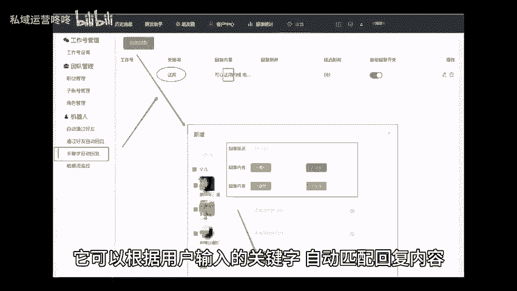
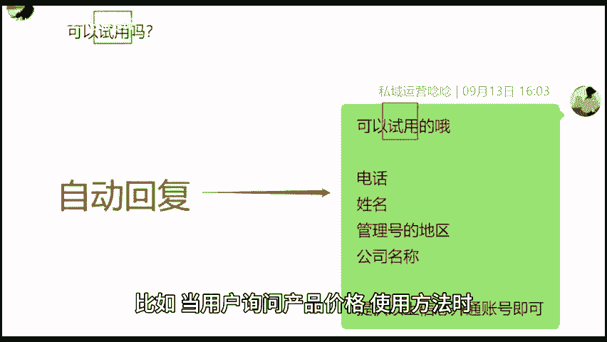
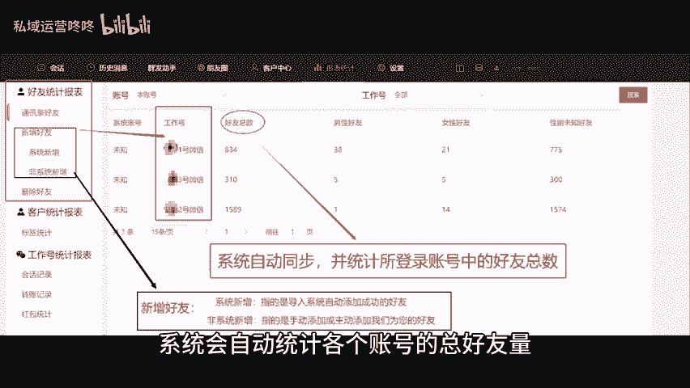
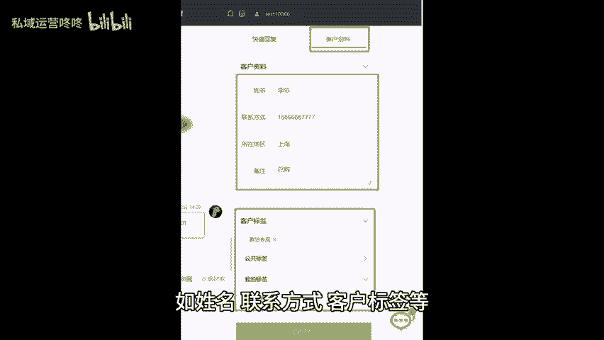

# 私域管理不再难！这个工具，让你的管理更轻松！ - P1 - 私域运营咚咚 - BV1gjpje2Eik

🎼在这个思域盛行的时代，很多人都运营着多个微信账号。那么怎样才能更好的管理这些账号呢？今天我将为大家介绍一款私域管理工具，它能帮助你提高思域的管理效率。一、多账号聚合同一界面，通过这款工具。

你可以将多个微信号聚合，在同一个界面中进行聊天。这样你就不再需要频繁切换账号，以及大地简化了账号管理流程，不仅提高了工作效率，还能减少信息遗漏和错误回复的可能性。2、关键字自动回复。

它可以根据用户输入的关键字自动匹配回复内容，比如当用户询问产品价格使用方法时，你可以设置相应的自动回复，确保用户能迅速得到想要的信息。3、自动统计好友报表，系统会自动统计各个账号的总好友量。

新增或删除好友，帮助你全面了解用户动态，及时根据新用户了解流失用户的原因，并制定相应的策略进行挽回。除此以外，你还可以在系统为用户填上详细的客户资料，如姓名联系方式。😊。

🎼标签等，以便后续跟进和营销推广。无论你是刚入门私域还是经验丰富的老手，相信这款工具都能为你带来便利，快快试试吧。😊。

