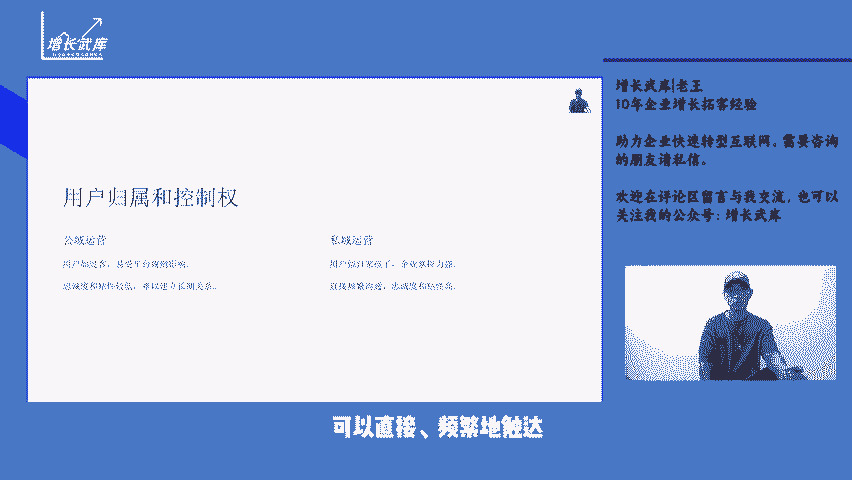

# 私域运营与公域运营有何不同？ - P1 - 增长武库-老王 - BV1YLeFeaEP8

大家好，我是你们的废物朋友老王。今天讲私域营销的第三讲私域运营和公域运营看似都在围绕着用户做文章，但实则存在着诸多显著的差异。从用户的归属和控制权来看，公寓运营中的用户如同过客。

企业对其的掌控力相对较弱。这些用户往往是因平台的流量分发机制而偶然接触到企业的产品或服务。他们的忠诚度和粘性较低。一旦平台的规则或算法发生变化。企业可能会瞬间失去与这些用户的联系。

而私域运营中的用户则仿佛是企业的自家孩子，企业对他们有着更强的掌控力，可以直接频繁的触达用户的忠诚度和粘性相对更高。在流量获取方式上，公寓运营主要依赖平台的自然流量和付费推广来获取用户。

比如在电商平台上购买关键词广告，参加平台的促销活动等，这需要企业不断投入资金，以维持流量的获取，但竞争激烈，流量成本不断攀升。相比之下。

私域运营的流量更多来自于用户的主动关注口碑传播以及企业自身的引流策略。例如通过线下活动引导用户加入社群或者利用内容营销吸引用户关注公众号的，在用户数据的利用方面，公寓运营中，企业所能获取到的用户数据。

较为有限，且多为宏观层面的数据难以深入了解用户的个体行为和偏好。而私域运营能够让企业收集到更丰富、更细致的用户数据，包括用户的消费习惯、兴趣爱好、社交关系等，从而为精准营销和个性化服务提供有力支撑。

从营销成本的角度而言，公域运营的成本通常较高，特别是在竞争激烈的情况下，为了获取更多的曝光和流量，企业需要不断投入大量资金。而私域运营虽然在初期的搭建和引流阶段，可能需要一定的投入。

但一旦私域流量时形成后续的运营成本相对较低，且效果更为持久。在用户关系的维护上，公域运营往往难以与用户建立深入的情感连接，更多是基于产品或服务的交易关系。私域运营则侧重于与用户建立长期稳定的关系。

通过持续的互动和服务，提升用户的满意度和忠诚度。在运营策略的侧重点上，公域运营注重的是快速获取流量和实现转化，强调的是大规模的推广和曝光。私域运营则更注重用户的流程和复购。

通过精细化的运营和个性化的服务，不断挖掘用户的价值。总的来说，私域运营和公域运营各有特点和优势。企业应根据自身的发展。

段和业务需求，合理配置资源，实现两者的有机结合和协同发展。不知道您对私域运营和公域运营的不同是否有了更清晰的认识。如果还有疑问或者想要了解更多相关内容，欢迎在评论区留言，也可以关注我的公众号增长5。

