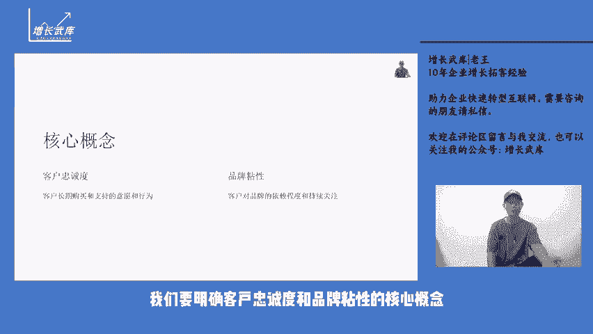
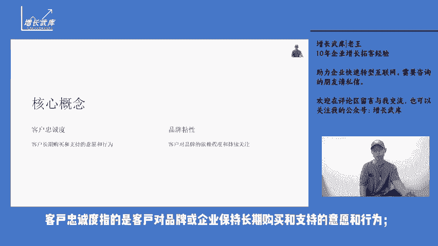
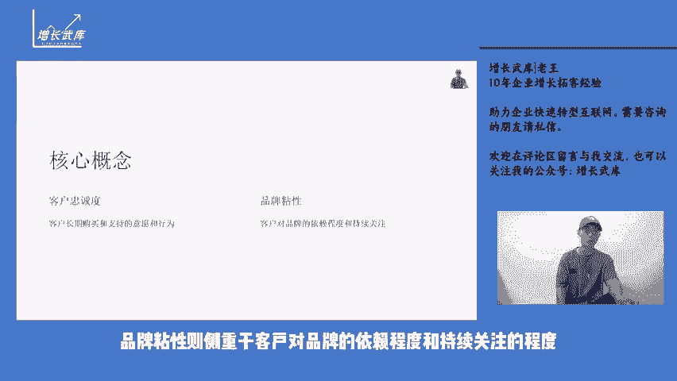

# 私域运营如何提高客户忠诚度和品牌粘性？ - P1 - 增长武库-老王 - BV1B8WDeZEmB

大家好，我是你们的废物朋友老王。今天讲私域运营的六讲私域运营如何提高客户忠诚度和品牌粘性？在当今的市场环境中，私域运营对于提高客户忠诚度和品牌粘性具有作用。私域运营并非简单的客户管理。

而是一套策划、执行和优化的系统工程。我们要明确客户忠诚度和品牌粘性的核心概念。客户忠诚度指的是客户对品牌或企业保持长期购买和支持的意愿和行为。品牌粘性则侧重于客户对品牌的依赖程度和持续关注的程度。

那么如何通过私域运营来实现这两个目标呢，一、提供个性化的服务和体验，在私域运营中，我们能够获取大量关于客户的行为偏好等数据，通过对这些数据的分析，为每个客户定制专属的服务和体验。比如。

根据客户的购买历史和浏览记录，为其推荐符合其兴趣和需求的产品或服务，据相关数据显示，个性化推荐，能够使客户的购买转化率提高20%以上。2、建立有效的会员体系设定不同的会员等级和权益。

让客户在消费过程中感受到逐步升级的优惠和特殊待遇。例如高级会员可以享受优先配送专属客服等服务。同时通过。

积分折扣等方式激励会员的持续消费。有调查表明，拥有完善会员体系的企业，其客户的复购率平均能提升3%3、持续输出有价值的内容。这包括产品使用教程、行业资讯、生活小贴士等，通过优质的内容。

增强与客户之间的互动和信任。比如一家美妆品牌通过定期发布专业的美妆教程，吸引了大量粉丝的关注和参与品牌的知名度和美誉度都得到了显著提升。自举办各类线上线下活动，线上可以开展抽奖、互动问答等活动。

线下组织会员聚会、新品体验会等这些活动不仅能够增加客户的参与度，还能让客户更深入的了解品牌文化和产品特点，要注重客户反馈和投诉处理，及时有效的解决客户的问题，能够让客户感受到被重视和尊重。

从而增强其对品牌的信任和忠诚度。自域运营是一个长期而持续的过程，需要我们不断的优化和改进策略，希望大家能够在实践中不断探索，提升客户忠诚度和品牌粘性。如果您对思域运营，还有更多的想法和见解。

欢迎关注我的公众号增长五库或者在评论区留言分享，我们一起交流进步。