# 私域运营的主要目标是什么？私域运营怎么做？私域运营的核心目标可以归纳为三个关键词：精准、互动、转化。 - P1 - 增长武库-老王 - BV1b8YregECA

大家好，我是你们的废物朋友老王。今天我们讲思域运营。第四点核心目标。思域运营的核心目标可以归纳为三个关键词，精准互动转化精准就是企业需要通过数据分析，深入了解用户的需求和偏好。

为他们定制专属的内容和服务。企业必须具备强大的数据收集与分析能力，并理解用户行为，比如一家服装企业如果能掌握用户的颜色喜好、款式偏号、尺码信息以及购买频率和消费能力，就可以为用户提供精准的产品推荐。

而不是盲目推送无关的商品。互动是用户的双向沟通，企业要有效传递信息，要听用户的反馈建议，建立信任关系，这需要企业具备快速响应能力和灵活调整策略的能力。比如，当用户在社群中提出问题时，企业要及时回应。

当用户指出产品问题时，企业应迅速采取措施进行改进，以提升用户的忠诚度，转化是思域运营的目标，转化率的提升，意味着用户对企业的认可和购买行为的增加，需要运用营销策略、专属待遇，个性化推荐。

确保用户看到感兴趣的。这些措施都能引导用户购买，从而提高转化率，实现这些目标的关键在于建立一套。

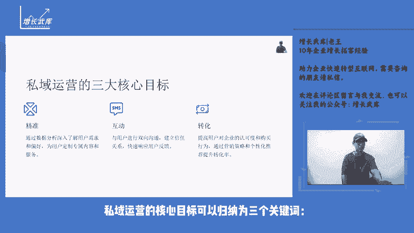

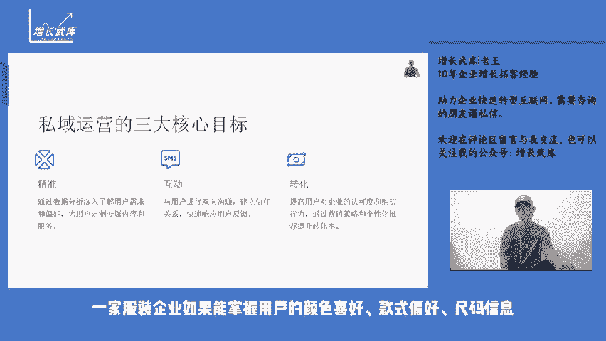

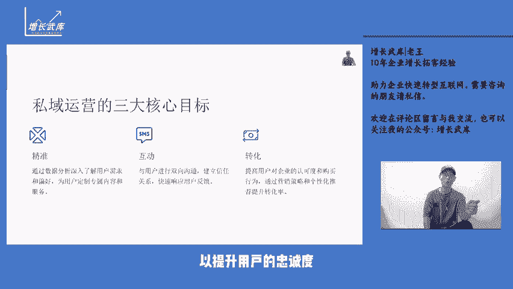

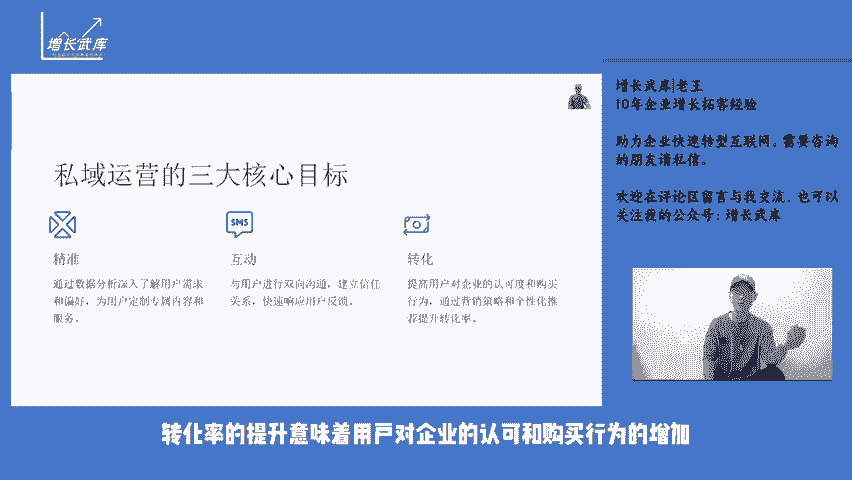

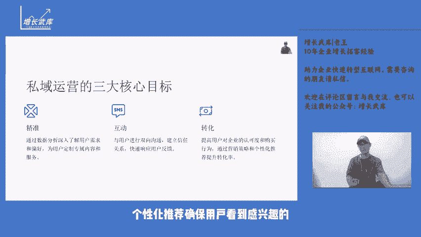

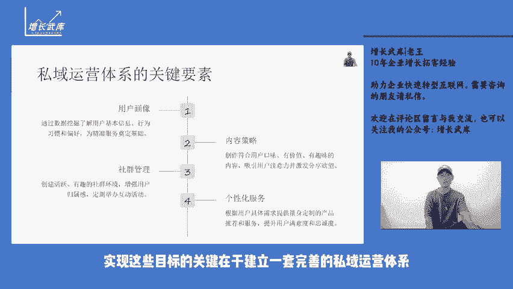

完善的私域运营体系。用户画像是这个体系的基础。通过数据挖掘，企业可以了解用户的基本信息、行为习惯和偏好，如性别、年龄、所在城市及购物时间等。这些信息有助于企业为用户提供更有针对性的服务。

内容策略则是吸引用户的关键内容不仅要符合用户的口味还要有价值、有趣味，才能吸引用户的注意力，激发他们的分享欲望。简单的广告推送往往会被忽略，而有干货的内容更能打动用户。社群管理是运营中不可或缺的一环。

一个活跃有趣的社群环境，能让用户产生归属感，进而愿意长期留在社群中。通过定期举办有趣的社群活动，可以加强用户之间的互动，也让企业更好的与用户保持联系。个性化服务则是提升用户体验的有效手段。

根据每个用户的具体需求，为他们提供量身定制的产品推荐和服务，能显著提高用户的满意度和忠诚度，效果评估是确保运营策略有效性的手段，通过定期评估私域运营的效果。企业可以根据数据反馈，及时调整策略。比如。

如果某个活动参与度不高，企业需要分析原因，并迅速做出改进，以保证运营效果的持续优化。私域运营是一场长期的战役。

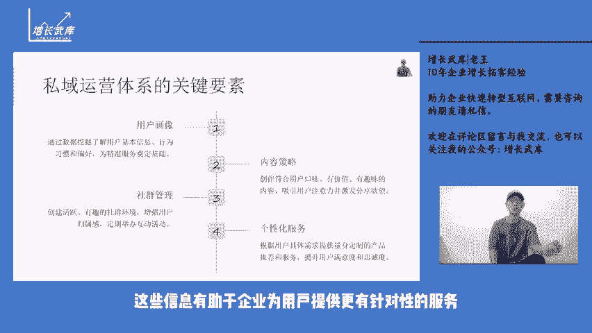

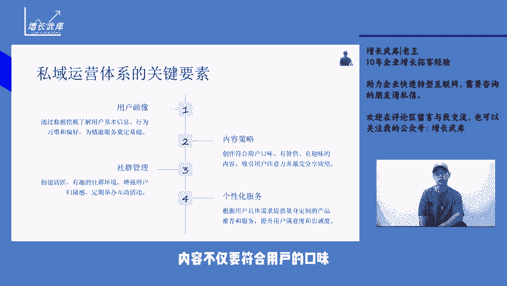

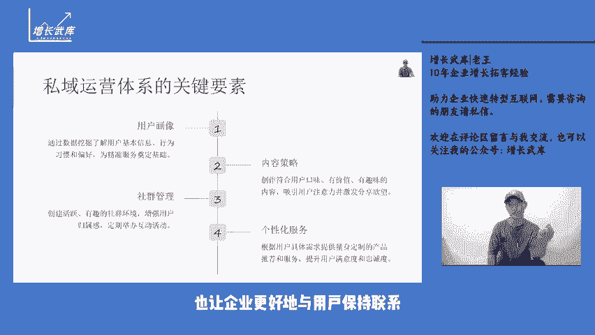

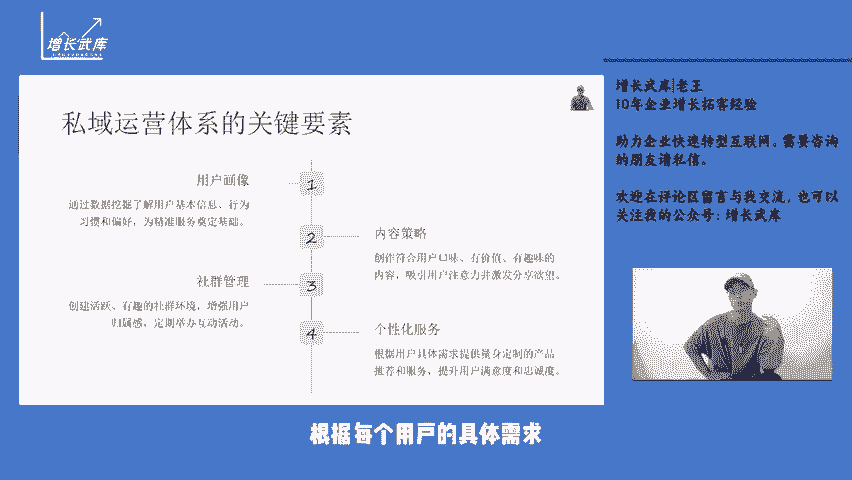

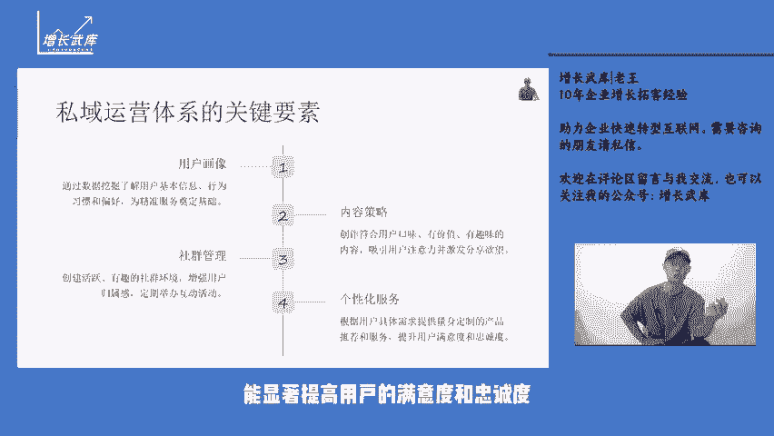

企业需要不断的投入和优化。在这个过程中，企业能够逐步积累用户资产，形成具有持久竞争力的优势。如果您想了解更多私域运营的知识和实战经验，欢迎关注公众号，增长五库，期待您的留言和分享。

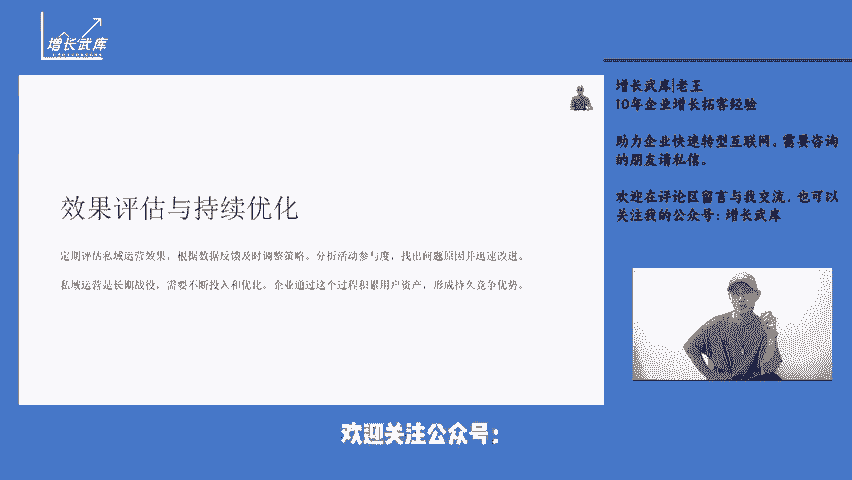