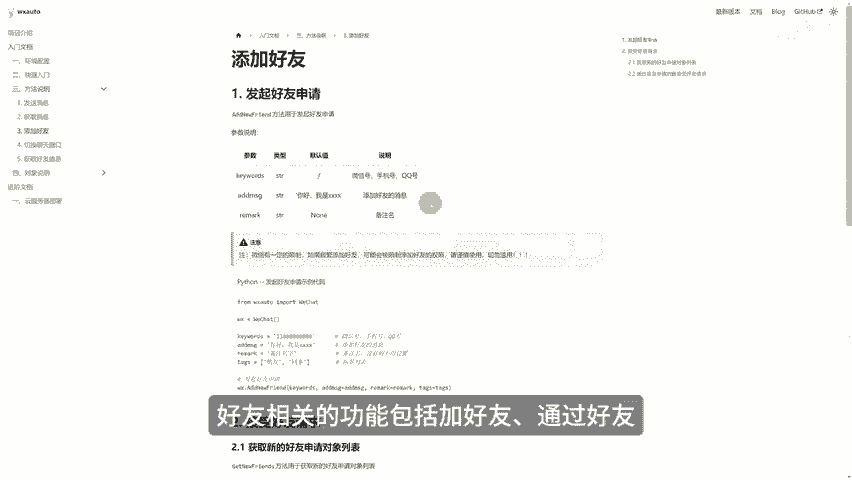
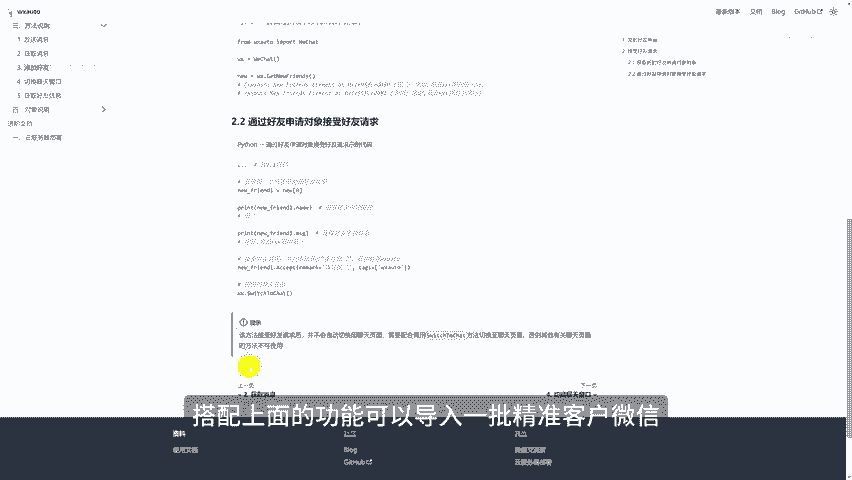

# 私域运营自动化神器，轻松管理上万私域客户 - P1 - 二分之一的子木 - BV1zBC2Y1Ez4

自动回复批量加好友，批量发送定制化消息，提取微信群指定消息，凡是能想到的私域运营手段全部可以借助这个开源项目来实现。它可以发送文字消息，也可以发送图片视频等文件消息。不仅可以给指定联系人发消息。

也可以在群聊中指定某一个人。它可以获取文字消息，以及保存图片、文件、语音转文字内容，而且可以实时监听消息。当某些人给你发送消息的时候，无论是个人还是群聊，可以第一时间知道搭配上面的发送消息。

可以实现微信自动回复功能。好友相关的功能，包括加好友通过好友搭配上面的功能可以导入一批精准客户微信。然后自动加好友发送特定消息，并自动回复。好，本期视频就到这里，关注我，后续还会分享更多实用工具。

