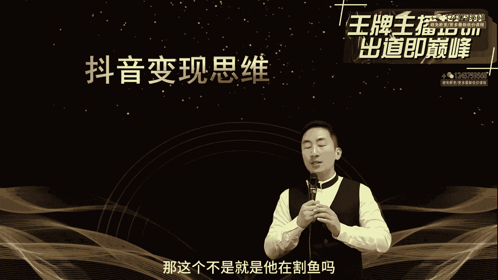
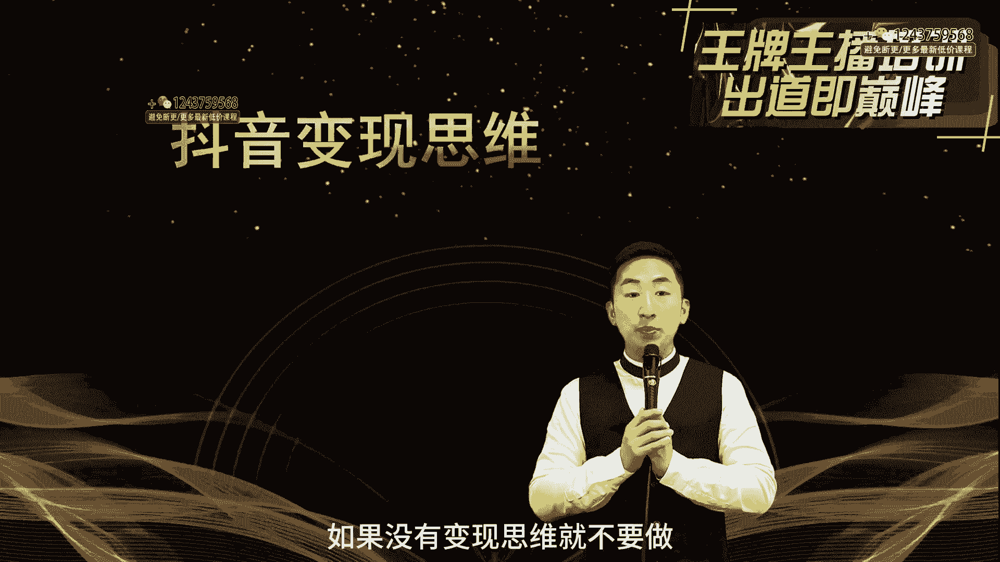
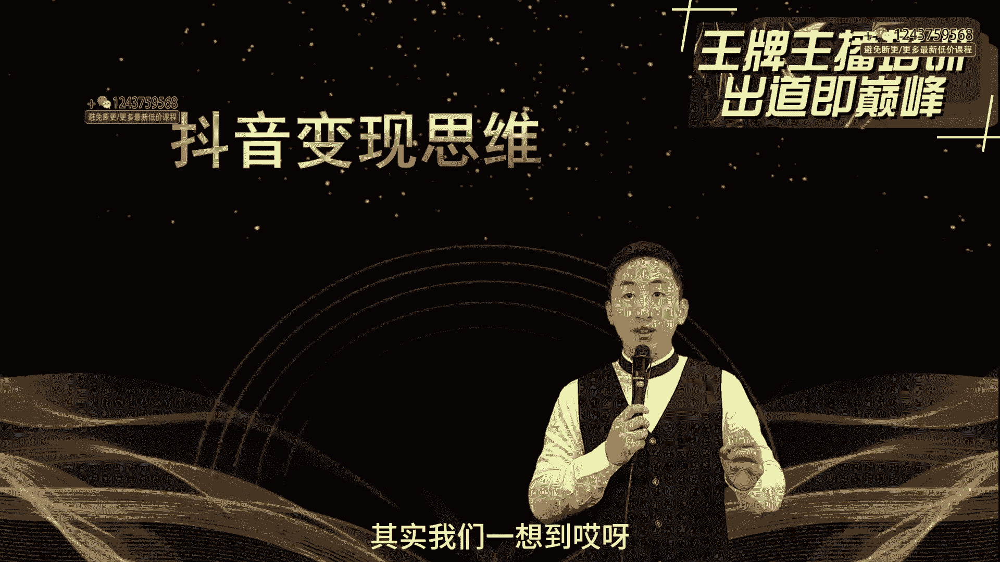
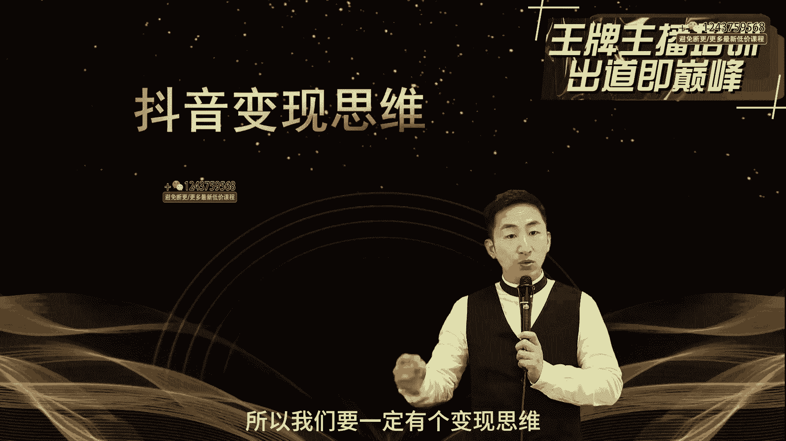
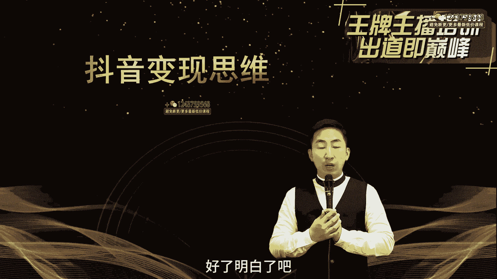

# 程哥带你起号运营型主播培训AI起号 - P3：第03节抖音变现思维_ev - 买不起的貂 - BV1mz421y7nx

好了各位同学们，那么这节课呢我们要讲一下抖音的变现思维，玩直播就得挣钱，说了半天，你自己没有这个思维，你说我就没事拍拍段子，想吸吸粉，或者是我觉得好记录点生活，你会发现很多的能够在抖音上赚上钱的。

他已经不是说我就是简单的玩一玩，做做段子，它一定有它的变现思维，那么这个时候我们要注意，我们想要让自己的变现，我们一定要注意，如果想变现就得先倒着设计，我们不是说等到做好了之后，说的是的。

有流量就会有变现能力，但是我们发现当你有些直播间里有了人气，但确实又卖不来货啊，我刚才说的像新奇特的直播间，我为啥不让你们做新奇特的直播间，你可以做起来，很快就有人气，如果你能够很好地承接。

那这个时候比如说你在剥鸡蛋，剥鸡蛋慢慢的把人播到脸上，然后这个人又具有很强的这种特色啊，这个时候就有意思，比如说我们鲨鱼妹，那这不是就是他在割鱼嘛对吧。

它本身是卖鱼新奇特，然后慢慢的转到脸上，这时候大家觉得有意思，新奇特嘛，所以这个时候我觉得变现思维，如果你要倒着设计，如果没有变现思维。

就不要做，抖音能挣钱吗，抖音很能挣钱啊，正常一个主播我们轻则几千块钱，大点的几10万很正常，一场带货直播几百几百万的GGMV很正常，那么我们变现，我们一想到变现能有什么呢，其实我们一想到哎呀。

上来之后就是带货，其实变现思维有很多，打赏都有很多啊，比如第一种叫做广告，我们很多人不知道，我们在很多时候在做直播的时候叫做星图广告，我们在做账号一旦起来10万粉丝之后，我们后台就会给你发出一个新图。

邀请，这个新图就是达人，然后我们什么叫达人，就所有的账号我们都可以把它定位成达人，就这个账号他本身就是一个自己的这个人设，那他这个达人账号它就可以具备带货功能，或者是具备有做广告功能。

你看到很多的达人账号刘畊宏，他变现能力是什么呢，你看到没有，他就是卖，比如说在广告里边短视频里面拍个车，那么广告公司呢或者是拍车企呢，他车企就可能给他一个视频，给他3万到5万，可能20万。

有些大主播根据你的粉丝量播放量，他会给你的多啊，几10万都有，他会出价出价之后，然后排除之后让人家审核竞标，最后拿下来这个广告是受理代理，那么可能一条视频就多少钱，包括我们所说的本地同城生活。

他也在做广告啊，他实际上拍一条段子，有车马费可能几千块钱或者几百块钱对吧，他这个里边就会有根据达人等级，他就是广告具有广告费的这种粉丝，他具有一定的粉丝基础，但是这里边就出现一个问题。

就是你我们在考核的时候，它是短视频投入广告比较多，那么这个时候你一定要具有短视频的创作能力，或者说在这个账号里面，你自己本身你的短视频就有很好的播放量，他才可能去带得动广告。

人家正常在选择你的正常这种短视频的这种啊，如果你的短视频播放量不够的话，他一般情况不会给你授权你的广告的，所以说人家也会选择，而且做短视频赛道最大的问题是因为他时间长，周期慢，所以这个时候你会发现。

基本上有一个长时间的一个准备，我没说吗，3~6个月，你一个短视频账号可能才能起来，然后才能经过一定的粉丝基础，比如说到了50万粉丝以后，才可能出现这种带货能力变现，尽管10万可以变变现就可以接广告。

但是星图10万以上很少能接上广告的，明白了吗，大主播太多了，所以呢我们在广告变现这件事情，我们可以考虑一下，我建议大家就不要去太多的投入到广告，短视频里面，我们想要玩账号，就是玩可能几天之后就能起号。

或者很快就能够让我的账号就能够变现，那这个时候短视频你可以作为辅助，绝对不是主要的啊，那么第二种变现方式，什么叫做卖货直播间，你看挂了小黄车，挂了小雪花，其实就是卖货。

直播间最后一定是以物流的形式来变现的，所以说我们接下来就要怎么样去让自己的货品，能够在直播面前，有些主播会告诉你说哎呀，那我卖货怎么卖，卖不了，我没有货源，我没有渠道，你看你结合你有什么。

但是呢这里面我就给大家说我们剧本身的自己，大家不具备电商的能力，所以这个时候不建议大家直接去上来卖货，你比如说我自己就是生产诶生产小食品的，但是你有没有客服，你有没有产品包装。

你有没有能够运营抖店的后台能力，如果没有的话，不要去做，所以这个时候会有些主播说，那我卖货怎么卖，我给大家说两条渠道，一条就是在你的这个抖音后面，他有抖店，还有这个小黄车橱窗分享，这里边可以卖。

那么另外一种呢，就是通过一些专业的这种带货公司，他会给你上品，他直接承接你的后端，他可以卖，我们卖了货之后，因为要给抖店要去分钱，然后要给自己要分钱，这时候要给大家的这个，这个就是给产品要去付费啊。

产品要有进货成本，所以这个时候我们在这里边卖货，他占的是毛利啊，所以说产品卖货，这是一个变现模式，而且作为大主播基本上都在带货，当你的流量真的很好的时候，会有很多的供应商来找你。

这个时候是卖货的一个渠道，那么接下来呢第三种变现模式呢，就是打赏我们很多的主播，尤其娱乐主播，用打赏的方式非常多，那么尤其是在打赏的过程中，很多的主播是这样，就是我做的一些就是有些专门付费打赏的。

你看到没有啊，他们有些直播间你给了一个眼镜，没事刷刷跳跳啊，这类的主播他就是用打赏打赏的，一般情况一个礼物平台分50%，个人分50%，所以你看到一个气球，50块钱的气球刷上去之后，个人拿250块。

25块钱，所以这个时候打赏对于现在的平台，我不建议大家去做这个，因为现在呢很多的粉丝对于打赏这件事情来说，大家都不愿意，除非你特别好，现在傻大哥也基本上没那么多了，所以这个时候呢大家打赏只是一点心意。

花个小心心，而且很多的主播为了在树人设，大多数主播说你们不用给我花太多的，你花个小心心就行，所以说在打赏这一块会越来越少，所以打赏这一块，我建议大家不要去把它放作为直播重点。

很多人做打赏基本上挣不上钱的，那么第四个呢就是引流，如果你在自己在做账号的时候，这里面要涉及到，比如说我们有朋友做食材的，比如说我们有朋友是做餐饮的，比如说我们有朋友是做心理咨询的，那引流线下的引流。

这是一部分，重点在于后端，所以你要去思考你的后端能不能承接，但是在抖音账号里边，你短视频也好，直播也好，直播间的引流是非常麻烦的，这里面又涉及到直播间能不能出现这种，什么微信号啊，二维码啊。

这些你不要去做，如果一旦后面会给你讲到抖音规则会被封号，那么如果是你短视频里面出现的话，这个短视频播不出去会限流，所以引流要用的最好的方法就是蓝V认证，用蓝V去给你引流，包括小风车。

包括这个上面的橱窗介绍，这个里面可能会有企业介绍，这里面会有一些引流的方式，其他的不要私下引流，我们有些主播会告诉你，我拿着这个短信，然后给别人发，或者是发一些链接给别人，你记住啊。

只要发到还你还很聪明，写个微信或者是微或者是某信，其实抖音早都在这边做了设计和人工智能鉴定，这个东西只要出现了，你出现数字号码都不行啊，所以这个引流基本上是条死路，那么你要想引流的话，就开蓝V。

然后引流，我们有时候引流引得很好的一个企业，一个3万的粉丝，一个月引流十几万，所以这个时候你要做到线下的这个后端，你能不能承接得住，这是你做的，那么这里面要涉及到你的企业宣传，包括企业企业动态啊。

包括你的视频的操作和视频的剪辑，视频的拍摄，你好玩文案才会引流，你一个人拍文案，拍不了，你自己剪辑，剪辑好了之后，不见得能够有人有市场，所以这里面要有很强的短视频功底，引流啊，直播引流也可以，直播引流。

但是最大的问题就是不好引流，那么第五类呢是什么啊，是做任务，如果你在短视频里面，我们会出现这种中视频计划，中视频计划可能一条视频可能给你几毛钱，或者是给你，你只要播放就给你钱。

这种这种做任务一般在西瓜视频，因为西瓜里面不是跟抖音合并了之后，然后西瓜有大量的中视频，然后创造了很多的鼓励，很多创作者去做一些中视频计划，那这个也会变强，你会发现他在做做的时候，没事的时候。

里边就会有一些收入，西瓜视频里面有收入，但是这前提是你有人设，你讲的东西确实是有足够的含金量，这一般适合于什么呀，适合于知识付费，所以这一块我们很多人普通人不要去做这个，做任务这一块会费劲一些。

那么所以呢我们现在去考虑的是什么，我们去考虑的更多的是带货啊，包括你打赏你可以做啊，包括你的引流你可以做呃，在如果你在直播的时候，你说你没有货源，如果你直播的时候，你说你小黄车不会开。

如果接下来之后你说你的产品不会设计，那在未来的时候，我来帮你继续再去把这个直播变现这块完善，做直播就是为了变现，所以我们要一定有个变现思维。

反向推你的直播间的形象，和直播间的整个产品设计，以及直播间的直播展现形式，还有你的账号的整体形式。

