# 程哥带你起号运营型主播培训AI起号 - P4：第04节抖音扶持赛道1_ev - 买不起的貂 - BV1mz421y7nx

好了，那么同学们。

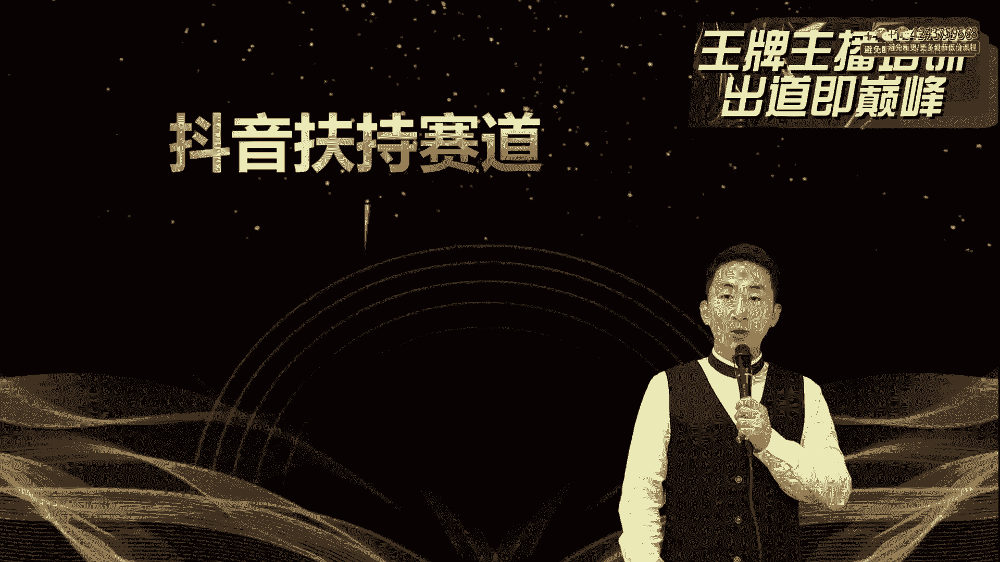

那么咱们这节课呢要给大家讲一下，抖音的扶持赛道，那在做抖音的时候啊。

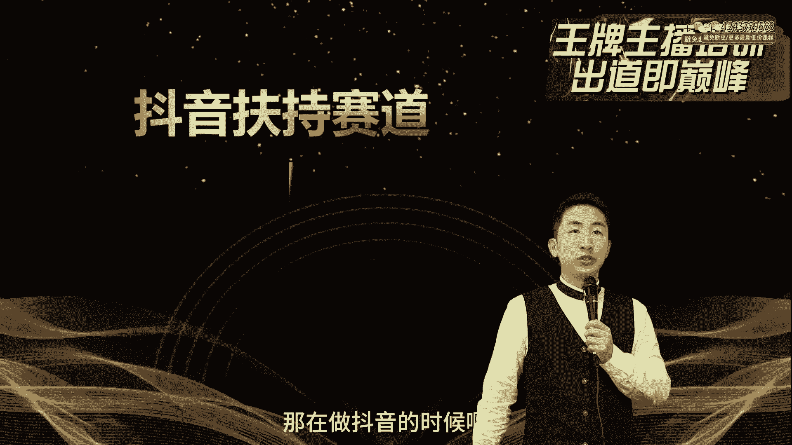

我们说选对了方向就是选对路啊，你一个车在高速公路上跟在山路上走，结果绝对是不一样，那么抖音呢本身我们说有7亿的日活，但在这7亿的日活里边，又出现了很多的赛道的这种偏移。

那就是抖音呢会把流量会分发给不同的赛道，因为他自己根据大战略方向，比如说这个时候我可能三农会好一些，我要倾斜于三农的这些主播，那比如说过段时间，我可能知识付费主播会多一些，那我要倾向于付费主播。

那在每一个时间段呢，我们都会有一些这个赛道的这种分类，然后呢会有倾向倾向，但是整体来说呀，我们做抖音可能流量会有一天好，或者有一段时间会坏，那这个是很正常啊，我们靠天吃饭，但是呢它有一个大规则。

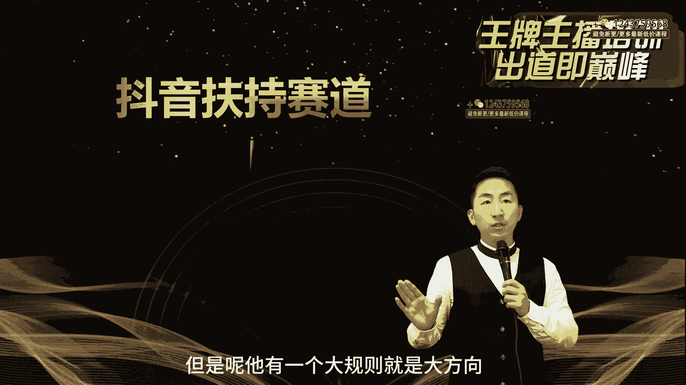

就是大方向，这就相当于我们在选行业，哪怕入错行。

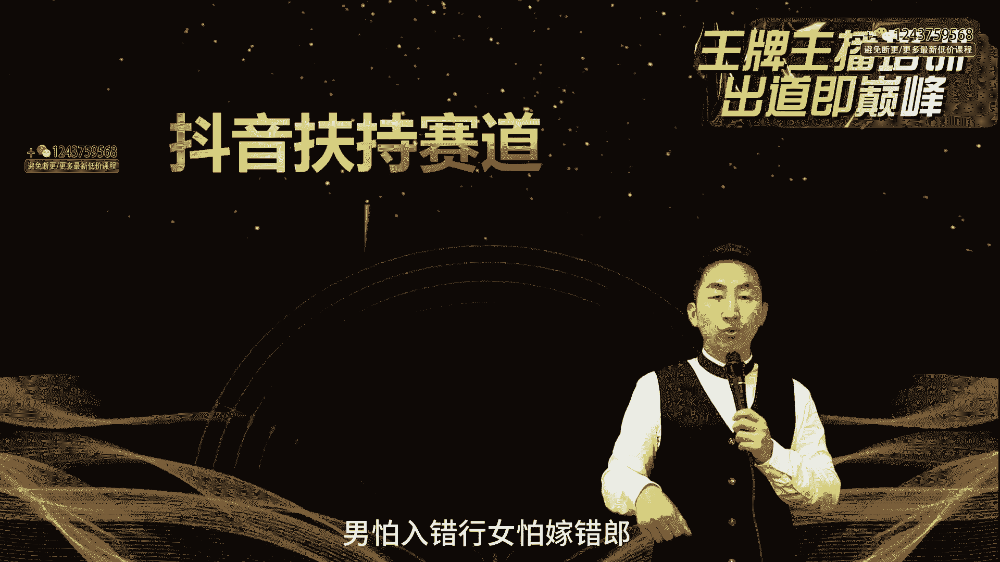

女怕嫁错郎，如果你选错了，可能会出现一个大问题，那我这里面给所有的朋友们。

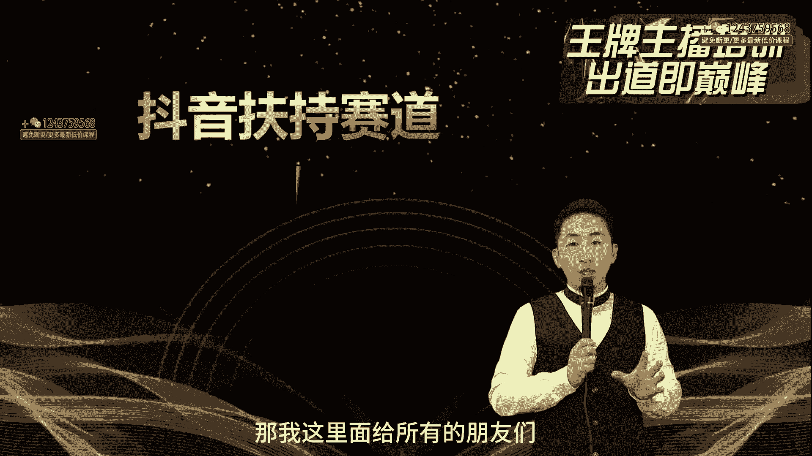

我会给大家定义建议，几个赛道是不要去碰的啊，那比如说呢我们在做这些。

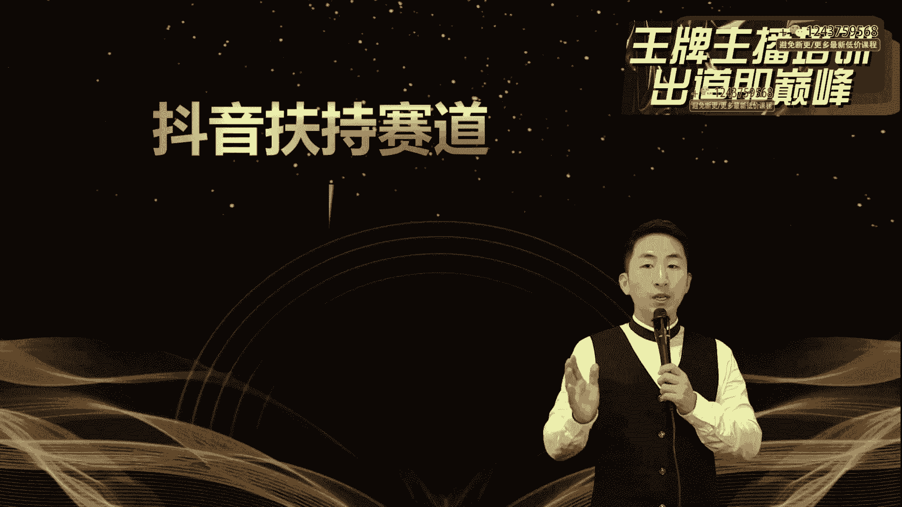

有些时候啊我们会有一些不能去触碰的。

我们根据他的实际的这个变现能力强，或者是流量好不好。

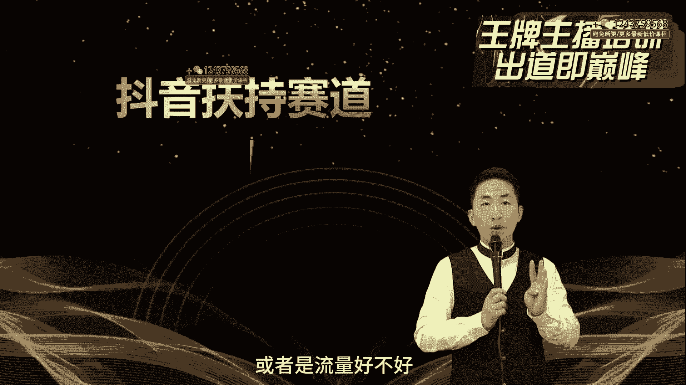

或者是这个违规程度高不高，我们会给大家做一个赛道分类，那么有因为那就是变现是我。

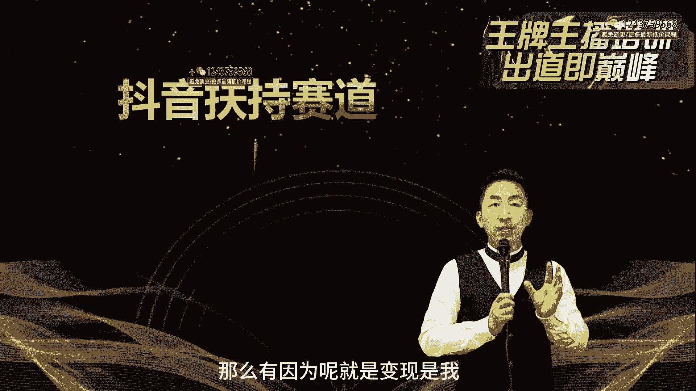

那么我们呢可以根据自己的这个。

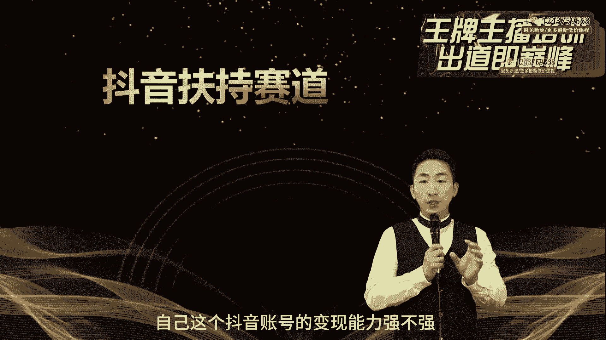

抖音账号的变现能力强不强，或者是这个账号做起来流量好不好。

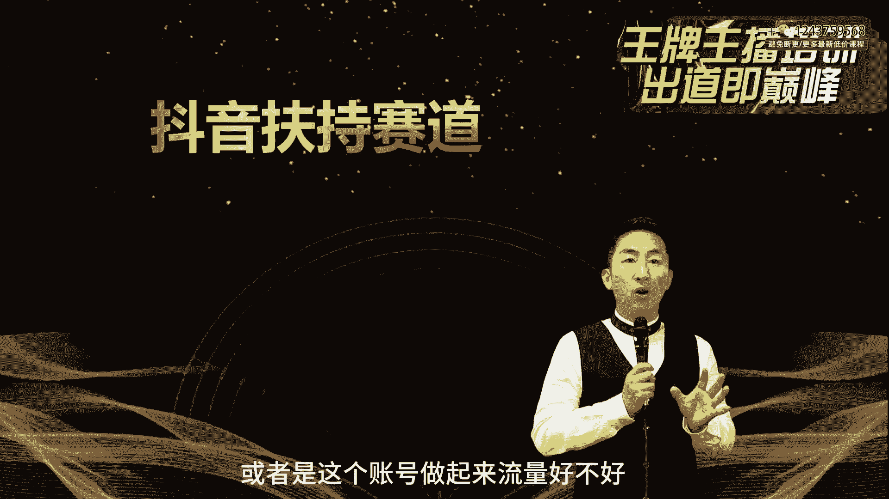

或者是这个容不容易违规这些方面，我们把这个账号做一个统一的分类。

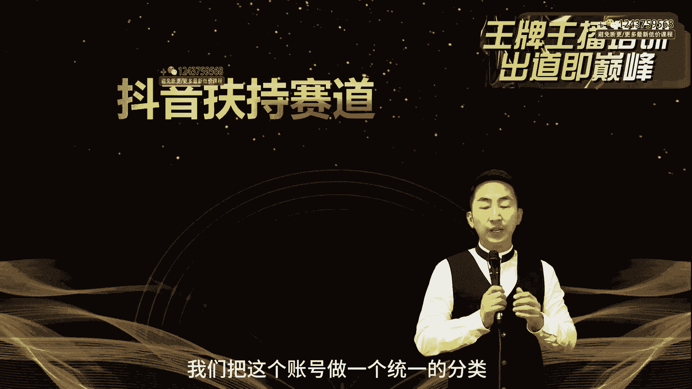

或者我们把它分为这种可以做的和不可以做的，这是我们在做长期的这种直播。

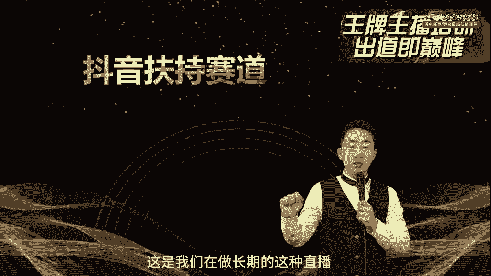

孵化的时候的一个经验啊，也给大家分享一下，如果我们做错了赛道之后。

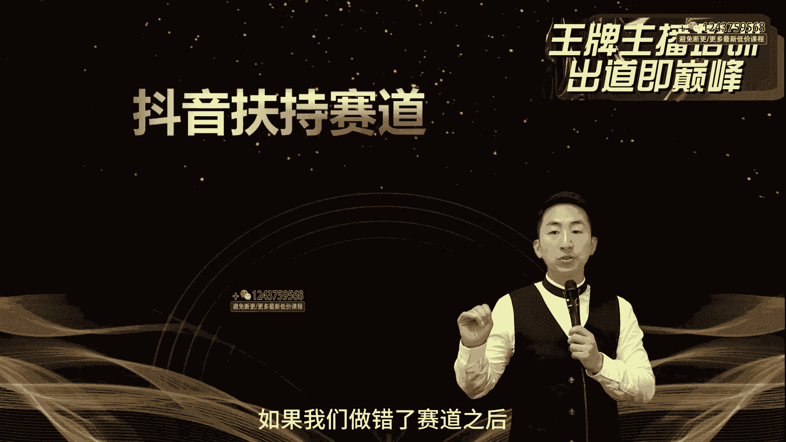

会发现要么变现能力特别差，要么就是流量上来不稳定，今天好，明天坏。

或者根本就是动不动违规，其实有些时候做直播呀，我们在后面的时候会给大家讲到这种流量的。

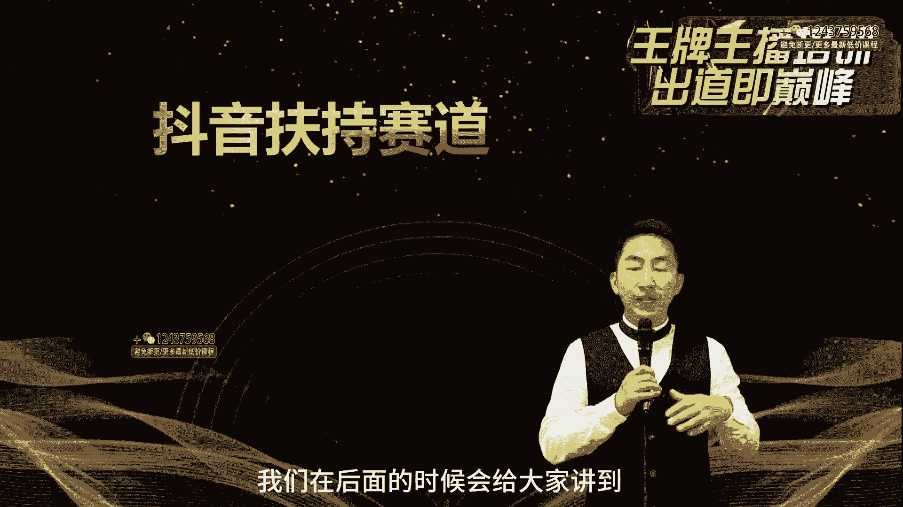

这种这规则，还有这种违规的细则，如果违规细则出现了以后，那一定要注意，这个时候就是不能轻易出问题。

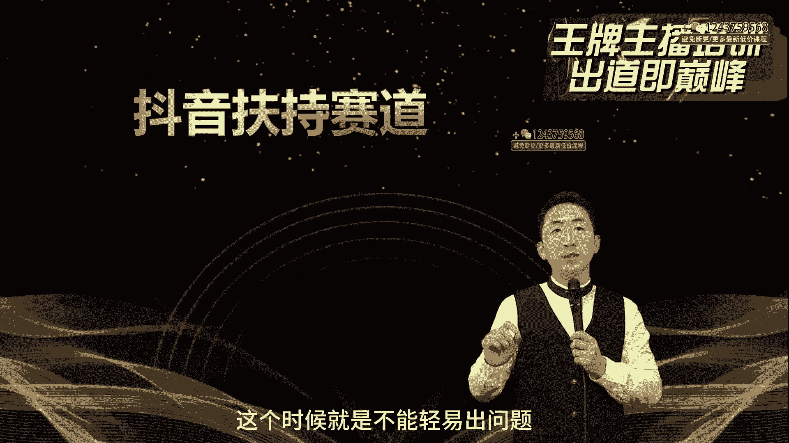

那首先呢什么样的赛道是不能玩的，赛道呢我们去分析一下，我给大家说啊，你们有些时候有些主播特别容易上手的，就是干什么做pk，这里边呢我给大家说pk娱乐主播，我不是特别建议，尽管现在有很多的工会在做。

你们发现没有，尤其是稍微有点身份的，或者是这种稍微有点这种资本或者认知的，不太愿意做pk p k娱乐主播，有一点你知道他的商业变现模式是干什么，是为了钓大哥挣大钱，就说白了。

就是等于说为了一种一种一种一种意淫，甚至是就是线下交易，所以这个事情很讨厌，就是如果一个姑娘家要去做pk娱乐的话，我认为这是掉了自己的价，如果本身虽说我们上了镜会很好看。

但是如果做pk娱乐就会感觉到就很low了，你会将你的线下人设，所以我不建议大家，很多的这些的主播们去做这个，如果说你非要去做pk娱乐，那我给你们说，就是他们有些时候啊还是要严格的，按照工会的打法。

人家比较成熟的，你可以去让做pk娱乐，主播呢，他会大量的，现在如果大主播尤其是占据的市场非常大，他的流量占据的也很多，大家会认可你，比如说比如说像这什么呃，这个就是四姐啊啊，比如说是林先生啊啊。

比如说是这种这种这种胜仔呀，那他发现这些主播里边，他们因为长期的在做直播，所以他会有大量的这种市场积累，但是我们不行，我们上来之后都是小白，直播间就一个两个人，因为他没有他的这个份额。

要么你就想要吸引人，那怎么办，露大丝袜大长腿，那这种的又叫你的人设，而且这种账号特别容易违规，我们会看到很多的这种，如果说是通过这种美貌来诱惑，导致直播间流量上升的这种账号，第一你吊不起大家的这种。

留不住大家的这种人群，最多就是找了个大哥能留住，然后你会发现他的流量要么就非常的高，非常的高，你会看到有些直播间这个人，你把他关注到前两天可能是几千到几万人，然后待会过两天之后变成一两个人，为什么呢。

他是给你推流，打开机制之后就开始给你大量的送人，我们后面再讲到破层级的时候，层层层一层上去，但是现在是不行的，所以我不建议大家去做pk娱乐，pk娱乐在一个内卷的太厉害了，别做了，这个赛道都已经过去了。

你们也看到各地方这种网红孵化基地，做的这种抖音孵化主播，包括这种娱乐pk主播，已经有多少已经干不下去了，又有多少小姑娘现在已经尝试着在转型了，这个别做了啊，那么第二类赛道呢是什么不可做的呢。

第二类赛道是我给大家说，我建议你们在这种影视剪辑的赛道不要去做，我们看到了很多的主播啊，影视剪辑做的非常多，那影视剪辑干什么，大家说没事，剪个小电影，没事的时候大家去拍小段子，我们也爱看。

但是这种账号我们出现了几个问题，第一呢就是版权的问题，很多同学都不知道我们在做影视剪辑，稍微弄不好就可能会侵犯版权，那轻则这个视频禁止推广，那重则可能受到罚款，所以这个时候我们轻易的不要去用这种账号。

如果你要做的话，你的账号很容易说出现多次侵权之后，这个账号直接限流，我们有过这种这种主播的粉丝，账号直接就限流了，这个账号是不能做的，那么还有一种情况就在一个问题，它的变现能力特别差。

我们从变现角度来考虑，这种账号呢，基本上如果你想变现，他们在直播间你们看到没有，他没有变现逻辑，大家有很多的粉丝，一般做视频影视剪辑的账号，几百万粉丝，但是粉丝是很多，因为我们喜欢性。

看完以后啪给他点了，但点完之后你说上广告吧，没人看了，上星图吧，没人要了，接下来之后直播间你说干什么，你们会发现一个小美女带着一群大四大大大帅，大一群一群屌丝们，然后再看什么呀，看账号的这个账，看电影。

看老电影，这些电影你看完之后有什么意思呢，最后他没有办法变现这些小美女干什么，中间打断一下哥哥们啊，我们中间卖一点电话卡，这能卖多少钱啊，或者是卖游戏游戏币，或者是就是卖一些虚拟的东西。

他卖不了什么东西，所以这种变现能力非常差，有时候我们在后台看一场直播，1万多人，他单场销售才三五百块钱，没有任何意义啊，所以这种账号你做的又累，而且直播班看一场电影，看着好像挺轻松，看电影。

但是这个电影整个看完之后，你会发现你只要一讲解产品，人气大量下滑啊，基本上很多人都会骂，所以这个这种账号没有意思，他做的之所以有人气，是因为他做了停留，他有明星效应，他本身这个偏权版权它是能够吸引人的。

那么第三种账号我们绝对是不能做的啊，各位同学们，就是第三类账号叫什么呀，叫做书单号，这种账号在以前抖音刚开始开播的时候啊，就是前几年3年五年前这个是非常常见的，但现在不要去做了，因为书单号这个东西。

本身我们知道什么叫书单号吧，就是我自己会写一个图片，图片上面配文案，这叫书单号，它叫简单制作，这种制作的成本会非常低，效率会非常的高，速度非常快，但是这样的书单号是没有意思的，我们看到很多的情感主播呀。

或者是很多的这些做一些励志的，那这种这种账号他会大量的发，那以前的时候会有很多的人去点赞关注，现在这东西见太多了，所以没有任何的意义，所以我给大家说，如果你是在用书单号想要起号的话。

现在这个时代已经过去了，那么抖音本身有大量的出现这种图文计划，那图文计划可能在底下，就是你发布作品的时候，有一个专门图片窗口，他有吗可以，但是效果一点都不好，所以说简单的图片换你，你愿意看吗。

你可能看看美女，看看帅哥可以，那叫生活记录，它不具备变现能力，那比如说我进入这种书单号，后来很多的这些主播账号，他想变成情感号，变下来之后又不垂直，我们在原来的时候有很多的这种账号。

就大量的去购买这种书单号，很便宜啊，一个30万的账号可能就几就几千块钱，没有意义啊，所以我建议大家都不要去做这种书单号了，这种书单号过时了，那么第四类账号我们绝对不要去做啊，这种赛道就不要玩了。

我们在前一段时间的时候，我们会看到直播间里有一些讲民间故事的啊，动辄几万人，当时我们还有一些朋友，他们在做的这种就是民间故事孵化确实简单啊，这个里面不用花多少钱，也不用花多少时间。

我们就不就录制一个民间故事，什么鬼故事啦，什么这种传奇故事了，或者民间小故事啦，然后放到这个店，放到直播间里面是备配一个图片，然后呢声卡输进去，然后就给他讲鬼故事，这东西有意思吗。

其实这东西涉及到版权的问题，其二他的粉丝没有粘性，所以我们看到了没有从影视剪辑到民间故事，这种没有个人强属性IP的这种的账号，它基本上是没有什么变现能力和留粉能力的，他的转粉能力非常差。

所以这类账号我不建议大家做，如果你们要想玩的话，抛弃这四个，因为你们花的时间会差不了多少，尤其影视剪辑，你会大量的时间去剪辑作品，但是剪辑完之后发布是有了点赞，所以这里边我们在接下来的课里面会告诉你们。

很多的这种新手的思维，那新手的思维里面，其实我们很多的主播会认为账号的粉丝多，你的账号就有价值，其实账号一点价值都没有，账号的价值在于什么，在于他自己本身的变现能力，它的流量的稳定性。

还有它不违规的能力，以及他自己的这个就是账号的输出的这种优质，作品的这种呃受众区受众率，所以我们自己没有这方面能力，那就这几个赛道就不要去做了，那考虑哪几个赛道好做呢，这里边我们就要分析了。

我们在抖音里边，我建议大家有十大赛道，这是你们可以布局的，也是在抖音，我们在后来发现，很多的官方已经开始大量的推广，那我们也看到很多的这些计划，这个计划那个计划其实在已经在操作。

所以说我们接下来要给大家讲的是，抖音可以支持的十大赛道，大家如果在想要做抖音的话。

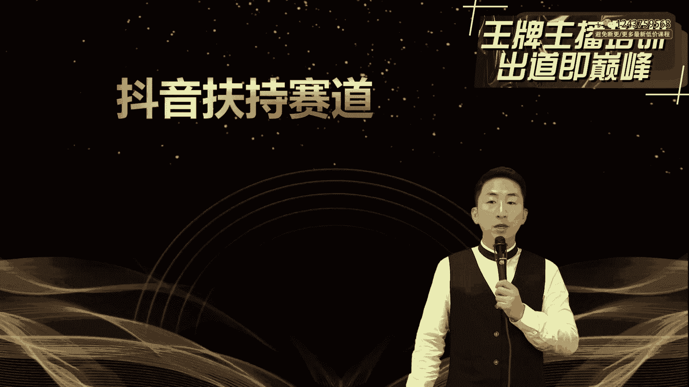

我觉得入局至十大赛道还是都是很有机会的，第一个赛道呢就是带货赛道。

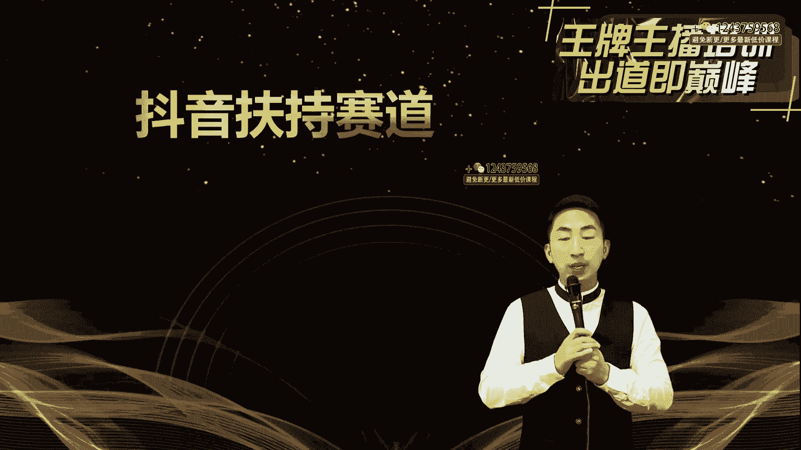

这个带货赛道一直不会变，因为抖音会从兴趣电商变成传统电商，兴趣电商在挑战传统电商，那么兴趣电商之后呢，会慢慢的变成这种电商的模式，所以说你会发现抖音为什么开通了商城栏目，就你会发现那个在他的界面里边。

从你的直播窗口，关注窗口到商城，然后到推荐，为什么会有这上面的几个几个窗口的裂变切换，因为带货商品，这是抖音主要变现能力，那么所以我们在做带货的时候，我们要知道呃，我们要想尽一切办法。

可能很多主播都在迎合带货，那从很多的新手布局来说，我们又想去做带货，带货有一个大问题，大多数主播需要团队，我们看到带货一个直播间，但是这是基本上是一个主播，加上好多的运营团队里面有主播，有运营，有中控。

有包括投手，有些团队一下五个人，有些团队可能甚至后面主播有好多人，你看像这种明星的主播，二三十个人一起在直播间，所以你会发现这种带货的主播，一般情况下小白不要去碰，玩不了，我说实话是真不好玩。

因为里面又涉及到上下架，另外涉及到客服里面涉及到退售货这些东西，如果你要做的话，你会发现你光一个前端，你根本负责不了后端所有的运营小店，现在呢所有的这种小店小电，现在要求三秒回复率。

如果你连三秒都回复不了，这意味着什么，你如果自己一个人要开一个抖店，你自己拿个手机24小时的在线，如果不回复，很快就出问题，直接降分，扣到04：02分以下就不给你，就不让你进，就就给你限流啊，扣到3。

8，03：08分以下就退出竞选联盟，你这个时候你就会发现越来越麻烦，所以这个时候一定要注意带货，主播是个好风口，但是有些带货我们又不适合，那么对于个人来说，带货主播哪一方面合适呢，说我今天是个小白。

我今天就想玩带货，我今天就想把我家的东西卖出去，我想买化妆品，我想卖我的酒水，那怎么办，其实我给大家几个建议啊，如果做这种带货主播，一定是强人设输入就是用你的人去拖你的货，用你的知识去拖你的货。

这没有问题，所以呢带货主播里边我们如果说我什么也没有，但是我还想做带货，那么在我们接下来的一些孵化项目里面，我们就会给大家代替了一些这种没有人，没有能力的一些主播，那怎么做，这里面我给大家讲。

比如说我们用亿元产品，这叫做虚拟直播，一元产品也可以就是呃这种低价，一般情况我们搭在虚拟直播间，就是无人直播间，这是无人直播间，就是用一台机器啊，然后呢这个手机手机上下个软件。

然后这些背景开始不断的轮回的滚动，我们涉及到比如说有一些带货的牛肉丸啊，这种东西都比较多，什么牛肉啊啊，包括小物件啊啊，包括这种什么一元一元产品啊，图书啊啊，包括这个就是呃我们有些时候就是。

哪怕同城的这种团购，我们都可以用这种的，这个其实无人直播我再给大家推荐一下，这个东西是非常好用的，在去年的时候呢，我们其实已经大量的涉足这种无人直播的窗口，但是呢无人直播界面会出现有一些问题，就是限流。

包括违规，那这个具体操作，有一些操作的方法去避免这些问题，但无人直播解决一个大问题，就是你没有办法去出境，然后呢场景不好去搭建，所以这个时候无人直播有他自己很好的场景，你比如说你拜个三亚的旅行。

你怕你把三亚的这个图片叉叉叉做的非常漂亮，然后呢接下来避免了你自己本人上镜的尴尬，然后你也不想去上镜，那可以OK上面这个做得非常好看，它会代替你本人，也会形成强大的吸引流量。

所以这种无人直播我可以为大家推荐，这可能是以后很好的一个窗口，包括现在我们在做同城，包括虚拟人直播，机器人直播，那为什么我们要做成这种无人直播的形式阶梯，那原因就在于我们能这样去。

很好的去避免了主播出镜的尴尬，但同时还有一个问题就是我们很多的主播，我们在有些时候讲述产品，或者是在自己新手直播的时候，他顾及不了屏幕，那怎么办，无人直播代替你所有的屏幕，你看你往这一退。

然后接下来之后所有的东西全部都在里边展示，这就可以了，那么第二个呢就是带货的时候，我们会想一些精品带货，那这个带货呢就一般选择的高大上的，直播间的大件，一般虚拟直播间搭建不合适，一定要实景直播间搭建。

这种呢我建议大家两到三个人的团队去做，如果你自己有实体店，在实体店不错啊，比如说在你的这个呃仓库里边啊，比如说在你的美食零食，或者说在你的厨房，你可以去做这种现场这种现场搭伙也可以。

这里面涉及到挂小黄车，后面我会告诉大家怎么去挂小黄车，以及怎么去上架产品啊，那么包括我们在去年的时候，我们会出现大量的这种什么13行啊，13号就什么减价促销这种的，它是场景化的，你包括现在摆地摊。

地摊也能卖货，所以这时候我告诉你们，就是如果我们接受了很好的人货场那个场景，加上你的货品足够有自己的优势，我们在后期的给大家讲抖音推流逻辑的时候，你的货品如果足够好，也能够打造你的直播间的流量。

但这里面我要再给大家强调一下，如果你的电商基因不是很强大的话，你千万不要轻易的去做货品，因为什么呢，碰货盘之后你就涉及到售后，涉及到产品的宣传推广，涉及到投流这个事儿是有麻烦的。

就是你在这里面涉及到行业非常深，那么如果你自己没有这方面的货源渠道，那我觉得可以有机会，你们可以在这个基础上去结合一些公司，能让这些公司能给你做后端，你只做前端，那这个事简单了啊。

比如说我们公司里自己要继续布局的这种，零食啊或者小商品啊，那接下来之后我们会大量的给大家输出一些，零食小商品这一类的东西，那我们做后端这个后端的时候，你自己的产品的东西我会告诉你哪些东西好做。

哪些东西容易推广，而且他会帮你去在账号里面打标签去引流，这不很好吗啊，所以说带货的时候，我们尽量如果新手入局，一定要去尽量做一些简单的容易的，那第二个就是什么赛道呢。

我们第二种赛道扶持的是什么叫口播类赛道，口播类赛道就是拿一张嘴，拿一个麦克风，然后直播间一个人，这种赛道适合新手小白去开播，刚才我说到了一个比如说酒水哎，你要如果能讲到这方面非常专注的东西。

讲到你很有用的东西，你可以把它列为口播类赛道，然后顺带着推一些酒水，它不代表不卖货，我们所有的最后账号最后流量都要变现，那么流量变现之后就可能通过互品货品，通过这些服务虚拟销售或者是实体销售。

最后去变现，那这些都会存在，那我们比如说口播类赛道，它最大的特点是什么，就是内容很强啊，这什么叫做口播类，好多人在问，那比如说就是干货，比如讲法律，比如说讲情感，讲车讲房啊，讲两性关系啊。

比如说讲这种成长，孩子教育，这些都叫做口播类赛道，我们只要涉及到某一个不同的领域，你在这个领域又有发声权，那么你就可以去跟别人去讲述，在讲述的时候就会有相关的人员去去听，那我们讲到这些东西的时候。

其实我们见过包括讲画画呀，讲书法，甚至讲一些冷门的东西，都有人去听，记住它的受众群体，他一定是是有一部分的，而这部分你越窄，也有可能就会变得越有它的这个付费能力，就是你看啊我我我有一个朋友。

他们在做的知识付费赛道，他们做的什么，既然讲的是这种，就是呃西方什么哲学用这种东西都有人会付费，而且付费还挺多，一年一年一年营业额大概创造500多万，所以这种事情就是知识付费类赛道，还是很有意思的。

而且他知识付费，你们发现没有，在今年抖音孵化窗口里，有一个叫做知识付费板块，口播类赛道，紧接着就是知识付费，这本身就是知识付费的本质，所以说我们的产品会搭建虚拟的知识付费课程，然后在这里边。

这个小黄车里面会搭建出知识付费的板块，你可以去选择，到时候去购买他的产品课程，那知识付费有一个最大的好处，最大的好处是什么，就是在这里边呢，我们会出现它的利润非常高，知识付费一般小黄车扣点。

抖音平台扣点大概就有3%到9%，这个时间段，那么如果扣点90%以上的毛利，全是你自己的，多好啊，所以知识付费这一块我建议大家可以多去用啊，这一块如果你在某一方面有自己的特长，而且还有一个强人设在这里边。

你可能是某个领域里的大V，或者是某个领域特别在意，特别有有说服力的这么一个人，我觉得你在做这个市场是很有市场的，那么第三类赛道是什么赛道呢，在去年的时候，我们会发现有一批主播是非常敏感的啊，非常厉害的。

比如说你们还记得刘畊宏吗，就在去年的时候突然间异军突起，也是在疫情的时候，大家都憋憋在家里没有办法，所以这类赛道会作为抖音的主流赛道，那么现在呢你会发现抖音的，这叫做运动体育类赛道。

这类赛道也是非常好的运动赛道，那么这一类赛道呢，就是比如说我们在直播间里健健身打打卡呀，他们最大的特点就是粉丝的粘性很强，比如说我一个瘦身计划可能要一个月，他可能会长时间过来打卡。

而且对你的强人设会有很好的帮助，其次就是在这里边会形成一种周期性，我可能会经常在这没事时候练练，我会经常的时候保持自己的身材，我会经常的跟这个主播形成一种粘性互动，那么在这样的主播直播间里边。

他们的带货能力是很强的，只要有人设带货能力非常强，因为我信你，我才信你的货，比如说我们在有一些运动赛道主播里面，比如说阿新呐啊，包括什么洪教授啊，这些东西，你发现他们在做这种赛赛道的时候。

他们自己做的时候就是卖货，一场单场卖货能卖到100多万，所以就单场卖货100多万很容易，所以你要知道这个赛道，但是这个赛道有个大问题呃，新手小白，我在运动赛道我打造的时候，我会跟大家说。

我建议大家一定要有教学天赋，或者是这种教学的这种经历，呃，比如说在上海，我们打造的有一些这种叫超级星星，这个在运动健身行业，是一个异军突起的一个行业啊，你们会看到就这种行业呢，就是这这这这种这种门店。

他不传不许不不跟传统的这种门店一样，他们自己的教练呢，具有很强的这种线上的授课能力，包括线下授课能力，他们会边运动边授课，那这个东西是非常好的，你自己没有这个能力，我自己播过运动赛道。

在播的时候就感觉到非常的累，你的话术他有点节奏性非常强啊，说难听点有点像rap，然后他自己在说的这个话题的时候，然后你还要在运动，你要自己把这种说话的行为习惯变成这样，很强的这种节奏韵律。

所以这种赛道加上你自己本身又需要每一个操，每一个健身操都有自己的节奏，或者是每一个运动细节都有自己的教练功能，所以这方面很多新手小白入局，如果你自己本身具有健身这方面的，运动方面的教学经历。

我觉得你布局这个是没有问题的，但是在一个问题就是这个旗号慢，这种账号一般起号的时候，六个月左右才能起来啊，3~6个月，所以这种账号起号特别慢，前期的时候都是铺垫，所以做直播的主播们，我给大家说。

一定要做好心态，我们任何一个赛道都会出现，如果没有人设，你可能会卡直播广场，直播广场就是通过你的新奇特呀，或者通过这种场景留人，他可能会起号很快，但是人设很慢，就这种起来之后会掉的很快。

如果通过强人设去植入的话，它会起的很稳，但是起的很慢，起来之后就容易在长时间，在这样的一个高位震荡，所以这个时候我们要自己注意你自己的选择，那么还有呢是我们抖音复制赛道是生活类赛道。

这个生活类赛道其实是我们现在抖音呢，在今年呢也会推广的，尤其是今年开放了以后，我们很多的这种就是旅游赛道，这是非常好的，所以说我们这里面涉及到都市生活，旅行生活，包括三农生活。

去年的时候三农生活是非常火的，三农生活里面到现在还是很好，从去年典型的什么张同学开始，然后我们会发现有很多的这种农村主播呀，他们会以短视频的段子，然后开始去给大家带入一个新的窗口。

包括我们在抖音在2022年的时候，会创造了一个叫做三农扶持计划，那这种计划背后呢，其实就是一个大量的这种农村福利，然后其实我们对于，只要沾到三农窗口的这个话题，以及这方面的标签，它都会有流量倾斜。

所以在这个时候呢，只要在我们随便发一条作品，关于农村农业的这个时候，基本上都能够很好的这个有流量倾斜，本身乡村振兴嘛，你们想想就是这个道理，所以山东赛道很好，但是山东赛道呢如果你是一个美女。

如果你是有颜值反差的，或者是你自己很有这种身份地位，比如说哎我们俞敏洪老先生，他没事的时候，他跑到农村去给人去播，或者是嗯去去去要去代替去，要给大家去做这种农农产品的孵化，农产品的直播啊，那么乡村振兴。

你看它就会卡到很好的一个这样的一个，赛道里边，所以说你看啊，我们这里边就说到不得不提取东方甄选，那东方甄选这个事儿呢，我们就会回头想一想，从去年去年的时候也是这样，就突然之间他在做三农，他起来了。

他把好多的农产品带给大家，他是通过一种线上的讲义的东西，然后通过他的这种很有强人设的，这种知识型的主播啊，比如说董宇辉啊，大量的给大家去介绍，那介绍出去之后，他有自己的这种人格魅力，然后把产品推广出去。

去年的时候，东方甄选单场销售额已经过了2000多万，一个亿了，2000多万，他们2000多万，所以这种这种直播间是非常有市场的，那么另外呢就是我们在这个账号里边，它会出现就是有很强的这种很扶持力度。

那么在这种账号背后，我们今年看到了，通过了一年的这种变换之后，你们要看他的直播风口，东方甄选今天在干什么，他开辟的是旅行赛道，所以说我说旅游生活又是一个很好的赛道，今年的时候如果你们想做直播的话。

旅行是一个挺好的窗口，因为现在大家都已经开放了嘛，大家都可以去旅游带回走动了吗，那么拍各地的美食，开各地的生活，去看不同的双风景，这个非常好，然后那么另外呢，就是你们看这几年一直有一类的这种内容。

很有意思，比如说徒步，比如说这种就是营地营，就房车旅行这种的，比如说他大距离的长时间的这会拍成小段子，然后给粉丝留成一种粘性，那么开播的时候，其实我们好多主播不光是在这种这种过程中，不光是挣了钱。

而且旅行费，差旅费，包括这些赚的盆满钵满，所以这个过程中你要知道他的旅行啊，这种这种旅行生活啊，这种的是本身就是有他的视角的，所以用这个视角去探究美好的生活，这本身是抖音所扶持的。

所以说这个窗口对大家来说，你想想也挺有意思，那么就都市生活这块赛道，在接下来给大家说一下，我们刚才说了抖音本身孵化的生活，赛道里面，都市生活这就很重要，都市生活就比如说拍一个城市，拍一个乡村。

拍一个不同的地方，比如拉萨，比如说是纽约，它不同的地方。

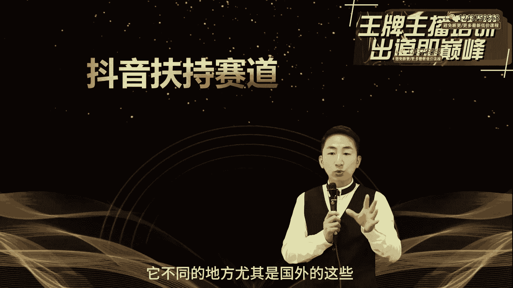

尤其是国外的这些，你可以拍进来蛮好的啊，这些赛道你可以只要有你自己特色的东西，你可以去拍，其实我们真的抖音可以展示各个方面生活美好，那么接下来呢，我们还有一些赛道，是接下来大家很容易去触及的啊。

比如说第五类赛道叫什么。

叫做萌娃类赛道，萌娃类赛道是干什么的，就是因为我是个人不能上镜，或者是我不好意思，孩子直播呢是绝对不允许，18岁以上孩子绝对是不能去直播的，所以这个时候就是我们有一些主播，宝妈说是我不能做，我没有办法。

我现在实在没有办法去直播，我也不好，没有时间，那怎么办，拍你短视频，拿你的孩子去拍，那这种小萌娃呀，小孩儿呀，他没事唱歌啊，说个诗啊或者才艺表演呀，如果能够持续不断地输出同质的内容。

记住啊叫持续不断输出同质内容，那么他在这个赛道方向就是有市场力的，所以说他可能会打爆一个自己的账号，会吸引很多的同类型的这种账号粉丝，那么这类粉丝是什么呀，叫宝妈粉，所以未来的时候我们会发现。

有一类粉丝是在直播间里面，特别容易让大家记忆的这种粉丝，我们把粉丝啊基本上分为好几类啊，第一叫做女人，第二叫做小孩子，第三叫做老人，第四叫做动物，第四叫做男人，第五叫做男人。

所以说你会把赛道分类这么多类，最不值钱的就是男人，所以男粉你如果在粉丝画像定位的时候，如果男粉很多，基本上这个账号是废的，所以说我们把女人赛道放得很好，你看我们在头部的时候。

这些销售里边化妆品一定是好的对吧，比如说在头部里边，我们这种穿搭辅助是一定是好的啊，今年的赛道里面宠物赛道其实很好啊，大家可以到时候会给大家讲一下，所以说萌娃赛道这里面如果你做的很好之后。

孩子里面的母婴用品，包括孩子的辅食品，包括孩子的这些，平时的生活吃穿玩具这些东西都会是你很好的，他的链很广，他会锁定某一个人群，你的孩子如果有市场吸引力，他足够有自己的特色。

然后这时候会吸引很多的这一类的宝妈，这类宝妈具有很大的市场，所以萌娃类的赛道，我觉得大家一定要如果有机会布局，但只有一个弱点，就是它太慢，他这个上面有短视频打打账号，但短视频打账号。

基本上问题就是在半年以后才能出量，所以说萌王赛道很多人为什么做不起来，是因为他短视频没有做到足够的积累，以及没有形成粉丝足够的粘性，这样的话基本上不好做，再一个生产内容的质量会有问题。

小朋友不是每一条视频都很火的，所以说一定去卡住这样的市场氛围，所以呢这是萌娃类赛道，如果我们有机会，你的孩子很优秀很萌，那你可以做做萌娃，那么说我没有孩子，那怎么办。

有些有些有些有些主播说我我就没没有条件，那怎么办，我教你们第六类赛道，这是什么呀，叫宠物类赛道，哎你们会发现没有，直播间里面一个八哥，就是没事的时候听他自己说话，屏幕上没事打字，打上几个字，说跟我来学。

这个主播来帮我来教啊，说是我给主给这个八哥没事打赏几块钱，然后呢，因为他说的好，给他买点鹦鹉粮，八哥粮，通过这样的一个赛道，你会发现它有一个很好的互动和打赏，你看到没有，功能很强。

而且大家停留也做得很好，后面的时候直播数据我会告诉大家，所以你通过这样的一个，你可以发现这种直播间里，往往这样的直播间里边人气还挺旺，就没事就讲个八哥，看个八哥，没事说话，看个小狗。

有有没有见到那种直播间，就是一个小狗，没事滑滑板啊，小狗滑滑板挺有意思，没见过训练出来的那挺有意思，训狗你看没师傅教这个小泰迪怎么样蹲，怎么样做，大家说你想蹲还是想做，通过直播间的互动。

也会有很多的市场，你会发现有些小猫，那小猫萌的不得了，带个小眼镜往那一坐，只要你的主播旁边趴一个小动物，我跟你说，这叫流量窗口，但是呢这种呢你会快速的积累出大量的人气啊，直播间会打开你的直播推荐。

这种赛道很容易做啊，如果说你本人不愿意出镜的话，小猫跟你旁边或者是这个单独的小猫，现在可以去做，现在呢尽量的宣导的是真人出镜，宠物赛道，你可以拍很多短视频，同时去做你的自己的辅助直播，什么意思。

他当你的主播，你当主播呀，以你的身份，以你的脸去做到直播间，他直播间本身要身份证注册的，对不对，你不能把猫当身份证了对吧，所以这个时候他是以这种人为主，完了以后动物为辅，然后大家以动物为主。

你看我们今年包括看什么蛇的，看什么小动物，犀牛的，看海豚的这些账号都不少人，所以你有这方面的优势，你可以去做你家的小动物，如果长得特别奇特，特别不一样，什么小飞鼠，这都没有问题，那么这一类的赛道。

最后呢它会产生一种变现的方式是什么呀，卖宠物的东西，宠物用品哎，什么宠物粮，宠物东西，包括你可以给他打赏，包括给他变现，包括给小动物喂养饲料，这都没问题，线上的其实卖宠物的食品这类东西蛮值钱的啊。

一块罐头，一个宠物食品，上海一块90块钱还挺贵的啊，比人吃的还贵，所以你会发现这东西是一个好的方向啊，那么还有一类赛道在抖音里，现在是大量扶持的，哪一类赛道叫做才艺赛，才艺赛道，你会发现我刚才说了。

娱乐pk主播不吃香，但是才艺主播一直很在，你会发现就是经常会见，有时候晚上夜深人静，你会刷到一些这种，比如说啊就是唱歌的呀，跳舞的呀，这类有才艺的，你不包括郑州，这两天比较火的叫王林嘛是吧，那不才艺吗。

他是定位叫才艺主播，虽说他在打pk，但是他以才艺为后景背景，这种主播呢他本身是抖音，直播是流量扶持，愿意要这样的，所以说我们再回到pk娱乐pk娱乐是什么呀，就没事的时候坐在直播前就是漂亮的小脸蛋。

然后呢就跟主播主播大哥跟各位大哥打打招呼，这个没有意思的，人家发啥聊啥，这种聊就是点对点的单向聊天，这样的话就变成了思域聊天了，那才主播是什么，我通过一个形式，一个表演展示，然后会吸引一群的人才艺主播。

这种主播呢是非常有市场的啊，所以说如果你会唱歌，会跳舞，画画各方面特长，哪怕我们前两天看到的一些主播，他做做隐形人，给自己画图了一堆东西，然后呢跟后面的背景形成一体，那这个主播也有它的市场。

所以我建议大家，你的如果是有才艺方面的，你可以去做这个，但是这个账号又出现一个问题，以直播为主啊，当俯视短视频为辅，直播的账号以他的推动的直播广场为流量，然后尽量的在这种方向，才艺主播呢。

还有一个问题就是你千万不要去模拟模仿，我们好多的主播没事说模拟周杰伦的歌，然后实际上放的是伴奏，我给大家说啊，只要这样放叫侵权账号就会被封禁警告，明白了吗啊，所以财经主播要注意。

那么第八类主播呢叫什么主播呀，第八类的账号叫做新奇特账号，这种账号就是我说的能够快速打通你的直播间，新奇特账号，新奇特就是感觉不一样，感觉好玩，这种东西你在市场没有见过，我们在去年的时候测试一个账号。

我在三天之内打了一个1万的直播间，1万人的直播间干什么，我的主播就找了一个小美女，没事的时候就穿个大丝袜，然后就坐在沙发上，然后对着后面的墙吧嗒吧嗒吧嗒敲上面的文字，敲文字干什么。

上面写的小黄车里面有一元的产品，然后治愈宅男什么样的产品，看5号链接，失恋的男男士可以看3号链接，底下是看他的产品的吗，不是他是看大长腿的，然后往这一坐，哒哒哒敲墙，那个文字就起了自然的停留。

这种主播很有意思，叫新奇特这类的直播间，他先天有这种流量停留的这种机制，然后呢有它的优势，你往那一躺，他本身人就是流量口，不说话，底下人互动就是流量口，然后加上在上面看的文字停留，这就是流量口。

所以呢如果你有这方面的新奇特的东西，你可以去做，比如说剥几个蛋壳，剥鸡蛋壳，一堆人卡个西瓜，剥鸡蛋壳，就是把上面的外壳给剥掉，剩下里面光是蛋蛋清湿的啊，生蛋清，还有那种就是卡西瓜壳，卡西瓜壳。

你看直播间里面就是一个拿皮筋，把西瓜一颗一颗往上套，套到最后崩碎为止，很多粉丝好奇这是干啥呢，啥时候能崩碎，大家就想看到最后那一下哎，其实你就兴趣就在那，他卡的就是直播间的停留。

后来的时候后面我会告诉你们，直播数据里面停留很重要，那么这个时候如果你再做到大量的这方面，能够有停留画面的东西，他就很有意思，新奇特就是满满足了这方面顾客的好奇，粉丝的好奇。

所以大家喜欢说是我想要在这边多停留一会，多看一会儿，他会积累出大量的直播推荐，这样的话你直播广场会大量的打开，突然间就会进入好多各种不同的人，什么样的人抖音可能给你推上几10万人很正常。

但是这个有个问题，你第二天第三天你的流量，他会只通过停留拉动你的现场流量，但是你当场数据做的都不好的话，第二天的流量还是打不开，新奇特就是这样，就是你能够持续不断的去输出这方面的内容。

所以新奇特也在不断的更新，而且辛希特一旦起来之后，记住，只要流量口特别开的话。

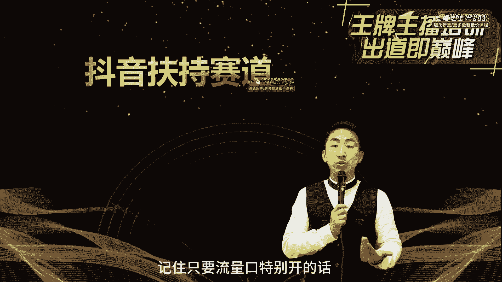

它很快就会出现一个模拟，一旦学习模拟照抄。

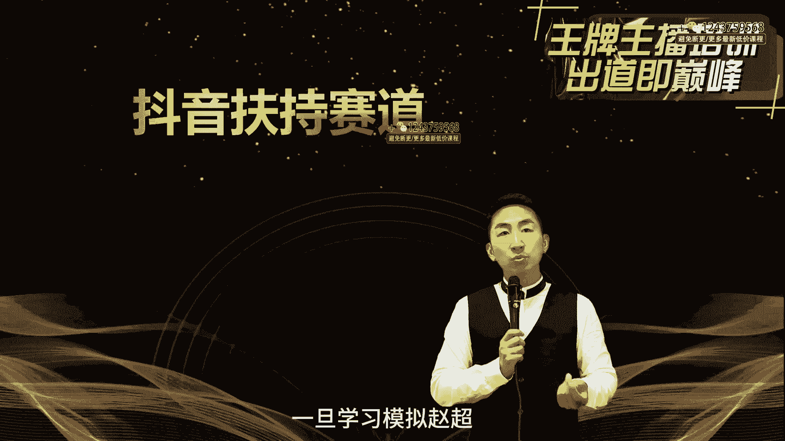

很快你的流量就不具备，在市场上有新奇特的东西了，你就是一个普通的展示了。

就没有意思了，那么第九类的这种直播，抖音孵化的这个窗口是什么呀，这个赛道是叫做同城生活，我们这里面讲的一般探店达人啊。

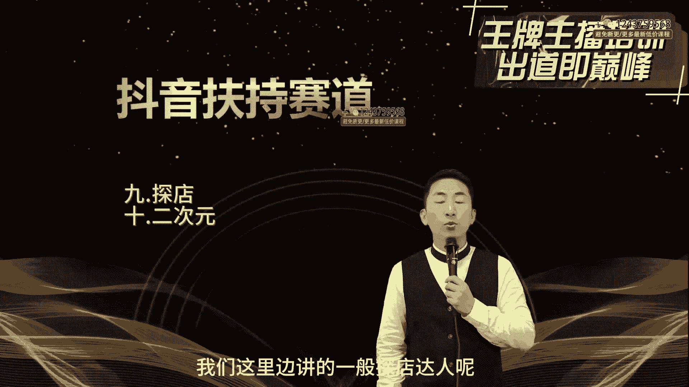

包括本地生活呀，包括这种店家呀，包括这种团购啊，这都是属于这里边。

所以我们说啊在这里边的同城生活里边，你看到没有抖音，这个在左下角的这个页面的第一个口里边，专门打出一个栏目，叫做同城生活板块，我们有些没有跟进的一个抖音版本，还在旧版本的时候。

底下的这个区域你会看到某一个区域它也会有。

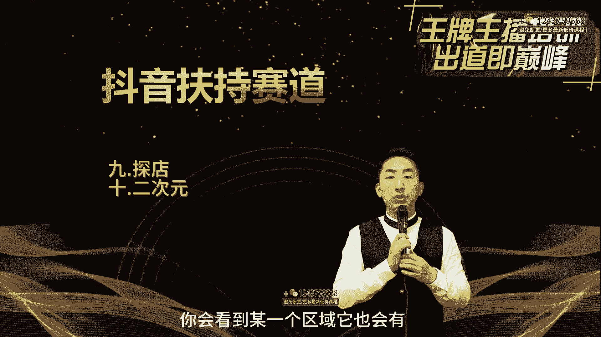

都要叫同城，那么同城流量这个本地生活这一块是现在，因为抖音抖音要结合当地市场，这个非常去结合同城生活资源，我们要做的一个市场，所以说包括餐饮娱乐休闲呐，这一方面它会有很多的这些市场需求和氛围。

那我们个人做直播的话，我们做什么，如果你是单店老板，你就要想通打通你的同城生活流量窗口，那干什么呀，做团购，因为抖音的今年的团购跟美团进行一个大战了，那这样大家抢市场，那团美团的最大的问题是。

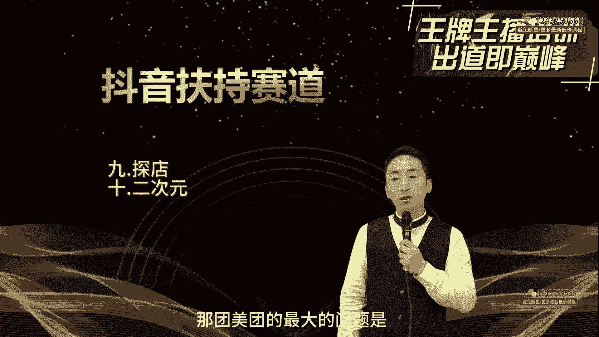

现在的他的抽佣太高了，而且卷的很厉害，大家都已经习惯性在美团上。

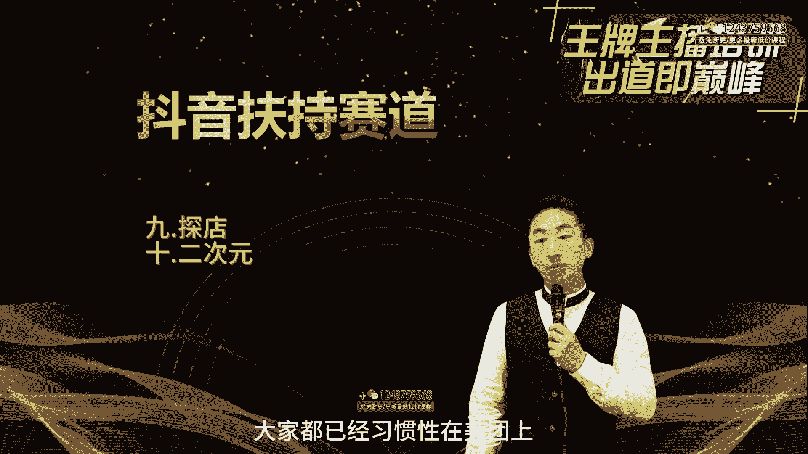

但是同时美团有一个最大的弱点，它是还停留在种草文化，它很少的这个短视频直播这一块还是欠缺，而抖音呢本身对短视频直播这块就是有生根。

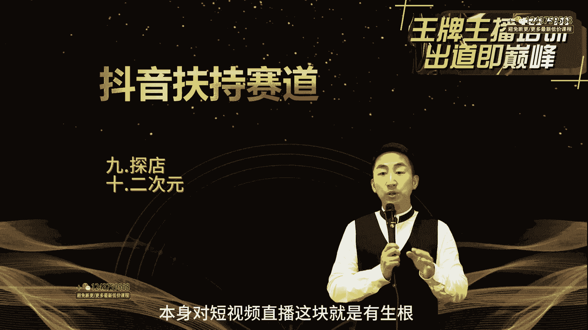

而且有占据资源，再加上抖音有大量的达人能够入驻，帮助你协助去做短视频。

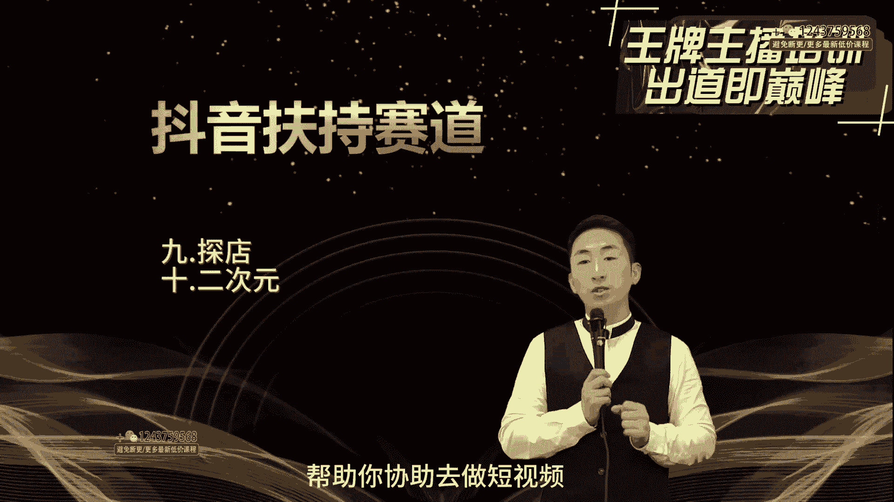

所以这一块呢作为同城生活这一块，我们是有很大的市场机会的份额的，所以如果你有同城生活的资源，你比如说你自己的店主。

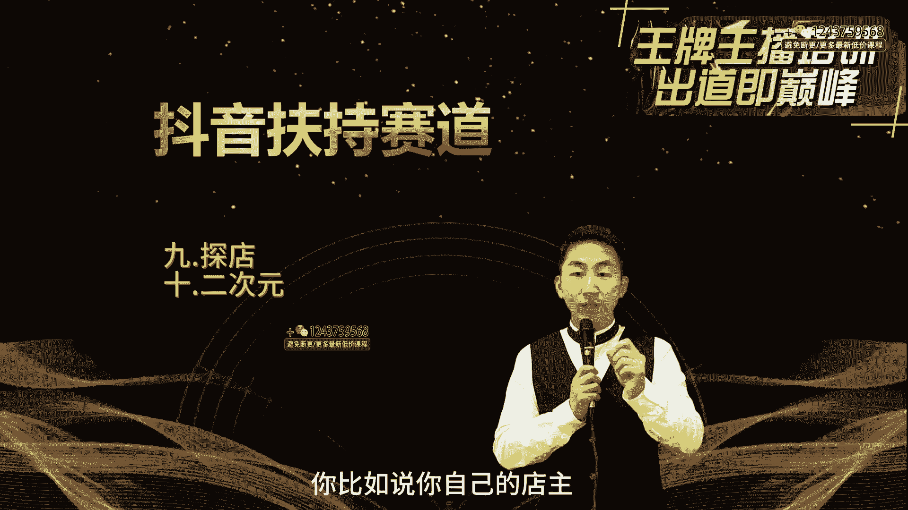

你比如说你的餐饮，你是休闲娱乐，你是美容院美容美发，那么你可以开通它的这个整个的后台啊，开通端口拖后台之后，然后接下来之后通过探店呀这些，然后帮你做整体的大号搭建，这个在后期的时候。

我们自己本身是有这方面的孵化计划的和，培训计划，帮扶计划，这方面我觉得如果你有这方面的需求，你一定要注意了，因为今年抖音是很好的窗口，而今年你看从去年的5月份到今年，已经升级了来客。

然后今年再接下来往上升级，它的抽佣已经抽10%了。

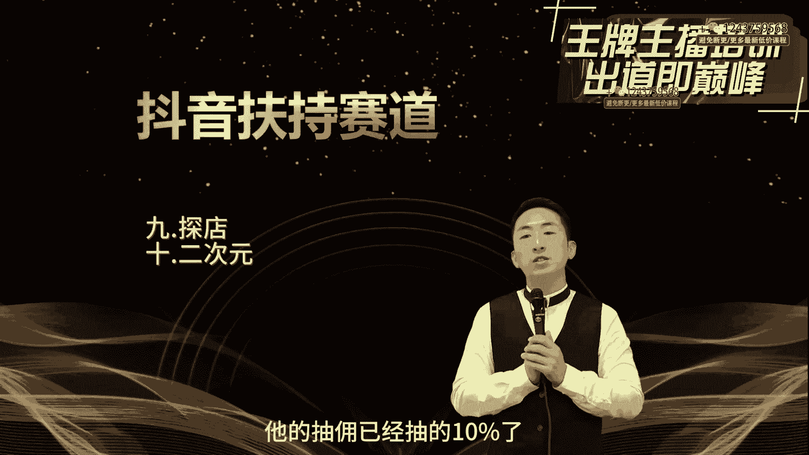

接下来再回抽，如果你入局晚了，他可能，首先我们的市场份额。

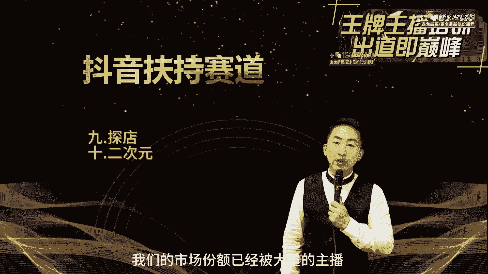

已经被大量的主播和店家占据，那么另外呢就是在这里面抽佣，未来会更低。

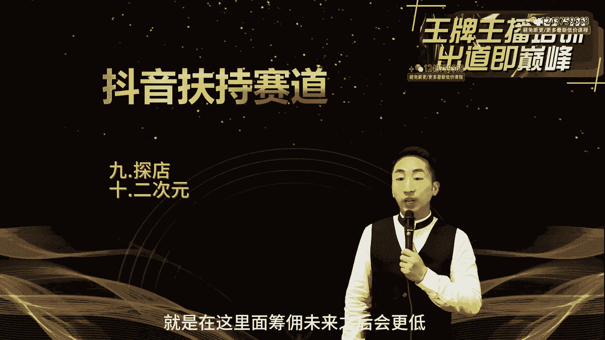

所以接下来你要想入住的话，一定要抓紧时间，而且现在入住的时候，还是很好的机会和很好的时机的啊，同城生活是个很好的窗口，那么对于个人来说。

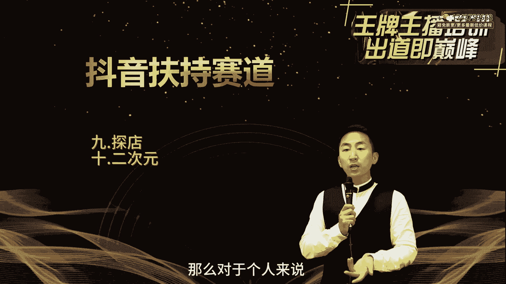

同城生活你怎么玩呢，探店达人记住啊，探店达人其实是一个很好起的账号，这种账号呢你拍上20条视频，同样的可以批量制作，那么这种批量制作之后就配它。

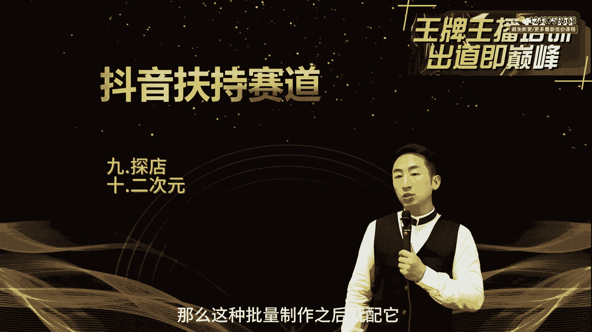

主要是靠你餐饮的本身的这种画质，还有你搭你做的这些视频的这种整体的感官，加上你的产品套餐本身的性价比，这个你可以跟商家可以谈，我们未来的时候在布局同城生活这一块呢，会有很多的这种同城探店主播。

那同城探店主播，你们如果说是想做探店不会做的话，到时候我们孵化你们这个很简单，但在这里边呢我就要告诉大家，你一定要在这里边去想尽一切办法，让自己在同城这里边要找到市场份额，现在呢同城主播探店达人。

现在的市场份额挤得太厉害啊，怎么样去拉开一个新的口，让大家能够看到不一样的你和不一样的展示，这是你需要思考的，其实我觉得在做直播的时候，更多的是大脑的设计和你整个的人设定位，非常重要。

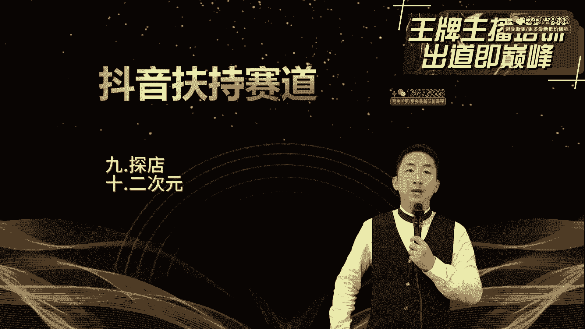

那么我们最后再给大家讲一下，还有一类主播是很好的啊。

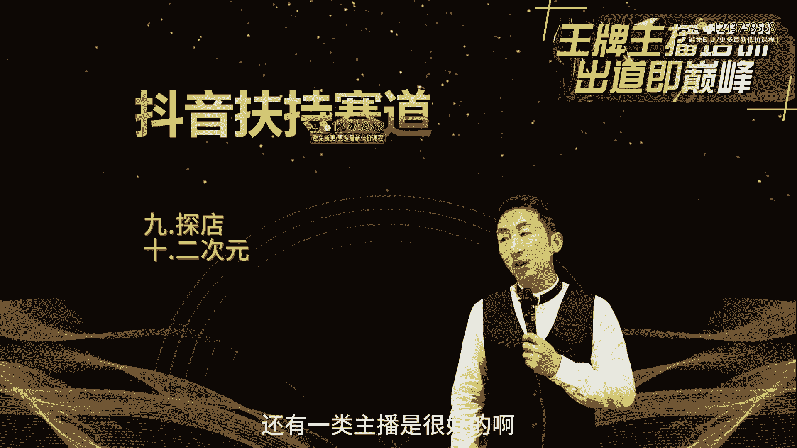

就是如果你会玩游戏，你就去做二次元二次元主播，虚拟主播。

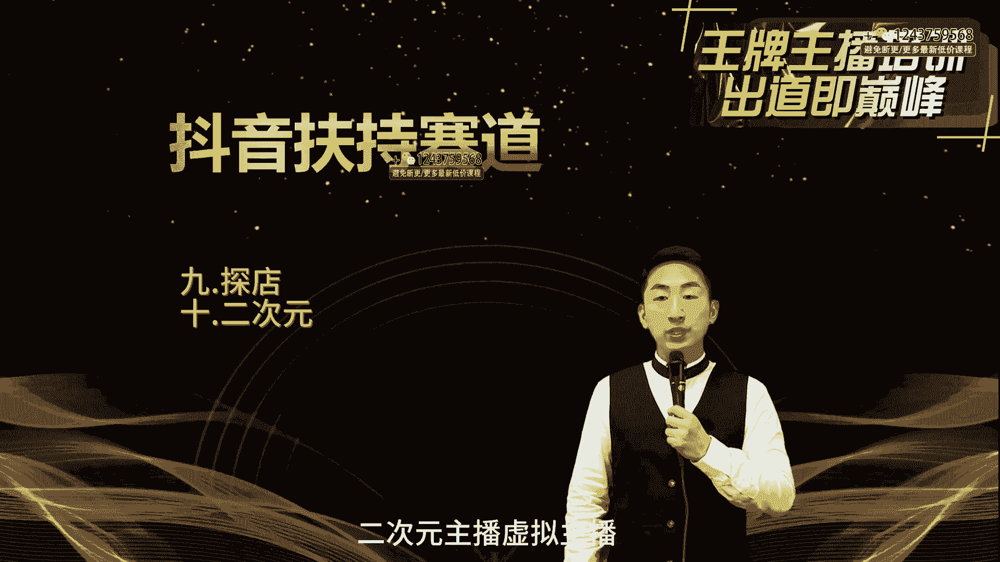

这现在你会发现虚拟直播间，虚拟主播是很多的，二次元直播间，包括玩游戏的直播间，这个是有很多的，我们在底下的开播窗口里面会有一个游戏窗口，对吧。

专门有一个游戏，实际上手机展示，那么很多的主播在玩游戏这一部分市场，你不要看二次元市场份额非常大，那么从这种二次元的，你看二次元的产品，其实我们去追究一下，那比如说卖一些什么呃，就是公仔呀。

卖一些这种呃。

就是小小小小的这种这种卡通的卡通的物件啊。

啊这类东西啊，包括它的这种版权呐，啊包括书籍呀啊包括这些小的这种手办呀。

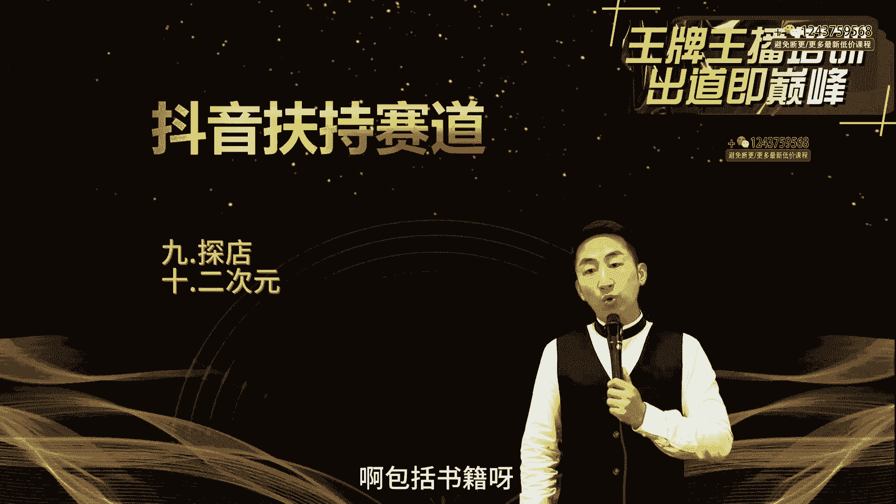

所以这些东西你会发现特别特别多的市场呃，那么在这些东西还有些时候还挺贵的，你看有时候你买一个小的七龙珠的，这个这么一个这么大的一个小玩具，大概有两三千块钱很多啊，所以它的市场份额很大，那么包括玩游戏。

游戏里面下载的这些游戏的这种链接，包括分庸，你看白冰一直在做美食，但是他最后玩的是什么游戏，他最后给你链接的大多数游戏的东西，通过这一个就够赚钱的了，所以说这样市场它有很多的市场份额，如果你爱玩游戏。

你看玩着把钱赚了啊，呃那么我们所创造的这些东西呢，就是现在给大家讲的所分析的这些窗口呢，其实就是现在抖音孵化的比较。

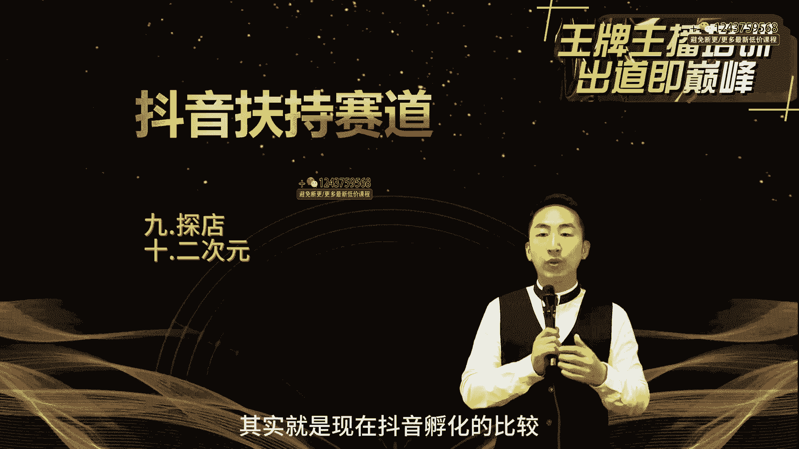

只主要的是扶持的一些赛道，那这些扶持赛道呢如果你要抓住机会的话。

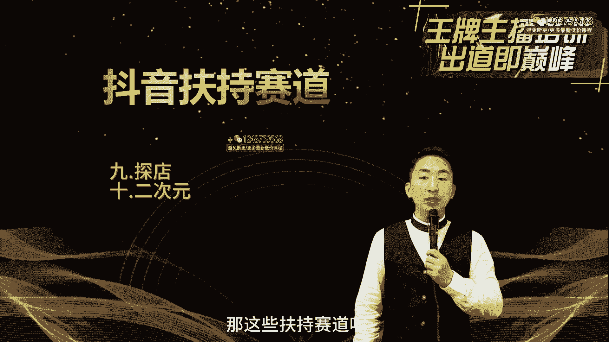

你会很快的起号，那么怕的是我们在一些没有用的。

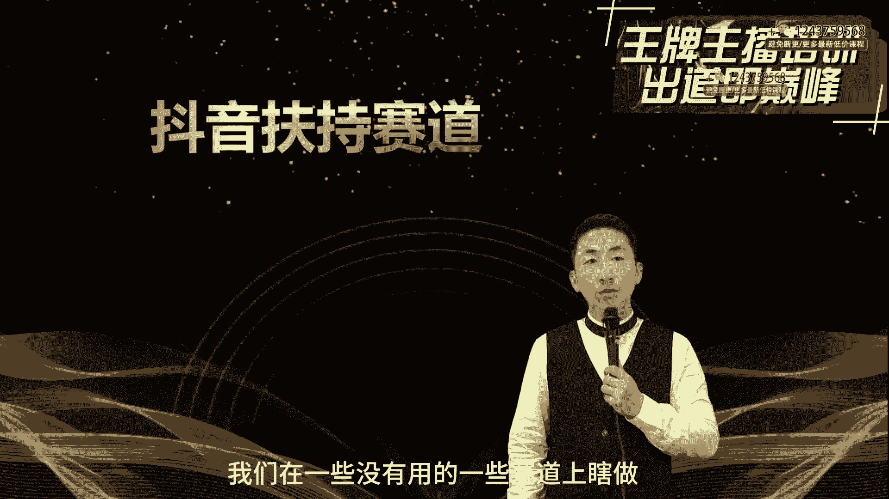

一些赛道上瞎做啊，尤其是我们在自己本身不知道的领域，本身自己不擅长的领域。

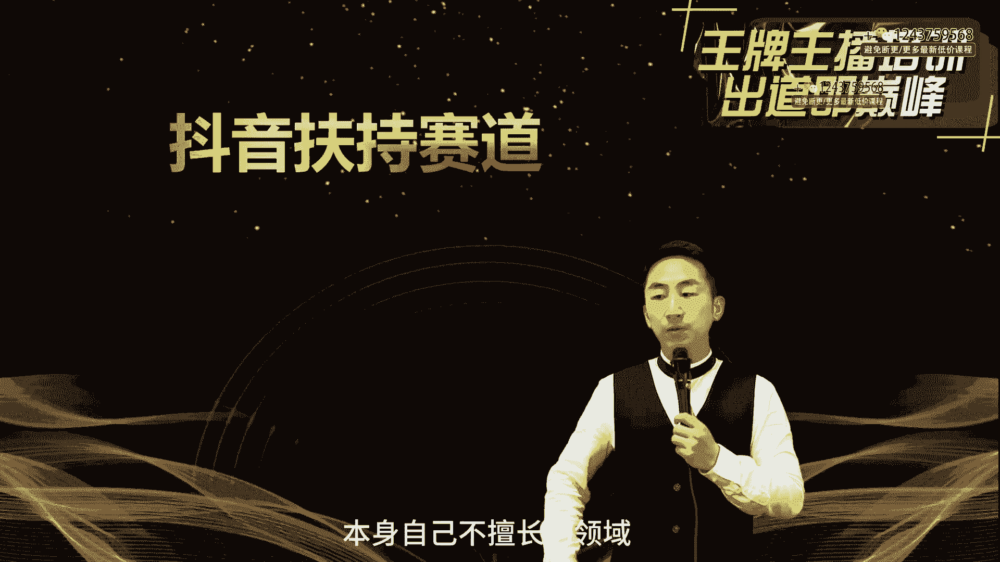

你看着别人好玩，你又去跨了行，然后接下来之后又没有人专门的指导，这时候就会形成一个恶性循环，你瞎摸索肯定是麻烦，那所以说我建议大家在选择孵化赛道的时候。

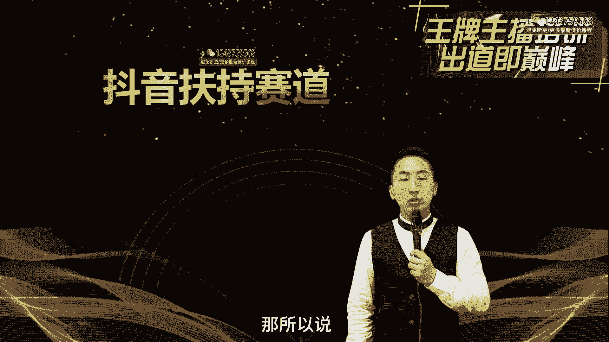

如果有线下的机会，或者是如果有身边帮扶的人。

尽量按照身边帮夫人带你去玩，因为我们每一个赛道再回头去想。

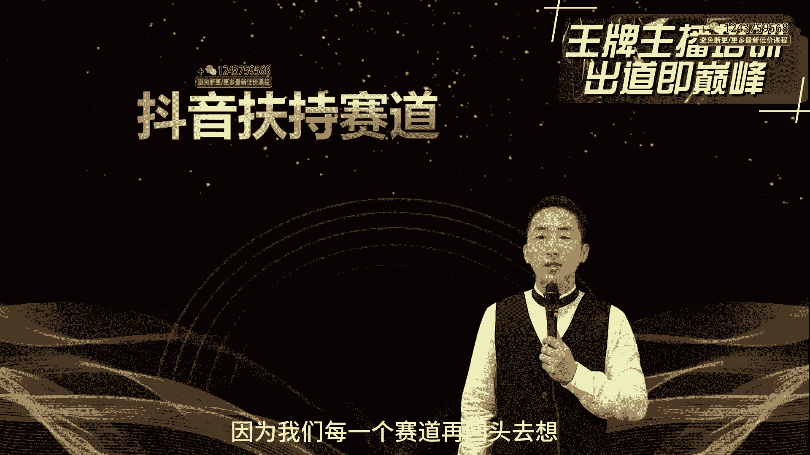

它又是出现了一个，既然大家有共同的认知，就会出现大量共同的竞争。

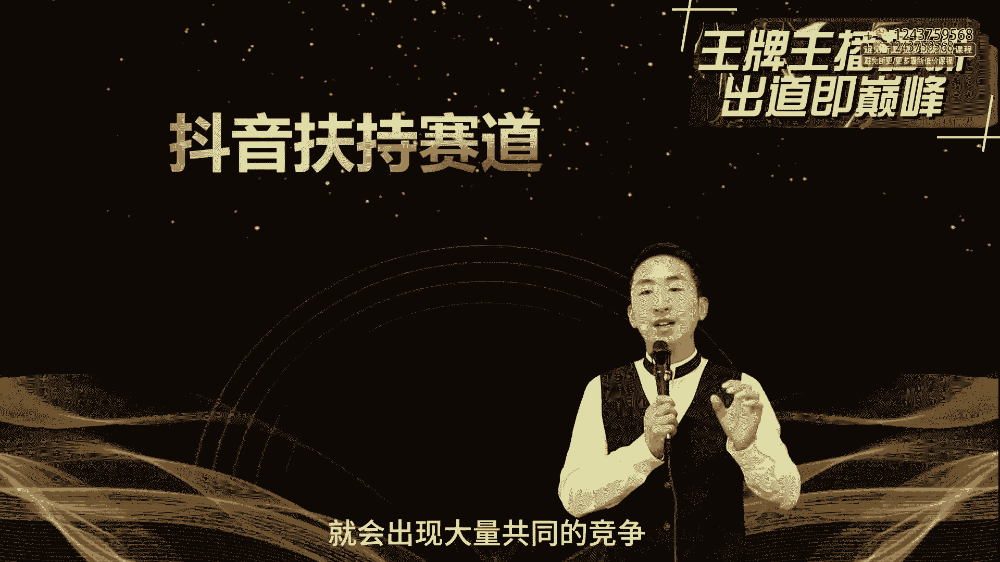

你只是在这个方向上，你有基因，但是不见得在互联网上你能够做好。

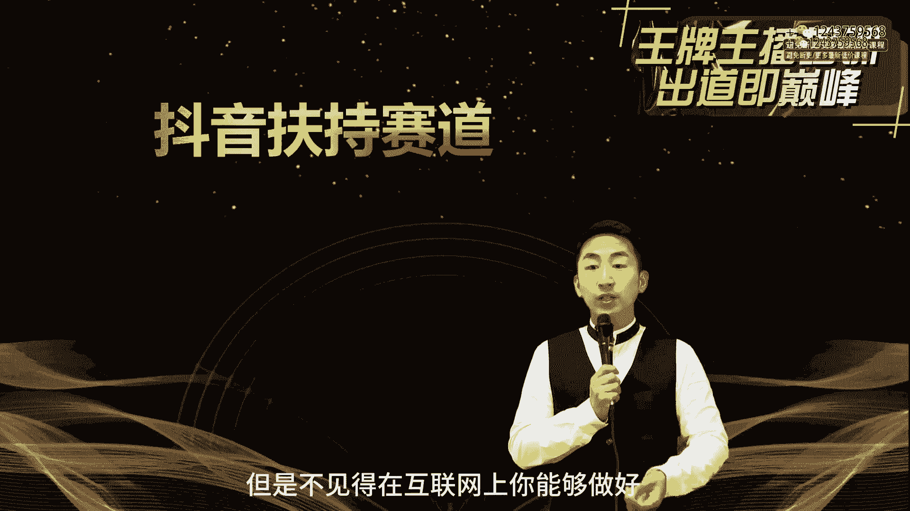

那么想要做好干什么，还要需要进一步的去精准的去学习成长。

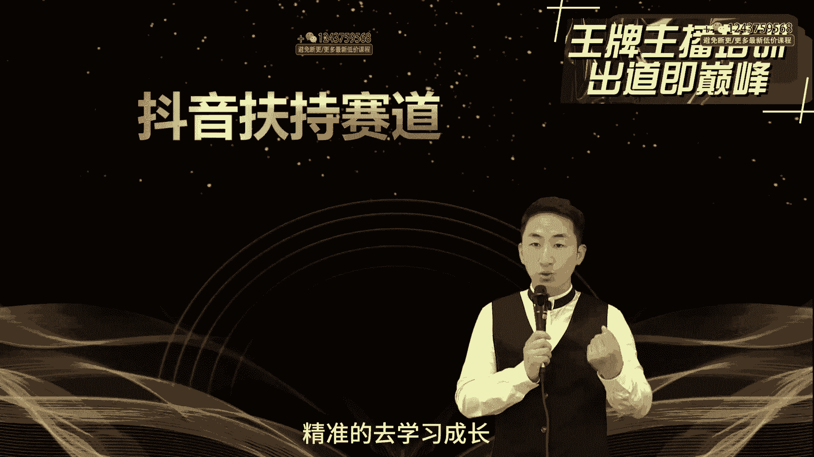

那这个时候可能有里面很多东西，抖音呢有一个最大特色，就是它不光是一套统一的学习和成长。

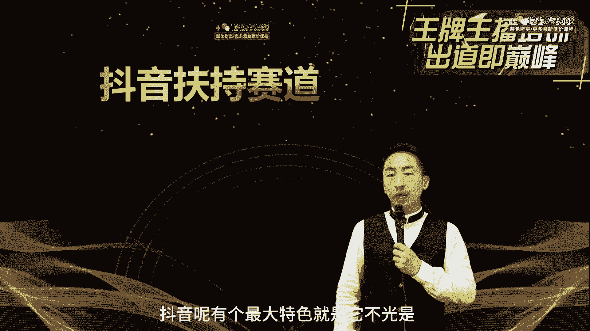

他更多的是在这个过程中。

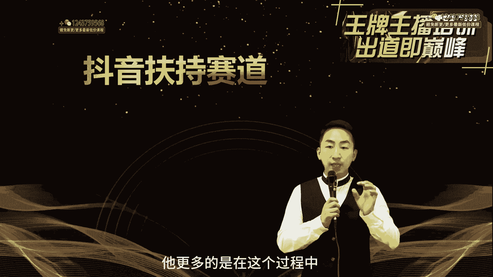

它会不断的需要去在里边更新它的数据算法，那么在这里边呢。

我觉得我们对于每一个主播，我们能够让大家最开心的事。

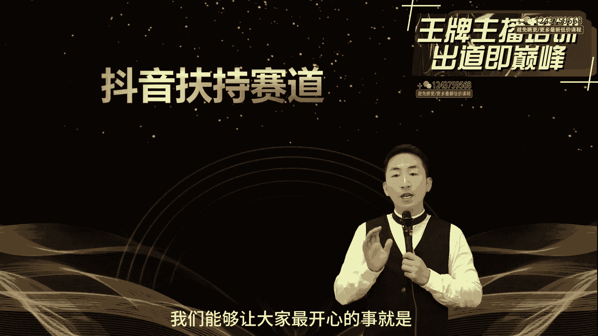

就是时时刻刻知道现场的算法和，时时刻刻掌握最新的算法，那么这个时候我希望各位的主播呢，如果在这样不同的赛道中多去沟通交流，这样有助于你在这个赛道上能够长期发力，想成为大主播或者是想成为一个大的IP账号。

一定要注意选好账号非常重要，不要在你没用的赛道上下费力啊，加油吧。