# 程哥带你起号运营型主播培训AI起号 - P5：第05节抖音帐号定位_ev - 买不起的貂 - BV1mz421y7nx

其实我们对于玩抖音我们有一个初步的认知。

抖音好吗，一定是很香的，但是呢我们会不会玩，我们大多数人都是踩着坑的去玩。

所以说为什么玩不起来，玩不好，原因在于我们自己不懂不知，那今天呢，我们既然慢慢的在进入抖音的学习的过程中，应该有一些初步的了解，那接下来我们应该怎么样去进行下一步呢，唉那首先我们要准备一个好的账号。

那账号本节课就要给大家讲抖音账号定位，你脑袋里一定要有一个思维模式，到底哪种东西能做，到底怎么做才能好能变现，或者适合我，这是你要去考虑的，所以在接下来的过程中，我们这节课会对账号定位。

给大家做一个全方位的设计，那首先呢我们要知道我们的方向，我们要选择取材我们未来的这个账号，他说了。

大家已经了解到了，我们既然要玩垂直，那绝对不是说在某一个账号里边瞎发。

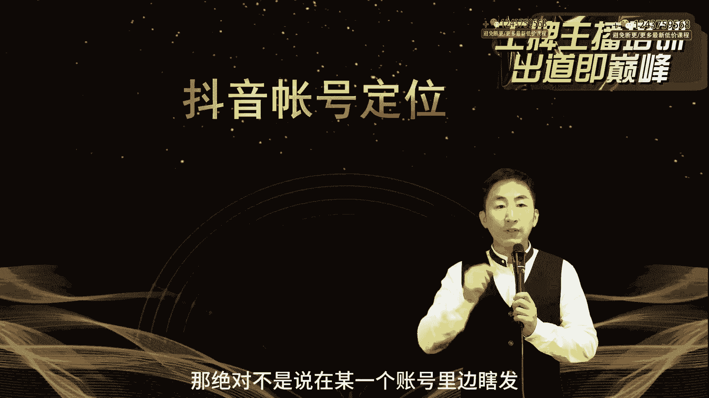

发动发发发生活发自己的作品根本就没意思，就是你一定要发一些跟自己的相关的。

垂直的领域或自己擅长的领域，一个好的抖音号，大家在后面我会给大家讲到，高权重的账号一定是通过持续输出，不停的好，不同的好作品，这时候才会去有相关的权重加权。

那我就要给大家说，你如果账号想要火甚至变现。

那你首先得要给账号进行定位，首先绝对摒弃我们正常普通时候的这种想法。

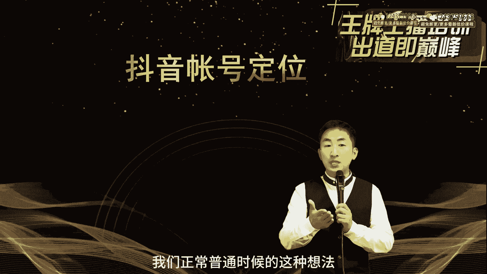

我随便玩一玩，随便做一做，那不行，你肯定做不起来。

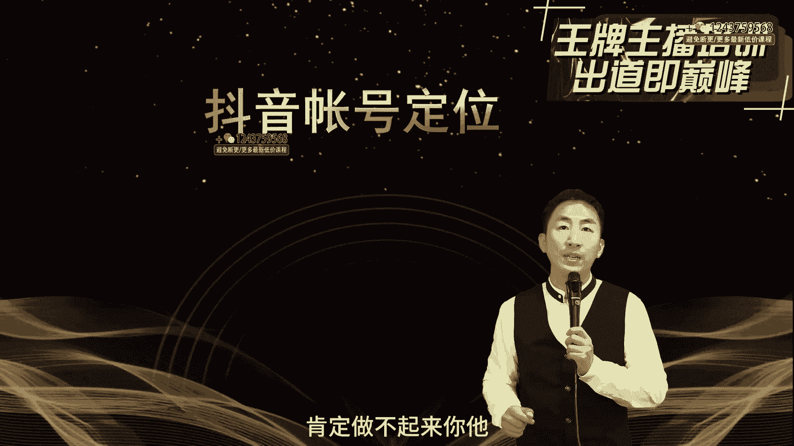

你他你对账号很随便，账号就会对你很随便，那么接下来我们应该怎么做呢。

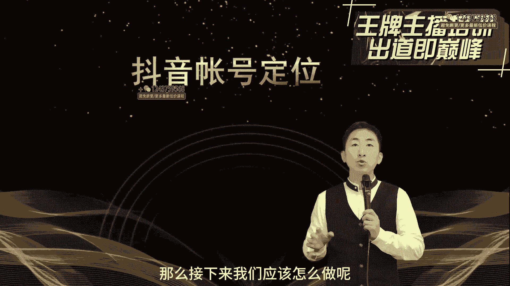

首先你要选一选自己的个人所长，你自己本人要想做一个很好的博主，我们说了，作为短视频也好，作为主播也好，你自己一定要有自己的方向，首先你看看你自己，你是不是属于那种颜值或者才艺的。

如果这方面有你在做颜值和才艺方面，你就会有优越感优势啊，当然了，在颜值这一块来说，很多的各行各业各种方向他都有优越感，那有些人说我长得不好看，没关系，现在抖音的美颜全给你解决了，如果你长得丑，那更好。

我跟你说，你直接把美颜功能关掉，你肯定有流量，所以你试试，只要有特色，有记忆点，这就能行，那么你看你的才艺，到底有没有有没有这方面的什么车，什么说学逗唱这方面的特点，如果有的话也没有问题。

那么第二呢你一定要考虑你是不是有思维能力，比如说我们在做口播的这段直播啊，像做情感主播，或者是像做这种知识付费主播，他的思维一定要严惩，他的思维一定要有自己的代表性，因为尤其是有时候跟粉丝要进行连麦。

或者是粉丝在跟你连线的时候，屏幕互动的时候，能够快速的跟大家去达成这种，达成这种相应的解答问题的能力，以及化解相应的尴尬，这个需要思维的缜密，包括你在卖货的时候，他有这种思维导向。

你怎么样能够把货品通过你的现场直播推出去，这是你需要你有的，如果你这方面能力不了，你就要抓紧去训练，其实这是可以训练出来的，那么第三呢，我们到底是不是属于某一个行业的行业标杆啊，比如说你是做美容的。

你是做酒的，你是做餐饮的，你在这个行业里可能已经有自己的资质，有自己的实力，或者说你是在某一个领域，比如心理学呀，或者是你在什么作家呀，这一方面你自己已经有自己的能力。

那接下来之后他比如说抖音有黄威认证啊，或者是蓝V认证，做企业，你就有蓝V认证，做行业的标兵，那就有行业蓝V认证，那如果黄维呢，你就可能是在某一个领域里边，特别有名的大V大咖。

那你可以你这里边就会如果注册好，就是对你的一个背书，当然了，这种蓝莓黄梅啊，有人会就会传说传说中说是会有流量的扶持，没有这么一说啊，他都是个人账号，那么第四呢就是你有没有自己的产品。

好多的这些主播想要玩作品，玩账号，他是为了做自己的产品，比如说卖久了，卖烟了，卖小食品啊，烟不能卖啊，卖水了，小食品了，这些东西你自己如果有生产能力，或者是你有电商属性的产品，那你可以去做，如果你没有。

你只是做一个产品渠道加盟，我建议你先不要做人家品牌方，随时可以去做，做完了之后你们自己如果人家给授权可以，如果不给授权的话，对你来说很麻烦，那么有人说我做的是非标产品，并不是这些品牌方的东西。

那你要考虑到所有做产品的同学，我给大家一个建议，如果你没有团队打造后端，你就不要去做产品，比如说客服，比如说物流这些东西是必须打造的，一个人在前端去直播，后端一定有强大的这个抖店的运营系统，我们也说过。

抖音去年4月份的时候开始上市，上市了，这个CCR频繁记录评判基准，然后呢，包括我们自己也抖音进行了这个店铺考核，分三秒回复率，这些东西对于一个普通的商家和我们普通人，你拿着一个抖店，拿个手机。

他回复速度要相当快，也就是说手机一响，你半夜起来都得爬起来，就得给人回复，所以你做不到，做不到就扣分，扣分就限流，限流，就最后退出平台，你说你做这个东西干什么，抖音对于电商已经进行了非残。

就是非常残酷的这种方式再去对待这些电商，那他为了消费体验嘛，所以说是压榨电商嘛，所以你如果在做这种电商方式，你想想你有没有电商的能力，如果没有的话，那你不具备自己的电商后台运营。

我建议大家就不要做这个产品的，要想做的话有两种，第一如果有公司能帮你做代运营，或者有公司有后端，而另外一种就是本身如果在精选联盟上，他有这种产品的分享，那你可以做人家的产品，人家的货我卖了以后。

售后不管我就分点优这种可以，但这种的不具备特点，只要能上精选联盟的产品，基本上大家都在卖，只要能够火的东西，大家都有，你今天八块九，别人大主播就敢卖七块九，你不具备市场力，你只有市场宣传力。

所以说产品方面，如果自有产品想要在抖音上卖产品，你要考虑下自己到底要不要建一个团队，比如说一个售后或者是两个售后，然后一个运营抖店发货啊，这里边其他这几个地方你一定要准备啊。

那么另外呢就是我们还要去做一个自己，持续能力持续输出的这种计划，就是你要考虑到你自己是不是有持续能力，比如说我们有跑步的人做健身赛道，那跑步赛道他天天早上锻炼没问题，他可以做这样的一个作品。

如果说我天天在做烧烤没问题，我去天天在直播间里讲解烧烤，这也没有问题，所以一定在某一件事情上，抖音能够持续输出不同同质的内容，然后让你持续的在这个账号里边，能够有持续的活跃度，这样能增加你账号的权重。

你这样账号本身也有它自己的属性，所以这个你觉得你自己个人所擅长什么。

这个非常重要，那么第二呢我们一定要注意啊。

就是一定要注意我们自己的账号准备好了之后，我自己已经总结好了之后。

我到底应该去选择怎么样去搭建。

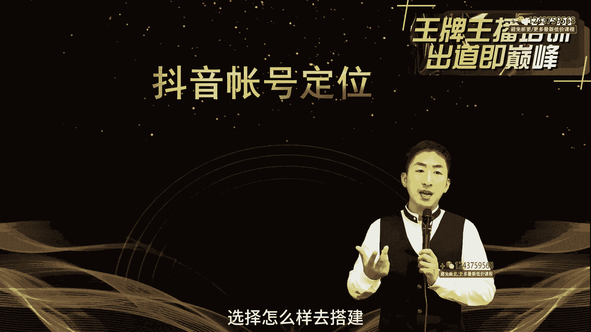

和我们自己的账号定位呢，其实这里面我们做抖音啊，有一个很好的思路。

其实不是说你原创，我们会发现很多的主播在开始的时候，原创原创做了很多的作品。

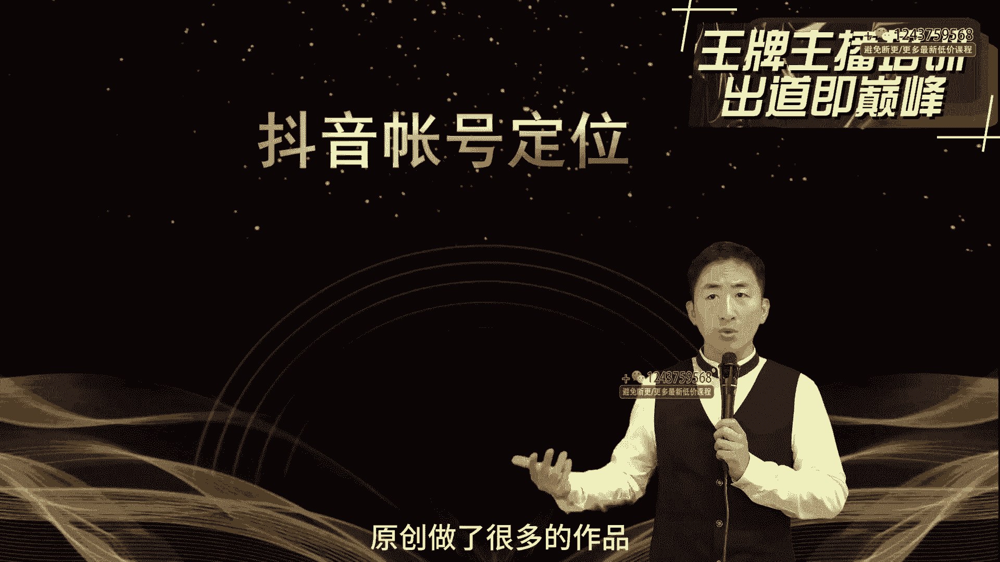

然后呢既设计文案加拍摄，最后发现很费劲，那我不需要这样去做。

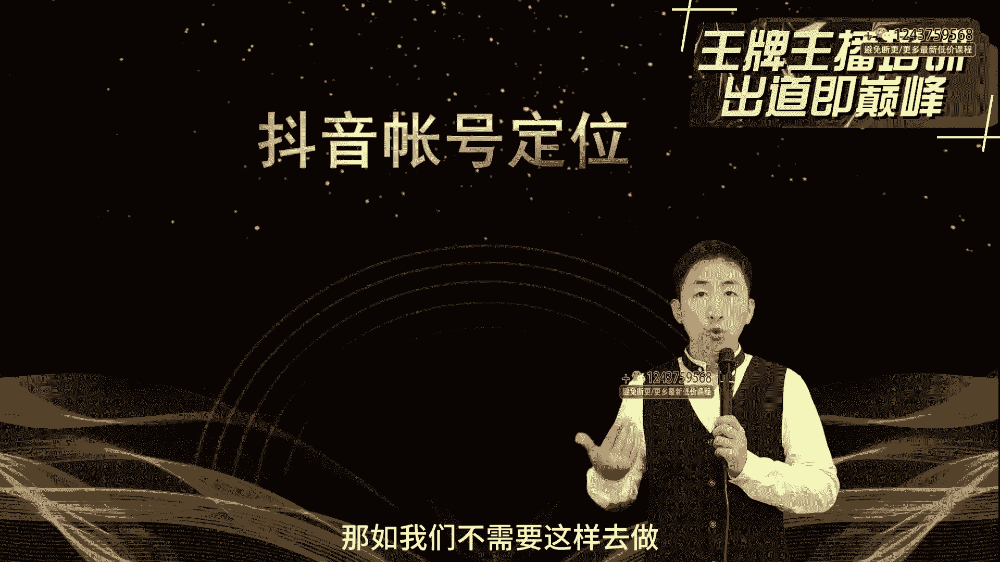

这样做太累了，那现在干什么呢，我相信大家就学会去抄。

去模仿，去学习，去拆解，那怎么办，第一我们一定要去选择对标账号，去分析对标账号。

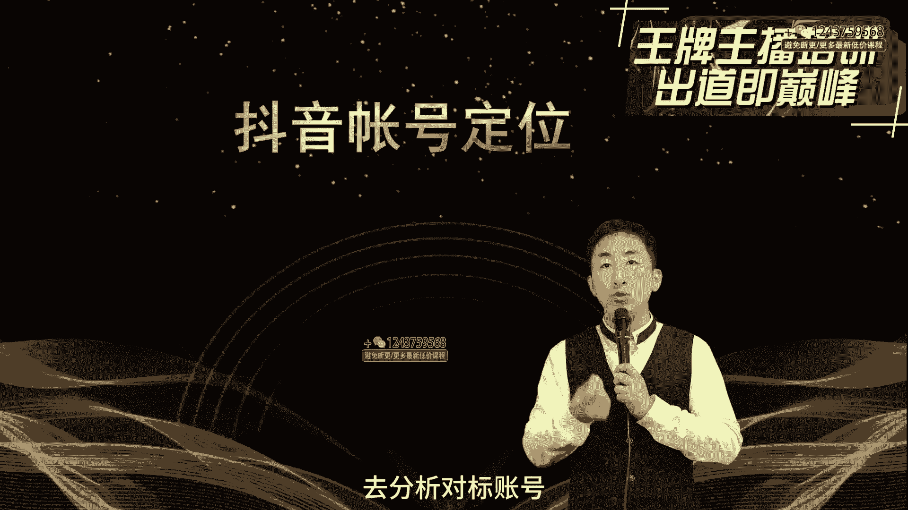

首先呢我们要去选择对标账号。

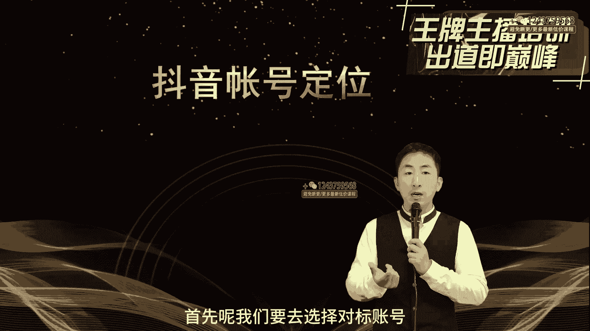

那你在你这个领域，或者你已经选好的一个赛道方向，你觉得这个账号是非常适合你的，那你怎么去选第一呢，一定要去找到你这个行业里边，粉丝量最大的五个账号，那就是他的你的top，这个时候尖端的时候。

你要看到他的这个市场空间，这里面我再给大家强调，我们如果做直播的话，一定要去选择直播间里边人气最高的五个账号，不是说做粉丝量，粉丝量其实在现在已经没有什么太大作用了，他只是对于一个标签，你记住啊。

在做直播的时候，这个粉丝量就相当于你曾经看过人的轨迹，你们也发现你们在看过之前的这些主播，他们之前曾经关注过的，到现在找不到了，我们的粉丝很多的丢失，你也会看到一百两百万粉丝的直播间里面。

其实没有多少人，我们想要变现，我们最终要考虑到直播间的能力，所以这个时候你可能要去选择，直播间最高的五个账号，那么就作为对标账号，看看它里面账号的内容方向啊，这个等会我会告诉你们。

然后接下来之后你要去找到最近一个月之内，涨粉最多的五个对标账号，这个要借助第三方工具啊，到时候我会告诉你们怎么去找这个，你要找到钱五对标账号，因为他可能在尤其是在一周之内，你去模仿他的对标账号的内容。

这样的话能够快速的让你的作品省时间省钱，走捷径，能快速的抄起来，所以这个时候一定要去找到这种对标账号，那么另外呢，你一定要找到相应的自我的细分领域，你自己有没有这种细分市场。

你自己考虑一下这个市场的份额，你不要去看别人好，觉得不错就开始去抄，但这个里边一定要去找到自己的细分，你的市场里边有没有这种细分领域，这种细分领域到底能够垂直到什么程度，你是想做什么，你去精细化。

不是说我想做带货，直接就带货，带什么货，什么样的类型的货，所以这个时候你要拆解，我们后面会给大家专门教大家去搭建粉丝画像，你要倒着比从你的粉丝画像的基础，一步一步往前端，那么这时候你的粉丝画像。

最后导致的是你跟你相并联的，就是你的变现模式，所以说我们在选择对标账号的时候，看到对标账号一定找到它的变现模式，要了解它的变现模式，而我们在后面的课程呢会跟大家讲到，抖音的变现一些思维。

所以这个时候当你发现了你自己，当你看到别人账号怎么挣钱的，你自己要做一个设计，然后接下来你的账号去严格的去模拟它，当你选好了这个账号之后，我们今天的作业呀要给大家去做好。

这样比如说你自己的这个账号标标杆，然后呢自己选好自己的方向，当你选好之后，我们一定要去拆解你现在的账号，就是你自己选好之后，你觉得看到你最适合的，加上你的个人所长。

加上你自己的这个对标账号的这种选择的方式，你开始去拆解它，那拆解什么呢，首先我们要拆解它的整体搭建，他的五件套到底是什么，我们在接下来之后会给大家讲一下，账号搭建的东西啊，那账号搭建呢。

接下来我们也会让班主任呢，会带着你们去做一些账号搭建的内容，比如说你的头图头像，比如说你的封面，你看这个账号搭建起来这个圆圈，然后上面是封面，然后包括你的起号啊，起名你的名字，你的名字是有个性代表性啊。

比如说你的名字加上你的行业属性名字，然后加上标签上签名，你的签名里面的个性人物介绍啊，包括你的账号介绍，加上你的作品，你的作品就是你的账号搭建的这个门头，所以这个里边你一定要去做好这五件套搭建。

那么你要拆解的是人家的账号搭建到底什么，你要去选好你的对标账号，对标账号选好之后，看人家到底搭建的是怎么搭建的，这五件套是怎么搭建的，另外看人家的人物形象，人家是什么样的人设，你要记住啊。

我们在做账号的时候，我们自己一定要有一个正确的人设，你要把你的作品，以及你的个人去演示给你的粉丝画像，让他们去喜欢，比如说你的粉丝是一群女粉，那你一定是一个精致帅哥，我觉得效果会比男粉。

会比女粉可能会强，如果你是知性姐姐，你会了解到一些很多的愿意跟你一起沟通的，这方面，女孩就是他们很愿意倾诉，很愿意跟你跟你交流对吧，或者是你有自己很好的引导方向，或者他的标杆方向。

那么假如说你要去做农民粉，那你要做农村粉，三农粉你自己定义本身可以做一个，就是比如说比如说我是一个农民，我是一个草根，然后我自己做到了这种励志，你要给大家做到这种形象。

包括你带的货一定是对于他们来说普惠，你在农村粉里边，你想给他做这种高端产品，你不要你要下沉市场，那接下来假如说你要自己说，我要做健身，那健身赛道我自己可以把自己搭建成一个，要么就是健身教练。

要么我就自己可以是一个草根逆袭什么的，肥婆逆袭，我自己以前很胖，然后现在回来，这个时候你就可以做一些自我的人设搭建，你要有这样的意识，比如说我自己做整形的，做美容的，以前我长什么样，现在我长什么样。

你给你的粉丝构建画像和构建基础，让你的粉丝，你把你的所有的作品和你所有的直播展现形式，是给你粉丝去做的，这个非常重要，那么第三个呢，你要去拆解它的文案，它的内容到底是什么样的。

到底是哪一些话语得到了大家的经典，你看到他的点赞到底高不高，他的评论，尤其是看评论，各位我们在拆解文案，教大家做高文案的质量的时候，会在里边教你们的评论，这里面这节课不给你们讲。

从评论区能找到很多的灵感，然后去看他的怎么三秒完播率，三秒留存，七秒完播，你要感觉他的这个作品，到底是凭什么能够吸引住你的，那么接下来之后我们要找到他的语言特色，你也要语言特色啊。

就是有些主播会有一种时刻的这种记忆，上当的钱，我来付免费的关注，你来给我点，所以就会给大家造成一种快速的这种人物性格，或者是你在你在你在，就是让你能够通过这个作品，迅速的链接到你自己的本人。

给大家一个很好的一个记忆，另外我们在这里边我们去想到，有一些我们我们在拆解他的账号的时候，一定要看它的变现方式，你记住啊，做账号我们最后是把账号当做一个变现，要摇钱树，当做一个商业模式，他这个变现模式。

我们在后面的课程中给大家讲一下那个变现，你就知道了，所以如果不变现，只是让他做一做好玩，让后台数据一查，后来发现没有意思，这个账号就丢弃吧，就不要去玩了，所以账号定位当你搭建好之后，有了定位了以后。

你心里就有了方向了，那么我们在整个的这种账号定位的时候，我们更熟练的希望大家呢就是在这里边，你要记住，因为你账号一旦定位之后，你要去发不断的作品，你要去产生不断的直播内容。

你要去做不同的粉丝的这个闭环交付，所以这个时候你要考虑问题，我们很多人是有交付能力的，因为我们线下比如说我们卖实体东西，但是你有没有持续做作品的能力，你有没有在直播间里不断输出内容的能力，如果没有的话。

我觉得你在这里边一定要去调整方向，所以我说了账号搭建定位方向，一旦了解之后，你回头再去想一个问题，我到底我的本身的东西适不适合玩线上的东西，大多数同学们脑袋一热，玩了之后玩不好。

还有同学们就是干脆还不知道怎么玩儿，还有或者是越讲越懵，越知道多越不会走路，那怎么办，那接下来我们可以私下去探讨，就比如说我们在做主播孵化的时候，或者我们在培训的时候，我们现在精准的几个方向。

你们也可以参考一下我们的方向，因为他帮你解决了文案的问题。

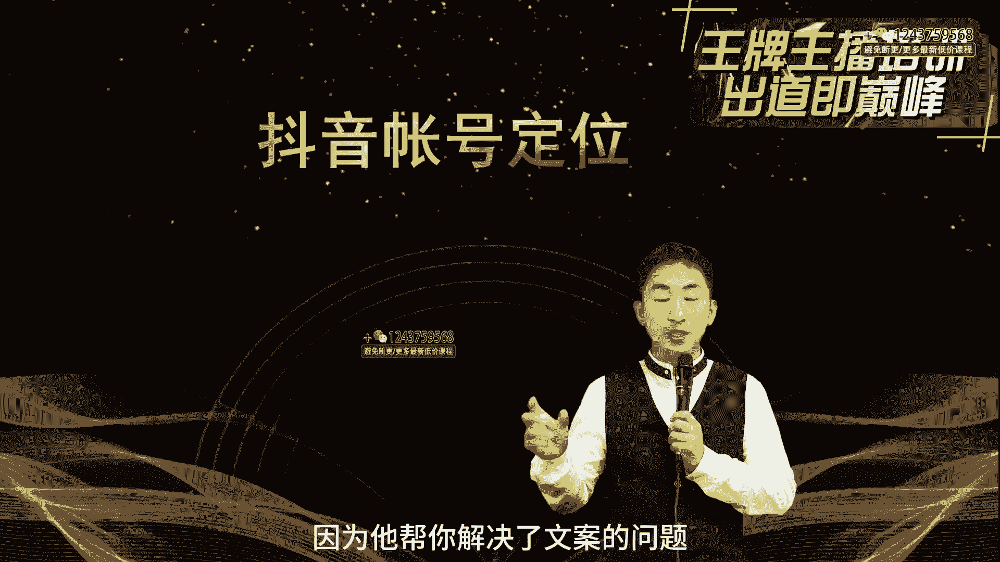

帮你解决了直播推荐的问题，帮你解决了运营的方向的问题，这些东西你可以在这边走了捷径啊。

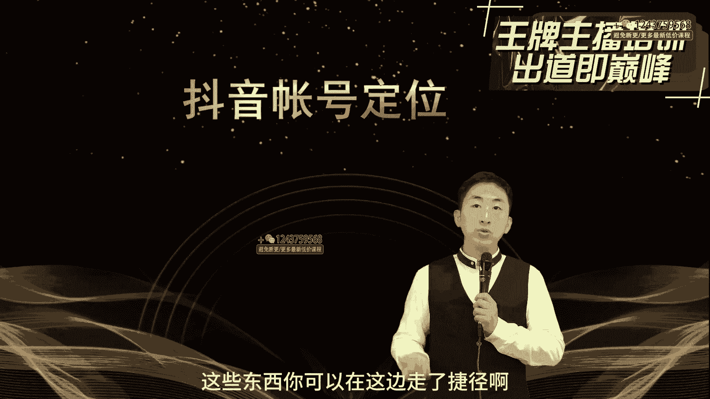

如果没有的话，你可以去往后走。

让我们专业的人去指导你，这样的话，因为进行了这种，就是给你省掉了很多的前端和后端的麻烦。

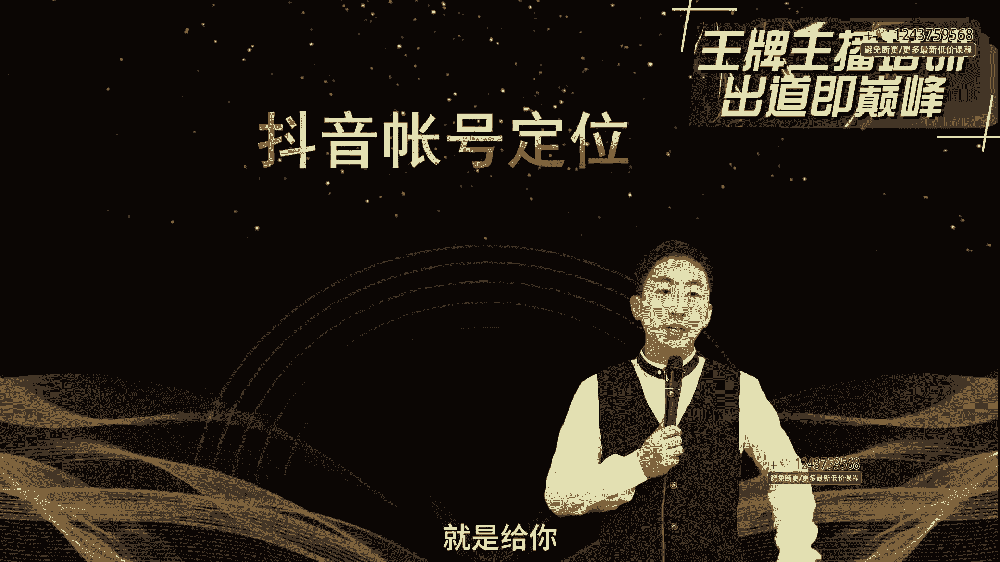

做账号啊，其实我们一个人要去做的话。

想往起做可以，但是你需要的是韧性和创作灵感。

好的内容输出以及敏锐的数据思维，如果没有的话，那么做账号可能会费点劲。

那么今天开始，如果你没有的话，没关系，这些我们一点点来。

我们在后面的这种学习过程中，我们会手把手的一点点教你去搭建这样的基础。

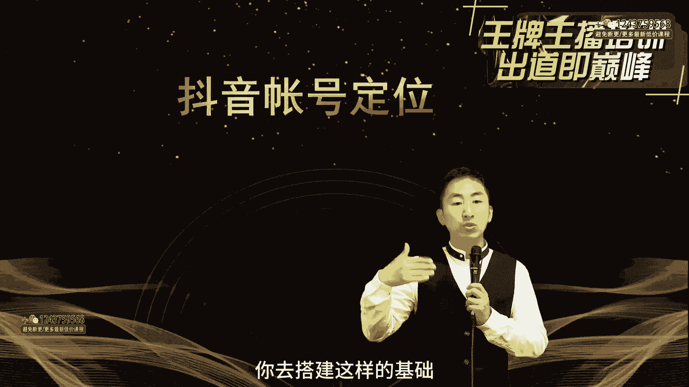

那么同时呢也会给你更多的，这方面的专业的指导啊。

