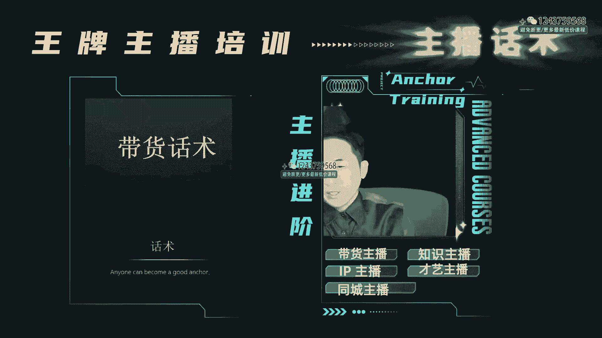
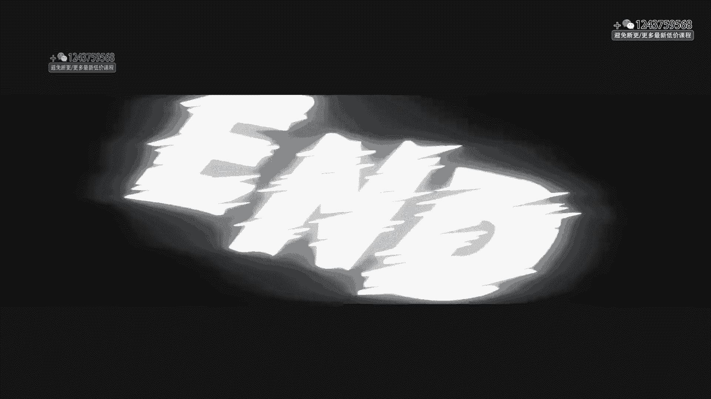

# 程哥带你起号运营型主播培训AI起号 - P6：第29节主播话术_ev - 买不起的貂 - BV1mz421y7nx

好的各位同学们，那么这节课呢我会将跟大家讲一下话术，话术在我们在平时的时候的直播过程中啊，可以说作为主干线特别重要，你能够做的数据全靠主播的话术，那主播到底有没有这个话术能力呢，非常重要。

首先呢我们对于话术，整个这节课呢我会给大家去进行很多的场景，开场话术啊，活动话术，引导需求话术呀，竖屏话术要数据话术啊，这些在本场直播课程中，本场的课程当中是非常非常重要的。

所以呢我希望大家在这堂课程好好去听，也希望大家这堂课程能有帮助，话术啊，重点我们要去了解到底目的是干什么，作为一场优秀的直播，他必须要能够停留互动，转粉评论这些数据，那么这些数据呢是靠话术引导出来的。

也就是主播你的核心，那主播的核心我怎么去引话术呢，第一个呀我先给大家讲一下开场话术，那开场话术之后，我们经常习惯性上来之后写自我介绍，自我介绍，我是谁，我是干嘛的，我给大家说啊。

自我介绍一般情况下别去做，除非你是那种非常牛逼的人物，或者是你能够在你的自我介绍里边，非常的让人感觉到很猎奇呀，或者是想喷你啊，或者觉得这个时候有点意思，有点卖点呀，否则的话不要讲自我介绍。

我是一个宝妈，我来自城市没问题，这个东西都没问题，但是当你说这些话的时候，你要让人看到我来自哪里，但是我今天能给你带来啥，开场话术，第一强调的是利他，本场直播是利你的，开场就这10分钟。

我这10分钟一定要把这个概念拉起来，所以说10分钟讲究的是利他，你比如说我们在开场的时候，如果过多的去介绍自己，那一点意义都没有，所以各位从从现在开始，我们能不能重新把开场换一下。

开场的时候我们太纠结了，非得介绍自我没有用的，你可以这样说，我是谁，我来干嘛，福利是什么，活动的指令是什么，搞点赞，搞评论，搞灯牌，搞停留，来来示范一下啊，欢迎新进来的姐妹们。

我们家是做10年的高端女装档口啊，今天我给大家准备了十个福利活动，来第一个来直接看我的围巾啊，我拿货是70多的，今天不要你买奶茶的钱，打车的钱，我告诉你，你直接邮费拿就行了啊，小星星给我点到3万。

我就来给你发好不好，那一金拿回去之后，外面九十九八十九根本都不是这个质量，我告诉你只需要邮费钱，有没有支持我的支持，给我打个支持俩字好不好，如果支持还没有亮灯牌是吧，你没当灯牌怎么能拿呢。

那这样教下他们助理，教下他怎么去亮灯牌，你看我这里边又拉互动，又拉评论，又拉副又拉话术，你看这个时候其实就是在不断的做数据，这是带货直播间里，如果你是做内容IP直播间，我告诉你开播就用3分钟循环话术。

三分悬挂树什么呀，在里边去拉诱惑，拉停留，拉好奇，我在这个3分钟学法术里边，咱们学员们真应该有这样的这个课程，我给你们在这套课程里面，前面的课程已经讲过3分钟虚化术，你好好去用。

你开场或者用3分钟学化术，就是这个意思，含着遮着，但是不说着，30%的内容干货，70%的水货，这里边呢要保证你在整个直播间的过程中，开场的时候让人感觉到吊足胃口，我非常想听下去，我想听一下的目的。

我想知道到底结果是什么，我想看看到底对我有没有用，你说的都挺有用，我想听结果，我想好奇，甚至还有粉丝打架，你快说嘛，你别磨叽了，真啰嗦，我告诉你，说明你的效果已经出来了，当他们打啰嗦麻烦墨迹的时候。

说明你自己已经有用了，好好去记住啊，就看笑，这有节奏了，就不说，偶尔的给放一点，那就不说明白了吗，另外呢做本场直播介绍，你可以给他我今天的品是什么样子，或者今天直播我就要干什么，我一会儿呢。

今天我要大促，你们一会儿看到的，我是现场的这个所有的这个服装全部都要，一会儿我要给你们一折出啊，所有同学们，你们看到可能这上面看到这个价格990对吧，今天一会儿你们想要吗，想要给我打，想要想要的同学。

我看到你们了，但是你们好像没有做数据啊，你们想要不真诚，你们真的想要的，怎么连黄牌牌都没有，我不给我粉丝之外的人准备，你看这些话题都顺带着去要他们的东西，所以各位这叫开场话术，开场不要做自我介绍。

不要做欢迎仪式，这是开场10分钟，把开场给我拉好就行了，所以各位这是开场至关重要，第二个呢就是我们在出活动的时候，我们要上品的时候，我们要有活动话术，那不管你是卖课也好，卖货也好，还是卖团购也好。

那这个时候呢吊胃口，你不要轻易的上来之后，今天我给你频频的说，我把这些东西讲好，告诉你们，所有同学们去给我去卖关子，今天这个东西啊，我真的是花了大劲才给你们搞来的，同学们，可是今天只有三个。

我不知道你们够不够够吗，不够的告诉我，如果不够的话，这样吧，我再给你们准备一下，但是你们也没有人加我关注，赞赞都点不到3万，你们要把赞给我点一点，点过3万，我给你们准备上，是不是真的想要吗。

我看不到你们想要的，给我打，想要啊，我一直现在这三个人想要啊，能不能给十个人打，想要到现在都没有人打，想要啊，没想要就算了啊，那这个东西我告诉大家，我宁可不卖这个，这个这个确实太好了，就我跟你们说。

现在拿不到这个货，你看卖关子吊胃口，想上吗，都催着向上啊，那最想上，那这样吧，那我们要不然先上俩，上俩够不够，来问问他们够不够，他说不够不够，这个时候就开始了，那这样吧，那能不能我们重新调整一下。

如果不够的话，我们你们这样，你答应我把赞赞点过五个W，今天给我一人给我撇一个灯牌，是我家粉丝，我全肿了，你看说这些话的时候，其实是让别人有这种唉，我觉得我得到了我付出了，完了我拿到了我就不容易记住。

他拿到越容易退货越高，不要让他轻易的得到，这时候反而你的退货率低，明白了吗，这时候我要在直播间里就是憋，你在活动话术之前就要憋，你不要给他憋你的话术，憋你的停留去留人，这叫做活动话术。

把你的活动一定要讲好，那么在这个时候，本场直播的开场宣传，或者是你在整个过程中转品，选品的时候，换屏的时候就用你的活动话术去使劲的给我拉，这非常重要，另外呢就是需求引导话术，需求引导话术是什么意思呢。

我们在上内容的时候，或者即将上品的时候给他们制造他的需求点，你比如说我们现在呃，要给大家啊上一个唇膏对吧，上个唇膏你可以跟他讲有冬天了，场景化一定要说出你的嘴唇有没有特别开裂，同学们。

而经常的时候是起肉刺肉皮，是不是发现你说两句话觉得特别丢人，特别的尴尬，是不是那么这样，你们要不要需要把这个上面纯涂抹一下，这个膏好在一点，就是它不干，而且最关键它很水润，它上了唇之后让唇感觉到很清凉。

最关键的保湿效果还很长，简单的这么一装就可以，这一支能用一年，你看到没有，但是我跟你们说，所以同学们你们喜欢的给你们说啊，拿到这个品，你回去以后，你能让你的嘴唇真的感觉到冬天了。

再没有那种特别干燥的感觉了，放大他的痛点，比如陈哥有时候在卖呃，解决你们这个情感的课程的时候，陈哥就会告诉你们啊，同学们，我告诉你们啊，今天这个课程你必须要去学，我给大家说一下，你真的不想想。

不想给你孩子一个完整的家，想不想经营这么多年感情，就被别人攻守相得，想不想在关系里边就输了，我们在努力了这么久的关系之后，发现自己老公拱手让给别人，我们今天省的钱，结果全部被别人给花了。

你想的你告诉我一声响，今天陈哥我的粉丝，我一定帮你们，只要你想，你觉得你受不了这口气，你告诉我不受气三个字来打到屏幕上，我看有多少人不受气的不受气，今天直播间里，一会儿。

我给你们把这个品全部给你们上这套课程，我今天不给别人，我今天甚至我不卖，我都要给你们需要的给我打，需要来，你看他都在这样，实际上在给他们做了很多的这种互动，放大了他的焦虑和痛点，明白吗。

另外呢我们要强调的是竖屏话术，这是我们引导需求的话术啊，接下来之后我们去强调我们的竖屏，在术品的过程中记住，把你的品啊一定要想得非常好的词汇和词藻来，比如说我们是一个卖保温杯的。

那么这个时候我们应该怎么竖屏呢，大家记住啊，从你的规格成分，材料色泽啊，包括产品的展示，包括细节展示，甚至是场景，你一定要做全方面的介绍，来这里面呢我给大家介绍一下啊，你可以这么说啊，各位朋友们。

今天我跟你说，在这么寒冷的天气里，有这么一个保温杯，你要知道多难多不容易吗，今天我给大家说一下，我介绍的是一个真正的保温杯，这简直是保温杯的艺术品，它不仅仅是一个非常实用的东西，而且它是一个细节。

对追求这个特别的极致的东西，擦工艺品，那么这款温保温杯呢采用了高品质的不锈钢，那保温杯的过程中啊，它时间特别长，基本上十个小时它基本上不降温，而且最关键它设计特别的精致啊，就有如一件艺术品。

拿到这款保温杯的时候，你发现它的重量就是一份安心和一份定心啊，而且他的这个保温杯呢能够持久保温，我跟大家说，在冬天的时候，基本上能够时时刻刻给你保温的这种温暖，无论你在办公室啊，户外旅居啊。

还是在休息的时候，他都会给你成为最温暖的伴侣，享受一口热腾腾的咖啡，或者感受到内心的宁静与满足，当你在外面工作的时候，或者是你在平时生活中，这个保温杯都会给你留下每一个角落，记住啊。

这个保温杯也许就会是你生命中的一部分，那么我给大家说一下，这个材质呢采取的是308的不锈钢，同时呢上面的这个色泽我告诉大家是不掉漆的，最关键这个红色是非常漂亮，中国红看到了没有，这个红色。

而且我要告诉大家，在这个杯子后面，它有着标志性的经验，拿出这个杯子之后看到没有，70年，就这个东西你出去之后，到外面随随便便一说都已经不一样，它象征着地位，象征着高端，而且象征着你自己本身，这是什么。

兄弟们这个东西就是不一样，我告诉你线和量，我今天给大家这么说啊，有几个70年可以让你纪念的这个东西，今天我们直播间里不是卖，记住吗，是收和藏，我给大家说一下，如果你觉得你有这方面的想法。

或者你真的觉得自己特别的有这种爱什么国的，这种想法，我告诉你这个杯子闭眼入这个规则，今天我给大家说一下，我不问什么，要当多少钱，咱们不再卖杯子，咱们卖的是情怀，我告诉大家，因为这个东西本身就不多啊。

今天直播间里我看看有多少人需要的，需要在屏幕打个需要，你看你把你的杯子介绍得非常的详细啊，讲一讲它的与众不同，来同学们，你们看看现在上架了没有，小哥哥不一定给你们上架哦，今天可能只有五款。

那接下来有喜欢的给我打个喜欢俩字儿，谁喜欢的中国红，这个颜色的，包括这个，其实我告诉你其他的杯子你做不到这种位置啊，也许它是一个杯子，但是它更多的是你的人生追求，明白了吗，这款杯子啊有想要的来告诉我。

想要你看到没有，我展示的东西是从规格成分材料，从细节啊，看到没有，这些地方我要去给你展示，你可以把它说大一点，没有问题，但是这个时候他的表情呀，各种状态呀，会让人感觉到一种哎呀。

我特别想要特别想看这种感觉，所以竖品的时候啊，一定要去把你的品说得非常好，尤其是我们在说吃的时候，你要表现出非常惊异，非常的诱惑啊，比如说化妆品的时候表现非常美丽，非常的变化自信啊。

你比如说你要讲到这种产品课程的时候，你要非要讲到能够改变他们，让细节中表现出你对这里面的智慧的结晶，这个非常重要，这里边就是我们说的竖屏，让你的品让他感觉到有客户需求和细节展示，这个非常重要。

另外呢我们要记住品牌介绍，尤其啊我们有时候会带到一些大品牌的产品，羽绒服啊，或者是这种在品牌里边的这种团购产品，团单啊，比如说本地生活，他们会卖一些团购的产品啊，什么周黑鸭的鸭脖呀。

或者是这种什么西贝的美食啊，那那你可以去把这个品牌给他们讲好，比如说产品的介绍，品牌的介绍，团队介绍，技术介绍，你要在这里边一定要强调这个品牌背后的故事，你比如说你要今天输一个青花瓷。

那么在这场直播的时候，你要把它品牌一定要讲得非常清楚，让人感觉到有一种代入感，所以这个时候你要声龙并茂，你可以告诉他，比如说青花瓷，你可以这样说，各位朋友们，那我给大家说一下。

我今天给大家手里展示的是一款青花瓷，而这款青花瓷呢具有蓝色的花纹，而且呢它整个的这个状态啊，包括它的色泽，花釉啊，是非常好的，青花瓷啊，是中国传统的这个瓷器的瑰宝，以奇特的花纹蓝色闻名于世。

追溯到明代历史啊，到今天之后都可以在海内盛行，作为一种瓷器啊，青花瓷具有非常普遍的这种装饰品，它是一种文化的传承和艺术的表达，而且呢它能够传出这种独特的，非常不一样的古朴之美，作为一个青花瓷藻品牌。

我们这个品牌是都知道，生产青花瓷已经生产了非常久了啊，我们花瓷之都，花瓷之都这个品牌已经做得非常的好，你们也知道了，我们这个品牌，光我们自己在这个生产厂家，已经经营了40年有余了，而且在这4年的过程中。

我们经历过了很多的这些改，你可以在过程中介绍他的这个青花瓷的水平啊，介绍他自己的精湛呀，介绍他自己的场景啊，生产工艺啊以及淘汰率啊，这个时候我告诉你，1000盏可能只出一盏。

这个过程中让人感觉到特别的精心制作，专门的打磨，在整个过程中凝聚着匠心，还有凝聚着品位，所以呀这叫青花瓷，叫做经典与时尚元素的结合，让人感觉到赋予了灵魂和韵味，这是上面的这些图案呀，包括纹路啊。

都是经过一代一代的设计师传承出来的，所以给大家说今天所看到的每一个精美的图案，不是某一个人的灵感，是整个瓷器的传承，你看说出来之后让人感觉多好，那我们的厂家呢又是什么样的厂家，具有多少个厂子。

我们有多少个设计师，我们又有多少的这种工匠，在这个时这个厂里边，我们自己的品牌领袖跟我们说，我们要把这个产品推向世界，让我们再通过直播间给到大家，今天的直播间，因为想把这个作为品牌宣传。

所以我不会给大家放太多的价格，我也给大家说，我希望每个人都能用到特别特别好的瓷器，能够感受到我们的国粹，好了，同学们想要这套东西的来给我打个，想要在你的家里面，你发现只要用到它之后。

让人感觉到就倍儿有面，最关键的是这套东西你在别处可能经常买到，不放心，我们家大品牌你看了之后，我用品牌做背书，你自己相信，我告诉大家绝对没问题，所以各位品牌介绍重要吗，品牌介绍就是迅速的。

让你能够让粉丝产生一种信任感，当你的信任感足够强的时候，这个时候你就具备着很强的这种宣传力度，都不用你多费劲，所以说品牌介绍这里边要有自信啊，看着他的眼神一定要自信啊，那么这是品牌介绍。

那么同时呢我们应该去强调的是建立信任话术，那建立信任话术是什么意思呢，就是我们强调了啊，在服务售后保障，你，比如说青花瓷拿回去之后，我告诉你一年之内如果出现任何的调词，你可以随时来找我。

如果说是手机坏了之后，你可以一直保你好吧，就是你在这里边你要告诉他们，我们直播间里边都有运和费什么嫌，就这个时候我告诉大家，因为运费险这件事情啊，不要说赠送本身，在电商里面。

说赠送运费险这件事情本身就是有问题的啊，这个是违规的，所以说我们都有运河费险，你们回去之后啊，也去发现不好使，你拿回来退给我没有问题，我保证大家穿的不合适，你随时闹随时的事，包括今天这套吃的。

你拿回去之后不好吃，给我把壳扔掉，我全部给你们，缘何退给大家，你看说真话让人感觉到特别真诚，同时呢你的这种信任背书特别强大，以及你的实力特别强大，让人会感觉到诶，我觉得愿意啊建立信任对吧。

或者你可以告诉他们，你看在我的app里边，你们看到没有上面展示我们家，你甚至可以给他讲，你看在我们家的这个app地址里边，里面有大量的都是我们的售后网点，你可以再打随便打电话，或者是他可以随时上门。

这样的东西，你觉得能够不放心吗，就这个时候啊，包括我们在卖团购的时候，你告诉他我们的东西你今天买回去随时吃，可以随时退，你要如果不喜欢啊，保证不收你手续费，你看给他说完之后，让他特别的感觉到信任。

觉得售后没有问题，售后无忧，粉丝在买东西的时候，他考虑的是售后，明白了吗，包括你们学的课程，我今天就敢保证诚哥的课程就是好，如果你要觉得不好，你就去退，随便我告诉大家，我能保证的是我的质量。

但是你的味道，你的品味，我这么说吧，我们的退坑率达到0%，你相信我，你就去学，你看嗯，就像诚哥的这个课程，也就是0%，就像陈哥的教直播，这个课确实厉害，是不是啊，所以我给你们说去用，你要有自信。

另外我们在卖课卖东西的时候，卖产品，卖课卖东西卖货，我们在这个过程中，我们需要完单逼单话术，就是促成交啊，清库存这个事非常重要，我要告诉你完单批单话术啊，其实有很多种，我们经常会用到的是玩单B单。

因为在下单之后，有些粉丝会犹豫纠结，不愿意买货，那或者是卖课这种情况下他会纠结，那这时候该怎么做呢，你可以去做完单逼单，你比如说啊你看到他现在库存已经满了，现在还有一位没有付款的，同学们。

有没有没买到的，没买到，迅速告诉我，把那一位该清掉了，现在这一款产品剩最后三单了，同学们有需要的告诉我，三单够不够不够，我没有办法解决，你要需要你就给我说一声，不够的告诉我，我确实没有办法了，只有三单。

还有两单了，现在你还考虑还有一单了，一单没有了，迅速把它掐掉，就是直接清库存来，今天的库存还剩最后的十秒钟，你们想拍的最后抓紧时间，19还剩两单，八七，最后一单六五没有了，4~5没到五就结束了。

那这样吧，那就没有了，还有没有没拍到的，迅速给我打个没拍到，你看你就可以跟他这么说，或者你可以告诉他没拍到就别拍了，平时一会恢复到正常价格499了，现在只有299在直播间里，299确实你们捡到的。

那现在确实没有了啊，你看我们今天用299又给你送这送那送这送，那你看确实是合适，下了播之后就是299咋了，没拍到是吧，你这时候要去带动节奏，没拍到谁没拍到，来告诉我还有几位没拍到，我真的给不了。

真的给不了你，这时候要表现出非常尴尬，纠结难受的样子，表现不太愿意，明白了吗啊好了，现在已经拍过单的，就迅速给我在屏幕打，已拍打过已拍的，咱们今天就能给安排到，没有拍到的，你们也不要着急了。

可能今天没有了，明天下次再再再拍，我给大家说下理性消费，不要着急，你看你越让他不急买，他就越想买，今天我给大家准备了，就这30单，卖完就没有了，现在还剩两单了，你们自己看啊，需要的就去抢。

刚才拍过剩下的28位同学拍了单之后，都去联系客服或者客服都会找到你，今天赠品全部给大家到位就没有了，我也无能为力了，你也可以用信任担保B单，你宝宝们，咱们家这款产品自己用很长时间，效果非常明显。

不光我在用，而且我还推荐给我妈妈，我姐姐，我的闺蜜他们都在用，尤其是我妈每次开播都要跟我说，一定给我多留几套，今天这几套你们别用了，我给我妈留着好不好，跟我妈妈留着，她毕竟是个老年人了。

她在家里平时也用不了，我帮她去拍两单，他确实要给朋友说，她都说用的好，这个是我们自留款的好吗，别拍了好了，宝宝们，我告诉大家啊，你可以用威胁式的笔单，我给大家讲啊，今天这款产品最后一次了，也就这么说吧。

明天可能就要提价格了，价格我明天变了，不要在直播间里去喊我给大家说，反正今天上一次提了价之后，就有人没有想上，到今天还在给我得得得，今天我告诉大家，这个产品还会提价，就像我们的直播课程。

它会一直不断的涨价的，那我到时候告诉你们，当涨价之后，这个价格肯定是往上涨的，你不用管，今天拍了以后以后不用管，但是今天你不拍以后以后涨价，我一定是不给你还的，数据性比单，你可以用数据去B单啊，同学们。

我告诉大家啊，今天手上这些截图啊，你们看看我们在平台上卖了10万加了，而且好评一直在99%上，这些大家都已经看到了，其实你不用担心了啊，通过大家粉丝，大家都在试探，通过这些问题。

你可以知道我的产品就是好，我也敢保证没有问题，结合你刚才售后的话术，建立新人的话术，你放心，只要你今天拍出这个问题，我今天全部都给你试吃了，我都不管了，你看这是就是用我们自己玩单逼单，促成交清库存。

让他们觉得我非常值，另外当你逼完单之后，一定要给他建立信任，你告诉他们啊，我可以给大家说，记住一定最后一定要注你的品的价值，我告诉大家，今天这个品我给大家说一下，如果你们拍到了，最后如果想要退的。

你们抓紧时间，现在就赶紧跟我联系，我还是给大家一个建议啊，就理性消费，你你想退赶紧退，这个别到时候抢着说，是我自己觉得受不了，回去再退，我给大家说一下，我保证的是什么，意思是让你在直播间里边你能拿到好。

同时也不要因为冲动啊，因为这个品你不要的话，别人要的是多的啊，刚才说的这个第二款链接，你们谁还有没有，有没有说是不想要的，赶紧告诉我，如果有不想要的，我的粉丝会跟他们急着要让你的运营去带节奏。

这个时候其实你在这里边其实有一个过程，就让他感觉到物超所值，我抢到东西我特别值钱，明白了吗啊，或者你给他们重述一下，我今天的品，真的你没买到，没买到就算了，确实陈哥下了播直播之后，这个就恢复到原价了。

买不了啊，你们就这样吧，今天就不买了，明白了吗，我在整个过程中去做了一个B单，让人感觉到我真的很信，保证你售后不要太多的麻烦，接下来要去做转款了，在转款的时候我们会发现一个问题，只要这个品一放之后。

转款就会掉，而我们有时候在介绍品的时候，经常会出现这种问题，那么怎么样让转款变得更有意思呢，我们要做好提前预告，我们要做好吊胃口，卖关子，整体搭配式的关联，你比如说卖这个手机好了，这个手机卖完了哎。

同学们，你们刚买完手机的，同学们，我问一下大家，你们这个壳你们手里有没有有没有需要壳，你光买手机不要壳不行啊，话说回来，你买了手机之后，这有没有壳回去摔一下怎么办。

今天直播间你马上给大家上另外一款手机壳，这个手机壳还真是好超薄超贴，你在直播间用的时候，你自己下来用的时候没有任何的感觉，而且特别的轻薄，有需要的，没有在外面的直播间里，今天我是一起搭着给你们做的活动。

也因为你们都加了我粉丝，是不是我粉丝了，试着给我打，是要播数据好了，是粉丝呢，这样吧，我给你们，你们在外面卖199的，今天直播间里我给你打个一折，想不想要想要我打，想要直播间，你去到别的时间，什么宝啊。

什么上面你去找都不可能，这个价你今天想要吗，但是你们得等我一下，我得后台来给你去做一下链接，有需要的给我打个，有去吊他胃口，你也可以这么说，哎有没有刚进来的朋友们，我记得刚才刚才放了一批品。

可能有亲戚朋友没有见到，刚才错过了一波福合力啊，有新进来打个新人，是新人这么多呀，有这么多新人啊，那这样我统计一下，我再给大家一份礼物行不行，你还想要吗，刚才说的那个手机已经没有了。

那现在我想给大家做一个新的活动，来同学们手表，大家有没有需要的手表，来今天把这个也就数你的品的价值，转你的款，用新粉来拉动你的前因和后果，让人感觉到出师有名，你们都说这个衣服怎么有人说非要我的衣服。

这件衣服你们需要吗，都说了半天，需要我这件衣服，谁说的这件衣服不能卖的，这件衣服是限量版的，就我这个不可能给你们的，这是我自己自用的，你们谁要这件衣服，还有要这个衣服的，到现在为止，你们说了半天。

买了这个衣服，买了那个外套，现在是要配衬衣，是不是白了外套之后衬衣不好配，这个衬衣是挺好的，但是我真的我直播间就不可能给你们的，那今天哎呀，我真的好为难的，你们是我这样吧。

如果真的想要我把我自留款的两款我给你们，谁要两单，有没有两单，有需要的，我打需要够的过，打够两单够不够，唉，把品竖起来，记住在转款的时候，一定同样在说你的品去竖你的品，看了我这件衣服之后。

好像裙子没有配，有喜欢裙子来在屏幕给我打个裙子，我看裙子的人挺多的，那这样吧，你们需要裙子吗，需要的跟我打，需要咱们家这款裙子，今天衣服你看到了，我告诉你们，真使眼色裙子才是最好的，在咱们家直播间里边。

每一次一上必须抢空，你喜欢裙子吗，在中间的时候一定要做到转款的衔接，对后面的品提前做好预备，来同学们在介绍第一款的时候，你就要告诉他们，第一款的时候介绍这个杯子好了，同学们啊，杯子等会上完之后。

我一会儿会给你们一波大的福利啊，你们看到杯子等会有，是不是我看直播间里有需要呃，茶叶的，那这样吧，那个杯子我一会上完之后，给你们上波茶叶的符合力好不好啊，我让你们很惊奇，杯子现在先讲，讲完杯子之后。

卖完杯子，放完单之后，刚才我说的茶叶，刚才说想要茶叶的，有需要的吗，刚才有拍过杯子，还想要茶叶的来给我打个油啊，如果没抢到杯子之后，今天我给你们道个歉，我也给你们做过茶叶的福利，好不好，你没抢到。

因为确实是数据，这数量不够了，那接下来我给你们做一个茶叶的福利好不好，想要吗，你们刚才没抢到，我今天再放一波，我今天既然大放血，我让你们每个人都满意，同学们先说大气，在屏幕打大气，先开始给我带节奏。

让他感觉到你在整个过程中，师大的机器出师有名，是有这种感觉的，或者是让他去选择，刚才我介绍的是尖的这种衬衣啊，单领的问一下大家有没有说这种，我想要这种圆领的衬衣，不要这种开衫，就是polo衫的有吧。

有人说是这种单纯的这样比较麻烦，太正式，那我polo可能觉得自习休闲一点，来我问一下你们所有平时平时坐办公室的，给我打个，有谁是坐办公室的，另外我告诉大家，平时时候经常去开车的，有没有有些商务谈判。

但是非正式休闲谈判的有没有，那这种同学们，你们需要在这种场合上去穿这种衣服，可能觉得很紧张，或者是觉得很生硬，那么你要配这种故意的西装，你可以配一条牛仔裤，穿一个这样的polo衫，你想要不想要。

这是今天咱们直播间里面这套polo衫，怎么怎么地，你就去转你的品，用你在出品的场景化去把你的品完美的推出，第二款，听明白没有，这个叫做转款话术，记住不要让粉丝感觉到这一个直播就结束了。

而是通过这一个进入下一个，但是同时不要去快速的上车，因为你在转款的时候又会出现一波流掉下来，接下来之后你要重新再去接单拉人，这个时候重新再竖屏，一般情况下个人直播间里边。

我建议大家两到三款转一转就差不多了啊，如果是你要全品类的，那可能会时间长一点，转款的时候记住衔接非常重要啊，我们再讲讲带货的话术，我们做带货的时候，各位刚才上面已经介绍了一些关于带货的内容。

在带货的过程中啊，我们高手带货绝对不是说天天就讲的价值，价格不是这个，而是把整个的过程中让人感到非常的自然，我们去讲啊，他的这种真诚的弊端，我们要去让他把握他的这个人性，我们要让他在这个时候。

要通过我们自己的人设去感染他啊，跟它价格贵，一定要告诉他价格贵的道理，我告诉你们啊，有些时候你们说便宜的东西不见得他能喜欢，所以带货的时候一定要去解释，你的力度为什么小，或者是这个品为什么贵。

你要跟他讲清楚，让他感觉到非常好，同时呢让他觉得占了便宜，记住啊，粉丝是为了便宜，但是它为了是价值的便宜，而不是说价格，你价格再低，但是不值钱的没有用，我们一定是粉丝，没有说是买东西买贵的。

他只会觉得花了同样的钱之后买到假的，觉得自己买贵了，所以各位这个时候你要去想一件事情，哎，呃我们有些时候。

尤其是把握人性，人性的本质，既需要好的，需要虚荣的，需要被认可的，而且是得到难的，你越让他对方得到越简单，他就越有麻烦，所以各位你们逼单的时候一定要真诚，你要跟他讲。

我们确实这个东西表现出非常一副真诚的样子，我真的就剩这两款了，今天我说到的我们这桶水真的就只有支装的了，今天我直播间里边我给不了你们太多，因为我们卖一款，你们自己算算账，你叫他算账。

你说我确实是赔钱的对吧，但是我今天给到你们也确实是回馈老客户的，你们是我的粉丝，先加波粉丝吧，我看看有多少粉丝，我给粉丝准备一波，你看非常真诚的去订单，然后告诉他们，我真的不能给你们多，只能准备两单。

兄弟们别介意啊，只有两单，这个时候啊记住直播的时候，整个的话说要讲节奏感，你不用太快，你看着他，你说的时候可以稳重一点，让他感觉到你是真诚的在跟他说话，你越稳重越自信，明白了吗，记住前面我刚才说节奏感。

那么你这个时候要把握自己的人性，他会觉得捞了便宜觉得好，这个时候他愿意在你直播间去去等下一款，这个时候一定要去解释清楚中间的过程，你在强调你的好货的时候，你跟他说，你有好货，不怕比。

我相信你可以找到比我便宜的，但是没有我这个设计师源头的性价比的，这种东西，你可能很难找到，唉我可以很负责的告诉你，我是一个是不会吹牛，而且把这个细节我会真的真诚地看到的，我都讲给你们。

我希望对于我的粉丝负责任，所以今天我把这东西我也通过无数的川式，我觉得确实好，我才给到大家好好的去感受一下，你们需要的告诉我，需要你看，也可以通过把握人性，我告诉你，高级的主播是一定是把握人性的。

各位同学们，我的这个产品真的在抖音是不便宜的啊，而且你们也是推荐过来，发现抖音推荐给你们就是都是有智能推荐的，你们要是图便宜，其实也不会来到我的直播间的，你们是讲究品质的，有调性的，对不对。

所以今天来我直播间，你们来对了，你们好好看看我的细节，是不是这么回事，是不是这种作风，是不是这种细致，你们感觉一下是不是不一样，唉我也知道你们是一定有眼光的，今天直播间里边我告诉大家。

你们看到这个细节之后，300值不值，200值不值，我今天都不要了，你还值不值，我告诉你们，我今天让你们感觉到我既把我最好的东西，同时我也给到你们特别优惠的价格，但是各位兄弟们能不能帮我点波关注。

我就问一下大家，今天只要这个我就宠粉丝，你看你要用它，既能够忽悠他，抬起他，又让他感觉到特别舒服，你也可以用人设留人，你可以告诉他，各位同学们，我真的就是一个普通人，我直播间也不是很多人。

我之前也干实体的，没啥团队，我也不懂什么套路，真的你要说让我像他别人直播间里没有了，有了我这个真的玩不来，我在玩直播卖点货，我其实就完全是靠的是福利，我也就这点东西了。

我不像那种呃大网红10万加那种大网红啊，包括甚至1万加大网红，他根本给你的福利，你也抢不到，今天呀我真诚的就重重粉，你们看到的东西我都能给你抢到，我把这些福利呀给你们真八经的都上上去。

你们今天想到底是呃想要这个唇膏呢，还是想要这个口红口红，想要唇膏，我先给你们准备唇膏，但是我给大家说一下今天的东西，我肯定你们会发现你随便在别的直播间划出去，你看到都不会有任何的比他们贵的。

所以我给大家真诚的说一下，你们先点个关注，你们可以比圈价，到时候回来还能找到我，我叫陈哥，你看非常真诚，如果有人说你的价格太贵怎么办，你这么跟他解释，你说你就放心吧。

任何一家公司其实都不会把同等价值的东西，比别人便宜卖，是不是，那谁不想赚钱呢，如果价格比我们低的，我敢跟你说，你可以去对比对比它的成分，看看它的质量，我告诉你它只能减成成本，而我们呢要卖就是卖好的。

我也知道你们想买就是买耐用的，我说的没错吧，所以说价钱和价值你们要成对等，大家去看看货这个本身，我今天这个东西我要给你十块钱卖给你，你敢用吗，这样去跟他说，当他说优惠力度很小的时候。

或者你解释你的优惠力度很小，你可以这么说啊，你说现在市场真的竞争激烈，我们不会傻到把价格提高，然后再送你100块钱代金券，我们不玩这种套路，你们也知道，有时候很多商家确实玩这种套路，咱们不玩。

咱们只是真诚，因为你们购买过的产品，我知道一定不会后悔，如果你们觉得但凡不好的话，你可以随时退，或者在家评论，我都没问题，我能做到就是让你们真真诚诚地感觉到，我们家直播间不玩这种套路，你看多真诚。

你在卖货的时候，你也可以说你憋单的理由，有人在催你快点上货，快点上货，你可以这么说，哎我知道大家都是想急着要上这个货，但是我们的品牌确实是一个持续长久的品牌，我们也不想卖一锤子的买卖，那我跟你说啊。

便宜出了质量问题，这个伤害是对我们来说，远远比挣这点钱是难受的，所以说呀我们更看重的是你们对我们的好评，以及我们不希望你们退货，所以说我宁可多花十秒钟给你讲明白，为什么这个东西性价比高。

为什么这个东西能够让你们能喜欢，为什么好评率反购率那么高，原因就是我想把最好的这些东西呀，很适合你东西我介绍给你，你们先听一听，看看这个到底值不值，现在这个东西啊真的在市面上很少了。

你们自己看一下它的抛光，它的拉面，它的自己的这个润滑度来就讲这样的东西，所以你会让粉丝能够感觉到特别的容易地接受，这个非常重要，我们在带货中，我们一定不管通过你的人设，我给大家说。

好的主播是通过人设来带货的，让人一进来就觉得喜欢，当然了，也有这种气场逼人的这种主播，是让人感觉到一种压迫感，但是紧凑感，他能够让粉丝感觉到这种通过我的压迫，让人感觉到我很喜欢这种直播间，或者这种氛围。

让我觉得很值得去信任，他的这种压迫感，一种强势，让人感觉有保护欲，所以说你根据你自己的情况去设定你的人设，去卖你的品话术啊，是可以随时去改变的，不是说非得去练我的话术。

但是你们在不会的时候可以去用这些话术，另外呢我们就要去做数据，我们在做数据的时候，话术也很重要，比如说我们涉及到浅层数据和深层数据，我们在做数据的时候有互动转粉，点灯牌。

包括点赞这些数据叫做浅层数据检测数据啊，做好之后能够有利于你的直播间的推流啊，它能够有利于你打上这个标签，所以各位我们检测数据要做，你看啊我们互动怎么做的呢，比如说我在直播间里边，我经常会问粉丝卡吗。

同学们，如果你发现你的评论区打的特别慢的话，会影响你第二波推流5分钟之后的数据，所以你会告诉他，同学们卡不卡，如果卡的话，告我一声，我们会把这些数据啊分为深层数据和浅层数据，互动转粉灯牌，点赞停留。

点击乃至付费，这些东西都是我们的数据，我们要通过直播间的话术，很自然拉动数据，所以这些我们不不能只上来之后，就是给我点点关注，点点赞，记住没有主播会要你这些东西的，你在这个时候我要想办法让主播能够喜欢。

让主播愿意跟你接触，所以各位我们在刚才在展示一些竖屏的话术中，我们带了一些互动话术，需要啊，在不在在的给我打个赞，你还可以互动拉动你，比如说我卡吗，同学们，我直播间卡了，给我打个卡。

同学们说话能不能听见，能听见，给我打个能，我说的这个事儿，你们觉得是说的对的，你们告诉我个对，欢迎从头来到陈哥直播间，告诉我，你觉得优惠在屏幕打个优惠嗯，你这个时候去给别人感觉到你是在带动他们。

而且记住你要求话术就是命令，你要求他们迅速给我打一个什么，他会本能的去帮你去打一个，其次你可以去问问反问话术，你可以问他，你说我今天讲的到底这个女人，她的这个情况是不是真实的，你们判断是不是打不是。

请问今天做直播的同学，你们播了三个月还是五个月，是三个月打三个月，五个月打五个月，或者你可以引导粉丝啊，你的互动的时候告诉他，你说今天你们有啥问题打到屏幕上，我来帮你解决，或者你也肯定说来。

现在给我留言的同学们留了言之后，我立马给大家回答，一会儿呢，我会继续给你们解决问题，你们觉得这个品不太好的话，来，接下来之后我告诉我，我在直播间里边评论区打出来，我立马一个个给你们做解答。

你在这边去给他们拉动的时候，就像我们在说话，正常的交流，那么在同时的过程转粉一定要做一，做到我们在正常转粉数据啊，10%到20%是需要的，各位随着你的场关的不一样，我们会慢慢的往下往下调整啊，场关增了。

我们厂我们的互动数据会往下降，往转粉数据会往下掉，那这个时候呢我们需要的是给大家做人设转粉，优质转粉是做人设转粉，转粉话术呢其实就是想让粉他觉得愿意关注你，我们转粉可以有很多的话，如果你是IP主播。

你可以告他，我今天直播间非常的紧张，可能随时断播啊，你们先把关注点好，别到找不着我对吧，你们未来的时候可能需要我帮忙的时候，可以随时找到我，那你最好把关注点好对吧，我今天呢可能在下播之后。

我会给大家发一圈资料，明天开播的时候可能会给到大家，你们需要关注我，那你可以跟他说，你说我现在马上，接下来我我我我要给我的粉丝做一波福利，但是首先你是粉丝，是粉丝，在屏幕打个粉丝。

我还有六位同学没有关注陈哥，那你看看你要不要关注我五位同学，四位同学，那四位同学我谁都不管了，其他同学们，我来给你去一波加油，给你波东西，或者是你可以告诉他，你说我现在所有同学们，我直播间里。

现在已经有一部分同学已经不是我的粉丝了，我今天在讲付费内容，那不是粉丝，我就不要听了，在直播间里我还是给大家说，我希望给是我的粉丝来听，你们先把粉丝全加好，关注先加好，那我今天这个屏马上要上了。

各位同学们，你们今天不是粉丝的，我没法给你上这个屏，大家记住，这是我给粉丝的宠粉福利，到现在六位同学没关注过，你不要去买，刚才还在这给我打字的，说是我需要你不需要你需要什么呀，你都不是粉丝。

有人要做团购券，你跟他说团购券今天我只给你说放粉丝用的啊，到现在了，我的粉丝我不需要你花一分米，你至少是关注我的对吧，至少你在未来的时候你退货，你都知道找谁来退对吧，你至少在过程中生活中遇到任何问题。

你能找到我是吧，我告诉你加我的粉丝不是为了要你，而是为了帮你，要你干什么，要你在以后遇到问题的时候能随时找到我，你把粉丝是不是要加上，就这种东西要去转你的粉丝，利他思维去转粉丝非常的方便。

另外呢就灯牌话术，灯牌话术让人给付钱了，那付钱，这个时候是让人得到梗的比它更大的价值，我们可以通过福袋或者是通过实物福袋，通过抽奖来去拿你的分灯牌，你也可以告诉他们利益，你进我的群，一般群可以加灯牌。

你进我的群去拿东西，你也可以说是你今天是凡是我今天点过灯牌，同学，我看到你的灯牌的名字了，你们捡过灯牌之后，我今天就给你什么，记住一定是交换，今天能够打灯牌的都是交换，有些同学说。

老师我现在你可以用用用共情的方式要灯牌，你说我今天数据真的做得一塌糊涂，有没有同学能不能帮帮我，给我一个灯牌也没问题，还有我告诉他们，我今天想要买这个产品，你们都知道这苹果很便宜的，今天是这样的。

我只给粉丝准备到现在，还有前面不是我黄牌牌的，我是不会给你们准备的，还是这个道理，是我的粉丝，我来处不是粉丝，我不管来，同学们还想知道这个事情后事如何，今天先把粉丝团加上，那明天的时候我在开播的时候。

他会主动提醒你这个粉丝团有个最大的好处，就是我们家三级粉丝之后，我会给你们一套东西，或者是跟你们一场见面会，三级粉丝灯牌，你们先把关注先点好，如果是我粉丝的话，咱们在后面等通知。

另外所有同学们希望你们进我的群，是粉丝都能进去，所以你在说这些话的时候，你是通过力让他们能够加到你的粉丝，记住啊，不要去用福袋呀，包括这个进群呐，千万不要过分的利诱惑，利诱惑是我们发要灯牌的时候的大忌。

大家要注意一下，另外点赞数据，点赞数据要的，自然有同学们说我停下来专门让他点赞，有些同学现在不愿意帮你点赞对吧，你有些时候通过老粉丝帮你点赞，没问题，如果你有老粉多，同学们今天在开播，必须得过10万。

不过10万我没法开播对吧，如果新粉丝流量非常大，你不要去讲，你之后去诱惑，那现在你们想不想看到结果，想看到这里面到底长什么样，现在我给你们打开，但是同学们没有1万赞，我没法打，我今天数据交代不了对吧。

你可以去跟他再讲，你说我这里边我今天我想给你们上这个品，但是今天这个品我今天达不到这个结果，我不能给你们上的，我今天给你们跳支舞，想要跳舞的同学看我跳舞的，你们能不能把赞给我起立，点过三个W可以吗。

我们就差一个W记住跑步快走，让他感觉到点赞的这个速度和频率，让他非常愿意去做这个事儿，这叫浅层数据，各位同学们，点赞数据其实在整个过程中不是特别重要，但是呢我们要去做，这非常重要。

那么深层数据什么是停留付费，停留曝光和付费，我们深层数据是停留曝光和付费，那在这个过程中我们要去做深层数据，各位主播们啊，你在停留这件事情就是憋单，比如产品上来不放单，比如说今天就要给你讲内容。

你记住拉他的诱惑，今天想解决冷战的同学，有没有你们有这种问题，节奏一定要放慢，有多少人想接触冷战的，你们今天在直播间里边，有没有这样开播就不敬人的，你们今天教育孩子，有没有孩子现在天天叛逆期的。

你们今天在我直播间里面，有没有发现你们想买洗衣服，发现衣服总洗不干净的，我今天教你们一招解决这个问题，想不想看我实验测评的对吧，告诉他们诱惑他们，让他们在这边想停留，愿意看哎，你们看到底在发生啥事了。

你们想不想知道，今天我现在来到了这个现场，你们想不想看到今天到底，晚上这些姑娘们到底是怎么样去接待客人的，想吗，所以各位我要告诉你们，在这个过程中，你去让别人好奇诱惑。

期待渴望用这些东西让它能够产生停留，甚至你可以演你在直播间里边，刚开场哭不说话也是停留，让他感觉愿意在你直播间多说，你也可以告诉他们用辩证法，你告诉他们马上260个人了，你们看一下能不能我上260。

来看一下我能不能到260，让他们去停留，记住只要有停留就有推流，这叫深层数据，这个停留的方法有很多，大家可以去多去探索，那么曝光呢你们可以这样去引导他们，就来我直播间来，今天在我场外的同学们。

你们先不用进来，今天我只给场内的同学们，你们今天大福和大力，因为本身抢的人比较多，你们不用进来了，外面的人啊，如果想进来的话，我怕我不够强，你们千万别进来，你看越说反派，他越想进来，就因为场外曝光吗。

包括你看今天产品我给你们上了200块钱券，你们看有没有了，刚才已经上了，是不是没了，同学们看看有没有来，同学们打开你的产品，看看这个产品上有没有你需要的东西，你看看它这里边是不是零零差评。

看看这里面的这里面的东西，我们讲解决的这个课程内容是有没有，你们需要的，想要我绿师，我给你解决的，二三你们想听哪个在课程介绍点开，你看一下，你想听一想听二三，想听三哎。

你们看一下现在这个品是不是还剩一单了，能不能看到能帮我打个能打过能的同学们，我一人在给你们准备一个小礼合物，这让他们去点击直播间的，点击你的产品的点击转换，这都叫做曝光，明白了吗，付费呢啊。

从灯牌到我们的购物，这都叫做下单，都叫做付费，所以这个时候你要去做你的付费成交，所以各位深层数据啊，这个里边我要求大家，包括你的灯牌，这都是深层数据，需要大家去做，刚才我说的。

在浅层数据里我也提到过灯牌，深层数据我也提到过灯牌，我告诉大家深层数据，灯牌更加的重要，所以各位在这层关系中啊，我们去想尽一切办法去拉你的灯牌，那我们给大家说一个概念，你的灯牌能过量200个灯牌的时候。

你的直播间基本上稳在260个人，基本上是没有问题的，深层数据能够决定你下场的推流也急，以及你整场的有效的推流，你的自然流是靠深层数据打出来的，所以各位直播推荐要靠深层数据去做。

前端数据呢他加权分稍微轻一点，这些分啊叫做综合考分，我们如果想做主播的话，一定要有综合考分的能力，好了，这节课呢是我教大家做整个数据，我们做数据其实有很多种方法，那陈哥呢只是把一些呃常见的一些话术。

我罗列给大家，并且讲给大家，让大家听一听，也希望在这堂课中，你们能够真的学到一些方法，未来的时候，你们一定一个个在各行各业都会变成高手，我说的话术一定要综合去应用，这堂课，你可以去回过头再听一遍。

也许对你有帮助，有一些话的技巧要说的自然，说的正常，让人感觉到非常不经意之间就给你做了数据，我给大家说一下，要形成一种习惯，我在线下的时候我都已经形成了哎，平时跟大家说，平时在线下都会说。

喜欢红色打红色，喜欢蓝色打紫色，中午吃米饭打米饭，中午吃面条，打面条，我已经成为了一种习惯，你们也要变成一种非常自然的习惯，明白了吗，明白的。

