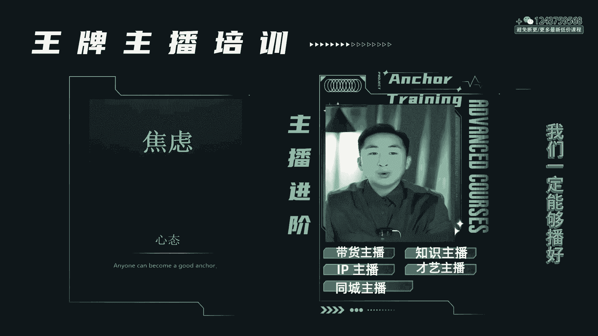
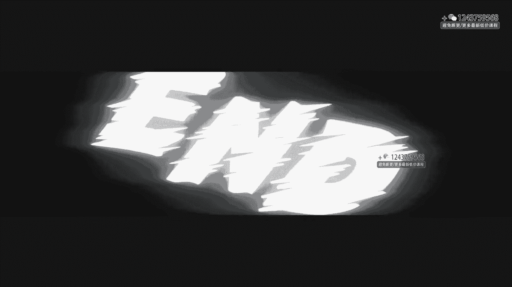

# 程哥带你起号运营型主播培训AI起号 - P7：第30节主播心态课_ev - 买不起的貂 - BV1mz421y7nx

好了各位同学们，那么这节课呢我要跟大家讲一讲主播的心态，作为一个主播，经常就在别人面前赤裸裸的暴露，其实这个时候真的特别考验人，现场直播啊，我们别说现场直播了，你就准备一个稿子说话，你都会很紧张。

更何况现场直接直播，而且底下那么多人，平时说我们讲句话，底下人都鼓掌，现在底下人都喷你，你说你怎么办，而且看着镜头本身就紧张，镜头感又不强，又不知道该干什么，那么现场我们很多的主播就会心态崩溃。

我们到现在有很多的主播，包括你们在学习的过程中，我们一定经过了很大的思维斗争，到现在迟迟不肯开播，越播越不敢播，心态彻底的崩溃，想播的时候状态彻底的击击垮了，就整个人就是感觉在应付也没有办法。

你觉得他能出来吗，他一定出不来，各位主播们，就现在开始，我今天这堂课呀，就是让大家对心态建设，有时候我给大家说，主播的心态特别特别重要，尤其我们在孵化一些主播的时候，我们会经常对我们的主播进行心态建设。

甚至是心理安抚，我本身是一个心理咨询师，所以我在做心态建设的时候，我会给大家做一个更全面的调整，其实作为我的主播特别有福气，包括你们听这堂课的时候，也是我们总结过更多，尤其是在心态过程中。

我体会的特别多的感受，我曾经直播间最高干过8万7人气，我也在直播间里零个人开过播，我自己什么也没有过问，被黑粉喷的一塌糊涂，我被大家都数过大拇指头，结果最后也有可能被别人一顿嘲笑，我甚至直播翻过车。

我甚至在直播间里边，我自己把自己整的人设坍塌，嘿我跟你们讲这种东西都很正常，6年的主播了，一个老主播经历这种东西太多，包括我们底下主播也这样，但是呢我真的能体会到，作为一个主播特别需要这堂课。

而且我经常会给我的运营会告诉他们，所有的运营必须尊重主播，主播是一个高强度，高压力，高心态体验的一个状态过程的课直接，所以这个过程中，我希望所有的运营一定要了解主播的心态，去给主播做好一系列的安抚。

那么今天呢，由我来带着大家去感受一下主播的心态，并且我想亲自来教一下大家，分享我这么多年，包括我带了这么多学生，怎么大家度过这个艰难期的，首先我们所有同学们，我们最怕的大多数。

估计好多同学们就是这个问题恐怖，没有说错吧，不知道该怎么播，你们害怕熟人，熟人看见之后都准备新播了，开播了，结果发现怕熟人看见你，没有人怎么办，害怕这个对吧，怕自己说错话，不会说，不会竖屏。

不会说内容怎么办，怕人家看你是外行怎么办，看你怕人家看见你不是这么个事实，你骗人怎么办，怕自己知道的太少，应激不了，这种场合毕竟是没有见过怎么办，怕没人跟你互动，冷了场怎么办，怕黑粉怎么办。

所以其实我们主播你没有发现这些，怕是因为我们曾经都这么干过，我们笑过别人，我们黑过别人，我们冷过别人，所以我们今天一播的时候，我就感觉，所以你就发现直播间那些黑粉让他真播的时候，他啥也不是。

所以回过头了，风水轮流转到我们了，也得上战场啊，那怎么办，很简单啊，如果你害怕熟人，那我告诉大家，你就换一个号啊，不要让他看见，把里边的这个呃推荐，包括关联手机号全部都给他删掉，关掉，把你的名字。

比如叫陈哥，你就写个258将对吧，你不要去写成歌了，OK了，你把它换掉，让人找不到，你等你起来再说，不要去搜索，悄悄的播这个事儿去做，明白了吗，不要害怕，另外有同学说我不会说话，我告诉你。

作为直播的主播，没有哪个是真的就会说的，你们永远对这件事情不摔打，不会成不会成才，所以放心去播就行了，不会说话怎么了，不会说话，你会问话吗，我不会说话，我大不了，我准备稿子，我拿稿子去念不就行了吗。

啊我不会说话，我怎么了，我不会说话，我就对不起别人了吗，我当我正常的朋友在聊天就行了吗，有什么好说的，我不就是不会要数据吗，我前三场甚至这个号我都不打算要，我就播就行了呗，有这个心态就赢了，明白了吗啊。

他知道的少更没事，他知道的少怎么了呢，我就知道的少，我知道的少，我直播技能我知道的少，我很真诚，我讲的东西就很正常，我只讲我专业，你要跟我非要绕，我就绕我的专业用你少，人之所以焦虑紧张，是因为。

把自己带到了一个陌生场合和陌生的知识圈，所以当你进来之后，你看到你自己熟悉的知识圈里，哎我今天是教情感的，你硬把我绕过情感，说过讲心理学，我可能不会了行，我跟你谈婆媳，我跟你谈体验。

我跟你谈生孩子总行吧，这件事你不就懵了吗，所以这个时候去你知道的少，我总有知道多的地方，我拿多的地方压你，再一个不要怕黑粉，记住黑粉你有两个动作，第一可以拉黑，第二它节奏很快，你也可以骂他完转身就走人。

当然不要骂脏话，你怕他干什么呀，记住啊，所有同学们，你们也当过黑粉，我敢说有人也骂过别人，你们骂人的时候，你就在那骂完之后又害怕又紧张，你也想快点走，怕人家怼你，后来发现做黑粉的。

你急人家怼你一句一顿胡塞，你自己打字打不过来，气的手抖，谁吃亏，黑粉吃亏你吃亏，所以想明白这事儿其实没事，还有怕冷场的，冷什么场啊，冷场自己找话说，不行的话，我告诉你们，我们在代运营的时候。

我们的运营都会帮你们在打字，你怕什么呀，就是我告诉大家，因为陈哥孵化主播孵化很多了，见到新手起号太多了，不是事儿啊，所以同学们，我给大家说，你们如果怕冷场，你们如果害怕这些情况，多了解了解你的品。

多了解了解你的直播内容，多了解了解你自己的直播大纲，请记住，在你的后台里边，一定把你的直播的这个123，你得打一块给我先写清楚，多次在这个过程中，通过一次两次的直播去打磨一个制式化的东西。

我每天直播其实播的都一样，你不要去觉得每个主播很厉害，他每天都直播一样的东西，播一段时间之后做一个整体调整，所以123你偶尔加点东西，但是整体不变，你说自己说100遍之后，自己都认人了。

都认为是真的闭着眼睛都能够脱稿了，还怕什么呀，关键是练习叫刻意练习对吧，然后呢，各位主播不要去听那些什么差评啊，看别人只给你给你负面评价，不理他，看见了笑一笑，做好一个心态，作为主播们，当有黑粉中。

这是件好事，等会我告诉你们，黑粉说明你的直播推荐打开了，另外一定要降低预期啊，本身我直播间就不会有多少，今天涨到100个人，算运气好一下，开播给我干1000人，说明我烧高香，我不想那些。

我就是直播间就个位数能力，我今天减多少是多少，我讲了我三个月就是直播间个位数降低，要求把自己的期许，不是说我把自己拉高了，我觉得自己很厉害，没有问题，不是给自己信心，越给信心，你越失落越难受。

另外啊教大家几个方法，你可以没事照着镜子播，你可以没事的时候自己照着镜子念，你也可以拿着手机，自己没事的时候对美颜相机去看看你多漂亮，就没事就练你的内容，把你内容1231定要练好，另外各位记住啊。

有时候直播间人多的时候，把上面这个人气给我遮住，你觉得不好意思，看见底下一个人说话，把他遮住，再不好意思把评论区给我遮住，就当你自己在讲，自己再讲，讲完就OK了，我不管你其他的数据，我慢慢做。

我先把内容讲过了，我再开始去想数据，做直播的主播们一手抓内容，一手抓数据，一个脑袋要分眼观六路，耳听八方，既要做到数据理论，又要做到主播的技巧，还要做到整场的底层互动，所以你想想这叫眼观六路，耳听八方。

所以各位这个时候先一步步打磨，我们先把自己的专业知识先讲透，先把你本场的竖屏先触到，先把你自己要干的专业知识先弄明白，然后各位不会丢人，你放心，就算是来了，他说你丢人，你可以怼他，要么你啵啵试试啊。

你说的对，你说的对，我确实不行，告诉他没关系，记住只要你起来了都是好，只要你起不来，永远都踩在脚底下，你当这是没有被逼到绝路上，当你想想你被逼到绝路上的时候，还有恐什么，播后面堆着几百万债。

然后没事之后，现在生一塌糊涂，你想想现场想想，回去怎么给孩子买好东西，怎么给自己家人过好日子，怎么给你笑，你爹娘，你就好好想明白，这事儿不播不播，我他妈有出路吗，好好想这个问题。

然后各位一定要自断你的退路，不要去想，如果不行的话，觉得很难受，我告诉你拜师再教你一个方法，找团队，不行的话，找一帮牛逼的老师或者牛逼的团队，他们能够奢侈，你就是告诉你，人为什么在恐惧的时候要需要信仰。

信仰的力量源于什么，源于对他的信念，这些信念就是让你有了信任的动力，你后台有靠，所以为什么古代的时候我们解决不了的知识，然后我们通过信神，你们在解决不了问题，我们通过拜师一个道理，通过师傅带你。

然后在这里边往下走，所以各位包括找团队，就包括我的主播，到现在签了MSN机构的这些主播，我的主播们到现在是非常有信心的，为什么，因为他们在随时随地知道，后面有一个庞大的组织在帮着你们。

因为你不是一个人在作战，这里面就可怜，有一些主播确实是一个人，那没关系，你们今天在陈哥跟陈哥凡事学习的同学们，你们也不是一个人在作战好吧，我希望你们在这个过程中一定去，有机会去找到更坚实的后路。

那么另外呢放松放松，做直播的时候一定要放松，我教大家几个缓解你们直播压力的问题方法，比如说你非常紧张，看见都紧张，大家可以没事的时候去，你不做美妆的，你可以去画一画面膜对吧，你如果是讲教直播的。

教内容的，你可以拿黑板写写字对吧，你可以去放松一下，你也可以不要惊人出镜，你觉得你很紧张，对过去翻过去，拿着自己的实景，你比如说你是做星期二的，没事的时候摆摆摆龙变鲜花的，那就别拍边鲜花不就得了吗。

对吧，你不要真人出镜也没有问题，竖屏你就在那展品就行了，其实没有那么复杂，把你的美颜开开，开漂亮点就可以了，另外放松，我跟大家说，越放松越好，做直播的主播一直很紧张，很焦虑，没必要，不行的话，喝两口。

我告诉你，我在带我的主播的时候，如果迟迟不敢上播，喝二两再上播，你会发现你整个吹牛逼，胡说八道没问题，我要的就是这个状态，明白了吗，去试一试啊，然后各位我们做直播的主播们，这是恐怖。

当你击破恐怖这些概念，只要播起来，你就记住他，就会收获所有的一切是越准备越累，越准备头越大，给自己一个劲儿，就像你蹦极一蹦就跳下去，管他呢，播着播着你就知道了，拨废了，拨残了，咱们重新起号。

等一会儿我会教你降低预期就行了，心态还是要调整的啊，那么接下来所有同学们就是我们在播的时候，我们还有一类人群容易轻敌，他们呢在直播的时候不愿意准备，包括所有东西我不看，我们就遇到这样主播。

我们在孵化主播的时候，经常会有这样，我什么也不想，无所谓，唉得简单，你这什么事都简单，不就说话嘛，哎呀不需要准备，我其实我告诉大家，在开播之前该准备的必须准备直播间的话术，对品的了解。

对于直播间的数据要求，这些东西基本的运营逻辑你必须得懂，那你不懂，你记住，如果你们不懂，把我这套课程全部学下来，你就懂了，不要去听玄学，去按照正八经的教直播的方法去做就行了，你学会了就不要再去学。

越学会越焦虑，这个时候，但是有一点大家一定不要轻敌，不要觉得我自己能做好，你记住所有的小白上来之后都是惨，你不是明星，不是网红，你不可能上来之后就那么厉害，所以这个时候记住放轻松一点，对于直播这件事。

首先要从心态上一定要去重视，明白吗，我们在这个过程中，我们要想好，我们不是从来天生就会的，不是说你嘴快，你就能教直播，也不是说你自己会销售，你就教直播，他只是在别人起号会快一些，你会容易把控一些。

没关系，关键是要去学，有认知，我们要学习力非常强，你要把自己培养成一个具有自信，具有成长性的这样的人，千万不要轻敌，自我麻痹啊，做直播，首先不要觉得这个事儿怎么样，很简单，没那么简单，首先我告诉大家。

但是没有那么复杂，对于我们自己很轻敌，不愿意准备天天叫你学习，你天天不想学习，这类人群还是学点好，否则的话那点热情全部被浇灭了，如果轻敌的话，最后死的会很惨哦，然后第三个呢我就告诉大家。

一定要当你面对挑战的时候，我们应该怎么解决，做直播呀，就跟现场开车一样，天天会出各种问题，什么翻车了，什么黑粉了，到处都有来，今天我看看你们都遇到这样的问题，你们自己看看，我给你们说，这不是件坏事。

咱们有解决方案，比如说我遇到黑粉怎么办，各位主播们，黑粉这件事是难免的，我们叫做公寓思维，永远不会有人说你一辈子的好记住，当有黑粉之后再笑一笑，黑粉来了，说明咱们家直播间自己是正常的，说明好的。

说明有推荐的，没黑粉反而是件坏事儿，有黑粉说明你自己在这个观念中，人家至少给你留了个评论，人家帮你做了数据，你如果觉得这个黑粉有些时候黑粉会带节奏哦，如果一个节奏带出来两个节奏。

三个节奏说你主播啥都不是，你给我怼回去，如果一个G黑粉绝对没有问题，你就给他拉节奏带上去，你跟他说说过一句话，你说同学们，你们觉得老师讲的好不好，好在屏幕打个好带上去，其实很简单，在这个过程中。

你不要太急着去说，我非要怎么样做，而是在这个过程中，我应该去考虑，我不怕没关系，黑粉是件好事儿，明白吗，当有了黑粉之后，说明我们直播间活跃，再者呢利用好黑粉，比如说在黑粉的时候，你可以竖人设，黑粉来了。

你不许侮辱我的主播的粉丝，你说我们什么讲的太初级，跟你学都傻子来，你说我是傻子，说可以，但是不能说我的粉丝是傻子，立马带节奏，黑粉来了，不要去硬骂，因为你骂多了之后可能会影响你的直播间。

甚至会说你辱骂粉丝，这很麻烦啊，所以该带节奏，带不带节奏不要带，然后这个时候当忽视就忽视他都无所谓的，当你节奏特别快，什么都不怕，明白吗，当你流量掉的时候，各位主播我们很害怕，是在开播的时候。

突然之间你的人气刚上来了，啪掉下来断崖了，或者弹了窗，贴着警告啪就掉下来了，这很正常，那怎么办，遇到这种情况，不要焦虑，掉下来之后，咱们第一我们重新做，如果是被弹窗了，过一个小时之后做成交密度是可以的。

如果是今天被弹窗关播了，没事，咱们明天大不了重新开播就行了，你们记住，当你流量开始掉的时候，一定是有原因的，你们先不要紧张，然后回头以后过来跟我来多沟通，或者是问问你们的运营老师，没关系的。

这些都有办法，包括你们直播间出现了突发情况啊，比如说你直播间里边，突然之间直播间里边有些操作不行了，连线连不上了，或者是跟人说话时，他们听不见了，声卡出问题了，这个时候聪明一点，如果是小问题。

咱们就正常跟大家说话，然后呢你记住你说不出声音的时候，你往往在这个时候就会出现了一波增加的流速，为什么大家都听不见，然后大家都好奇，在打字其实是件好事，但是要迅速解决，不怕你出问题，怕你是常常出问题。

一定把你今天的问题要彻底解决完，但是当场的时候不要着急，能够有应急方案，立马应急，如果实在解决不了，立马关播，不要说不要再脱战恋战，否则的话会对你的数据有影响，这是我们迅速要做到的几个事情。

如果你今天账号被突然封号了，我给大家说封号没关系，心情像小一小，我跟大家说啊，封号对于我们主播来说真是恐怖，但是对我来说，包括我们经常直播的老主播认为是好事，为啥能休息了，能放假了。

那么直播真的连假都没有，我们放放假不行吗，放轻松一点，不就是封号吗，而且你记住每一次封号的时候，真的我可以看好多的事，我特想封号，一旦封了号之后，我就特别喜欢，我下来可以给你们录课程。

我下来可以静静的去做数据，可以复盘，听别人直播，这不是好事吗，一旦封号，就是学习的时间到了，你记住一个周期就要封一次号，然后去学学习没有关系啊，另外直播间翻车也不是什么大事，谁没有错呀。

翻车不就翻车嘛对吧，人家假唱的出现问题还得给人道歉呢，有什么了不起，翻车了呀，几种心态，要么我不承认这个事就过去了，直播呀有一个特点，粉丝很少能记住你的，如果说是非要记住你这件事情，翻车了，没有办法。

或者是你影响特别重大，那怎么办，当面出个视频得过且过，你不是大主播，这件事情都没有什么事，翻车了翻车了，老子把账号直接关了，关机就得了，就这么简单，别着急啊，另外呢就是如果你们在播的时候。

始终破不了层级，比如说到260阈值过不了，始终过不了心态，一定要坚定，这个时候要想一个方法，你停留做的不够，你越说的快，越出问题，你越在这喊，越在这闹，你越在这里激情闹大，没意思，去做人性。

我前面给你们讲过钩子话术，迅速转换，用钩子话术其实是能破层级的，破不了层级，是能力出问题了，你的瓶颈出现了，下来一定要总结做好场记，本场直播到底出现哪里问题，你是哪里出现的落差，我们去找问题的原因。

然后各位同学们，就是我在这里我要告诉大家，做直播呢，我们心态一定要调整，我们在有一类直播主播是特别难做的，哪一类呢，老板明星名人你们特别难做，为什么一旦上来之后，黑粉不管你是谁，胡说八道的。

唉你跟那个谁好了吗，唉你是不是那个养过小三儿啊，胡说八道，在这个时候你会怎么办，所以你本身是被人捧高的，到了互联网上你会很难受，为什么很多的大人物不敢直播，就这个原因，但是没关系啊。

你记住张兰不也到处骂吗，啊汪小菲不也到处骂吗，那这个事儿我就自己说，我好的，其他人我不跟你解释，我淡淡的一笑，记住越成大事者脸皮越厚，这个时候你会发现，当有很多的反面的声音的时候，我们就是一件好事。

所以你不要因为一旦有很多的人，你越是有名的人，你在开播的时候越容易出现这种反差，比如说节奏会很快，没关系，当没看见，当然了，也有一类人在底下的时候，真的生意做得很好，但大家不认识你，上来之后你讲你是谁。

大家都说我不信，扯扯你的蛋，讲专业，用专业征服他，懂的人自然就懂，不要去跟那些黑粉黑嘴就抬杠，抬，不过没意思，他们就靠这生活找存在感，你非要跟他抬，这样会很难受，明白了吗，所以各位我们要去调整。

另外各位主播们，我们的预期一定要放下来，一个主播击碎自己的就是预期，因为我们往往在比如说有些主播会告诉别人，主播三天就能起号，哎呀，别人主播跟这个老师学了之后立马就起来了，我是不是也能，我告诉你。

但凡你有这种想法，你都出问题，记住你不是明星，你也不是那个璀璨之星，你中彩票，你看看你中了几次，董宇辉说过一句话，这两天他在采访时候，我特别接受，他说在底层的时候，我们基础知识决定你的底板短板。

但是我们的机会决定你今天的发展，所以我们今天能不能起来，关键不是说我们到底机会好不好，如果机会给了一个没有准备的人，照样不行，你做好你自己就行了，预期降低我就使劲儿，没人我就练苦练基本功。

我今天直播间里哪里出了问题，我突然发现流速上来了，我突然觉得人家跟我说话了，是哪句话说的很好，我去总结而不去焦虑，有些同学们，你们预期可能三天五天就能起来了，但是我告诉你三个月五个月都起不来。

这时候怎么办，我们大多数主播播了一个月播不动了，播着播着亏播不愿意播了，播之后彻底放弃了，在这里面找方法有几种，可能不是说你的能力，第一你的心态需要调整，第二你的技术水平需要调整。

第三关键可能也有账号有关系，或者是为内容有关系，你要综合去分析，这些都要去考虑明白吗，这里面要综合去分析，但是你把预期降低，做直播不可能一口吃成胖子，今天想在直播间说是我想要突飞猛进，我想要要飞黄腾达。

我想要赚快钱，我想要一劳永逸，全是车，千万不要这么做，而且我告诉你们所有的主播们，这就是接下来我告诉你们，主播不光你的预期不能太高，而且我要给你们做好心理准备，你们的焦虑一定会很大。

主播是一个特别没有安全感的职业，我这么跟你讲，好好3年坏坏3年就什么意思，你可能一个月你可能能赚一年的钱，结果接下来之后可能一辈子都很难受，但是我告诉大家，这个过程中需要你调整。

因为直播间它在不断的变化，它的规则也在不断的变，所以各位，当你们会发现自己怎么也播不起来的时候，当你们自己发现自己播起来，吊起来又起来又掉下来的时候，当你发现今天能卖出钱，明天还卖不出钱的时候。

我们应该怎么样调整，经常播着播着自己赚不上钱了，哎播上一大把，觉得自己高傲的不得了了，有些主播们是这样心态，一旦好主播能力一旦自觉强，觉得自己是真有能力，我告诉你只是站在风口上的猪。

今天这个账号把你吹起来，跟你没任何关系，明天你这么播，换个号播你就知道又不行，所以各位主播心态一定要放正，我今天带所有的主播，我告诉大家放轻松一点，但是我们不要硬硬的，非要在自己的焦虑纠结纠缠什么呀。

这就是一个号，这就是一个现象，你要如果太焦虑，准备俩号，准备3号去多拨一拨，有起的，有调的就没关系，另外我告诉大家，如果今天你们自己账号人气掉下来，一直持续播不起来，不就播不起来吗，播不起来我就找方法。

而且我告诉你这个号不好，我就换下一个号，或者现在播不起来，当然了，主播一定要持续，主播千万不要说一听诚哥说你们可以换号，就立马就换号，你们是因为我们不懂得，一定要找懂得人去问，然后再接下来再去播。

但是你的心态，你在一线，你必须得忍住寂寞受的煎熬，经得起小看，因为做主播呀，很多你起来之后，大家都说你是大主播，你牛逼，就怕你起不来，周围人笑话你，黑粉丝嘲笑你，这个时候很难受，所以各位我给大家讲。

如果直播间始终做不上来，坚持坚持，他一定是有流量的，你们会看到很多主播坚持坚持坚持就结果来了，如果你的账号现在一直播不起来，觉得自己很痛苦的话，调整调整不行，去看看电视剧不行去玩，你最喜欢干的事儿。

我一直跟你们说，如果你们长期处在低迷，我在直播低迷的时候，我会经常去出去看电视，我追各种剧，我在焦虑的时候，低迷的时候，我绝对是放松，当我要真的播起来，比如说一天能卖1万的时候，我是往死里卖，你放心。

因为你知道这个过程中，他会很有可能稍纵即逝，当你的账号被抬了，或者是账号流量变下来了，没关系，总结一下是什么让我起来的，我重新再规划一下，当时起来那个样子，复下盘我还能起来。

当你自己觉得自己直播间播不动了，或者你现在真的心情都没了，憋你两天，我告诉你没走到绝路，看到别人都起来了，看到自己没有钱赚了，这时候逼着自己又上来了，所以我告诉你，人心呐往往是因为你长期去占据一件事情。

或者期待一件事情，或者经常疲惫一件事情而痛苦焦虑纠结，我不纠结了，从现在开始放轻松，这些事情都很正常，其实做直播就跟人生似的，起起伏伏，没有永远的长明灯都有起起落落，我告诉大家，这就是人生体现。

只不过它更浓缩更快，困难的时候，怎么让自己心态能调调整，能够自己很正常的度过，能够更加的坚定，遇到自己好的时候，千万不要骄傲，我最怕的是很多主播一旦人气好，我的直播间我带出过很多粉丝，有些粉丝上来之后。

干到两三万人就不认识你谁了，见着我说话的时候都一天哼哼鼻子上来，恨不得我鼻子都在肩上，就是我也有过这样的经历，因为我太知道，但是这个事稍纵即逝，请各位同学们放低心态，今天你记住你的成就。

第一跟你的直播间努力有关系，你确实好，第二个跟你的机遇有关系，我告诉你，普通人啊，平时说周围人给你们的印象太坏了，他们不懂直播，他们会只认为你人气高就是你好，当你人气高的时候，你放个屁都是香的。

当你人气低的时候，你自己说啥都是错的，请沉住自己的心态好好去做，你记住这是一个技术活，当自己努力的时候，天道必酬勤，所以各位主播们放轻松啊，还是那句话。

