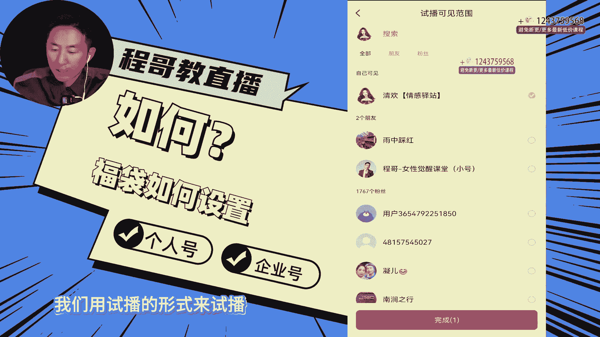

# 程哥带你起号运营型主播培训AI起号 - P9：第46节发福袋_ev - 买不起的貂 - BV1mz421y7nx

OK同学们，那么这一场呢，我们会教大家怎么去在直播间发福袋啊，这节课，那福袋平时的时候，我说起号的时候能不能发福袋是可以的，红包不要发福袋可以发红包，但是福袋在尤其新手起号的时候。

它可以迅速的帮你打评论标签，搜索关键热词，这样对你的账号是有帮助的，所以这个福袋在一个能够拉动拉动你评论数据，所以啊这个福袋在最开始时候是可以用的，没有说是不能用啊，所以你看啊他来了以后。

但是他拉的是评论热词，你们听过我的这个直播运营逻辑就知道了，他不会有任何的影响的，你们就正常发就行了，一场直播一个福袋再整上直播间不能超过十个，一天不能超过十个，如果你开播一场也就不能超过十个。

那我们来看一下发福袋怎么发啊，首先我们在打开抖音之后，我们抖音正常点开我们的账号，点开这里我们点加号，把你的加号点开，这里开直播，我们在这里啊，我们因为在展示，所以我们就直接试播一下啊。

我们用试播的形式来试播OK了。

所以这个时候我们去打开，你们正常是正常开，刚才像我一样设置，把这些页面全部设置好之后，然后点击正常开播，我们在开播的时候啊，我们开播的时候，这个时候陈哥这里边开始跟大家就开始讲解来，我们福袋从哪里发。

在互动里边把互动点开设置的时候，这里边十个抖币，50个抖币，100个，1000抖币，一抖币是一毛钱，大家都知道的啊，那中奖人数三个五个十个，我们可以去去自己来选择，我们自己来选择，一般情况选十个。

选三个就足以了，刚开始开播不需要太多啊，一个也行，差不了两毛钱，明白了吗，所以这个时候就是做到十个30个，然后紧接着参与对象，记住我们在开播的时候，刚开始参与直播，不要设置粉丝门槛。

尤其在新手起号的时候，就不要设置警示粉丝团啊，不要什么还自定义三级五级十级太扯了，你就给我做所有的观众就可以了，第二个参与方式，参与方式记住口令啊，不是分享直播间参与用口令参与啊。

然后进入这个时候倒计时，我们选择3分钟和10分钟，我们一般就选10分钟了啊，选10分钟，另外呢我们现在因为新版本了，之前那时候还有5分钟，现在不用了，就3分钟，10分钟你就选10分钟啊，加赠奖礼。

抖音礼包，支付礼包，还有不加赠，那可以你就支付礼包就可以了，然后点击发送30抖币，正常情况一点击余额不足，你充值充完值之后就可以了啊，充值的时候建议大家苹果手机不要充值，拿抖音难，安卓手机。

苹果手机要扣手续费的啊，所以说安卓手机是合适的，还扣挺多的，扣40%啊，所以啊20%还是多少，你们自己看一下，它是有影响的，所以各位啊，这是我们发福袋的功能啊，发福袋，那么这个自己给自己能不能发红包呢。

不发就是发福袋就可以了好吗。

