# 突破7天限制，生成不过期的微信群二维码，活码系统搭建教程，私域流量运营必备 - P1 - 大海资源 - BV1J7xsefE1T

🎼hello hello，大家好，我是大海。啊，很高兴又和大家见面了。很久没有给大家录视频了。今天呢给大家带来一个非常牛逼的开源的源码啊，叫做私域引流宝。

本来我这期视频呢是想录录制一期短网址的这个开源的项目啊，但是没想到在搜这个短网址相关的这种开源项目或者免费项目的时候，搜到了意外的搜到了这个私域引流宝这套源码。

我发现呢这套源码里头不光包含了短网址的相关的功能，还包含了整套火马的这个内容，因为在很久很久以前，大海录制过一个呃一套这个源码，就是火马，然后这个火马呢，当时非常多的朋友都喜欢啊。

因为它功能确实是被很多做这个网络推广呀，做私域流量呀，做新媒体啊，都都用得着的这样一个功能。但是呢由于当时我录的那个火马的视频。那套火马本身那个源码它有问题啊，它一方面功能有问题。另一方面。😊。

🎼版权它有问题。所以说后来那个视频呢我也删掉了。然后同时那一套源码呢呃，我也没有给大家去发放。但是今天这个我意外的发现了啊这个私运流宝，它有这个国码的这个功能，而且功能异常的强大，而且还非常的好用。

同时最重要的一点它是开源的对吧？没有版权的限制。所以说我赶紧就给大家录制这样一套视频，然后方便呢大家去使用。那么再给大家讲解这个源码搭建的这个过程之前呢，想要给大家大概科普一下，给大家去画一个脑图。

大概致的讲解一下。啊，假设我们现在有一个用户，对吧？然后呢，我们新建了一个这个群二维码，就是微信群的二维码啊。🎼用户，然后呢他来扫码，对吧？🎼然后呢，按照正常的情况来理解。他扫了码之后呢。

咱们这个群二维码呢，它7天就会过期啊，7天过期。那么我们给用户准备的这个二维码呢呃。🎼只能用7天。那么我们把这个群二维码已经比如说我们已经宣传出去了啊，做成了我们的海报啊，然后印成了传单。

然后呢把这个群二维码呢，咱们还呃贴到了咱们网络上发的那些免费资源啊，但是呢7天之内没问题，呼噜呼噜引来一些人。但是过了7天之后，你就会发现自己做的那些呃宣传材料啊，以及贴出去那东西就失效了。

因为那个二维码7天就过期了，对吧？那么咱们现在这个活码呢，就是为了应对这个问题来产生的。🎼咱们在中间加了一个环节，就是咱们这个系统这个系统能达到一个什么效果呢？就是用户来扫码啊。

咱们先把这个地方啊取删掉啊。🎼这个活码是怎么回事呢？用户来扫码，他首先扫到的这个码呢，并不是咱们直接生成的这个微信群的这个其他的二维码。那么他扫的码是什么呢？他扫的码是咱们生成的一个码。🎼啊。

系统生成的活码。🎼那么系统生成的这个活码呢呃它扫了之后就会跳转链接，然后他就会看到咱们这个系统生成的活码背后的一个内容。那么咱们背后的这个内容呢，是由咱们自己去贴的啊。

就是咱们想想给的这个背后的内容贴什么都可以，咱们可以去给他背后贴，比如说咱们微信群的二维码，然后呢，他还是7天对吧？然后呢，我们可以看到这个对应的功能啊，你看这个地方我们就可以直接去给它上传，对吧？

然后去给它上传这个咱们对应微信群的二维码，对吧？它是7天的这个市场啊，给它传上去。那么用户就可以看到，那么过了7天之后，这不是这个码失效了嘛，但是注意这时候用户他看到的还是咱们生成的这个码。

咱们只需要在这个地方咱们新给它上传啊，在这个地方咱们给它上传新的群二维码。哎，然后他又是7天，大家明白了，就是我们可以通过不断的更改这个背后的这个二维码的这个时间。

然后让他一直去呃保证咱们这个系统生成的这个活。🎼它是一直有效。同时呢它这个。🎼生成这个活码的页面啊，给大家看一下，这个地方是咱们这个呃作者啊，开源作者他的一个文档啊。

这个文档的链接我会给大家贴到这个视频的下方，因会看到你扫了这个群二维码之后呢，他看到的这个页面是这样的啊，就是它里头可以设置一些提示提示文字，然后呢，可以看到我们这个群的这个二维码。

那么这个呃群的二维码，我们可以自己不断的替换啊，可以不断的替换。同时呢我们还可以给它贴多个这个群的二维码啊，保证我们系统生成的这个活码啊，这个这个唯一的活码对吧？这是唯一的，它一直就可以有效，对吧？

这就是一个基本的活码的一个原理啊，希望这么讲解，大家听懂啊除了这个系统之外呢，它还能保证我们这个大家都知道现在有很多的活码系统是吧？这个活码系统还有一个很大的弊端，就是它会失效啊。

就是别人一举报它就失效了。那么这个作者呢也从就是开源源码的作者，他也从这个原理上呢，最大限度的为。🎼大家去解决这个问题，它这个问题是怎么解决的呢？它这个系统生成的活码和这个展现的它中间又加了一个步骤啊。

这个步骤是怎么来的呢？我们来看一下它这个东西啊。

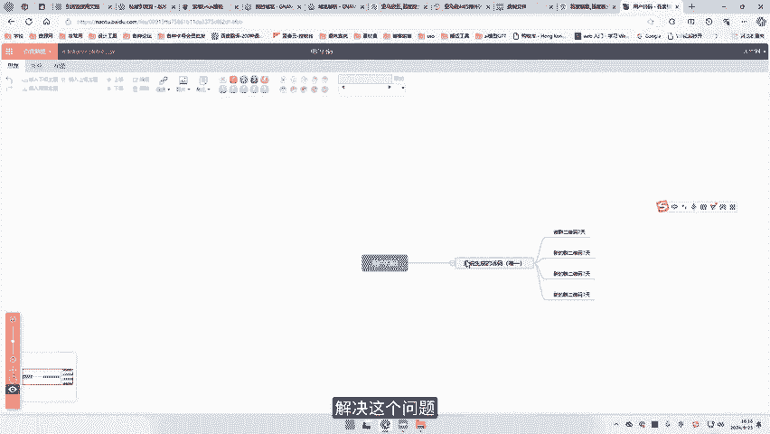

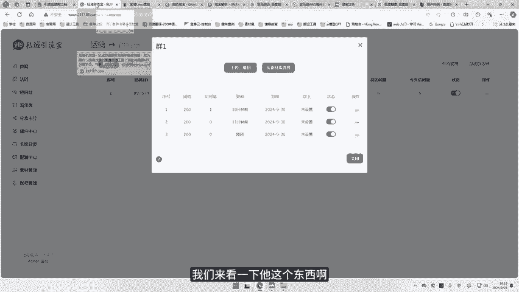

🎼就是他这张图，它呢给这个系统里头呢呃去展现活码的时候，它并不是说直接用一个域名。因为大家知道这个所谓的二维码，它其实本质背后它是一个域名，对吧？那么我们用户再去举报的时候呢，由于他看到的是这个落地域。

如果说你在这个呃大家知道在这个如果有人看你不顺眼就会举报你，对吧？那么他其实举报的就是你这个二维码的地址，如果说他你展现的这个二维码的地址是一个地址，就是说他他是。🎼嗯，就是码和那个地址是同样的地址。

那么呃很容易就被封禁。封禁了之后，你这个码也就展现不出来。但是呢这个作者他非常聪明，他用了一个转接的这样一个情况，就是他不用同一个域名，他用了一个呃这个入口域名，然后用了一个短链域米，用了一个落地域米。

这是什么意思呢？就是我们可以在系统里头看到。

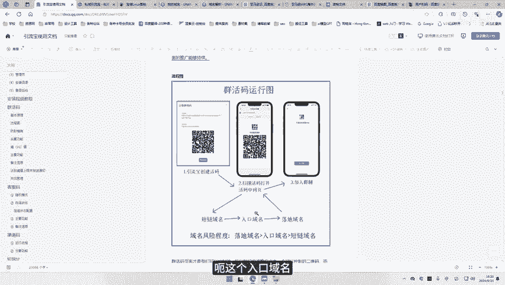

🎼这个我们在创建红码的时候可以看到它是三个不同的域名，这三个域名可以设置成不同的。那么当我们的用户他去扫码的时候，其实他首先访问的是这个短链域。

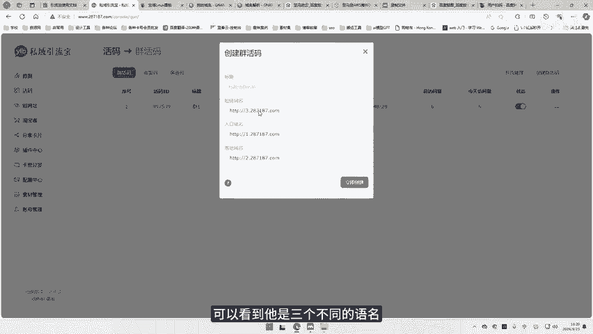

🎼然后呢，他紧跟着他他访问了入口域米，然后最后他看到的才是落地域米，就是这个码其实是在落地域名这个位置。那么呃但是他看到的这个域名，就是他扫的这个域名呢，其实是我们的这个短链域。🎼那么。🎼那用户一举报。

他其实举报的是这个落地域名。那这个落地域名被封禁了。那这个时候呢，其实这个短量域名这里还是可以展现，就是他他这个二维码没有失效，只是这个落地域名，这里失效了。那么我们只需要去后台修改对应的落地域名啊。

去给他添加新的域名，解析新的域名上去，那么就能保证我们这个码呢还是可以正常打开的，大家明白什么意思啊，希望这么简单的解释，大家能够理解。这种情况下呢，即使有用户去举报这个对应的落地域名，它失效了。

没关系，我们再换新的域名上来就可以，这样就能最大限度的保证我们这个呃活马呢能够正常的展示。当然他只能说是最大限度的保证，也不能说百分之百它不会被封禁，对吧？但是会大大的降低这个被封禁的概率啊。

这个就是咱们整体这个活码的这个一套原理。同时呢他还有客服嘛，这是什么意思呢？比如说我们加的这业务量非常大，平时有很多的这个用户来来咨询我们问题。那么我们一个客服肯定是不够的。比如说我们背后有10个客服。

🎼当然这10个客服我们去对外推广的时候。🎼推10个二维码肯定是不好的对吧？咱们用户体验肯定不好。但这个时候只需要我们去推其中的生成一个客服码。然后这个客服码呢是统一的。

然后它背后呢可以去上传10个不同的客服的二维码。这样呢在咱们的用户去扫了咱们的码之后呢，他扫的是同一个码。但是呢给他展现的可能是我们的客服一，也可能是客服二，也可能是客服3。

这样呢就能保证只要有新的用户来，然后就能给他接入新的客服，然后让这10个客服轮巡，对吧？那么这样呢就能保证来的用户扫的是同一个码，但是我们接到的客服是不同的，那，减少我们的这个用户的等待时间，对吧？

还有就是渠道码，渠道码的意思就是说通过这个码呢，我们能辨认出这个扫描的用户，他用的是什么设备。他的IP地址，对吧？就是能给我们的用户做精准的分类。

那么这些功能呢通通都在这个免费开源的私引流宝这个项目里头都可以体现。那么今天呢大海就教大家如何一步一步的。🎼从零开始去购买服务器域名，然后去解析域名。

然后最后去搭建我们的这个私域引游宝这一套系统来给我们自己去做引流的使用。那么呃首先服务器方面呢，依旧是推荐大家使用这个亚马逊云云的服务器，为什么呢？因为呃亚马逊云的服务器呢，它有1个12个月免费的试用。

对吧？如果说大家有一个很好的一个这个这个互联网的项目，或者说这个网网络的这样一个私域流量项目，然后大家呢不想投资，那么你可以先用这个12个月免费的服务器去搭建这个东西，然后去用，对吧？

然后呃如果说用到最后哎咱们赚钱了没问题，那我们继续续费，对吧？那么如果说没赚钱，那么这12个月的免费试用题，我相信也能够测试咱们这个项目好不好，对吧？

所以说这个免费的真的是能够让我们很好的去体验呃对应的这个服务器的项目，那么我们来首先是创建这个账户，对吧？当然你也可以点击这里一即开始12个月的免费使用。当然呃它这里除了这个以外呢，还有其他很好的服。

🎼比如说这个呃无服务器的计算服务啊，还包括我们的一些呃容器管理服务啊，负载均衡呀，就是很多的这种免费的服务都可以去体验。那注册这里呢，首先我们要有一个电子邮件的地址。🎼好，接下来呢需要一个账户名称。

那我这里就大海，对吧？🎼那我们验证电子邮件地址。🎼然后这里呢，这时候呢，他就会往的电子邮箱里去发一封邮件，对吧？🎼然，他给我发了一个验证码，把这个验证码输入到这个邮箱账户里。🎼然，我们去验证。🎼好好。

已经验证了。验证了之后呢，我们要去输入一个密码，对吧？这个密码它必须是一个比较复杂的，符合以下三种大小大小写字母数字以及呃或者是非字母的字符，对吧？🎼然后这里他说呃你这个个人信息我是用于自己的项目。

对吧？🎼然后这时候呢我们要输入一个电话号码。🎼中国呢是加86。🎼啊，地区这里呢我们依旧是选择中国，对吧？🎼那么需要注意的是呢，它这个里头地址的这些内容呢，必须是填这种呃英文的。🎼字母对吧？它不能用汉字。

那么你就用自己的汉语拼音。🎼好，这里我勾选已同业，然后接下来我们是继续。🎼那么在注册这里呢，你想要去呃免费的体验这个对应的这些服务呢，你是需要去验证一个信息的啊，也就是你这个信用卡信息。对我们可以看到。

他说对于低于这个免费套餐使用量，我们是不会向您收取费用的啊呃，我们可能会以待处理交易的方式，暂时扣取最多1美元或等值当地货币3到5天啊，以验证您的身份啊，这个主要是为了验证身份的，它不会真的扣钱的啊。

当然大家这个东西也要注意，如果你有免费的这个套餐呢，你是不能超量的。如果超量的话，它也是会收取费用的啊。这里呢我去填一下我个人的这个信息，我们来验证一下这一步。🎼那么在通过了这个信用卡电案证之后呢。

我们这里需要去验证身份，对吧？那我们这里用一个短信的收发方式。🎼啊，当然国家我们依旧是选择加86中国手机号码、安全检查啊，输于一个验证码。3。🎼HR。🎼8。🎼第第好，我们发送短信，然后我们继续。🎼好。

这里呢我们选择支持计划啊，由于我这里是免费去体验这个服务，那我们选择基本的支持免费完成注册。🎼现在我们已经完成了这个注册，我们将激活你的账户应该需要几分钟。完成激活后，您将收到一封电子邮件啊。

这里我们可以去我们的邮箱里头看一下我们的这个邮件，可以看到这里它已经注册确认了，对吧？现在我们可以访问对应的这个内容了。那么接下来呢，我们就是要去去开通我们的这个免费的12个月的服务器，对吧？

在这个亚马逊语云的服务器注册完成之后呢，啊咱们需要再等一会儿它那个审核通过啊，怎么能判断它审核有没有通过呢？我们进入这个控制台之后点这个ECwo啊，这个服务器，那么在EC two里面呢。

如果你能直接去啊进入这样一个界面，就说明这个审核已经通过了。如果说是你进入之后，它是展现出来的是一个说你正在审核24小时之内审核通过，那么就要再等一等。一般它这个审核的时间是比较快的啊。

一般一两个小时之内，它就会审核通过啊，虽然它写的是24小时。那么我们进入之后呢，首先要修改这个地区啊，你像现在我右上角这里是弗吉尼亚，对吧？🎼那么我们可以把它改成一个我们呃亚太地区的，离中国近一点。

这样我们速度会稍微好一点啊。我这里选择一个亚太地区的首尔。🎼韩国嘛离咱们稍微近一点。🎼这个进入这个首尔之后呢，我们选择EC two。🎼好，这个时候呢我们就可以去启动实力了。🎼呃，启动实力这里呢。

首先我们要给实力命名一个名称哦，这里有大海。🎼啊，然后呢我们需要一个镜像，对吧？所谓的我们的这个呃服务器的这个操作系统。那么这里呢由于没有ntoS，那我选择一个德班啊，接下来我们往下默认就可以了。

然后这里呢我们需要一个密钥队，对吧？那我们创建一个新的密钥队。🎼然，这里呢我依旧是。🎼大海，然后呢呃这个C钥文件的格式，我们选择与这个putty共用啊，点PPKPPUTTY啊。

这个putty用的这个格式，我们创建密谣队。🎼点了创建密队之后，它会给你一个下载的密队文件啊，咱们把这个喵对文件呢直接放到我们的呃桌面上面。🎼好，创建了密钥队之后呢，我们继续下来。

它这里要创建一个安全组，我们把这三个都勾选上，分别是对应的这个呃远程连接SSH20端口HTTPS443端口HTTP80端口，对吧？这个我们都是需要的。🎼创建一个新的安全组。🎼呃，那么配置这里呢。

我们呃这里是写我们的这个服务器，它有的这个硬盘的大小啊，它这里说免费的可以用30GB。那我们这里呢就给它设置1个啊29，对吧？尽量不要达到它的这个超出它的这个范围啊，29就可以了。🎼啊。

那么以上呢就是我们啊一个简单的一个配置啊，在选好所有的这些之后呢，我们直接去给它启动实例就可以了。在实例启动成功之后呢，我们的后续步骤，首先你可以创建一个账单提醒，就是当你设置了这个提醒之后。

你的这个使用的账单如果超出了那个免费额度，它就会给你发送账单提醒你，对吧？在你的邮箱里面，那么我这里是演示啊，这就不设置提醒了。那接下来呢我们去连接实例。🎼那么在连接实例这里呢。

我们使用的是这个SSH客户端。但是呢我们这里是要用pauutty的，所以我们要先去安装一个pauutty。🎼在百度里头直接搜索putty。🎼然后呢，它的官网是PT点ORG啊，们点击。

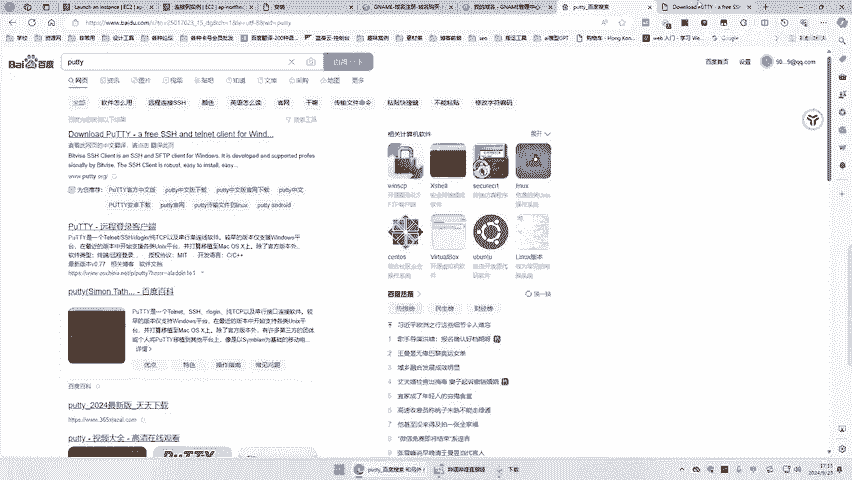

🎼在这里呢，我们直接download的。

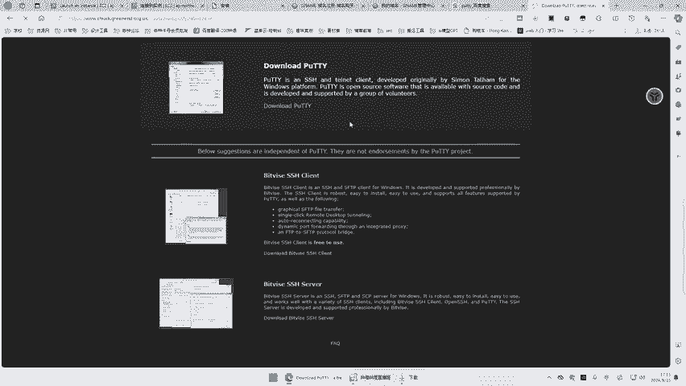

🎼然后呢，选择第一个啊叉86的这个位数的就可以。当然如果你电脑是32位的那你可以选择32位的这个呃叉86啊，好，我们这里保留好，这里put已经下载好了，我们双击安装下一步啊，下一步。

然后这里呢他说创造一个桌面的这个快捷方式啊。如果这里你不不创造的话啊，你这个最后安装完了之后，你就找不到从哪里启动了啊。这里我们去给它呃创造一个桌面的快捷方式，然后安装。🎼好，现在已经安装好了。

安装好之后呢，我们从桌面去给它启动这个p铁啊这里。🎼你下载这个嗯DH点PPK啊，就是这个密钥啊，它它安装好之后也会变成pututty的样子啊，戴这个帽子。那么接下来呢我们就来远程连接我们的服务器。嗯。

这里在putty界面，首先我们要给他1个IP地址啊，这个IP地址就是这个啊。🎼就是这个。🎼公有的IP地址，我们把它复制，然后在这里粘贴进去。🎼啊，接下来呢呃我们去。🎼呃。

这个data啊就是这个connect connection啊，这个连接里头data我们去给它嗯设置一个名字。那么它这里说了，一般这个用户名默认的是这个addmin啊。

所以这里我们就给它输入一个addmin。🎼好，接下来呢需要点击这个SSH前头的加号，加号前头有一个oss啊，我们去点击这个oss。然后接下来点第一个啊这个呃凭证。那么在这里呢我们去呃点击这个打开。

然后我们去桌面上找到你刚才这个DH点PPK啊，然后打开好，然后设置好这些之后呢，我们再回到第一个这个选项里，在这里给我们这个新的连接一个命名，我这里给它命名一个大海。然后呢，接下来保存。

然后这个保存这个东西呢，就是你下一次再连接的时候，直接去选击选择这个，然后去双击，然后去接受accept啊，然后它就会直接连接到你对应的这个呃服务器上。啊，当你看到这个页面的时候。

我们已经正常的连接到了我们的这个服务器。那么接下来呢，我们就安装我们的包ta面板。🎼啊，这亮度。🎼还个毛毯。🎼呃，然后呢我们进入这个免费安装。🎼然后呢，安装脚本。🎼呃。

注意这里我们用的是德邦的这个这个这个服务器。那我们就是第三个啊这个德邦的这个，然后我们去复制。🎼嗯，然后去我们对应的这个里面右键粘贴进去之后会车。🎼然后他说请使用呃root权限执行宝塔框的安装命令。

对吧？那么这里呢我们去呃输入。🎼話すよ。🎼ROOT。🎼然后他呃这个要求一个pasword啊，这里我们是没有这个password的。我们首先先回车，对吧？🎼那么我们需要输入一个。

因为咱们这个之前是通过这个密钥队去登录的啊，咱们并没有这个root的密码。那么这里呢我们需要去。🎼呃，用一个命令，然后去给它新建一个这个root的密码。我们速读。🎼然后呢呃pass word。

🎼PpaWD啊PASSWD，然后接下来是root。🎼然后回车，然后他会让我们去呃设置一个新的一个pass word的密码，这里你自己设置就好了。然后能只要你能记住啊，就没问题。🎼然后在这个linux下。

你输入密码，它是看不到的啊，你只要键盘上摁就可以，然后回车，他让你再次输入一下这个新的密码，然后继续回车。🎼好，他已经告诉你这个pass word这个已经成功的设置好了。

那我们再次来这个呃输 rootot。🎼好，这时候我们输入刚才咱们设置好的这个呃密码啊，然后我们回车啊，你会看到这时候我的这个用户呢由addmin这个用户呢呃变成了这个root用户。那么在root用户下。

我们再来执行这个呃。🎼宝塔的这个安装命令啊，依旧是这个第三个复制。🎼这里我们右键它就直接会粘贴进去，然后回撤。好，这里问你是不是要安装，输入一个Y，然后回撤。嗯，好，这里我们的这个宝塔账户已经安装好了。

然后它提示我们要去放行这个17892这个端口，不然咱们不能正常访问。咱们首先呢把这个宝塔面板账户的信息去给它复制出来。在这个pauty里头呢，如果你想复制选中的信息，直接点击鼠标的左键就可以啊。

那接下来我们自己去新建一个文本文档，然后把你的这个复制出来信息contrl v啊，粘贴进去就可以了。然后呢我们去放行这个17892这个端口啊，然后来到我们的这个呃对应的这个服务台。

然后我们去呃返回对应的实例。🎼啊，点击这个实例。🎼然后呢呃我们去看它的这个安全。🎼然后它这里有安全组，对吧？然后我们需要去给它添加一个安全组的规则啊。我们点击这个安全组。🎼然后呢。

这里我们去呃编辑入站规则。🎼然后这里我们去添加规则，然后自定义TCP这里我们刚才要的是。🎼呃。🎼啊，这个啊17892啊。🎼17892啊，然后这个自定义这里我们不用管，然后我们这里选择0。0。0。0。

然后呢，我们再添加一条规则，这个是我们数据库访问要用的。🎼3306。🎼然后接下来我们这里也是选择0。0。0。然后接下来我们保存规则。🎼检查一下好，这个对应的这个规则全部都好了。

然后接下来呢我们就能去访问访问地址啊，外网的访问地址是这个。🎼复制，然后我们直接在这里粘贴进入。🎼然后它这里提示我们不是专用链接，我们点击高级继续访问啊就可以了。

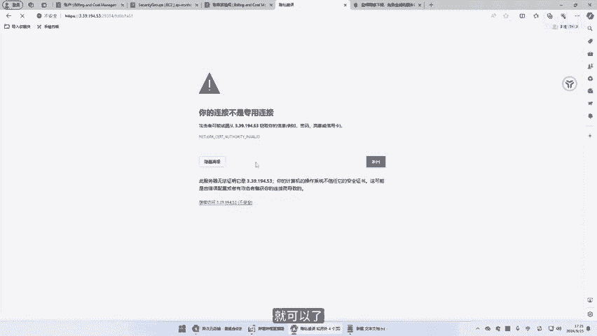

🎼好，这里我们成功的访问了对应的包塔面板啊，说明我们这个安装是没有问题的。然后用户名。

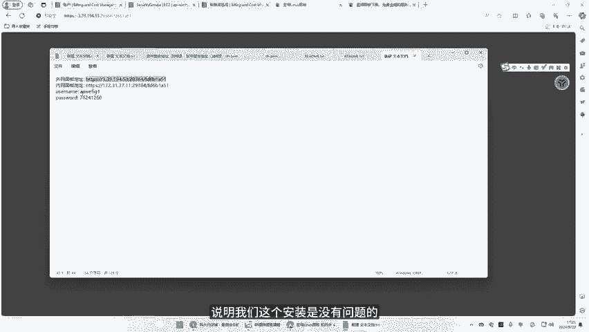

🎼密码。🎼安全登录模式登录。

🎼好，登录了我们的宝塔面板之后呢，我们第一次登录的时候，它是要同一用户协议，对吧？进入面板。然后呢，这个宝塔面板的这个账号呢，我们现在是不登录账号，它是没法使用的对吧？这个还是要登录一下的。

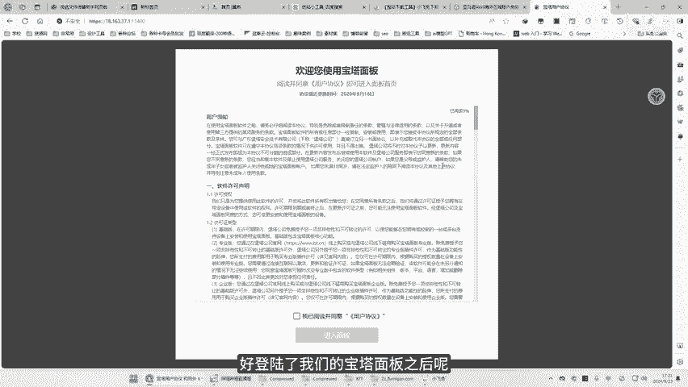

🎼如果说大家对这个登录宝塔面板的账号特别介意的话，大家也可以去使用这个宝塔面板的海外版啊，就是AA panel，对吧？这个呃宝塔面板有一个海外版纯净的，它是不需要登录的。

大家可以去用那个当然它对应的有一点不方便，是英文版的。但是大家现在用这种直接网页端的翻译啊，也是非常方便。好，这里我们登录了之后呢，呃它这里有推荐安装套件啊，我们不在这里啊。

我们先去这个软件商店里去找到我们想要呃去让我们的系统更优化一些的东西啊，我们去搜一个东西，lininux工具箱啊，就是这个东西，然后我们去把它装上。

🎼装好之后呢，我们点击设置。🎼这里呢我们主要是要设置这个东西啊，就是我们所谓的虚拟内存，可以看到总容量是1G，然后已经用了7兆，可用的是这个这么多。然后呢，我们一般就是。🎼有2048就可以啊。好。

现在这个虚拟内存swipe已经添加上了啊，然后接下来呢我们就去软件商店安装我们需要用的一些长途软件。首先我们是运行环境，肯定是要用NG啊。🎼然后这里呢我们直接急速安装就可以。🎼啊，这个地方让它安装。

默认安装就可以，我们把它关掉。然后呢，这时候我们还是需要一个my circlerl啊。🎼circleical这里呢我们只需要1个5。6啊，就够用啊。当然如果说你想安装更高的。

如果说你那个服务器的配置更高的话，可以安装更高的啊。我这里安装1个5。6就可以。🎼还是技术安装。🎼好，接下来呢我还需要1个PHP啊，PHP我们用这个7。4的版本就可以啊。

因为咱们这个引流宝这个应用里头它规定呢就是7。0到7。4。🎼好，这里呢我们用1个7。4啊就可以，同样是极速安装。🎼好，然后安装了这些东西之后呢，我们只需要慢慢的等待啊，等这几个环境全部安装成功之后。

我们来安装我们对应的这个呃程序。好，现在这个安装已经都完成了，我们来看一下消息列表啊，他说这个mycirl5。6安装失败了，对吧？文件不存在，那么这个地方呢我们可以再把这个mycirl重新安装一下啊。

这里我们可以选择一个5。6然后呢，我们选择一个编译安装。🎼我们看这个编译安装能不能顺利安装成功啊，它应该是依旧是没有安装成功，对吧？它依旧是没有安装成功。那这里呢我们可以换一个版本。

当然这个也可能是因为我安装这个系统的缘故啊。🎼呃，我们可以安装一个。🎼5。7啊，我们试一下这个5。7的极速安装。

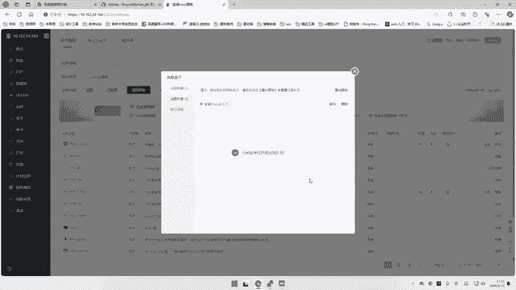

🎼好，这两装完成，我们看一下消息列表。🎼啊，这里显示mys circler安装成功，我们可以在已安装这里呢看到我们啊已经安装好的N My circleicalPHP啊都是没问题的。

那么接下来呢我们就可以来新建这个网站。当然一般这个建网站的话，我们最好是用一个域名来建啊，引流宝，它也可以用就是你的这个服务器的这个IP当做你的一个域名啊，因为本身它别人在访问的时候。

它可能访问的是你在里头设置那些域名，并不会访问你这个引流宝。但是将恩来如果说你有。🎼可能说把这个引流宝做成一个对外的网站，就是别人也能来用啊，然后呃有那个注册用户。因为它现在是有这个功能的。

就是让其他用户注册，然后也来用你这些功能可以收费，对吧？如果说你要做成这样一个功能型对外的网站，那么肯定还是有域名来访问，这样是更好的啊，那么我们这里呢就给大家就是用添加域名的方式来给大家做一下演示啊。

然后这个地方呢我们首先是需要域名，这里推荐大家使用的是这个Gname对吧？海外的这个域名商，因为这个G内这个海外的域名商呢，它是有这个中文版本啊，就是有中文的这个呃对应的这个网站的版本。

所以说它呃更对于我们来说可能更友好一些啊，再加上这个Gname，它其实是呃可以用支付宝啊，等咱们国内的这个支付体系来直接去付费去购买使用的。然后它是海外的这个高密的域名商，对吧？

它不需要你的手机号来实名认证，那么这个域名用起来呢，就是安全放心，对吧？那么我这里有很多的域名啊。

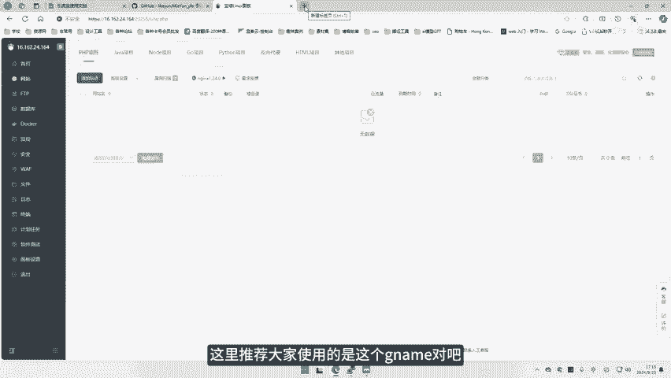

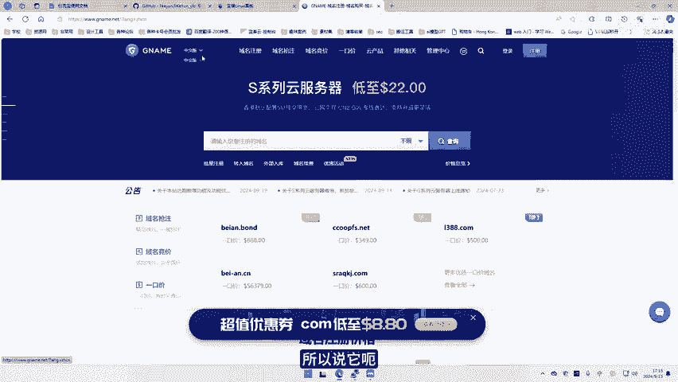

🎼拿其中的呃随便找两个域名来给大家做一个演示啊，我们可以用这个域名来，我们直接去对它进行解析啊，这个地方呢我们可以去添加解析。🎼然后呢，首先是A记录，对吧？一般这个呃A记录呢就是不带3W的这个啊。

那我们可以直接用我们的这个服务器的IP地址。🎼啊，也就是你宝塔的前面的这一段对吧？🎼然，我们就给它填入，然后去确认啊。好，然后这一个域名已经搞定了，对吧？然后接下来我们继续去添加啊。

那这个解析记录我们用3WIP地址依旧是咱们这个对应的服务器这个呃IP地址对外的IP地址，然后我们确认。🎼好，解析成功。解析成功之后呢，我们就可以把我们对应的这个域名，然后去给咱们添加成一个网站，对吧？

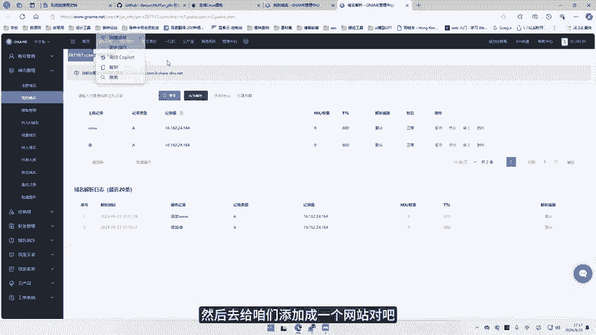

🎼这里呢我们去添加站点，这个里头我们直接去用这个域名。🎼当然这里3W也可以。那有些人是习惯3W的。好，那接下来我们数据库我们可以创建一个啊，然后对应的有这个数据库的账号和密码。这个数据库账号很长的话。

可能一会儿显示不出来，我们可以给它删删几段，对吧？好接下来呢创建好之后，我们直接去确定好，这就是我们新的这个网站已经创建好了。然后接下来我们进入这个根目录。

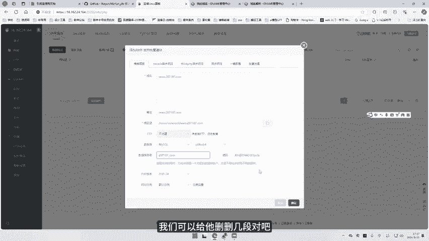

🎼然后在根目录里头呢，我们可以先把它预先生成这些文件给它删掉。🎼然，紧跟着呢我们去下载对应引流宝的这个源码给它传上去啊，这是我们引流宝的这个r up的这个地址。然后我们去进入它对应的最新的版本。

🎼好我们就把这个最新版本的这个呃压缩包啊给它下载下来。🎼好好下载好了，然后我们去把它打开，打开这个压缩包看一下啊。🎼啊，可以看到他。

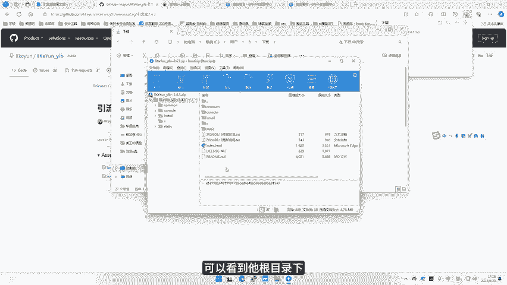

🎼目录像直接就是这些内容，那没问题啊。好，接下来呢我们直接把这个去。🎼到我们这里，我们去点击上传下载啊，我们去点击上传。

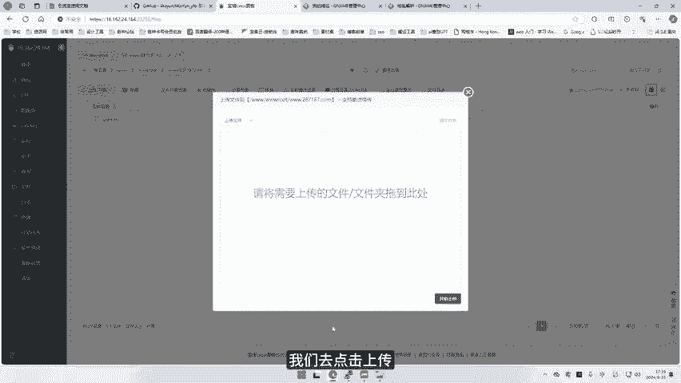

🎼然后把刚才下载好的这个压缩包，我们就给它拖进去。🎼好，然我们开始上传。好，传好了。传好之后呢，我们右键给它做一个解压缩啊，你就会看到它解出来了，对吧？但是我们要把它放到根目录，所以我们把它进去。

然后把这些文件全给它剪切出来，剪切。🎼然后呢，在这个地方我们去粘贴。🎼好，现在这已经完全搞定了。那接下来呢我们就直接去访问我们的网站就可以了。🎼好了，我们这里的这个网站。🎼去访问哎。

你会发现一点击它就是快进入这个页面了，对吧？快速上手安装登录，那我们这里肯定是安装，然后呢，全新的环境对吧？配以置7。0到7。4，现在我们7。4符合允上传文件符合。那么这个最低版本要求2。3。

升级版本2。4啊，然后我们全新安装。🎼选项安装这里要输入数据库的地址啊，我们这里去我们的数据库里头。🎼把这个数据库的名和密这个数据库名和密码啊给它复制上数据库名。🎼啊，数据库的账号。🎼然，数据库名啊。

这个服务器地址我们可以呃local host啊，然后呢，这个数据库的密码呢，我们。🎼啊，可以复制这里，对吧？直接复制在这里粘贴。🎼管理员邮箱啊，大家可以用自己的邮箱啊，我这里就用1个QQ邮箱。🎼好。

那管理员的账号啊，这里我们可以设置一个admin，当然你可以设置自己的对吧？比如说我这里也可以大海，对吧？🎼管联员的密码大可以随便设置一个自己的。🎼我这里就按密888，然后呢安装目录。

那这个地方呢我们选择跟目录，对吧？然后我们开始安装。好，这里呢我们已经安装完成了。我们可以啊看一下啊，我们可以进入这个前往这个管理后台，或者是直接去看这个使用文档啊，使用文档。其实这里我们已经打开了。

我们可以去前往管理后台啊，这里要输入我们刚才设置好的管理员密码。🎼啊，我这里是设置的大海。🎼密码是ad me。🎼阿巴巴，然后立即登录。那这样呢我们就正确的进入这个后台了，对吧？

🎼那么呃更多的这个功能以及配置啊，比如说像火马啊，这些如何的配置啊，短网址如何的配置。那么这个咱们嗯分多期视频来讲吧，呃，主要还是看大海的这期视频看的人多不多，对吧？

如果说有朋友他需要这些功能的这个配置，就是说自己不会弄啊，自己不会配置这个短网址和火马这些东西该该该怎么整上去，对吧？包括原理相关的这些内容。如果大家整不明白的话呢，那我可以去给大家录制。

继续录制这个相关的视频。然后如果大家看的话呢，可以在这个视频下方留言，然后让我看一下这个需要的同志到底多不多，对吧？如果说有非常多的同志去需要这个相关的这个视频教程，火马如何的去设置去使用。

然后这个短网址如何的去设置去使用，我就去给大家去把这个配置的方法去给大家再去讲讲解一下啊。然后呃如果说大家不需要这个东西，那那那咱们就不多说了。那么今天的这个视频教程。🎼咱们就到这个安装完成就结束。

好吧。如果说大家喜欢今天视频，请给我点赞留言分享，对吧？那么也希望今天视频呢可以帮助到很多想要做网赚，然后或者做新媒体啊，做这个自己私域流量的朋友啊，能够帮到你们一点点。然后如果说大家有更多的需求呢。

可以去找这个引流宝作者，因为他这个相关的文档里面呀，还有包括对应的这个内容里面啊都有很多的这个他自己的群呀，这些呃联系方式，然后大家就可以去加。啊，当然人家也有很多这种付费的内容，更强大的功能。

大家也可以去了解一下。那么咱本期视频就到这里啊，有任何问题，咱们就这个评论区交流。好吧，那么呃谢谢大家，咱们下期再见，拜拜拜拜。

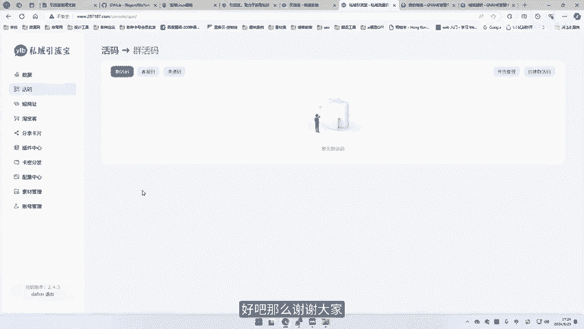

