# 第277期【如何利用竞品寻找最佳市场切入点】——卖家精灵【大咖课堂】 - P1 - 卖家精灵 - BV16xyAYZEw8

这节课的话大概一个半一半钟左右。一个半钟。OK今天的话我们要讲的一个内容就是利用我们竞品的一些数据去寻找说我们最适合最佳的一个切入点。这个最佳切入点其实我们可以理解为一个要么就时间点。

要么就是你产品上的一个差异化。然后我们怎么去合适的去切入。就是在卖产品的时候，很多时候我们想的就是说哎我们这个产品比别人更有优势啊。比如说别人卖一个价一个套件，然后我们卖两个套件。

然后是一样的价格做这些差异化，或者说对别人功能一个迭代，对吧？那这些其实也是说我们在开发产品的时候可能会去想的一个点，当然就是我们要去考虑一套我们运营端的一些数据。比如说产品开发出来了。

它确实比竞品有优势了。那么我们运营端该怎么去切入？对吧那比如说什么时间点巧切入，然后这个时间点面我们到底说这个评论我们到底怎么去做，到底说是要10个评论，然后我们算是一个稳定的切入，还是说20个评论。

还是说我们要很高很高的评论。对吧那这些就是竞品都会告诉我们的。因为竞品身上有我们想要的一个答案。然后首先我简单的自我介绍一下，就是我叫东黎。然后我是卷程跨境的创始人。

之前的话我是蓝河的一个亚马逊广告的一个负责人。我之前是敲代码的，然后做这一行业做了6年。然后因为是代码出身的，然后我们其实我们做亚马逊，其实我们更偏向于说用数据去决定我们的一个决策。

就数据去引导我们做决策。这样的话我们的一个失误率会低很多啊，至少站在我的角度看来，就是数据这几年帮了我真的很多很多。然后现在亚马逊市场的话，其实很多时候都是一个存量市场。就是数据让我们看见。

然后比我们所谓的信念啊，就所谓的相信啊更重要。就不要说我今年想要做10个业，我从0到1去做10个业，你相信自己能做到。但是你从数据层面去看，你算一下自己现金流，算一下整个类目的一个市场。

然后内目的容忍度，最会有些东西告诉你，你这一个想法，你这个所谓的相信所谓的信念其实就是一个不可能的事情。然后就是今天直播间的话也会说进行一个抽奖的一个活动啊，然后的话会送那一个呃卖精灵的马用公仔。

还有会送15天的一个麦精灵的会员，就是大家。可以到抽奖的时候，就是那个屏幕的左上角有个小红包，那个小红包到数技术结束之后，我们就可以说去点击这个东西，然后抽奖。然后看哪个幸运观众能抽到。

OK我们先讲一下这一个大的一个框架，就是我们讲东西呢，我们可从大的带到小的。因为我们先确定我们基础的框架之后，那么我们的一个数据就有了方向，有了方向之后，我们再去往下去拆解，去定这一个东西。

就会更加清晰，就不要去从中间拆，或者说从后面去倒推这个轨这个东西我们最好是先确定好我们大框架。首先第一步我们先找到我们的精准精品。但是我们的精准精品呢不是说是我们小类的一个top10或者top10。

我举一个例子啊，比如说我卖一个手机壳。top10里面包含了透明的手机壳，有一些磁吸的手机壳，也有一些支架的手机壳。但实际上我卖的一个手机壳，它是一个透明手机壳。top10里面只有3个。

那么我自己的一个市场，就是我们的细分市场，其实在top10里面就只有3个。也就是说，在top1小类top1里边，我们的精准竞品，我们的市场头部只有3家，而不是我们理解的top10这一个数据。

所以我们一定要去确认好我们自己的精准精品。因为精准精品会告诉我们这一个细分市场的垄断度，以及这个市场整体的一个容量如何。因为你的一个头部的产品啊，比如说top100里边有50个你自己的精准精品。

把这top10里面的精准精品的一些动作进行拆解，或者这一个top50的一个产品的一个整合。那么它就是你的一个细分时场。而不是说整个特币百是你的信用市场。因为这一点很重要啊。

因为我遇到有一些绿宁或者一些老板，他们觉得说哎我这个市场很大。然后他发现其实我就发现一个点，就是他自己的细分市场其实在后面就是90多名，后面，其实他市场偏小，没有很大。他理解的一个市场很大。

其实是把整个top币0的所有产品全部算起来，里面夹杂着很多细分类目。那再往下去拆的时候，那就需要我们自己重新进行整理。那第二个其实就是我们常规理解的，就是我们经常会讨论到的说哎我做这一个产品。

我比精品哪个地方有优势，到底说我功能比它更强悍，还是我用的材料比它更棒，还是说同样的价格之下，我卖的套件比他多，我卖的它是10块钱他卖一个，那我10块钱卖两个，或者说10块钱去配一件其他的配件。

那我们造成这一种产品的一个属性，对吧？那就是我们做这一些差异化，当然就除了产品本身的一个属性的话，我们还要去确认一些广义的产品，就是我们图片。也是我们的产品。所以需要我们在做这一个市场调研的时候。

我们要把产品也的一个图片我看一下。因为我最近在调研一些类目的时候，我就发现一个点有一些类目，他们整体的图片啊质量。偏差，他就像国内的某。某688啊某688的一那种图片的质量很差。

然后如果说你自己长期的去做这个类目，或者说你自手头有好的设计资源，那你进入这个类目卖同样的产品，那其实你对他们就是一个降维打击嘛，对吧？所以这一个点的话也是要我们要去看的那如大然如果说有一些类目的话。

我们带概的同样的一个图图片质量都差不多，那这个就不是我们的一个优势了。那第三个点就是BSR数据和ABI数据去确认我们的一个市场切入点。当然这里才有重要很重要的一个指标，就是把时间纬度给拉进去。

就是你不能看当天的，或者说你不能看过去一周的对吧？如果说我们的个BSR它是有周期性的一个变化的话，OK那它就是一个周期性变化的市场，对吧？那BSR数据对应的其实就是一个销量数据嘛。

那我们确定就是说这个类目它的一个销量是不是相对的一个稳定，然后我们再去看这个ABA数据。ABA数据面的话可能涉及到很多的一个点就是说呃我核心关键词的一个浮动，对吧？

然后另外一个点就是有时候ABA的数据会进行关键词替换。你比如说我22年的可能是单数的某一个大词，这个这个大词是个单数，然后它是今年的核心关键词，可能到23年之后，它就变成另外一个词。

那所以在做这1个ABA数据的时候，我们要观察一下，哎，我们的BSR的数据，它不改变。但是我们发现我们22年的那个大词的ABA调的很惨。那这个时候是不是有另外一个大词来进行了补充。所以我们在做数据的时候。

我们看到它下滑。但是BSR浮动不大的时候，一定是有ABA有新的关键词在一年进行了替换。那么在做这个类目的时候，我们可能就需要积极的去观察一下大词之间的。一个复数单数和负数之间是否进行了一个交换。

ABI数据是否进行一个交换啊？然后剩下来的话就是确定好这几个点之后，我们就可以说哎我们去切入，就千万不要做一个点了，就是。这个产品在7月份才是他的旺季，结果你4月份就开始猛推猛推。

然后4月5月其实就是你整个市场的一个呃低谷期，销量很不好，转化率都很不好。然后你觉得说哎45月这个数据45月我到了我就要使劲去推，推了之后发现我投产比很差。就是你头场很差。

然后就怀疑说哎是不是说我手法有问题，是不是产品有问题。那你应该想一下，如果说你有BSR的一个数据时后，你就会知道说哎，这个时候不是我产品有问题，也不是说是我自己的一个手法有问题。

是因为整个市场当时就很低迷。这样的话，你乱推乱切入的话，你可能会让你整个人自己的一个自信心受到打击，怀疑人生，有时候就很打击这种事情。等旺季真的来临的时候，你可能就承接不上了。

所以话这些数据会告诉我们哪一些时间点该去切入。但然根据这一块的话，其实我今天要讲的主要是三个大的一个市场模型啊。第一个就是我们四季类的一个产品，就实际上它的一个数据啊，BR浮动并不算太大。

第二个就是我们的季节性产品。你比如说一些呃冬季类的产品，呃，圣诞节类的产品，这种就很明显很明显的一个季节性产品，那剩下的就是一些爆爆发性的一些产品，你比如说我们往年比较明显的黑天鹅市场，就是那一个口罩。

就每一年其实都有一些细分的类目细分的市场里面有这种爆发型的一个市场。那我们去找到这件市场的时候，我们该怎么样去评估？这个就是很重要的一个点。这个导图会分享吗？导图会进行分享的。

就是你看到的所有东西都会给分享给大家。然后剩下就是我们要用数据去说话嘛，对吧？那首先我们今天先来看一下这个流程。O大家记住这个流程啊，我的表也会按照这一个框架来进行数据整合。

首先我们来看一下这一个数四纪类的一个产品。首先我在。找了这个类目。这个类目是什么类目呢？这是一个type C数据线的一个类目。然后我拉了我们细分市场里面的一个精品，然后发现其实安克确实很强啊。

就是YYDS啊，确实是很是我们跨境的老大哥。然后在这里的话，我们看到就是内安克，他其实在tops里面，它占据的份额特别高。那么这种情况之下，我们先把它的一个。ABA的数据啊，我举这个数据怎么来呢？

我先给大家去讲一下啊，就比如说我把这个a我已经拿下来了，然后。我跳转到这个界面。然后我们去看这个kea。这个ke的一个数据。这个ke的数据我们直接把它下下来就好了。那下下来之后就变成了我这一块的数据。

就是把这些a说a的一个keyep的数据插件的这里全部下下来，然后整合到一个表里面。然后这个表里面刚好有时间维度一个变化嘛。那这里的数据其实我们整合起来的话，就会有很大的一个价值。

首先我们先看这一个BSR的一个数据变化。

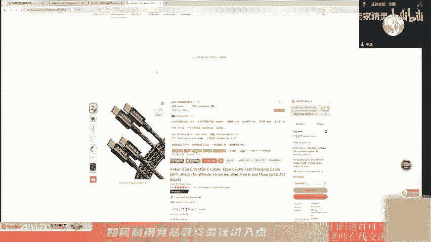

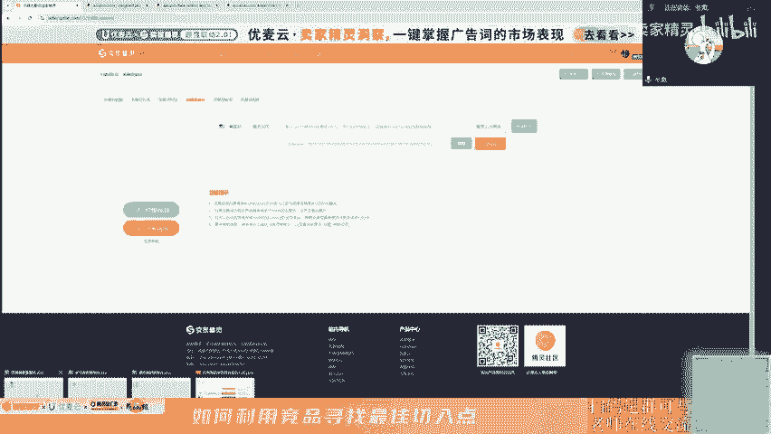

然后这个数据其实很早特别早。我们从这个数据上来看啊。最早的时候是从20年的时候就开始去有这一个产品了。这个数据呢，这个边杀数据是大类的别杀，是大类的别杀。然后这一个是拉的最早的一个数据了。

我们先来解读一下这个为什么要去设置一个平均值，一个最大值，还有一个最小值。就我们不能单纯去看这一个别萨的平均值。因为如果说有一个新的精品，新的产品，新品它切入进来的时候。它是一个新品，对吧？

那你一万多几万的一个数据，它就很影响整个数据样本，就会让你觉得说哎在这个市场它好像是下滑的。但实际上他并没有上滑。它这一个最小值就是我们的一个头部产品，它其实还是相对稳定的情况之下。

那这一个数据如果说突然变大了，就并不能说明说这一段时间我们找这个数据差异化的一个点了。你比如说到了这一个这个时间段啊，假设这里是一个50，这已经是50多了，100多这一段时间可能有精品，它冲上来了。

对吧。所以的话这个时间的话，我们不能说哎看到这个数据变大了，然后我们觉得整个市场都在下滑，我们不能这么理解，我们还要观察，所以的话我们就要加入这一个最大值和最小值，观察到有没有一些比较低端的一个排名。

就是排名比较低的一些产品，它到底是不是有冲上来。然后再观察一下这一个。头部的这个产品，它的一个排名是否有变化？它这一个产品我们就发现了，在这个5月15号的时候，就5月份中旬的时候，整个市场其实是增量的。

因为我们看到最小值啊。他从这个1月1号到这个14号，其实整体都比较。一对吧？就相对于一来说，它其实是比较低的。但到了这个5月中旬开始，我们发现哎呀发力特别特别猛，一和2一和2一和2。

那么如果说这个5月它持续持续性的存在这一个周期变周期性的一个增长的话，那么我们做这个手做这个手机的数据线，就是type C这种线的话。那5月。是不是我们的一个市场的增量期？在市场的一个增量期。

我们去切入的时候会很舒服。千万不要去做那一些市场，它下滑的一个类目，你会大家都会很难受，或者说在市场下滑的时候，你开始推。都会很难受的啊，你不要太前，但也不要太厚。

你最舒服的时间点就是在这一个市场爬坡的时候，你进行推广。你会会把你一些有有优势，它会无限无限的放大。把你做的对的一些点，他会放大很多很多倍。所以那么我们做这个BSR数据，其实就是为了找到我说的这一个点。

那么我们去找这一个数据啊，就这个数据有点多，所以话我们不可能一个一个去翻。我们先去看一下这一个图。看一下图里边的这个时间点，我们看到6月。6月22号开始，整个市场这个BSR对吧？

我们看到这一个黄色的这条橙色的线，橙色的电它是一个最大值，也就是这个时候有新品上来。那么我们就观察一下这个最大值，它去推这个产品的时候。大家看到这条线啊，最大值慢慢慢慢慢慢慢慢的变小了。

那他到了这个6月到9月，他就能推到趋近于这一个平均值。那说明什么？说明这个市场其实还是比较好切入的啊，相对于说6月和9月。那么在未在未来是否还存在这种时间点呢？那我们再去找一下21年的。因为这个。图啊。

其实它有个它有点大就是原数据，就像这种就他边下从后面切入的，所以导致我们有些非常细的点是看不到的。所以我需要把这个表再拉的大一点。OK我们再去看一下。21年的6月份是否还存在这种数据，我们再去看一下。

爱年时并不存在。并没有很明显的这一个数据像这个数据直接复刻过来，对吧？那么22年的6月有没有呢？哦，也没有。那也那我们是不是可以得出一个大致的结论？就是再看一下。

后面其实发现都没有说像这种6月就是这个时间点的一个复课。那也就是说6月份其实并不算是一个很舒服的一个切入点。你们看不到吗？

表格在哪里下载的？我这个表格的话是在。

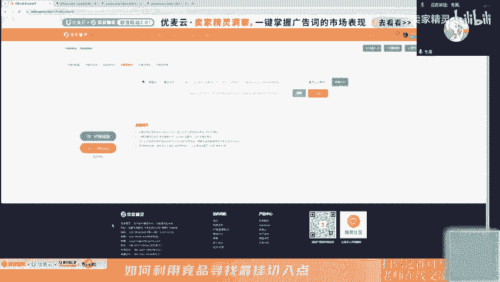

这个。keepa的这个这个插件就是我们点击卖，就是我们安装了麦精灵之后，装了麦精灵的插件之后，我们点击这个kia。插件代替，然后点击这一个导出，我们不要去筛选时间，我们就直接把这个数据全部导出来。

导出来之后，我们就可以把它整合到一个表里边。做那个表里边的话，我们就把这个B上海的数据抽出来，抽离出来进行整合。然后就呈现到我们现在的这一个数据。其实整体看上来的话就是。这个typepe C的产品呢。

但我要发现一个点，就是它整体的线就是排除了它没有很明显的周期，这些都是一些新品，他尝试去接切入这个市场一个新品可能是一个新品。这里可能有一堆两三个，但是只有一个产品的切一个切入点，两个切入点，3个4个。

他们切入的时候，其实整体上好像感觉都都比较好，都比较舒服啊。呃，是的，在爬坡的一个时间段最好推，就是我拉的这个数据是说我们头部的一个be萨的数据。如果这个B上比较。低的话。

那是不是说整个市场如果说组成的这个平均值啊，包括你最大值最小值，其实跟这个平值特别接近的时候，那这个市场其实是一个相对稳定的一个市场。相对稳定的一个市场。对，就是那1个A006方说的那个对的，就是这里。

因为这个产品其实是4G类的产品。因为我们在找这个东西的时候，我们发现没有很明显的一个周期性也没有什么规律。真的就是看的这些产品就是硬切切切进来。你没有发现说哎我们看到6月感觉说能找到，哎，没找到。

然后找期找这个9月份也没找到。9月份的话刚好是苹果的发布会嘛，有人切了，哎，发现好像还OK。但是其实你往后去看了这一个11月往后这个数据，整体的平均值这个蓝色这这一个数值。他就是个平均值。

其实并不是很乐观。他甚至都没有这个3月到6月的这个蓝色的线要平均。所以就说我们整体看下来。数据线它没有什么明显的这一种。周期性的变化。最后我们就发现它其实就是一个四纪类的产品。

四纪类的产品你说有好也有坏呀。因为四纪类的产品的话，它有个点就是没有什么好的一个切入点。因为它浮动不明显，我们就是最舒服的一点就是在市场增量的时候，我们去切入。那我们做的对的的动作，它就会放大，对吧？

那么这种情况之下发现整个BSR都很稳定，非常非常稳定。这条从这个曲线上来看，确实很稳定。对吧。非常非常的稳定。所以我们来看的话，你要找这一个数据线，其实你要找不到的，没有找到一个合适的切入点。所以。

先抛弃一个点，就是你要推这这个时候我们运营的一个节奏，我们运营方向大概就能定下来。就是说你想推数据线，每一个时间段其实都是一个输都是一个合适的时间。但是每一个合适的时间就是你普适性越高的时候。

你发现它越难推。越南推呀。就是会就是这么一种情况。你可能真的就是要进去的时候，你先把前面的一个老的产品，老的竞品一个给打下来。然后一个一个的老产品，他们的评分可能评论数都很高。

所以就需要我们去拿拿后面的这一个数据再看一下。OK我们再去看一下，就是我们发现了这个产品这个市场这个type C的数据线没有好的切入时间点。也可以说，每时每刻它都是一个好的时间点。

我们再看一下整个价格的变化，因为你自己不可能把这一个价格拉的很高的。你不可能把这个价格自己个能把整个市场的价格拉的很高。我们来看一下这个数据变化，我采用的是一个降雪，就是我从最新的时间我排到往后。

因为这样会比较明显的一个点就是。蓝色这条线呢是我们价格的平均值，对吧？我们的这个价格平均值的话是10块钱左右。曾经高的一个点是在这一个。23年的10月份左右。其实他整个。整个市场来看啊。

我们从头从22年20年时候开始看过来。type C的这一个数据线。按最头和最尾来看的话，其实整个价格它其实是上升的。他没有说很卷的一个市场。

因为最开始我们发现整个平值基本上都是8块钱、9块钱、10块钱左右，基本上分布在这个区间。然后我们看到有个最大值，就是也有一些产品，他们尝试说去把这个价格。拉起来想卖的更贵。

但最后我们就发现就是他们想尝试着去突破这一个市场的均价，没有没有突破成功。没有突破成功啊，你看这个25。991个数据线卖25。99，很贵的。但最后他慢慢的整个市场。就下来了呀。

但是这个时间6有人不断去尝试这一个价格，哎，还是下来了。所以会有一部分的卖家他会尝试说我以高价去卖，但最后。还是认输了，还是向市场低头了。那我们的一个定价。区间是不是就出来了？你看一下这条线。

就是我们定价区间怎么去定呢？比如说我卖的产品跟他们是一致的，或者说说没什么太大的一个差别的时候，那么我们的一个最大值。就是按照这条平线，这这个点存在最多的时候，是不是横线这些点存在是最多的。对吧。

存在时间最长的其实就是这1个17块钱。也是存在最长的时间时间节点存在最长的。然后最低价的产品，它一直卖的都是6。996。99。然后己尝试去卖更便宜的，但是6。99是整个市场最低的一个价格。但6。

99这个价格是谁在卖呢？是安克在卖，是ancle。所以。他也其实卖那个产品，其实也也挺觉得他有可能在他能做这个价格，可能他对这个供应链他有一定的去压缩他的一个成本。有压缩成本的。

他可能会去跟工厂去谈账期啊，或者去进行一些大批量采购的时候，就是在工业化进行的时候，你只要亮起来了，你成本就降了。那成本降了时候，你就可以去跟工厂说，你便宜个一毛钱两毛钱。

那如果说你出货量特特别大的时候，你便宜一两毛钱，他能省他能便宜就很多很多了。那么我最后我们定下来定下来，从这个数据上来看，我们的一个定价区间就是6。99到17。那么这个时候我们要去分析一下。

就是这是大的数据啊，里边我们还是要细的去猜的。就是这个17块钱的产品，它到底是什么产品？长期在卖。但如果按照我自己的一个常规定价逻辑，我会定在平均值这一条线。那平均值这条线的话，我会去看。

这个里面存在频率最高的价格。比例最高的价格是不是就是10块钱左右？对吧。因是我们不可能脱离整个市场搞太多。但我们我们也不可能去无限的去抄抄抄抄的很低，就是不然的话大家就造成一个恶性的一个循环。就是。

螺旋低价，大家互相卷卷到最后大家都没钱赚。所以的话我建议大家就是不要去跟大家去拼这种所谓的低价，不要拼太多的低价。我们争取做平均，就是我们争取高价。但是实际上我们先把我们自己的平均值给保住。呃，可以看。

就是这个那个star问到就是可以看看女士服装类目吗？这个暂时就看不了啊，因为我做这个做这个数据，我其实我们就花了很多时间去做整理了。所以的话你要一下子帮你去看，就重新整理，可能就会占用别人的时间。

就是占用大家去学习这个的时间。但就是你可以按照我这个模板自己去做，然后按照我思路进行分析啊，那个叫star的一个呃网友。单个A省的话具有代表性吗？呃，没有太大的代表性。

所以的话我就是拉了我细分市场的一个A省的一个合集。这样的话它说服性就很高。因为它不是说一个特异性的一个产品。他不是说是一个特殊类的，比比某比如说某些人搞特殊嘛，我低价，那你也去低价吗？不是的。

他低价有低他低价的逻辑，那它低价可能是低价引流进他的一个变体里面，它变体里面可能有别的一些高价产品。因为type C的这种产品，它的一个变体还是相对比较多。它的一个变体变化可能其实更多的就是那个数量。

还有是不是它的一个呃长度的。数据。那么我们大概这些年就看完这个数据之后，我们大概知道说我们的一个定价。这个是我们实际要定的，但是我们要争取做这帮人。然后定单这个价之后，我们大概去算一下我们利润。

那我们就可以说哎这个。怎么去做？那怎么去样力，到底说是要猛红广告，还是说要靠别的手段去推动我们的一个自然位的一个上升。我们的流量到底要怎么安排？那剩下的就是去拆解这一个事情。

因为你的一个价格决定了你后面的一个广告的空间。PPT能分享吗？呃，能分享的。好像不适合非标，就是后面会有啊，就是后面会有别的一些产品的，这个没有涉及到流量端的数据啊，流量端的后的数据在这里。

流量端的数据在这里。嗯嗯。那是不是要每个都要分析。呃，你分析头部的就好了，你分析头部的就好了，你不要去分析那些top100往后的一些产品。因为那他们的量并不大。

他们对这个市场就是代表这代表不了这个市场的一个头部水平，代表不了这个市场的整体水平。因为你头部可能已经垄断掉整个市场60%到70%的一个市场。那么他们组成的这个数据是很有说服力的。同样的啊。

我们去看一下这个评分。那么我们看这个评分的作用是什么？就是。我们得知道一个点，如果说整个类目的评分很高的时候。那么你在初期的一个评论规划的时候啊，你就要需要提前准备很多评论。就是你自己去卖。

真正卖货之前，你可能要送很多个外就常规的一些玩法。就是你要去说呃送很多的外常规的玩法，我们不谈别的内容的时候，我们就讲纯白的这种思路啊，那我们就去送外要去送30个，等他回平之后，那我们再去推。

因为你保不准的。因为有些卖家有些买家。他是你也不好说他，你看好你买你卖给他那个产品，他就觉得很不舒服，他就不喜欢，然后他就给你一个一。一星或者二星。那你就很难受了呀，那一心二心，你要去消除他。

你是不是要等很多评论回来？那这段时间的话，你就整个销量，整个转化率就很受伤。那么我们是不是可以提前的先把这个呃YM先送出去看一下整个产品。因为YM里变成平均就是亚马逊那边给的数据是送出去的。

回来的评分平均值是4。5。只要你产品不是有很大问题，基本上都会给你五星。基本上都是会给你五星的。所以我们看这个数据，这个类目其实对评评论的一个要求，评分的要求特别特别的高。

我们看24年就是我们从这个先看平均值啊。平均值下来就是蓝色这条线。一直下来从24年我往后去看的时候，整个类目4。4。64。64。6。基本上都是4。6，对吧？

因为刚好那里那个那个图那里挡住了我们的一个数据。你会发现这个对评论的要求，评分的要求还是很高的。别人都是4。64。7，而你一个差评就给你搞了1。0，很难受。所以这个时候你看到这个数据。

你该做什么样的调整，你该做怎么样的一个评论计划，那就是一定要存囤很多的一个评论，囤更多的一个种子链接进去。那这样时的话，你才能保证突然来差评的时候，你是能扛得住的。这个要求真的很高。

我说实话就是这一个数据，我看下来它平均值是4。6。然后做的最最好的那个产品，它基本上是4。74。8。很高。然后做的最差的那一个。做的最差的那一个就是这个数据，人家也有4。6。

就说我们翻完24年整体看下来其实还是这一个数据。那。你真的就不能低于这个值，这个是你的底线。4。6是米的底线。这个是你第二底线。你目标就是要比最大值还要高。所以的话这个时候评论计划是不是出来了？

那我们对于这一些产品的话，我们就要先囤一部分的链接，先囤一部分的种子链接。到时的话我们再去说呃。常规的合并进去。当然这一个总的链接值也是正常卖的，只不果这票货先提前发过去。你比如说卖这个数据线。

那我要去做评论，先先做30个，先找工厂要30个产品。因为产品都是一样的产品嘛，你发大货的时候周期可能会长嘛。但是你去一下子问工厂要一两百个，直接发过去，先做评论。那大货生产完再发过去，那刚好就承接上嘛。

那你的一个发货的一个计划，那是不是也有出模型也出来了，对不对？那同时这个评分。我们看到了要求很高。那这个评论数呢？就是看完这个评论书确实是有点难的啊，就是你要切入这一个市场。我们看一下这个数据。

它是从这1个20年开始慢慢的积累过来。期间的话也看到一些产品，它就是应该是有进行一个合并的动作，大概率是有合并的啊。再看一下这个数据，就是也有被拆掉的，上去被拆了下来整个平均值啊。对吧然后有钱再合进去。

然后又被拆又合又拆，然后又拆。这一部分的数据这一部分。这种幅度比较大的啊，可大概率不是亚马逊三评。亚马逊三屏可能是这一些点的数据，就是你浮动不大的这种。因为亚马逊它会每年都会有一小段时间。

它会进行三评论。他会有一段时间进行三评论，像这种大起大落的大概率是被拆变体，或者他自己因为某些问题把这个病题拆出去。或者说是被竞品投诉，然后被拆除了的。都有可能啊。所以我们看一下。

就是他们的一个评论变化，其实相对还是比较浮动的。在这1个22年的时候。到了24年的时候，数据还好，相对比较平稳。这个数据能从外卖家心灵下载吗？是的，这个。这这一个是单个产品的评分，还是多个产品的评分？

就是你看到的所有数据都是这这些ason的一个数据的合集。然后这个平均值的话就是这一一堆产品，它的一个平均值同样同理啊同理所得是这一部分的。那么看到那么多的一个评论。有没有可能说去找一些突破点的？

在这里重看头部的产品的话，我们可能会觉得很难很难的切入，对吧？那这个时候我们还需要去找一个去一个地方去找。去new release里面去找有没有一些产品，就是他自己手头就有十几二十几个评论。

但是他干到new release的第一个，然后并且重进了top币版。那么这类型也告诉这类型产品的出现告诉我们。你的一个平论数，如果有十几二十几个，你也是有机会切入这个市场。但是有没有可能成为头部呢？

这没有这个数据，我们不好说，但至少你能重进透一0。也就是说你要去做这个产品，要有量，要有进透一板的量呢，还是有的。然后到了这一些数据之后，我们是不是要进行一个关键词反查？

因为这一些的话是我们运营节奏的一个定制嘛，对吧？那后面的这个时候关键词反查要确定的就是我们这一个细分的类目，它的一个流量的集中度。然后这个流量集中都会决定了我们后面一个广告到底怎么打。

要开多少个广告活动，要要怎么去开开精准为主呢？还是开词组为主呢，还是说开这一个广泛为主，是由这一个数据来定的。那么这个数据是从哪下载的呢？就是我们把这个aen这一个栏这这一个表里面的说aen就复制。

然后到麦精灵的这一个。

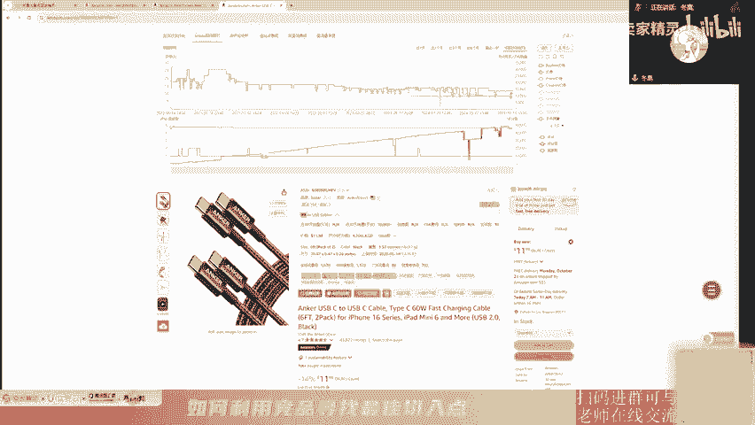

它是在拓拓展流量池的这个地方，然后你把它输入，然后。

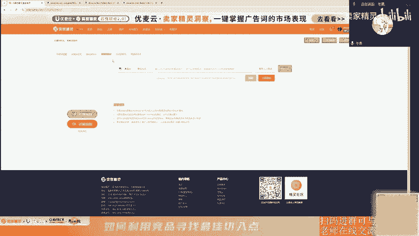

然后你就立即查询。然后你用的是全部变体全部变体。那个时候我们就把数据导出来了，导完之后我们就能得到这一个细分的类目，细分的一个赛道，它的流量特点。那么这一个留论它的也就是我们看到的这里。

我把这个数据稍微放大一点。那么我们要看哪里呢？就是我们看这个流量的一个流量占比，USBC的这一个电线，它流量占比这个关键词给他们提供了多少，仅仅提供了20%的流量。

那剩下这个USB to USBC的一个caple，这个提供了8%的流量。那这里加起来也就是站在关键词端的话，它只是提供了30%左右的一个流量。其实并不算太多啊并不是很多啊。既然30%流量。

那我们还有70%的流量去哪里查找？那剩下的就是有下面这一堆的产品。他一堆的一个关键词。然后呢组成我们的一个关联科技。那我们打广告的时候做这些类目，做这一个4G类的产品，就是说数据线的这一种。

那你开的广告可能要确实会比较多。那这一部分的大池的流量，但是你中后期你需要解决的流量，对不对？那剩下的这一个更多的这一个的数据，我们去找他的一个。词根，然后进行词组投放。如果你找到一个合适的词组。

比如说这里都是USBC你投了USBC的词组，相当于说你广告投了这么多的一个。关键词对不对？这样的话你就不用说我一个个去查找找到我的精准关键词，然后你可以提前进行否持嘛，对吧？

那你就可以把一些不相干的流量先干掉。所以这个时候看完这个流量的特点。你的词组一定是词组广泛，这些一定是你的预算的大头。那么这个时候我们还要去看一个点，就是我们流量的一个浮动变化。当然就是我也说了。

前面我们也看到了整个BSR其实没有什么明显的一个呃数据浮动。那4G类的产品，它BSR整体还是比较稳定的啊。那剩下其实就是我们去看我们的ABA的数据，因为你是4G类的，你就做到一个月纬度的。数据就好了。

月纬度的一个数据就好了。那我们去看这里，我们就要筛选A。等一下，我们只需要去把这一个。勾选一下，然后从这个17年开始看，我们发现17年说整个USBC cap这个。ABA排名其实不是很高2000多啊。

然后就往下看的时候，越往下看就往下看就往下看，其实它浮动最大的时候也只不过到了这个3000的ABA那3000ABA的时候有没有说别的一个关词来代替它呢？那这个时候我们先标记一个颜色去看一下。

有没有可能是。这个关键词。去进行了一个流量的补充。我们就发现这个5月份这两个。数据啊。就是你5万5万多的AA跟4万多没有太大差距。那这种情况之下。我们看到21年的5月份，但这说我们还要回头。

21年5月份，因为这是你流量的一个变化嘛，你大致的一个流量的一个下跌。那有没有可能你的销量也会跟着下跌。那这时候我们要再回头再看。就是数据不是说过完这一个部分的话，我们就不过了的啊。

就是我们会在后面看到有些数据它异常了。前面这些数据需要是拿来做我们验证的，是拿来做我们想法验证的。你看这一个数据快跌到了3000多。5月份的我们就看整个类目的，5月份是21年的5月份的。21年5月份。

蓝线这里。确实是。变得比较粗一点，比较高一点。那整个市场确实有一丢丢的消化，但影响不大。那这个世纪内其实整体看下来，浮动真的没什么好说的。没有太大的一个规律，一样的司鸡类你就是只能走一步看一步。

走一步看一步。走一步看一步，就是你看不到下一步到底是怎么去变化，你也不好预估下一周期。但是它整个市场相对稳定，不会让你涨太多，也不会让你跌的很惨。只要你的一个排名相对的排名比较O的话。

量不会有太大的变化。所以做这一个产品的话，做了做这数据线的产品。如果说你能。我一次在tops，那你每天的量。基本上不会他的浮动。不然的话，为什么要先拿这个数据呢？因为有时候我们会在运营中发现一个问题。

就是我们发现一个点，就是说我这个月销量特别高，我下个月的销量特别低。但整个市场也告诉我们，如果你下滑了，你是不正常的。因为整个市场它其实波动并不是很大。你比如上个月你是做了3000单。

到这个月你做了1500单，那你这个数据肯定有异常。那你自己应该反思一下，你哪个地方出了问题，是不是市场被竞品抢了。因为这个大盘的数据看完之后，我们在应用到我们实际的运营过程中的时候，我们就知道。

如果说我们是3000跌到了1500或者1000这种状态之下，大概率是有竞品去抢我们的市场了。而不是说哎我这是一个正常的一个浮动变化。如果说你是3000到4000或者3500左右。

那你浮动其实不是很明显啊，就这种浮动不是很大。那OK那你说下一个周期，你自己本身就是相对的变大的第一。然后你从3000变成3500。那也算是比较正常的一个数据啊，因为波动不会太大。

那这个时候因为你自己本身也是相对的一个边杀第一。那你想说我去翻倍现实吗？不现实，因为这里会约这里的数据就告诉我们，我们有些目标其实制定它是很空的。所以说你有这个数据的话，你就不会说哎乱定目标。

没有一个数据支撑去定目标。或者说你老板，我们的一个leader，他说你今天我们已经相对变萨第了。我们现在是一00单一天，下个月你给我做2000单一天。然后你去拿这个数据去跟他说。这一个产品。

这个市场就是这个，那么就是这个量一年四季没有什么浮动。那我们5月是这个量，那6月它也不会有太大的波动，你要去翻倍，那不可能。所以这个就是司机类的一个产品。但在这里的话，我觉得卖精灵有一个点。

我觉得特别喜欢特别喜欢的一个功能，就是这一个呃。产品评论分析这里。因为以前我们去分析评论的时候，我们要一个一个去看，看完之后我们自己去进行总结。然后他的这一个插件那里，它有个AI评论分析。

然后在这里的话，我们就会看到很多的一个数据啊，就是说客户为什么喜欢这一个产品。然后在这里的话也可以进行一些产品迭代，就是看竞品的。因为如果说我们作为一个新品，或者说我们作为产品开发的时候。

我们去看这个数据，我觉得很也挺好的。你比如说客户更喜欢一些耐用更可靠、更持久的USB的电线。那么这个时候你的1个USB线，你可能就不能用以前那种软胶的，非常非常软的那种材料啊，你可能就去用那一个编织线。

因为你编织线它的一个耐磨性就尼龙编织那一种，它耐用性更久，它没那么容易去破皮。那不容易破皮情况下，他的一条线可能就会用两三年45年都是可以的那先不管它会不会真的会去用那么久。

但是客户他确实会强调有个点就是更耐用更可靠。而且这个占比还很高。那么我们再去做这个产品的时候，我们是不是说哎全网第一家，我们就我们做的这个尼龙包这条线的。那么这个是是不是说成为我们的核心卖点。

我们就跟民做差异就做出来了嘛。对吧。当然就是已停止工作，这一个是由那个type C里面的一个协议来决定的。这个的话就是相对于说比较专业一点的知识。我们先把这个跳过去。

我挑一些我们自己就是看的比较明显的点。那我们就去看出来，就是从这里一个个去看一个去猜。其实就整体看下来，我们去找那些。点就是大家都很关注的，使用寿命32，这里是。也很高。35。然后再往下的。

另外一个产品也是耐用。耐用。全部再强调一个耐用性。如果说全网都没有人做的话，那你这个功能是不是很厉害？那别人用尼龙，那你有没有可能找到更好的一个设计方案，让你产品成为全网最耐用的1个USBC对吧？哎。

这里的话真的就是很方便。不然以前我们去翻评论，我们翻很久很久，然后把它下下来，然后去进行这一个呃关键词的一个统计。然后统计完之后，你要去把这个关键词的前后的一个数据要进行解读。

你就找到这一个关键词存在哪些评论。然后这评论里面都有什么特性，就比就以前做这个工作真的很麻烦。那现在这个功能就是一下子把这个东西全部总结过来。真的很棒，就是特别喜欢这个功能。这个功能免费吗？呃，这个啊。

这个我不是非常清楚，因为我一直都是有这个付费的，一直都有去付费。所以的话我并不了解哪些功能是免费，哪些功能是收费的。因为我觉得我从从业来就是卖金呢我都没有断过。是年年都续费，年年都都有在用。

OK那我们进行下一趴了，我们先不先先不扯这一个事情。我们到了另外一个点，就是我们的一个季节性的一个产品，它的一个数据到底又长什么样子。就是我其实给大家讲的一个数据，到底长大家去看这些数据。

那我们就会判断它是4G类的，还是说是一个季节性类。然后从此从此去定制自己的一个运营计划，一个广告计划。OK我们先来看这一个机节性产品。逻辑还是这个逻辑啊，第一步确认精精准精品，第二步去猜去找这个BS。

用ABA去找，然后再去看这个产品属性。那季节性的产品的话，我选的一个产品是这一个呃中立毯的一个产品。因天这个任目是我以前我做过的一个产品。这个时间忘记也准备来了。

那同样的这个数据我们全部把它整理到一个原表里边，然后进行一个别的一个数据整理。然后我们再去看一下这一个数据，把它拉大一点。那这一个数据OK。但看这个数据他有没有发现一个很好玩的点，就是在21年的时候啊。

平均值啊这条线几乎都是没有的，然后最小基本上只看到最小值这一个。那么在227在17年的时候，那是是市面上可能就存在这么几个产品。而且销量变散可能很一般很一般。对吧就这个时间。那在这个20年的时候。

这个产品就开始出现了有别刹的这个数据。但就是这个产品的话，我跟大家讲一下它是怎么来的。就是当时这个产品重力塔嘛，它它能活起来，是在2120年的时候有一个科学美国的一篇文章，就说。有一些抑郁症的病人。

就是或者说失眠的人，然后。他们睡不着，然后他们总想要说要有一个温暖的怀抱，当然就是人的怀抱你不可能有，因为有些人是单身的，然后家里面可能会有别的一些人陪伴。那么这个被子它有一定重力压在身上的时候。

会有那种。就是爆的那种感觉嘛，然后有一定重量，但又不能太重太重的话会压着你胸口进行一个变弧吸很困难。所以的话当时那一个论文出来之后，那个产品就在20年的时候就爆了。那报了之，我们就发现一个点。

就是我因为我们的我们是从时间点，是从后面从这里过来的。我们就发现一个点就是。他是不是类似存在一个。是不是这里我们就看到了一个周期性变化，对吧？你看。上去下来这个边萨的话就是越小越好啊。

越小就是我们的一个边越靠前。对吧我们就看到。就这么一个。是不是这个周期性还是挺明显的。这个AA006问的问题，如果tops都有这个问题，是不是带有这个问题确实很难被满足。哦，你这个问题。

是有有这个可能性的，就是你要确认一下能不能去满足的话。我觉得去问工厂是最好的。但如果说top1top10的一个卖家，他都没法解决的话，而且人家做了45年还没办法解决。那这可能就是一个工艺上的问题。

可能是材料的一个问题。当然就是你也可以去寻找一下中国有没有哪一些工厂，他是能解决这个问题的那如果说这个工厂能给你解决掉这个问题，那么你们合作那大家一起去发财嘛，对吧？有有回放的有回放的。

那么这个就是我们的一个季节性的一个产品了，因为它存在了相对比较明显的一个。周期性对吧？但是这个周期性不可能像数学那样子，就是很完美的这一一条曲线过去。但是我们从这里看时候发现它确实是有的。

那么它的曲线在哪里呢？最低的这个点刚好集中在12月份，这是一个点。然后这12月份的话，它也是一个天气比较冷，就是美国那边。下去还在下去。然后我们再去看一下另外一个点呢。

这最低的这个时间点啊是在1112月。洗手液。然后到了这个1月份的时候，突然可能这个时间点有新的精品，新的产品起来了，就新的产品切入。因为你看这条曲线。这个是最大值啊，就是最大值的那个橙市的一个是最大值。

能看到有新品进来，而且进来之后一下子他就短期内就把这天线给压下去了。说明。1月份2月份。真的是一个比较香的时候。你看这一条线。在这个1月份的时候，他也是有的。然后我们再去往去看一样的。

它也是集中在12月、1月、2月、2月的时候开始量开始稍微有点跌。然后到了这一边时间点也是。11月12月。然后最近准备来了，那11月12月。那是不是要提前做一下准备？那我们如果11月是我们的旺季。

那10月的时候我们就要开始去推。那OK那我们确定了一下，就是以后我们看到这种bea整合的，就是我们把边ar数据整理在一起，就发现这种数据存在明显波动的那这一种产品它就是一个季节性产品。

就是标记为记忆性产品，它跟这个这一条线这种曲线的就不能混在一谈。因为我们去定一个产品，怎么去基野性啊，还是世界性啊，就是我们头部的变上，已经告诉我们，它是这样子的。就符合这种变化的这个就是实际性。

我们就不需要我靠我们自己人为的去说，哎，我觉得他是我不需要你觉得数就会告诉你。然后我们再去看一下这个整个价格，因为我们在卖货嘛，对吧？那卖货的话，我们肯定是比较在意我们大家说是卖卖的越高越好啊。

但是市场允不允许呢？或者说你的精品允不允许给你去做这个事情呢？那我们再去看一下这个。😊，分析思路跟我们刚才一样啊，这里的话我就不进行过多的一个描述。因为分析的一个思路跟。这个其实没有什么变化。

就没有什么太大的变化。那我们就大概看一下整个类目。就开始的时候就是这一条平均线，平均值这里是卖的还是比较高的，相对都是比较高的。那我们如果说有一条直线下来的时候，我们就发现一个点就是。

平均值其实是有点偏下滑的，平均值是有点下滑的。就是大家看一下平均值这一条对不对？是不是慢慢的慢慢的最低，不断有人去抄更低的点，更低的点，更低的点，更低的点。

那是不是说明这一个市场价格慢慢的慢慢的也卷起来了？最低的点是。48。这一边的话也有。选的话可能降低整体要降低几美金这样子。但是你的售价降低一两美金，每年降低一两美金。

然后你的CBC基本上每年都会涨30%。那其实你的利润会被进一步压缩。那么我们通过这一个数据，我们大概也知道说我们下一年的广告花费占比。如果说。他能维持就不错了。

你比如说今年23年我的广告话费占比是10%。然后你的leader跟你说，我们24年目标是要做到8%，然后就拿这个数据跟他说。这个价格啊每年都在跌，再拉一下CBC的数据，每年都在涨。

能维持就已经是最好的结果了。你还想说10个点再去往下压压到8个点。很难。你已经违背了整个市场的规律。OK那我们就继续往下去走啊。然后这个评分的话逻辑一样，但这里有个好处。

就相对没有说这一个type这一个数据线的这一个数据要那么难受。就差0。1嘛，差0。1，这里有有一些4。3的产品。相对于没有这个那么严格。相对没这么严格啊。没有。你选你要做，如果说你真要选去做哪个类目。

是我我我更愿意去做这个类目。ok。继续往下走。我们去看评论。我们去看这一个最小值，它的评分数的一个增长。长得。一路一路慢慢涨上来，一路的慢慢长上来。

大家有没有发现个点就是你的最大值最小值平均值都重叠在了一条线上。为什么？因为当时其实在20年的2月份的时候没重叠，这个可能就一个产品或者就两个产品。大概率就一个产品了。那也就是当时的话，20年。

这3月份之前。全网就一家。那这个时候这个产品爆了之后，开始就不断有人去切入了。涨得最快的时候是在这一个。20年。年底的时候涨的是评论数是涨最快的。但最后发现一个点。

这个类目有很很很很有意思的一个点啊就是。没发现，从22年到现在23年，整个最大值最小值这条线啊它波动的很小很小很小。非常小。非常小。那评论增长并不多的情况之下。那是不是有可能你的销量。其实是一年一年的。

不明显，就是他没有什么回平的话，那是不是意味着你的一个销量，整个市场其实是下滑的。对吧因为看到这个数据的时候，我们心里其实有个数的，大家都是做运营的。那你评分评论数相对稳定，整个市场相对稳定。

23年跟24年误差不大就差距不大的情况之下，那你24年的量大概率是下滑的。因为整个市场的回平率其实相对比较稳定，它不会有太大的变化。他不可能说我今年分之5%，明年呢10%。对吧不可能有这种数据的。

那基于这种假设之下，那我们就知道其实这个市场从评论处来看，就已经告诉我，它可能是下滑的。这个时候我看完这个数据，我又想回去再推一下。我还想回去给他看这个BR的数据。那B这个数据。

好像看的也不是很很明显啊，对吧？那我们是不是可以去看一下我们流量的变化。对不对？因为你是季节性的产品，那么我们就可以去看一下说这个流量。他可以要精确到这个周纬度，你按月纬度来看是不行的。

因为我们从PSR这个数据来看，它其实集中的话你就集中在这1个11121和2这这这这几个月这4个月，你现你就抽这一个月度的数据，你就想来看完，那不可能的。你误差判断的误差会很大，因为它就4个月的时间。

那4个月时间你是不是要往思故那边再去拆，那再去猜的下一步的数据什么？就是ABA的周纬度的一个数据。那到了这个关键词反查一样的这个关键词反查的话，我们就把精品的asen。

然后放到我们的一个麦精灵的这个板块，就是拓展流量池这里。目的其实就为了拿到一个数据。目的只为了拿到一个数据。拿到这一个。流量占比的这一个数据。那么我们从这个数据上来看呢。

这个VK blanket的这个关键词就是已经占到了百分之。接近50%的流量，那接近11半的一个关键词流量。那么。你。这个关键词的流量的一个浮动变化，是不是能代表你整个。整个市场。这一个数据对吧？

所以代表性不是说百分百的能代表，因为至少人家能代表50%的嘛，对不对？那我们就看这个数据的时候，我们就开始要看了。从17年的一个数据来看它A杯其实不高。17年1月份的时候往下去看。19年我们去标记一下。

因为刚才我们说到了一个点，就111212，这个是我们刚才看到的B萨它的一个。就增量比较大的时候，就BSR比较小的时候，我们就标记一下，发现确实跟我们判断的其实是有点像的，对不对？那这个20年的。

19年的111。就这个数据。对不对？反正这个是不是跟这个V blanket的AV变化，是不是跟我们刚才看到的这个边的数据是重合的那销量跟流量重叠的。那说明这个你要去切入的时间点其实是挺舒服的。

就怕是你别你的一个这个数据增长了，但是你BS不增长，那说明什么？你流量涨了，你BR不变，那说明那个时间段。你的一个流量的转化率，整个市场的流量转化率很低。那个时候去推，你也是很难受。

所我们去也是要去结合的去看的，综合的去看这个数据。我们去标记一下。101112。然后到了这一个。哦们一样的去标记啊。其实我们就看下来其实相对比较稳定的，就1112月，1112月的数据其实相对比较稳定。

到了12月份其实都会有一定的变化。你看一下这个。20年的是21，到了21年的时候，它就变成100，到了这个就变142。然后到了这一个另外的13年的112月。月边就小相对稳定的还是1112月的这个数据。

那到你23年的其。732。好了，到后面就变得稳定。那我们从ABA上看的话，整个市场确实是下滑的。那么是不是ABA的这里数据就验证了我这个判断。流量下滑了呀。那你流量下滑，那你量多少都会有点下降的呀。

对不对？那我们再去看这个周的一个数据。因为我们推的这个是季节性产品，就很考验你的一个时间切入点。那这个数据的话，我给想给大家分享的一个点，就是这个ABA的数据就没什么直接copy这里的思路就好了。

那么我给大家去找那个特异性的一些数据啊，就是有点差别的，哪个时间点，哪个时间点切入是最棒的。这个时间贴的太近了。就说我去后台拉的时候，我只能拉到22年的。然后这个这这个时间点其实刚好又是他的旺季。

那这个数据其实没有太大好拆解的点。那我们只能去看这个23年的数据，我给大家去猜一下，就是23年的呃。这部分的数据。O。23年的时候，我们就发现一个点就是一样的到了这1个ABA的数据。

1800500500100。到了这个时间点，其实还是。那我们什么时候切入最舒服呢？是不是10月初开始推会比较舒服。那10月初开始推的话，没人跟你去抢这1个CBC那整个市场的CBC偏低。

虽然整个市场的CVR它偏也也跌，但是你要上首页，你要把关键词推到首页，你需要的一个成本是不是更低？那如果说你在这个月底的时候，10月28日的底的时候，你刚好就上了首页。那这个时间点流量一来。

你就能承接住了呀，对不对？那如果说你要这这个时间点。开始去推着说我要去上首页。那你这个时间点的一个流量成本，要上首页的成本是不是更高？因为ABA上去了呀，那上首页需要的订单是不是更多了？

然后那个时候大家都看到这个量上去了，CBC是标要开始卷起来了呀。那你上首页需要的订单也多了。那CBC也卷起来了。那整个成本就涨上来了呀，你为什么不去找一个流量爬坡的时候去打，是最舒服的。

我刚才因为最开始我就说了，流量爬坡的时候，你去打是最舒服的。但你也不能去爬的太早。你比如说我你从这个时候开始爬，从这个9月份开始爬。那你要维护你10月份基本上就是你的维护周期啊。

维护这段时间基本上也是亏钱的呀。那你就说亏的是你亏的是6个月的时间。因为10月份的话，你大概率你是亏，因为整个市场的转化率会比较低，只是说相对于CPC是低一点。上传月成本更低一点。

这个时间大概率你也是多多少少，你要亏一点点。但是这个时候就是你发财的时候。那到了24年的这个时间点啊。那24年又开始了。24年开始了。我看完这个数据也差不多这个时间点了，10月6号10月6号。

真的低了很多啊。从这个评论上来看，太稳定啊，难顶。这个市场确实是下滑了，就是看完这个数据，然后你再去看完这个数据之后，你就知道说你今年大概率比不上去年。那你备货的时候，你不能按去年那个逻辑背。

因为很担心一个点。因为我接触过不少运点和卖家，他们都喜欢这么去备货，要么就按照去年的量去备货。要么就按去年10%或20%的增量去备货。那如果说你看到这种数据。你会去按10%去备吗？20%去备吗？

你大你真的搞肯定是有滞销的，因为市场它消耗不了那么多，整个市场都是下滑的。无论是从评论的这个数据上来看，还是说从这一个流量的角度上来看。这个评论书我们推的其实就是反推出了一个销量的一个跌幅嘛，对吧？

那我们再从ABA的这里看的话，它也是跌的。那么这种跌幅之下，你应该采取哪个方案？你能把去年你能卖去年的量已经阿弥陀佛了。那你今年你少备个20到30的量去卖就好了。因为你背去年的货。

大概率可能很有可能你卖不完的量不允许啊，市场不允许啊。对吧。那看完这个数据之后，我一发货是不是有点不一样？对就季节性产品里有遵循一个逻辑，不能贪，不能贪，千万不能贪贪必死。然后这些一旦错过这个时间点。

你就卖不动的。因为这个数据已经告诉我们了呀。你看你旦过了时间点，整个市场的边杀都都是飘上去的。飘都起飞的，而且一飘的话就是三四个月。对吧然后什么时候开始回暖一点呢？那对吧到了9月份。

那你3月到3月到9月，6个月时间都是你难受的时间，6个月的时间。你长期上学费够你够你头痛的了。所以看完这个数据之后，记忆性产品去年你卖很好了。那看完这个数据你要干嘛？

是不是宁可少被，宁可少备个10%20%。这个转化率的ABA表格在哪里下载的？哦，这个。这一个数据的话也是这个数据是在这里。在麦爱精灵的，就是你点点这个地方，然后你导出明细。

这里的话它能导出一个最多50%个关键词的一个。数据啊，然后导出来之后，那个表格它就长这个数据就长这个样子。然后他导出的一个数据纬度是月纬度的。然后这个ABA周纬度的呢是我去后台。一个一个点出来。

一个个下过来的，就是手动点。大家看一下这里有。技术109，但这个表我就点了108下。这个是我去后台一个一个一个一个的填的。因为这里的话就是暂时暂时麦精林暂时他没有这一个呃周纬度的数据啊，或者他们做了。

我暂时没找到。我只看到了这一个月纬度的数据。所以我交这一个数据的话，要我重新下，因为季节性产品还是需要精确到这一个周纬度的。剩下来就是爆发性的产品。爆发性的产品的话。他很刺激，他比这里还刺激。

就是你不知道他能活多久。你不知道他能活多久，就爸爸性产品。就今年我是看到了一个，就像我们卖的那个口罩。你20年你能卖，那23年突然量就下来了，你根本没办法预估的，你根本没法预估说突然就刹车了。

那慢用今年你赌一下他明年这个数据我觉得。没什么数据好好去参考的，就是。完全拼的就是你自己的一个毅力。但是我为什么还要去说这个东西呢？就是有时候你爆发性的一个市场。你看到了最好就迅速去卖。卖完之后。

你先你先定好一个值，你就要及时的止损。因为当时的话这个品。这个品我看到的时候是11月份，然后他报了12月份报的很多ABA的话能这个数据啊，ABA的一个数据。这个数据往后去拉。不能反了。

在这里他跑到了三位数，量还是很明显的，而且整个市场市面上没有几家在做，非常非常舒服。非常舒服。对，这个我们要不要读生命周期非常短，也刚好是我1月份的时候看到的嘛。

因为他1010月份的时候是7万多的1个ABA，然后到了11月份的时候是3000多，然后过渡到了这个4月份之后，就很明显就下滑了。啊，你懂吗？所以这种积节性产品。我给大家列这个数据，我就想告诉大家一个点。

爆发性的这种市场啊。你要学会两个字，收手。然后必须定好这个止损线，这个不没有什么规律的。你看他19年、17年甚至都没有这一个关键词的1个AV数据。然后到了这1个18年就刚好有一点点。

你十几万的AV跟没有什么区别的。对吧。然后就到了这1个23年的10月份。但时候如果说你这个时间点11月份看到的，12月份你马上去发货，1月份你还有钱钱赚。如果往后你去发大货。可能会犯车。这几个产品。

然后一样的，我先把这几个头部的产品我全部给下下来，全部给选出来，你全部copy下来，然后把它aen，然后去这一个他们的那个呃当前界面，因为kiep卡这个数据再下下来，然后我们去把这个数据给搞下了。

然后我们去发现一个点，我们把这数据全部整合了一下。这个数据波动非常非常的大。我给大家解读一下。就是这一个边上最小池贴的还是比较近的，就是头部的人卖的相对还比较好。但是你去看尾部的这些链接。

就是中中间或者尾部的这些链接，他们。幅动很大。就是没发现这个产品突然说的一下下下去干嘛？因为这一段时间可能你这个产品挂了。就是这个类目的我看到的人，他没有几个是白的玩法，全是那个黑的那大家都知道。

就是黑的那种。如果说你风控做不好。他们基本上就是。我今天在明天不在，我今天要在，过段时间我又不在了，就这种起伏起伏起伏。你看这种一箱子掉下去的。就是他们一下子冲上去，然后链接没了，然后这条线又回去了。

因为这是你内幕的平均值码，就是那个最小最最大值嘛，就是这样不断不断不断的重复就有链接，今天消失在消失在消失在消失在。😊，就这种状态，你看这种类目，所以你就跟他们打比拼吧。你按白的玩法的话。

我觉得这一个这种爆发型的产品。如果说你没有急速推产品的一个手段的话。就是你不愿意去砸钱去推进这个进度的话，就不要尝试着去做这种爆发爆发类的产品，或者说你自己自己去做决色非常磨叽的时候。

因为这个产品刚好是我认识的一个朋友，他很磨叽，他非常磨叽。他纠结这个产品，纠结了很久，纠结了3个月，然后拍板要去做。就是我11月份跟他说的，我11月份就跟他说的这一个数据，然后他纠结了。

从12月份纠结到这个时候，3月份哦，他决定说我要去卖一个产品，卖的很贵的。然后到了这个时候开始生产。然后到了这个时月这个时间点开始开卖，78月份时候开卖的。恭喜你完美错过最舒服的时候。所以这报爸类产品。

快，但是也会止损。就很重要。然后你如果去爬了整个这个类型的as，我们去反扒反查之后发现它非常极端，比另外的这几个比这个v blanket还要极端，它只有一个词。他只有一个。核心词。

而且第二个核心时根的差距非常大，这里占据了75%的流量，就是这一个清水杯的这一个关键词。那我们去把它copy下来。因为它是爆发类的产品，所以我们一定要精确到周围度。但这个数据我这个数据是有问题的啊。

百分百有问题的啊。因为。我这里有有些数据就是我粘贴的时候粘贴错了，所以说导致现在有些数据对不上。但没发现一个点嘛，就是。这个数据。跟这个地方对不上，我可能单贴的时候。就复制粘贴复制粘贴。

我可能有点地方的时候我粘贴错了。导致现在出现这种情况，就很抱歉这个数据存在有问题啊。但我想法去把这个东西给大家说清楚。就是我们假设这个就是一个周纬度的，假设这个就是周纬度的数据，我们先不要看这个东西那。

就看这个ABA的一个浮动。因为爆发类产品很重要的个你就是节奏。那我们去看一下。那这个是第一周第二周、第三周、第四周。那我是这个时间点看到的这个时间点看到的这一周。然后我们赶紧去发货，赶紧去拿发DHL。

赶紧发发的话，最多两周他上架。那个时间我们还有饭吃。就是逻辑跟这个月维度的分析是一模一样的，但是它更加精细化。在这里在周的维度有个好地方在于说你能把它做完之后，你发现它这一周里面是如何浮动变化的。

很重要的，就是你在一周的时候，你做这个数据，你就发现它是从已经从900变成了1500亿变成13000这个数据。那下一个周期的时候，你心里就得紧张了。你比如说发1000个货。

你看到头部他一个月能卖6000个，那你发1000个货，你卖完就赶紧要搜索了。因为。市场在下滑，流量在下滑。我就看这个BSR的数据，这个不是什么正常人，这个数据没有什么太大的参考意义。因为我们学不了他们。

我们都是白帽玩家，我们要要做最安全的那个。那这种情况我们模仿不了这个数据就很有水分。但我还是要讲一下。但我觉得他这一个东西就是这个评分这里。他的一个评论数。长得真的非常快。你就发现一个点就正常的回平率。

它就不是很正常。从3月开始。你一下子整个平均值就3月的，然后4月你都不到一个月的时间，你能回十几个。你说你是正常的吗？哪里正常了，然后你就看一下这帮人。这条曲线太完美了。就是这个最大值啊。

评论数啊这一条。太完美了。最完美的这个数据。又有水分。这种东西啊。越完美的东西。人为操控的。不正常的。概率就越高。太完美了。那你们你们那几个字几个字呢，我不能说啊。

你们你们弹幕里面确实就弹幕里面的那一个呃。雨儿凡凡说的那个，但是我不能说那个东西，我不能说敏感词。你们可以可以看弹幕里面的。那个词就是这样数据的话。呃，要做的话，你得想想清想想清楚。

你要跟这帮人去做这个东西，然后这帮人也没什么几个是正常人，你搞上去了，可能你会受到攻击。所以真的就做这个东西，你要赶紧止损，卖完一波就赚钱了，就赶紧撤了，比较适合一些敢于冒险的创业卖家。你读完就撤了。

不要想着去留恋。你像看到这种爆发类的产品，它评分你其实我觉得也是挺离谱的。就是他整体的评分呢其实都不高。就是。那这个数据还好，年初的时候，年初的其实这里已经死了很多产品了。

这个产品这个已经换了一批产品了。当始1月份的时候，我看到这个产品，它平均值不是3。8，最小就是平均值只有3。2。那你很多很多产品都是低于4。0的。准确来说，很多产品都是低于3。

5的那如果说我们看到很多这个类某个类目，它很多长期存在的，不是说像种爆发型的，像这种四G类的产品。他的整个成的评分就是3。5。那我看完这个数据之后，我们。其实心里有数，因为整个市场也就3。5。

你也好不到哪里去，你也不可能说很难做到这个4。5。因为这个类目大家对这个产品的认知，对这个产品的评价也就3。5。那如果说你用手段去做到4。0以上，那你就比他们优势很多。

那你把这些头部的产品一统计去拆解到对方不好的地方，然后你自己能做得到的那就是你的优势嘛，对不对？然后这个产品这个类目的时候我看了。很香，当时觉得很香，但是工厂不给货，那爆爸型的市场。工厂非常家急去生产。

拿不到货的。就卖了200个，然后就拿不到货了，工厂也不给货。就这样，所以做这种爆发类的产品。公司他也难受，我们也难受，就是突然他卡卡壳的时候，那块就大家都难受。O。那评论分析这里的话其实。他有个问题。

就是看完之后就是给大家总结一下。其实这个数据的话是在这一个还是再说一次，就是这个AI评论分析这点。就以我当时我看完之后，我就发现一个点就是这一类型的产品的天然存在一个问题，天然存在问题。

就是它一定是漏水的。百分百漏水，因为这个仪器它是产生气体的，它会挤压掉那一个呃那个胶胶胶圈呢，那个胶圈会把它挤压，把那个胶圈挤压的多了之后不断的挤压。那它用了一个月2个月之后，它就一定会漏水。

然后然后工厂那边说了，他没有什么好的优化方案，那个天然存在的一个劣势。还有就是。漏水董路斯基般都是漏水，全是漏水。你怎么有什么办法去解决漏水问题呢？工厂说没办法。然后有些用户想要更大的尺寸。

就是这里我们也拆解一下卖点啊，就是看频率。比如说这个希望更大的瓶子，更大的瓶子。这里一个人提到了。因为这个产品它有点智商税，你看大家基本上都没有很确定的。其实这个你不很很难猜。

很难猜出一些比较明确的需求。但是这一种地方的话，我觉得千万不要去赌。千万不要去赌这个东西，就是用户喜欢更大的一个品子尺寸。但是只有这个产品能获取到了，那别的也没有，那我就去做吗？不做我要解决核心问题。

其实还是这个漏水问题。但然因为大家都有提到。呃，那个LKY的就是老师可以从头操作一遍excel里边的内容怎么弄的吗？诶。就是想就是我大家想看我操作我这个表的，就是扣个一啊，就想从头去弄这个表怎么去弄的。

但家扣一下一。就是想让我去操作一遍的，扣个一。因为我担心有些人这个东西其实我做的时候很繁琐，就很麻烦。所以有些人他不喜欢看。我所以我要确认一下大家是不是说喜欢看的那一批人。不然的话，有些人他不喜欢他。

那他可能就溜溜球了。我说我要做，然后有些人不喜欢他就溜溜球了。啊，有回放的有回放的。ok。😊，我。暂时先把一些东西。关掉啊。我暂时把一些东西我给。关掉。我把一些东西关掉啊。大家当看不到就好了。好。

我刷新一下这个界面。那首先我们先确认一个点，我们先从我们大逻辑上去猜啊，就是先去找我们精准精品。呃，有没有观众就是抽一个类目。抽一个抽一个产品给我，我我现场去做这个东西。哎呦，就是大家有什么想了解的？

我刚才看到有个。女士。

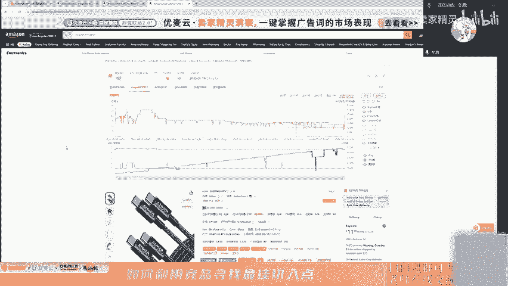

古装女士衣服的。手机壳点说机壳就不讲了吧，手机壳都。讲烂了。因为我已经讲了两年了，手机壳不要折摸我了。嗯。家居。我看一下有没有什么比较像的啊，就是有有重重叠度的那些，我先抽一下。

手机壳、电动牙刷、衣架、地毯、手机支架、壁灯、电脑桌、风扇灯、包装、高速吹风机、LD灯带，男装家居9的外 women电动单车。

what are print什么什么灭蚊灯、床头灯标品、家居吊扇灯、酒壶elelectric什么电动牙刷。那边。玩具男装。

嗯。然后了，我就看到一个英文单词，我就用这个吧，我们先那一个，但先先别刷了啊，就WALLET。😊，然后。这个。哎呀。😔，飞镖啊。😔，OK我们先来。先来看一下，就我们先去。先成立一个表签叫。女士包。钱包。

OK我们先重建一个。重建一个表啊。这个完了吧。这个表。然后。先找aen。A审。精品A森。啊，直接拿这个表来改吧。哎好像也都差不多。点牌。备注。ok 。看一下整个脑图。他老婆。然后我们就去找，就是去。

先去小类里面去找自己的精准精品啊，话说看这个我真的好难找啊。好标好标的产品。那我们迅速过一下，迅速过啊，就先先不要去纠结，先不要纠结其中的一个问题，先不要纠结说这个产品是不是真的相似。

然后我现在就是有边抄边有边抄边啊，就是感觉有点像哎，我就直接丢进来些。非标的产品。还是要猜一下的，还要仔细的去那个的。那我这边迅速过，就不不想去占用的一个太大时间，主要是讲这一个思路逻辑。嗯。

感觉这个有点像哈，那就这个吧，我们就先拿假设这三个是我们的一个精准精品O我们拿下来之后，这里的话就是我们B数据。整合。然后。这时候的话，我们需要把这个打开。这个打开。还有这个。一个两个。好。

那这个时候的话我们就直接把这个数据全部下下来。哦，这个转的会有点就丢丢的慢啊。好，现在数据下来了，我们就导出。拿出。拿出。哦。然后你就把这三个。留到这里，然后把它全部打开。但需要我们数据整理一下，就是。

先在这里。把A给加上去。就这数据源啊，这是数据源表里面加。然后到时候话们直接copy过去就好了，copy到我们那个总表里边。好，那么就时候我们 to copy粘贴。

然后contrl下号下向下的那一个按键过存就不要不要不要去动那一个原数据，我们只在原数据上去加出去，但是不要去保存它。就是我们做原数据上的改动，千万不要去动它。语原数据长什么样子就怎么样子。

你千万不要去保存。因为数据原本的模样很重要。因为你人没加上去和数据其实已经受污染了。所以的话你要去确认一下，就是千万不要不要不要不要歪不要想着去那个为什么要数据语言很重要呢？就是你看一下。

大家去发现一个点。这里是不是多出了一列，对吧？大家看一下这个到了第三个产品的时候，它的这个评分评论数这个。评分是在Q的这一列。那么第二个产品它的一个上来的时候，它不是评分，说它是一个。

他他他就变成他的一个评论数了嘛。所以话这个时候我们要数据整理一下，我们要把一些不必要的数据先干掉。你比如说像这一个。玻这个别R的呃，我看一下别的地方有没有。第三排名是这个哦这是小类的，小类直接干掉吧。

不要了这个数据。那这个数据不要了之后，我们要把它给。好像是弄反了啊，对，是弄反了，是这个数据。这个。如果你要把这个搬过来，对应这里，它才是正确的。所以我们需要。先把这里搬过来吧。要数要进行数据清洗的。

不清洗的话。有问题就对不上。先清洗数据啊。先检查一下数据，然后我们才能去整理，不然的话到时导出来的数据绝对是有有问题的。嗯。我操。啊，找到了。好，那这个时候到这边就好整理了，这个直接过去下来。好。

然后在这里。O。被检查一下没有了，那我们就可以把这一栏给删掉。这个输入一个东西叫A森。总结收后。好，数据对齐了，那我们就可以去新建这个第上。别上数据整理。就是按住它按住conttrol。Actrl A。

然后点击插入数据透视表，现有工作表，然后bes整理这里我们随便点一个地方，然后点击确定确定之后，因为我们是按日来维度，我们就把它拉到轴这里，拉到轴这里。

我们进因为我们统计的是大类be就是这个数据be排名。那我们先把它拉下来3个。因为我们要统计的是平均值，对不对？哦，我们就平均值再调一个最大值。最后我们再调一个最小值。好，那就完成了。

然后这个数据其实不算太明显的情况之下，你可能就要把它放大放的很大。就想办法去去看一下这个就好了。然后再调一下这个顺序啊。就是如果说像刚才那种，我们就按道具来看，然后大家没有发现一个点。

就是日期这里它导出来了。但是不是刚才我们数据整理的时候清洗的时候清洗的不干净，那是不是要我们要重新去把这个数据给再洗一次。我要把这个日期的。数据给干掉。OK那这个数据它不就干净了吗？那数据干净之后。

我们在右击这个刷新OK消失。搞定。这导的是什么？导的是这一个的数据。就导出的这个。然后我们就整理了这个Bar的数据。那剩下的就是按照这个来看的话，我们是不是要弄这个价格，对吧？就是如此类推啊。如此类推。

这个价格就是在这里直接contr2，然后你再点击这个插入，插入点击透视表。就是点击这里ctr2插入最透视表现有工作表，然后点击这里。价格数据整理。然后日期。然后价格呢，这里是有选择的。

就是你不要去选这个by box的价格，by box价格可能是这一个他做活动的价格。我为什么要选择这个价格？这个价格是他们自己标的那个嘛，对吧？那个bybox价格能做秒杀干嘛的？

这个价格为什么选择它是因为房子的一个点，就是有些人他去抄那个价格超的很低，但是他价格超的很低，但是他不能代表整个市场啊。这的话我们就需要拉这个真实的一个价格。因为有些人做prime。

有些人不做prime，所以你不可能你不去勾选这一些，你也不去勾这个bybos的一个价格。你重要的还是这个价格。因为有时候你会不被跟卖嘛。最重要的是这个数据。然后一样的，我们去拉三个。

因为了防止我们的一个数据有有影响，就是为了防止平均值的一个污染，所以的话我们需要调这一个把平均值最大值还是最小值全部给。调出来，然后你这么看这个数据其实很不直接，对吧？很不明朗。

所以的话我们就需要点击这一个。更改类型，然后点击我们折线，因为折线的话更加直观一点。OK然后我们再去把这个数据重新进行一个排序倒序。那我们就完成了我们的一个表。这个不复杂吧，这个对我这个已经是很简单了。

我这个不复杂，这个已经是很简单了。因为真要做的话，要比这玩意还要。😊，还有更复杂的，我觉得这个已经算是入门级的。这个不难啊。你要。有更难的，但是更难的那东西。系。不理起来其实收益不算太高。

就有时候闲着没事干的时候。

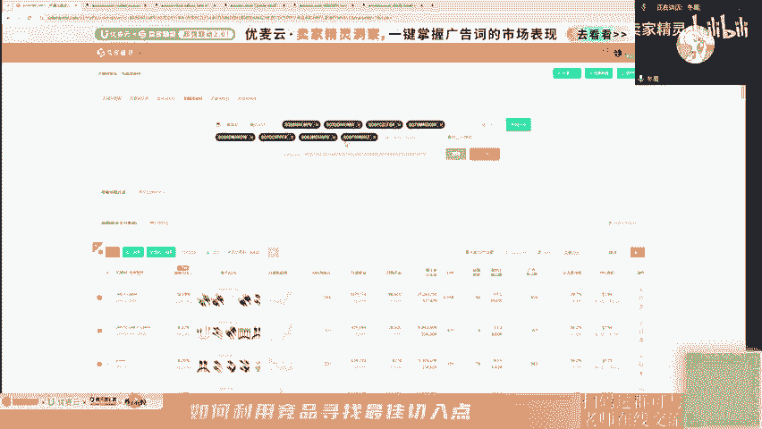

啊，去处理了OK我们点击到这里的话，我们要点击要把这一步啊。

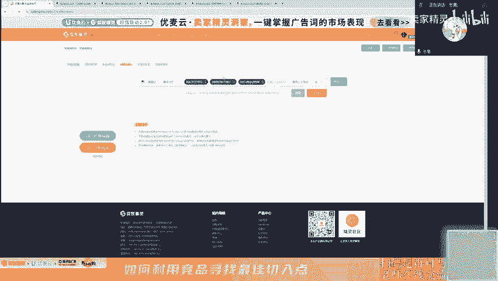

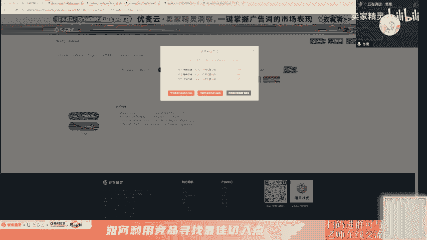

我们要去从ason这里把自己收到的精准精品的a全部复制下来，然后粘贴到这一个拓展流量池这里，然后点击这一个用全部变题多拓词。这样你拓的词才干净，就是才拓得完。然后这个时候呢，我们导出明细。导出明细的话。

我们就勾选这里的导出明细。

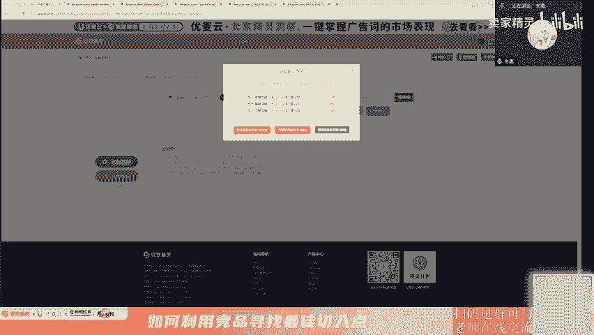

就导出了50个关键词的一个数据，月维度的1个ABA数据。然后在这里呢我们再导出一个点击这个导出，这个导出的话，就能把我们这个界面就3000条以内的数据全部给导导出来。那OK。我们拿到了这个数据之后。哦。

拿拿下来，然后丢在这个女士钱包这里，然后把它打开。然后我们就把这个直接复制过去就好了。因为这个是你的。a b a。这个是。关键字法查。关键词反差。把它复制下来。粘贴下来，然后在这里的话就是我们想要看的。

因为下面这个就是我们的核心的几个关键词嘛。但有些类目它没有什么核心关键词，你有可能有七八个，那你就把七八个的全部薅起来。我们先冻结一下，我们看这个数据。看这个数据。那我们看到了说1个1517555。

那这4个其实也35块钱关键词，人还可以再再定个4。那么这里一共是有5个关键词，那你就去找到这5个关键词，这5个关键词是。阿林文明。我嚟。small什么什么这么贵的。那我们就会把这个ABA的数据给耗下来。

那一样的，就是这已经对应好了。12345，那你就把这个东西一个一个重新建一个表。那这个ABA杠月杠B自起名啊，名字是自己起的，然后就不断的重复重复这一步步骤。就好了。然后评论分析呢就是评论分析。

评论分析在我们已经选了我们的时三个镜品，那我们就点击我们的AI评论分析，点击生成。然后AI评论分析点击生成，然后就等就完事了。就是代家嫌复杂的，可以就是先扫码。这一边呢是我们的直播问答群。

这个是我的小助理。哎，就是这上面有我们的一个折扣码，就是大家觉得卖家这边好用的话啊，就是可以直接下单。这是也有1个72折，就现在折扣还是挺大的，就个人的一个折扣72折。然后团队的版本的话。

就可相对于说没那么优惠，只有1个七八折。就是你觉得复杂，我在A边爬出去的话，就是大家可以先扫码进去啊。可以先扫码进去。关键词主要分析什么？OK等一下我会去呃去讲。

我们先把那个评论分析的内容先先把它导出来先。然后大家的怎么买呃。就是你跑到卖金灵这个官网啊。麦金美的这个官网。然后你直接百度卖爱精灵，然后点进去，然后购买就好了。具体怎么买呢？你也可以去加群。

然后群里面的呃麦吉灵的。小伙伴或者说麦精灵的朋友，他会告诉你怎么去下单，然后怎么怎么样。那么我喷都扫好的话，那我们就继续啊。大家可以顺便关注一下我公个人的公众号，东篱啊东篱。可以说一下，给我增加点粉丝。

那我们就把这个数据就拉下来，我们就去看一下。OK那这个是算是完成了。

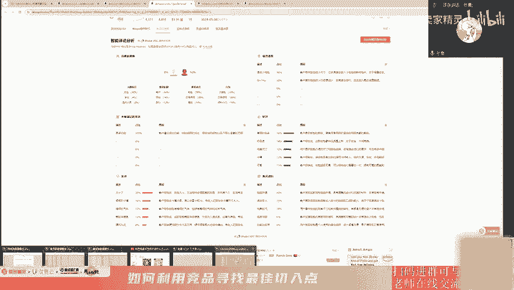

一个出版。就是只现在只是把数据拉下来，还没有分析呢。😊，只是说把数据拉下来，还没有进行一个分析。

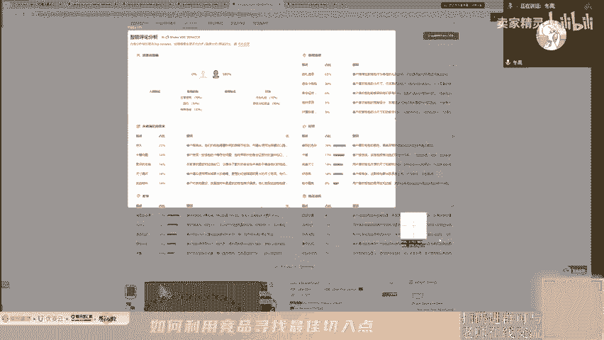

没有这些分析啊。那这个评论的分析就不需要去讲了吧，因为太。也这些都是很直接的数据了。那么有刚才我们问到了一个问题。有折扣码。酒曲马斋。这里。对里。好。你会我们先截个屏，你先截个图也行。

就是我要回答一下那个。嗯，到底怎么去分析这个关系，因为你导出来这个数据导的很多，对不对？然后我们关键是反查的时候，我们就发现。有时候就像这种数据分布的时候，我们也不好定说哎几个有核几个核心关键词。

就像你百分之像的那么散的。有时候我去定一个标准，就是说。这四个这几个词加起来，只要够30%或者40%，那就够了。那我这里看下来就是你把这部分的数据拉下来就就是加总了嘛。那么我们就看到求和40%。

就接近3%40%，我自己定的标准啊，我觉得这个标准适适合我自己，你看一下回去用了，适不合你自己。因为我常里推这几个类目的话，我比较喜欢定30到40。因为30和40流量我能解决了。

那剩下的70%和呃60%的流量都相对比较好解决。因为那部分流量它的词很多很多，那处理这些那么多词的时候我会可能会花花费很多很多的时间。那我把我的一个80%的精力去处理，只有30%。

一个花费有时间的一个东西。但是他结果很大。我为什么不去做这个事情呢？对吧？我集中去做几个词，我就能完成30%，40%的进度了。那我们就我的标准其实就是只要加起来有30以上或者40左右，或者比他更高。

基本上至少有30%嘛。那刚好这里加起来流量占比加起来是有30左右，就有38。那OK那这几个就是我核心的关键词，我要先想办法去找一下，就是像这个就达不了，因为这个好像是一个。品牌词OK我就把它干掉。

那么这个我先淘汰，从我的一个选择里面淘汰出来。OK那这时候加起来有没有30%呢？百分之。33。83OK那这四个关键词就是我要研究它的一个浮动的那这四个关键词我们去哪里看呢？就是从我们刚才下的那个数据。

就这一个。数据数据路径在这里啊，拓展流量池。然后你勾选这个，然后导出明细，就会把50个关键词的数据全部给下到一个表里边。然后这个数据里面就有我们养样的一个数据，是这个ABA的一个呃数据。嗯。😊。

那么我们就完成了我们的1个AB的一个数据的一个调研。就下下这里的话会比去后台要要快捷很多啊。因为后台有时候我们去下几十个关键词的时候，或者下五六个关键词的时候，然后你要下十几个月。

你要点的手确实比较麻烦就是。去后台下过表人都知道痛苦，都知道那个痛苦。嗯。然后ABA杠月杠2，然后我们去去分析它的1个ABA的数据一个浮动，去找到合适的一个切入点。我刚才就是还回到我们刚才那个点。

就是去找增亮的时候。这个增量而且每在每年都是不断的复现复现复现OK那另一个时间点就是我们好的一个切入点。然后什么是核心关键词，就是提供了竞品，那里就是这个精品提供了就是要头部竞品反查出来的。

那么是你的精准竞品啊。我说了，记住这个脑图。精准竞品。跟你一毛一样的产品。那么他导出来的流量其实就是你的流量啊。那么它的它这里占据了30%的这个流量的这些关键词，是不是你的核心关键词？对不对？好。

就是这个逻辑啊，就那个呃。W星星的那个。那实操大概是这一点啊，就是带回去按照这个逻辑自己重重新整理一下就好了。就后续我会把这个数据源表打包好，然后把这个东西直接脑图，你打包好。

丢到这一个直播的回放群这里。当然你也可以直接找我的一个小助理去要这一个东西。那今晚我的直播的话也就是到这里了。大家我再给大家两分钟，看一下有什么东西想问的。你不要搞到太复杂，这个问题不要问的太复杂。😊。

下次直播什么时候？哎呀，我这个下次直播这不得等着。麦精灵那边安排嘛，对吧？如果说你们反馈好。那我可能就有返厂，你们反馈不好，我就没有返厂的机会了呀。聊聊商品定位和关键词定位的关系，两分钟聊不完。

怎么合并拿BS表过。这个不够讲不够讲。这你说这个问题不能讲这种情。呃，老师就是listing的关键需要定期更换吗？呃，不需要啊，这个你只要前期调研好，把核心关键词埋进去，基本上就不怎么需要进行更换。

我说的不是不怎么需要，而不是说完全不需要。具体的还需要你进行一个关键词反查，重新看一下，就是你隔一两个月你反查一下，看一下流量有没有什么大的变化。没有的话，你基本上就不用改。如果说有大的变化的话。

OK那你就需要改一下你的一个文案。

好，还有一分钟。ssttain关键词重要吗？我。一般不写。我一般不写。😊，我是真的，就是我这我不写的，我现在很多产品我都没有写的东西，但是我也有产品，我也我也推上了top3top1这些啊，对吧？

所以这个东西其实我长期做几年做上来发现设那里就是作为一些流量补充还行。但是你要说一定要填嘛，如果说类目流量很集中的话，你不填也没关系。只要你的标题5点都包含了几个核心大词的话，设上空着也是OK的。

这个是由你具体类目的一个关键词的散度来确定。😊，然后一般透100选多少个精品A审作为参考呢？这个没有标准的，因为有一些类目的话，你的标你的精准竞品可能就两个。有些类目很就是非常非常细分的。

我之前就做过这这类型的产品，就是。特币0别说特别百了，top50里面我就找出三个竞品。所以这个东西的话，如果说你的竞品就像我这么刚好就三个，那只能拿三个了。但是我建议就是至少5个以上，如果说存在的话。

那最好是5个以上。如果像我这种已经找找遍了，泛滥了，那都找不到了，那没办法了，我只能拿三个人去进行一个调研。然后有一个海边听常问，就是麦精灵挖掘出来的词一般是用来打精准，还是打广泛还是词足好呢？

这个问题太大了，这个直播群里面吧。群里面说吧。