# 第86期【如何根据目标品类制定广告策略】 - P1 - Sif关键词 - BV1JqxgeUEFm

我开播后把直播间发你。hello，大家能听到声音吗？嗯。是。嗯。不是不露脸，是我正在那个。Cfe这边直播。Okay。O我看大家已经陆陆续续进来了。哦，系 know。哎呀，我这手机老是内存不不够好烦而。

我们可以先等一下佐伊老师。然后今天跟大家说一下，然后介绍一下我们的佐伊老师，他是亚马逊千万级广告大师，跨境佐伊，大家可以搜索佐伊老师对应的抖音号公众号，以及他对应的一些媒体账号。

他会在上面分享非常亚马非常多亚马逊的一些干货内容以及广告打法。然后今天呢主要是佐伊老师一个独家的分享，高效的广告推广秘诀。然后标品和非到品一网打一网打尽。主要是针对玩具品类市场分析调研消费趋势。

然后深入我们的竞品定位，拆解六大广告策略维度。今天大家可以都扫码进一下系服的福利群以及答疑群。然后可以添加一下我们佐伊老师的二维码。新用户现在注册系服关键词的话是可以。获得5天的免费试用。

大家都可以让身边的小白朋友啊，或者是还没有用过shiftif的都可以来试一下，幸if还是很好用的。然后今天我们会在直播间不定时的进行福袋抽奖，赠送价价值74元的幸福月度基础会员和157元的月度旗舰会员。

然后大家可以把直播间都转发起来。Yes。Okay。稍等一下，我进一下那个直播间看一下大家。So。Yeah。哇。大家稍等一下，左伊老师处理完就可以开始了。然后所以现在可以开始了是吧，可以开始了。

然后呃你那边OK了吗？Yeah。嗯，可以啊，好的好的，那我们就正式开始吧。那我这边就静音了，然后交给左伊老师。好的好的，那个嗯首先呢很高兴那个C这边邀请我过来那个直播间分享。

那么今天我主要给大家分享的话是以这个玩具为案例去进行分散大家的一个思考，就是只是说以这个玩具非标品的这个案例去给大家扩展更多的一个思路问题啊，不是说标品就不需要听这些干货。

只是说思路其实说实很多东西都是相通的。只是我做一个载体去发散一下大家的一个想法。然后先那个自我介绍一下那个我这一块的话是18年就入行，做亚马逊这一个板块。然后从一线的这个运营业务出身。

然后再到21年自己带团队，然后也是从0到1做过几千万的这个业绩，然后所以说自己对这个业务板块的是非。非常熟悉的，尤其是广告这一块。然后基本上从0到1整个选品运营广告，然后以及所有的这个人事招聘啊。

我都有这个直接插手做这些的全盘管理。所以说整个的运营生涯的话，相对会比较丰富一点。那么其次的话那个我也有做一些人才的一些收集。也就是呃身边很多这种操盘手出身的，可能不限任何的平台。

然后会加入到我这个社群里面，大家一起去相互探讨一些管理的问题，或者是一些运营的一些策略问题。那么呃业余的话也有接一些亚马逊的一些单品爆款的一些陪跑的一些客户。

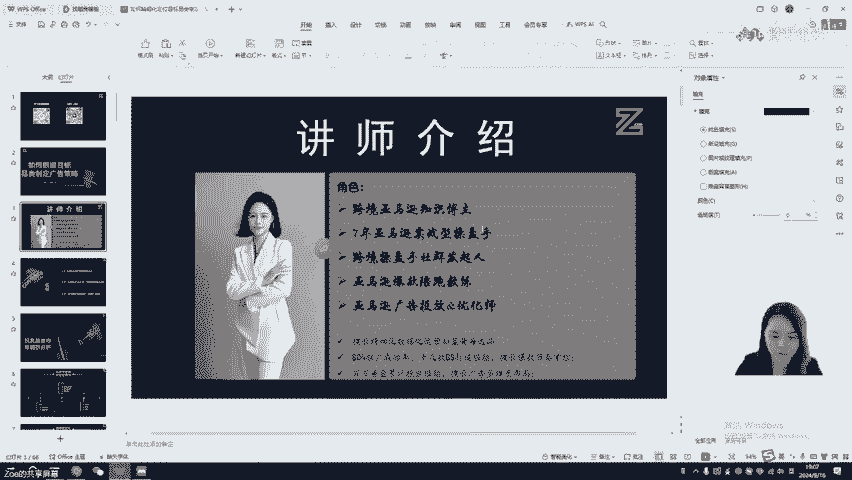

然后嗯。实际上的话那个我这边主要还是擅长这个精细化这一块的一个运营策略和这个选品的一些策略。所以说啊也过往打造过多多条这个BS。那么所以我也希望就是通过shift的直播间。

把我个人的一些干货经验分享给大家。好，那么今天听今天我主要还是从这三个板块进就是跟大家去分享我过往的一些实操的一些干货和这个运营的一些心得吧。那么第一个板块的话，我会从市场的这个维度去给大家去分享。

那么第二个板块主要是通过这个竞对手的一些反常啊，了解他们的策略到底用了哪些，然后去知己知彼，我们才能百战百善。所以说那么在整个的这个打法当中，其实说实话，那我了解竞争对手。

其实实际上为我的这个整个的运营策略其实做很大的一个啊推动。所以说那有些他的这个资源也好，打法也好，不一定很适合我现阶段的一些团队的一个现状。所以我只需要知道它成功的因素是什么。

不一定我非要复制它的一个成功经验，到我自己的团队。那我得知道就是说这些成功经验，它是怎么起来的。有哪些好好处就需要我们去吸收。那么它不好的地方我们可以去啊去去做一个一个经验的一个交流。

那么第三个板块的话，也就是通过市场和这个竞争对手的所有的信息了解之后，我们会根据自己的一个目标，比如说我一天要啊出100单，那我需要跟我这个目标去挂钩，那我要去怎么去高效制定我的广告的一些策略。

那也就是啊今天可能这个时间如果到时候看够不够，如果够的话，那么三个板块我都会给大家去分享。那么首先我们进入第一趴，也就是玩具品类的一个市场竞争的一个啊分析。

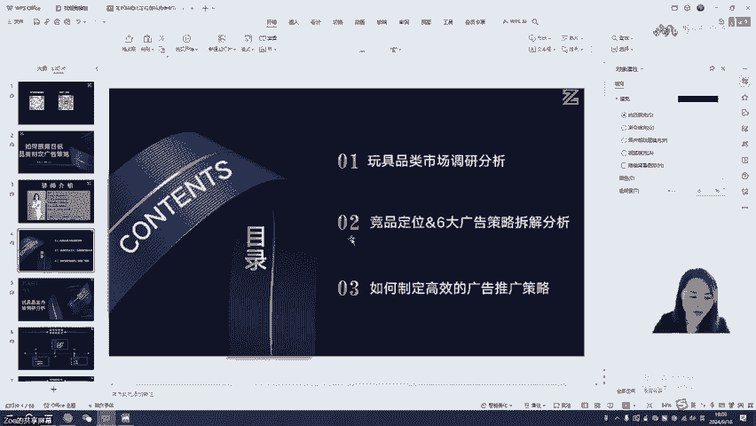

那么我刚刚前面也说了，我只是以玩具这个品类为载体去做一个案例举大举例子给大家去啊分享。只是说这换成3C的也好，换成其他的什么嗯美妆或是各户或是啊家居品类。

其实说实话所有的思路都是相通的那我只是说以这个东西去做一个案例啊去讲。然后。然后首先我们来了解一下那个亚马逊的这个品类市场调研的一个重要性啊。首先我其实我想了解一下。

就是说大家在做市场调研选品这个阶段的话，其实最需要考虑的是哪些因素啊，啊？首先第一个是不是成本。比如我现在无论是我是初阶卖家还是成长型卖家还是成熟型卖家。

那我是不是会思考我手上现在有多少现金流的一个问题，对吧？如果我是一个初级卖家刚进入这个市场，从零开始，那我是我手上如果我我有50万的一个启动资金，那我要怎么思考，我把这50万啊最大化的利用起来，是不是？

所以那如果我是成长型卖家，我已经做到5000万的这种体量啊，那我现在要从5000万突破到一个亿，那我这手上的流动资金，我要去思考怎么付。累把它做做大是吧？然后在这里面我需要可调用的这个资金啊有哪些？

那我从一个亿的这个规模，我要做到三个亿，5个亿，那我也是思考我这一个亿里面的这个规模到底可用的一个现金流资金，那能够支持我们做到啊，通过一年还是三年的这个时间能做到3个亿还是5个亿，对吧？

那我现在的这个。整个这个搭盘子的这个过程里面，我需要思考我这里面的这个成本到底结构需要涉及到哪些，对吧？那比如说我们涉及的这个成本的话，是不是首先第一个啊，是不是我们的一个啊人工成本，对吧？

那我如果是作为一个出街的这个卖家。那我前期可能很多东西都是我自己当老板一条龙服务了。比如说我又做选品，又做这个运营，然后可能还要做一些售后客服，可能还需要做这个采购的这个角色，可能我前期的人工成本。

我会控制到很低，是不是？但当我们到的这个成长型卖家，也就是我们现在做了三五千万的这个啊卖家的一个体量，那我现在的这个盘子是需要请多少个人，可能我已经涉及到啊10人以上或者20人到3十人，对吧？

这个这个规模的这个人工成本，我们需要把它控。是在多少比例。然后其次的话，那我们的一个物流的一个头层和尾程的一个费用，是不是也是我们的一个成本结构之一，对吧？那不同公司的这个做的这个客单价。

可能客单价的这个原因啊，涉及的这个头层运营的这个占比比例也是不一样子的。那么第三个可能我们的一个。推广成本。那这个推广成本的话，我们大家都知道，它包括这个站内的一个推广和站外的一个推广。站内的推广啊。

很多大部分的买百墨玩家基本上也就是众头的一个支出，也就是处于这个广告这个啊成本的一个结构，其次的话就是秒杀这一块的啊促销啊，对吧？呃的一些成本的一个支出以及站外的一些成本。

比如说如果我们是一个成熟型卖家，那现在我们要做一些品牌的一些布局，那是不是涉及到搭搭建这个什么独立站也好，或者是啊网红的一个渠道的一个品牌曝光的一些啊资源等等。

那我们涉及的一个推广成本跟红人的这个营销费用，对吧？它的一个支出，实际上也也挺占大头的啊，那我们如果说只是一个微型这个企业的话，可能只是涉。及到这个站外发帖的一些费用，还有站呃站外的一些折扣的一个折损。

对吧？这一块的一个呃损一个推广成本。那当然我们刚刚还有提到一些促销的活动的成本，以及啊以及这些促销的一些秒杀呀，或者是其他的一些什么退货成本等等。

那么实际上我们可能根据这所有的一个成本来去去构建我们的一个启动资金，实际上啊，对吧？我刚呃前面也有说到，那我作为微型企业的话，我手上只有50万人民币的时候。

那我会思考我怎么去最大化的控制我的人工成本、物流成本以及推广成本，还有其他的一些啊啊管理成本和这个租金成本等等，对吧？然后第二个板块，那我在做做市场调研的，实际上其实说实话我选定一个细分市场也好。

一个大类的也好，那我是不是首先我要思考我手上有哪些资源。那这些资源分别是哪些东西啊，也是第一个行业的人脉。资源，那什么是人脉资源？那也就是比如说我现在是一个啊刚起步的亚马逊的卖家。

那我可能更多的啊会思考我身边有没有一些从事亚马逊行业的这些卖家朋友啊，是吧？那我如果我没有这一块的这个资源朋友。那我能不能去加入一些社群去了解一些同行或者是一些朋友啊，对吧？

所以说那这这这里面的人脉关系，也就是造成就是构成我们整个的一个交流的一个氛围，以及啊你能不能从别人身上获取一些成功的经验，以及啊失败的一些啊教训，对吧？提前规避一些这个跨境的坑。

来啊提高我们的整个的这个资金的一个使用率。然后第二个板块的话，我们的是呃在选品的一个阶段，是不是要考虑这个手上现有的这个供应链资源啊。

那如果说比如说我现在我我我身边的呃朋友可能大部分都是做那个家具的这个行业，但是我现在只想做玩具这个品类，那我是不是需要额外去开发这个玩具品类的这个经营对呃这个供应链的一些资源，对吧？

那大家都知道玩具的这个整个的一个啊行业的一个啊资源库是不是在澄海那边，对吧？那陈海这这么多这个工厂，那我们能不能通过一些啊优质的朋友来获取这个源头的一些采购成本或者开模成本，对吧？

然后最大化的把这个供应链给管理起来，或者是利用起来，那么第三个板块，也就是服务商资源。那服务商资源实际上大家都说啊，好多这个服务商都会就是主动加我的微。其实实际上感觉好像这个服务商资源其实挺容易获取的。

其实说实话，真正的服务商优质的服务商资源其实说是不太容易获取，就你们看到的一些服务商资源，其实说实话可能都是二手三手了，对吧？那我们思考的是。这这个资源的获取，我们能能不能找到一手的服务商。

无论从靠谱性，还有这个啊成本结构上面，我们都能拿到最低的一个价格和这个合作。那所以说啊一手的服务商资源，它实际上不是说经常流通在市面上的，尤其是那些大麦的一个手上资源。我举个很简单的案例啊。

我们以前那个做了一个美妆市场那个产品。然后呢。有一天那个竞争对手把头部的第三名把他的链接变狗下架了，然后嗯可能是在那个凌晨12点钟下架的。然后他凌晨呃四五点钟可能就已经解决这个问题。

啊那个链接给恢复了啊，那你想想，如果是你发生这种情况，大半夜的有几个服务商能在半夜还能起来给你干活，并且把这个事情给解决很O。实际上大麦的这些头部的链接，他们的一天的这个出单。

如果一旦被关停或者是被下架，是不是损失非常大，是吧？尤其是那种一天啊销量能达到上千单的这种情况啊，关闭几个四五个小时，实际上这个单量其实利润各方面都会有很大的一个折损。

所以说那你手上有这些优质的服务商的时候，当你的店铺或者是链接。遇到任何的一些疑难杂症，他们都能在第一时间给你去解决问题。那这些服务商的资源是非常稀缺的啊，所以说大家也都去呃跟这个身边的朋友也好。

这个啊同行也好，可以去交互一些这个服务商的一个资源，对不对？然后啊第四个就是物流的一个资源啊，物流的资源包括哪些东西啊，也就是物流可能更多的是偏向于头城啊、尾城以及我们的海外仓的一个资源啊。啊。

那海外仓的一个资源的话，说实话这个其实说实话嗯大家去去让朋友去推荐，其实也比较好找。那其实说实话有一些尾城的价格真的是大家意想不到的低啊。可能你用的还是四5折的这个UPS的账号。

人家直接用1到2折的UPS账号，尤其做这家具这种大件这种产品的话，他们的一个尾城配送的一个成本其实是可以控制到非常低。有时候我们在核算利润的整个过程里面，其实都很难去呃，核算的到位。

就是说我们在思考各项的成本的时候，我发现就是说有一些成本是低的。我们远远想不到的一个成本的一个结构啊。所以说他为什么前台的定价可以9。9块秒杀全网可能我们算的时候9。9块就是亏本10%的一个利润。

但是对他来说，可能这个9。9块的这个利润，还有。美金的利润可以进进行去啊获取。所以说有时候呢就是因为我们在这个源头的整个的一个生物链上面，其实没有太多的一个资源可以够我们自己去支配。

所以导致我们的一个成本很难下降，所以导致我们的高客单价比较高去卖，其实没有任何的一个优势，是吧？然后啊第三个板块也是思考它的一个竞争格局。那这个竞争格局是思考什么？那我们在确定一个品类要去做的时候。

本比如说我我现在就是要做这个玩具品类，那玩具品类它存在哪些机会和风险，我们是不是需要去思考啊啊有哪些机会啊，玩具品类？啊，我不知道现在的直播间的这个各位粉丝啊，同行们呃。

大家的这个做玩具品类的这个卖家粉丝多不多啊。就大家的话那个其实说实话在机会其实说玩具这个品类其实说实话呃产生爆款的机会还是蛮多的。呃，实际上我们以前也做过好几个这个爆款的这个玩具啊。

有大类几大类几百的对吧？也有很容易其达到过大类前5000名，其实比较容易实现的。这旺季的时候，基本上都是翻5到10倍的一个啊情况。所以说他平常可能1到10月份，他卖的可能一般也就像常规品一样卖啊。

一一天可能三五十单或者是一两百单，但是到了万年底旺季，他能达到这种日出千单的这个啊销量的一个情况。所以说他的机会是什么？他爆单的一个机会以及市场的这个呃利润的一个机会实际上是很ok的。

那么实际上它的风险有哪些？那做过玩具品类的卖家都知道，其实他是很容易啊外观或者是发明专利侵权，是不是啊？我相信做过这一类品类的这个卖家其实深有感受啊，就是一旦被这个店铺TRO的这些卖家。

其实说实话真的有时候就是辛苦了呃蛮久或者是好不容易一款产品赚钱了，是吧？一下子回到这个解放。前，所以说大家可能会对这一块类目的话会比较敏感。就是你没有一些啊该准备的一些必备的这个认证。

实际上我们可能还是比较容易产品被下架的一个风险。还有就是一定要做好这个呃商标以及外观，还有发明专利的一些啊侵权。好，那也就是所以说我们要做一款产品或者是深耕一个类目的时候。

我们是不是要去思考我们现在手上有什么东西，并且可以支配用哪些东西，对吧？然后我们的机会，我们的风险是在哪里？我在做这个玩具品类的时候，我需要思考清楚，我现在能不能解决这些问题，并且把我手上的东西啊。

提高它的一个使用率啊。所以说在在这里的话，主要重点跟大家强调就是说我无论是生耕品类还是这个范选品，都是需要啊思考这些问题，你才能把你现有的一个现金流放到最大。好。

那么我们现在了解一下其他类目的一些啊竞争对呃优劣势的一个对比啊啊不知道大家有这个听直播间的小伙伴有做哪些类目啊，可以在这个屏幕区打下来啊，我相信应该目前做最多的可能是一些家居是吧？美妆玩具啊。

还有一些庭院或者是啊呃这个家具。那么我进呃等一会儿会从这好几啊四五个类目去给他去啊分析。那么首先第一个杂货美食的这个类目，不知道大家有没有接触过呀啊，这个类目有接触过的，可以扣个一啊。好，这个类目的话。

为什么我会重点啊来跟大家分享？因为首先第一个我自己之前有接触过这个类目啊，所以比较了解第一个它有哪些这个优势呢？首先啊它对比那些热门的，比如说家居或者是玩具还是说这个鞋服等等这些类目来说。

其实它的竞争环境相对是要比较小的啊，那然后呢还有就是它的一个销售周期，它没有一个非常淡旺季的这个明显的一个销售的一个情况。所以说一年四季它都可以销售，可以卖。

就跟我们做一些常规的那些3C的一些啊常规品一样。它然后第二个的话，它其实存在很大的一个需求。为什么？因为说实话比如说你你买来的一些零食还是这种保健品，还是或者其他吃的东西其。

说实话你你你这么看去是不是复购率其实挺高的啊，我就好比这种啊女人用的一些。呃，零食吧就是小孩吃的零食也好，大人吃的零食也好，吃。如果口味对的，是不是我们会一直去买这个零食吃，对吧？

其实它的复购率是比较高的。那么那所以说也就意味着它的需求是比较大的啊啊这种产品的话，其实说实话你也不需要担心它没没量没市场，就是说它的市场容量以及竞争环境对比其他几个大热门的这种类目来说其实都还好。

然后但是它有哪些劣势呢？首先第一个啊门槛比较高啊，需要类目审核以及认证要求啊，因为说实话美妆这个美食杂货铺的一些那个产品的话，实际上会涉及一些FDA认证，所以说唉做一个FDA的一个认证的话。

其实这个如果说做的很全的话，其实价格还真不便宜啊。如果只是。应付亚马逊的一些审核，可能几千块钱能搞定。啊，但实际上就大部分的一个卖家，其实对这个认证的一个嗯重视度还是比较低的。

然后第二个的话就是容易容易陷入这个价格战啊，所以导致这个利润率会比较低。为什么？因为食品杂货类这一种产品的话，实际上它它。价格比较明显，就我我们之前做了一款就是呃十几美金这种产品。

你会发现啊站在头部的这些前三名基本上都是9。99块，8。99块或者是稍微高一点的，也就是12。99块。所以说实际上你打广告也好，你如果不打到这个头部四个位置。

基本上卖家他都会优先啊在前面前八位可能前15位就已经下单购买完成他的整个的一个流程了，都不可能说还要翻第二页第三页去。所以说这也就是说为什么我们当时打打产品的时候，为什么要卡头部位置。

就是因为这种类目的话，太吃价格了。所以我们基本上都会啊去卡一下这个广告位。然后所以说那你价陷入这种价格战的时候，其实说出来你的利润率有时候也会被稀释下来。因为有时候我们不得不去低价去引流。

但是我们可以通过做这种多变体的这种方式啊，一个做这个引流款，其他的做这个利润款啊，相相对这种搭配的话，相对大家还能接受这个利润率。然后第三点的话就是需要找特殊的这个物流渠道去发货。

因为我们之前会做这种类似于这个高膏体液体类的这种食品啊，所以说我们当时其实开发了很多这种敏感货的这种渠道啊，啊这种渠道的话，其实说实话相对市场来说，其实也比较难找。因为大家了解到的这个敏感货发货的话。

其实大部分的。大部分的这个呃客客户去选择这个物流渠道，其实都是走的这个冲货。其实说实话呃，大部分的物流商它都会在你的这个基础的产品上面去加1到2年1到3块钱的一个附加费啊，对，所以说这个时候的话。

我们实际上其实说实话在整个的物流成本上面其实要比这个普货要高的。那么第四个就是说容易过这个保质期，对吧？那为什么过容易过保质期，因为它是属于杂货美食，它是有一个啊这个产品的生产周期。

以及这个质保的一个质周期。所以说那对于这类产品的话，我们在包装上面要特别去打上这种标签。就是说这个产品是什么时候生产的。并且它的它的过期是大概是什么时候啊，就是如果说你的产品包装上面不做这。

这些标签呃打标的话，其实实际上可能很通过亚马逊的这一块的审核。所以说那这类产品的话，它也不容易啊处放。然后第二个啊，也就是大家接触最多的，也就是比较热门的，也就是家居类目啊。

相信屏幕前的大家其实做这个类目的人其实大家还挺多的啊，可以在屏幕里面扣个一啊，我看一下有多少人做这个家居品类。对，然后我们我之前的话主要也是啊以家居这个品类啊为主啊。

其实说实话啊那么家居品类我们啊来了解一下它的一个优劣势。首先第一点啊以刚需品为主，那体量比较大，为什么它是以刚需品为主啊，就是家居类目啊啊我们以前更多的是做厨房这个啊场景下面的一些产品啊。

所以以及浴室类的。所以你会看到其实说实话这类产品呢其实供需还蛮ok的。但是呢其实。它虽然体量大，也很适合一年四季去销售，没有非常明显的这种淡忘季。所以说往往为什么大家都会选这个品类去开发选品啊。

主要还是看重它的体量大，并且它的一年四季的这个销售周期对业绩的影响，波动不会很大，是不是啊？然后第二个的话就是家具和家电这一类产品的话，客单价会比较啊居多一点啊，实际上如果说厨房和这个浴室类的话。

大部分的产品还是偏低客单价这种产品啊，但是它还是有蛮多这种高客单这种产品的。那么现在随着这适应还是特模或者DK这些新兴平台的一些起年起来。所以说也是呃对这些高客单这种产品，其实卖家有一定的这个优势啊。

就是啊就是如果说咱们还是做低客单这种。产品的话，因为这些其他新兴平台的一个起来，其实会分散很多这个流量出去或者是订单啊。然后劣势是什么呢？因为首先第一个大家都知道家居这个品类其实说实话差异化太容易做了。

尤其是那种非常简单的一些呃杯子也好啊，玻璃杯啊也好，或者是一些价值类的这种产品或者储存类的这种产品。其实说实话真的没有太多的难度去拍这个所谓的这个私模，对吧？开发的成本非常非常低。

所以说这也就意味着公模很多的时候，其实它的竞争呃激烈啊，所以说这个时候是不是大家很容易陷入这个低价内卷的一个呃环境氛围，所以说我经常跟卖家去交流，我发现就是他们也挺痛苦的，就是做的这种类目呢。

呃基本上快的话，三个月就卷成红海了，尤其是遇到这个深圳的卖家，对吧？因为他们了解的这个技巧啊，或者是一些黑科技太多了，所以导致就是说大家很容易就是啊处于这种。低价抢占这个单单量和这个流量的一个啊情况。

第二个就大件产品的一个啊库存管理会比较复杂。因为我前面提到了，就家居这个品类不仅仅它只有这个低客单价这种产品的小件，它还有很多这种大件这种产品，所以说它的一个库存管理其实相对小件来说其实更复杂。

那其次第三个就是说大件这种重抛货的这种产品的，它的运输成本配送成本其实相对比小件要高很多，对不对？然后我们的这个受损率啊以及退货率的一个成本也是比较高的对吧？尤其是做那种易碎的这种玻璃性这种产品。

其实它的退货成本还蛮高的。基本上如果说你做玻璃这种类型的这种产品。你一旦客户给你搞搞搞坏了，或者运输途中坏了，基本上都是不可回收的啊。所以说那我们遇到这种情况的话，为什么大部分的人还是会选择这种做小件？

这种小件的话啊，可以大大的控制这种啊退货率以及这个受损率的一些成本控制啊。如果说咱们也没有什么海外仓的一些优势和资源的话，其实做小件啊，相对会友好一点。

然后第三个也就是带来分析这个美妆类目啊有没有做美妆类目的卖家朋友啊，有的话可以打个2。那美妆类目的话有哪些优劣势呢？首先第一个啊，它的劣势它的优势是第一个利润比较高，为什么高呢？

因为我之前也有接触过这个美妆的这种产品，我一算账，哇塞，这个利润率能达到45%到50，那当然我不知道大家有做有多少人做这个美妆类目啊，反正采购成本是非常低，可能两三块钱能卖到9。9美金，对不对？

所以它的她的其实她的采购成本是非常低的，然后利润是非常高，然后为什么复购率也比较高啊，举个例子，比如说我们女人基本上为了保养皮肤是不是会很喜欢去买那个面膜用啊，对吧？那面膜这个产品呢。

实际上我们一个礼拜最多可能用2到3片，那一个月我们使用她的一个片数是不是还不还还挺O的啊，尤其。是你如果作为一个长期呃这个高度护理专家，所以你对这一块的一个啊需求其是蛮高的。所以说你买了一盒。

你会买第二盒，买了第二盒，你买第三盒，对吧？所以它的复购率是比较高，然后市场的一个增长也是比较迅速的，尤其是那一种创新型这种产品啊，有一些比如说我们女人喜欢用的这种啊夹头发的直发板或者是一些。啊。

卷发棒等等啊，这些产品实际上它的市场的一个增量其实还是增长挺ok的那实际上为什么我还会提到这个品牌忠诚度比较高，因为美妆这个类目其实大卖以及品牌卖家还是蛮多的啊，那我们女孩子喜欢买这种彩妆。

为什么很少去买国产的品牌，比较喜欢买这个国外国际的这些品牌啊，是因为是因为啥，因为中国人生产的这个护肤品或者化妆品不行吗？啊，其实说实话有有一定的这个成分上，就是说大家还是有点崇洋媚外。

觉得这个中国啊制造的这些美妆产品不靠谱是吧？所以说呃会会对这种国际的一些品牌忠诚度还是蛮高的啊，那它有哪些劣势呢？啊，第一个就是说多为这个大品牌，就是品牌垄断性比较强啊，因为有一些。

口红类的护肤品类的或者是洗护类的。其实说是基本上你看到头部的链接都是一些大品牌啊，国际品牌就很少是这种新兴起来的一些啊商标。啊，所以说它品牌垄断性还是蛮高的。那么第二个就是说行业的普遍的评分它不高。

平平平均四分啊上下。那实际上啊比如说我们以前出了一个出了几个爆款，一个是那个美白霜。那其实说实话我们按我们中国人的这个理念，就是说啊老外还用这美白霜吗？其实说实话我也涂过美白霜，就是涂在这个皮肤上。

其实说实话是很难起到这个美白的效果，它可能就是那几秒它美白了一下啊，实际上它它很快消失。但为什么这种产品也很容易成为爆款了，是因为有一些噱头确实啊当地人他接受度还蛮高的哈，啊不仅仅是什么美白霜。

也可能有一些什么腹肌膏啊，对吧？就是专打这些核心的一些小部分的一个健身人群或者是美白人群的这一部分的需求，把它无限放大。所以你会看到这一部分产品它也容易成为这种爆款趋势。

但是呢它的其实它本身评分并不是很高。你可以看到可能2点8分都能日出百单。如果一旦到了那个销售季节啊，它也能日出百单，他不是说它产品评分不好，他就卖的不行。他有时候真的就是吃那个噱头。

然后第三个就是选择多，竞争会比较激烈。因为美妆这种产品的话，其实说实话品牌比较多。然后大家的一个选择权也会比较多。所以整个环境其实说还相对是比较激激烈的哈。

然后最后一个就是说存在这个市场饱和的一些风险需要创新和差异化的一个策略啊，我们可以看到美妆很多这种产品的话，其实就就比如说这个植发器也好，或者是呃这个卷发棒，那相当这种市场的话。

其实说它饱和度还蛮高的啊。如果说你的在产品的功能上面没有太多的一个创新和差异化策略的话，其实也很难在这种红海里面杀出一条啊血路出来。所以说其实说说实话对于这种功能性这种产品的话。

其实我们还是需要花蛮多这种心思去思考这个差异化的一些策略啊，不是说你。做了几个功能的升级。比如说啊从三个档加到5个档。其实说实客户有时候他真的不太介意，就是说你你有三个档或还是5个档。

他可能更多的是关注到你这个直发，每一次我用的这个假发板，它能不能起到很好的这个效果，是吧？能不能自动断电，或者是呃呃他他能维持多久是吧？你只能维持半天还是维持这个呃一个礼拜等等。当感这一块的话。

可能是需要我们啊自己去那个呃去去去思考更多的一些差异化的一些策略。根据这个产品的一个特点和这个当地啊女性的一些消费的一个痛点。那么其以上就是说针对其他几个类目啊，给大家去做了一个啊优劣势的分析。

那么我们再看一下玩具品类的话，它有哪些优势啊，那么首先第一个啊市场需求会比较ok，对吧？不购率也比较高。呃，大家做过玩具品类，大家都知道，虽然它在1到10月份可能它的一个销售啊比较平淡，但是说说实话。

一旦遇到一些啊，比如说季忆性产品，比如说这种复活节这种产品，对吧？实际上其实量还是挺大的啊，可能呃如果说你做的都是一些常规类的玩具的话，其实说它可能只有年底的那一波旺季它的一个。

爆发力啊挺OK那实际上其实他的复购率还还是比较高的。尤其是呃当妈妈的人都知道啊，就比如说我宝宝现在只有一岁，那我现在买了一岁的这种玩具的话，再去买2岁的玩具。

实际上一岁到2岁她的身高和这个体型是不是会发生很大的这个变化，啊，基本上我我给那个闺蜜的这个女儿去买服装的时候，我就很能明显的感觉到啊，一岁的时候给她买的衣服，她可能到2岁完全就基本上穿不了了，对吧？

所以说这也是往往啊导致这一些玩具也好，这些。产品啊啊复购率高的一个原因。嗯也就是他可能买了A这个产品，他还会买这个B产品的一些玩具嘛，对吧？那比如说我有呃3岁以下的这种玩具。

那我也有3到6岁的这些玩具是吧？你孩子随着这个年龄增长，你的购买的需求也会去增加，你不能说一直给他用3岁以下的这种玩具吧，对不对？随以他年龄增长。

你也会跟着他的年龄的特点和啊后续啊等一会儿我会带家再去分析，就是说面对这种玩具品类的不同这个人群和这个买家和这个消费者以及这个体验者，他使用者，他的一个需要的东西是哪些啊。

然后第二个就季节性数啊需求会比较强，节日促销的这个增量比较大。刚刚我也提到过，就是说。它有一些像复活节这复活节的这种产品或者儿童节的这种产品啊，对吧？

然后它其实呃比如说那个鸡蛋类的这种啊呃复活节这种产品，实际上它在呃复活节的时候，其实它的销量需求是比较大的那你看到他过了一旦过了那个复活节是不是基本上呃销量都很低迷啊，即使它关键词很靠前。

你可以看到它也很难去出单了啊，因为这个人群的一些消费特点的原因，所以也就啊决定了它的一个单量的一个现状。那么节日促销，也就是为什么刚刚说12月份它的爆发量这么大，平常啊也就是20百单啊。

然后到了这个年龄旺季，他可以日出签单啊，这就是在玩具里面的这个魅力啊特点。然后第三个品类丰富的一个多样性啊，多样性。那你可以看到我刚刚。举例玩具的话，它的整个赛都是比较宽泛的对吧？有适用这个baby啊。

刚出生的，也有适合这个1到3岁的啊，也有3到6岁的，6到啊10岁的或者10到15岁的啊，15岁啊到这个17岁的等等。那成人之下呢，其实每个年龄阶段，你可以看到他出单词的一个特点都是不一样的。

而且很难去掌握它的一个出单规律啊。其实说实话也就是因为它其实涉及的品类，其实也会分布多样啊，所以说你会发现你很难去掌握它的出单的一个节奏的一个关键词。啊，所以说在这里面创新的空间会比较大。

为什么说他创新空间比较大？因为我发现很多这种卖家，尤其在这个产品迭代上面做一些用心创新的这幅卖家，其实他们会在这个呃产品，比如说有一些呃呃孩子用的这个手动的这些玩偶，他会啊加一些什么音乐啊。

或者加一些那个感应的一些功能来升级这个产品的一个多样性玩法和这个有趣味性啊，对吧？所以他其实他的创新创新空间还是蛮大的啊，它不仅仅说只能做一个摆件的一个玩偶。

它还有一些趣味性的一个啊给孩子玩耍的一个空间。那么啊它有哪些劣势呢？啊？啊比如说第一个同质化竞争会比较激烈。啊，我们可以看到，其实说了就比如说咱们有没有做这个玩具车的一些品类的卖家。

其实你可以看感受到就同质化其实是非常激烈的啊，对吧？就玩具遥控车的话，其实它外观其实相差并不是很大，可能无非就是做一些LED灯，还有颜色的一些差异化，或者是车轮的一些差异化，对吧？

实际上其实说实话这种的话，其实在价格上面，其实啊并不是非常明显啊，然后所以说那价格占频繁的话，其实也会导致降低我们整个卖家的一些利润空间，对不对？所以说大家到哪里都是哎呀好卷啊，这里也做不了。

那你也做不得，是不是？所以其实说实话不仅仅是呃这玩具品类也好，家具品类或者这个美妆品类。实际上其实说实话，每一个品类的一些细部分细分市场其实都有价格战的一些啊现象啊。

我们要做的是如何在产品和这客户需求端去升级迭代，加强这个客户的一些粘性，而不是说一味的降价来提高我们销量。然后产品的安全度啊比较要求比较高，风险比较高啊，为什么刚刚前面我也听啊也给大家说了。

就是说玩具如果我们想要做一个非常垂直的一个玩具品类的卖家。那专业级别的卖家其实说他对这个认证的要求是比较高的。所以说我们至少啊要把这个技术的一些呃认证，了解清楚，对吧？然后该做的也要做到位。

在防止这个上架之前或者是旺季来临前，防止这个链接被下架的一些风险规避一下。

然后这里的话是。啊，给大家展展示一下，就是从21年到23年整个玩具市场的一个啊销售额的一个现状情况。那我们可以看到，从这张数据图里面可以看到。

是不是23年其实消费者在玩具的这个消啊花费只花了280亿美金。那比22年其实下降了8个点。那你那我们要思考，就是21年啊20年21年啊，这这几个啊三年份的话，为什么这个市场的增量会比较大呀？啊。

你看啊19年才做了那个啊223亿美金的一个总销售额啊，出口总销售额到了啊20年其实实际上19年到20年它增长了17个点啊，对吧？做到26亿美金，到21年到了这个22年它增长的幅度大不大。

是不是不大才增加了啊0。2B年是吧？所以说那这里面为什么它的增长幅度这么小了，可能就是因为疫情啊，把整个的这个品类也好，其实啊会有这个大幅的一些啊出口销售额的一个增长的一个情况。啊。

所以说拉动了整个消费者的一些消费行为，对不对？啊，那我们通过这种图来了解整个玩具市场的一个啊大行业大方向的一个走势，才去就是我们要掌握这个大的一些方向和政策的问题，才去好做一些品相品线的规划也好。

这个对吧？啊，然后右边啊这里的话啊是这个整个的。整个玩具啊销售这个统计啊销。呃，的一个年度的一个规划，那我们可以看到以这个10个细分市场的一个品类来看它的一个收入情况。你看到没有呃。

增长幅度最大的是哪一个啊，基本上都是在下滑的，都在跌，看到没有？啊。都基本上都在跌啊，你看啊户外和运动玩具的话，负16%啊，洋洋娃娃这一块的细分市场也是负16%啊，对吧？

然后探索类的这种玩具的话-12%。啊，然后人物模型和配件负13个点，我们可以看到这几个区，如果有做这几个细分市场的品类的这个卖家，实际上啊也有这个单量上明显的一个感触啊，对不对啊。

这里的话其实也就是告诉大家，就是通过这种啊大方向的一些啊出口的一个啊B to B也好，B to C的一个啊这个数据的维度。我们可以掌握这个大方向的一些啊增长和增长的和下滑的一些趋势的一个啊了解。

那么你看这里面啊只有这个建筑啊系列的一些套装，它的一个增长啊，还能涨个8个点啊，其他基本上都是啊负增长啊，所以说那我通过这个数据，我是不是我接下来我在24年。

我可能更多的是啊去布局建筑类的这一套的这个套装的一些啊细分品类的一些产品布局啊，对不对？那我可能通过这些数据，我可能降低我啊运动类的一些玩具的一个占比啊，或者是我的人物模型的一个啊产品投入的一个占比。

对不对？所以说那这里的话其实也可以很好的去啊做一个品类的一些啊占比的一些布局啊增减的一个情况吧。

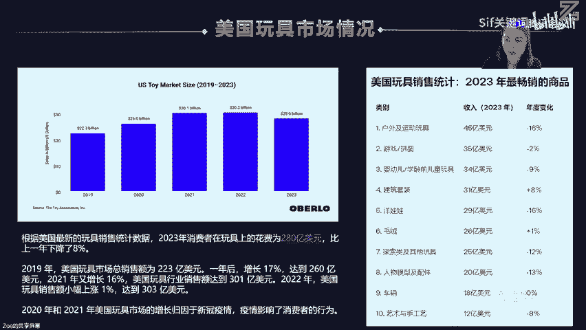

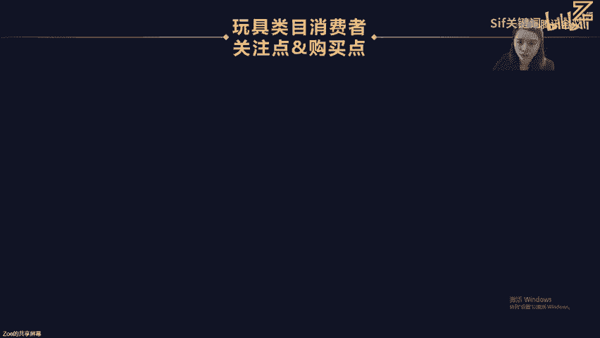

然后我们再了解一下玩具品类消费者的一些关注点和这个购买点啊。那我首首先通过这个数据来看到的话，就是说啊买家关注点，关注哪些方面啊，从四个维度。第一个考虑玩具的安全性。

是不是有些小朋友喜欢把这个尤其是1到2岁的娃，他喜欢把这些玩具送到嘴边里面咬啊亲是吧？所以说那我们首先要判断这些玩具的材质是否是无毒安全的，可以给孩子使用啊，随便送到嘴边都没有关系是吧？

不影响他们的这个身身体健康啊，然后第二个的话教育性啊是否具备这个教育的一些功能。那我们有时候可能给孩子去买一些那个认识颜色也好，数字啊、模型啊等等。就是实际上其实也是为了提高他对各方面的一些感官的认识。

还有一些呃数字的一些这个啊教育的一些啊啊影响，对不对？所以第三个就是说趣味性，也就是玩具的一个吸引力和娱乐性啊。啊，这一块其实说实话大家也也会比较那个注意，就是说呃我从单一的这个呃布偶啊摆件啊。

现在上升到这个加这个背景音乐啊，他有一些趣味性的音乐是吧？啊，有开心的，有难过的啊，有教小朋友干嘛的一些啊这个语音的一些传播来增加这一套玩具的一些吸引吸引性和娱乐性啊。

最后的话我们其实说实话还是回归买家关注的点是价格，对吧？你如果卖的太高。说实话你的趣味性即使很强，就是不一定有这么多消费者，他会去愿意为这个东西去买单啊，因为有时候其实他只要具备这个基础的一个价值。

可可能客户就直接下单买走了。他不在乎你增加了三个功能，还是5个功能，对吧？那只是能吸引一部分小众的一个消费。费者去下单啊，所以说实际上为什么那些大众款其实还是依旧很受欢迎？就因为说实话就是呃消费者。

也就是买家，其实他们的关注点也是很简单粗暴的对吧？一岁的娃他可能关注的是啥啊，他就是为了那什那那一个年龄阶段，孩子的一个关注的点去吸引下单，他不会说考虑啊，孩子2岁了怎么办？孩子3岁了怎么办？

他可能到了2岁到3岁，他又会针对性的去买一些玩具了啊。

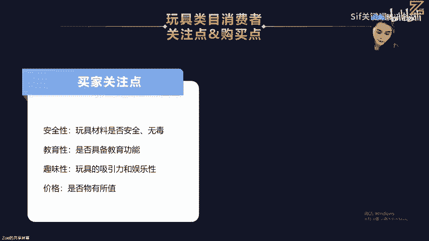

然后买家的一些购买点又是啥啊？买家的购买点可能对于这个礼物的一些需求，生日。啊，节假日啊或者是其他特殊礼场合的一些礼物，其实说实话他需求还是蛮高的，对不对？然后对于这一块。

其实说实话那个呃我们比如说那个孩子那个过10岁生日，对吧？啊，我们可能更多的作为朋友可能会送孩子，呃，呃朋友的孩子的一些那个生日礼物啊，对吧？也，然后节假日，其实说孩子呃父母买的是最多的啊。

因为他大促啊，或者是呃呃一些那个万圣节或者圣诞节需要一些节假日庆祝，所以他也会去买相应的这个礼物送给娃，尤其是这种儿童节，对吧？嗯，还有这种开学季啊等等。啊，教务需求的一些啊点才去购买。

就是儿童啊家长其实说实话这一部分的一个消费群体，其实说实话更多的是家长，也就是父母啊长辈啊去购买一些教育性的玩具，给到给到自己的子女给到自己的外孙，对吧？啊，外孙女或者是孙女或者啊孙子。

所以说他们可能更多的是做这个教育的一些需求啊，其次第三个就是娱乐的一需求那卖嗯嗯父母的话更多的是希望孩子通过这个玩具的话啊，对吧？带来一些趣味性的一些啊欢乐，就比如说我们我们也喜欢玩这些什么狼人杀呀。

是吧？那些牌棋牌的一些啊游戏，其实实际上也是能增加我们的一些啊趣味性的对吧？所以说那其实他们为孩子。买这些娱乐性的这种玩具，其实不仅仅只是作为这个网娱乐的一个性质。

它可能其实也夹杂一些教育的一个成分在里面。

好，那针对于说是。然后玩具这个品类的话，我会从这个购买者的性别以及购买者的婚姻角度，还有使用者，也就是两个人群。一个是谁买给谁来用啊，这两个啊维度去进行给大家去分析消费者的一些特点啊啊。

首先从这个性别里面啊，我把它分为两个性别，一个是男人，一个是女人。所以啊从男人这个角度，那他们会有哪些喜好，从女人这个角度他有哪些购买的喜好以及消费的一个原因，我们去需要了解。那从男人这个角度你看没有？

他更喜欢的是买一些模型的一些收藏品，或者是科技类的一些电子玩具。那这里面的模型，包括哪些。比如说动作人物的一些模型车模船模以及飞机模型，尤其做这种航空啊那个。

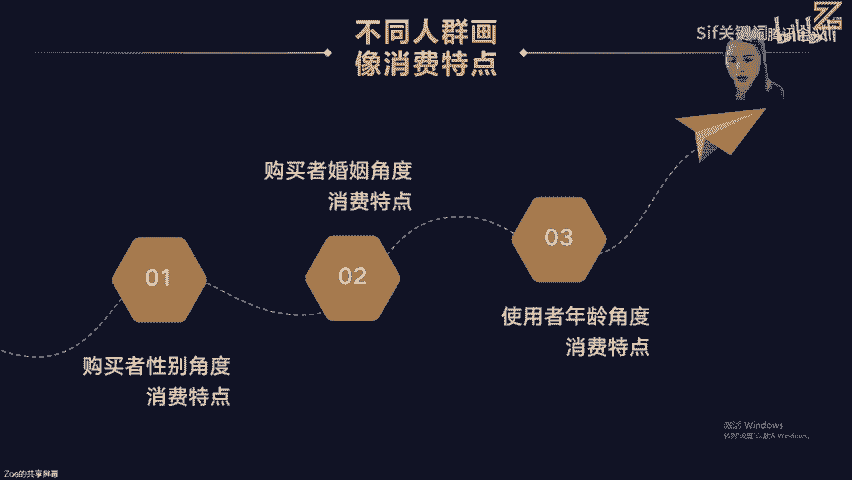

。航航天员是吧嗯，他们可能很喜欢出在家里买这些飞机的模型，作为一些摆件，各式各类的都可能有。所以说他们其实做买这些模型更多的是作为一些收藏品啊，纪念的一些啊价值，对吧？

然后比如说我们成人还可能会喜欢这种啊高技术的一些乐高的一些产品啊，对吧？啊，来开发我们的一些这个投思思考的大佬，然后科技类的这种玩具呢，就比如说无人机啊，这一块其实成人会玩的比较多，对吧？

然后啊儿童可能玩具车啊，这些会玩的比较多，还有一些就是成人类的像VR的一些设备啊，现在也挺火的，对不对？然后他都属于这种高客单价稍微比较偏高的，所以说那站在男人他买玩具的这个角度。

他的消费的一些痛点是什么？首先第一个。他是取决于他的个人的一个兴趣爱好，对不对啊？许多男性的消费者，他就是为了满足个人的爱好和兴趣，所以才会去啊下单购买。那么实际上还有一些部分的一个需求啊。刚刚我说的。

就如果我们是一个航天员，我们肯很喜欢收藏这些飞机的模型来做一个啊收藏收藏品的一些价值，对吧？还有一些社交的一些互动啊，比如说遥控车或者是。

比如说我我我跟三五个朋友一起去玩这个遥控车车的一些比赛或者啊运动类的这种玩具。比如说滑滑板是吧啊，几个人一起PK。所以这种的话，其实有利于社交的一些互动需求，那么最后一个就是家庭的娱乐。

也就是为了孩子或者家庭购买这个教育类和科技类的一些玩具来促进啊亲子之间的一些互动。那么实际上其实是说啊对于消费原因的话，这一块其实大部分的一个啊男人，他还是主要还是以这四个维度去进行购买消费。

那站在女人这种角度，我们喜欢买哪些东西啊，啊，如果我是妈妈是不是很喜欢买教育类和意智类的这种玩具给孩子用，对吧？比如说拼图啊一些手工一些玩具啊，早教类的，对吧？就以根据这个不同的年龄阶段。

我现在娃3岁了。他需要用哪些早教的玩具啊，5岁的他需要用哪些啊类型的这种玩具，我们都会去通过这种关键词去找到对应的一些产品细分。那还有就是这种啊越小的这种啊宝宝的话。

他可能对于这种毛绒玩具和娃娃他会非常感兴趣是吧？尤其是种芭比娃娃，女孩子会最喜欢了啊，那还有就是啊开发这些孩子的这个手动的一些动手能力，可能在艺术类创意类的这种产品啊，玩具的话，会购买会比较多一点啊。

对吧？然后其次的话就过啊过年过节啊，这种家庭派对的一些玩具会购买的会比较多一点。那所以说那我们作为女人作为妈妈或者是作为这个啊朋友啊，站在这个购买的这个消费者的这个原因。

更多的是思考一个教育和发展的一个问题，对吧？所以说那如果我是母亲的身份，那我可能更多的是以教育性的这种玩具去促进孩子的这个学习和发展。那如果说我是朋友的这种身份，往可能是。作为啊呃邻居家的娃。

她过生日了，或者是呃遇到这种。儿童节，那我作为这个朋友身份，我可能会买一些这个玩具去送给他啊。作为这个家庭的娱乐的话啊，我可能会买。比如说我啊家里有弟弟妹妹是吧？

我可能会作为这种姐姐的这种身份去买一些家庭娱乐的一些玩具啊，供大家去呃分享，然后其次的话还会根据这些兴趣的一些艺术类的一些兴趣去满足孩子的一些创意和艺术的一些爱好。

所以说那我们针对其实说实来从选品这个维度。那如果说我现在就是要做男人这个市场。那我是不是更多的是啊开发这两个系列的这种产品。那如果说我是以女人的这种性别角度去开发选品的话。

我可能更多把经历开发的一个选品工作啊，放在这几个啊大的这个细分市场上面，对不对？所以说那在。在这个性别上面，其实说出来也已更已经提供了一个很好的一个选品的思路给了大家。然后第二个从这个婚姻的这种角度。

然后我们去了解选品的一些方向。首先如果我是未婚的这种情况下，那我会买哪些玩具给孩子给朋友或者给我个人，对吧？那我这里列出了4个啊大的一些方向的玩具啊。

比如说科技电子类的成人类的益智类的收藏类的艺术类的创新类的等等。那我根据这四个品类，我去进行定向深挖供应链或者是细分市场。其实说实话，我们做好一个细分市场，就已经够我们去开发很多很多这种产品系列了。

对不对？所以说。然后啊那这里未婚的这种角度的话，我的消费的这个原因可能会是哪些思考维度啊？第一个，我的个人的一个娱乐啊娱乐性啊，实际上我们可能更喜欢去买一些呃就比如说成人桌游的一些产品啊，对吧？

去或者一些复杂的拼图来作为一个消遣的一些玩具的一个方式。然后第二个兴趣爱好收藏类的啊，然后第三个社交需求啊，对吧？然后。从已婚的这个选品的维度的话，我可能更多的是关注这几个啊赛道。

比如说教育类、益智类、家庭、娱乐类，还有户外运动玩具，还有毛绒玩具的一些娃娃，对吧？因为我可能更多的是作为一个已婚的妈妈，然后去选这些细分这个产品给到我的孩子，所以那我的一个消费的出发点是啥？

第一个是否能为我孩子进行这个教育性的一些问题，对吧？所以我需要买这些玩具，帮助我的孩子去学习和发展，那么第二个就是家庭这个娱乐，那我购买这个玩具的话。

更多的是这个家庭的娱乐和亲子互动的一些重要的一些工具，对不对？所以说其次就是礼物的一些需求，啊，最后就是说那我是比较鼓励孩子去户外去运动，或者是玩这些啊活动。那所以说这里的话就从婚姻的这种角度啊。

也就是购买者的婚姻的角度啊去进行选品啊，去布局我的整个呃产品的一些细分市场。

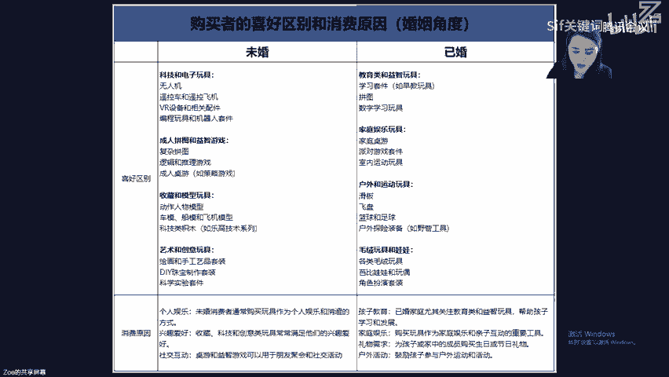

然后。好，这里的话这张图我是截图的亚马逊的啊啊BS榜当前前台展示的一些啊年龄区段的一些截图。就是说出生到二呃2岁的时候，他需要哪些玩具和啊2到4岁的娃需要什么啊玩具，5到7岁的娃需要什么？

8到13岁的以及是4岁以上的啊，他们需要哪些玩具，那这里也给大家去通过就是说这些年龄阶段啊，他们到就作为作为母亲作为父亲，他们更多的会从哪些产品细分市场去消费啊，给他提提供一些啊啊方向。

比如说我我的娃从刚出生到2岁的这个区间，我可能更多的是给他买一些婴儿的这个玩具早教的玩具搞感官类玩具是吧？安全类的。玩具，比如说婴儿座椅安全护栏等等啊。那么为什么我要买给2岁以下的这种玩具？

它我的消费的一些特点是啥？因为我关注的点是这些玩具是否有助于婴儿感官发展以及安全的问题，对吧？那我会还会去去买哪些东西，比如说牙胶、摇铃啊、软布舒或者是一些早教类的音乐和光效的玩具啊。

对吧那2到4岁的那我如果作为妈妈的话，我呃更倾向去买一些早教的一些玩具、拼图啊、积木啊、角色扮演等等啊。那这一部分的话，我可能更多关注的是孩子的认知发展和社交技能的一些完善性啊，对。

所以说我就会给他去买拼图啊，积木早教书是吧？然后还有一些其他的一些生活的一些套装啊，去培养孩子有当这种不同的职业的一些啊体验。然后5到7岁的孩子，那我可能更多的是提供什么啊。

益智类的一些玩具、互动玩具、体育用品啊、艺术手工套装啊等等啊。那我出于这个消费者的一个特点的话，更多的是思考。孩子的一个创意和社交性问题。所以我会给他买一些拼装的模型啊。

积木啊、手工类的一些科学实验性的一个套装，对吧？啊，然后如果孩子8到13岁。那我可能更多的一些啊给他买一些科技类的这种产品，还学习套装，还有一些创新类的这种玩具啊，对吧？然后因为我这里的话。

其实重点是培养孩子的一个啊兴趣啊，所以说我会买大量的这种教育意和技术含量的一些玩具给他，比如说一些编程机器人VR设备啊等等电子一些游戏设备。

或者是一些高级一点的这个积木啊啊一些什么化学类的一些套装啊等等，去供我的孩子去去去啊扩展更多的一些兴趣爱好和这个技能。啊，然后如果孩子14岁以上，我可能更多的就作为这个购买者的一个角色。

重点会去买什么电子设备或者是体育用品，对吧？还有一些书籍类的和和以他的专业的一些学习的一个工具啊。然后所以说那这里我的出发点购买的点是什么？也就是从他的娱乐性，还有收藏性，他孩子的爱好出发。

去购买一些比较匹配他这个年龄阶段需要具备的一些啊玩具啊，比如说音乐器材运动器材，对吧？然后还有人物的一些模型啊，对吧？啊，一些拼装的一些模型，或者是一些游戏机等等，来提高孩子的一些啊娱乐性的一些特点。

那啊说了这么多，那我们首先啊要了解你做这个玩具品类的一些基本的要求是吗？就刚刚我提到了，就是做玩具这个品类虽然赛道还是挺不错的，但是它很容易面临这个店铺啊被封或者是链接被下架，对吧？

所以说我们首先要了解它美国和欧洲需要哪些认证标准，对不对？然后找服务商做好这个相应的一些啊认证的一些需求啊，防止后续亚马逊审核的时候，你提供不了，然后链接被下架了。然后第二个啊，对于玩具这种品类的话。

你这个产品用于哪个链阶段你一定要在包装上面有清晰的标识，还有警告药语，这些都是必备的一些东西啊。然后其次的话包装上面啊需要啊贴一些这个避免窒息的一些啊危险标志啊等等。好。

那么我们第一趴的这个主题的话啊啊就已经分享到这里了啊，不知不觉我已经分享一个小时啊啊，大家那个对于这个市场分析玩具这个品类的话呃，有任何的这个疑问啊。

也可以去扫这个这个的话是CF的这个啊呃优惠的一个啊二维码啊，大家可以去。

啊。就如果说要领取CF的这些工具啊啊，新用户的话，可以去扫码啊，领取相关的一些福利啊。好，因为我现在讲的也比较细，所以啊刚刚讲市场这一趴的话，已经讲了一个小时。然后大家如果对对对那个感兴趣的话。

我就接接着讲第二趴或者是下一次咱们再讲第二趴都okK。对，看一下那个在场的这个观众，大家就是说对于这个第一趴的内容啊啊有什么疑问的话，也可以这个进这个啊啊福利群。对。

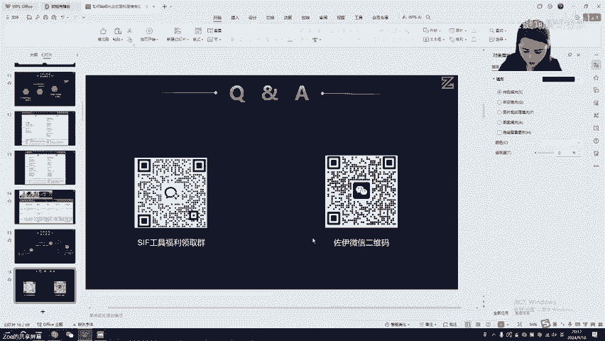

好，因为这个干货实在是太多了啊，说实话那个因为每次讲讲干货的话，每次都停不下来。こ。对，就是大家有任何的问题。还有刚刚讲的这些内容的话，就是说大家有任何疑问，到时候就继续给大家分享。对。

然后因为第一趴的话，就从这个市场端啊，带着去分析，就是说我只是以这个玩具这个品类啊，你看带着大家去分析，就是说我从这个购买者，也就是到底谁在下单，对吧？那下单之后，他给谁用。

我们去需要站在这两个角度去思考我们这个产品啊，它的一些消费者的一些痛点和他们购买的喜好啊。

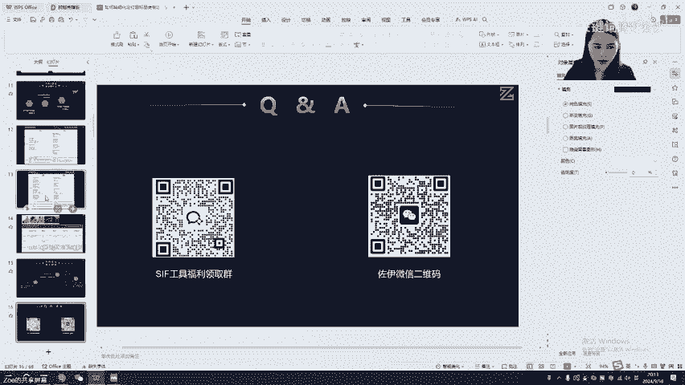

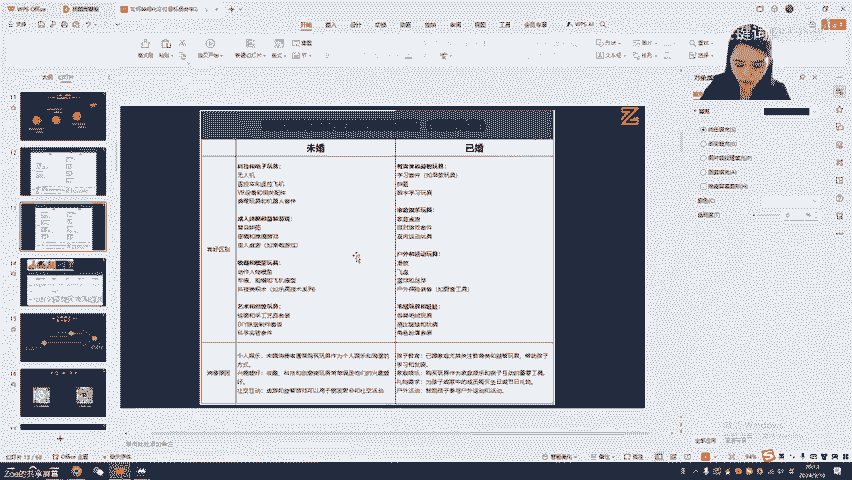

啊，这里的话从性别哈，从婚姻角度，还有从孩子这个使用者的这个维度，他们需要什么东西？我作为父母，我需要给他们买哪些东西？因为说实话作为他们1010岁以下这种年龄阶段他没有一些消费的能力，对不对？

他没有钱，所以说更多的是父母在下单啊，朋友在下单。好。好，那我们接下来讲那个第二趴内容啊，嗯大家要领取shift的这个工具的话，扫码进群。好，第二趴的话。

我们啊重重点讲这个竞营对手的定位和六大这个广告策略这个分析。那么因为说实话之前那个以前在一件实操的话，其实说实话做最多就竞这种对手的一些分析。所以说了解太多市面上的各种打法。

也见证了很多就是listing到底是怎么起来的，到底是怎么灭亡的对吧？他们的一个发展的一个轨迹。实际上其实说实话见过太多的这种案例啊。

那么首先我们我要问一下大家就是说你们听不清楚自己在做某一个细分室类的啊细分品类的时候，知道自己。对，真正的竞争对手是谁吗？啊知不知道你们自己知不知道？就比如说我要做那个玩具品类。

我就是要做这个收藏品的一些啊，比如说那个飞机模型。那这个飞机模型的话，可能它涉及的一些款式啊，销量啊啊，客单价其实都不一样。那我怎么确定谁才是我真正的竞争对手啊。啊。比如说现在现在有个问题就抛给大家。

就是说你单品的一个销量月销量只有300单。你的竞营对手月销量9000单。我想问一下大家，他是不是你的竞营直接竞争对手啊？是不是直接进行对手？😡，啊，大家可以在屏幕里面打出来啊。啊，就你一天就一天出十单。

然后你的竞争对手啊一天能出个300单，对吧？那他是不是你的竞争对手，直接竞争对手。啊。那我发现其实我问了很多人啊，其实实际上其实说实话有些人对于这个竞争对手啊，他其实意识是比较模糊的啊。

他觉得就是说大家都卖的品一样，那他肯定是我的职接竞争对手啊，对不对？那实际上其实说实话每个人其实说实话阶段不一样啊，就像刚刚有朋友打啊，打出来说他有可能上架三年了，所以他的月销量很稳，一天出300单。

我现在才刚上架，我一一天才出个十单，所以他可能不是我的职接竞对手，对不对？就是我们之间的一个差距，单量的差距实在是隔得太远了，我不可能从十单一一下子能PK到300单，对吧？

我在这里面是需要花多少的这个时间沉淀和这个推广的一个成本才能达到他这个月销量啊，我们要需要根据实际情况去核算。所以说这里的话我。大家就重点问他是不是你的直接竞争对手。

但有一些人他现阶段就只能达到300单，但但是他老是天天盯着头部BS去看啊，对对对我们来说，实际上我们是肯定是需要啊一个可以第一阶段能够达到的目标作为一个直接竞营对手。比如说你现在一个月销300单。

他的一个月月销是600单。你是不是很容易接近这一个目标值。所以实际上啊你的外观，你的价格其实说实话跟他的一个相差度并不是很大。所以说那我在第一阶段我的目标可能在600单，对不对？然后第二阶段。

过了600单，我们是不是可以定900单的一个销量目标，对吧？那如果说我现在300单到达这个900单的一个月销，那我是不是要定？啊，1200单的一个单量的一个目标。

就你的竞营对手可能也有啊1200单的或者1500单的，对不对？你不可能说直接300单杀到9000单的一个销量，对不对？也不太现实啊，肯定跟我们的一个投入产出是有很大的一个挂钩的。

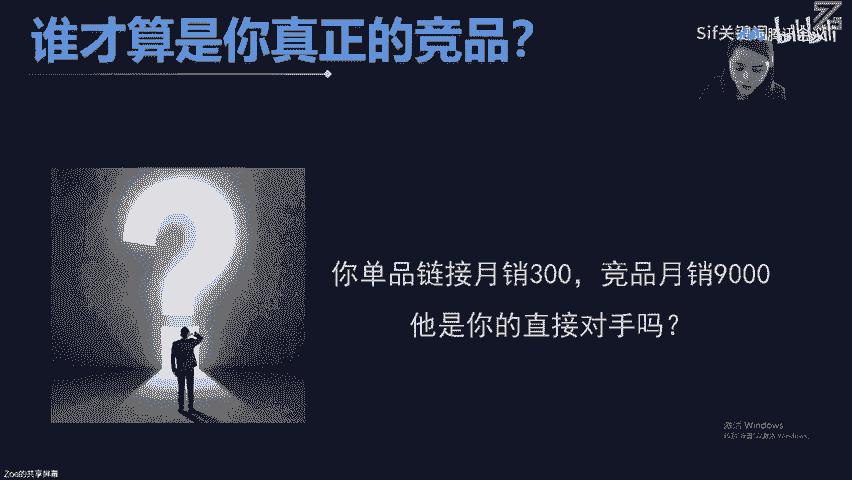

好好，那这里的话啊我就跟给大家去说一下，就是说我把啊竞争对手分为三个阶段啊，一个是直接竞品，第二个是间接竞品。第三个是一般竞品啊，那么直接竞品是什么意思呢？也就是啊这里我给他打80%的一个相似度。

那也就是它的产品的形态一致或者高度相似，什么叫形态啊啊，产品的形态啊，它是圆的还是方的还是椭圆的是吧？还是这个梯形的，还是什么圆柱形的，对不对？首先它的外观的一个形态是一致性的啊？我如果它卖圆形的。

我也是卖圆形的，并且咱们的一个差异点基本上没有。

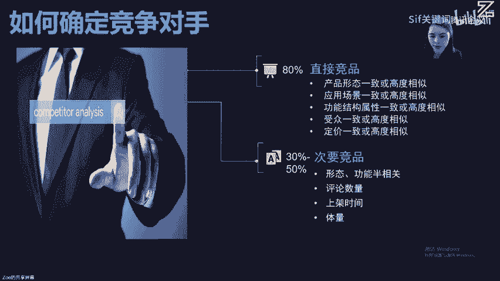

啊，然后第二个就是应用场景一致性和高度相似。应用场景指的是什么？就比如说我现在这个玩具我就是卖卧室的那我是这个卧室，我卖这种产品，那我就不能说一下跑到这个浴室里面去了啊。

所以说那我这个产品一定是一模一样的，才能证明它是我的直接竞品啊。然后嗯还有就是它的一个高度相似，这个高度相似，可能它的功能啊各方面比较单一啊，它的一个场景也是一致性的，它的形态也是一致性的对吧？

然后其次的话第三个功能结构属性一致性啊或者高度相似，功能结构属性一致性啊，比如说现在这个洋娃娃它很单一，它只有一个呃。做一个摆件的一个功能啊，但是你现在卖的是什么二合一或者三合一带这个音乐。

或者带这个啊手动感应的这种功能。它可能实际上它并不是你的经直接竞入品了。对你现在都已经升级迭代了，对吧？所以说那你它可能还处于一代的时候，你处于第三代了啊。所以说那只有在功能结构上基本上都一样啊。

才证明它的这个功能和结构属性一致性，所以。那第四个也是受众一致性。什么叫受众一致性？刚刚我在前面提到男人和女人的一些消费的价值观可能不一样，对吧？那你现在我卖的这个玩具，我比如说我卖给儿童呃的这个玩具。

可能更多的是比如说我现在卖的是那个遥控车可能这一类遥控车的话，它的受众可能更多是男孩子用啊，不适合女孩子用。那所以说他的一个受众一定要是一样子，你不能说你这个品卖的是女孩子，他那个品卖的是男孩子啊。

那你这个受众就不一致了，对不对啊？然后其其次最后一个定价一致性，什么叫定价一致性啊，也就是在前面这个产品形态应用场景功能结构以及它的一个受众人群基本上都一模一样。所以说它的价格是不是区间也不会很大。

大家都。都是卖19。9块啊，可能你定价18。99，对吧？它定价21。99，可能相差幅度不会超过3美金，对不对？基本上都啊大概一致。只是说可能有稍微有一点外观的一些啊啊产品形态。

或者是一些功能上面有一点点啊区别啊，所以说我把它列为这个直接的一个竞品。那么。次要的一个竞品指的是哪些啊啊？比如说只有30%到50%的一个啊相似度。那可能它在形态和功能上面半相关，什么叫半相关。

比如说你现在卖的是这个呃那个儿儿童用的那个垫子，是圆形的啊，儿童用的垫子是圆形的，我现在搞了个三角形的啊，在形态上面发生了啊变化，但是我的功能还是那个垫子，对吧？我就是给给孩子垫屁股的，对不对？

所以我的功能实际上我没有发生太多的一个变化，是只是我的形态上面可能发生一定变化，但是呢啊要么就是我的功能上面已经发生了这个迭代。比如说啊它只有一个单一的这个呃垫坐垫的一个功能。

那我现在可能还加了一个躺可以躺着的一个功能，对吧？它不仅仅可以坐，还能躺。对吧我在功能上面做了一些升级啊，所以说那这种也属于半相关，对吧？然后它的评论数量。评论数量啊可能也不一样啊。

有一些那个可能上万个评价，有一些可能只有三五十个评价，对吧？然后。然后但它的这个产品的形态啊，各方面还是不一样。哎，它的评价数量也是不一样。

就刚刚大家说的上架3年前上架这个品的这个评论数量跟我现在刚上架的这个啊品，它的评论数量可能相差是非常大的是吧？然后其次第四个它的体量也不一样。其实说实话不同的这样竞对手，它的体量完全是也是不一样的。

你你会发现9。99块的永远都是那种高流量高体量的这个载体。那实际上到了59美金或者是100多美金的这些玩具，它的体量有一个很大的一个差异化啊，BS可能出到这种啊9。9块能出日出签单，可能。

到了100多美金这种玩具，它的市场体量可能也就是三五十单。说实话可能top级别的，也就是能出个三五十单啊，它出不了这种几百单几百单的这个销量数据啊。所以说那所以说定价不一样。

它的一个呃形态和功能不一样啊，也是决定了它的一个啊体量啊，各方面出单情况。那最后呢就是一般竞品，一般竞品可能它的相似度可能只有10%啊，比如说我现在卖的是那个电子。

结果那个店子里面整个细分市场出现了其他的一个品类。啊，比如说那个什么有一个呃那种玩具杯啊，或者是玩具的这个呃话筒。啊，它就属于完全形态，还有功能上都不一样了，你知道吗？就完全你的应用场景都发生改变了。

你的人群可能画像也发生改变了。所以说但是它又放在同一个细分市场上面，对不对？大家应该有遇到过这种情况吧，对不对？就是只有做标品的这种啊细分市场，它可能形态和功能上面啊相似度会比较高。

但是非标品整个细分市场其实说实话各种各样子的品类它可能都会存在放在同一个类目上面啊，即使它的功能不一样，形态不一样，对吧？然后这里的话以一个案例啊啊，这个玩具车的案例来给大家去做这个。

这个这个这个分析啊，大家可以看得到，比如说我现在卖的BS这个遥控车，那大家可以找到啊，直接竞品是。第几名？啊，大家可以在屏幕里面打出来。我如果我们卖的是BS第一名的这个遥控车。嗯。然后直接竞品。

是哪几个哪几家？啊。直接竞品。职业竞品。有哪几张？啊。大家可以在屏幕上面敲数字啊，这里我摆了那个前20名啊。啊，可以，就是我我们现在卖的是BSD一名的产品，对吧？那直接竞品是哪几家？啊，可以敲数字出来。

这么难找吗？嗯嗯，职近品。职业竞品是哪几家啊？我现在卖的是这一款，我要找我的职业竞品。那我们是不是在形态功能上面去找啊啊。第三。12。15。十五是直接竞品。还有没？为什么二不是为什么五不是啊。😡，啊。

直接竞品。这里的话其实说引导大家就是说在我们在定位目标的时候，备货也好，或者是冲排名也好啊，一定要了解清楚自己的第一赛道的这个竞品，然后第二赛道的竞品，第三赛道的一个竞品。

那如果说我现在卖的是BS这款产品，这个颜色我是不是我觉得这个产品，其实我的一个消费的这个使用者就是个男孩子，而不是女孩子。你看这些颜色跟粉色大红色，它的背后的一个使用人群可能更多的是女孩子，对吧？

从人群上面我们去做一个划分，那我那我我我现在就卖给男孩子用的，结果我要对标这女孩子，那你觉得那个是我们的第一直接竞品嘛，肯定也不是吧，对不对？只是说在大的方向，从外观的这个。形态上面和功能上面。

我们可能作为第一赛道的一个职业竞品的一个关系。比如说2号、3号以及5号，还有12号，还有15号，对不对？那么这几个我们可能列为这个直接竞品。但如果说我们做市场调研和市场分析的话。

我们可能更多是分析男孩的这一块使用市场的一个情况。那么第一个第二个第三个，还有第12个啊，这几个可能作为第一竞品的一个分析。那么第二竞品分析直接竞品，但才是5号跟15号的一个产品，对不对？啊。

所以说这里的话就是说从两个概念，一个是从啊这个功能和形态上面的一个概念。第二个是属于这个应用人群的这个呃呃概念的去划分这个竞品的关系啊，对标。然后间啊间接竞品是哪几号？间接竞品。

也就是它的一个相似度只有30%到50%的一个概念。啊。哦，我刚刚已经把职竞品分出来，那这个细分市场它是不是存在有几个产品细分呢？啊，所以我们是不是还要接着继续挖掘它的间接竞品？啊，现级竞品是哪几个？

首先这个产品是遥控车。间接竞品是哪几个？这竞品是不是13号、14号啊，还有19号、20号啊。啊。它是属于水上的这种特技车啊，实际上其实说实话它由这一款啊改为这一款。或是升级为这一款。

虽然它在形态上面发生很大的变化，但它从体积的一个啊设计上，其实说实话它是可能属于间接竞品。那哪一种属于一般竞品啊，啊，那是不是这些警车，各种警车，各种赛车，对吧？啊，这种是可能就属于一般竞品了。

啊完全都不是这个遥控车的一个载体了，对不对？对，从这个体积设计上面也好，从功能的复杂性也好，它是不是都更简单了？这些警车各种类型类型的这种车啊，尤其是17号这种啊。17号的这种属于警车，也是赛车。

但它的体积上面是不是优化了很大啊，比这种啊对比起来对吧？它可能就属于这种一般竞品了。啊，所以说其实说实来这里其实传递一个概念给大家，就是我们在这个选品定位的时候也好，做这个运营计划的时候也好。

一定要分得清楚谁是咱们一级竞品二级竞品关系，三级竞品关系啊，才能很好的做这个市场的一个把握和做这些目标的一些定位啊，不要定位错了啊。对。好，那么接下来就是讲到最核心的一部分就是说。啊。

从这个6个维度啊带领大家怎么通过啊，我是怎么通过这六大维度来反推我竞对手，它是怎么把这个爆款给做起来的啊，我要去分析清楚。对，所以说那我会从流量结构，广告出单词，广告类型，广告位的竞争格局以及匹配方式。

还有广告预算啊，这六大维度去分析我的竞争对手，它是怎么起量的这个啊玩法的啊，然后首先第一个给大家展示一下这个竞争对手啊，这个竞对手的话是卖的是这个呃螃蟹的这个音乐的这个玩具啊啊。

你可以看到它之前那个啊大类是那个42啊，小类第一名在三了。啊，这个品的话上架其实说实来也不久啊，也就是啊两。两年多的一个时间，对不对？两年多的时间，但他这条listing非常稳定哦啊嗯。

这这个listing非常稳定啊，我们可以看到啊。他当时的话一个月销啊，能拿到这个将近3万单，是不是很厉害？这个卖家啊，你想都不敢想，就一个月能出个3万台的这种玩具，实际上体量是非常大了。

一般玩具我们做的BS的话，也就是一两百单啊，一两百单的一个销量数据，一个月的也也也猜得几千单而已，这种达到这种几万单的还是比较少，对不对？而且他这种玩具其实说出来也并不是很复杂啊。

但是大家有没有观察这张图片。这张图片它有哪？它标题里面有什么亮点，大家去看一下，多磨一下。啊，这个我我也很喜欢研究这种玩的比较好的这个链接啊，他们身上肯定有很多这种值得我们学习的一个点。

你可以看到从他的这个啊标题编辑的这个结构啊，实际上我一眼就能看出这个一定是一个以这种爆款维度会玩关键词埋词的这个卖家啊。首先。第一个啊con这个是它的一个品牌名，对吧？然后接着是它的一个核心推广词啊。

爬爬行的这个呃螃蟹的这个baby toy啊，然后接着又埋了一个核心的这种大词啊，肚皮的这个玩具啊，你可以看到它埋词埋的年龄阶段埋了好多次啊，3到12岁，3456789101112。

然后又埋了这个啊一个核心行业大词啊，babys toy boy。啊，然后年龄这是属于这个。呃，人群词对吧？然后3到66到12为什么他又写9到1212到18啊？因为我们去判断过他这种3到13到6也好。

6到12也好，一定是存在一定的搜索量的，所以他才这么写他的一个产品的一个规则啊，然后其次最后他又写了36个月的这个牌子。啊，音乐那个呃发展的这个呃比如说是呃生日礼物啊，对吧？

这个生日礼物是不是一个行业大词，对吧？流量非常大，它在结尾的时候又加了个行业大词，所以它整个标题的打造来说，其实说实话是非常注重埋词的，而且很有埋词的规律啊，所以说你可看到一些爆款。

其实说实话它不是说一下子真的就是运气好就起来了。它是一定有节奏有规律的去布局它整个页面的关系啊，所以说这里的话大家可以了解到，其实可以，然后为什么它这里面加一个杠杆。其实说实话。

因为我们也是做重精品爆款为维度出身的，所以它加重种杠杆的话，一定是为了加权它前面几个核心词的一个推广啊。然后我们再来看一下它的一个整个推广的一个结构图。你可以看得到啊，它整个的一个推广。

你啊这个这个这条绿色的话是它整个的一个大类排名的一个趋势，你可以看到啊基本上是非常稳定的一条一条直线啊，你看不到它是这种波荡起伏的啊节奏节节奏图。所以你可以看到它其实整个推广其实非常稳定。这个卖家啊。

非常稳定还有就是你可以看到它的一个定价策略是前面是不是啊稍微会丰富一点啊，我们了解到它其实说实来一开始上架的时候啊，要么就是投入大量的这种广话费，要么就是做站站外的一个推广啊。

先低价啊去推一波啊后起量之后再把这个为马上这库存又务不够用啊，所以一直涨一直涨啊从。16美金啊，涨到这个20美金，再从20美金又涨到20多美金啊，只最高峰的时候涨到35美金了啊，然后等库存一到货的时候。

又开始慢慢降价啊，最后的保持到这个19。99啊，就基本上就没有太多的一个价格的一个变化。前期的话你可以看到它前前几个月前半年它可能价格还是变动会比较大一点了，对吧？然后你可以从它的这个趋势里面可以看到。

其实他还有做了哪些动作啊，做了多次BD和LD的一个交互关系啊，你可以看到，实际上那现在其实说说我们上这一个新品的话，容不容易获取这个ALD跟BD的一个推荐啊啊，大家都是怎么去玩这个免免秒的啊，有没有。

有有没有玩过Wot的啊，有玩过，可以扣个一啊啊。实际上有以前的话，我们可以找这个服务商去用这个呃这个什么P比不年秒什么之类的，对吧？成本又低啊，那现在基本上也很难去玩这些东西啊。

因为说说很容易被啊关小黑屋是吧？可能面临着这个申诉啊，店铺也会有一定的风险，所以我们大部分呢现在都在玩Wot秒杀，Wot的话是可以啊年秒20多天啊。

所以说实际上这种对我们新品前期的一个推广其实有很大的一个啊啊推不住澜的一个作用啊。嗯，所以我们啊现在基本上也是用的比较多woot啊。然后。然后我们先要了解一下啊广告流量的一个分析结构啊。

也是我们通过这个通过这个第三方的一个工具，我们可以看到啊，就搜索流和关联流的一个区别。那我们通过这种第三方工具可以看到它的一个免费关联流才2%，它的一个付费关联能达到60%多。那我们可以看到。

其实说这条listing。其实它它它更多的是通过这个广告啊，做一个起量的一个啊节奏，对不对啊，很少有关联流的一个推荐，是不是？然后我们再来看一下。第二个就是说我通过这个流量的一个结构分析啊。

我想分析的是啥？流量词的一个类型的一个数量啊，这里的话我用的是CF的一个呃。嗯。流量结构的一个收入。我的就比如说我刚反查那个BS那个A呢啊，用的是最多的。

就是那你可以反查它的这个A来来看得到它的流量词的一个集中度是啥啊啊，通过这些的一个类型筛选和效果。分那个筛选，我把这个整个的表格啊进行下载下来，我能获取到。你看我这里。

我能获取到反查它它这个反查出来有1548个关键词，但你可以看到它的一个精准长尾词占到了157个啊，精准的流量词才40个。然后主核心词才4个。那通过这个数据，我可以反推什么样子的结果。也就是这个非标品。

它大部分的一个出单来源基本上都是长尾词，而不是一些流量大词啊。啊，我们可以看到。所以说那如果我在打造整个的这个产品的时候，我是不是会有节奏，有策略的去布局我的长尾词啊，对吧？

所以说这里的话我可能更多的是布局肠尾词的一个策略，而会降低我的一个流量词和核心词的一个啊预算投入啊，就是通过这个竞争对手，我可以把我的这个关键词的一个策略啊，放在放在一级次还是二级词还是三级词，四级次。

那结果啊表明我应该放在三四级词上面，啊不是一二级词啊。然后第二个啊广告的流量的一个分析结构，我我会去反查这个关键词上首页的数量和质量啊。那比如说我刚刚反查是有1548个关键词啊，下载下来。

那上了首页的这一部分词能达到多少个啊。这里的话我通过1548个词里面反查出来上首页的啊，能达到这种至少啊200个词。那这200个词全都在首页前48位。啊，我通过这种筛选项，通过这自然排位去筛选。

我输入第一页，我反查出来这么多。啊，词，然后所以这一部分的词，那对于我们来说很有参考意义。为什么啊？因为这部分上首页词决定了出单的一个效果啊，我们要了解竞应对手他这上首页的词有哪些，并且出在哪些词上面。

我能不能在第一时间把这些自然上首页的词，在第一时间把它推到首页，并且稳定在前48位。啊，这有利于我们去啊快速获取目标的一个订单。然后第二个啊，我通过这个关键词的一个上手页的数量。

我还要去判断它的关键词的质量，这个质量怎么去判断？啊，也就是观察他在每一个月份从22年8月份上架的时候，它的AC标获取的一个情况啊，我可以判断它的关键词的一个质量。那你可以看到这个品的话。

它从8月份上架，实际上其实在第一个月的时候，它没有任何的AC标推荐词到了第2个月它有一个词，到了第三个月，它有十几个AC词啊，到了11月份第4个月，它有60个AC标的词到了12月份第5个月。

它有100个AC标的词啊，然后到了第6个月。它又降到50多个啊的AC标。为什么它从112月份都在增长，到了1月份都下滑呢？因为它已经过了这个旺季，所以它的AC标也失去了一部分啊。

所以它单量也会下下滑下降啊，然后到了2月份你可以看到它又涨了十几个啊，AC标到了3月份它直接AC标都掉掉掉了几十个了，掉了40多个啊，为什么啊可能这部分就是它的一个淡季来了啊，淡季来了。

所以说它AC标它的一个波动性很大啊，也就意味着它的流量啊，其实进出也波动也会比较大。你看到它刚开始上架的时候，它的一个流量词只有400多个，到第二个月800多个，对吧？第3个月1000多个。

112月份尤其是1月份。它的流量是进出是比较大的那可能他获取还有其他的一些流量啊，因为我这只截了这一部分的一个流量词啊，我们重点是观察AC标的一个获取的数量和哪些AC标。大家知不知道AC标怎么获取啊？

是不是你你的订单达到了一定的转化和这个出单的一个积累，他才可能去获取AC标的一个啊。A标的一个标志。所以说实际上S标对一个卖家来说重不重要。实际上你可能一些肠位词获取S标，它没有多大的一个效果。

但是你有当你有50个100个S标的时候，它的订单就会源源不断的做一个积累啊，做一个加法嗯。所以说这里我就看看中的是自然关键词，它上首页有多少个关键词上首页，并且是哪些关键词啊。

并且它有没有获取AC标AC标的数量大概有多少？我比较关心的是这些问题。啊，然后其次的话我通过啊C的这个反查啊副子体的这个功能，我来了解到它的自然占比和广告占比的一个情况。

是不是也有助于我知道这个这个产品是属于标品还是非标啊。你可以看到这个非标。你看它的核心出单词。第一个是爬行啊螃蟹这个婴儿玩具。它的一个啊自然占比这个词的话只占比了7%，大部分都是来源于广告一个投放啊。

20%。但它推荐流也达到了12%啊，我们可以通过这个自然单和广告流量的一个占比来判断它这个词有没有投入广告啊，还是只只只是这个自然的一个流量啊，对吧？你看它前面前三个词基本上就只有第一个词。

它是打了广告。第二个词实际上它们。没有广告的一个成分，看到没有？都是00。然后第四个词它有打广告，你看到没？占比1%，然后第五个词它的占比只有7%，第六个词占比7%啊，我们可以了解到。

只有第二个词这个大词，这个行业大词。这两个词它都没有投入这个广告啊，全都是靠自然流，看到没有？它自然流能达到第一页，第26位啊，这个更厉害，直接是这个大词的那个第一页第一个啊，很厉害。啊。

这个ABA排名都能达到9000啊啊，也算是一个核心的一个核心词了。那这个baby toys能达到当时的这个ABA排名2000多，是不是很大的词，他能够上首页非常了不起啊，对吧？

所以说为什么他能获取BS的一个销量的一个情况？就是因为他cover住了这些核心大词啊。然后这里的话啊，我为什么要看它这个产品的一个整整个的一个历史的一个投放过程呢？啊。

我也了解他在嗯从上架8月份22年上架的8月份开始投入的这个广告预算啊，绿色的这个绿色浅绿色代表它的广告的一个投入。它的一个增长情况。那可以看到，其实他刚上架的时候，广告的一个投入其实并不是非常多。

是不是你看到没有？其实他前面都不会投入太多的一个那个广告是因为它前期可能通过站外啊，拉订单的这个手段去在啊在在投。然后其实实际上它在1月份，你看它的广告的一个占比是要比较高的。其实是。9月份到12月份。

它的投入也会比较大，你看到没有？对吧？因为到年底的时候，它的广告的支支出实际上是啊投入很大的。然后你可以看到它其实在24年的一个整个的广告的投入，其实要比22年和23年要大很多。

那可能是因为他要守住它这个坑位啊，要应付很多竞争对手。因为有同类级别的这种产品进入这个市场了。所以它迫不及的。破。没办法啊，他要多加入他的一个广告的一个投入，去稳住他的一个排名和单量。

然后嗯这里的话啊我还要嗯通过这个数据图啊，柱状图我还不够，我可能还要看它的整个的一个历史的一个图放轨迹啊。这里的话你看可以看到从8月份上架的时候，它整个的一个全部流量啊，我要了解清楚。

到底它是从自然流和广告流还是品牌流，还是视频流，还是AC还或是其他的词来。来达到这他每一个月份的这个流流量的一个载体。我要我要发现。他们的一个啊投入流量的一个规律。那你可以看到8月份的时候。

实际上他其实也有打这个广告啊，打的最厉害的时候是1月份，1月份，你看到他的数据达到1336条啊，但是到了到了到了2月份，你看一下降到173。那你可以看到实际上它其实在1月份到第2月份的时候。

它降了很大的广告占比啊，所以它的数据样本发生了很大的一个变化。还有就是。然后其次的话，你看9月份它的数据样本也是比较大的对吧？啊，9月份才1276，然后到了10月份的时候，它啊涨到了2301。

个这个广告的一个数据。然后到112月份的话，最高峰的时候，投到了3000多条这个广告数据。大可以看得到他在23年11月份其实投入了大量的广告的一个花费啊情况，对不对？

从从这9月份开始目慢慢慢慢啊增长到这个12月份好，到了旺季过后，他1月份就又开始降低它的广告的一个投入了啊，对吧？然后你可以看到他到67月份的时候，基本上啊7月份可能是他的一个淡季是吧？

所以他的这个广告的一个投入也收缩了很多，那你看他每一次的一个啊流量的一个布局，实际上都是根据它这个产品的一个特点。淡旺季的一个特点去做一个啊流量的一个布局，对不对？

可能还有就是他自然流量的这一块的一个增长，实际跟他的广告是息息相关的，还有就是他有没有做站外的一些。策略如果他做了站外，他的数据波动会比较大啊，波动会比较大。你可以看到他这224年1月份的。

它这个啊自然流和12月份它的波动是比较大的啊，一个是应季的时候啊，所以忘季带动了它这个自然流的一个增长，对不对？啊，然后我们再看一下，其实实际上他在122年8月份上架的时候，基本上都没有打过SB广告啊。

看到没有？对吧？视频广告都是在中间中间这个3月份23年3月份开始才增加了这个视频SBV的一个广告的一个投户啊嗯。嗯。好，那其次我们再通过这个广告活动的一个类型啊，去来判断这个产品。

它竞争对手他打了哪些的广告类型，到底打了SPSBV还是SB还是SD是吧？那我们从通过shift这个工具的话，是简单只能。看到他打了这个SP广告，对不对？然后SP广告他是都没有打过的，你看到没有？

数据都是零，对吧？没有一条数据，我们可以看到这个卖家的话，他重点就只投SP广告，对不对啊？然后我去看他SD其实他也没打，所以他的其实也比较简单，他就聚焦打SP啊，其他类型他都不打啊。

所以说我们通过他这个功能就可以反常见对手，他打了哪些广告类型。然后实际上然后我们也可以去通过从它上架的第一个月是吧，第一周或者每一周来判断他投了哪些匹配方式。那你看这个截图的话，基本上都没有任何的原点。

那。很可能他可能就只打了一个啊呃打了一个精准，或者是根本就没怎么投入他的一个广告的一个啊策略的一个情况。因为他的原点越小，那说明他的词并没有扩散的很大，所以他更可能是手动的一些精准广告啊，在维持，对吧？

所以说我去反查他2年刚上架的时候，8月份打了哪些广告词啊，一个个去下载，我就发现他可能刚上架的时候，确实他没有花太多的一个啊精力在这个广告的一个投放上更更多的是在通过站外的这个渠道去拉订单啊。

然后这里啊我们可以看到。嗯。等一下。啊，这里的话我。广告组下面的这个我点开看啊，这里的关键词有40多个。那每一个关键词实际上你可以看到它这里的话我是随便点了一个原点，点开之后。

我发现这里面词其实说实话参差不齐啊，都你看有什么废雪价格，还有什么仙人掌，什么那个坐立椅啊，什么AC的这个鼠标，各种啊，其实跟这个产品卖的，不完全不一样啊，非常杂。

那我们可以判断这个绝对是一个自动广告匹配出来的一个啊关键词，是不是我都没有看到一些核心的跟我这个产品挂钩的一些啊产品词。我手动的话，我可能不会去打这些完全不相关的关键词，是不是？

所以说可以判断这个广告组4BBB在223年5月份到6月份这一个月它的一个就。是投投的是自动广告的一个特点啊。然后这里的话，你看我们可以通过有一些广告组，你看它原点是非常大的啊，这圆点是代表什么意思？

这圆点这么大，为什么啊？可能是因为你看那就是我们手动打了广泛或者匹那个词组匹配，实际上啊。这个关键词拓散能力是不是很很强大是吧？所以说他这个说实话，你如果投放了5个词，打了广泛。

实际上它可能会拓展460446个啊搜索词出来。它这个搜索词数量不是我们的一个投放词数量，是客户搜索词数量啊。啊，所以说这里大家要注意点，所以你看它这个圆点这么大啊，是有可能我打了ABC这个广泛词。

它拓展了400多条数据出来啊，说明它这个是一个啊。手动的这个广泛组匹配方式或者是词组匹配方式。因为没有点进去啊，要具体看它这个报告下载下来的这个关键词的特点。

我们在二次确认它到底是打的打的开的是自动广告，还是这个广泛的匹配方式还是词组的匹配方式，对不对啊，什么是属于广泛的匹配方式，它是不是错综无序词，也就是我打AB词的时候，它可以出ACDABC啊CAD对吧？

然后可能还会出现这种啊近义词的一些特点，那我们可肯定可以判断它就是广泛匹配嘛，对不对？那什么情况我方分析它就是打的词组匹配词组匹配有哪些特点，它是不是前后加词，有序的在跑词啊？

我们叫它有序啊关键词的一个啊特点，也就是我打。AB它可以在前后去加词或者是。啊，后加词后缀加词或者前缀加词，它一定有它的一个规则。这个关键词的一个规则特点啊，它不会说像广泛一样啊，错综无杂，中间又加词。

对吧？啊，所以它词与词之间会有一定的这个特点啊。然后这里的话啊给大家展示的是那个啊，我通过这个玩具这个产品ason，你可以看到我查它的广告词的一个占比的一个情况。这个产品它的核心的出单词。

就是这个爬行婴儿玩具，其次就是婴儿蟹玩具，还有这个爬行螃蟹，你可以看到它核心出单词，实际上它的高转化词就是围绕螃蟹这个词的一个词属性去做一个拓词，对不对。啊，它的核心词这个能占到20%的一个啊流量占比。

说明基本上它整个listing出单词全都是靠这个词啊为主导啊，其次再是一些啊一些它的一个中长位词啊，关于这个螃蟹这一块的一个词属性的中长位词。啊，那你可以看到通过呃这些有曝光的广告活动，我们去反推。

就是这一个词和这个词可能这个卖家在5个广告活动都投放了这个词就是有叠加，有叠词的这个情况就是重复投放的一个情况，那这个词它只可能在三个广告活动去去投放了啊，但是这两个词它有在5个广告活动去曝光啊。

这个词啊只在4个广告活动去曝光。那说明这个卖家他有一个习惯性啊，他喜欢打一些重复性的词，他不一定很好的把一些词规避啊，到位的。有一些我们可能打了A这个广关关键词，在A这个广告活动下面投放。

可能打B的时候，我同同样投放同一个关键词的时候，我可能会啊词组否定，对吧？啊，或者是精准否定。啊，防止他在B的广告活动下面继续又跑出A这个关键词了，对不对？然后其次我们在这个广告出单词啊也会进行分析啊。

也就是用CF的这个反查流量词的这个反查这个子体的这个功能。我们可以看到就是说这个产品的这个A的话，它的一个主出单词啊。第一个就是爬行的这个婴儿玩具，对吧？第二个是婴儿玩具。

第三个是这个他啪时间的这个玩具这个关键词啊，占了前三名那我们可以看到它整个的一个关键词，自然关键词和广告关键词的一个排名的一个趋势啊，历史排名的一个趋趋势。

也就是它它的这个自然位啊是稳步的在上升还是在下滑的一个趋势啊。你可以通过这种方式来了解它关键词的稳定性，就是自然关键词的稳定性和广告关键词的一个排名稳定性啊。如果证明它的稳定性这个系统抓取的数据越多啊。

并且它的这个趋势越OK。那证明它这个词对于它整个list来说是非常稳的啊，我们可以看出它这个词的话稳定性会比较强。那样这个自然排名你看到没有？它稳定性会非常强，基本上。啊，都能。

但是你看可以看到它没有任何的广告，广告的一个就是橙色的一个曲线啊，广告是橙色的曲线。这个绿色是代表它的自然的一个波动的一个曲线。啊，你可以看到这个呃time time的 twice。

它的一个趋势基本上都是啊非常平稳的对吧？然后中间是有有有有有数据波动的一个非常大的一个情况啊。啊，所以说我们通过它的出单词的一个特点来倒推它的一个自然跟广告关键词的一个稳定性啊。

然后其次广告位的一个竞争对手的一个格局分析啊，我这里的话习惯性会把一些重点的竞争对手添加到我自己的这个。我不仅仅看我自己的这个关键词排名我还盯着竞营对手了。我看一下他的这个关键词稳不稳。

就出单的核心关键词前三名的对吧？第一名的第二名第三名，那这三名的头部的这个关键词，我就看他每天看一下他关键词有没有跌，如果跌了他的大类排名发生变化，它的单量小类发生变化，我就知道哦。

他是因为哪一个核心大词下滑了，导致他单量下滑了。啊，对不对？所以说。所以说那我我我会通过这种方式不仅仅监控我C的这个关键词排名，我还监控我竞对手的关键词来反推它的一个下滑的一个趋势。

是由于哪一个关键词带动下来的哦。然后这里的话我还会通过啊CF的这个产品时光机去了解我关键词的一个热度趋势一个分析。那大家其实说实话ABA排名是不是亚马逊的这个官方的一个数据。

所以说啊我可能不相信有一些关键词的一些那个搜索搜索量的一个趋势。但是我一定相信ABA的这个排名。所以这这个啊我搜的是它的主核心出单词啊，它的这个爬行玩具的这个核心出单词。

它这个蓝色的就是它的一个ABA的一个整整两年的一个数据，你可以看到从22年7月份，这个ABA排名它的话，就比如说是在10万10万，对吧？然后在。最高峰的时候，也就是达到了15万的1个ABA的一个收度。

啊，对吧？所以说我们通过这种方式来看它整两年的一个趋势到底是下滑还是上升的一个趋势啊，可以掌控这个词的一个方向感啊，根据它这个搜索热度的一个趋势，我们到时候去重点去管察我们的一个主出单词。

比如说现在这个词跌的很厉害，从十几万ABA的这个呃呃搜索排名，现在都跌到5100啊。100万了，那我们是不是要改我们的主推词的策略？可能从他之前是主出单词是第一名。那我现在要推第二个关键词啊。

因为第二个词它可能它的热度和趋势一直都是上升的一个啊情况，所以我我会去更改我的这个主出单词的一个策略的一个玩法，对不对？嗯。然后你看我现在第二个出单词是baby toys，你看它整个的一个速求量。

他的1个ABA排名是不是一直啊都在上升，对吧？从这个呃400搜索量啊，一直到这个到多少。到这个。20到30万区间啊啊ABA排名是属于3万。啊，2万多。对，然后他最高峰的时候可能在1万。1万。啊。

所以说我们通过这种方式的话啊，可以了了了解一下ABA它整个的一个啊搜索热度的一些影响啊，对不对？来了解整个的一个行业的一个情况。就是说这个词它可能在年底112月份的时候，会有大大量的这个啊搜索量情况啊。

实际上它如果说它的ABA排名越靠前的话，它是不是代表它的背后的一个流量就越大呀，对吧？所以说如果ABA排名越来越靠前，那证明这个词，它它现在流量是非常ok的啊，所以说如果说前面那个词，现在在走下坡路了。

对吧？那我可能我的产品的一个广告的重点或者自然排名的一个推广重点就改为第二个词，啊，这里就有有有有方法有策略的帮助我们提升。就是下。的这个单量和整个市场的下滑的单量的一个情况去做一个补救措施。

然后其次的话，广告位的一个竞争的一个格局分析。那这里可以看到啊。广告词的这个我这里搜索的是还是这个呃，比如说baby toys这个啊词搜出来展示在前台展示的啊，广告位你可以看到呃我这圈出来的。

是不是都是一些新品啊，是不是都是一些新品，那代表什么意思，就代表我打baby toys这个广告词的时候，基本上没有多少人去跟我竞争了，很容易新品上首页，当我打这个核心词这个攀攀爬这个玩具的时候。

我发现基本上啊都是一些老品？啊，比如说我现在以这种玩玩玩具车为案例，我发现搜这个玩具枪remote control car这个词核心词，我发现搜出来全都是老品，基本上没有什么新品啊，那证明什么意思？

证明我在打这些核心关键词的广告位的时候，竞争非常大。我可能需要花到4五美金，我才能抢到这个头部的位置，并且我没有任何的优势，全都是老品占在空位但是我打baby toys的时候，我发现我花了0。75美金。

我就可以上首页头部前四个位置。啊，所以说这里的话是不是证明我们是不是很容易从这些。流量大次，反而其实很容易上首页，反而那些核心词很难卷卷得过你的竞争对手，而且付出的这个CPC的成本也很高啊。

所以说这里的话就是对比告诉大家，就是说从关键词的一个性价比和这个CBC的一个竞争格局的时候，我们可以选择一些比较好拿捏的这个啊关键词去进行同步投放啊，测试它的一个真实转化率。啊。

如果你的竞争对手长期都霸占这个头部前四个位置，那说明要么这个位置对他来说很重要去决定了非常大的一个单量的一个突破的一个情况，对吧？至少这个位置对它的转化是比较O的，对不对？

然后呃广告位的一个竞争的一个格局分析。那这里的话可以看到啊，我呃我打开竞争对手bas了的这个竞争对手页面，我发现这里的话啊58页，全都是这些关联位啊，这里都有35页。

那这里的其实说说详细页面竞对手的这个页面基数如果越大，实际上我们竞争越大啊，说明这个关联位都有上百上百页，那你的竞争对手就越来越多。如果说这个只有啊10页20页，那你的竞争对手实际上也是比较少的啊。啊。

所以说这里就是啊关联业的经营对手的一个分析啊，系数越小越好啊。然后这里的话就是告诉大家，如果啊我想要了解我的经营对手这个卖家该 send的时候，我要搜他的主出单词，我我每个时间段都去搜一次。

我发现他24小时都有这个预算都大坑在这个位置，那说明他的广告预算是不是非常充足啊。啊，那如果我发现我每个小时去搜的时候，每一次啊跑出来的竞争对手啊啊都不一样，或者是呃有换掉其他的这个新的竞争对手。

那我可以排查。就是说这个竞争对手他可能广告预算，他只够花6个小时啊，但是有一些竞争对手他可能这个这个坑位要站站10个小时，或者站14个小时，对吧？那所以说只有你经常去前台去看广告位的时候，你才能反查。

就是说有这个直觉啊啊哪个竞争对手，他一直就站在这个呃毛坑上面啊，是吧？所以说我们也可以看得出来。就是如果他一直都站在这个坑位的话，我们根本就没有任何的一个竞。就是可以去进去去勾一点流量的这个机会啊来。

因为说实话他广告预算又比我充足，而且它CBC的一个权重也比我高。所以他我可能要出到4美金才能抢走他这个位置，可能他两美金就能做到这个位置。而且啊24小时的这个投放。

我可能最多也就是占6个小时或者3个小时的这个空位。所以说我要分析我竞对手在他的一些主出单词的时候，他的一个投放时长啊，去了解他背后的这个预算的一个实力。啊，然后还有一个啊C的话。

它今年还出了一个新的一个功能，也就是查这个CPC的一个竞价啊，我们可以看看到啊这里为什么我还把亚马逊后台的这个啊数据搬出来啊，同样我要把这个它的主出单词。

这个盘爬的这个baby toys放到这个亚马逊的后台啊，这个的话。啊，我是以这个只降低和啊固定的这个模式去反查出来它的CPC啊，也就是1。1。21到1。27。然后我用C这一个的话，你看广泛它的推荐呃。

只降低跟固定的话，1。47实际上相差并不是很大。这个的话我是用的动态啊，提高与降低的一个策略反查推的话，它达到了2美金啊，一次点击。然后你看到C的这个提高与降低的话，啊，它是去到了多少。啊，去到了1。

25到1。4啊，对不对？然后实际上其实说出来也就是2美金左右，对不对啊？对，精准的话就上到2美金左右啊，对不对？嗯，但广泛和词组的话其实相对于差不多啊，我们可能更多的是取最小的值和最大的值。

或者取一个平均值。只要它偏差不是非常大啊，我们都可以用这些数据去做一个参考啊，没必要说啊一定要非常精准，你才能用它就我们只是说通过这个词去反推，我在打哪一种匹配方式的时候，它的性价比更高啊，对吧？

那这里的话我们可以看到打精准的话，它的它的性价比更高啊，打固定或者只降低的模式，它只要1。21啊，但是你打广泛和词组的话，它要去到1。27对吧？啊后广泛的话，你看啊，它只降低的话1。47啊，对吧？

打精准的话，它这个词的话啊会更贵一点。因为这个词是。啊，baby music toys放在这个类幕节点，对吧？啊，所以说我如果说我现在还没有上架这个产品的时候，我现在就是做1个CBC的预估。

我是不是可以用shift的这个查关键词的这个竞价去做一个评估啊，对不对？所以说我只要算的它1。5上下幅度啊，在1。5左右就O了。我去做这个广告的一个预算测算啊。

然后这里的话你看我还把它的这个因为它这普的话还有一个这个下载的一个功能。我可以把我想要的这个关键词先对手啊放放进去，我可以看到它在不同的这个竞价的一个方式上面，它的最低的一个出价最高的一个出价。

那我红色的就是啊精准匹配值降低啊，以及提高与降低的这个CPC的一个区间，基本上啊这个盘爬是不是1。5到2。5左右，它的最高CPC啊，一个区间。但是它词组的话啊能达到1。7到2。5之间啊。

然后广泛的话是1。63到2。5区间。那我这样子我就算出一个大概的一个关键词的一个CPC的一个。

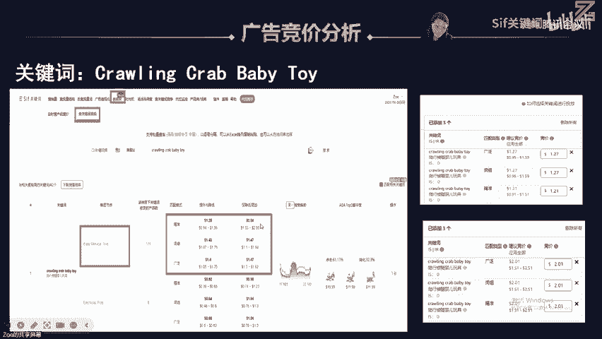

区间了。那我通过这种对比，我就发现哪一个词在在哪一个匹配方式，它性价比更高，那我就选哪哪一种匹配方式，对不对？其实这种也可以很好的帮我们去做一个匹配方式的一个筛选啊，你可以看到啊它的点击和转化。

这里的话我还做了一个这个增加了一个啊关系，就是说我通过这个点击转化，我可以去看到哪一个词在打嗯就是它的一个竞争环境会更友好一点。你看baby twice跟那个te time twice。

它的一个点击和转化实际上是啊比较低的，说明这两个词实际上可能是核心大词，对吧？是属于这个泛流量的大词，所以它点点点击很低，后它转化也很低啊，所以说它CBC有可能它获客成本啊。会比较便宜一点。

你看它在精准上面其实比较便宜的啊，这个time twice的话才0。8左右，打精准打广泛打那个精准的话才1。04。你反而你打词组也好，打广泛也好，你看你的CBC要比这个打精准还要贵，是不是？

所以说从这个关键词性价比上面，我可能更多的打这种像这种热门的这种大词，可能更多是打这个精准了，对不对？如果打广泛和词组，它拓s能力虽然很强，但是不署的代价也更高，很贵呀，你看到没有？

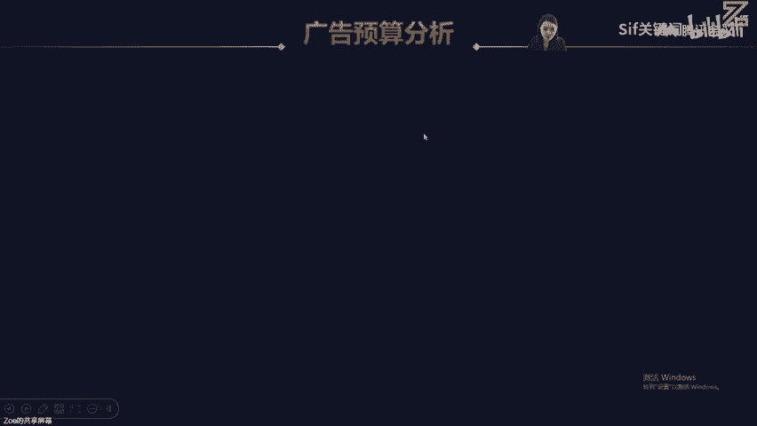

然后最后呢我就帮大家去算一笔账，算什么账。就我分析这个BBS链接的话，它到底一天啊要出这么多单，它一天要投入多少钱首先它客单价卖19。99啊，一个月销229794台，它平均的话，一天最高峰的时候。

一天能日出签单啊，那这个自然占比跟广告占比我是怎么来的啊，也就是通过C的这个自然单和广告单的一个整体的一个流量占比啊，去推算它啊啊然后然后再去根据它的占比啊，乘以它的销量啊。

去做一个这个销量的一个预估啊，自然单的话能去去到七八百单。然后它的广告订单实际上其实是比较低的啊，平均的CBC怎么算来的，就我这个品没有做之前，我不知道CBC大概多少？那我是不是可以通过CF的。

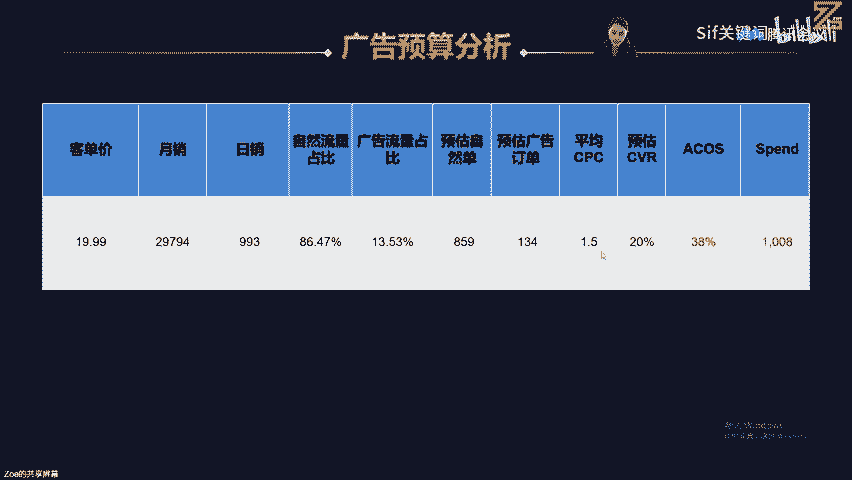

这个CBC去做一个平均值，对吧？我现在不卡首页，我就以这个平均的一个价格，我就按1。5去进行计算就好了，对不对？然后我的转化率怎么去算，那我因为我们以前做过这个玩具品类。

所以我觉得那个啊相对比较O的这个转化率，广告转化率基本上都能达到20%左右啊，对不对？那如果说我的这个广告转化率实在很差劲，那你也可以啊呃取的比较低一点，实际上人家都BS了。

所以它的广告转化率一定不会说太低啊，20%都已经相对比较保守了，对不对？

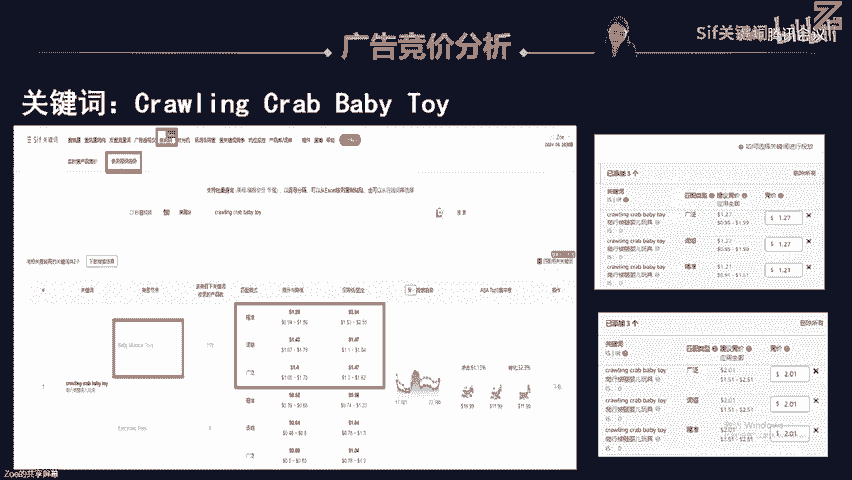

啊，这个自然单和广告单这个怎么看啊？这个是我根据这个C的这个自然和广告订单的一个占比啊去取得这个值来倒推的啊啊倒推的，所以它A那我都算出来它的平均CBC和啊预估的一个转化率，我是不是可以算出它的A啊。

那A的这个啊是什么意思啊？就广告花费除以它的广告带来的这个总销售额嘛，对不对？所以说那我知道这些啊那已知它的CBC也知道啊大概的这个单量的一个情况和这个客单价，那我是不是可以倒推出来它的A，对不对啊。

然后呃然后你看到我最后算出来这个listing啊爆款ba send的第一名，他一天啊高峰期的时候要出到这么多单，他可能一天要花1000美金。你可能看了他投入的这个预算还是挺高的。

实际上人家人家出这么多单，说实话啊，其实。它的整个花费占比其实也并不是很高啊，所以说他的广告花费，那我是怎么算出来，是不是通过它A乘以它的总的一个销售额，对不对啊？啊，那我还可以通过它的这个整个的A。

还有它的广告订单，乘以它的客单价去倒推它的广告的总个预算的一个支出啊，所以说你要做到人家这条BS的一个销量啊，它的它整个的一个它的一个自然和广告单的一个占比分配，以及它的一个啊CC的一个预估。

还有它的一个整体的广告的转化率，我们是不是都要有一定的了解，你才能去大概的推算出来它整个listing，大概要要要投入多少钱，才能做到这个数据啊，对不对？

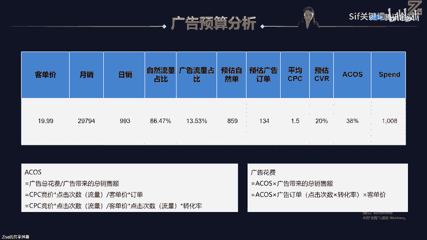

嗯。好，那么第二趴内容啊就讲到这里啊，大家可以呃呃如果新用户的话，可以加入这个啊这个福利群，领取这个相应的这个数据啊，这个工具的一些优惠啊啊，seif的这个工具福利群，大家可以扫一下。然后第二个的话。

那个这个是我个人的那个绿泡泡啊，大家有需要也可以加。然后可以跟我有更多的一个啊建联和那个无论是运营端还是管理端，还是说选名单啊，相信都会给大家一定的这个建议和交流。对，然后如果说你还没有购买这个C的话。

可以进这个福利群啊，就是大家用我的折扣码都能享受88折扣。对，然后实际上其实我告诉大家一个痛点，就是说我用了这么多工具。为什么我是CF的深度啊啊使用者。

是因为他真的帮我反查了非常非常多的进对手的一些数据。我可以把进对手的底库都爬的啊底朝天。所以说我真的是他们的一个非常忠实的一个啊用户。你看我我从整个的第二个章节，我把他所有的工。

功能都能够用上，并且把竞争对手所有的一些数据反查出来，得到这个结论，就是说它到底是怎么起来的啊，对。所以说那在这个在这所有的其竞争对手的一些分析，其实是不是真的帮了很多忙哦。

就是说刚刚你们都不知道说那个是在哪里，这这个就是这个饼状图，不就是可以看到它的自然占比和广告占比嘛，对不对？然后去倒推它的自然订单和广告订单啊。

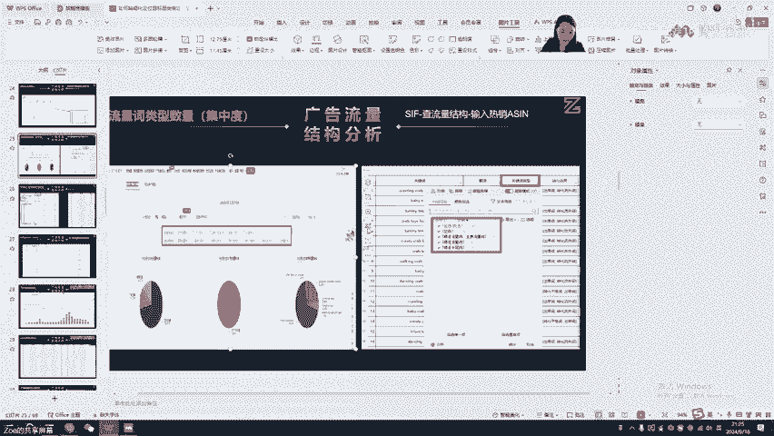

嗯。呃，PPT不分享了啊，这个本来那个是付费的一部分啊，是拿出来给大家去讲干货的。然后今天那个由于时间有限，所以第三趴啊，咱们就是下一次来分享ok不对不对？然后因为我今天已经讲了两个小时啊。

就是说干货实的太多了，就是真的那个一节课讲不完，对，然后所以说那个也欢迎大家那个加群，然后获取这个免费的这种工具，对吧？然后然后如果想要跟我见年啊，也也可以扫那个绿泡泡，对吧？这个右边这个是我的个人的。

然后左边的话就是说大家可以用我的折扣码KYCE啊，去享受这个88折的折扣。对。

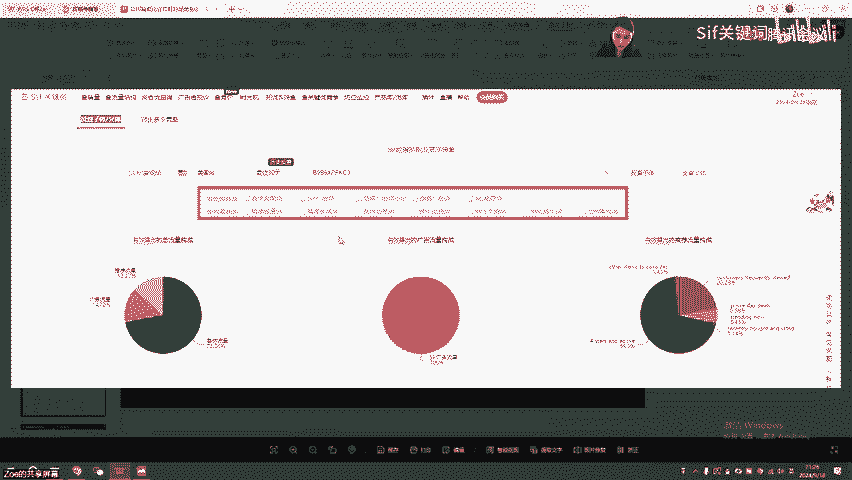

🤧嗯。对，然后看一下大家就是刚刚针对这个选品这个市场端，还有这个呃这个竞争对手的这个反查这个反推。那对于这两个爆款的这个asson的一些这个推敲啊也好，这个分享也好，大家就是有什么疑问的话。

可以在屏幕上打出来啊啊。对，大家可以用这个KYZOE的这个折扣码，享受88折扣。对，就是针对今天分享内容的话，有什么疑问，大家也可以在屏幕区打出来。嗯。如果没有问题的话，到时候那个绿泡泡联系也可以啊。

就是说今天我就讲到这里，对，也也给大家分享了将近两个半小时。对。Yeah。嗯。对，如果是那个sfe的新用户的话，可以直接扫扫码这个进这个福利群。对，如果是老客户的话。

也可以用我的ZUGKYZOE这个折扣码享受88折。啊。嗯，好的，辛苦左伊老师了。我看评论区大家都没有再发问题了，可能大家也需要一段的时间来消化一下今天的内容。对，今天那个讲的也会比较细一点。

然后内容也比较多，可能需要大家回去好好消化一下。对，那我们就下一期再把我们第三part的内容再分享给大家。然后后续我们会把我们的直播预告和今天的回放都发到群上，大家可以呃锁定我们的直播群。

然后后面在我们的视频号直接预约也可以。那今天的内容到这里就结束了。

嗯，好的好的好的，大家拜拜好的，大家晚安。下一下下一期，然后带着大家怎么就根据这个广告的目的啊去玩这个标品和非非标品的一些广告的一些思路啊。然后其就是呃欢迎大家关注下一期的直播内容啊。对。

直播群就是我们的那个福利群。然后呃今天的内容就到这里结束。然后下一期的内容我们会在群里面发布预告，大家就晚安啦，我们下播了。辛苦了，左怡老师。的好的，拜拜。好的嗯。😔。

