# 第87期【实践拆解竞品广告架构和策略】 - P1 - Sif关键词 - BV1JixgeJEqX

家里我一在屋分。hello，大家能够听到声音吗？看到画面哦。先先稍微等一波人进来，我们再开始吧。好的，正常。先等一会儿，我们先等一波人进来，我们再开始啊。那我们再等一分钟看看。最近我没有出来新的功能。

不知道大家有没有尝试去看。尝试去试用一下。大家知道我们新的功能是什么不？要不要先给你们透露一下？我们新的功能给大家瞅一眼啊。我看一下。会介绍的，到时候都会一起介绍。然后我看一下我那个网址放到哪里去了。

哦，在这里。最近我们不是有在大力宣传这个广告架构吗？现阶段的话就是已经放出来的功能嗯。已经放出来的功能就是这个广告架构。主要就是整合了我们的茶馆组这一块的功能。然后的话今天我们也有接到消息。

这个广告架构呢，它除了可以看我们的SP广告之外，还可以看我们的1个SBD跟SBV。但现在处于内测阶段啊。如果你们要想要想要说去做内测的话，可以联系我们的运营顾问去给你们翻开放一个内测名额。

你看之前是只有SP的。但我们现在把SBV还有SP的广告也给你们SB的广告，也给你们给。给呃，给抓取出来了。然后我看人进来的也差不多了，我们就开始喽。呃，先做一下自我介绍，就是我我是C府的运营顾问潘点点。

然后的话因为我同事他身体可能有点不舒服，所以就今天由我来讲。是的，这个功能看起来还不错。然后今天主要选的一个产品，它主要就是我们的一个运动运动水杯类的给大家看一下我们的基础产品的一些基础信息哦。哦。

们瞅一眼基础信息，那这个运动水杯呢，它的上架时间可以用我们的。这个。流量时光机的运营时光机来看，它其实是5月份上架的。也就是说我们在5月份的时候是可以。呃，是有数据的。

他5月份上架到我们至今就是9月份9月底。之前我们分析的时候，其实是8月底，它其实它的一个整体的排名就已经呃上升到了。100名小内小内100名以内，然后的话现在是稳定在100名以内了。

然后整体的销量其实可以用我们的这个它销量这个组去看一下它的整体销量其实也还好。其实它的一个销量是从。嗯，两三百左右突然就上升到了1000的1000加的这个销量。所以我们觉得这个产品还是可以值得去分析。

然后借鉴的。如果大家在这个有运动水杯的品类，或者是说有这个产品的话，也可以一起来看一下，然后主要的话我也是从三个方呃，两个方面去做分析。

一个的话就是呃去利用我们的这个运营时光机去帮忙拆解一下它的一个运营策略跟手法，还有打法。另外一个呢就是用到我们的查广告架构这一块，去拆解它的广告的一个推广的思路。

或者是说它广告里面主要的一个呃投放关键词，投放关键词是哪一块。对，主要是从这两个方面。然后的话就是呃基础的看一下，我们可以先了解一下这个产品啊。这个产品的话，它是呃37。99的一个价格在卖。目前是37。

99的价格在卖。然后的话整体的一个产品的图片的质量以及它的视频的质量也都是很OK的。我们大家可以看一下它视频。他这个视频拍的还是很不错的，整体的。🎼整体的质感，还有视频的逻辑。

就其实可以值得我们去借鉴的。🎼他把产品的一些细节啊，还有功能特点。🎼都给体现到了视频里面了。嗯我觉得这一款产品的话，它如果打SBV广告也呃也可以。🎼效果应该会还不错，但他没有打他打的一直都是SP广告。

然后这个是视频方面，然后整体的是有呃好几个变体，然后变体是有不同的颜色的。然后A加的话做的也还可以。那这些都是一些基础的信息。然后你看它的video下面都会有很多的关联的。呃。

视频说明他其实在前期的话是应该找了挺多的那种网红啊，自媒体去做这个产品的推广。哦，这个是一些基础信息。哦，整体现在是4点8分，之前看的话是4点7分，应该是有在做呃。

评评论的控制这一块也有可能是自己的产品也他这款产品本身也不错。然后这个是。呃，产品的基础的这一块信息，然后可以共享一下给。共享这个。PPT给到你们，然后PPT的话主要也是从运营的这一块。运营的话嗯。

我们在分析一款产品的时候，稍等啊，我切换一下。对我找齐。哦，来。稍等一下哈，我切一下PPT密经。Thank。

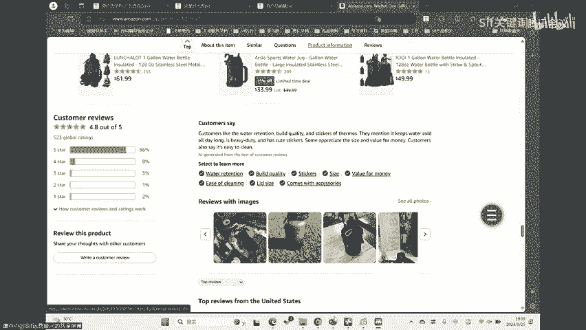

啊。不好意思啊，不太熟练。很久没有播了，就不太熟练这种。

然后我们再去呃。分析他的运营的动作的话，是可以在。呃，运营这一块的话，其实我们在主要是运营它最主要关注的点，其实就是产品的排名。那产品的排名的话其实会有两个影响因素，一个就是流量的变化。

另外一个就是产品的转化。那流量变化这一块就涉及到我们的关键词位置变化。就是说你关键词位置越靠前。那你这个流量肯定是也会越多的。然后关键词需求，对关键词需求其实就类似于市场的一个需求量。

你如果市场需求量大的话，你的流量变化也会比较。大，然后就是我们的站外流量，站外流量是我们经常在做新品的时候，会去刷一些站外。然后产品转化这一块呢，它的一个影响因素就是list质量影响。

就是如果是说你的listing图片标题，还有你的视频呃一系列的listing因素做的比较好的话，那你这个产品的转化也会受到影响。然后就是我们的评论评分这一块，前期的时候如果是说我们没有评论评分的话。

可能我们在做呃新品的时候，那个转换就相对来说会比较呃比较弱一点。如果是你的产品也没有什么优势的话，然后价格秒杀优惠券这些都会影响到我们的产品的转化这一块。然后除了产品排名之外呢，其实我们也可以。

所以我们可以根据这一块去挖掘它的一个竞品的一个广告的推广思路。那我这一块的话，经常是会跟呃经常是会按照这几个推广的思路去做分析的。一个就是根据它的产品的生命周期，我们运营产品的时候是有呃。

我们运营的产品是有一定的生命周期的。我们可以把它分为新品期，然后成长期稳定期防守期和断货期，这这呃这5个呃生命周期。那新品期在竞品呃在做什么？成长期的时候，它的。那我们的竞品有没有什么呃变化？

然后稳定期的时候，这个精品竞品的一个运营策略它是怎么去变的？还有防守期这一块的话是都需要我们去根据这个生命周期去做分析。然后在我们去给他分了生命周期之后呢。

其实可以去根据这个生命周期当中不同的生命周期的，他的一个推广策略再去做分析。比如说我们最关心的他的广告策略，还有他的一个站外策略。就是我们在推新品的时候，是会有一些客户，他是想要说呃会有一些竞品。

他是想要结合站外去推广我们的新品，然后还有一个价格秒杀策略，他是低价进入的，还是说高价进入的，还是说我们经常会做的那种。呃，高价加高去做的呃，去快速的抢占市场。然后还有一个就是评论评分的策略。

那评论评分的策略就是说他会有会不会有做呃合并变体呀，还有。还有什么僵尸僵尸呃僵合并僵尸链接这种。但是现在的话好像去合并僵尸链接，这这些是违规的，应该没有太多的人会再去搞这个。

然后就是说我们经常做的那个one计划，换计划现在不是有两个免费的名额嘛，我们可以呃就在这一块的话去做一个呃评论评分策略，然后其他策略，比如说测评啊，还有编辑，还有我刚刚说的那个更改节点，更改节点。

现在应该也没有那么容易去更改了。然后成长成呃，然后这个是推广的运营策略，推广运营策略之后呢。我们就需要看一下它的一个成长的一个效果。那成长效果就是比如说它的关键词的变化，那关键词的变化。

这边就涉及到了我们的一个关键词的排名。以及关键词的呃它的一个市场的一个需求。还有BSR排名变化。那这个BSR排名变化就是呃涉及到的就是它的呃BSR它是上升的呢还是下降的那这个流量占成呃占比情况。

就是它的自然流量占比还是广告流量占比多。就前期的时候，它可能是呃广告呃正常的一个。谈病的。前期的呃流量占比的情况，应该是前期应该是广告流量占比会相对来说比较多的。

就是它广告可能会它前期可能会说整体的一个广告订单会多一点。那到后期的话，如果这款产品它推广成功之后呢，它的一个呃自然流量占比就会相对来说比广告流量占比要多一点。但这种情况也是需要看它的类目以及产品的。

有些产品你就呃有些类目你就得说用广告去呃去维持你的一个流量和订单。但有些类目你的自然流量上升之后呢，它可以说把广告关掉，或者是说减少广告预算。然后其他效果就是销量这一块。

之前我们呃我们shiftF还没有上销量的时候，我们可以通过其他的软件去看销量的一个情况。但是呃现在我们有上销量的话，我们可以直接在查销量那里去直接看我们的一个呃销量的上升和下降的一个趋势。Yeah。

然后的话最后最后的话就是总结一下唉，这个呃新品期的时候，它是如何广告是如何去做布局的。然后关键词是如何去做选择的，然后做哪些对应的操作。这些是去整体的去总结一下在前面的生命周期跟推广策略的这个成长效果。

然后上升期的阶段呢，就是广告结构，它是如何做优化的，是调整优化关键词它是呃它的关键词的变化特点是什么？然后成呃。就是稳定期的时候，它的广告是不是又在变化，或者是说它的流量有有有有上升或者变化情况。

然后断货的话，它的广告是不是有在做重新拉起，还是说它的价格有在变化。因为断货之后呢，重推它其实就类似于在做新品。所以这个时候的调整，可能会相对来说比较多一点。

然后这个是我整个的一个挖掘的思路的呃呃逻辑在这里，然后的话我们就可以开始去。呃，根据这个逻辑去挖掘一下我们这款产品。然后这款产品的话是呃思路呃思路挖掘跟分析的话是用到我们的这个新出来的运营时光机的插件。

呃，这个插件的话呃，不知道大家。有没有知道我们的这个插件的？有没有知道知道的扣1。不知道了，扣2。帮我看看你们有哪些人知道哪些人不知道。我们的这个运营时光机插件。他是呃他是在。在我们的搜索页顶部这一块。

稍等，我切换一下。搜索页顶部就是这一块是可以看到的。然后在运营时光机这里，它默认其实展示的是近一个月的。但是我们如果是因为我选的是上架近三个月的产品，然后是5月份上架的。所以我这边选的是近3天的。

近3个月的一个情况。然后我们可以直接看一下它的一个价格策略。然后价格策略的话，从呃哦哦给大家说一下，就是。嗯，我把这个产品它其实是分为新品期上升期跟稳定期的。然后新品期的话是根据它的一个流量的变呃。

这个这个分布也是根据它的一个流量的变化来做区分的。然后的话就是根据产品特点跟流量。然后我们可以看一下，它在新品期的时候，它的流量是有缓慢上升的。然后的话前四周是定义为新品期阶段。

就是2024年5月5号到26号，然后上升期就是它的流量在缓慢上升的。然后就是呃定义在就是6月2号到7月中旬，7月14号，那稳定期的话就是呃。

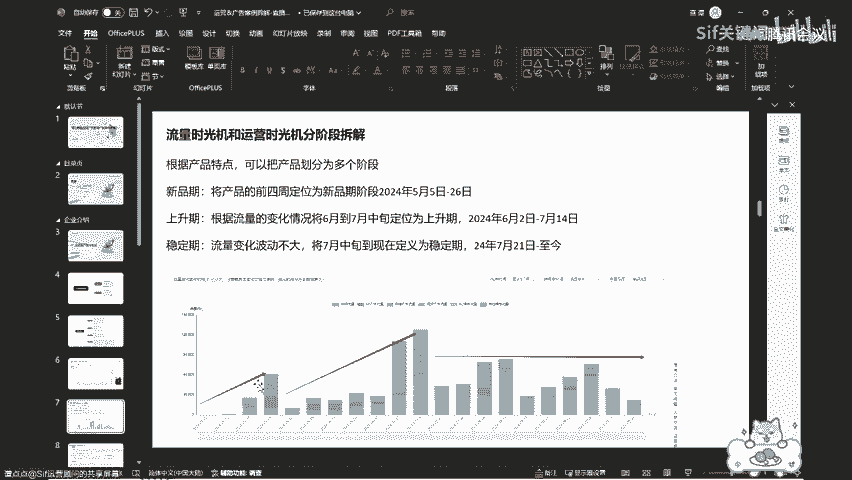

流量这一块的话波动性不大，所以我将它定义为7月中旬到现在是稳定期。但也有可能这个时候呢，他其实也在做其他的一些动作。但我们看流量时光机的时候。

还有它的广告后视仪式发现它其实是在78月份的时候是没有做什么广告动作的，以及它的运营动作的，所以我就把7月。7月中旬到现在定义为它的一个稳定期。啊，这个是呃我定义的呃它的。阶段产品阶段。

然后稳定期的时候，我们其实可以先看一下它呃新品期的时候，我们其实可以先看一下它的价格策略。就是如果是有呃如果是有我们小伙伴就是不太拿到一个新品的时候，不太知道我们要怎么去定价。

或者是说怎么去做一个价格策略的，我们其实可以参考这个竞品，因为竞品其实呃它的一个运营节奏跟运营的思路还是相对来说比较清晰的。这个是可以做借鉴的。然后我们也核算了它的一个成本。其实这款产品的话。

它它上架49。99，它整体的一个毛利率是在25%到30%左右的。所以他这个定价其实是呃是相对来说比较合理的。然后他上呃他上来定价是49。99，49。99的话，他是打了15%的cupon。

然后打cupon的时间也是在一周左右，就7呃就8号到114号左右，它是打了一周的cupon。但整体呃呃这个是价格方面的。也就是说它其实是高价，相对来说相对高的价格，打了中等的一个cupon的价格策略。

然后打了一周之后，因为我们新品期它是有一个月的时间嘛，打了一周之后呢，其实可以看一下，它其实是又在降低了它的价格，就是39。99这样子。降低价格之后呢，整体的一个价格策略。呃，降低价格之后呢，其实他的。

嗯。排名是有在上升的。你看他其实是有在呃，其实排名是从1000多的排名。上升到了500多，然后的话这个在第第二周的时候，他其实已经有了一个评论数三个评分，然后呃三个评分数，然后的话评分是5分。

我这边想的是他前期的时候在49。99%加55%的coup，可他整体的一个效果不是特别理想。所以是在第二周的时候就开始降价，再加上他的他有了评论评论，而且他的评论是其实是在5分呃5分左右的。

就说明其实他39。99，再加上评分数量呃，来了之后呢，他一整个的，你可以看一下他的一个自然流量。它一整个的自然流量是也是在缓慢上升的。呃，那这种时候呢，其实39。99再加上评论的话。

可以呃再加上评论的话，它的一个整体的效果会相对于呃没有评论的时候，然后加cupon的效果要好一点。那这个是价格策略。呃，除了价格策略之外呢，其实还有我们的那个。他怎么不动了？😔，还有一个站外策略。

但是站外策略的话，其实我们可以看得出来，我们用那个在外智慧看了一下这款产品是没有做站外的。但是看后续它的一个评分数上呃上的一个频率，其实呃也能够大致的猜测出它要么就是有自己的一个私域流量。

要么就是有一个自己的私域流量，要么就是他是自己在做一个刷单，自己在做刷单就是做。呃，自己的一个刷单动作，但是没有做站外。然后的话就是呃评论也是在第二周的时候开始有评论。随后的话就是每天增加评论。

他是在第四周的时候，评论数是张长到了20个评论的。我们可以看一下呃呃5月。5月285月19左右就已经上涨了二0平论，但这这这这就有可能是说他合并的编辑的一个可能性。然后整体的一个效果的话，呃。

我们可以用反查的反查去查看一下它一个整体的一个效果。它这个时候呢广告策略，其实你可以看一下它下面的这个这个小标签。A代表的是大A代表的是广告活动。嗯，小A呢它代表的是广告投放小组，这个要给大家解释一下。

因为这个密密麻麻的，大家可能不太清楚这个是怎么看的。然后你点进去之后呢。他就能够告诉你，他在这个阶段。开了哪些广告活动，投放了哪些广告组这一块。那广告活动跟广告组的话，就是他其实针对于这一个a。

它是在首页的呃呃首呃就是上家一周内，它其实是开了三组广告活动，然后基本上是以。ge water bottle为主的一个词组，广泛精准，这三种模式是全开的。然后看它的一个管僚份额，也是可以看出来。

它即使占了29。66%。啊，我们用反查给大家看一下。

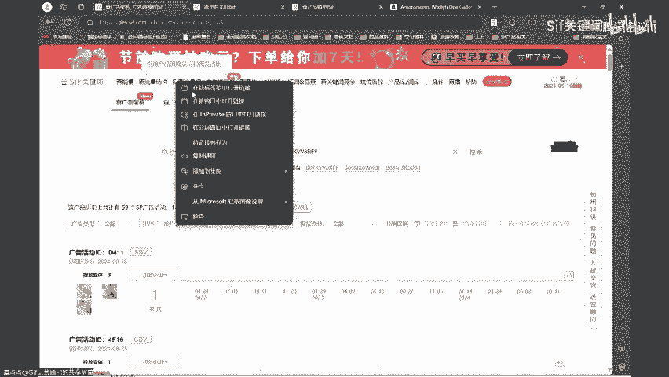

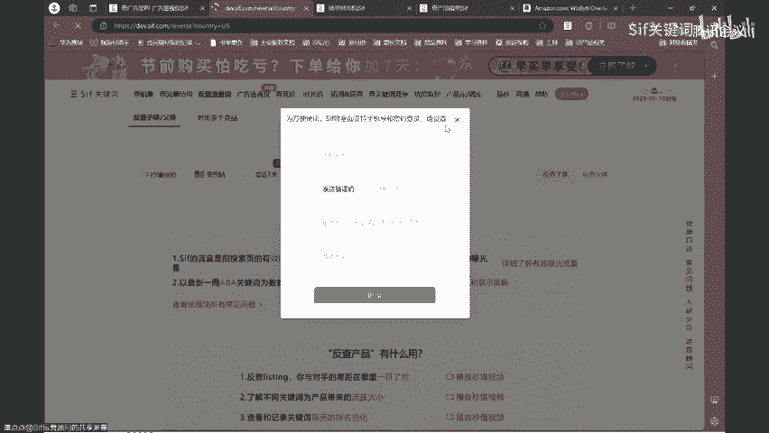

我们的反查其实也可以查历史的数据的哦，不知道大家。大家之前有没有做过5月份，然后看他的广告的一个数据。其实是整体的是占了29。66%，然后的话推荐是占了52。89%。

那它占整体的一个广告的流量份额是占了15。1。其实这个占比还是相在这个关键词下占比还是相对来说呃比较高的。也就是说它其实在这段时间是主打一个water bottle为主的一个精准广泛词组。

然后整体打的时候呢，这个效果其实可以用从我们的呃排名趋势这里看，它排名趋势其实自然排名，它其实在前两周的时候是已经有了呃一部分自然排名的。但是广告排名趋势呢。

它可能是呃预算方面或者是说呃整体的一个产品还没有说会有太多的评均分转化，导致它的一广告排名这一块是相对来说比较不稳定的。就是有时候有有时候没有有时候进入搜索结果前三页，有时候没有进入搜索结果前三页。

那这个是它的一个打广告的效果。这就是他新品期的整体的一个情况。然后新品期的话给大家总结一下。

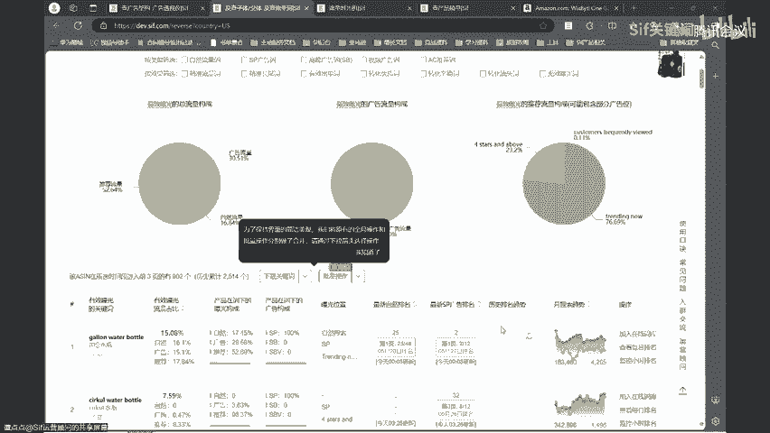

他广告策略其实是呃。呃，取得的一个效果就是。大家可以看一下，然后的话SP排名它其实是从无到小类的120名左右。然后流量的变化上看，就是它一整个的自然流量是在上升的。虽然是说上升的不是特别多。

但是自然流量确实是在上升，到时候可以给大家看一下那个总结的呃图片我们也可以看一下，这里从呃第一周到第二周到第三周第四周。那我们的一个除了呃推荐流量在上升之外，其实我们也可以看一下这个蓝色的柱子。

蓝色的柱子也是能够体现出它自然流量在上升的。那我们在第二周的时候呃，就是说它这个是新品期的一个策略拆解。然后上升期的一个策略拆解，我们可以看一下它的广告策略。广告策略它也是打了三组广告。

整体的话还是以跟water bottle为主的词组跟广泛投放。然后的话我们可以看只是说它还增加了一个water bottle为词根的广泛词组。但是这个广泛词组我们看了一个那个广告透视仪。

它其实是只打了一周的，打了一周就已经关停了。就是说明可能这个词组广呃这个water bottle为主的广泛投放是没有效果没有太大。

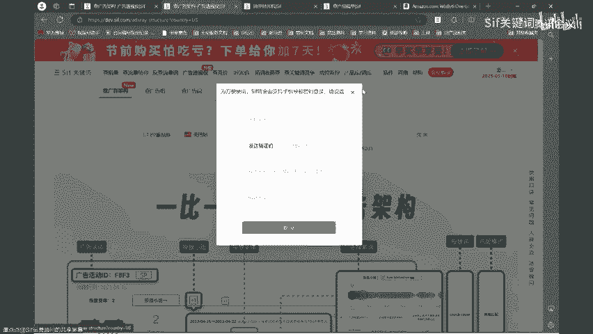

我们可以用这个去看。我们的广告透呃广告透视一场广告组也有了一些小小的改动，就是现在的筛选时间，它是默认6个月的。如果你要看全部的话，就得看就得在这里筛选时间，点击全部。因为有些嗯有些有些医审他的。

他的广告组跟广告活动相对来说比较多。如果你不点全部的话，你可能会遗遗漏一点这个。东西就是这个数据。然后我们在这里选择这个投放变体。稍等，我这个这个办公室的网有点不太好，明天给老板反馈一下。

这网有点不好哎。没得关系，我们可以继续。就这个他其实就打了一周就完了，就没有再打。我给大家看一下，然后它整体的第呃整体的从上升期。

也就是从这个时候到呃我们的prem day会员日的这两天的时候的一个情况。那它在我们会员日之前，它的一个价格策略，它其实还是测了一下呃价格加cupon的一个组合。

但这个时候它cupon的变化是相对来说比较大的这个呃一一个是它是呃前期是以5%10%来去做测试。但整体的测试结果，我们其实可以看得出来没有太大的一个效果。因为它的排名的话，呃变化不大。

然后的话后面可能是因为整体的一个变化不大，所以把它的一个价格放到了45。99。后面的话就是在45。99袋和39。99，这几个价格方便去。叫什么来回切换，来回波动。那这是价格策略。然后的话就是嗯评论的话。

评论分数是在涨的，但是这个时候呢已经掉到了。已经掉到了4。9颗星，也就是说他这个时候是有在呃差评，已经差评是有有做呃呃，有可能是拿到差评的。然后它的listing变化的话。

其实我们也可以看它的运营时光机下面不是会有一个小图呃小图标吗？那这个小图标的话，它是。它是代表着是这个产品，它是修改了主图的。我们可以看一下它修改主图的部分到底是修改了哪一部分。

那这个是相对来说比较细节的部分哦，就是他会把这个。7呃，这个部件给放上去了。就把这个小部件放上去，就可以点开给你们看一下。不点了，那个网太差了。看见没？他其实这里是没有那个小部件的，但他在这里时候就。

这个是。洗洗洗被子的那个小刷子。就放了这个是整体在呃在listing listing方面，它其实只做了这一个动作，然后价格方面是在4040。99或者39。99之间来回摆动。然后的话。呃。

主要做的相对来说比较多的策略是价格策略。然后广告策略的话，只是说新开了三种广告活动，其他的就没有太大的一个变化。但它整体的一个流量却在上升，而且它整体的一个呃排名啊。

还有还有还有主要的一些死根的排名也在上升。而且它前一周的前一个周期的。🤧。用发人茶。写一个周期。它的流量词的变呃，流量词的数量也在发生变化。就他5月份的时候，他的流量词其实是可以看出来它只有呃902个。

然后整体的一个gararywater bottle的一个广告流量占比是15。1。但是到6月份的时候，6月份和7月份的时候就会相对来说比较多一些。Yeah。你看他6到7月份的时候。

他一整个的呃6月份的时候，他进入前三页的关键词已经达到了101500了。也就是说它的呃这个产品的，它的流量入口是增加了，而且整体的订单量也是上升，处于上升趋势的，它6月份的时候其实是呃200家。

然后到6月份是600家。呃，7月份是1000家了。然后7月份也可以看一下。7月份的一个情况，7月份是相对来说比6月份要稍微少一点点，但是它整体的这个主关键词主关键词的它的呃排名，还有广告份额是在增加的。

我们如果我们可以看一下它主关键词的排名情况。主关键词排名的话，在7月份的时候就已经达到了首页首位，可能在7月前期的时候是排名是相对来说比较稳定的。但看这个阶段就是呃排名类会员之后。

它的排名会相对来说不够稳定。但是我们可以对比5月份跟7月份的关键词的一个情况。其实可以看得出来，这个呃这个产品它其实是以galon water为主的一个。为主的一个就是发散性的去做一个广告投放吧。

基本上是以这一个词根为主的。呃，关键词。他现嗯。整体的广告策略就是围绕这个关键词来做的。🤧那这个是上升期的，上升期的话给给大家看一下总结。我可能讲的话会相对来说比较乱一些。但看总结的话，大家就知道了。

🤧。就自然流量也在上升，自然流量上升的话也可以看。看这个小图。它整体的自然流量在呃prim day会员日这几天流量是达到了相对于前几个前几个周期是最大的。然后我们在呃在稳定期的时候。

就是它ra day会员日之后的一个状态，就是他没有再去增加广告组了，只是说维持原有的一个广告架构。那这个的话，我们其实可以通过广告架构这一块来看广告架构这一块的话，就是这里。

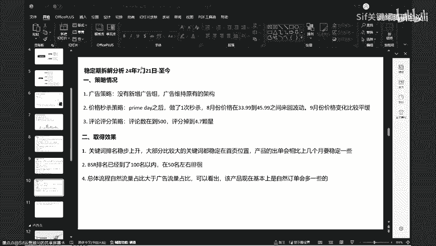

看一下，我看一下全部遍底。Deition。其实他在7月份的时候。他新增的只有8月份。新增了一个7月7月之后，新增了两个，但在8月份的时候就没有再去做新增广告组了。那个加一代表是广告组。

加一就代表真呃新增的广告组。那这个时候呢，其实可以看出来，他在这一块的话是没有再去新增的，而是维持原有的一个广告活动以及广告组。然后它的广告组跟广告活动的一个呃关键词是如何的。

我们可以通过呃流量时光记来看。你想要知道它具体的一个关键词的情况，就可以点击我们的流量时光机。我们看一下它的广告流量。广告流量在8月份的时候，其实d water是没有太大的一个。

单比的我们看它的影响程度。反倒是一些呃品牌呃品带品牌的。关键词会多一些，然后他的一个呃。一个广告位流量是在呃广告的位置的。排名是在上升的，但是在8月底的时候，8月初的时候又回到了这个主要。

以这个词等于这个主要关键词为主的一个广告词。那其实它整整一个生命周期都是围绕这个关键词来打的。嗯。😊，然后8月份是相对来说比较稳定的一个情况。所以878月份的分析会相对比较少一点。

然后广告策略是没有竞争。他们对会员它只做了一次秒杀。然后8月份的话，价格是在33。99。到45。99之间来回波动的。那9月份价格是变化相对来说比较平稳的。但是有一个情况就是它在78月份呃9月份的时候。

其实也呃也被跟卖过。然后那个时候呢，价格是跌到了20。99，但很快又被呃很快又把那个跟卖给打跑了，所以他到现在的一个呃取得效果是关键词，尤其是那些大词。我们可以我们。

刚开始看的那个反查里面也能看出来那个。关键词的排名情况是大部分的比较大的词是已经稳定在首页首位了，而且可以看出来它产品的出单就会相对几个月要稳定一点。

然后总体的一个流量的变化是自然流量是已经就在这个时候呢，它自然流量是已经大于了广告流量的。然后我们也可以得出它的一个产品，基本上现在自然订单会多一些。然后整体的话就是这个在运营打法这一块的话。

这个运营是相对来说比较成熟，有节奏的。然后它每个阶段的话都会有对应的方法呀进行调整。新品期，它是如何规划自己广告的评价。然后成长期的时候，就如何进行广告优化呀，还有秒杀降价。

配合旺季的一个流量来进行流量跃升。这是它的呃运营这一块的一个拆解跟思路，还有我们的总结分析。然后现在就是广告架构拆解。广告架构拆解的话，就用到我们的新出来的这个广告透视仪。这是我们的广告架构。

然后呃因为大家对这个广告。

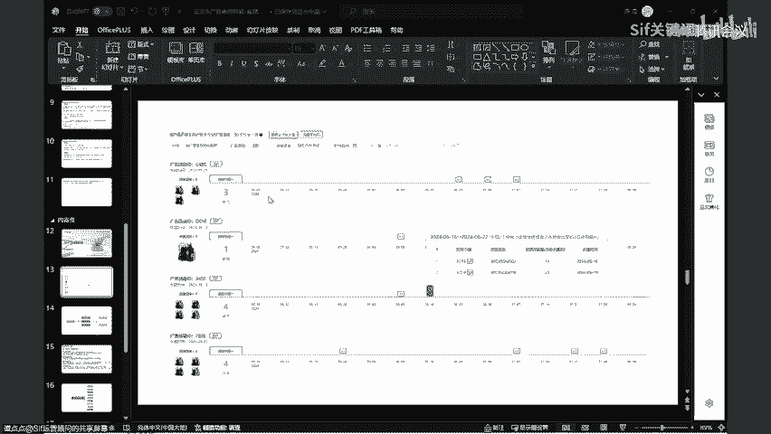

透视仪可能会相对来说比较陌生，或者是。有时候不太懂这里面的逻辑，我想问一下，大家就是用过我们的广告透视仪的人多吗？然后然后能明白的能用明白的有没有人就是广告透视仪的话，用过的可以扣一吗？没有用过的扣2。

不明白的扣3。有没有人？是吧不太会用。我那明白了，运营时关记在哪运营呃。运营时光机在插件上面，然后插件上的那个。小企月进步。产品的详情页顶部。喺这里。😊，这个上面也是我们新增的这个功能。

我看来不会用的还挺多的。嗯。这个的话给大家。这个的话给大家稍微说一说我们的底层逻辑啊，我们这一块的话是根据呃亚马逊后台的那个广告活动，广告组以及广告组下面的投放时来做的一个整合呃整合链接。

就是他是他之前查广告组是直接把呃把产品的广告组给直接给拉取出来了。但是查广告架构呢，他是把呃产品的广告组给收敛了，收敛到这里了，然后把广告活动给放出来了，广告活动，然后广告组对应的这个广告组。

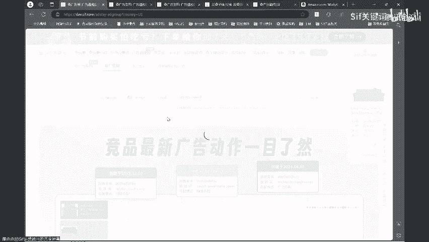

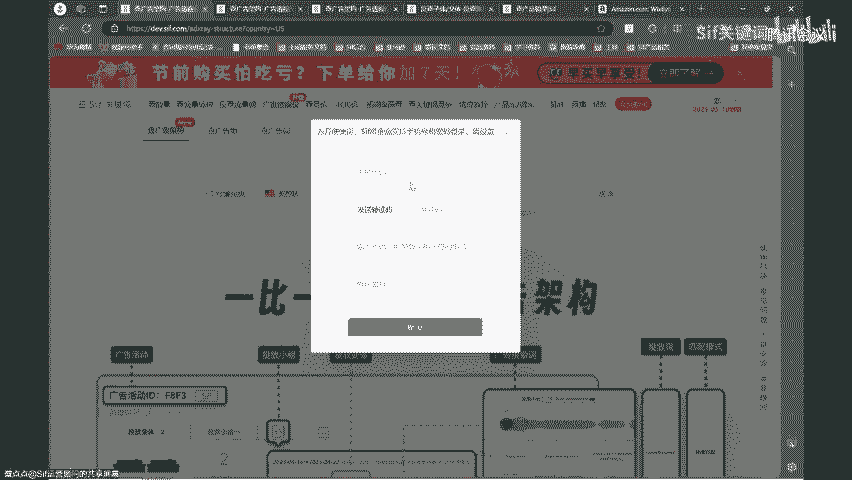

然后的话广告组的话是下面的投放词跟匹配模式，这个是可以根据这个的搜索词的数量来去去来去进行判断的。然后还有一个点就是嗯。点进去之后。大部分客户可能会对这里的这个小圆圈会有点疑惑。

就是不知道这个这个气泡它代表的是什么意思。那这个气标呃，这个气泡它代表的是搜索词的，数量的大小，气泡越大代表的是搜索词的数量越大呃，加一加二是什么意思。加一加2就是加一就是增加了。

就是在这个时间段内增加了一个广告组。然后加二的话就是在这个时间段内增加了两个广告小组。这个意思啊。他他他他不是说呃一个编题，两个编题这样子，他是广告小组的意思。う嗯ん。😊，🤧Yeah。

然后这个气袍大家有没有懂？气泡式搜索词啊，就是有有呃有些客户他可能也会问到这个搜索词太多，然后是不是客户呃，是不是亚马逊后台的一个投放词，这个不是后台的投放词，就是说就是投放词出来的客户搜索词。

然后呃客户搜索词，如果现在你们要去判断投放词和匹配模式的话，现在是需要你们自己去根据自己的一个运营经验，以及他的一个自然。呃，自动自动手动还有广泛的一个匹配逻辑去进行判断。但是后续的话。

我们是会直接帮你们把这个广告搜索词，然后去去分析出它的一个投放词跟匹配模式的，就是自动帮你们去做一个分析。就相当相对来说会比较方便一点。那现阶段的话就呃呃就就就只能先做到这里了。下一个版本我们就更新了。

不要着急。然后广告的话就是呃这里可以给大家看一下怎么去拆解广告。因为现阶段的话。我们还是要自己动手拆解的，没得办法。冇。

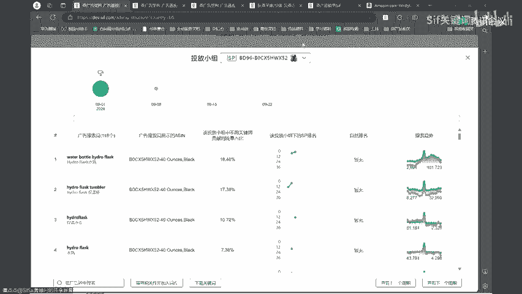

气泡是指搜索呃客户搜索词，就是你做投放的时候，然后出来的一个客户搜词。然后我们在在拆解广告架构的时候，要先了解我们广告透视仪的一个广告组的规律。这个也可以大家大家拍照截图。先到先得。等下就没有了这个。

大家可以拍照截图哦，然后精准广告的话是小圆点波动一般很小的，就是所有词也比较稳定。然后数值相对来说比较小。这种的话就是我们可以直接判定为就是大概率它是一个精准投放。

你可以看你可以你也可以点击它对应的那个小圆点查看每期的关键词的一个变化。但没怎么变化的那大概率就是精准。但词组的话呃，词组它其实。每一期的关键词，它呈现的某个词跟或者某个关键词就是会相对来说比较有规律。

因为词组的话，它是在前后加词的嘛。如果是说前后加词一直是属于这种规律性的那这个就词组广泛的话，广泛跟字。广泛跟自动会相对来说比较难去做判定。因为现在广泛跟自动的那个词啊。

就是呃亚马逊不是它改变了一个它的一个广告逻辑吗。所以广告广泛跟自动会越来越泛，而广泛会越来越犯，自动也会越越犯。所以这个时候呢就很难去界定广泛跟自动的一个呈现的特征。所以还是需要你们去。

根据自己的多年的一个运营经验去做判断。🤧嗯。好。然后广告拆解的话就是拆解之前也给大家去呃总结了几个广告布局的一个玩法，就是行业里面的不同的广告布局的不同的玩法就是呃。自己总结的我看一下啊。

自己总结的忘记了2462468呃，9个9个，就是还有其他的。

然后一个是自动否定法，就是大家。嘅。经常用的。等一下哦。

怎么没有了？😔，佢来啦。可了。还有一个是自动否定法，就是拍自动，然后我们开始否定关键词。然后另外一个就是呃大词否定法，就是把大词给否定了，我们去打长尾词。

然后特性特性玩法就是以关键词以产品关键词词根为角度。然后的话就举正式的去进行这个广告投放，然后又就是我们经常说的那个螺旋打法就是低价进场，然后每次涨价0。5美金啊，0。2美金啊。

我以前做这种低价螺旋打法，就是每次都涨0。2美金。呃呃，如果是说效果差的话，就价呃降格0。10。3这样子反复去。这个是那个广告，它在哪个阶段是相对来说比较效果比较好的。

然后就是有一个呃然后就是渐进式打法，渐进式打法就是呃之前大家说的那个农村包围城市嘛，就先搞长尾词，把长尾词搞上去之后呢，就在做那个核心词，就是我们的核心词干。然后还有一个就是海王呃海王海王玩法。

就是一个词，一个广告组。这个的话一个一个广告活动，一个广告组，然后一个广告组里面放一个词。这种的话，如果是。相对来说有很多关键词的，或者像做服装类目的，做那个鞋子类的呀，这种的就不太建议去。

因为你可能那个。呃，广告组会非常多。no。管理起来会比较困难。还有一个是呃大慈暴力法。那这个。大词到大词暴力法就是你你以那种核心大词为主去打的这种的话就花的那个预算位相对来说比较多一点。

这种适合那个应季应季的，还有节日节日的产品或者是快消产品去打，然后阶替式打法，阶替式打法，就是呃有紧密到宽泛，然后或者是说有广泛到精准，大部分是会先紧密，然后到宽泛。

或者是说有一些他想要一上来就想要呃扩充自己的流量的，或者是说想要扩充自己的想要增大季的曝光的，他就会有广泛去打，然后慢慢过渡到精准。还有一种是漏斗式的打法或者过滤打法就是。就是。呃，出口。他打的官司。

他是。先开始是精准，然后的话开口就是不限，就可能他会后期会做一些关联流啊其他的。然后除了这些玩法广告玩法之外呢，还有还有什么我之前学到的那个点漏打法，就是就是呃以低价低价去出，比如说0。05美金啊。

出价。然后的话专门跑一些小词啊，或者是说专门跑一些大词这样子。呃后还有是说首页置顶，首页置顶或杠杆玩法，就是竞价策略使用杠杆。比如说呃比如说出价是0。1美金首页置顶杠杆百分之呃900这样子。

这个好像呃我看最近好像也有人在去试这种首页置顶法，或者是说杠杆杠杆打法。嗯。然后其他的就没呃其他就没有了，基本上是这些大家经常玩的一些广告打法，就给大家都总结出来了。

比如是呃如果是呃大家还有其他的一些广告打法的话，也可以欢迎去放到这里来。然后大家一起讨论。啥时候上上啥呀？自动识别啊，就是可能在。国庆之后吧。国庆之后可能会上匹配策略。

然后的话也也是大概率是呃SP广告线上。然后SB跟SBV还没有。还可能是往后上一上。然后大概知道了这些我们的广告的底层逻辑。还有它的一些广告规律的变化特点，以及我们的一个广告布局玩法，我们就来看一看。

就是去分析一下它的广告。就是我们把。我们把这一款产品的它的一个广告架构给分析出来了，这花了我们很长时间的，确实应该像那个自动投放的。不然我们要累死，我们自己也要累死，大家也要累死。会分享PPT吗？会呀。

这个PPT到时候会分享给大家。然后可以看哈。他5月份的时候总共开了是246个广告活动。然后6个广告活动呢，其实前两个广告活动它是呃以water bottle，还有whatja的为主的一个词组广泛去投的。

然后投他其实以整个的广呃广告组，它是持续到了至今，就是它持续到至今呃呃。他持续到至今有两两种原因是确实这个广告组它的一个效果是相对来说比较好的。然后第二个就是可能是呃对，也就是它效果比较好，在哪里分享。

我们你们去找那个吧，运营顾问吧，到时候我给他们。然后直接给给给那个PPT给到你们。然后这个广告活动就是。前期他打的是呃water bottle，后期是新增的galon water bottle的。

这个的话就是可能是前期这个water bottle词组，他觉得可能他的一个流量变化呃流量。已经上线了，所以就加了一个ga water bottle。然后这个的话就是大家可以看一看，就是A森定位。

我们也可以分析出来，就是它的A森定位广告是以呃A森定位广告的话，我们也可以看唉，它它是由液体，还有tly的一个A定位的。投放，然后词组广泛，基本上他这一块的呃这个链接它的所有的，不管是这一条的A的广告。

还是说另外几条的A森的广告，它其实大部分拍的都是词组跟广泛，精准的话是相对来说比较少的。也为可能精准的花费，还有预算会相对比这个词组跟广泛要多一点。然后详细的话，我给大家分享一下这个资料。ど啊。嗯哼。

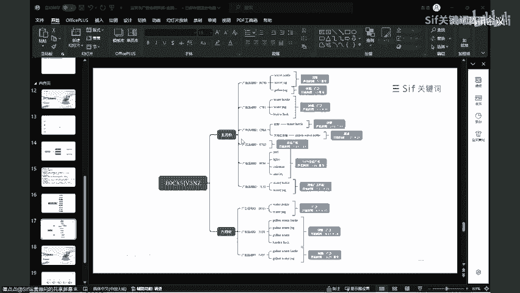

在哪的，在这。这个后续可能也会发。看到没？大家看到没？会不会冲突开这么多组，他每个组的关键词也不是特别相同啊，应该不会冲突啊。哦，广告架构拆一起可以。

那这个的话我这个文档我们是把呃它的广告组里面的变化给呃给大家给猜出来了。这四个广告组，我们只拆了两个广告组。然后分别是7月21和7月28号开的。然后的话整体的第一周，它是把它拆成了第一周。

它只有一个搜索词进入了结果前三页。然后第二周的话是没有跑出数据的。

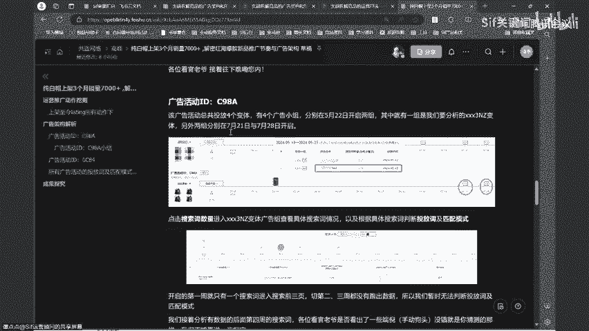

然后的话所以这个时候呢，我们就开始分析了第四周的。适中的看基本上都是water bottle的一个搜尔词的。所以他其实真的是以water bottle为主。

然后100个词是以这个water bottle为主的，是根我们看小节吧，看这个。乐词。只在第四周第十周的时候。第十周的时候，他是家了个人家人，家人，我才不懂。

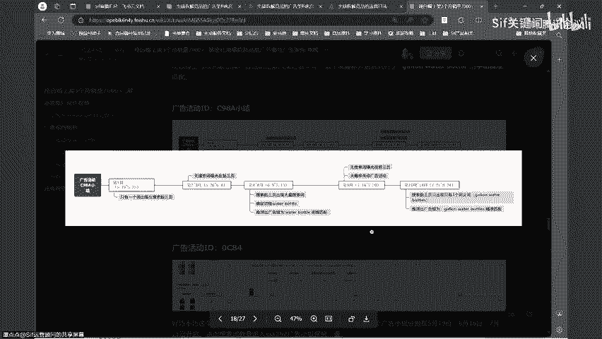

不要不要喝水，马上结束了。然后第二个的话也是这个这个文档分析的会相对来说比较细致一点。然，到时候也给也呃这个分析的是呃A定位A定投的这个情况。因为我们发现它基本上所有的关键词里面都有品牌词，看re。

还有t这些。然后第一半的词就带品呃带品牌，然后。然后我们是。刚开始是拿不准投放值跟匹配模式的。所以在第三周的时候也看了一下，要么就是自动，要么就是广A层定位。但是自动的话就是它跑出来的词。

我们都知道它的一个词汇相对来说比较乱的。

然后呃前期但是我们看他编写listing的时候是没有什么问题的。所以我们基本上就给他呃给它定义为了A层定A定投。然后如果大家对A审定位广告，你们想要知道它的一些原理跟知识的话。

就是我们可以看这个文档就是颠覆任知A定位广告的全新发现。我们老板写的哦，很有参考价值。干货满满。然后这里也有呃也有给大家总结一些推理的规律。词所有词的数量，然后根据所有词的呃数量的波动。

然后缩有词的集中程度这些来去进行判断。然后如果大家呃也对这个推理的规律总结感兴趣的，也可以联系你们的运营顾问去呃呃呃去领取。这个也在我们的呃广透视宜里面也有文档。

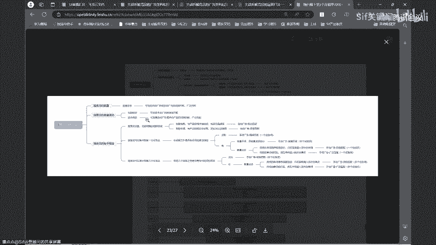

🤧嗯。

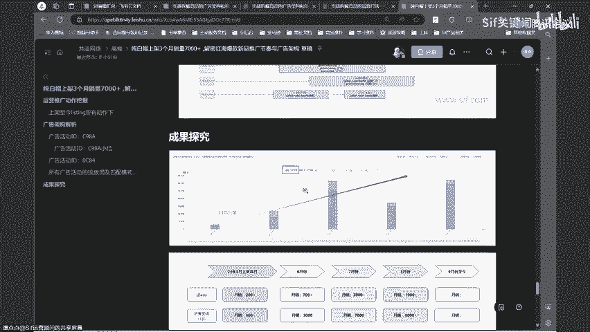

然后这个也是我们总结的广告架构跟匹配模式，有兴趣的也可以来找哦。

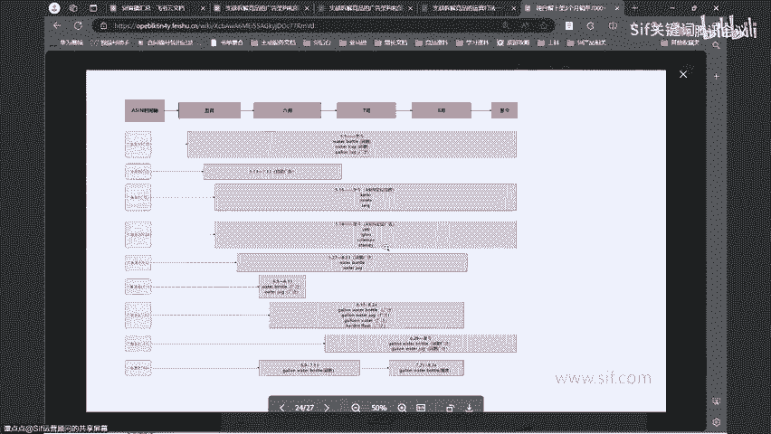

然后成果展现的话就是。

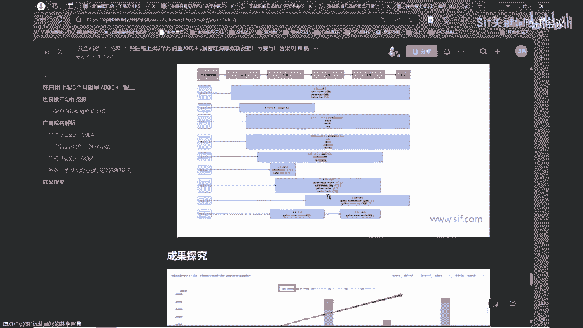

嗯，我们可以看一下，他在5月上架的时候是200家，6月份到700家了。然后8月份7月份的时候就2000家，7月份2000家给大家解释一下，因为7月份有prim day会员。

所以它这个这个波动会相对来说比较大一点。基本上所有遍题也是一样的。所有遍题的话，他第一个月是800，第二个月是3000，然后这样子的。

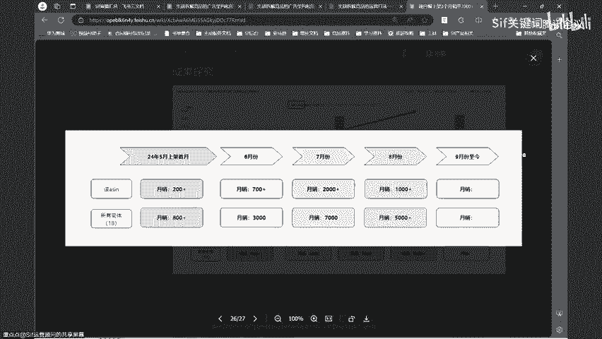

然后我们今天的主要的一个运营跟。🤧嗯。😊，广告拆剪我们就分享到这里喽。

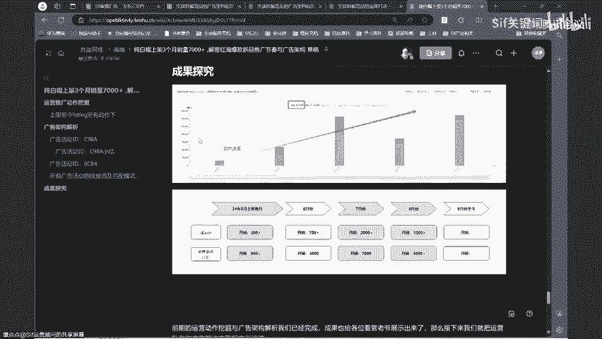

PT呢，我在这里。然后这边我们自己也总结了一下。其实他整体的一个推广思路跟广告架构都很清晰的。大家如果要学的话，可以。可以按照他的去学。好，因为今天时间有限。咱们就分享到这里。Yeah。一想时了。没了。

A定位怎么识别？A审定位的话。这个电脑有点卡，怎么回事？我要给你们展现一下。

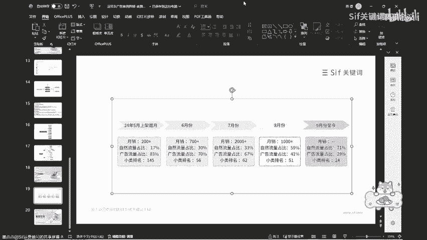

嗯。卡到了。我怎么退出来了，等一下啊。

等下我都要卡住了。嗯。我我要展示官网。知道。😔，有个专门的A定位广告的工具，我们的功能。在这里没有嗯。不是吧。大家稍等一下，然后我们这边网络可能有点问题。然后点点老师这边再操作切换一下。对对对。

要换电脑了，明天马上就跟boss反映一下，给我们换个电脑。嗯。卡成PPT了。是等呀，对点点一下看什么东西。看到吗？看不到啊。嗯。重新进录一下。

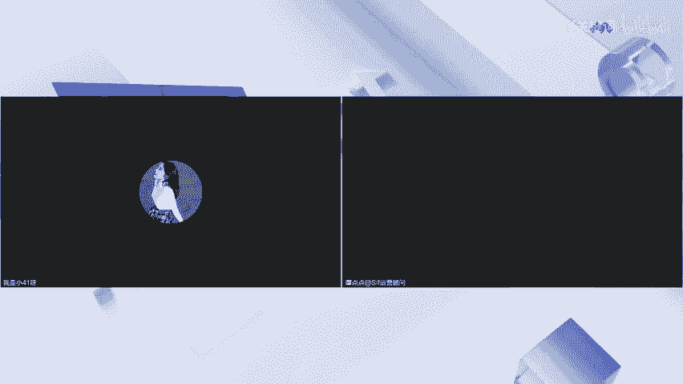

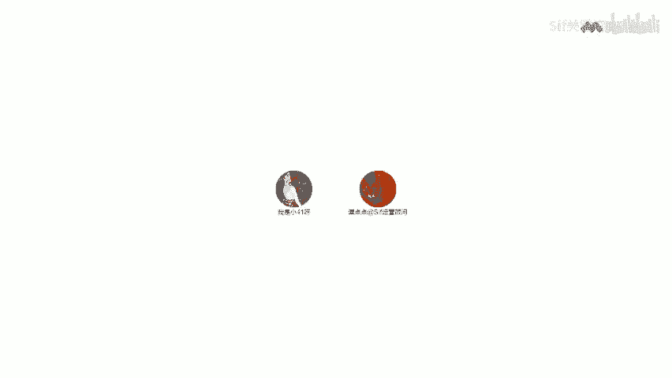

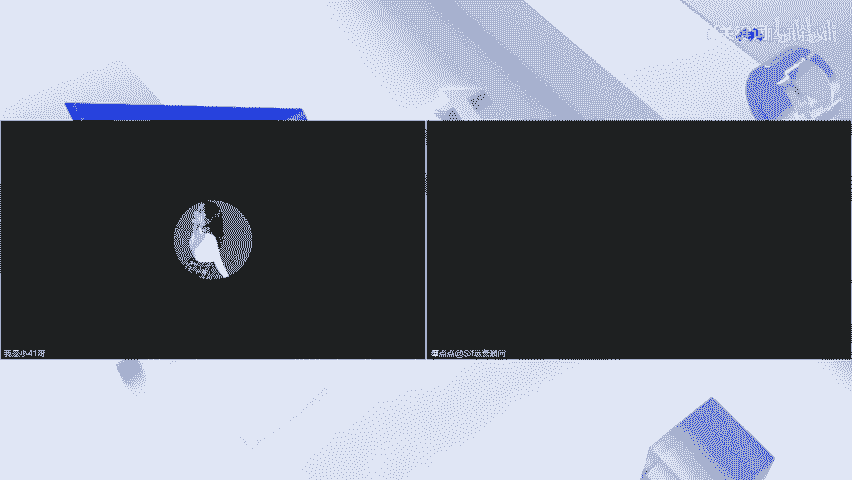

好的，来了。嗯啊。这里的话是可以呃识别A层定位的。但你说要在查网查广告组或者是说查广告架构这里去识别A层定位的话，可能会有点有点有点困难。

现在除非是你遇到了像我们刚刚说的那个有呃基本上都是每一个关键词都大部分关键词都带了品牌的。而且关键词是相对来说比较集中的这种的呃，可以把它大概认是A层定位投放。然其他的话，如果是没有那种带品牌的。

然后A审定位的话，就比较难判断。

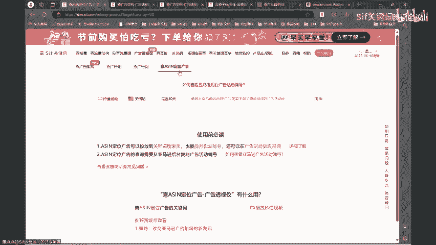

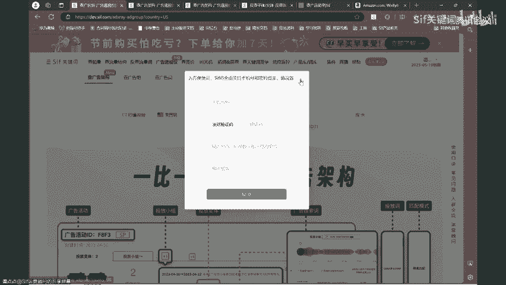

PPT怎么领取？PPT的话嗯，你们找运营顾问吧，到时候我发给他们。就给大家把这个PPT分享给大家，或者呃我们应该有那个群来的，可以在群里面问有没有？有没有问题？但品牌的也不一定会是雷神定位。

只是说我们这边。我们这边相对来说比较熟悉这个产品。出现西雨的也可是定位，有可能哦。在哪里？在我们的在我们的shift视频号上面，或者我们这里有直播的板块，也可以在这里看。

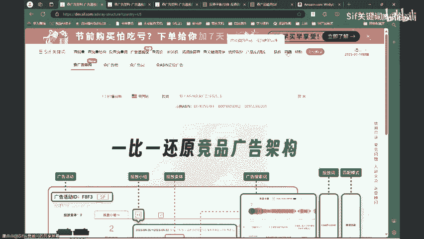

可以关注扫码，关注我们的视频号。

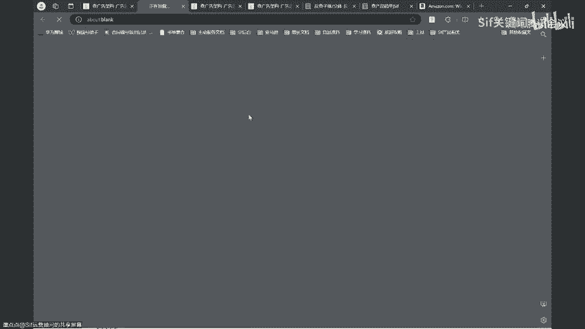

然后每一期的直播的话，这都会有。都会给大家上传过来这个直播要不就是明天上传，要不就是后天上传，他总有一天会上传的。大家着急的话，可以在视频号里面的直播版快钱看都是一样的。然后运营顾问的话。

大家如果有加运营顾问的话，直接在你的微信搜索框里面输入系出来的那一个就是你的运营顾问。如果没有加运营顾问的话，可以去幸福的官网。嗯右下角那边有一个小框，然后点击添加运营顾问就可以了。有回放的。

每一期都有回放。大姐大家还有什么问题吗？没有问题就没有问题的话，我们QA环节就结束了。就播咯。运营在哪里找？你的搜索框里面有没有那个运营顾问，就搜索sfe微信搜索框搜索sfe，或者在我们这里。

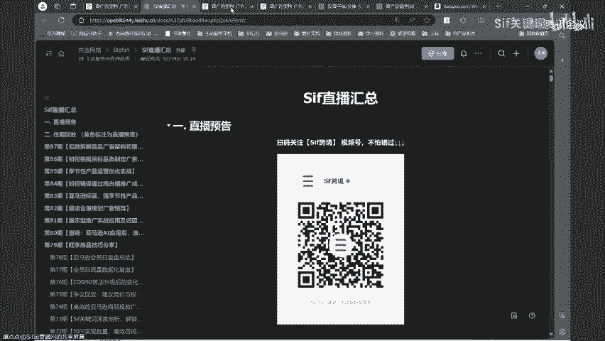

这不是有个语音顾问吗？在这里，直接扫码。扫码添加就可以了。现在有听清楚不？Yeah。好。那那那那我们下播了。有事儿有事儿，咱们私下聊。好的好的。辛苦点点老师了，大家有事的话，直接群里面找我们点点老师。

找我们运营端。

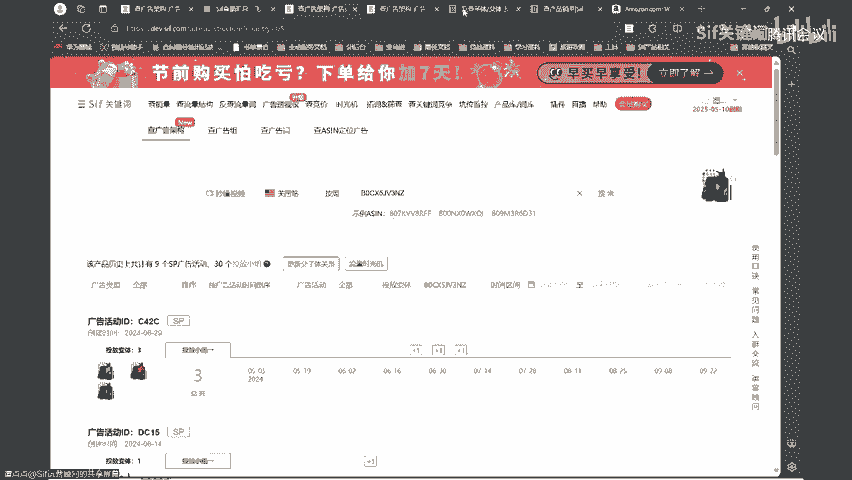

有微信群的。呃，也可以在这里看呃，我刚刚点的那个T。

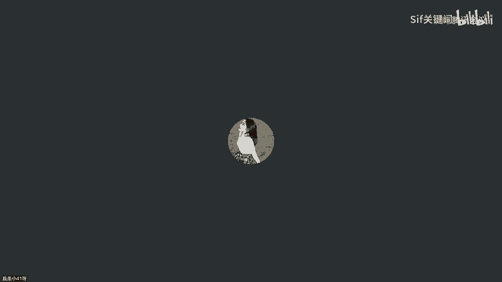

好的，大家可以扫一下屏幕上面的这个幸福交流群二维码，然后有任何的问题都可以在群里面提问。然后我们的运营顾问的二维码是可以在这边添加。就是官网的右下角。还有就是我们现在国庆有一个活动，就是国庆前如果下单。

买幸福会员的话，我们可以免费给大家增加7天的使用时长，也就是加7天的会员。如果大家有需要续费的话，或者是有需要新购呃，买会员的话，都可以在国庆节前下单还是很划算的。群码群码在这边大家可以扫一下。

然后大家可以自己去登录seif官网里面去找。扫下，然后再。西天太少了，西天已经很多了。我们直播间抽奖，抽中大奖的才一个月的体验呢。OK那没什么问题的话，我们就下播啦。然后大家下一期直播再见。

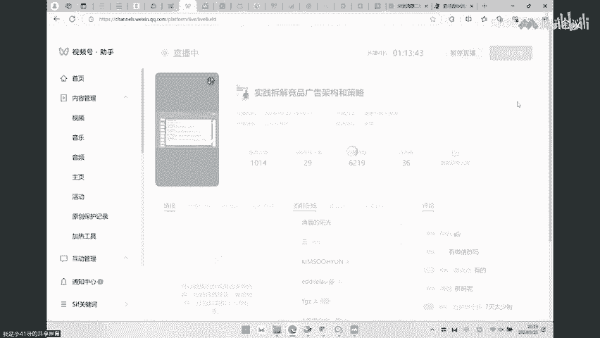

Goodbye。